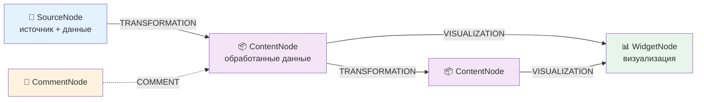

<div align="center">

# 🚀 GigaBoard

### AI-Powered Data Analytics Platform with Infinite Canvas

**Создавайте data pipelines визуально. Трансформируйте данные с помощью AI. Генерируйте визуализации автоматически.**

[Документация](docs/README.md) • [Архитектура](docs/ARCHITECTURE.md) • [API Reference](docs/API.md) • [Примеры использования](docs/USE_CASES.md)

---

[-blue.svg)](https://www.python.org/downloads/)
[](https://reactjs.org/)
[](https://fastapi.tiangolo.com/)
[](https://www.typescriptlang.org/)
[](LICENSE)

</div>

---

**Актуальность (март 2026):** полный индекс документации — [docs/README.md](docs/README.md), текущий фокус разработки — [.vscode/CURRENT_FOCUS.md](.vscode/CURRENT_FOCUS.md).

---

## ✨ Что такое GigaBoard?

**GigaBoard** — революционная AI-powered платформа для data analytics, где **искусственный интеллект становится вашим персональным data scientist**. Вместо написания SQL запросов и pandas кода, вы просто говорите что нужно — и AI делает всё за вас.

### 🎯 Почему GigaBoard уникален?

**Проблема традиционных BI-систем:**
- ❌ Статичные дашборды — нужен разработчик для изменений
- ❌ Закрытые black-box решения — непонятно откуда данные
- ❌ Ручное написание трансформаций — нужно знать SQL/Python  
- ❌ Отсутствие контекста — каждый запрос с нуля

**Решение GigaBoard:**
- ✅ **Динамические визуализации** — AI генерирует код HTML/CSS/JS по вашему запросу
- ✅ **Прозрачный Data Lineage** — видите полный путь данных на визуальном канвасе
- ✅ **AI пишет код за вас** — просто опишите что нужно на естественном языке
- ✅ **Итеративный диалог** — AI помнит контекст и улучшает результаты

<!-- TODO: Добавить screenshot или demo GIF после деплоя

-->

---

## 🚀 Уникальные возможности

### 1. 🤖 Multi-Agent System V2 — Команда AI-специалистов

Не один AI, а **9 core-агентов** в контуре **Orchestrator V2** (единый путь выполнения) и обмен через **Redis Message Bus**, плюс **QualityGateAgent** для проверки данных pipeline (`execution_context`, полные DataFrame). См. [MULTI_AGENT.md](docs/MULTI_AGENT.md).

| Агент                 | Роль              | Суперсила                                                       |
| --------------------- | ----------------- | --------------------------------------------------------------- |
| 🧭 **Planner**        | Планировщик       | Декомпозиция задач, адаптивное перепланирование                 |
| 🔍 **Discovery**      | Поиск             | Поиск в интернете (DuckDuckGo), каталогизация источников        |
| 📚 **Research**       | Исследователь     | Загрузка контента по URL, извлечение текста                     |
| 📐 **Structurizer**   | Структуризатор    | Извлечение таблиц из текста/HTML                                |
| 📊 **Analyst**        | Аналитик          | Анализ данных, инсайты, паттерны                                |
| 🔄 **TransformCodex** | Код трансформаций | Генерация Python/pandas кода для обработки данных               |
| 🎨 **WidgetCodex**    | Код виджетов      | Генерация HTML/CSS/JS визуализаций (Chart.js, ECharts, D3)      |
| 📈 **Reporter**       | Отчёт             | Финальный ответ пользователю (текст/код)                        |
| 🎯 **Validator**      | Валидатор         | Проверка результата на соответствие запросу                     |

Отдельно в pipeline подключается **QualityGateAgent** (проверка данных в `execution_context`, согласованность с шагами анализа).

**6 satellite-контроллеров** (UI-сценарии → ядро): **TransformationController**, **TransformSuggestionsController**, **WidgetController**, **WidgetSuggestionsController**, **AIAssistantController**, **ResearchController** (источник AI Research, `/research/chat`).

**Пример workflow:**  
Пользователь: «Покажи продажи по регионам» → Planner → Analyst → TransformCodex (код) → WidgetCodex (виджет) → Validator / QualityGate → интерактивная визуализация на канвасе.

### 2. 🧩 Source-Content Architecture — Прозрачный Data Lineage

**SourceNode наследует ContentNode** — хранит и конфигурацию источника, и извлечённые данные в одной ноде. Связи задают поток данных:

```
📁 SourceNode (данные в content) → TRANSFORMATION → 📦 ContentNode → VISUALIZATION → 📊 WidgetNode
     (источник + данные)              (Python-код)      (обработанные)                  (HTML/CSS/JS)
```

**9 типов источников данных:**
- 📄 **CSV, JSON, Excel, Document** — файлы (парсинг, smart detect для Excel)
- 🗄️ **Database** — PostgreSQL, MySQL, SQLite (асинхронные запросы)
- 🌐 **API** — REST с auth, retry, pagination
- 🤖 **Research** — AI Research (Discovery → Research → Analyst)
- ⌨️ **Manual** — ручной ввод (таблица)
- 📡 **Stream** — WebSocket/SSE (Phase 4)

**Преимущество:** Обновили источник? Downstream трансформации и виджеты **пересчитываются автоматически** (replay) — полный data lineage на канвасе.

### 3. 💬 Итеративный AI-чат для трансформаций

**Transform Dialog** — не просто генератор кода, а полноценный AI-ассистент:

```
Вы: "Отфильтруй продажи больше $1000"
AI: [генерирует код] df[df['amount'] > 1000]
    [показывает live preview с результатом]

Вы: "Добавь группировку по регионам"  
AI: [улучшает код] .groupby('region').sum()
    [обновляет preview в реальном времени]

Вы: "Теперь pivot по месяцам"
AI: [дорабатывает с pivot_table]
    [финальный preview]

→ Сохранить трансформацию
```

**Ключевые фичи:**
- **Dual-panel layout:** 40% чат + 60% live preview/code
- **Monaco Editor** встроен для ручной доработки кода
- **5 категорий suggestions:** aggregation, filtering, joining, reshaping, enrichment
- **Edit mode:** возобновление существующих трансформаций с историей

### 4. 🎨 AI-генерация визуализаций — WidgetCodexAgent

**WidgetCodexAgent** создаёт **полный HTML/CSS/JS код** визуализаций из WidgetDialog (итеративный чат + preview):

- ❌ Обычные BI: выбор типа графика из ограниченного набора  
- ✅ GigaBoard: генерация кода под ваши данные (Chart.js, ECharts, D3)

**Безопасность:** только CDN, запрет eval/Function; автосанаторы кода.  
**Click-to-filter:** виджеты могут вызывать глобальные фильтры (Cross-Filter).  
**Auto-refresh:** при изменении данных виджет обновляется автоматически.

### 5. 🧠 AI Resolver — Семантические операции внутри трансформаций

**Революционная возможность:** вызов AI **прямо внутри сгенерированного кода**!

```python
# Обычный pandas — НЕ справится с семантикой
df['gender'] = ???  # Как определить пол по имени?

# GigaBoard — AI Resolver
df['gender'] = gb.ai_resolve_batch(
    df['name'].tolist(),
    "определи пол: M или F"
)
```

**Примеры семантических задач:**
- Определение пола/возраста по имени → `gb.ai_resolve_batch(names, "пол: M/F")`
- Sentiment analysis → `gb.ai_resolve_batch(reviews, "позитивный/негативный")`
- Извлечение email из текста → `gb.ai_resolve_batch(texts, "извлеки email")`
- Перевод названий → `gb.ai_resolve_batch(titles, "translate to English")`
- Категоризация → `gb.ai_resolve_batch(descriptions, "категория: tech/sport/...")`

**Технические детали:**
- **Batch processing:** 50 значений за раз для оптимизации
- **Direct agent calls:** без HTTP overhead, прямой вызов ResolverAgent
- **Graceful error handling:** fallback в None при ошибках
- **Chunking:** автоматическая разбивка больших списков

### 6. 🔄 Adaptive Planning — AI пересматривает план после каждого шага

**Не статичное выполнение, а динамическое планирование:**

```
Классический workflow:
План: A → B → C (выполняется линейно, без адаптации)

GigaBoard Adaptive Planning:
План: A → B → C
  ↓
Выполнен A → GigaChat анализирует результат
  ↓
"Данные оказались в другом формате, изменю план"
  ↓
Новый план: A → D → E → C (адаптация на лету!)
```

**AI-powered decision making:**
- **После каждого шага:** GigaChat анализирует результаты и принимает решение
- **Full replan:** полное перепланирование с передачей всех накопленных знаний
- **Интеллектуальная классификация ошибок:** retry/replan/abort/continue
- **Консервативные решения:** temperature=0.3 для баланса гибкости и стабильности
- **MAX_REPLAN_ATTEMPTS=2:** предотвращение бесконечных циклов

**Реальный пример:**  
Discovery нашёл ссылки (snippets) → GigaChat решает: «Нужен полный текст» → в план добавляется Research → загружается полный контент страниц.

### 7. 🎯 Smart Node Placement — Канвас без хаоса

**AABB collision detection** автоматически размещает ноды без наложения:

- ✅ **VISUALIZATION связи:** виджеты размещаются **вертикально снизу** от данных  
- ✅ **TRANSFORMATION связи:** результаты размещаются **горизонтально справа** от источника  
- ✅ **Спиральный поиск:** если место занято, ищет ближайшее свободное  
- ✅ **Padding 40px** между нодами для читаемости  
- ✅ **Автокоррекция при drag:** предотвращает наложение при ручном перемещении

**До/После:**
```
До:  все ноды наслаиваются друг на друга [📦📊📦📊📦] (хаос)

После:  красивое дерево зависимостей (порядок)
         📁 Source
           ↓
         📦 Raw Data
        ↙  ↓  ↘
      📦  📦  📦  (три трансформации)
       ↓   ↓   ↓
      📊  📊  📊  (три визуализации)
```

### 8. 💡 Widget Suggestions — AI подсказывает улучшения

**WidgetSuggestionAgent** анализирует ваш виджет и данные:

**Анализ данных:**
- 📊 Типы колонок (численные, категориальные, временные ряды)
- 📈 Cardinality (сколько уникальных значений)
- 🔢 Распределение данных

**Анализ кода:**
- 💻 Используемые библиотеки (Chart.js/Plotly/D3)
- 🎨 Уровень интерактивности
- 📝 Сложность кода

**5 типов рекомендаций:**
- ✨ **Improvement** — улучшения текущего виджета ("добавь tooltips")
- 🔄 **Alternative** — другие типы визуализации ("попробуй heatmap вместо bar chart")
- 🔍 **Insight** — интересные паттерны в данных ("есть сезонность, покажи её")
- 📚 **Library** — использование других библиотек ("Plotly даст больше интерактива")
- 🎨 **Style** — улучшения дизайна ("responsive design для мобильных")

**Компактный UI:** теги с глобальными тултипами, клик → промпт сразу в AI

### 9. 📊 Dashboard System и Cross-Filter

- **Дашборды** — презентационный слой поверх досок: свободное размещение виджетов/таблиц/текста/изображений/линий, z-order, вращение, snap, smart guides. Режимы редактирования и просмотра, библиотека виджетов и таблиц проекта.
- **Cross-Filter** — глобальные фильтры по измерениям (Dimensions): FilterBar, FilterPanel, пресеты, click-to-filter из виджетов. Все виджеты на доске/дашборде обновляются при изменении фильтров.

Подробнее: [DASHBOARD_SYSTEM.md](docs/DASHBOARD_SYSTEM.md), [CROSS_FILTER_SYSTEM.md](docs/CROSS_FILTER_SYSTEM.md).

---

## 🎨 Архитектура: Data-Centric Canvas

**4 типа узлов**, **5 типов связей** на бесконечном канвасе (React Flow):



### 📦 Типы узлов

- **🔌 SourceNode** — точки входа: файлы (CSV, JSON, Excel, Document), БД, API, Research, Manual, Stream
- **📦 ContentNode** — результат трансформаций: текст + таблицы
- **📊 WidgetNode** — визуализации (HTML/CSS/JS от WidgetCodexAgent)
- **💬 CommentNode** — комментарии и аннотации

### 🔗 Типы связей

- **TRANSFORMATION** — преобразование данных (Python, AI)
- **VISUALIZATION** — привязка виджета к данным
- **COMMENT** — аннотирование
- **REFERENCE**, **DRILL_DOWN** — ссылки и детализация (Phase 2)

---

## 🤖 Multi-Agent System V2 — технические детали

Краткий обзор агентов и контроллеров — в **разделе 1** («Multi-Agent System V2») в блоке «Уникальные возможности» выше.

- **AgentPayload** — единый формат обмена (narrative, tables, code_blocks, plan, validation, suggestions).
- **pipeline_context** + **agent_results** — контекст и хронология результатов; **execution_context** — канал для полных DataFrame (QualityGate).
- **LLM**: пресеты и ключи задаются в **настройках профиля** и (для админов) **системных настройках LLM** — см. [ADMIN_AND_SYSTEM_LLM.md](docs/ADMIN_AND_SYSTEM_LLM.md), [LLM_CONFIGURATION_CONCEPT.md](docs/LLM_CONFIGURATION_CONCEPT.md).
- **GigaChat** (langchain-gigachat), Redis pub/sub, sandbox для выполнения кода трансформаций.
- **Утилита:** ResolverService (`gb.ai_resolve_batch`) для семантических задач внутри кода.

Подробнее: [MULTI_AGENT.md](docs/MULTI_AGENT.md), [ARCHITECTURE.md](docs/ARCHITECTURE.md).

---

## 🚀 Быстрый старт

### Требования

- **Python 3.11+** (рекомендуется 3.13), [uv](https://github.com/astral-sh/uv)
- **Node.js 18+**, npm (монорепозиторий с workspace `apps/web`)
- **PostgreSQL 14+**
- **Redis 6+**
- **GigaChat API** (или другой провайдер по пресету): ключ задаётся в UI — **Профиль → Настройки LLM** (пресеты); см. [ADMIN_AND_SYSTEM_LLM.md](docs/ADMIN_AND_SYSTEM_LLM.md). Ключ можно получить на [портале разработчиков Сбера](https://developers.sber.ru/gigachat).

### Установка

```bash
# 1. Клонировать репозиторий
git clone https://github.com/yourusername/gigaboard.git
cd gigaboard

# 2. Переменные окружения — только корень репозитория (backend читает .env отсюда)
#    Windows:  copy .env.example .env
#    Linux/macOS: cp .env.example .env
# Укажите DATABASE_URL, REDIS_URL, JWT_SECRET_KEY и при необходимости ADMIN_EMAIL / ADMIN_PASSWORD

# 3. Backend (uv) — из корня или из apps/backend
cd apps/backend
uv sync
cd ../..

# 4. Frontend — зависимости из корня (npm workspaces)
npm install
```

Подробности переменных: комментарии в [`.env.example`](.env.example).

### Запуск

**Всё сразу (Windows):**
```powershell
.\run-dev.ps1
```

**Или по отдельности:**
```powershell
.\run-backend.ps1   # Backend → http://localhost:8000 (API docs: /docs)
.\run-frontend.ps1  # Frontend → http://localhost:5173
```

Откройте: [http://localhost:5173](http://localhost:5173)

### Docker Compose

**Продакшен-сборка** (nginx + backend + Postgres + Redis; при старте backend выполняет `alembic upgrade head`):

```powershell
docker compose up --build
```

- UI: [http://localhost:3000](http://localhost:3000) (порт задаётся `FRONTEND_PORT`, по умолчанию **3000**; внутри контейнера nginx слушает **80**)  
- API и Socket.IO идут через nginx (`/api/`, `/socket.io/`); порты Postgres, Redis и backend **не** публикуются на хост. Swagger: `/docs`. Для отладки с хоста см. `docker-compose.publish-internal-ports.yml`.

**Разработка в контейнерах** (Vite с hot reload, `uvicorn --reload`):

```powershell
docker compose -f docker-compose.yml -f docker-compose.dev.yml up --build
```

- UI: [http://localhost:5173](http://localhost:5173) (`FRONTEND_DEV_PORT`)

**Опционально** pgAdmin и Redis Commander (профиль `tools`):

```powershell
docker compose -f docker-compose.yml -f docker-compose.dev.yml --profile tools up --build
```

Переменные: см. корневой [`.env.example`](.env.example) — для Compose важны в первую очередь `JWT_SECRET_KEY`, при необходимости `POSTGRES_*`, `ADMIN_EMAIL` / `ADMIN_PASSWORD`. LLM настраивается в UI. Подробнее: [docs/COMMANDS.md](docs/COMMANDS.md).

---

## 📚 Документация

**Навигация:** [docs/README.md](docs/README.md) — полный индекс документации.

### Основное
- [🏗️ Архитектура](docs/ARCHITECTURE.md) — компоненты, Data Layer, Cross-Filter, Dashboard
- [📋 Спецификации](docs/SPECIFICATIONS.md) — функциональные требования (FR-1…FR-23)
- [🔌 API Reference](docs/API.md) — REST и Socket.IO

### Системы
- [🤖 Multi-Agent V2](docs/MULTI_AGENT.md) — core-агенты, QualityGate, satellite-контроллеры (в т.ч. Research), Orchestrator
- [🔐 Админ и системный LLM](docs/ADMIN_AND_SYSTEM_LLM.md) — роли, пресеты, Playground
- [📐 Система доски](docs/BOARD_SYSTEM.md) — 4 типа узлов, 5 типов связей, 9 источников
- [📦 Data Node System](docs/DATA_NODE_SYSTEM.md) — pipeline, трансформации, replay
- [🎨 Widget Generation](docs/WIDGET_GENERATION_SYSTEM.md) — WidgetCodexAgent, виджеты
- [🔄 Transform Dialog](docs/TRANSFORM_DIALOG_CHAT_SYSTEM.md) — итеративный чат трансформаций
- [📊 Dashboard System](docs/DASHBOARD_SYSTEM.md) — дашборды, элементы, библиотека
- [🔍 Cross-Filter](docs/CROSS_FILTER_SYSTEM.md) — измерения, фильтры, click-to-filter
- [🔗 Connection Types](docs/CONNECTION_TYPES.md) — типы связей

### Разработка
- [🗺️ Roadmap](docs/ROADMAP.md) — план развития
- [📝 Commands](docs/COMMANDS.md) — команды разработки
- [💡 Use Cases](docs/USE_CASES.md) — сценарии использования

---

## 🎨 Пример использования

### Создание аналитического дашборда — полный пошаговый workflow

**Задача:** Проанализировать продажи интернет-магазина за Q1 2026

```
Шаг 1: Загрузка данных
---------------------
Вы: "Загрузи sales_2026_q1.csv"
→ Создаётся SourceNode (type: file)
→ FileExtractor автоматически парсит CSV
→ Создаётся ContentNode с таблицей (15,000 строк)

Шаг 2: Первичный анализ
----------------------
Вы: "Покажи топ-10 продуктов по выручке"
→ TransformCodexAgent генерирует pandas код:
   df.groupby('product')['revenue'].sum().nlargest(10)
→ Создаётся новый ContentNode с результатом
→ TRANSFORMATION edge связывает источник и результат

Шаг 3: Визуализация
------------------
Вы: "Создай интерактивный bar chart"
→ WidgetCodexAgent генерирует HTML/CSS/JS код (Chart.js/ECharts)
→ Создаётся WidgetNode с графиком
→ VISUALIZATION edge связывает данные и виджет

Шаг 4: Углубленный анализ
------------------------
Вы: "Добавь breakdown по регионам"
→ AI улучшает трансформацию (pivot table)
→ Обновляется ContentNode
→ WidgetNode автоматически обновляется (auto-refresh!)

Шаг 5: Семантическое обогащение
-------------------------------
Вы: "Определи категорию каждого продукта"
→ AI генерирует код с gb.ai_resolve_batch:
   categories = gb.ai_resolve_batch(
       df['product_name'].tolist(),
       "категория: Electronics, Clothing, Food, или Other"
   )
→ ResolverAgent классифицирует 15,000 товаров
→ Новая колонка 'category' добавлена в таблицу

Результат: полный interactive dashboard с data lineage на канвасе
Время: ~2 минуты (вместо часов ручного кодирования)
```

### Другие примеры использования

**1. Анализ конкурентов**
```
Вы: "Найди данные о ценах на iPhone 15 в российских магазинах"
→ Discovery + Research → собирают данные
→ AnalystAgent → парсит цены
→ WidgetCodexAgent → создаёт price comparison chart
```

**2. Sentiment Analysis отзывов**
```
Вы: Загружаешь CSV с отзывами на продукт
Вы: "Классифицируй отзывы на позитивные/негативные"
→ AI генерирует код с gb.ai_resolve_batch
→ 10,000 отзывов обрабатываются за минуту
→ Pie chart с распределением sentiment
```

**3. Real-time monitoring**
```
Вы: "Подключись к WebSocket с метриками сервера"
→ SourceNode (type: stream) → аккумулирует данные
→ ContentNode обновляется каждые 5 секунд
→ WidgetNode показывает live dashboard
```

---

## 🛠️ Технологический стек

### Frontend
- **React 18** + **TypeScript** — UI компоненты
- **Vite** — быстрая сборка
- **React Flow** — визуальный канвас
- **Zustand** — state management
- **TanStack Query** — кэширование запросов
- **Socket.IO Client** — real-time обновления
- **ShadCN UI** — компонентная библиотека
- **Chart.js**, **Plotly**, **D3** — визуализации

### Backend
- **FastAPI** — REST API и WebSocket
- **SQLAlchemy** — ORM для работы с БД
- **PostgreSQL** — основная база данных
- **Redis** — pub/sub для агентов + кэширование
- **Socket.IO** — real-time коммуникация
- **LangChain** + **GigaChat** — AI агенты
- **uv** — управление Python зависимостями

### DevOps
- **Docker** + **Docker Compose** — контейнеризация
- **Alembic** — миграции БД
- **pytest** — тестирование backend
- **Vitest** — тестирование frontend

---

## 🗺️ Roadmap

### ✅ Завершено
- [x] Multi-Agent V2 (core-агенты + QualityGate + satellite-контроллеры, в т.ч. ResearchController, Orchestrator Single Path)
- [x] Source-Content Node Architecture (9 типов источников, AI Research через ResearchController)
- [x] WidgetCodexAgent + TransformCodexAgent
- [x] Transform Dialog с итеративным чатом
- [x] Dashboard System (редактор, виджет/таблица/текст/изображение/линия, библиотека)
- [x] Cross-Filter System (измерения, фильтры, пресеты, click-to-filter)
- [x] Smart Node Placement, Real-time (Socket.IO)
- [x] Пресеты LLM в профиле пользователя и системные настройки LLM для администраторов

### 🚧 В разработке / запланировано
- [ ] Dashboard sharing (публичный URL), multi-select, copy/paste, undo/redo
- [ ] FilterPresets UI (save/load в FilterBar)
- [ ] Drill-Down System (Phase 2)
- [ ] Data Quality Monitor, Automated Reporting, Voice Input (Phase 3+)

Подробнее: [ROADMAP.md](docs/ROADMAP.md).

---

## 🤝 Contributing

Проект находится в активной разработке. Мы приветствуем вклад сообщества!

Если вы хотите внести вклад:

1. Fork репозиторий
2. Создайте feature branch (`git checkout -b feature/AmazingFeature`)
3. Commit изменения (`git commit -m 'Add some AmazingFeature'`)
4. Push в branch (`git push origin feature/AmazingFeature`)
5. Откройте Pull Request

Подробнее см. [CONTRIBUTING.md](CONTRIBUTING.md) и [DEVELOPER_CHECKLIST.md](docs/DEVELOPER_CHECKLIST.md).

---

## 📄 License

Этот проект лицензирован под MIT License — см. файл [LICENSE](LICENSE) для деталей.

---

## 🙏 Благодарности

- [GigaChat](https://developers.sber.ru/gigachat) — AI модель для агентов
- [React Flow](https://reactflow.dev/) — библиотека для канваса
- [FastAPI](https://fastapi.tiangolo.com/) — современный Python фреймворк
- [LangChain](https://www.langchain.com/) — фреймворк для AI агентов

---

<div align="center">

**Сделано с ❤️ и AI**

[⭐ Поставьте звезду](https://github.com/yourusername/gigaboard) • [🐛 Сообщить об ошибке](https://github.com/yourusername/gigaboard/issues) • [💬 Обсудить](https://github.com/yourusername/gigaboard/discussions)

</div>