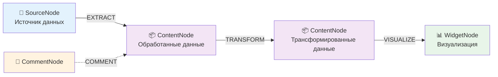

<div align="center">

# 🚀 GigaBoard

### AI-Powered Data Analytics Platform with Infinite Canvas

**Создавайте data pipelines визуально. Трансформируйте данные с помощью AI. Генерируйте визуализации автоматически.**

[Документация](docs/README.md) • [Архитектура](docs/ARCHITECTURE.md) • [API Reference](docs/API.md) • [Примеры использования](docs/USE_CASES.md)

---

[](https://www.python.org/downloads/)
[](https://reactjs.org/)
[](https://fastapi.tiangolo.com/)
[](https://www.typescriptlang.org/)
[](LICENSE)

</div>

---

## ✨ Что такое GigaBoard?

**GigaBoard** — революционная AI-powered платформа для data analytics, где **искусственный интеллект становится вашим персональным data scientist**. Вместо написания SQL запросов и pandas кода, вы просто говорите что нужно — и AI делает всё за вас.

### 🎯 Почему GigaBoard уникален?

**Проблема традиционных BI-систем:**
- ❌ Статичные дашборды — нужен разработчик для изменений
- ❌ Закрытые black-box решения — непонятно откуда данные
- ❌ Ручное написание трансформаций — нужно знать SQL/Python  
- ❌ Отсутствие контекста — каждый запрос с нуля

**Решение GigaBoard:**
- ✅ **Динамические визуализации** — AI генерирует код HTML/CSS/JS по вашему запросу
- ✅ **Прозрачный Data Lineage** — видите полный путь данных на визуальном канвасе
- ✅ **AI пишет код за вас** — просто опишите что нужно на естественном языке
- ✅ **Итеративный диалог** — AI помнит контекст и улучшает результаты

<!-- TODO: Добавить screenshot или demo GIF после деплоя

-->

---

## 🚀 Уникальные возможности

### 1. 🤖 Multi-Agent System — Команда AI-специалистов

Не один AI, а **целая команда из 9 специализированных агентов**, работающих вместе:

| Агент                 | Роль          | Суперсила                                                 |
| --------------------- | ------------- | --------------------------------------------------------- |
| 🧭 **Planner**         | Планировщик   | Разбивает задачи на шаги, адаптивно пересматривает план   |
| 🔍 **SearchAgent**     | Поисковик     | Находит информацию в интернете через поисковые API        |
| 📚 **ResearcherAgent** | Исследователь | Загружает **полный контент** страниц (40x больше данных!) |
| 📊 **AnalystAgent**    | Аналитик      | Анализирует данные, находит паттерны и инсайты            |
| 🔄 **TransformAgent**  | Трансформер   | Генерирует pandas/Python код для обработки данных         |
| 💻 **DeveloperAgent**  | Разработчик   | Создаёт специализированные инструменты on-demand          |
| ⚙️ **ExecutorAgent**   | Исполнитель   | Выполняет код в безопасном sandbox с ограничениями        |
| 📈 **ReporterAgent**   | Визуализатор  | Генерирует HTML/CSS/JS код для интерактивных графиков     |
| 🎯 **CriticAgent**     | Валидатор     | Проверяет качество результатов, предлагает улучшения      |

**Ключевая особенность:** Агенты общаются через **Redis Message Bus**, автоматически делегируют задачи друг другу и показывают свой ход мышления в реальном времени.

**Реальный пример workflow:**  
```
Вы: "Найди данные о средней зарплате data scientist в 2026"

1. Planner → создаёт план из 4 шагов
2. SearchAgent → находит 5 релевантных статей (Google API)
3. ResearcherAgent → загружает полный HTML контент (20KB вместо 150 символов!)
4. AnalystAgent → парсит зарплаты, вычисляет среднее
5. ReporterAgent → создаёт bar chart с breakdown по регионам
6. CriticAgent → проверяет "все ли данные актуальны для 2026?"
   
Результат: интерактивная визуализация на канвасе за 30 секунд
```

### 2. 🧩 Source-Content Architecture — Прозрачный Data Lineage

Уникальная архитектура с **явным разделением источников и результатов**:

```
📁 SourceNode → EXTRACT → 📦 ContentNode → TRANSFORM → 📦 ContentNode → VISUALIZE → 📊 WidgetNode
(откуда данные)           (сырые данные)              (обработанные)                (визуализация)
```

**6 типов источников данных:**
- 📄 **File** — CSV, JSON, Excel, Parquet, TXT (автоматический парсинг)
- 🗄️ **Database** — PostgreSQL, MySQL, SQLite (асинхронные запросы)
- 🌐 **API** — REST endpoints с auth, retry logic, rate limiting
- 🤖 **Prompt** — AI генерирует синтетические данные по описанию
- ⌨️ **Manual** — ручной ввод через удобные формы
- 📡 **Stream** — WebSocket, SSE для real-time данных (архивируется автоматически)

**Преимущество:** Обновили исходный CSV? Все downstream трансформации и визуализации **обновятся автоматически** — полный data lineage на канвасе!

### 3. 💬 Итеративный AI-чат для трансформаций

**Transform Dialog** — не просто генератор кода, а полноценный AI-ассистент:

```
Вы: "Отфильтруй продажи больше $1000"
AI: [генерирует код] df[df['amount'] > 1000]
    [показывает live preview с результатом]

Вы: "Добавь группировку по регионам"  
AI: [улучшает код] .groupby('region').sum()
    [обновляет preview в реальном времени]

Вы: "Теперь pivot по месяцам"
AI: [дорабатывает с pivot_table]
    [финальный preview]

→ Сохранить трансформацию
```

**Ключевые фичи:**
- **Dual-panel layout:** 40% чат + 60% live preview/code
- **Monaco Editor** встроен для ручной доработки кода
- **5 категорий suggestions:** aggregation, filtering, joining, reshaping, enrichment
- **Edit mode:** возобновление существующих трансформаций с историей

### 4. 🎨 AI-генерация визуализаций — От данных до дашборда за секунды

**Reporter Agent** создаёт **полный HTML/CSS/JS код** визуализаций с нуля:

**Не шаблоны, а настоящая генерация:**
- ❌ Обычные BI: выбрать тип графика из 10 вариантов
- ✅ GigaBoard: AI генерирует уникальный код под ваши данные

**Поддержка библиотек:** Chart.js 4, Plotly 2.35, D3.js 7, ECharts 5  
**Валидация безопасности:** только CDN, запрет eval/Function  
**Auto-refresh:** изменили данные → виджет обновился автоматически

**Пример запроса:**  
*"Создай интерактивный treemap продаж по категориям с drill-down и tooltips"*  
→ AI напишет 200+ строк кода с event handlers, анимациями, responsive design

### 5. 🧠 AI Resolver — Семантические операции внутри трансформаций

**Революционная возможность:** вызов AI **прямо внутри сгенерированного кода**!

```python
# Обычный pandas — НЕ справится с семантикой
df['gender'] = ???  # Как определить пол по имени?

# GigaBoard — AI Resolver
df['gender'] = gb.ai_resolve_batch(
    df['name'].tolist(),
    "определи пол: M или F"
)
```

**Примеры семантических задач:**
- Определение пола/возраста по имени → `gb.ai_resolve_batch(names, "пол: M/F")`
- Sentiment analysis → `gb.ai_resolve_batch(reviews, "позитивный/негативный")`
- Извлечение email из текста → `gb.ai_resolve_batch(texts, "извлеки email")`
- Перевод названий → `gb.ai_resolve_batch(titles, "translate to English")`
- Категоризация → `gb.ai_resolve_batch(descriptions, "категория: tech/sport/...")`

**Технические детали:**
- **Batch processing:** 50 значений за раз для оптимизации
- **Direct agent calls:** без HTTP overhead, прямой вызов ResolverAgent
- **Graceful error handling:** fallback в None при ошибках
- **Chunking:** автоматическая разбивка больших списков

### 6. 🔄 Adaptive Planning — AI пересматривает план после каждого шага

**Не статичное выполнение, а динамическое планирование:**

```
Классический workflow:
План: A → B → C (выполняется линейно, без адаптации)

GigaBoard Adaptive Planning:
План: A → B → C
  ↓
Выполнен A → GigaChat анализирует результат
  ↓
"Данные оказались в другом формате, изменю план"
  ↓
Новый план: A → D → E → C (адаптация на лету!)
```

**AI-powered decision making:**
- **После каждого шага:** GigaChat анализирует результаты и принимает решение
- **Full replan:** полное перепланирование с передачей всех накопленных знаний
- **Интеллектуальная классификация ошибок:** retry/replan/abort/continue
- **Консервативные решения:** temperature=0.3 для баланса гибкости и стабильности
- **MAX_REPLAN_ATTEMPTS=2:** предотвращение бесконечных циклов

**Реальный пример:**  
SearchAgent нашёл статьи (только snippets) → GigaChat анализирует → "Нужен полный текст для точного анализа" → автоматически добавляет ResearcherAgent в план → загружает 40x больше данных!

### 7. 🎯 Smart Node Placement — Канвас без хаоса

**AABB collision detection** автоматически размещает ноды без наложения:

- ✅ **VISUALIZATION связи:** виджеты размещаются **вертикально снизу** от данных  
- ✅ **TRANSFORMATION связи:** результаты размещаются **горизонтально справа** от источника  
- ✅ **Спиральный поиск:** если место занято, ищет ближайшее свободное  
- ✅ **Padding 40px** между нодами для читаемости  
- ✅ **Автокоррекция при drag:** предотвращает наложение при ручном перемещении

**До/После:**
```
До:  все ноды наслаиваются друг на друга [📦📊📦📊📦] (хаос)

После:  красивое дерево зависимостей (порядок)
         📁 Source
           ↓
         📦 Raw Data
        ↙  ↓  ↘
      📦  📦  📦  (три трансформации)
       ↓   ↓   ↓
      📊  📊  📊  (три визуализации)
```

### 8. 💡 Widget Suggestions — AI подсказывает улучшения

**WidgetSuggestionAgent** анализирует ваш виджет и данные:

**Анализ данных:**
- 📊 Типы колонок (численные, категориальные, временные ряды)
- 📈 Cardinality (сколько уникальных значений)
- 🔢 Распределение данных

**Анализ кода:**
- 💻 Используемые библиотеки (Chart.js/Plotly/D3)
- 🎨 Уровень интерактивности
- 📝 Сложность кода

**5 типов рекомендаций:**
- ✨ **Improvement** — улучшения текущего виджета ("добавь tooltips")
- 🔄 **Alternative** — другие типы визуализации ("попробуй heatmap вместо bar chart")
- 🔍 **Insight** — интересные паттерны в данных ("есть сезонность, покажи её")
- 📚 **Library** — использование других библиотек ("Plotly даст больше интерактива")
- 🎨 **Style** — улучшения дизайна ("responsive design для мобильных")

**Компактный UI:** теги с глобальными тултипами, клик → промпт сразу в AI

---

## 🎨 Архитектура: Data-Centric Canvas

Визуальное представление **полного data pipeline** на бесконечном канвасе:



### 📦 Типы узлов

- **🔌 SourceNode** — точки входа данных: файлы (CSV, JSON, Excel), БД (PostgreSQL, MySQL), API, AI-промпты, streaming источники
- **📦 ContentNode** — результаты обработки: текстовые резюме + структурированные таблицы
- **📊 WidgetNode** — визуализации, сгенерированные AI (HTML/CSS/JS код с Chart.js, Plotly, D3)
- **💬 CommentNode** — комментарии и аннотации

### 🔗 Типы связей

- **EXTRACT** — извлечение данных из источника
- **TRANSFORMATION** — преобразование данных (Python код, сгенерированный AI)
- **VISUALIZATION** — создание визуализации
- **COMMENT** — аннотирование
- **REFERENCE**, **DRILL_DOWN** — ссылки и детализация

---

## 🤖 Multi-Agent System — Under the Hood

За AI Assistant Panel работает **команда из 9 специализированных агентов**, которые автоматически координируют работу через **Redis Message Bus**.

### Агенты и их роли

| Агент                 | Роль              | Ключевые возможности                                                            |
| --------------------- | ----------------- | ------------------------------------------------------------------------------- |
| 🧭 **Planner**         | Orchestrator      | Adaptive Planning, Full Replan после каждого шага, context accumulation         |
| 🔍 **SearchAgent**     | Поиск в интернете | Google Search API, до 10 результатов, snippet extraction                        |
| 📚 **ResearcherAgent** | Deep Research     | HTML→text, загрузка полных страниц (40x больше данных!), параллельная обработка |
| 📊 **AnalystAgent**    | Data Analysis     | Pandas/numpy, pattern recognition, statistical insights                         |
| 🔄 **TransformAgent**  | Code Generation   | Pandas transformations, AI Resolver integration, dry-run validation             |
| 💻 **DeveloperAgent**  | Tool Creation     | Dynamic tool development, syntax validation, security checks                    |
| ⚙️ **ExecutorAgent**   | Sandbox Execution | Isolated environment, resource limits, GigaBoardHelpers (gb module)             |
| 📈 **ReporterAgent**   | Visualization     | HTML/CSS/JS generation, Chart.js/Plotly/D3/ECharts, CDN validation              |
| 🧠 **ResolverAgent**   | Semantic AI       | Batch processing (50/chunk), direct GigaChat calls, fallback handling           |
| 🎯 **CriticAgent**     | Quality Control   | Heuristic + LLM validation, replan recommendations, MAX_ITERATIONS=5            |

### Критические паттерны

**1. Search → Research → Analyze (40x больше данных)**
```
SearchAgent: находит URLs + snippets (150 chars каждый)
↓
ResearcherAgent: загружает полный HTML (5000+ chars на страницу)
↓  
AnalystAgent: анализирует реальный контент вместо snippets
```

**2. Adaptive Planning с Full Replan**
```
Выполнен шаг A → GigaChat анализирует результаты
                 ↓
"Данные другого формата, изменю стратегию"
                 ↓
PlannerAgent.replan() → новый план с учётом всех знаний
```

**3. AI Resolver внутри трансформаций**
```
TransformAgent генерирует код:
  df['category'] = gb.ai_resolve_batch(names, "категория")
                             ↓
ExecutorAgent выполняет → вызывает ResolverAgent
                             ↓
ResolverAgent → GigaChat → batch classification
```

### Технические детали

**Коммуникация:**
- **Redis Pub/Sub** для async messaging
- **Channels:** agent-specific + broadcast  
- **Message format:** JSON с metadata (sender, timestamp, correlation_id)
- **Graceful shutdown:** корректное завершение всех агентов

**GigaChat Integration:**
- **Temperature:** 0.3 (planning) / 0.7 (generation)
- **Timeout:** 60-120s в зависимости от задачи
- **Retry:** 3 attempts с exponential backoff
- **Token limits:** 2048-4000 max_tokens

**Security:**
- **Sandbox isolation** для ExecutorAgent
- **Whitelist imports:** только pandas, numpy, json, datetime
- **No file I/O, network, subprocess, eval**
- **CDN validation** для WidgetNode (только известные библиотеки)

---

## 🚀 Быстрый старт

### Требования

- **Python 3.11+** с [uv](https://github.com/astral-sh/uv) для управления зависимостями
- **Node.js 18+** и npm
- **PostgreSQL 14+**
- **Redis 7+**
- **GigaChat API** токен ([получить](https://developers.sber.ru/gigachat))

### Установка

```bash
# 1. Клонировать репозиторий
git clone https://github.com/yourusername/gigaboard.git
cd gigaboard

# 2. Установить frontend зависимости
npm install

# 3. Установить backend зависимости (используя uv)
cd apps/backend
uv sync
cd ../..

# 4. Настроить переменные окружения
cp apps/backend/.env.example apps/backend/.env
# Отредактируйте .env файл: добавьте DATABASE_URL, REDIS_URL, GIGACHAT_TOKEN
```

### Запуск

**🎯 Быстрый старт (всё сразу):**

```powershell
# Windows
.\run-dev.ps1

# Linux/macOS
./run-dev.sh
```

**📦 Или запустите компоненты раздельно:**

```powershell
# Backend (порт 8000)
.\run-backend.ps1

# Frontend (порт 5173)
.\run-frontend.ps1
```

Откройте браузер: [http://localhost:5173](http://localhost:5173)

---

## 📚 Документация

### Начало работы
- [📖 Полная документация](docs/README.md) — обзор проекта и текущее состояние
- [🎯 Быстрый старт](QUICKSTART.md) — пошаговое руководство
- [🐳 Docker Desktop Setup](DOCKER_DESKTOP.md) — запуск через Docker

### Архитектура и API
- [🏗️ Архитектура системы](docs/ARCHITECTURE.md) — компоненты и взаимодействие
- [📋 Спецификации](docs/SPECIFICATIONS.md) — функциональные требования
- [🔌 API Reference](docs/API.md) — endpoints и схемы данных
- [📊 System Diagrams](docs/SYSTEM_DIAGRAMS.md) — визуальные схемы архитектуры

### Ключевые системы
- [🤖 Multi-Agent System](docs/MULTI_AGENT_SYSTEM.md) — AI агенты и их взаимодействие
- [🧩 Source-Content Node System](docs/SOURCE_CONTENT_NODE_CONCEPT.md) — архитектура узлов данных
- [📦 Data Node System](docs/DATA_NODE_SYSTEM.md) — работа с данными
- [🎨 Widget Generation System](docs/WIDGETNODE_GENERATION_SYSTEM.md) — AI-генерация визуализаций
- [🔄 Transform Dialog](docs/TRANSFORM_DIALOG_CHAT_SYSTEM.md) — интерактивные трансформации
- [🔗 Connection Types](docs/CONNECTION_TYPES.md) — типы связей между узлами
- [📈 Data Lineage System](docs/DATA_LINEAGE_SYSTEM.md) — отслеживание потока данных

### Примеры и руководства
- [💡 Use Cases](docs/USE_CASES.md) — примеры использования платформы
- [🎓 Widget Generation Quickstart](docs/WIDGET_GENERATION_QUICKSTART.md) — создание визуализаций
- [🔍 Search Agent Quickstart](docs/SEARCH_AGENT_QUICKSTART.md) — работа с поисковым агентом

### Разработка
- [🛠️ Developer Checklist](docs/DEVELOPER_CHECKLIST.md) — чек-лист для разработчиков
- [🗺️ Roadmap](docs/ROADMAP.md) — план развития проекта
- [📝 Commands](docs/COMMANDS.md) — полезные команды

---

## 🎨 Пример использования

### Создание аналитического дашборда — полный пошаговый workflow

**Задача:** Проанализировать продажи интернет-магазина за Q1 2026

```
Шаг 1: Загрузка данных
---------------------
Вы: "Загрузи sales_2026_q1.csv"
→ Создаётся SourceNode (type: file)
→ FileExtractor автоматически парсит CSV
→ Создаётся ContentNode с таблицей (15,000 строк)

Шаг 2: Первичный анализ
----------------------
Вы: "Покажи топ-10 продуктов по выручке"
→ TransformationAgent генерирует pandas код:
   df.groupby('product')['revenue'].sum().nlargest(10)
→ Создаётся новый ContentNode с результатом
→ TRANSFORMATION edge связывает источник и результат

Шаг 3: Визуализация
------------------
Вы: "Создай интерактивный bar chart"
→ ReporterAgent генерирует HTML/CSS/JS код с Chart.js
→ Создаётся WidgetNode с графиком
→ VISUALIZATION edge связывает данные и виджет

Шаг 4: Углубленный анализ
------------------------
Вы: "Добавь breakdown по регионам"
→ AI улучшает трансформацию (pivot table)
→ Обновляется ContentNode
→ WidgetNode автоматически обновляется (auto-refresh!)

Шаг 5: Семантическое обогащение
-------------------------------
Вы: "Определи категорию каждого продукта"
→ AI генерирует код с gb.ai_resolve_batch:
   categories = gb.ai_resolve_batch(
       df['product_name'].tolist(),
       "категория: Electronics, Clothing, Food, или Other"
   )
→ ResolverAgent классифицирует 15,000 товаров
→ Новая колонка 'category' добавлена в таблицу

Результат: полный interactive dashboard с data lineage на канвасе
Время: ~2 минуты (вместо часов ручного кодирования)
```

### Другие примеры использования

**1. Анализ конкурентов**
```
Вы: "Найди данные о ценах на iPhone 15 в российских магазинах"
→ SearchAgent + ResearcherAgent → собирают данные с 5 сайтов
→ AnalystAgent → парсит цены
→ ReporterAgent → создаёт price comparison chart
```

**2. Sentiment Analysis отзывов**
```
Вы: Загружаешь CSV с отзывами на продукт
Вы: "Классифицируй отзывы на позитивные/негативные"
→ AI генерирует код с gb.ai_resolve_batch
→ 10,000 отзывов обрабатываются за минуту
→ Pie chart с распределением sentiment
```

**3. Real-time monitoring**
```
Вы: "Подключись к WebSocket с метриками сервера"
→ SourceNode (type: stream) → аккумулирует данные
→ ContentNode обновляется каждые 5 секунд
→ WidgetNode показывает live dashboard
```

---

## 🛠️ Технологический стек

### Frontend
- **React 18** + **TypeScript** — UI компоненты
- **Vite** — быстрая сборка
- **React Flow** — визуальный канвас
- **Zustand** — state management
- **TanStack Query** — кэширование запросов
- **Socket.IO Client** — real-time обновления
- **ShadCN UI** — компонентная библиотека
- **Chart.js**, **Plotly**, **D3** — визуализации

### Backend
- **FastAPI** — REST API и WebSocket
- **SQLAlchemy** — ORM для работы с БД
- **PostgreSQL** — основная база данных
- **Redis** — pub/sub для агентов + кэширование
- **Socket.IO** — real-time коммуникация
- **LangChain** + **GigaChat** — AI агенты
- **uv** — управление Python зависимостями

### DevOps
- **Docker** + **Docker Compose** — контейнеризация
- **Alembic** — миграции БД
- **pytest** — тестирование backend
- **Vitest** — тестирование frontend

---

## 🗺️ Roadmap

### ✅ Завершено (Phase 1)
- [x] Multi-Agent System с 9 агентами
- [x] Source-Content Node Architecture
- [x] AI Widget Generation
- [x] Transform Dialog с итеративным чатом
- [x] 6 типов extractors (file, DB, API, prompt, manual, stream)
- [x] Smart Node Placement
- [x] Real-time collaboration

### 🚧 В разработке (Phase 2)
- [ ] Advanced Orchestrator для Multi-Agent
- [ ] Data Quality Monitor
- [ ] Automated Reporting
- [ ] Template Marketplace
- [ ] Voice Input System

### 🔮 Планируется (Phase 3)
- [ ] Advanced Drill-Down System
- [ ] Collaborative Features (annotations, permissions)
- [ ] Export & Embedding System
- [ ] Public Data Discovery (Kaggle, OECD, World Bank)

См. полный [ROADMAP.md](docs/ROADMAP.md) для деталей.

---

## 🤝 Contributing

Проект находится в активной разработке. Мы приветствуем вклад сообщества!

Если вы хотите внести вклад:

1. Fork репозиторий
2. Создайте feature branch (`git checkout -b feature/AmazingFeature`)
3. Commit изменения (`git commit -m 'Add some AmazingFeature'`)
4. Push в branch (`git push origin feature/AmazingFeature`)
5. Откройте Pull Request

Подробнее см. [CONTRIBUTING.md](CONTRIBUTING.md) и [DEVELOPER_CHECKLIST.md](docs/DEVELOPER_CHECKLIST.md).

---

## 📄 License

Этот проект лицензирован под MIT License — см. файл [LICENSE](LICENSE) для деталей.

---

## 🙏 Благодарности

- [GigaChat](https://developers.sber.ru/gigachat) — AI модель для агентов
- [React Flow](https://reactflow.dev/) — библиотека для канваса
- [FastAPI](https://fastapi.tiangolo.com/) — современный Python фреймворк
- [LangChain](https://www.langchain.com/) — фреймворк для AI агентов

---

<div align="center">

**Сделано с ❤️ и AI**

[⭐ Поставьте звезду](https://github.com/yourusername/gigaboard) • [🐛 Сообщить об ошибке](https://github.com/yourusername/gigaboard/issues) • [💬 Обсудить](https://github.com/yourusername/gigaboard/discussions)

</div>