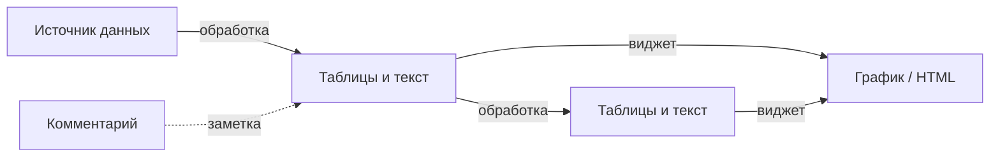

# GigaBoard

### Аналитика и пайплайны данных на наглядной доске — с поддержкой ИИ

**Подключайте источники, стройте цепочки обработки и визуализации на канвасе. ИИ помогает формулировать запросы, писать код трансформаций и графики — при этом путь данных остаётся прозрачным.**

[Полная документация](docs/README.md) · [Архитектура](docs/ARCHITECTURE.md) · [API](docs/API.md) · [Сценарии использования](docs/USE_CASES.md)

---

[Python](https://www.python.org/downloads/)
[React](https://reactjs.org/)
[FastAPI](https://fastapi.tiangolo.com/)
[TypeScript](https://www.typescriptlang.org/)
[License](LICENSE)


---

**Актуальность (28.03.2026):** индекс документации — [docs/README.md](docs/README.md), фокус разработки — [.vscode/CURRENT_FOCUS.md](.vscode/CURRENT_FOCUS.md).

---

## Кому это может быть полезно


| Роль                                   | Зачем смотреть на GigaBoard                                                                                                                 |
| -------------------------------------- | ------------------------------------------------------------------------------------------------------------------------------------------- |
| **Аналитики и специалисты по данным**  | Один экран: от файла или БД до графика и сводной таблицы; меньше ручного кода, больше экспериментов с формулировками на естественном языке. |
| **Руководители и владельцы продуктов** | Понятная «карта» откуда взялись цифры: источники и шаги обработки видны на доске, а не спрятаны в скриптах.                                 |
| **Разработчики и инженеры данных**     | Открытый стек (FastAPI, React, PostgreSQL), API под `/api/v1/`, мультиагентное ядро и документация для интеграции и доработок.              |
| **Команды**                            | Общий контекст на доске, дашборды для презентации, глобальные фильтры по измерениям — удобно согласовывать метрики.                         |


---

## Что вы получаете в двух словах

- **Наглядный пайплайн** — узлы и стрелки показывают путь: данные → обработка → виджеты; обновление источника может автоматически пересчитать зависимые шаги (**replay** / lineage).
- **ИИ как помощник** — диалоги для трансформаций и для виджетов: описали задачу, получили код и предпросмотр; можно править вручную.
- **Разные источники** — файлы (CSV, JSON, Excel, документы), базы, API, ручной ввод, сценарий «Поиск с ИИ» для веб-исследований (по мере настройки модели).
- **Дашборды и фильтры** — отдельный слой для компоновки экрана; **Cross-Filter** и клики из виджетов синхронизируют отбор по доске или дашборду.
- **Совместная работа в реальном времени** — обновления через Socket.IO (детали в [ARCHITECTURE.md](docs/ARCHITECTURE.md)).

---

## Как это выглядит для пользователя

1. **Подключить данные** — загрузить файл, настроить источник из БД/API или ввести таблицу вручную.
2. **Уточнить и обработать** — в диалоге трансформации описать, что нужно отфильтровать, сгруппировать или обогатить; увидеть таблицу-результат.
3. **Визуализировать** — попросить ИИ собрать график или карточку под ваши колонки; при необходимости доработать промптом.
4. **Собрать картину** — вынести виджеты на дашборд, включить фильтры по регионам, датам и т.д., чтобы всё обновлялось согласованно.

Ниже — схема типов узлов на доске (без погружения в названия из кода).




Подробные сценарии — [USE_CASES.md](docs/USE_CASES.md), устройство доски — [BOARD_SYSTEM.md](docs/BOARD_SYSTEM.md).

---

## Возможности подробнее

### ИИ: мультиагентное ядро

За сложными запросами стоит **не один** чат, а согласованная цепочка ролей (**9 core-агентов** в **Orchestrator**, плюс **QualityGate** для проверки данных в контексте пайплайна): планирование, поиск и загрузка материалов из сети при необходимости, структурирование, анализ, генерация кода трансформаций и виджетов, проверка результата. Отдельно подключается контроль качества данных (**QualityGate**). Подробности и список агентов — [MULTI_AGENT.md](docs/MULTI_AGENT.md).

Интерфейсные сценарии (трансформации, виджеты, ассистент, документы, исследования) вынесены в **satellite-контроллеры** — для пользователя это те же диалоги и панели в приложении.

### Трансформации и виджеты

- **Transform Dialog** — чат + предпросмотр таблицы и кода, подсказки по категориям, ручное редактирование в редакторе.
- **Widget Dialog** — генерация HTML/CSS/JS под ваши данные (ограниченный безопасный контур), обновление при изменении данных, связь с глобальными фильтрами.

### Дашборды и Cross-Filter

Редактор дашбордов (виджеты, таблицы, текст, изображения, линии), библиотека элементов проекта, фильтры по измерениям — см. [DASHBOARD_SYSTEM.md](docs/DASHBOARD_SYSTEM.md) и [CROSS_FILTER_SYSTEM.md](docs/CROSS_FILTER_SYSTEM.md).

### Дополнительно (для технически любопытных)

- **AI Resolver** — семантические операции внутри кода трансформаций (классификация, извлечение сущностей и т.д.) через `gb.ai_resolve_batch` — [AI_RESOLVER_SYSTEM.md](docs/AI_RESOLVER_SYSTEM.md).
- **Адаптивное планирование** — план может уточняться по ходу выполнения — [ADAPTIVE_PLANNING.md](docs/ADAPTIVE_PLANNING.md).
- **Умное размещение узлов** на канвасе — [SMART_NODE_PLACEMENT.md](docs/SMART_NODE_PLACEMENT.md).

---

## Архитектура доски (кратко)

**Четыре типа узлов** и **пять типов связей** на бесконечном полотне; визуализация строится на React Flow.


| Узел        | Назначение                                                   |
| ----------- | ------------------------------------------------------------ |
| Источник    | Вход данных: файлы, БД, API, ручной ввод, исследование и др. |
| Контент     | Результаты трансформаций: текст и таблицы                    |
| Виджет      | HTML/CSS/JS визуализации                                     |
| Комментарий | Аннотации к фрагментам схемы                                 |


Связи **TRANSFORMATION** и **VISUALIZATION** задают обработку и привязку графиков к данным. Полная схема — [ARCHITECTURE.md](docs/ARCHITECTURE.md), [CONNECTION_TYPES.md](docs/CONNECTION_TYPES.md).

### Мультиагент: технический слой

Единый формат обмена (**AgentPayload**), контекст пайплайна и история шагов, опционально — полные таблицы для проверок. Настройки **LLM** (в т.ч. GigaChat) задаются в профиле и при необходимости на уровне администратора — [ADMIN_AND_SYSTEM_LLM.md](docs/ADMIN_AND_SYSTEM_LLM.md). Песочница для выполнения кода трансформаций, Redis для pub/sub — детали в [MULTI_AGENT.md](docs/MULTI_AGENT.md).

---

## Быстрый старт

### Требования

- **Python 3.11+** (рекомендуется 3.13), [uv](https://github.com/astral-sh/uv)
- **Node.js 18+**, npm (workspace `apps/web`)
- **PostgreSQL 14+**
- **Redis 6+**
- Доступ к **LLM** (например GigaChat): ключ и пресеты — **Профиль → Настройки LLM**; см. [ADMIN_AND_SYSTEM_LLM.md](docs/ADMIN_AND_SYSTEM_LLM.md), [портал Сбера](https://developers.sber.ru/gigachat).

### Установка

```bash
git clone https://github.com/yourusername/gigaboard.git
cd gigaboard

# Переменные окружения — в корне репозитория (backend читает .env отсюда)
# Windows: copy .env.example .env
# Linux/macOS: cp .env.example .env
# Заполните DATABASE_URL, REDIS_URL, JWT_SECRET_KEY и при необходимости ADMIN_EMAIL / ADMIN_PASSWORD

cd apps/backend
uv sync
cd ../..
npm install
```

Комментарии к переменным — в `[.env.example](.env.example)`.

### Запуск

**Windows (всё сразу):**

```powershell
.\run-dev.ps1
```

**Или по отдельности:**

```powershell
.\run-backend.ps1   # http://localhost:8000 (Swagger: /docs)
.\run-frontend.ps1  # http://localhost:5173
```

Откройте [http://localhost:5173](http://localhost:5173).

### Docker Compose

**Продакшен-сборка** (nginx, backend, Postgres, Redis; при старте выполняется `alembic upgrade head`):

```powershell
docker compose up --build
```

- UI: [http://localhost:3000](http://localhost:3000) (`FRONTEND_PORT`, по умолчанию 3000)
- API и Socket.IO через nginx: `/api/`, `/socket.io/`

**Разработка в контейнерах** (hot reload):

```powershell
docker compose -f docker-compose.yml -f docker-compose.dev.yml up --build
```

UI: [http://localhost:5173](http://localhost:5173). Опционально pgAdmin и Redis Commander: профиль `tools`. Подробнее — [docs/COMMANDS.md](docs/COMMANDS.md), [DOCKER_VM_DEPLOYMENT.md](docs/DOCKER_VM_DEPLOYMENT.md).

---

## Документация

**Оглавление:** [docs/README.md](docs/README.md).


| Тема                    | Документ                                        |
| ----------------------- | ----------------------------------------------- |
| Архитектура, компоненты | [ARCHITECTURE.md](docs/ARCHITECTURE.md)         |
| Требования              | [SPECIFICATIONS.md](docs/SPECIFICATIONS.md)     |
| REST и Socket.IO        | [API.md](docs/API.md)                           |
| Доска и узлы            | [BOARD_SYSTEM.md](docs/BOARD_SYSTEM.md)         |
| Пайплайн и replay       | [DATA_NODE_SYSTEM.md](docs/DATA_NODE_SYSTEM.md) |
| Мультиагент             | [MULTI_AGENT.md](docs/MULTI_AGENT.md)           |
| Дорожная карта          | [ROADMAP.md](docs/ROADMAP.md)                   |
| Команды разработки      | [COMMANDS.md](docs/COMMANDS.md)                 |


---

## Пример: от файла до графика

**Задача:** разобрать продажи за квартал.

1. Загрузить CSV — на доске появится источник и таблица.
2. В диалоге трансформации попросить, например, топ продуктов по выручке — появится новый узел с результатом и связь «обработка».
3. Попросить ИИ сделать столбчатую диаграмму — создаётся виджет, привязанный к этим данным.
4. При смене фильтра по региону (если настроены измерения) график и таблицы могут обновляться согласованно.

Больше примеров — [USE_CASES.md](docs/USE_CASES.md).

---

## Технологический стек


| Слой           | Технологии                                                                                   |
| -------------- | -------------------------------------------------------------------------------------------- |
| Frontend       | React 18, TypeScript, Vite, React Flow, Zustand, TanStack Query, Socket.IO client, ShadCN UI |
| Backend        | FastAPI, SQLAlchemy, PostgreSQL, Redis, Socket.IO, LangChain, GigaChat (через пресеты), uv   |
| Инфраструктура | Docker Compose, Alembic, pytest, Vitest                                                      |


---

## Roadmap

**Уже есть:** мультиагентное ядро и контроллеры UI, источники и lineage, трансформации и виджеты с ИИ, дашборды, Cross-Filter, пресеты LLM, real-time.

**В планах:** публичный sharing дашбордов, улучшения редактора (multi-select, undo/redo), UI пресетов фильтров, drill-down и др. — [ROADMAP.md](docs/ROADMAP.md).

---

## Contributing

Проект в активной разработке. Вклад приветствуется: fork → feature branch → pull request. См. [CONTRIBUTING.md](CONTRIBUTING.md) и [DEVELOPER_CHECKLIST.md](docs/DEVELOPER_CHECKLIST.md).

---

## License

MIT — см. [LICENSE](LICENSE).

---

## Благодарности

- [GigaChat](https://developers.sber.ru/gigachat)
- [React Flow](https://reactflow.dev/)
- [FastAPI](https://fastapi.tiangolo.com/)
- [LangChain](https://www.langchain.com/)

---


**Сделано с ❤️ и AI**

[⭐ Звезда на GitHub](https://github.com/yourusername/gigaboard) · [Сообщить об ошибке](https://github.com/yourusername/gigaboard/issues) · [Обсуждения](https://github.com/yourusername/gigaboard/discussions)

