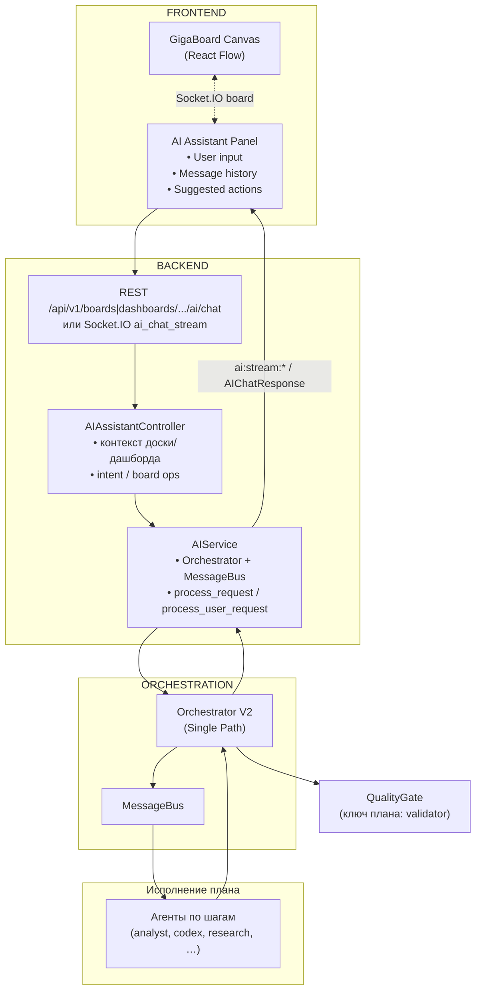

# AI Assistant Panel — Спецификация

## Обзор

**AI Assistant Panel** — боковая панель чата с ИИ-ассистентом: в контексте **текущей доски** (`scope=board`) или **текущего дашборда** (`scope=dashboard`). Компонент: `AIAssistantPanel` (`apps/web/src/components/board/AIAssistantPanel.tsx`).

Похоже на:
- 💬 **Cursor AI Agent** (помощник разработчика в редакторе)
- 🤖 **GitHub Copilot Chat** (быстрая помощь в коде)
- 📊 **Tableau Explain** (контекстные подсказки)

### Режимы контекста и доставка ответа

| Режим | Где в UI | Контекст для оркестратора | Сокет для стрима |
| ----- | -------- | --------------------------- | ---------------- |
| **Доска** | `BoardPage` / канвас доски | Выделенные ноды + данные доски (`AIService.get_board_context`) | Socket.IO из `BoardCanvas` → `useAIAssistantStore.setSocket` |
| **Дашборд** | `DashboardPage`, `DashboardViewPage` | Элементы дашборда и библиотека проекта (`AIService.get_dashboard_context`) | Отдельное подключение `socketService.connect(JWT)` при монтировании панели с `scope=dashboard` |

**Основной путь ответа** — **Socket.IO** (`ai_chat_stream` на сервере, `sendMessageStream` в Zustand): сервер эмитит `ai:stream:start`, **`ai:stream:progress`** (план и шаги мультиагента), `ai:stream:chunk`, `ai:stream:end` или `ai:stream:error`. UI прогресса унифицирован компонентом `MultiAgentProgressBlock` и логикой слияния шагов в `apps/web/src/lib/multiAgentProgress.ts`.

**Запасной путь** — **REST** `POST /api/v1/boards/{board_id}/ai/chat` или `POST /api/v1/dashboards/{dashboard_id}/ai/chat`: без пошагового прогресса; используется, если нет подключённого сокета или для дашборда недоступен JWT.

**История чата**: для доски — PostgreSQL (`chat_messages`, привязка к `board_id`); для дашборда — **Redis** (сессии по пользователю и `dashboard_id`), см. `apps/backend/app/routes/ai_assistant.py`.

**Права доступа (доска)**: чтение истории чата доски допускается при **просмотре** проекта доски. **Отправка** сообщений (REST `POST .../boards/{board_id}/ai/chat`, Socket.IO стрим, удаление сессии чата) требует **права на изменение** проекта (`get_board_for_edit` / `require_project_edit_access`); участник с ролью **viewer** в проекте получит отказ. См. [`PROJECT_ACCESS.md`](./PROJECT_ACCESS.md).

**Сервер (дашборд, Socket.IO)**: в событии `ai_chat_stream` передаются `scope: "dashboard"`, `board_id` (идентификатор дашборда), `access_token` (JWT) и остальные поля; обработчик в `apps/backend/app/core/socketio.py` проверяет токен, строит контекст дашборда и передаёт в оркестратор `_progress_callback` / `_enable_plan_progress`, как для доски.

**Подключение клиента**: при использовании `io({ auth: { token } })` серверный обработчик `connect` принимает третий аргумент `auth` (требование python-socketio / Socket.IO v4).

---

## Архитектура компонента

### Architecture: Integration with Multi-Agent System

**КРИТИЧЕСКИ ВАЖНО**: AI Assistant Panel работает через **Multi-Agent Orchestrator + Message Bus**, а НЕ напрямую с GigaChat.



**Поток данных** (упрощённо; **в продукте по умолчанию** — стрим через Socket.IO, не синхронный POST):
1. Пользователь вводит сообщение в AI Assistant Panel
2. Frontend → Socket.IO **`ai_chat_stream`** (или fallback: **REST** `POST .../ai/chat` для доски/дашборда)
3. **AIAssistantController** + **Orchestrator** выполняют мультиагентный пайплайн; при стриме прогресс шлётся событиями **`ai:stream:progress`**
4. **Planner** строит план; оркестратор последовательно исполняет шаги (analyst, codex, research, шаг `context_filter` при необходимости и т.д.)
5. Агенты вызываются через `MessageBus` / `process_task` в едином процессе; результаты накапливаются в `pipeline_context` / `agent_results`
6. Финальная валидация качества — **QualityGateAgent** (в плане и реестре ключ `validator`), не отдельный «CriticAgent»
7. Backend → Frontend: при стриме — чанки `ai:stream:chunk` и финал `ai:stream:end`; при REST — `AIChatResponse` с текстом и `suggested_actions`
8. Frontend отображает сообщение AI + кнопки действий

> **Примечание**: Агенты **не общаются друг с другом напрямую**. Orchestrator медиирует все вызовы.

**См. также**: [MULTI_AGENT.md](./MULTI_AGENT.md) для детальной архитектуры Orchestrator

### Компоненты

1. **Header** — заголовок "AI Assistant", кнопка закрытия/минимизации
2. **Context Indicator** — показывает выделенные на канвасе узлы (автоматическая синхронизация)
3. **Message List** — лента сообщений (юзер + AI) с прокруткой
4. **Suggested Actions** — кнопки быстрого действия (create widget, modify, etc.)
5. **Input Field** — текстовое поле + кнопка отправки (или Shift+Enter)

---

## User Stories

### US-1: Открыть ассистента и задать вопрос
**Как** аналитик  
**Я хочу** открыть борд и видеть AI Assistant готовым к диалогу  
**Чтобы** сразу задать вопрос о данных без дополнительных кликов

**Сценарий**:
1. Юзер открывает борд → AI Assistant Panel видна в правой части (по умолчанию развёрнута или свёрнута, настраивается)
2. Вводит текст: "Какие категории продукции показывают наибольший рост?"
3. Нажимает Enter или [Send]
4. AI обрабатывает контекст доски (виджеты, их данные) и отвечает
5. Если есть рекомендация → показывает кнопку "Создать график" или подобное

**Acceptance Criteria**:
- ✅ Ассистент доступен на открытой доске
- ✅ История сообщений сохраняется в рамках сессии
- ✅ Ответ приходит < 2 сек
- ✅ AI видит контекст текущей доски (widgets, data)

---

### US-2: Применить рекомендацию ассистента
**Как** аналитик  
**Я хочу** одной кнопкой создать/обновить виджет на основе предложения AI  
**Чтобы** сразу увидеть результат на доске

**Сценарий**:
1. AI предлагает: "Я предлагаю добавить столбчатую диаграмму по категориям"
2. Рядом с текстом — кнопка [✓ Создать график]
3. Юзер кликает → новый виджет появляется на доске
4. Event отправляется на сервер, синхронизируется в real-time
5. История диалога сохраняется (кто создал, когда, контекст)

**Acceptance Criteria**:
- ✅ Кнопка действия работает мгновенно
- ✅ Новый виджет появляется на доске
- ✅ Синхронизируется для других пользователей на доске
- ✅ Действие логируется в истории доски

---

### US-3: Контекстная помощь с текущими данными
**Как** PM  
**Я хочу** спросить ассистента об insight'ах в текущих данных на доске  
**Чтобы** быстро получить анализ, не открывая доп. инструменты

**Сценарий**:
1. На доске есть несколько виджетов: график продаж, таблица активных юзеров, pie chart по категориям
2. Юзер спрашивает: "Есть ли корреляция между числом активных юзеров и продажами?"
3. AI анализирует текущие данные и отвечает: "Да, я вижу положительную корреляцию. В марте активные юзеры выросли на 20%, продажи — на 18%. Возможно, стоит..."
4. Рекомендует: "Может быть, добавить точечную диаграмму для визуализации корреляции?"

**Acceptance Criteria**:
- ✅ AI анализирует данные текущих виджетов
- ✅ Ответ актуален и релевантен вопросу
- ✅ Рекомендации касаются данных на доске (не просто общие советы)

---

## Контекстный выбор узлов

### Приоритет ContentNode в промпте

В табличный контекст ассистента попадают **и** ноды первоисточника (`SourceNode`), **и** ноды аналитики (`ContentNode`, не источник). Если на доске есть оба типа, в обогащённый запрос добавляется явное правило: при ответах и при выборе таблиц для тулов **приоритет у ContentNode** (результаты работы на доске), к первоисточнику — когда вопрос про сырой ввод или без него не обойтись.

### Принцип работы

**Выделение узлов на канвасе автоматически определяет контекст AI Assistant:**

```
Пользователь выделяет узлы на канвасе (Click, Shift+Click, Box Select)
  ↓
Выделенные узлы автоматически становятся контекстом для AI
  ↓
AI Assistant анализирует ТОЛЬКО выделенные узлы
  ↓
Снял выделение → AI видит всю доску
```

### Визуальная индикация

#### В AI Assistant Panel:

**Без выделения (режим "Вся доска"):**
```
┌─────────────────────────────────────┐
│ 🤖 AI Assistant                     │
├─────────────────────────────────────┤
│ 📍 Контекст: Вся доска (12 узлов)  │
├─────────────────────────────────────┤
│ История сообщений...                │
└─────────────────────────────────────┘
```

**С выделением узлов:**
```
┌─────────────────────────────────────┐
│ 🤖 AI Assistant                     │
├─────────────────────────────────────┤
│ 📍 Контекст: 3 выбранных узла       │
│ ┌─────────────────────────────────┐│
│ │ 📊 sales_data.csv               ││
│ │ 📈 Sales Chart                  ││
│ │ 💬 Q4 analysis comment          ││
│ └─────────────────────────────────┘│
│                                     │
│ 💡 Снимите выделение, чтобы AI     │
│    видел всю доску                  │
├─────────────────────────────────────┤
│ История сообщений...                │
└─────────────────────────────────────┘
```

#### На канвасе:

Выделенные узлы подсвечиваются стандартным способом (React Flow selection), дополнительных маркеров не требуется.

### Способы выделения

**1. Одиночный выбор:**
```
Click на узел → выделен 1 узел → AI контекст: 1 узел
```

**2. Множественный выбор:**
```
Shift+Click или Ctrl+Click → выделено N узлов → AI контекст: N узлов
```

**3. Box Selection:**
```
Зажать Shift + перетащить мышь → выделена область → все узлы в области в AI контексте
```

**4. Выделить всё:**
```
Ctrl+A → все узлы выделены → AI контекст: вся доска (аналогично режиму без выделения)
```

**5. Снять выделение:**
```
Click на пустое место или Escape → выделение снято → AI контекст: вся доска
```

### Примеры использования

#### Пример 1: Анализ конкретного узла

```
Шаги:
1. Click на DataNode "sales_q1"
2. AI Panel: "📍 Контекст: sales_q1"
3. Пользователь: "Какой средний чек?"
4. AI анализирует только sales_q1, игнорирует остальные узлы

🤖 AI: "В sales_q1 средний чек составляет $150."
```

#### Пример 2: Сравнение двух узлов

```
Шаги:
1. Click на "sales_q1"
2. Shift+Click на "sales_q2"
3. AI Panel: "📍 Контекст: 2 узла (sales_q1, sales_q2)"
4. Пользователь: "Где рост больше?"

🤖 AI: "Анализирую оба квартала...
Q1: $2.1M
Q2: $2.8M (+33%)
Рост больше в Q2."
```

#### Пример 3: Работа с блоком узлов

```
Шаги:
1. Box select области с маркетинговыми узлами (7 узлов)
2. AI Panel: "📍 Контекст: 7 узлов"
3. Пользователь: "Какой ROI по кампаниям?"

🤖 AI: "Анализирую маркетинговый блок...
(игнорирует остальные 15 узлов на доске)"
```

#### Пример 4: Возврат к полному контексту

```
Шаги:
1. Пользователь работал с выделенными 3 узлами
2. Хочет задать вопрос про всю доску
3. Нажимает Escape или кликает на пустое место
4. AI Panel: "📍 Контекст: Вся доска (12 узлов)"
5. Пользователь: "Покажи общую сводку"

🤖 AI: "Анализирую всю доску..." (видит все 12 узлов)
```

### Умные возможности

#### Auto-expand контекста

Если пользователь выбрал DataNode, но задаёт вопрос о визуализациях, AI может предложить расширить контекст:

```
Выделен: DataNode "sales"
Вопрос: "Обнови все графики"

🤖 AI: "Я вижу, что sales связан с 3 WidgetNodes.
Выделите их тоже, чтобы я мог обновить, или я могу
автоматически найти и обновить все связанные визуализации.

[Найти и обновить автоматически]"
```

---

## Integration with Multi-Agent System

### AIService refactoring: Orchestrator Integration

**Текущая реализация** (`apps/backend/app/services/ai_service.py`):
```python
class AIService:
    def __init__(self, db: AsyncSession):
        self.db = db
        self.gigachat = get_gigachat_service()  # ❌ Прямой вызов GigaChat
    
    async def chat(self, board_id, user_id, message, ...):
        # Получить контекст доски
        context = await self.get_board_context(board_id)
        
        # Отправить в GigaChat напрямую
        response = await self.gigachat.chat(message, context)  # ❌ Неправильно
        return {"response": response}
```

**Новая архитектура** (должна быть реализована):
```python
class AIService:
    def __init__(self, db: AsyncSession):
        self.db = db
        self.orchestrator = MultiAgentOrchestrator(db)  # ✅ Используем Orchestrator
    
    async def chat(
        self,
        board_id: UUID,
        user_id: UUID,
        message: str,
        session_id: Optional[UUID] = None,
        context: Optional[Dict] = None
    ) -> Dict:
        """
        Отправить запрос пользователя в Multi-Agent систему.
        
        Args:
            board_id: UUID доски
            user_id: UUID пользователя
            message: Текст сообщения от пользователя
            session_id: UUID сессии чата (для истории)
            context: Дополнительный контекст (selected_node_ids и т.д.)
        
        Returns:
            {
                "response": "AI answer text",
                "session_id": "uuid",
                "suggested_actions": [...],
                "context_used": {...}
            }
        """
        # 1. Получить контекст доски
        board_context = await self._get_board_context(
            board_id=board_id,
            selected_node_ids=context.get("selected_node_ids") if context else None
        )
        
        # 2. Создать USER_REQUEST для Orchestrator
        user_request = {
            "board_id": str(board_id),
            "user_id": str(user_id),
            "message": message,
            "context": board_context,
            "session_id": str(session_id) if session_id else None,
        }
        
        # 3. Отправить в Multi-Agent Orchestrator
        result = await self.orchestrator.process_user_request(
            request=user_request,
            timeout=30.0  # 30 seconds for simple queries
        )
        
        # 4. Orchestrator возвращает результат после обработки агентами
        return {
            "response": result["response"],
            "session_id": result["session_id"],
            "suggested_actions": result.get("suggested_actions", []),
            "context_used": board_context,
        }
```

### MultiAgentOrchestrator responsibilities

**Класс**: `apps/backend/app/services/multi_agent/orchestrator.py`

Orchestrator медиирует **все** вызовы агентов через Message Bus. Агенты не общаются друг с другом напрямую.

**Основной flow** (см. реальный `Orchestrator.process_request` / `process_user_request` в `orchestrator.py`):

- Планировщик создаёт план; оркестратор исполняет шаги по очереди, при необходимости вызывает **replan** / **adaptive planning**.
- Ключ плана `validator` обрабатывает **QualityGateAgent** (файл `quality_gate.py`), а не устаревший «CriticAgent».
- Отдельный модуль **`validator.py`** (`ValidatorAgent`) — про проверку сгенерированного Python-кода (безопасность, синтаксис и т.д.) в других сценариях, не путать с финальной фазой Quality Gate в чате.

```python
# Упрощённая схема (имена методов в репозитории могут отличаться)
async def process_request(...):
    # 1. Planner → план
    # 2. Цикл по шагам: analyst, transform_codex, research, context_filter, …
    # 3. При необходимости — replan
    # 4. Финальная фаза: QualityGateAgent под ключом "validator"
    # 5. Reporter → итоговый narrative / suggested_actions
    return raw_results
```

### Backend Route Update

**Обновление** `apps/backend/app/routes/ai_assistant.py`:

```python
@router.post("/{board_id}/ai/chat", response_model=AIChatResponse)
async def chat_with_ai(
    board_id: UUID,
    request: AIChatRequest,
    current_user: User = Depends(get_current_user),
    db: AsyncSession = Depends(get_db),
):
    """
    Отправить сообщение AI Assistant через Multi-Agent систему.
    
    ⚠️ ВАЖНО: Этот endpoint НЕ вызывает GigaChat напрямую.
    Вместо этого создаётся USER_REQUEST для Multi-Agent Orchestrator,
    который делегирует задачи специализированным агентам.
    """
    try:
        # ✅ Используем AIService, который внутри использует Orchestrator
        ai_service = AIService(db)
        
        result = await ai_service.chat(
            board_id=board_id,
            user_id=current_user.id,
            message=request.message,
            session_id=request.session_id,
            context=request.context,
        )
        
        # Orchestrator уже вернул suggested_actions из Reporter и др.
        suggested_actions = None
        if result.get("suggested_actions"):
            suggested_actions = [
                SuggestedAction(**action) 
                for action in result["suggested_actions"]
            ]
        
        return AIChatResponse(
            response=result["response"],
            session_id=UUID(result["session_id"]),
            suggested_actions=suggested_actions,
            context_used=result.get("context_used"),
        )
        
    except Exception as e:
        logger.error(f"Error in chat_with_ai: {e}")
        raise HTTPException(
            status_code=status.HTTP_500_INTERNAL_SERVER_ERROR,
            detail=f"Failed to process AI request: {str(e)}"
        )
```

### Key Changes Summary

**Было (❌ неправильно)**:
```
AI Assistant Panel → FastAPI Route → AIService → GigaChat API → Response
```

**Стало (✅ правильно)**:
```
AI Assistant Panel
  ↓
FastAPI Route (/api/v1/boards/{board_id}/ai/chat)
  ↓
AIService
  ↓
MultiAgentOrchestrator
  ↓
Message Bus (Redis Pub/Sub)
  ↓
Planner Agent → Researcher → Analyst → Reporter → Developer → Executor
  ↓
Message Bus (TASK_RESULT)
  ↓
Orchestrator collects results
  ↓
AIService returns response + suggested_actions
  ↓
FastAPI Route → AI Assistant Panel
```

**Преимущества**:
- ✅ Единая точка входа для всех AI операций (не только чат, но и автоматизация)
- ✅ Специализированные агенты для разных задач (Researcher для данных, Reporter для визуализаций)
- ✅ Адаптивное планирование (Planner корректирует план на основе результатов)
- ✅ Suggested Actions генерируются агентами, а не хардкодятся
- ✅ Scalability: агенты могут работать параллельно
- ✅ Observability: все сообщения логируются в Message Bus

**См. также**:
- [MULTI_AGENT.md](./MULTI_AGENT.md) — полная документация Multi-Agent архитектуры
- [MESSAGE_BUS_QUICKSTART.md](./MESSAGE_BUS_QUICKSTART.md) — примеры работы с Message Bus
```

#### Context suggestions

```
Выделен: DataNode "orders"

AI Panel показывает подсказку:
┌─────────────────────────────────────┐
│ 💡 Связанные узлы:                  │
│ • customers (через TRANSFORMATION)  │
│ • Order Chart (через VISUALIZATION) │
│                                     │
│ Выделите их для полного анализа     │
└─────────────────────────────────────┘
```

### Keyboard shortcuts

```
Ctrl+A        - Выделить все узлы (AI видит всю доску)
Escape        - Снять выделение (AI видит всю доску)
Shift+Click   - Добавить узел к выделению
Ctrl+Click    - Переключить выделение узла
```

---

## Спецификация API (Backend)

### Endpoint: POST /api/v1/boards/{boardId}/ai/chat

**Request**:
```json
{
  "message": "Какой тренд виден в последние 3 месяца?",
  "context": {
    "selected_node_ids": ["node_123", "node_456"],  // если есть выделение
    "include_edges": true
  },
  "session_id": "uuid"
}
```

**Response** (200 OK):
```json
{
  "response": "Я вижу на вашей доске график продаж. Последние 3 месяца показывают...",
  "context_used": {
    "mode": "selected_nodes",  // или "full_board"
    "node_count": 2,
    "nodes": [
      {"id": "node_123", "name": "sales_q1", "type": "DataNode"},
      {"id": "node_456", "name": "sales_q2", "type": "DataNode"}
    ]
  },
  "suggested_actions": [
    {
      "id": "action_1",
      "action": "create_widget",
      "user_prompt": "Create line chart showing sales trend by month with blue color",
      "widget_spec": {
        "title": "Тренд продаж по месяцам",
        "description": "Line chart showing sales trend",
        "position": { "x": 400, "y": 100, "w": 400, "h": 300 }
      },
      "description": "Добавить линейный график тренда?"
    }
  ],
  "board_context": {
    "total_nodes": 12,
    "selected_nodes": 2,
    "data_sources": ["demo", "api_warehouse"],
    "recent_changes": ["added chart", "updated table"]
  },
  "timestamp": "2026-01-23T14:30:00Z",
  "session_id": "uuid-session-123"
}
```

**Error Responses**:
- 400 Bad Request: невалидный формат сообщения
- 401 Unauthorized: не авторизован
- 404 Not Found: борд не найден
- 500 Server Error: ошибка при обращении к GigaChat

---

### Endpoint: GET /api/v1/boards/{boardId}/ai/chat/history

**Query Params**:
- `session_id` (optional): фильтр по сессии
- `limit` (default: 50): количество сообщений

**Response** (200 OK):
```json
{
  "messages": [
    {
      "id": "msg_1",
      "role": "user",
      "content": "Какие категории показывают рост?",
      "timestamp": "2026-01-23T14:25:00Z"
    },
    {
      "id": "msg_2",
      "role": "assistant",
      "content": "Я вижу, что категория 'Электроника' выросла на...",
      "suggested_actions": [
        {
          "id": "action_2",
          "action": "create_widget",
          "description": "Создать диаграмму по категориям?"
        }
      ],
      "timestamp": "2026-01-23T14:25:05Z"
    }
  ],
  "session_id": "uuid-session-123",
  "total_messages": 12
}
```

---

### Endpoint: POST /api/v1/boards/{boardId}/ai/chat/actions/{actionId}/apply

**Описание**: Применить предложенное действие ассистента (создать виджет, обновить, etc.)

**Request**:
```json
{}
```

**Response** (200 OK):
```json
{
  "action_applied": true,
  "widget_id": "widget_uuid_new",
  "message": "График создан и добавлен на доску",
  "event_broadcast": {
    "type": "widget_created",
    "widget": { /* виджет данные */ }
  }
}
```

---

## Frontend Implementation

### State Management (Zustand)

```typescript
interface AssistantState {
  // Panel visibility
  isPanelOpen: boolean;
  togglePanel: () => void;

  // Messages
  messages: Message[];
  addMessage: (role: 'user' | 'assistant', content: string) => void;
  clearHistory: () => void;

  // Session
  sessionId: string;
  boardContext: BoardContext;

  // Loading
  isLoading: boolean;
  setLoading: (loading: boolean) => void;

  // Suggested actions
  suggestedActions: SuggestedAction[];
  applyAction: (actionId: string) => Promise<void>;
}

interface Message {
  id: string;
  role: 'user' | 'assistant';
  content: string;
  suggestedActions?: SuggestedAction[];
  timestamp: Date;
}

interface SuggestedAction {
  id: string;
  action: 'create_widget' | 'update_widget' | 'delete_widget' | 'modify_data';
  description: string;
  widgetSpec?: WidgetSpec;
}

interface BoardContext {
  boardId: string;
  widgets: Widget[];
  edges: Edge[];
  dataSourcesInfo: DataSourceInfo[];
}
```

### Component Structure

- AIAssistantPanel
  - Header
    - Title "AI Assistant"
    - ContextIndicator (показывает, что видит доску)
    - CloseButton
  - MessageList
    - Message[] (с прокруткой)
      - UserMessage
      - AssistantMessage
        - Text
        - SuggestedActions[]
          - ActionButton
      - Timestamp
  - Input
    - TextField (Shift+Enter отправляет)
    - SendButton
    - LoadingIndicator
  - Footer
    - "Powered by GigaChat"

### Features

1. **Auto-scroll** — новые сообщения видны (прокрутка вниз)
2. **Typing indicator** — мигающие точки пока AI думает
3. **Markdown support** — форматированный текст в ответах
4. **Code blocks** — если AI предлагает код/спеки, с подсветкой синтаксиса
5. **Responsive** — адаптивная ширина панели (может быть закрыта)
6. **Accessibility** — ARIA labels, табуляция, screen reader поддержка

---

## Backend Implementation

### Service: AIAssistantService

```python
class AIAssistantService:
    def __init__(self, gigachat_client, board_context_provider, redis_cache):
        self.gigachat = gigachat_client
        self.board_context = board_context_provider
        self.cache = redis_cache

    async def process_message(
        self,
        user_id: str,
        board_id: str,
        message: str,
        session_id: str
    ) -> AssistantResponse:
        """
        Обработать сообщение от пользователя.
        1. Получить контекст доски (widgets, data, recent changes)
        2. Построить prompt с контекстом
        3. Обратиться к GigaChat
        4. Парсить ответ, выделить suggested actions
        5. Кэшировать результат
        """
        # Получить контекст доски
        board_context = await self.board_context.get_board_context(board_id)
        
        # Построить системный prompt с контекстом
        system_prompt = self._build_system_prompt(board_context)
        
        # Обратиться к GigaChat
        response = await self.gigachat.chat(
            system_prompt=system_prompt,
            user_message=message,
            history=self._get_session_history(session_id)
        )
        
        # Парсить ответ, выделить actions
        parsed = self._parse_response(response)
        
        # Кэшировать
        await self.cache.store_message(session_id, message, parsed)
        
        return parsed

    def _build_system_prompt(self, board_context: BoardContext) -> str:
        """Построить системный prompt с контекстом доски"""
        widgets_desc = "\n".join([
            f"- Widget {w.id}: тип {w.type}, заголовок '{w.title}', данные: {w.data_sample}"
            for w in board_context.widgets
        ])
        
        return f"""Ты - помощник по анализу данных в GigaBoard.
        
Текущая доска содержит:
{widgets_desc}

Последние изменения: {board_context.recent_changes}

Помогай пользователю:
1. Отвечай на вопросы о текущих данных
2. Предлагай новые визуализации для лучшего анализа
3. Если рекомендуешь создать виджет, формулируй это чётко

При рекомендации виджета, используй формат:
ACTION: create_widget
SPEC: {json-спека виджета}
"""

    def _parse_response(self, response: str) -> AssistantResponse:
        """Парсить ответ от GigaChat, выделить actions"""
        # Регулярным выражением найти ACTION блоки
        # Построить SuggestedAction объекты
        # Возвернуть AssistantResponse
        pass

    async def apply_action(
        self,
        user_id: str,
        board_id: str,
        action_id: str
    ) -> Dict:
        """Применить предложенное действие (создать виджет, etc.)"""
        action = await self.cache.get_action(action_id)
        
        if action.type == 'create_widget':
            widget = await self.widget_service.create(
                board_id=board_id,
                spec=action.widget_spec
            )
            # Отправить событие в Socket.IO (widget_created)
            await self.event_bus.publish('widget_created', widget)
        
        return {'applied': True, 'widget_id': widget.id}
```

---

## Context Awareness

AI Assistant должен понимать текущее состояние доски:

1. **Widgets** — какие виджеты есть, их типы, заголовки
2. **Data** — какие данные отображаются (с дэмо-семплом для контекста)
3. **Connections** — связи между виджетами (edges)
4. **Recent Activity** — какие изменения были недавно (история за 30 минут)
5. **Data Sources** — какие источники данных подключены

Пример контекста:
```
Борд "Sales Q1 2026" содержит:
- Widget "Sales Trend" (chart, line) → данные от DataWarehouse
- Widget "Top Regions" (table) → 5 регионов с высшей выручкой
- Widget "Customer Cohort" (chart, pie) → распределение по возрасту

Связи:
- "Sales Trend" → "Top Regions" (фильтр по выбранному периоду)

Последние изменения (30 мин):
- Добавлен виджет "Top Regions"
- Обновлены данные в "Customer Cohort"
```

---

## Performance & Reliability

### Caching

- **Request deduplication**: если в течение 5 сек два юзера зададут одинаковый вопрос на одной доске → повторный запрос кэшируется
- **Session cache**: история сообщений в сессии хранится в Redis (TTL 4 часа)
- **GigaChat response cache**: ответы на типовые вопросы кэшируются (TTL 24 часа)

### Rate Limiting

- Максимум 10 сообщений в минуту на пользователя
- Максимум 100 сообщений в час на пользователя
- Возврат 429 Too Many Requests с retry-after заголовком

### Error Handling

- Если GigaChat недоступен → показать ошибку пользователю с предложением повторить
- Если парсинг ответа не удался → показать raw ответ AI (без actions)
- Если создание виджета по действию ассистента не удалось → откатить изменения и показать ошибку

---

## Telemetry & Analytics

Логировать:
- Вопросы пользователей (без персональных данных)
- Время ответа AI (P50, P95, P99)
- Успешность применения actions
- Feedback от пользователя (большой палец вверх/вниз)

---

## Future Enhancements

1. **Multi-turn conversations** — контекст сохраняется между вопросами (уже поддерживается архитектурой)
2. **Collaborative assistant** — несколько юзеров видят диалог ассистента в одной доске
3. **Custom instructions** — юзер может задать инструкции для AI ("всегда используй bar charts")
4. **Voice input** — задавать вопросы голосом
5. **Assistant personas** — выбрать стиль ассистента (formal, casual, technical)
6. **Data export** — экспортировать диалог в PDF/Markdown

---

**Последнее обновление**: 2026-01-23
