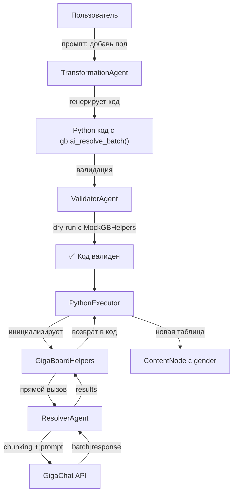
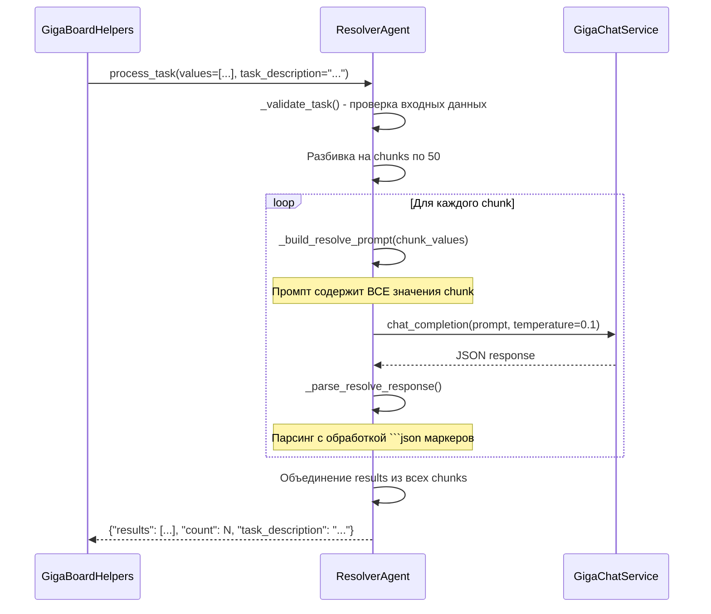

# 🤖 AI Resolver System — Семантические трансформации данных

**Дата реализации**: 31 января 2026  
**Статус**: ✅ РЕАЛИЗОВАНО  
**Версия**: 1.0

---

## Executive Summary

**AI Resolver System** — встроенная возможность вызова AI из сгенерированного кода трансформаций для решения семантических задач, которые невозможно выполнить чистым SQL/Pandas.

**Ключевые концепции:**
- Модуль `gb` (GigaBoardHelpers) доступен в сгенерированном коде
- `gb.ai_resolve_batch()` — batch-резолвинг через GigaChat
- Прозрачная интеграция — пользователь пишет "добавь столбец с полом", AI генерирует код с `gb.ai_resolve_batch()`
- Direct agent calls — никаких HTTP запросов, вызов ResolverAgent напрямую
- `nest_asyncio` — корректная работа в async контексте

**Примеры применения:**
- "Определи пол человека по имени" → `gb.ai_resolve_batch(names, "определи пол: M или F")`
- "Классифицируй отзывы на позитивные/негативные" → `gb.ai_resolve_batch(reviews, "sentiment: positive/negative")`
- "Извлеки email из текста" → `gb.ai_resolve_batch(texts, "извлеки email адрес")`
- "Переведи названия с русского на английский" → `gb.ai_resolve_batch(titles, "translate to English")`

---

## 🎯 Кейс использования

### Сценарий: Добавление столбца "пол" по имени

```python
# У пользователя есть таблица test_data с колонками: id, name, age, city

# 1. Пользователь вводит промпт: "добавь столбец с полом человека"

# 2. TransformationAgent генерирует код:
df_result = df.copy()
names = df_result['name'].tolist()
genders = gb.ai_resolve_batch(
    names,
    "определите пол человека по имени, верните M для мужчин и F для женщин"
)
df_result['gender'] = genders

# 3. ValidatorAgent проверяет код в dry-run режиме с MockGBHelpers

# 4. PythonExecutor выполняет код:
#    - gb.ai_resolve_batch(['Алексей', 'Мария', 'Иван', ...])
#    - ResolverAgent вызывает GigaChat
#    - Возвращает ['M', 'F', 'M', ...]
#    - df_result получает новый столбец 'gender'

# 5. Результат: таблица с новым столбцом
# | id | name    | age | city   | gender |
# |----|---------|-----|--------|--------|
# | 1  | Алексей | 30  | Москва | M      |
# | 2  | Мария   | 25  | Питер  | F      |
```

---

## 🏗️ Архитектура

### Компоненты системы



### Ключевые модули

#### 1. **GigaBoardHelpers** ([gigaboard_helpers.py](../apps/backend/app/services/executors/gigaboard_helpers.py))

**Ответственность:**
- Предоставление `gb` модуля в namespace сгенерированного кода
- Batch и single API для AI резолвинга
- Прямой вызов ResolverAgent (без HTTP)
- Обработка async вызовов через `nest_asyncio`

**API:**

```python
class GigaBoardHelpers:
    def __init__(self, resolver_agent):
        """Args: resolver_agent - экземпляр ResolverAgent"""
        self.resolver_agent = resolver_agent
    
    def ai_resolve_batch(
        self,
        values: List[Any],
        task_description: str,
        result_format: str = "string",
        chunk_size: int = 50
    ) -> List[Any]:
        """
        Резолвит список значений через AI.
        
        Args:
            values: Список значений для резолвинга
            task_description: Описание задачи (например, "определи пол по имени")
            result_format: Формат результата ("string", "number", "json")
            chunk_size: Размер чанка для batch обработки
        
        Returns:
            Список результатов в том же порядке, что и входные значения
        """
        
    def ai_resolve_single(self, value: Any, task_description: str) -> Any:
        """Резолвит одно значение через AI (обертка над batch)."""
```

**Использование в коде трансформаций:**

```python
# Batch processing
names = df['name'].tolist()
genders = gb.ai_resolve_batch(names, "определи пол: M или F")
df['gender'] = genders

# Single value
city = "Moscow"
country = gb.ai_resolve_single(city, "в какой стране находится этот город?")

# С настройками формата
ages = df['age'].tolist()
categories = gb.ai_resolve_batch(
    ages, 
    "возрастная категория: child/teen/adult/senior",
    result_format="string",
    chunk_size=100
)
```

#### 2. **ResolverAgent** ([resolver.py](../apps/backend/app/services/multi_agent/agents/resolver.py))

**Ответственность:**
- Batch обработка значений через GigaChat
- Chunking для больших списков (по 50 элементов)
- Парсинг JSON ответа от GigaChat
- Обработка ошибок и fallback в None

**Процесс обработки:**



**Ключевые особенности:**

- **Chunking**: 50 значений по умолчанию (настраивается)
- **Prompt**: Содержит **все значения** chunk (не только примеры)
- **Temperature**: 0.1 для консистентности
- **Парсинг**: Обрабатывает `\`\`\`json` маркеры от GigaChat
- **Fallback**: При ошибке возвращает `[None] * len(values)`

**Пример промпта:**

```
TASK: определите пол человека по имени, верните M или F

INPUT VALUES (5 total):
1. Алексей
2. Мария
3. Иван
4. Ольга
5. Дмитрий

REQUIREMENTS:
- Process ALL 5 input values listed above
- Return results in the SAME ORDER as input (1, 2, 3, ...)
- Use consistent logic across all values
- If value cannot be resolved, return null

Return ONLY valid JSON in this format:
{
  "results": [result1, result2, result3, ...]
}

CRITICAL: 
- Array length MUST be exactly 5
- Results must match input order exactly
- Use simple string values
- No extra text, only JSON
```

#### 3. **ValidatorAgent с MockGBHelpers** ([validator.py](../apps/backend/app/services/multi_agent/agents/validator.py))

**Проблема:** Dry-run валидация не может вызывать реальный AI (долго, дорого)

**Решение:** MockGBHelpers в namespace

```python
class MockGBHelpers:
    """Mock для валидации кода с gb.ai_resolve_batch()"""
    
    def ai_resolve_batch(self, values, task_description, result_format="string", chunk_size=50):
        """Возвращает список None той же длины"""
        return [None] * len(values)
    
    def ai_resolve_single(self, value, task_description):
        """Возвращает None"""
        return None

# В ValidatorAgent
namespace = {
    'pd': pd,
    'np': np,
    'gb': MockGBHelpers(),  # Mock для dry-run
    '__builtins__': {}
}
```

**Результат:** Код с `gb.ai_resolve_batch()` проходит валидацию, но AI не вызывается

#### 4. **Интеграция в PythonExecutor** ([python_executor.py](../apps/backend/app/services/executors/python_executor.py))

**Инициализация gb модуля:**

```python
def execute_transformation(...):
    namespace = {'df': df, 'pd': pd, 'np': np}
    
    # Инициализация GigaBoard helpers
    try:
        gb_helpers = init_helpers()  # Создаёт ResolverAgent внутри
        namespace['gb'] = gb_helpers
        logger.info("✅ GigaBoard helpers (gb) initialized")
    except Exception as e:
        logger.warning(f"⚠️ Failed to initialize gb helpers: {e}")
    
    # Выполнение кода
    exec(code, namespace)
```

**Функция init_helpers() с singleton pattern:**

```python
# Singleton instance
_helpers_instance: Optional[GigaBoardHelpers] = None

def init_helpers():
    """Инициализирует GigaBoardHelpers с ResolverAgent."""
    global _helpers_instance
    
    # Импортируем и создаем ResolverAgent
    from ..multi_agent.agents.resolver import get_resolver_agent
    resolver_agent = get_resolver_agent()
    
    _helpers_instance = GigaBoardHelpers(resolver_agent)
    return _helpers_instance

def get_helpers() -> GigaBoardHelpers:
    """Получить экземпляр helpers."""
    global _helpers_instance
    if _helpers_instance is None:
        raise RuntimeError("GigaBoardHelpers not initialized. Call init_helpers() first.")
    return _helpers_instance
```

**Singleton pattern:** Один экземпляр GigaBoardHelpers на весь процесс для переиспользования ResolverAgent.

---

## 🔧 Технические детали

### Обработка async контекста через nest_asyncio

**Проблема:** 
- PythonExecutor выполняет код синхронно (exec)
- ResolverAgent — async (использует GigaChatService)
- Попытка вызвать `asyncio.run()` из running event loop → ошибка

**Решение 1 (устарело, вызывало deadlock):**
```python
# ❌ HTTP вызов — DEADLOCK
requests.post("http://localhost:8000/api/v1/ai/resolve", ...)
```

**Решение 2 (устарело, event loop mismatch):**
```python
# ❌ ThreadPoolExecutor + asyncio.run() — новый event loop
with ThreadPoolExecutor() as executor:
    future = executor.submit(asyncio.run, coro)
```

**Решение 3 (текущее, работает):**
```python
# ✅ nest_asyncio + run_until_complete
import nest_asyncio
nest_asyncio.apply()  # Разрешает вложенные event loops

loop = asyncio.get_event_loop()
result = loop.run_until_complete(
    self.resolver_agent.process_task(task, context={})
)
```

**Почему работает:**
- `nest_asyncio` патчит asyncio для поддержки вложенных loops
- Используется существующий event loop (с GigaChat client)
- Никаких новых event loops или потоков

### Chunking strategy

**Зачем:**
- GigaChat имеет ограничения на размер промпта
- Для 1000 значений — промпт будет огромным
- Batch processing улучшает reliability

**Алгоритм:**

```python
chunks = [values[i:i+chunk_size] for i in range(0, len(values), chunk_size)]

for i, chunk in enumerate(chunks):
    logger.info(f"📦 Processing chunk {i+1}/{len(chunks)} ({len(chunk)} values)")
    result = await self._process_chunk(chunk, task_description, result_format)
    all_results.extend(result)
```

**Настройка chunk_size:**
- По умолчанию: 50
- Для коротких значений (имена, категории): можно 100
- Для длинных (тексты, описания): 10-20

### Error handling

**На уровне ResolverAgent:**
```python
try:
    # Вызов GigaChat
    response = await self.gigachat.chat_completion(...)
    results = self._parse_resolve_response(response)
    
    return {
        "results": all_results,
        "count": len(all_results),
        "task_description": task_description
    }
except Exception as e:
    logger.error(f"❌ Batch resolve failed: {e}")
    return self._format_error_response(
        f"Resolve failed: {str(e)}",
        suggestions=["Check input format", "Try smaller batch size"]
    )
```

**На уровне GigaBoardHelpers:**
```python
if "error" in result:
    logger.error(f"❌ AI resolve error: {result['error']}")
    return [None] * len(values)

# Извлекаем results из ответа
results = result.get("results", [None] * len(values))
logger.info(f"✅ ai_resolve_batch success: {len(results)} results")
return results
```

**Результат:** 
- Код не падает при ошибке AI
- Возвращает `[None, None, ...]` 
- Пользователь видит таблицу с `None` в новом столбце

---

## 📊 Производительность

### Бенчмарк (5 значений)

```
2026-01-31 23:21:12 — Test: "добавь столбец с полом"
Input: ['Алексей', 'Мария', 'Иван', 'Ольга', 'Дмитрий']

Timing:
├─ Code generation (TransformationAgent): ~3s
├─ Validation (ValidatorAgent): ~100ms
├─ Execution start: 0ms
├─ gb.ai_resolve_batch:
│  ├─ ResolverAgent.process_task: 2s
│  ├─ GigaChat API call: 1.5s
│  └─ Parsing + return: 0.5s
└─ Total execution: 19ms (без AI: 2ms)

Total end-to-end: ~5-6s
```

### Масштабирование

| Размер | Chunks | Время (оценка) | Примечание                 |
| ------ | ------ | -------------- | -------------------------- |
| 10     | 1      | 2-3s           | Одиночный запрос           |
| 50     | 1      | 2-3s           | Один chunk (оптимально)    |
| 100    | 2      | 4-6s           | 2 последовательных запроса |
| 500    | 10     | 20-30s         | 10 chunks                  |
| 1000   | 20     | 40-60s         | Может быть долго для UI    |

**Рекомендации:**
- Для >100 значений — показывать прогресс-бар в UI
- Для >500 значений — возможно асинхронное выполнение + уведомление

---

## 🔒 Безопасность

### Sandbox execution

**PythonExecutor:**
- Ограниченный namespace: `pd`, `np`, `gb` — только
- `__builtins__`: стандартный (для pandas/numpy работы)
- Никаких явных `import`, `open()`, `eval()` в пользовательском коде

**GigaBoardHelpers:**
- Прямой вызов ResolverAgent — никаких HTTP из user code
- Timeout неявный (через GigaChatService)
- Graceful fallback при ошибках: возврат `[None] * len(values)`

### Аутентификация

**REST endpoint `/api/v1/ai/resolve`:**
- Требует аутентификации: `Authorization: Bearer <access_token>`
- Использует `get_current_user` dependency от FastAPI
- Endpoint существует для прямого доступа, но **не используется** в основном workflow

**GigaBoardHelpers (gb module):**
- Не требует аутентификации пользователя
- ResolverAgent создаётся с GigaChatService из контекста приложения
- GigaChat credentials — на уровне сервера (environment variables: `GIGACHAT_API_KEY`)
- User не может подменить API key или URL

---

## 📝 API Reference

### GigaBoardHelpers.ai_resolve_batch()

```python
def ai_resolve_batch(
    self,
    values: List[Any],           # Список значений для обработки
    task_description: str,       # Описание задачи на естественном языке
    result_format: str = "string",  # "string" | "number" | "json"
    chunk_size: int = 50         # Размер chunk для batch processing
) -> List[Any]:
    """
    Резолвит список значений через AI.
    
    Examples:
        # Определение пола
        genders = gb.ai_resolve_batch(
            df['name'].tolist(),
            "определи пол: M или F"
        )
        
        # Sentiment analysis
        sentiments = gb.ai_resolve_batch(
            reviews,
            "классифицируй отзыв: positive/negative/neutral"
        )
        
        # Числовой результат
        scores = gb.ai_resolve_batch(
            texts,
            "оцени качество текста от 1 до 10",
            result_format="number"
        )
        
        # JSON результат
        entities = gb.ai_resolve_batch(
            texts,
            "извлеки: {name: str, age: int, city: str}",
            result_format="json"
        )
    
    Returns:
        Список результатов той же длины, что и values.
        При ошибке — [None, None, ...].
    """
```

### GigaBoardHelpers.ai_resolve_single()

```python
def ai_resolve_single(
    self,
    value: Any,              # Одно значение
    task_description: str    # Описание задачи
) -> Any:
    """
    Резолвит одно значение (обертка над ai_resolve_batch).
    
    Example:
        country = gb.ai_resolve_single("Москва", "страна города")
        # → "Россия"
    """
```

---

## 🧪 Тестирование

### Unit тесты

```python
# test_gigaboard_helpers.py
def test_ai_resolve_batch_with_mock():
    """Тест с mock ResolverAgent"""
    mock_agent = Mock()
    mock_agent.process_task.return_value = {
        "status": "success",
        "results": ["M", "F", "M"]
    }
    
    gb = GigaBoardHelpers(mock_agent)
    results = gb.ai_resolve_batch(
        ["Алексей", "Мария", "Иван"],
        "определи пол"
    )
    
    assert results == ["M", "F", "M"]
    mock_agent.process_task.assert_called_once()
```

### Integration тесты

```python
# test_resolver_agent.py
async def test_resolver_agent_real_gigachat():
    """Тест с реальным GigaChat API"""
    agent = get_resolver_agent()
    task = {
        "type": "resolve_batch",
        "values": ["Алексей", "Мария"],
        "task_description": "определи пол: M или F"
    }
    
    result = await agent.process_task(task, context={})
    
    assert "results" in result
    assert len(result["results"]) == 2
    assert result["results"][0] in ["M", "F", None]
    assert result["count"] == 2
```

### End-to-end тест

```python
# test_transformation_with_ai_resolve.py
def test_transformation_add_gender_column():
    """Полный workflow: промпт → код → выполнение"""
    # 1. Создать ContentNode с тестовыми данными
    content_node = create_test_content_node(
        data={"id": [1, 2], "name": ["Алексей", "Мария"]}
    )
    
    # 2. Запросить трансформацию
    response = client.post(
        f"/api/v1/content-nodes/{content_node.id}/transform/test",
        json={"prompt": "добавь столбец с полом человека"}
    )
    
    # 3. Проверить сгенерированный код
    assert "gb.ai_resolve_batch" in response.json()["transformation_code"]
    
    # 4. Выполнить трансформацию
    exec_response = client.post(
        f"/api/v1/content-nodes/{content_node.id}/transform/execute",
        json={"transformation_code": response.json()["transformation_code"]}
    )
    
    # 5. Проверить результат
    result_table = exec_response.json()["result_tables"][0]
    assert "gender" in result_table["columns"]
    assert result_table["data"][0]["gender"] in ["M", "F"]
```

---

## 🚀 Deployment

### Зависимости

```toml
# apps/backend/pyproject.toml
[project]
dependencies = [
    "nest-asyncio==1.6.0",  # Для вложенных event loops
    # ... остальные
]
```

### Environment variables

```bash
# Не требуется дополнительных переменных
# GigaChat credentials уже настроены для GigaChatService
GIGACHAT_API_KEY=your_key
GIGACHAT_MODEL=GigaChat:latest
```

### Мониторинг

**Логи:**

```python
# GigaBoardHelpers
logger.info(f"🔍 ai_resolve_batch called: {len(values)} values")
logger.info(f"✅ ai_resolve_batch success: {len(results)} results")
logger.error(f"❌ AI resolve error: {error}")

# ResolverAgent
logger.info(f"🔍 Resolving {len(values)} values: '{task_description}'")
logger.info(f"📦 Processing chunk {i+1}/{total_chunks}")
logger.error(f"❌ Batch resolve failed: {error}")
```

**Метрики (рекомендуется добавить):**

```python
# Prometheus metrics
ai_resolve_requests_total = Counter('ai_resolve_requests_total')
ai_resolve_duration_seconds = Histogram('ai_resolve_duration_seconds')
ai_resolve_values_total = Counter('ai_resolve_values_total')
ai_resolve_errors_total = Counter('ai_resolve_errors_total')
```

---

## 📚 Примеры использования

### 1. Определение пола по имени

```python
# Промпт: "добавь столбец с полом человека"

# Сгенерированный код:
df_result = df.copy()
names = df_result['name'].tolist()
genders = gb.ai_resolve_batch(
    names,
    "определите пол человека по имени, верните M для мужчин и F для женщин"
)
df_result['gender'] = genders
```

### 2. Sentiment analysis отзывов

```python
# Промпт: "добавь sentiment для отзывов"

df_result = df.copy()
reviews = df_result['review_text'].tolist()
sentiments = gb.ai_resolve_batch(
    reviews,
    "классифицируй sentiment отзыва: positive, negative или neutral",
    chunk_size=20  # Меньше chunk из-за длинных текстов
)
df_result['sentiment'] = sentiments
```

### 3. Извлечение email из текста

```python
# Промпт: "извлеки email адреса из колонки description"

df_result = df.copy()
descriptions = df_result['description'].tolist()
emails = gb.ai_resolve_batch(
    descriptions,
    "извлеки email адрес из текста, если email нет — верни null"
)
df_result['email'] = emails
```

### 4. Категоризация продуктов

```python
# Промпт: "добавь категорию продукта"

df_result = df.copy()
products = df_result['product_name'].tolist()
categories = gb.ai_resolve_batch(
    products,
    "определи категорию продукта: electronics, clothing, food, home, other"
)
df_result['category'] = categories
```

### 5. Перевод названий

```python
# Промпт: "переведи названия на английский"

df_result = df.copy()
titles_ru = df_result['title_ru'].tolist()
titles_en = gb.ai_resolve_batch(
    titles_ru,
    "переведи текст с русского на английский"
)
df_result['title_en'] = titles_en
```

---

## 🔮 Будущие улучшения

### Phase 2: Параллельная обработка chunks

**Текущее:** Sequential processing
```python
for chunk in chunks:
    result = await process_chunk(chunk)
```

**Улучшение:** Parallel processing
```python
tasks = [process_chunk(chunk) for chunk in chunks]
results = await asyncio.gather(*tasks)
```

**Выгода:** 10 chunks × 2s = 20s → 2-3s

### Phase 3: Кэширование результатов

**Идея:** Кэшировать `(value, task_description) → result`

```python
cache_key = f"{hash(value)}:{hash(task_description)}"
if cache_key in redis:
    return redis.get(cache_key)
```

**Выгода:** 
- Повторные трансформации — мгновенно
- Экономия API calls

### Phase 4: Streaming для UI

**Идея:** Возвращать результаты по мере готовности chunks

```python
async def ai_resolve_batch_stream(...):
    for chunk in chunks:
        results = await process_chunk(chunk)
        yield {"chunk": i, "results": results}
```

**Выгода:** UI показывает прогресс в реальном времени

### Phase 5: Fine-tuned модель для типовых задач

**Идея:** Fine-tune GigaChat на типовых задачах (gender, sentiment, category)

**Выгода:**
- Быстрее inference
- Выше accuracy
- Дешевле API calls

---

## 📖 См. также

- [MULTI_AGENT_SYSTEM.md](./MULTI_AGENT_SYSTEM.md) — общая архитектура агентов
- [DATA_NODE_SYSTEM.md](./DATA_NODE_SYSTEM.md) — система узлов данных
- [API.md](./API.md#post-apiv1airesolve) — REST endpoint для AI Resolver
- [DEVELOPER_CHECKLIST.md](./DEVELOPER_CHECKLIST.md) — чеклист для разработчиков

---

## 🐛 Troubleshooting

### "Event loop is bound to a different event loop"

**Причина:** GigaChat client создан в одном event loop, вызван в другом

**Решение:** Убедись, что установлен `nest-asyncio`:
```bash
uv pip install nest-asyncio
```

Проверь, что в `gigaboard_helpers.py` есть:
```python
import nest_asyncio
nest_asyncio.apply()
```

### "name 'gb' is not defined" в ValidatorAgent

**Причина:** MockGBHelpers не добавлен в namespace

**Решение:** Проверь `validator.py`:
```python
namespace = {'gb': MockGBHelpers(), ...}
```

### Deadlock при выполнении трансформации

**Причина:** HTTP вызов к самому себе (устаревшая версия)

**Решение:** Используй прямой вызов ResolverAgent (текущая версия):
```python
# ❌ НЕ ТАК (старая версия с HTTP)
requests.post("http://localhost:8000/api/v1/ai/resolve")

# ✅ ТАК (текущая версия)
resolver_agent = get_resolver_agent()
result = loop.run_until_complete(resolver_agent.process_task(...))
```

**Примечание:** Текущая реализация уже использует прямой вызов, deadlock исправлен.

### Таблица с None в новом столбце

**Причина:** Ошибка в ResolverAgent или GigaChat

**Диагностика:** Проверь логи:
```
ERROR:agent.resolver:❌ Batch resolve failed: ...
ERROR:gigaboard_helpers:❌ AI resolve error: ...
```

**Решение:** 
- Проверь GigaChat credentials
- Проверь prompt (слишком сложный?)
- Увеличь timeout

---

**Последнее обновление**: 31 января 2026  
**Автор**: GigaBoard Team  
**Версия**: 1.0
