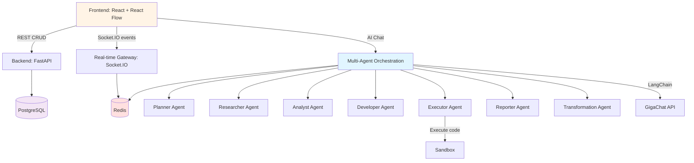

# Архитектура проекта GigaBoard

## 🎯 Executive Summary

**GigaBoard** — AI-powered платформа для создания data pipelines с концепцией **Data-Centric Canvas**. Ключевая особенность: явное разделение источников данных (SourceNode) и результатов обработки (ContentNode), что обеспечивает прозрачность data lineage, поддержку streaming данных и автоматическое обновление визуализаций.

### Ключевые архитектурные решения
- **4 типа узлов**: SourceNode (источники) → ContentNode (данные) → WidgetNode (визуализации) + CommentNode (аннотации)
- **6 типов связей**: EXTRACT, TRANSFORMATION, VISUALIZATION, COMMENT, REFERENCE, DRILL_DOWN
- **Multi-Agent система**: 9 специализированных AI агентов для автоматизации аналитики
- **Real-time first**: Socket.IO + Redis pub/sub для мгновенной синхронизации
- **Streaming support**: WebSocket/SSE источники с аккумуляцией и архивированием

---

## Общий обзор

GigaBoard — AI-powered платформа для создания и автоматизации data pipelines с клиент-серверной архитектурой и real-time взаимодействием.

### Ключевая концепция: Data-Centric Canvas

UI представляет бесконечное полотно (React Flow), где на канвасе размещаются **узлы четырёх типов**:

1. **SourceNode** 🆕 - точки входа данных: файлы, подключения к СУБД, API endpoints, AI-промпты, streaming источники
2. **ContentNode** 🆕 - результаты обработки данных: текстовые резюме + структурированные таблицы (N tables)
3. **WidgetNode** - визуализации ContentNode, HTML/CSS/JS код, сгенерированный AI-агентом
4. **CommentNode** - комментарии и аннотации к любым узлам

**Связи между узлами** означают преобразования и отношения:
- **EXTRACT** 🆕 - извлечение данных (SourceNode → ContentNode)
- **TRANSFORMATION** - преобразование данных (ContentNode(s) → ContentNode) через произвольный Python код
- **VISUALIZATION** - визуализация данных (ContentNode → WidgetNode)
- **COMMENT** - комментирование (CommentNode → любой узел)
- **REFERENCE**, **DRILL_DOWN** - ссылки и детализация

> **🆕 Новая архитектура (FR-14)**: Вместо универсальной DataNode используется явное разделение на SourceNode (источники) и ContentNode (результаты). Это обеспечивает чёткий data lineage, упрощает refresh/replay операций и поддерживает real-time streaming с архивированием. См. [SOURCE_CONTENT_NODE_CONCEPT.md](SOURCE_CONTENT_NODE_CONCEPT.md) для деталей.

Сервер обеспечивает API для управления узлами и связями, real-time обновления через Socket.IO, мультиагентную оркестрацию через GigaChat (langchain-gigachat) и безопасное выполнение трансформаций в sandbox.

## Компоненты системы

### 1. Frontend (React)
**Назначение**: UI-полотно, редактирование и взаимодействие с SourceNode/ContentNode/WidgetNode/CommentNode, чат с AI.
**Ответственность**: 
- Рендер бесконечного канваса (React Flow) с четырьмя типами узлов: SourceNode, ContentNode, WidgetNode, CommentNode
- Визуализация связей: EXTRACT, TRANSFORMATION, VISUALIZATION, COMMENT, REFERENCE, DRILL_DOWN
- Локальное состояние доски (Zustand) + кэш запросов (TanStack Query)
- Real-time синхронизация по Socket.IO client
- UI-кит ShadCN (формы, панели, модальные окна)
- **AI Assistant Panel** в правом боковом панеле с историей диалога и рекомендациями
- Отображение графа зависимостей и data lineage
- **Streaming indicators** 🔴 LIVE badges для real-time источников
**Интерфейсы**: REST/JSON к FastAPI, Socket.IO events.

### 2. Backend API (FastAPI)
**Назначение**: CRUD для бордов, узлов (SourceNode/ContentNode/WidgetNode/CommentNode), трансформаций, аутентификация, управление сессиями.
**Ответственность**:
- REST API для бордов, узлов всех типов, связей (edges), трансформаций, ассетов
- **Управление источниками данных**: извлечение (extract), валидация, refresh, архивирование
- **Управление трансформациями**: создание, выполнение, версионирование, replay (5 режимов)
- **Streaming support**: WebSocket/SSE/Kafka handlers, аккумуляция + архивирование
- Аутентификация и авторизация (JWT)
- Валидация контрактов (Pydantic v2)
**Интерфейсы**: HTTP/JSON, OpenAPI/Swagger UI.

### 3. Real-time Gateway (FastAPI + Socket.IO)
**Назначение**: События совместного редактирования и обновлений состояния узлов.
**Ответственность**:
- Комнаты по boardId, события добавления/перемещения/удаления узлов (SourceNode/ContentNode/WidgetNode/CommentNode)
- События создания/удаления связей (EXTRACT, TRANSFORMATION, VISUALIZATION, COMMENT)
- **Streaming events**: real-time обновления ContentNode от streaming источников
- События выполнения трансформаций и обновления данных
- Транзит событий через Redis pub/sub для масштабирования по инстансам
**Интерфейсы**: Socket.IO (ws + fallback), Redis pub/sub.

### 4. Multi-Agent Orchestration Layer (LangChain + GigaChat)
**Назначение**: Интерпретация естественного языка, управление командой специализированных AI агентов, динамическое создание инструментов, выполнение аналитических задач в контексте текущей доски, активное редактирование досок.

**Статус**: 🚧 В разработке. LangChain и langchain-gigachat зависимости будут добавлены в процессе реализации FR-6 (AI Assistant Panel).

**Компоненты**:
- **Planner Agent**: Разбивает сложные запросы на подзадачи, маршрутизирует к специализированным агентам
- **Researcher Agent**: Получает данные из БД, API, веб-сайтов
- **Analyst Agent**: Анализирует данные, находит закономерности, генерирует инсайты
- **Developer Agent**: Пишет код для инструментов на Python/SQL/JS
- **Executor Agent**: Выполняет инструменты в sandboxed окружении
- **Form Generator Agent**: Генерирует динамические формы для ввода данных
- **Reporter Agent**: Анализирует ContentNode и генерирует HTML/CSS/JS код для визуализации, создает WidgetNode на канвасе, связывает через VISUALIZATION edge, **строит доски (добавляет узлы, создает связи)**
- **Data Discovery Agent**: Находит и интегрирует публичные датасеты, создаёт SourceNode для внешних источников
- **Transformation Agent**: Генерирует произвольный Python код для преобразования ContentNode, принимает один или несколько source ContentNode и текстовое описание задачи, создаёт новые ContentNode с сохранением data lineage и кода трансформации для автоматизации

**Ответственность**:
- Парсинг пользовательских запросов
- Управление межагентной коммуникацией через Message Bus (Redis pub/sub)
- Динамическое создание и выполнение инструментов (код-генерация + песочница)
- Контекстный анализ доски (текущие узлы, данные, связи, граф трансформаций)
- **Генерация произвольного Python кода для трансформаций ContentNode**
- **Активное редактирование досок: добавление/удаление узлов (SourceNode/ContentNode/WidgetNode/CommentNode), создание/удаление связей (EXTRACT/TRANSFORMATION/VISUALIZATION/COMMENT)**
- **Построение оптимальных лэйаутов для узлов на канвасе**
- **Управление автоматизацией: replay трансформаций при обновлении source ContentNode, refresh ContentNode при обновлении SourceNode**
- Сохранение истории диалога, метрик выполнения, кода трансформаций
- Обеспечение безопасности при выполнении пользовательского кода в sandbox

**Интерфейсы**: Внутренний сервис, вызовы к GigaChat через langchain-gigachat, Redis Message Bus.

### 5. Data Layer
**Назначение**: Хранение бордов, узлов (SourceNode/ContentNode/WidgetNode/CommentNode), связей, трансформаций, пользовательских профилей.
**Технологии**: PostgreSQL + SQLAlchemy.
**Ответственность**:
- Схемы БД:
  - **boards**: проекты/доски
  - **source_nodes**: 🆕 источники данных (file, database, api, stream, prompt, manual)
  - **content_nodes**: 🆕 обработанные данные (text + N tables)
  - **widget_nodes**: визуализации (HTML/CSS/JS код)
  - **comment_nodes**: комментарии пользователей
  - **edges**: связи между узлами (EXTRACT, TRANSFORMATION, VISUALIZATION, COMMENT, REFERENCE, DRILL_DOWN)
  - **transformations**: метаданные трансформаций (код, prompt, source nodes, target node, execution metadata)
  - **assets**: файлы и бинарные данные
  - **users**, **sessions**: пользователи и сессии
  - **board_history**: история изменений доски
  - **stream_archives**: 🆕 архив streaming данных
- Миграции: Alembic (базовая структура реализована, требует обновления под Source-Content модель)

### 6. Tool Sandbox & Execution Environment
**Назначение**: Безопасное выполнение кода трансформаций и инструментов, написанных Transformation Agent и Developer Agent (Python, SQL, JavaScript).
**Технологии**: Docker контейнеры OR процессная изоляция с resource limits.
**Ответственность**:
- Валидация и линтинг кода трансформаций перед выполнением
- Изоляция выполнения (timeout, memory limit, disk limit)
- Capture output/errors/logs
- Версионирование трансформаций
- Поддержка множественных входов (source ContentNodes) для трансформаций
- Автоматический replay трансформаций при обновлении source данных (5 режимов: throttled, batched, manual, intelligent, selective)

### 7. Tool Registry
**Назначение**: Хранилище встроенных и пользовательских инструментов.
**Технологии**: PostgreSQL + Redis cache.
**Ответственность**:
- Регистрация инструментов (встроенные: SQL, HTTP, file operations, web scraping)
- Версионирование кода инструментов
- Метрики использования и производительности
- Управление доступом и разрешениями

### 8. Node Management System
**Назначение**: Позволяет агентам и пользователям активно строить доски, размещая узлы (SourceNode/ContentNode/WidgetNode/CommentNode) и создавая связи между ними.
**Компоненты**:
- **SourceNode Manager**: 🆕 CRUD для источников данных (extract, validate, refresh, archive)
- **ContentNode Manager**: 🆕 CRUD для обработанных данных (text + N tables)
- **WidgetNode Manager**: Управление визуализациями (создание из ContentNode, обновление кода, удаление)
- **CommentNode Manager**: Управление комментариями (создание, редактирование, удаление)
- **Edge Manager**: Управление связями между узлами (типы: EXTRACT, TRANSFORMATION, VISUALIZATION, COMMENT, REFERENCE, DRILL_DOWN)
- **Transformation Manager**: Управление трансформациями (создание, выполнение, replay, версионирование)
- **Layout Planner**: Генерирует оптимальные лэйауты узлов (flow, grid, hierarchy, freeform)
- **Board History**: Отслеживает изменения доски, поддерживает версионирование

**Ответственность**:
- Позволяет Researcher Agent создавать SourceNode для внешних источников
- Позволяет Transformation Agent создавать ContentNode с результатами трансформаций
- Позволяет Reporter Agent создавать WidgetNode с визуализациями ContentNode
- Валидирует создание связей (проверка типов, циклические зависимости)
- Управляет графом зависимостей (data lineage): SourceNode → ContentNode → WidgetNode
- Отслеживает изменения SourceNode и триггерит refresh ContentNode
- Отслеживает изменения source ContentNode и триггерит replay трансформаций
- Отправляет real-time обновления через Socket.IO
- Сохраняет историю редактирования и код трансформаций
- Поддерживает откат к предыдущим версиям

### 9. Cache/Queue
**Назначение**: Быстрый доступ к сессионным данным и pub/sub для real-time, межагентная коммуникация.
**Технологии**: Redis.
**Ответственность**: 
- Кэш подсказок AI, результатов запросов
- Message Bus для inter-agent communication (pub/sub)
- Throttle для частых операций
- WebSocket events broadcast

## Взаимодействие компонентов

## Поток данных (примеры)

### Пример 1: Простой запрос (старая модель)
1) Пользователь: "Покажи продажи по регионам"
2) Orchestration → Плanner → Researcher → SQL запрос
3) Результат → Analyst → Reporter → Widget на доске

### Пример 2: Сложный запрос с динамическим инструментом (новая модель)
1) Пользователь: "Загрузи цены с сайта конкурента и сравни с нашими"
2) Orchestration → Planner (разбивает на подзадачи)
3) Developer Agent:
   - Анализирует требование
   - Пишет код web scraper
   - Тестирует в sandbox
   - Регистрирует инструмент
4) Executor Agent:
   - Выполняет scraper
   - Возвращает цены
5) Analyst Agent:
   - Сравнивает цены
   - Находит отличия
6) Reporter Agent:
   - Создает таблицу/график
   - Добавляет widget на доску

## Технологический стек

- Язык: TypeScript (FE), Python 3.11+ (BE)
- Фреймворк: React + Vite (FE), FastAPI (BE)
- Real-time: Socket.IO (client/server), Redis pub/sub
- AI: langchain-gigachat
- База данных: PostgreSQL + SQLAlchemy
- Инфраструктура: .venv для Python, npm для FE; Docker позже (не приоритет сейчас)
- Тестирование: Vitest + React Testing Library; pytest + pytest-asyncio
- Качество: mypy, ESLint + Prettier

## Требования к масштабируемости и производительности (MVP)
- Поддержка 50-100 одновременных пользователей на борд без ощутимых задержек
- Latency real-time событий < 150 мс при локальной сети, < 400 мс при WAN
- REST API P95 < 300 мс на CRUD-операции бордов/виджетов
- Горизонтальное масштабирование real-time через Redis pub/sub и несколько приложений FastAPI/Socket.IO

---

**Состояние**: Draft  
**Последнее обновление**: 2026-01-29 (актуализация под Source-Content Node Architecture)
