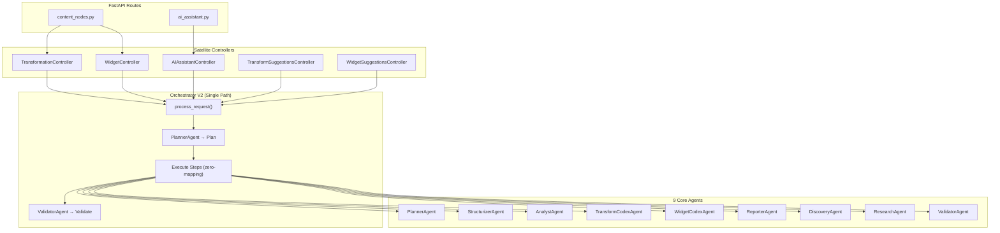
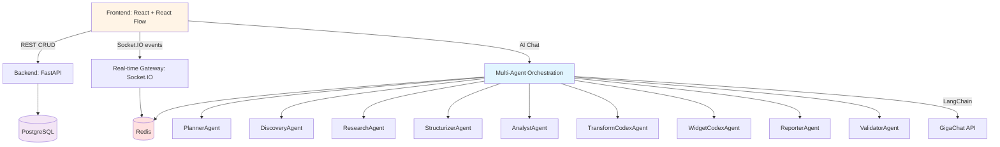

# Архитектура проекта GigaBoard

## 🎯 Executive Summary

**GigaBoard** — AI-powered платформа для создания data pipelines с концепцией **Data-Centric Canvas**. Ключевая особенность: явное разделение источников данных (SourceNode) и результатов обработки (ContentNode), что обеспечивает прозрачность data lineage, поддержку streaming данных и автоматическое обновление визуализаций.

### Ключевые архитектурные решения
- **4 типа узлов**: SourceNode (источники) → ContentNode (данные) → WidgetNode (визуализации) + CommentNode (аннотации)
- **5 типов связей**: TRANSFORMATION, VISUALIZATION, COMMENT, REFERENCE, DRILL_DOWN
- **Multi-Agent система**: 9 специализированных AI агентов для автоматизации аналитики
- **Real-time first**: Socket.IO + Redis pub/sub для мгновенной синхронизации
- **Streaming support**: WebSocket/SSE источники с аккумуляцией и архивированием

---

## Общий обзор

GigaBoard — AI-powered платформа для создания и автоматизации data pipelines с клиент-серверной архитектурой и real-time взаимодействием.

### Ключевая концепция: Data-Centric Canvas

UI представляет бесконечное полотно (React Flow), где на канвасе размещаются **узлы четырёх типов**:

1. **SourceNode** 🆕 - точки входа данных: файлы, подключения к СУБД, API endpoints, AI-промпты, streaming источники
2. **ContentNode** 🆕 - результаты обработки данных: текстовые резюме + структурированные таблицы (N tables)
3. **WidgetNode** - визуализации ContentNode, HTML/CSS/JS код, сгенерированный AI-агентом
4. **CommentNode** - комментарии и аннотации к любым узлам

**Связи между узлами** означают преобразования и отношения:
- **TRANSFORMATION** - преобразование данных (ContentNode(s) → ContentNode) через произвольный Python код
- **VISUALIZATION** - визуализация данных (ContentNode → WidgetNode)
- **COMMENT** - комментирование (CommentNode → любой узел)
- **REFERENCE**, **DRILL_DOWN** - ссылки и детализация

> **Архитектура Source-Content**: SourceNode **наследует** ContentNode и содержит как конфигурацию источника, так и извлечённые данные. Отдельный тип связи EXTRACT не нужен — данные хранятся непосредственно в SourceNode. См. [SOURCE_NODE_CONCEPT_V2.md](SOURCE_NODE_CONCEPT_V2.md) для деталей.

Сервер обеспечивает API для управления узлами и связями, real-time обновления через Socket.IO, мультиагентную оркестрацию через GigaChat (langchain-gigachat) и безопасное выполнение трансформаций в sandbox.

## Компоненты системы

### 1. Frontend (React)
**Назначение**: UI-полотно, редактирование и взаимодействие с SourceNode/ContentNode/WidgetNode/CommentNode, чат с AI.
**Ответственность**: 
- Рендер бесконечного канваса (React Flow) с четырьмя типами узлов: SourceNode, ContentNode, WidgetNode, CommentNode
- Визуализация связей: TRANSFORMATION, VISUALIZATION, COMMENT, REFERENCE, DRILL_DOWN
- Локальное состояние доски (Zustand) + кэш запросов (TanStack Query)
- Real-time синхронизация по Socket.IO client
- UI-кит ShadCN (формы, панели, модальные окна)
- **AI Assistant Panel** в правом боковом панеле с историей диалога и рекомендациями
- Отображение графа зависимостей и data lineage
- **Streaming indicators** 🔴 LIVE badges для real-time источников
**Интерфейсы**: REST/JSON к FastAPI, Socket.IO events.

### 2. Backend API (FastAPI)
**Назначение**: CRUD для бордов, узлов (SourceNode/ContentNode/WidgetNode/CommentNode), трансформаций, аутентификация, управление сессиями.
**Ответственность**:
- REST API для бордов, узлов всех типов, связей (edges), трансформаций, ассетов
- **Управление источниками данных**: извлечение (extract), валидация, refresh, архивирование
- **Управление трансформациями**: создание, выполнение, версионирование, replay (5 режимов)
- **Streaming support**: WebSocket/SSE/Kafka handlers, аккумуляция + архивирование
- Аутентификация и авторизация (JWT)
- Валидация контрактов (Pydantic v2)
**Интерфейсы**: HTTP/JSON, OpenAPI/Swagger UI.

### 3. Real-time Gateway (FastAPI + Socket.IO)
**Назначение**: События совместного редактирования и обновлений состояния узлов.
**Ответственность**:
- Комнаты по boardId, события добавления/перемещения/удаления узлов (SourceNode/ContentNode/WidgetNode/CommentNode)
- События создания/удаления связей (TRANSFORMATION, VISUALIZATION, COMMENT)
- **Streaming events**: real-time обновления ContentNode от streaming источников
- События выполнения трансформаций и обновления данных
- Транзит событий через Redis pub/sub для масштабирования по инстансам
**Интерфейсы**: Socket.IO (ws + fallback), Redis pub/sub.

### 4. Multi-Agent Orchestration Layer V2 (GigaChat + Redis MessageBus)
**Назначение**: Интерпретация естественного языка, управление командой специализированных AI агентов через единый Orchestrator, генерация кода трансформаций и виджетов, анализ данных.

**Статус**: ✅ Реализовано (Multi-Agent V2). См. [`docs/MULTI_AGENT.md`](MULTI_AGENT.md) для полной спецификации.

#### Архитектура V2



#### Ключевые компоненты

**AgentPayload** — универсальный формат данных для всех агентов:
- `narrative` — текстовый ответ (markdown)
- `tables` — структурированные таблицы (PayloadContentTable)
- `code_blocks` — блоки кода (CodeBlock с purpose: transformation/widget/analysis)
- `findings` — инсайты, предупреждения, рекомендации
- `plan` — план выполнения (Plan + PlanStep)
- `validation` — результат валидации (ValidationResult)
- `sources` — источники данных
- `suggestions` — предложения пользователю

**Orchestrator V2** — единый путь выполнения:
1. PlannerAgent создаёт план (список шагов с агентами)
2. Последовательное выполнение шагов: каждый агент получает `pipeline_context` (мутабельный dict) и `agent_results` (хронологический list всех предыдущих AgentPayload)
3. `execution_context` — отдельный канал для тяжёлых данных (DataFrame), не попадающих в промпты
4. ValidatorAgent проверяет результат
5. Adaptive replanning при необходимости

**9 Core Agents**:
| Агент        | Класс                 | Роль                                         |
| ------------ | --------------------- | -------------------------------------------- |
| planner      | `PlannerAgent`        | Декомпозиция запроса на план выполнения      |
| structurizer | `StructurizerAgent`   | Извлечение таблиц из текста/данных           |
| analyst      | `AnalystAgent`        | Анализ данных, инсайты, паттерны             |
| codex        | `TransformCodexAgent` | Генерация Python кода (трансформации данных) |
| widget_codex | `WidgetCodexAgent`    | Генерация HTML/CSS/JS виджетов               |
| reporter     | `ReporterAgent`       | Финальный отчёт в markdown                   |
| discovery    | `DiscoveryAgent`      | Поиск и каталогизация источников данных      |
| research     | `ResearchAgent`       | Глубокое исследование темы                   |
| validator    | `ValidatorAgent`      | Валидация результатов pipeline               |

**5 Satellite Controllers** (stateless wrappers → Orchestrator):
| Контроллер                       | Роль                                      |
| -------------------------------- | ----------------------------------------- |
| `TransformationController`       | Генерация/выполнение Python трансформаций |
| `WidgetController`               | Генерация HTML виджетов                   |
| `AIAssistantController`          | Чат-ассистент (панель AI)                 |
| `TransformSuggestionsController` | Предложения трансформаций                 |
| `WidgetSuggestionsController`    | Предложения виджетов                      |

**Ответственность**:
- Парсинг пользовательских запросов через PlannerAgent
- Управление межагентной коммуникацией через Redis MessageBus (pub/sub)
- Генерация Python кода для трансформаций (TransformCodexAgent)
- Генерация HTML/CSS/JS виджетов (WidgetCodexAgent)
- Анализ данных и генерация инсайтов (AnalystAgent)
- Структуризация данных в таблицы (StructurizerAgent)
- Валидация результатов (ValidatorAgent)
- Adaptive replanning при неудачных шагах
- Retry с exponential backoff для агентов
- Сохранение истории диалога, метрик выполнения

**Файловая структура**:
```
apps/backend/app/services/
├── multi_agent/
│   ├── orchestrator.py          # Orchestrator V2
│   ├── message_bus.py           # Redis pub/sub
│   ├── schemas/
│   │   └── agent_payload.py     # AgentPayload (универсальный формат)
│   └── agents/
│       ├── base.py              # BaseAgent
│       ├── planner.py           # PlannerAgent
│       ├── structurizer.py      # StructurizerAgent
│       ├── analyst.py           # AnalystAgent
│       ├── transform_codex.py   # TransformCodexAgent
│       ├── widget_codex.py      # WidgetCodexAgent
│       ├── reporter.py          # ReporterAgent
│       ├── discovery.py         # DiscoveryAgent
│       ├── research.py          # ResearchAgent
│       └── validator.py         # ValidatorAgent
├── controllers/
│   ├── base_controller.py       # BaseController + ControllerResult
│   ├── transformation_controller.py
│   ├── widget_controller.py
│   ├── ai_assistant_controller.py
│   ├── transform_suggestions_controller.py
│   └── widget_suggestions_controller.py
```

**Интерфейсы**: Controllers → Orchestrator → Agents → GigaChat (через GigaChatService), Redis MessageBus.

### 5. Data Layer
**Назначение**: Хранение бордов, узлов (SourceNode/ContentNode/WidgetNode/CommentNode), связей, трансформаций, дашбордов, фильтров, пользовательских профилей.
**Технологии**: PostgreSQL + SQLAlchemy.
**Ответственность**:
- Схемы БД:
  - **boards**, **projects**: каталог проектов и досок
  - **source_nodes**, **content_nodes**, **widget_nodes**, **comment_nodes**: узлы канваса (Source-Content архитектура)
  - **edges**: связи между узлами (TRANSFORMATION, VISUALIZATION, COMMENT, REFERENCE, DRILL_DOWN)
  - **uploaded_files**: загруженные файлы
  - **users**, **user_sessions**: пользователи и сессии
  - **agent_sessions**, **chat_messages**: сессии AI и чат
  - **dashboards**, **dashboard_items**: дашборды и элементы (виджет/таблица/текст/изображение/линия)
  - **dashboard_share**: шаринг дашбордов (публичный URL)
  - **project_widget**, **project_table**: библиотека виджетов и таблиц проекта
  - **dimensions**, **dimension_column_mappings**: измерения для Cross-Filter (см. [CROSS_FILTER_SYSTEM.md](CROSS_FILTER_SYSTEM.md))
  - **filter_presets**: сохраняемые наборы фильтров по проекту
- Миграции: Alembic

### 6. Tool Sandbox & Execution Environment
**Назначение**: Безопасное выполнение кода трансформаций и инструментов, написанных Transformation Agent и Developer Agent (Python, SQL, JavaScript).
**Технологии**: Docker контейнеры OR процессная изоляция с resource limits.
**Ответственность**:
- Валидация и линтинг кода трансформаций перед выполнением
- Изоляция выполнения (timeout, memory limit, disk limit)
- Capture output/errors/logs
- Версионирование трансформаций
- Поддержка множественных входов (source ContentNodes) для трансформаций
- Автоматический replay трансформаций при обновлении source данных (5 режимов: throttled, batched, manual, intelligent, selective)

### 7. Tool Registry
**Назначение**: Хранилище встроенных и пользовательских инструментов.
**Технологии**: PostgreSQL + Redis cache.
**Ответственность**:
- Регистрация инструментов (встроенные: SQL, HTTP, file operations, web scraping)
- Версионирование кода инструментов
- Метрики использования и производительности
- Управление доступом и разрешениями

### 8. Node Management System
**Назначение**: Позволяет агентам и пользователям активно строить доски, размещая узлы (SourceNode/ContentNode/WidgetNode/CommentNode) и создавая связи между ними.
**Компоненты**:
- **SourceNode Manager**: 🆕 CRUD для источников данных (extract, validate, refresh, archive)
- **ContentNode Manager**: 🆕 CRUD для обработанных данных (text + N tables)
- **WidgetNode Manager**: Управление визуализациями (создание из ContentNode, обновление кода, удаление)
- **CommentNode Manager**: Управление комментариями (создание, редактирование, удаление)
- **Edge Manager**: Управление связями между узлами (типы: TRANSFORMATION, VISUALIZATION, COMMENT, REFERENCE, DRILL_DOWN)
- **Transformation Manager**: Управление трансформациями (создание, выполнение, replay, версионирование)
- **Layout Planner**: Генерирует оптимальные лэйауты узлов (flow, grid, hierarchy, freeform)
- **Board History**: Отслеживает изменения доски, поддерживает версионирование

**Ответственность**:
- Позволяет Researcher Agent создавать SourceNode для внешних источников
- Позволяет Transformation Agent создавать ContentNode с результатами трансформаций
- Позволяет Reporter Agent создавать WidgetNode с визуализациями ContentNode
- Валидирует создание связей (проверка типов, циклические зависимости)
- Управляет графом зависимостей (data lineage): SourceNode → ContentNode → WidgetNode
- Отслеживает изменения SourceNode и триггерит refresh ContentNode
- Отслеживает изменения source ContentNode и триггерит replay трансформаций
- Отправляет real-time обновления через Socket.IO
- Сохраняет историю редактирования и код трансформаций
- Поддерживает откат к предыдущим версиям

### 9. Cache/Queue
**Назначение**: Быстрый доступ к сессионным данным и pub/sub для real-time, межагентная коммуникация.
**Технологии**: Redis.
**Ответственность**: 
- Кэш подсказок AI, результатов запросов
- Message Bus для inter-agent communication (pub/sub)
- Throttle для частых операций
- WebSocket events broadcast

## Взаимодействие компонентов



## Поток данных (примеры)

### Пример 1: Простой запрос (старая модель)
1) Пользователь: "Покажи продажи по регионам"
2) Orchestration → Плanner → Researcher → SQL запрос
3) Результат → Analyst → Reporter → Widget на доске

### Пример 2: Сложный запрос с динамическим инструментом (новая модель)
1) Пользователь: "Загрузи цены с сайта конкурента и сравни с нашими"
2) Orchestration → Planner (разбивает на подзадачи)
3) Developer Agent:
   - Анализирует требование
   - Пишет код web scraper
   - Тестирует в sandbox
   - Регистрирует инструмент
4) Executor Agent:
   - Выполняет scraper
   - Возвращает цены
5) Analyst Agent:
   - Сравнивает цены
   - Находит отличия
6) Reporter Agent:
   - Создает таблицу/график
   - Добавляет widget на доску

## Технологический стек

- Язык: TypeScript (FE), Python 3.11+ (BE)
- Фреймворк: React + Vite (FE), FastAPI (BE)
- Real-time: Socket.IO (client/server), Redis pub/sub
- AI: langchain-gigachat
- База данных: PostgreSQL + SQLAlchemy
- Инфраструктура: .venv для Python, npm для FE; Docker позже (не приоритет сейчас)
- Тестирование: Vitest + React Testing Library; pytest + pytest-asyncio
- Качество: mypy, ESLint + Prettier

## Требования к масштабируемости и производительности (MVP)
- Поддержка 50-100 одновременных пользователей на борд без ощутимых задержек
- Latency real-time событий < 150 мс при локальной сети, < 400 мс при WAN
- REST API P95 < 300 мс на CRUD-операции бордов/виджетов
- Горизонтальное масштабирование real-time через Redis pub/sub и несколько приложений FastAPI/Socket.IO

### 10. Cross-Filter System
**Назначение**: Глобальная фильтрация данных на досках и дашбордах по измерениям (Dimensions), click-to-filter из виджетов, пресеты фильтров.
**Компоненты**: DimensionService, FilterPresetService, FilterEngine; API: `/api/v1/boards/{id}/filters`, `/api/v1/dashboards/{id}/filters`, `/api/v1/projects/{id}/dimensions`, `/api/v1/projects/{id}/filter-presets`.
**Детали**: см. [CROSS_FILTER_SYSTEM.md](CROSS_FILTER_SYSTEM.md).

### 11. Dashboard System
**Назначение**: Презентационный слой — дашборды из виджетов/таблиц/текста/изображений/линий с свободным размещением, z-order, вращением.
**Компоненты**: DashboardService, ShareService; API: `/api/v1/dashboards`, `/api/v1/public/dashboards/{token}`.
**Детали**: см. [DASHBOARD_SYSTEM.md](DASHBOARD_SYSTEM.md).

---

**Состояние**: Актуализировано  
**Последнее обновление**: 2026-03-01 (Cross-Filter, Dashboard, Data Layer, диаграмма агентов)
