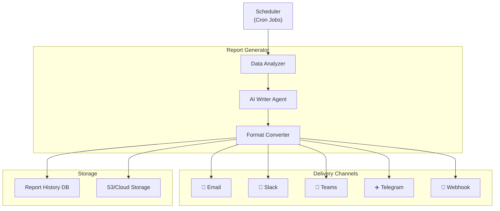

# Automated Report Generation & Scheduling System

**Статус**: 🚧 Планируется  
**Приоритет**: Should Have (Phase 4)  
**Дата создания**: 24 января 2026

---

## 📋 Обзор

**Automated Report Generation & Scheduling** — система автоматической генерации текстовых отчетов на основе аналитических досок с возможностью настройки расписания рассылки.

### Ключевые возможности
- 📅 **Scheduling**: Daily, Weekly, Monthly отчеты по расписанию
- 🤖 **AI Report Writer**: AI автоматически пишет executive summary
- 📊 **Multiple Formats**: PDF, PowerPoint, HTML Email, Markdown
- 📧 **Multi-Channel Delivery**: Email, Slack, Teams, Telegram
- 🎨 **Customizable Templates**: Настраиваемые шаблоны отчетов
- 📈 **Dynamic Content**: Автоматическое включение графиков и инсайтов
- 🔔 **Smart Alerts**: Уведомления о важных изменениях
- 📝 **Natural Language**: Отчеты написаны естественным языком

---

## 🏗️ Архитектура

### System Components



### Database Schema

```python
class ReportSchedule(Base):
    """Расписание отчетов"""
    __tablename__ = 'report_schedules'
    
    id = Column(UUID, primary_key=True, default=uuid4)
    
    # Report configuration
    name = Column(String(200), nullable=False)
    description = Column(Text)
    board_id = Column(UUID, ForeignKey('boards.id'))
    
    # Schedule
    frequency = Column(Enum('daily', 'weekly', 'monthly', 'quarterly'))
    day_of_week = Column(Integer)  # 0-6 for weekly (Monday = 0)
    day_of_month = Column(Integer)  # 1-31 for monthly
    time_of_day = Column(Time)  # HH:MM when to send
    timezone = Column(String(50), default='UTC')
    
    # Report content
    include_sections = Column(JSONB)  # ['summary', 'trends', 'insights', 'recommendations']
    widget_ids = Column(ARRAY(UUID))  # Specific widgets to include
    metrics = Column(JSONB)  # Specific metrics to track
    
    # Format & delivery
    output_formats = Column(ARRAY(String))  # ['pdf', 'email', 'slack']
    delivery_channels = Column(JSONB)
    # {
    #   'email': {'recipients': ['user@example.com']},
    #   'slack': {'webhook_url': 'https://...', 'channel': '#analytics'},
    #   'teams': {'webhook_url': 'https://...'}
    # }
    
    # Template
    template_id = Column(UUID, ForeignKey('report_templates.id'))
    custom_template = Column(JSONB)  # Override template settings
    
    # Status
    is_active = Column(Boolean, default=True)
    last_run = Column(DateTime)
    next_run = Column(DateTime)
    
    # Metadata
    created_by = Column(UUID, ForeignKey('users.id'))
    created_at = Column(DateTime, default=datetime.utcnow)
    updated_at = Column(DateTime, onupdate=datetime.utcnow)


class ReportTemplate(Base):
    """Шаблон отчета"""
    __tablename__ = 'report_templates'
    
    id = Column(UUID, primary_key=True, default=uuid4)
    
    name = Column(String(200))
    description = Column(Text)
    category = Column(String(100))  # 'executive', 'operational', 'marketing', etc.
    
    # Template structure
    sections = Column(JSONB)
    # [
    #   {'type': 'summary', 'title': 'Executive Summary', 'ai_generated': True},
    #   {'type': 'kpi_overview', 'title': 'Key Metrics', 'widgets': []},
    #   {'type': 'trends', 'title': 'Trend Analysis', 'ai_generated': True},
    #   {'type': 'insights', 'title': 'Key Insights', 'ai_generated': True},
    #   {'type': 'recommendations', 'title': 'Recommendations', 'ai_generated': True}
    # ]
    
    # Styling
    style_config = Column(JSONB)
    # {
    #   'colors': {'primary': '#1E40AF', 'secondary': '#3B82F6'},
    #   'fonts': {'heading': 'Inter', 'body': 'Inter'},
    #   'logo_url': 'https://...'
    # }
    
    # AI Instructions
    ai_prompt_template = Column(Text)  # Template for AI report writing
    
    is_public = Column(Boolean, default=False)
    created_by = Column(UUID, ForeignKey('users.id'))
    created_at = Column(DateTime, default=datetime.utcnow)


class GeneratedReport(Base):
    """Сгенерированный отчет"""
    __tablename__ = 'generated_reports'
    
    id = Column(UUID, primary_key=True, default=uuid4)
    schedule_id = Column(UUID, ForeignKey('report_schedules.id'))
    board_id = Column(UUID, ForeignKey('boards.id'))
    
    # Content
    title = Column(String(300))
    content = Column(JSONB)  # Full report content (structured)
    html_content = Column(Text)  # Rendered HTML
    
    # Metadata
    period_start = Column(DateTime)  # Report covers data from...
    period_end = Column(DateTime)    # ...to this date
    
    # Files
    pdf_url = Column(String(500))
    pptx_url = Column(String(500))
    
    # Delivery status
    delivery_status = Column(JSONB)
    # {
    #   'email': {'sent': True, 'sent_at': '...', 'recipients': [...]},
    #   'slack': {'sent': True, 'sent_at': '...', 'channel': '...'}
    # }
    
    # Generation stats
    generation_time = Column(Float)  # seconds
    ai_confidence = Column(Float)
    
    generated_at = Column(DateTime, default=datetime.utcnow)


class ReportInsight(Base):
    """AI-generated инсайты"""
    __tablename__ = 'report_insights'
    
    id = Column(UUID, primary_key=True, default=uuid4)
    report_id = Column(UUID, ForeignKey('generated_reports.id'))
    
    # Insight content
    insight_type = Column(Enum('positive', 'negative', 'neutral', 'actionable'))
    title = Column(String(200))
    description = Column(Text)
    confidence = Column(Float)  # 0-1
    
    # Supporting data
    metric_name = Column(String(100))
    metric_value = Column(Float)
    metric_change = Column(Float)  # Percentage change
    
    # Widget reference
    widget_id = Column(UUID, ForeignKey('widgets.id'))
    
    created_at = Column(DateTime, default=datetime.utcnow)
```

---

## 🤖 AI Report Writer

### Report Generation Engine

```python
class ReportWriterAgent:
    """AI агент для написания отчетов"""
    
    async def generate_report(
        self,
        board_id: UUID,
        period_start: datetime,
        period_end: datetime,
        template: ReportTemplate
    ) -> GeneratedReport:
        """Генерация полного отчета"""
        
        start_time = time.time()
        
        # 1. Collect data
        board_data = await self._collect_board_data(
            board_id, period_start, period_end
        )
        
        # 2. Analyze data
        analysis = await self._analyze_data(board_data)
        
        # 3. Generate insights
        insights = await self._generate_insights(analysis)
        
        # 4. Write sections
        sections = await self._write_sections(
            template, board_data, analysis, insights
        )
        
        # 5. Format report
        report_content = self._format_report(sections, template)
        
        # 6. Generate files (PDF, PPTX)
        pdf_url = await self._generate_pdf(report_content)
        pptx_url = await self._generate_pptx(report_content)
        
        generation_time = time.time() - start_time
        
        # 7. Save report
        report = GeneratedReport(
            schedule_id=...,
            board_id=board_id,
            title=self._generate_title(board_data, period_start, period_end),
            content=report_content,
            html_content=self._render_html(report_content, template),
            period_start=period_start,
            period_end=period_end,
            pdf_url=pdf_url,
            pptx_url=pptx_url,
            generation_time=generation_time
        )
        
        await db.add(report)
        await db.commit()
        
        return report
    
    async def _write_sections(
        self,
        template: ReportTemplate,
        board_data: Dict,
        analysis: Dict,
        insights: List[ReportInsight]
    ) -> List[Dict]:
        """Написание секций отчета"""
        
        sections = []
        
        for section_config in template.sections:
            if section_config.get('ai_generated'):
                # AI writes this section
                section_content = await self._ai_write_section(
                    section_type=section_config['type'],
                    title=section_config['title'],
                    data=board_data,
                    analysis=analysis,
                    insights=insights,
                    prompt_template=template.ai_prompt_template
                )
            else:
                # Static section (widgets, charts)
                section_content = self._create_static_section(
                    section_config, board_data
                )
            
            sections.append(section_content)
        
        return sections
    
    async def _ai_write_section(
        self,
        section_type: str,
        title: str,
        data: Dict,
        analysis: Dict,
        insights: List[ReportInsight],
        prompt_template: str
    ) -> Dict:
        """AI пишет секцию отчета"""
        
        # Build prompt
        prompt = self._build_prompt(
            section_type=section_type,
            data=data,
            analysis=analysis,
            insights=insights,
            template=prompt_template
        )
        
        # Generate with GigaChat
        response = await gigachat.ask(prompt, max_tokens=1500)
        
        return {
            'type': section_type,
            'title': title,
            'content': response,
            'ai_generated': True
        }
    
    def _build_prompt(
        self,
        section_type: str,
        data: Dict,
        analysis: Dict,
        insights: List[ReportInsight],
        template: str
    ) -> str:
        """Построение промпта для AI"""
        
        if section_type == 'summary':
            return f"""
            Write an executive summary for this analytics report.
            
            Data Overview:
            - Period: {data['period']}
            - Key Metrics: {json.dumps(data['key_metrics'], indent=2)}
            
            Analysis:
            - Trends: {json.dumps(analysis['trends'], indent=2)}
            - Comparisons: {json.dumps(analysis['comparisons'], indent=2)}
            
            Top Insights:
            {self._format_insights(insights[:5])}
            
            Write a concise 2-3 paragraph summary highlighting:
            1. Overall performance
            2. Most significant changes
            3. Key trends
            
            Use professional business language. Be specific with numbers.
            """
        
        elif section_type == 'trends':
            return f"""
            Analyze trends in the data.
            
            Trend Data:
            {json.dumps(analysis['trends'], indent=2)}
            
            For each significant trend:
            1. Describe the pattern (increasing, decreasing, stable, cyclical)
            2. Quantify the change (percentages, absolute values)
            3. Explain possible reasons
            4. Indicate if this is positive or concerning
            
            Focus on actionable insights.
            """
        
        elif section_type == 'recommendations':
            return f"""
            Based on this analysis, provide actionable recommendations.
            
            Current State:
            {json.dumps(data['key_metrics'], indent=2)}
            
            Insights:
            {self._format_insights(insights)}
            
            Provide 3-5 specific, actionable recommendations:
            - What to do
            - Why it's important
            - Expected impact
            
            Prioritize by potential impact and ease of implementation.
            """
        
        return template.format(
            section_type=section_type,
            data=data,
            analysis=analysis,
            insights=insights
        )
```

### Insight Generation

```python
class InsightGenerator:
    """Генерация инсайтов из данных"""
    
    async def generate_insights(
        self,
        board_data: Dict,
        analysis: Dict
    ) -> List[ReportInsight]:
        """Генерация списка инсайтов"""
        
        insights = []
        
        # 1. Metric change insights
        for metric_name, metric_data in analysis['metrics'].items():
            if abs(metric_data['change_percent']) > 10:  # Significant change
                insight = await self._create_metric_change_insight(
                    metric_name, metric_data
                )
                insights.append(insight)
        
        # 2. Trend insights
        for trend in analysis['trends']:
            if trend['significance'] > 0.7:
                insight = await self._create_trend_insight(trend)
                insights.append(insight)
        
        # 3. Anomaly insights
        for anomaly in analysis['anomalies']:
            insight = await self._create_anomaly_insight(anomaly)
            insights.append(insight)
        
        # 4. Correlation insights
        for correlation in analysis['correlations']:
            if abs(correlation['coefficient']) > 0.7:
                insight = await self._create_correlation_insight(correlation)
                insights.append(insight)
        
        # 5. AI-discovered insights
        ai_insights = await self._ai_discover_insights(board_data, analysis)
        insights.extend(ai_insights)
        
        # Sort by importance
        insights.sort(key=lambda x: x.confidence, reverse=True)
        
        return insights
    
    async def _ai_discover_insights(
        self,
        board_data: Dict,
        analysis: Dict
    ) -> List[ReportInsight]:
        """AI ищет неочевидные инсайты"""
        
        prompt = f"""
        Analyze this data and find non-obvious insights.
        
        Data:
        {json.dumps(board_data, indent=2)}
        
        Analysis:
        {json.dumps(analysis, indent=2)}
        
        Find insights that:
        - Are not immediately obvious
        - Could impact business decisions
        - Reveal hidden patterns or relationships
        
        For each insight, provide:
        1. Type (positive/negative/neutral/actionable)
        2. Title (concise)
        3. Description (2-3 sentences)
        4. Confidence (0-100%)
        
        Return as JSON array.
        """
        
        response = await gigachat.ask(prompt)
        ai_insights_data = json.loads(response)
        
        insights = []
        for data in ai_insights_data:
            insight = ReportInsight(
                insight_type=data['type'],
                title=data['title'],
                description=data['description'],
                confidence=data['confidence'] / 100.0
            )
            insights.append(insight)
        
        return insights
```

---

## 📅 Scheduling System

### Cron Job Scheduler

```python
class ReportScheduler:
    """Планировщик отчетов"""
    
    def __init__(self):
        self.scheduler = AsyncIOScheduler()
    
    async def start(self):
        """Запуск планировщика"""
        
        # Load all active schedules
        schedules = await self._load_active_schedules()
        
        for schedule in schedules:
            await self._add_schedule(schedule)
        
        self.scheduler.start()
    
    async def _add_schedule(self, schedule: ReportSchedule):
        """Добавление расписания"""
        
        if schedule.frequency == 'daily':
            trigger = CronTrigger(
                hour=schedule.time_of_day.hour,
                minute=schedule.time_of_day.minute,
                timezone=schedule.timezone
            )
        
        elif schedule.frequency == 'weekly':
            trigger = CronTrigger(
                day_of_week=schedule.day_of_week,
                hour=schedule.time_of_day.hour,
                minute=schedule.time_of_day.minute,
                timezone=schedule.timezone
            )
        
        elif schedule.frequency == 'monthly':
            trigger = CronTrigger(
                day=schedule.day_of_month,
                hour=schedule.time_of_day.hour,
                minute=schedule.time_of_day.minute,
                timezone=schedule.timezone
            )
        
        self.scheduler.add_job(
            self._execute_schedule,
            trigger=trigger,
            args=[schedule.id],
            id=str(schedule.id)
        )
    
    async def _execute_schedule(self, schedule_id: UUID):
        """Выполнение scheduled отчета"""
        
        schedule = await get_schedule(schedule_id)
        
        try:
            # Calculate period
            period_end = datetime.now(tz=pytz.timezone(schedule.timezone))
            
            if schedule.frequency == 'daily':
                period_start = period_end - timedelta(days=1)
            elif schedule.frequency == 'weekly':
                period_start = period_end - timedelta(weeks=1)
            elif schedule.frequency == 'monthly':
                period_start = period_end - timedelta(days=30)
            
            # Generate report
            writer = ReportWriterAgent()
            template = await get_template(schedule.template_id)
            
            report = await writer.generate_report(
                board_id=schedule.board_id,
                period_start=period_start,
                period_end=period_end,
                template=template
            )
            
            # Deliver report
            deliverer = ReportDeliverer()
            await deliverer.deliver(report, schedule.delivery_channels)
            
            # Update schedule
            schedule.last_run = datetime.utcnow()
            schedule.next_run = self._calculate_next_run(schedule)
            await db.commit()
            
        except Exception as e:
            logger.error(f"Failed to execute schedule {schedule_id}: {e}")
            await self._send_error_notification(schedule, e)
```

---

## 📧 Multi-Channel Delivery

### Delivery System

```python
class ReportDeliverer:
    """Доставка отчетов по различным каналам"""
    
    async def deliver(
        self,
        report: GeneratedReport,
        channels: Dict
    ):
        """Доставка отчета"""
        
        delivery_status = {}
        
        # Email
        if 'email' in channels:
            status = await self._deliver_email(report, channels['email'])
            delivery_status['email'] = status
        
        # Slack
        if 'slack' in channels:
            status = await self._deliver_slack(report, channels['slack'])
            delivery_status['slack'] = status
        
        # Teams
        if 'teams' in channels:
            status = await self._deliver_teams(report, channels['teams'])
            delivery_status['teams'] = status
        
        # Telegram
        if 'telegram' in channels:
            status = await self._deliver_telegram(report, channels['telegram'])
            delivery_status['telegram'] = status
        
        # Webhook
        if 'webhook' in channels:
            status = await self._deliver_webhook(report, channels['webhook'])
            delivery_status['webhook'] = status
        
        # Update report delivery status
        report.delivery_status = delivery_status
        await db.commit()
    
    async def _deliver_email(
        self,
        report: GeneratedReport,
        config: Dict
    ) -> Dict:
        """Отправка по email"""
        
        try:
            # Build email
            email = {
                'to': config['recipients'],
                'subject': report.title,
                'html': report.html_content,
                'attachments': []
            }
            
            # Attach PDF if requested
            if config.get('attach_pdf'):
                email['attachments'].append({
                    'filename': f"{report.title}.pdf",
                    'url': report.pdf_url
                })
            
            # Send
            await send_email(**email)
            
            return {
                'sent': True,
                'sent_at': datetime.utcnow().isoformat(),
                'recipients': config['recipients']
            }
        
        except Exception as e:
            return {
                'sent': False,
                'error': str(e)
            }
    
    async def _deliver_slack(
        self,
        report: GeneratedReport,
        config: Dict
    ) -> Dict:
        """Отправка в Slack"""
        
        try:
            # Build Slack message
            blocks = self._build_slack_blocks(report)
            
            # Send to webhook
            async with aiohttp.ClientSession() as session:
                await session.post(
                    config['webhook_url'],
                    json={
                        'channel': config.get('channel', '#analytics'),
                        'text': report.title,
                        'blocks': blocks
                    }
                )
            
            return {
                'sent': True,
                'sent_at': datetime.utcnow().isoformat(),
                'channel': config['channel']
            }
        
        except Exception as e:
            return {
                'sent': False,
                'error': str(e)
            }
```

---

## 🚀 Implementation Roadmap

### Phase 1: Core Generation (3 weeks)
- ✅ Database schema
- ✅ Report writer agent
- ✅ Insight generator
- ✅ PDF/HTML generation

### Phase 2: Scheduling (2 weeks)
- ✅ Cron scheduler
- ✅ Period calculation
- ✅ Auto-execution

### Phase 3: Delivery (2 weeks)
- ✅ Email delivery
- ✅ Slack integration
- ✅ Teams integration
- ✅ Webhook support

### Phase 4: Templates & UI (2 weeks)
- ✅ Template system
- ✅ Template marketplace
- ✅ UI for schedule management
- ✅ Report preview

---

## 🎯 Success Metrics

- **Adoption**: 60% досок с scheduled reports
- **Delivery Success**: 99%+ доставка без ошибок
- **AI Quality**: 4.2+ звезд за качество AI-written content
- **Time Savings**: 80% reduction в времени на создание отчетов
- **Engagement**: 70% получателей открывают отчеты

---

**Последнее обновление**: 24 января 2026
