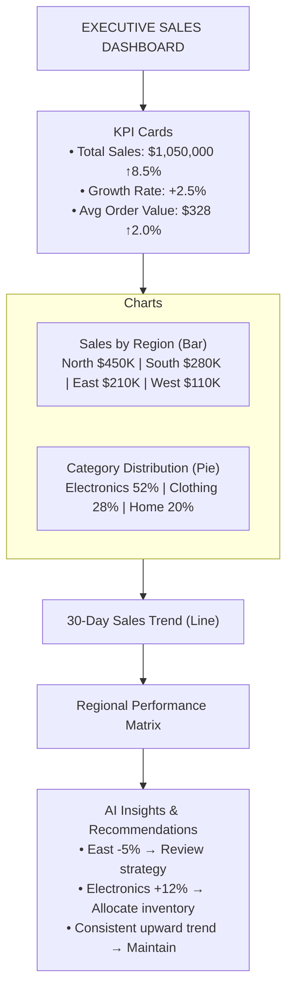

# Real-World Dashboard Construction Examples

## Overview

This document demonstrates how agents use the Board Construction System to build complete analytical dashboards in real-time. Each example shows:
- User request
- Agent workflow
- Widgets generated
- Connections created
- Final dashboard structure

---

## Example 1: Executive Sales Dashboard

### User Request
"Create a comprehensive sales dashboard that shows overall performance, regional breakdown, category analysis, and trends. Include KPIs, charts, and actionable insights."

### Agent Workflow

#### Step 1: Planning (Planner Agent)
```
Request: "Create comprehensive sales dashboard..."

Breakdown:
1. Fetch KPI data (total sales, growth, top performer)
2. Query regional sales breakdown
3. Query category performance
4. Analyze trends over time
5. Generate visualizations
6. Create optimal layout
7. Connect widgets for data flow
8. Add AI insights for anomalies
```

#### Step 2: Data Gathering (Researcher Agent)
```
Queries executed:
1. SELECT SUM(sales), COUNT(orders), AVG(order_value) 
   FROM orders WHERE date >= DATE_SUB(NOW(), INTERVAL 30 DAY)
   → Result: sales=$1.05M, orders=3,200, avg=$328

2. SELECT region, SUM(sales) FROM orders GROUP BY region
   → Result: North=$450K, South=$280K, East=$210K, West=$110K

3. SELECT category, SUM(sales) FROM orders GROUP BY category
   → Result: Electronics=$547K (52%), Clothing=$294K (28%), Home=$209K (20%)

4. SELECT DATE(date), SUM(sales) FROM orders 
   GROUP BY DATE(date) ORDER BY date DESC LIMIT 30
   → Result: Time series data for trend analysis

5. SELECT * FROM orders WHERE region = 'North' 
   ORDER BY created_at DESC LIMIT 100
   → Result: Sample transactions for detail view
```

#### Step 3: Analysis (Analyst Agent)
```
Analysis Results:
1. KPIs:
   - Total Sales (MTD): $1,050,000
   - Growth Rate: +8.5% vs previous month
   - Top Region: North (43% of sales, $450K)
   - Top Category: Electronics (52%, $547K)

2. Trends:
   - Consistent growth over 30 days (+8.5% total)
   - Electronics showing strongest growth (+12% vs last month)
   - North region: stable performance
   - East region: declining trend (-5% vs last month)

3. Insights:
   - ⚠️ East region needs attention (declining sales)
   - ✓ Electronics category recovering well
   - ✓ Average order value trending up ($328 → $335)
   - 📊 Recommend targeted promotion for East region
```

#### Step 4: Building Dashboard (Reporter Agent)

**Widget 1: KPI Metrics (Row 1)**
```python
# All widgets are now generated as complete HTML/CSS/JS code via user prompts
widget_1 = agent.generate_widget(
    data={'value': 1050000, 'trend': 0.085},
    user_prompt='Create a large metric card showing Total Sales (MTD) with currency format, trend indicator (+8.5% vs last month), and green color scheme for positive trend',
    title='Total Sales (MTD)'
)
# Position: (0, 0, 300, 150)
# Agent generates complete HTML/CSS/JS code with visualization logic

widget_2 = agent.generate_widget(
    data={'value': 0.085, 'trend': 0.025},
    user_prompt='Create a metric card displaying Growth Rate as percentage with +2.5% trend indicator and green color scheme',
    title='Growth Rate'
)
# Position: (320, 0, 300, 150)

widget_3 = agent.generate_widget(
    data={'value': 328, 'trend': 0.02},
    user_prompt='Create a compact metric card showing Avg Order Value in currency format with +2% trend',
    title='Avg Order Value'
)
# Position: (640, 0, 240, 150)
```

**Widget 2: Regional Sales Chart (Row 2, Left)**
```python
widget_4 = agent.generate_widget(
    data={
        'labels': ['North', 'South', 'East', 'West'],
        'values': [450000, 280000, 210000, 110000],
        'colors': ['#4CAF50', '#2196F3', '#FF9800', '#9C27B0']
    },
    user_prompt='Create a vertical bar chart showing sales by region with custom colors (green, blue, orange, purple), display values on bars, and include legend',
    title='Sales by Region'
)
# Position: (0, 170, 480, 300)
```

**Widget 3: Category Performance Pie (Row 2, Right)**
```python
widget_5 = agent.generate_widget(
    data={
        'labels': ['Electronics', 'Clothing', 'Home & Garden'],
        'values': [547000, 294000, 209000],
        'percentages': [52, 28, 20]
    },
    user_prompt='Create a pie chart showing sales distribution by category with percentage labels (52%, 28%, 20%), legend, and full pie (not donut)',
    title='Sales by Category'
)
# Position: (500, 170, 380, 300)
```

**Widget 4: Trend Analysis (Row 3, Full Width)**
```python
widget_6 = agent.generate_widget(
    data={
        'dates': ['2026-12-24', '2026-12-25', ...],  # Last 30 days
        'sales': [29840, 31200, 32150, ...],
        'trend_line': [28000, 29000, 30000, ...]  # Trend direction
    },
    user_prompt='Create a line chart displaying 30-day sales trend with dates on x-axis, sales on y-axis, overlay a linear trend line, show grid, and label as "Last 30 Days"',
    title='30-Day Sales Trend'
)
# Position: (0, 480, 880, 280)
```

**Widget 5: Regional Heatmap (Row 4, Left)**
```python
widget_7 = agent.generate_widget(
    data={
        'matrix': [
            [450000, 280000, 210000, 110000],  # Sales per region
            [12, 8, -5, 0]  # Growth % per region
        ],
        'regions': ['North', 'South', 'East', 'West'],
        'metric': ['Sales', 'Growth %']
    },
    user_prompt='Create a heatmap matrix showing regional performance with Sales and Growth % rows, regions as columns, use diverging color scale (red for negative, green for positive), display values in cells, and include legend',
    title='Regional Performance Matrix'
)
# Position: (0, 770, 440, 250)
```

**Widget 6: AI Insights (Row 4, Right)**
```python
widget_8 = agent.generate_widget(
    data={
        'insights': [
            {
                'type': 'anomaly',
                'severity': 'medium',
                'message': 'East region sales down 5% vs last month',
                'action': 'Review East region strategy'
            },
            {
                'type': 'opportunity',
                'severity': 'high',
                'message': 'Electronics category up 12% and growing',
                'action': 'Allocate more inventory to Electronics'
            },
            {
                'type': 'trend',
                'severity': 'info',
                'message': 'Consistent upward trend in all regions',
                'action': 'Maintain current strategy'
            }
        ]
    },
    user_prompt='Create a card-based insights panel displaying AI-generated recommendations with severity icons (alert/opportunity/info), action buttons, and modern card-based theme',
    title='AI Insights & Recommendations'
)
# Position: (450, 770, 430, 250)
```

#### Step 5: Creating Connections (Reporter Agent)

```python
# 1. Data flow from KPI metrics to trend chart
edge_1 = board.create_edge(
    from_widget=widget_1.id,  # Total Sales metric
    to_widget=widget_6.id,    # Trend chart
    edge_type='DATA_FLOW',
    parameter_mapping={'value': 'daily_sales'},
    label='Sales data flows to trend visualization'
)

# 2. Data flow from Regional chart to Performance Matrix
edge_2 = board.create_edge(
    from_widget=widget_4.id,  # Regional Sales bar chart
    to_widget=widget_7.id,    # Regional Performance Matrix
    edge_type='DATA_FLOW',
    parameter_mapping={'values': 'regional_values'},
    label='Regional data populates performance matrix'
)

# 3. Category chart feeds into insights
edge_3 = board.create_edge(
    from_widget=widget_5.id,  # Category pie
    to_widget=widget_8.id,    # AI Insights
    edge_type='ANNOTATION',
    label='Analysis identifies category trends'
)

# 4. Regional chart triggers drill-down to transactions
edge_4 = board.create_edge(
    from_widget=widget_4.id,  # Regional Sales
    to_widget_new='transactions_table',  # New detail widget (created on demand)
    edge_type='DRILL_DOWN',
    drill_path='region',
    label='Click region to see detailed transactions'
)
```

### Final Dashboard Layout


Connections (Edges):
- Total Sales -> Trend Chart [DATA_FLOW]
- Regional Sales -> Performance Matrix [DATA_FLOW]
- Category Sales -> AI Insights [ANNOTATION]
- Regional Sales -> Transaction Detail (on click) [DRILL_DOWN]

**Note**: All visualizations above are generated as complete HTML/CSS/JS code by the AI, even standard charts like bar/pie/line charts. No predefined widget templates are used.
```

---

## Example 2: Real-Time Monitoring Dashboard

### User Request
"Create a real-time server monitoring dashboard with response times, error rates, and automated alerts. Show current metrics, trends, and trigger alerts when thresholds are exceeded."

### Key Characteristics

**Widgets**:
1. **Live Response Time Gauge**: Current API response time, target: <500ms
2. **Error Rate Chart**: Real-time error percentage with trend
3. **Request Volume**: Requests/minute over last hour
4. **Alert Log**: List of triggered alerts with timestamps
5. **Health Summary**: Overall system health (Green/Yellow/Red)

**Connections**:
- Response Time Gauge -> Alert Trigger System [DATA_FLOW]
- Error Rate Chart -> Alert Severity Escalation [CAUSALITY]
- Request Volume -> AI Performance Analysis [ANNOTATION]
- Alert Log <-> Health Summary Widget [REFERENCE]

**Agent Behavior**:
- Researcher queries metrics every 5 seconds
- Analyst detects anomalies (response time spike)
- Reporter updates gauges in real-time
- Annotation edge triggers AI analysis automatically
- When error rate > 5%, causality edge triggers alert escalation

---

## Example 3: Drill-Down Analysis Dashboard

### User Request
"Build a customer segmentation dashboard. Show segments, allow drilling into each segment to see individual customers, and correlate with purchase history."

### Structure

**Level 1 (Summary)**:
- Customer Segments (Pie Chart)
    - High Value: 250 customers (15%) — click to drill down
    - Mid Value: 800 customers (48%) — click to drill down
    - Low Value: 650 customers (39%)

**Level 2 (Selected Segment)**:
- High Value Customers (Table)
    - Columns: Name | Purchases | LTV | Trend
    - Example rows:
        - John Smith — 145 | $8.5K | ↑ (click row to drill further)
        - Jane Doe — 132 | $7.8K | ↑ (click row to drill further)
    - Breadcrumb: Segments > High Value Customers

**Level 3 (Customer Detail)**:
- John Smith - Purchase History
    - Total Purchases: 145
    - Lifetime Value: $8,500
    - Line chart: monthly purchases
    - Breadcrumb: Segments > High Value > John Smith

**Connections**:
- Pie chart -> Segment table (drill into segment) [DRILL_DOWN]
- Segment table -> Customer detail (drill into customer) [DRILL_DOWN]
- Customer detail -> Purchase history chart [REFERENCE]

---

## Example 4: Multi-Agent Collaborative Analysis

### Scenario
User: "Analyze why East region sales declined. Compare with competitors and suggest corrective actions."

### Agent Workflow

**Phase 1: Parallel Data Collection**
```
Researcher Agent Task 1:
- Query internal East region sales
- Year-over-year comparison
- Category breakdown for East region

Researcher Agent Task 2:
- Scrape competitor pricing (Dynamic Tool)
- Fetch competitor product availability
- Get market share data
```

**Phase 2: Analysis**
```
Analyst Agent:
1. Internal analysis: East sales down 5% vs last month
   - Clothing category: -8% (biggest drop)
   - Electronics: stable
   - Home & Garden: -2%

2. Competitive analysis:
   - Competitor A: prices down 12% (undercutting)
   - Competitor B: launching new products (direct competition)
   - Market share: we lost 3% to Competitor A

3. Correlation:
   - Pricing pressure from Competitor A correlates with Clothing decline
   - New competitor products: overlap 60% with our best sellers
```

**Phase 3: Building Dashboard**
```
Dashboard Structure:

ROW 1: KPI Summary
- East Region Sales: $210K ↓ 5%
- Market Share: 23% ↓ 3%
- Competitive Price Gap: +12% (we're more expensive)
- Action Needed: YES

ROW 2: Internal Analysis
- Sales by Category (showing clothing decline)
- East Region Trend (showing downward slope)
- Product Performance (showing affected SKUs)

ROW 3: Competitive Analysis
- Competitor Price Comparison (showing undercutting)
- Product Overlap Matrix (showing direct competition)
- Market Share Distribution

ROW 4: Recommended Actions
- Corrective Measures (adjust pricing, launch alternatives)
- Implementation Timeline
- Expected Impact Forecast
```

**Connections**:
- Internal Sales Widget -> Trend Chart [DATA_FLOW]
- Market Share KPI -> Competitive Chart [DATA_FLOW]
- Competitor Prices -> Recommendations [ANNOTATION]
- Sales Trend -> Alert System [CAUSALITY] (if continues to decline)

**Reporter Agent Creates**:
1. Internal analysis chart
2. Competitive comparison table
3. Recommended actions card
4. Impact forecast chart
5. All connected with semantic edges

**Final Output**:
- Complete dashboard showing problem (East decline)
- Root cause (competitive pressure)
- Data-backed analysis (market share, pricing)
- Actionable recommendations
- Estimated impact of suggested corrective measures

---

## Common Pattern: Data → Analysis → Action

Most agent-built dashboards follow this pattern:
- Data widgets (query results) feed analysis widgets (findings) via DATA_FLOW edges.
- Analysis widgets trigger action widgets (recommendations/alerts) via CAUSALITY edges.
- Reference/annotation edges add context and definitions between data and analysis.
- Optional: manual review before executing recommended actions.

---

## Performance Characteristics

### Dashboard Creation Time
- Small dashboard (3-5 widgets): 2-5 seconds
- Medium dashboard (8-12 widgets): 8-15 seconds
- Large dashboard (15-25 widgets): 15-30 seconds

### Real-Time Update Latency
- Metric update: <100ms propagation
- Chart data update: <200ms
- Edge trigger (causality): <150ms
- Widget refresh (animation + render): <500ms

### Constraints
- Max 100 widgets per board
- Max 200 edges per board
- Max 5 incoming edges per widget
- Connection cycle detection: <50ms

---

## Summary

Agents build dashboards by:
1. **Planning**: Breaking down user request into analysis tasks
2. **Gathering**: Fetching data from multiple sources
3. **Analyzing**: Finding patterns and generating insights
4. **Building**: Creating widgets with appropriate types
5. **Connecting**: Adding semantic edges between widgets
6. **Optimizing**: Arranging layout for clarity and flow

The **Board Construction System** enables agents to actively participate in dashboard design, moving beyond simple recommendations to actually building complete, interconnected analytical interfaces.

