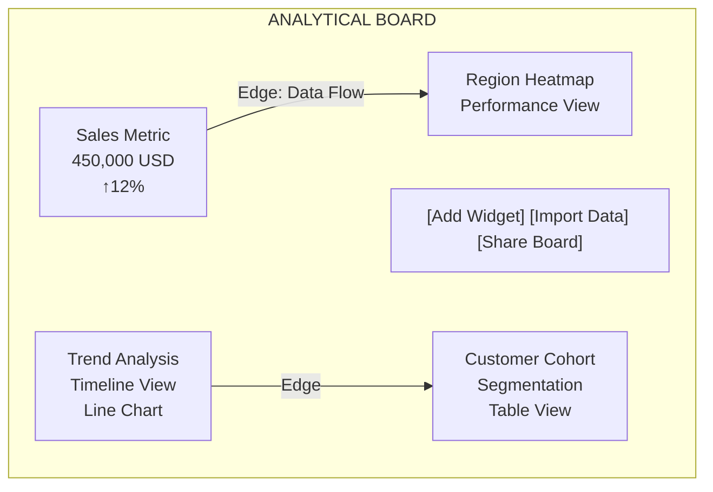

# Board Construction System: Agent-Driven Dashboard Building

> **🆕 ВАЖНО (29.01.2026)**: Документ будет обновлён для поддержки новой Source-Content Node Architecture (FR-14). AI-агенты смогут создавать SourceNode для подключения новых источников данных, ContentNode для результатов обработки, и WidgetNode для визуализаций. См. [SOURCE_CONTENT_NODE_CONCEPT.md](SOURCE_CONTENT_NODE_CONCEPT.md).

## Overview

The **Board Construction System** enables AI agents to actively build and modify analytical boards. Instead of just recommending widgets, agents can:
- **Create** new nodes: SourceNode (data sources), ContentNode (processed data), WidgetNode (visualizations)
- **Update** existing nodes with new data
- **Delete** nodes that are no longer needed
- **Rearrange** nodes for better layout
- **Connect** nodes with data flow relationships (EXTRACT, TRANSFORMATION, VISUALIZATION)
- **Group** related nodes for organization

This transforms agents from "analysts" into "dashboard architects."

---

## Core Concepts

### Board as Canvas



### Agent Board Operations

```python
class BoardOperations:
    """Operations agents can perform on boards"""
    
    AGENT_ACTIONS = {
        'create_widget': {
            'params': ['board_id', 'user_prompt', 'data', 'position'],
            'agent': 'Reporter',
            'effect': 'Adds new widget to board with AI-generated HTML/CSS/JS'
        },
        'update_widget': {
            'params': ['widget_id', 'data', 'title'],
            'agent': 'Reporter',
            'effect': 'Updates existing widget'
        },
        'delete_widget': {
            'params': ['widget_id'],
            'agent': 'Reporter',
            'effect': 'Removes widget from board'
        },
        'move_widget': {
            'params': ['widget_id', 'x', 'y'],
            'agent': 'Reporter',
            'effect': 'Changes widget position'
        },
        'resize_widget': {
            'params': ['widget_id', 'width', 'height'],
            'agent': 'Reporter',
            'effect': 'Changes widget dimensions'
        },
        'create_edge': {
            'params': ['from_widget_id', 'to_widget_id', 'edge_type', 'metadata'],
            'agent': 'Reporter',
            'effect': 'Creates connection between widgets'
        },
        'delete_edge': {
            'params': ['edge_id'],
            'agent': 'Reporter',
            'effect': 'Removes connection'
        },
        'create_group': {
            'params': ['board_id', 'widget_ids', 'group_name'],
            'agent': 'Reporter',
            'effect': 'Groups widgets together'
        }
    }
```

---

## Board Construction Workflow

### Scenario: Automated Sales Dashboard

- User request: "Create a comprehensive sales dashboard showing overall metrics, regional comparison, category breakdown, and trends over time."

- Planner Agent → subtasks
  - Fetch sales data by region and category
  - Calculate KPIs (total, growth, top performers)
  - Analyze trends
  - Create visualizations

- Researcher Agent → queries
  - SELECT SUM(sales) by region
  - SELECT SUM(sales) by category
  - SELECT sales by date (time series)
  - Return results

- Analyst Agent → findings
  - Total sales: $1.05M (+8.5% vs last period)
  - Top region: North (43% of sales)
  - Top category: Electronics (52% of sales)
  - Trend: Consistent growth

- Reporter Agent (building the board)
  1. Create layout: start with empty board
  2. Add header metrics (Row 1)
      - "Total Sales" metric widget — $1,050,000 ↑8.5% at (0, 0, 300, 150)
      - "Growth Rate" metric widget — +8.5% vs last month at (320, 0, 300, 150)
      - "Active Regions" metric widget — 4 regions growing at (640, 0, 300, 150)
  3. Add analysis widgets (Row 2)
      - "Sales by Region" chart — bar chart (North, South, East, West) at (0, 170, 480, 300) using {regions: [sales data]}
      - "Sales by Category" pie chart — Electronics 52%, Clothing 28%, Home 20% at (500, 170, 380, 300)
  4. Add trend analysis (Row 3)
      - "Sales Trend" line chart — time series showing growth at (0, 480, 880, 280)
      - "Regional Comparison" heatmap — region vs category matrix at (900, 480, 380, 280)
  5. Connect widgets with edges
      - "Total Sales" -> "Sales by Region" — DATA_FLOW, label: "Aggregate of regional sales"
      - "Total Sales" -> "Sales Trend" — DATA_FLOW, label: "Daily trend sum"
      - "Sales by Region" -> "Regional Comparison" — DRILL_DOWN, label: "Click region to see categories"
  6. Finalize board
      - Save layout
      - Make shareable
      - Send success message to user

- Result
  - ✅ Comprehensive dashboard created
  - ✅ All widgets connected with data flows
  - ✅ Ready for user interaction

---

## Reporter Agent: Board Builder

```python
class ReporterAgent:
    """
    Agent that builds analytical boards by generating and placing widgets
    """
    
    async def build_dashboard(
        self,
        board_id: str,
        analysis_results: Dict,
        layout_config: Dict = None
    ) -> Dashboard:
        """
        Build complete dashboard from analysis results
        
        Args:
            board_id: Target board ID
            analysis_results: Results from Analyst agent
            layout_config: Optional layout specification
        
        Returns:
            Complete dashboard with widgets and connections
        """
        
        dashboard = Dashboard(board_id=board_id)
        
        # 1. Plan layout
        layout = layout_config or await self._generate_layout(analysis_results)
        
        # 2. Create widgets with AI-generated HTML/CSS/JS
        widgets = []
        for widget_spec in layout.widgets:
            widget = await self.generate_widget(
                data=analysis_results[widget_spec.data_source],
                user_prompt=widget_spec.user_prompt,  # AI generates complete code
                title=widget_spec.title,
                position=widget_spec.position
            )
            widgets.append(widget)
            
            # Add widget to board
            await self.add_widget_to_board(board_id, widget)
        
        # 3. Create connections
        edges = []
        for edge_spec in layout.edges:
            edge = Edge(
                from_widget_id=edge_spec.from_widget,
                to_widget_id=edge_spec.to_widget,
                edge_type=edge_spec.type,
                label=edge_spec.label,
                metadata=edge_spec.metadata
            )
            edges.append(edge)
            
            # Add edge to board
            await self.add_edge_to_board(board_id, edge)
        
        dashboard.widgets = widgets
        dashboard.edges = edges
        
        return dashboard
    
    async def add_widget_to_board(
        self,
        board_id: str,
        widget: Widget
    ):
        """Add widget to board"""
        
        # Insert into database
        await db.widgets.insert_one({
            'id': widget.id,
            'board_id': board_id,
            'type': widget.type,
            'html': widget.html,
            'css': widget.css,
            'js': widget.js,
            'data': widget.data,
            'position': widget.position,
            'created_by': 'reporter',
            'created_at': datetime.now()
        })
        
        # Broadcast to all connected clients
        await broadcast_to_board(board_id, {
            'type': 'widget_added',
            'widget_id': widget.id,
            'widget': widget.to_dict()
        })
    
    async def update_widget_on_board(
        self,
        board_id: str,
        widget_id: str,
        new_data: Dict
    ):
        """Update widget data and refresh on board"""
        
        await db.widgets.update_one(
            {'id': widget_id},
            {
                '$set': {
                    'data': new_data,
                    'updated_at': datetime.now()
                }
            }
        )
        
        await broadcast_to_board(board_id, {
            'type': 'widget_data_updated',
            'widget_id': widget_id,
            'new_data': new_data
        })
    
    async def delete_widget_from_board(
        self,
        board_id: str,
        widget_id: str
    ):
        """Remove widget from board"""
        
        await db.widgets.delete_one({'id': widget_id})
        
        # Also remove any edges connected to this widget
        await db.edges.delete_many({
            '$or': [
                {'from_widget_id': widget_id},
                {'to_widget_id': widget_id}
            ]
        })
        
        await broadcast_to_board(board_id, {
            'type': 'widget_deleted',
            'widget_id': widget_id
        })
```

---

## Board Layout Planning

### Layout Generation Algorithm

```python
class LayoutPlanner:
    """
    Plans optimal widget layout based on data and relationships
    """
    
    LAYOUT_STRATEGIES = {
        'linear': 'Widgets in single column or row',
        'grid': 'Grid-based 2D layout',
        'hierarchy': 'Parent-child relationships',
        'flow': 'Data flow from left to right',
        'freeform': 'User-optimized layout'
    }
    
    async def generate_layout(
        self,
        widgets: List[WidgetSpec],
        edges: List[EdgeSpec],
        strategy: str = 'flow'
    ) -> Layout:
        """
        Generate optimal layout
        
        Args:
            widgets: Widget specifications
            edges: Relationships between widgets
            strategy: Layout algorithm to use
        """
        
        if strategy == 'flow':
            return await self._layout_flow(widgets, edges)
        elif strategy == 'grid':
            return await self._layout_grid(widgets)
        else:
            return await self._layout_freeform(widgets)
    
    async def _layout_flow(
        self,
        widgets: List[WidgetSpec],
        edges: List[EdgeSpec]
    ) -> Layout:
        """
        Left-to-right data flow layout
        
        Metrics → Analysis → Trends
        """
        
        layout = Layout()
        
        # Group widgets by description (AI-generated, no predefined types)
        metrics = [w for w in widgets if 'metric' in w.description.lower() or 'kpi' in w.description.lower()]
        analysis = [w for w in widgets if any(term in w.description.lower() for term in ['chart', 'matrix', 'table'])]
        trends = [w for w in widgets if 'trend' in w.description.lower()]
        
        y_offset = 0
        
        # Row 1: Metrics (horizontal layout)
        x_offset = 0
        for metric in metrics:
            metric.position = {
                'x': x_offset, 'y': y_offset,
                'width': 280, 'height': 140
            }
            x_offset += 300
        
        y_offset += 160
        
        # Row 2: Analysis charts
        x_offset = 0
        for chart in analysis[:2]:  # Max 2 per row
            chart.position = {
                'x': x_offset, 'y': y_offset,
                'width': 420, 'height': 280
            }
            x_offset += 440
        
        y_offset += 300
        
        # Row 3: Trends (full width)
        for trend in trends:
            trend.position = {
                'x': 0, 'y': y_offset,
                'width': 880, 'height': 240
            }
            y_offset += 260
        
        # Add widgets to layout
        layout.widgets = metrics + analysis + trends
        layout.edges = edges
        
        return layout
```

---

## Board Management Operations

### Organize Widgets into Groups

```python
class BoardOrganization:
    """Organize widgets into semantic groups"""
    
    async def create_group(
        self,
        board_id: str,
        widget_ids: List[str],
        group_name: str,
        collapse: bool = False
    ) -> WidgetGroup:
        """
        Group related widgets together
        
        Example:
        - "Sales Overview" group: metrics widgets
        - "Regional Analysis" group: regional charts
        - "Trends" group: time series charts
        """
        
        group = WidgetGroup(
            id=uuid.uuid4(),
            board_id=board_id,
            name=group_name,
            widget_ids=widget_ids,
            collapsed=collapse
        )
        
        await db.widget_groups.insert_one(group.to_dict())
        
        return group
```

---

## Board Sharing & Collaboration

### Share Board with Viewers

```python
async def share_board(
    board_id: str,
    user_emails: List[str],
    permissions: str = 'view'  # 'view', 'edit', 'admin'
):
    """
    Share board with other users
    
    Permissions:
    - view: Read-only access
    - edit: Can modify widgets (not delete)
    - admin: Full control
    """
    
    for email in user_emails:
        await db.board_permissions.insert_one({
            'board_id': board_id,
            'user_email': email,
            'permission': permissions,
            'granted_by': current_user_id(),
            'granted_at': datetime.now()
        })
    
    # Send notifications
    for email in user_emails:
        await send_email(
            to=email,
            subject=f"Board shared with you",
            body=f"User shared '{board_name}' dashboard with you"
        )
```

---

## Board Versioning & History

### Track Board Changes

```python
class BoardHistory:
    """Track all changes to board"""
    
    async def record_change(
        self,
        board_id: str,
        change_type: str,  # 'widget_added', 'widget_updated', 'edge_created'
        change_data: Dict,
        agent_id: str
    ):
        """
        Record board change in history
        """
        
        history_entry = {
            'board_id': board_id,
            'timestamp': datetime.now(),
            'change_type': change_type,
            'change_data': change_data,
            'changed_by': agent_id,
            'version': await self._get_next_version(board_id)
        }
        
        await db.board_history.insert_one(history_entry)
    
    async def revert_to_version(
        self,
        board_id: str,
        version: int
    ):
        """
        Restore board to previous version
        """
        
        # Get all changes up to this version
        changes = await db.board_history.find({
            'board_id': board_id,
            'version': {'$lte': version}
        }).sort('timestamp', 1).to_list()
        
        # Replay changes to reconstruct state
        # ... replay logic ...
```

---

## API Endpoints for Board Operations

### Board Editing Endpoints

```
# Create/get board
POST   /api/v1/boards/{boardId}/build
GET    /api/v1/boards/{boardId}/state

# Widget operations
POST   /api/v1/boards/{boardId}/widgets
PATCH  /api/v1/boards/{boardId}/widgets/{widgetId}
DELETE /api/v1/boards/{boardId}/widgets/{widgetId}
POST   /api/v1/boards/{boardId}/widgets/{widgetId}/move

# Edge operations
POST   /api/v1/boards/{boardId}/edges
DELETE /api/v1/boards/{boardId}/edges/{edgeId}

# Group operations
POST   /api/v1/boards/{boardId}/groups
PATCH  /api/v1/boards/{boardId}/groups/{groupId}
DELETE /api/v1/boards/{boardId}/groups/{groupId}

# Board operations
PATCH  /api/v1/boards/{boardId}/layout
POST   /api/v1/boards/{boardId}/share
GET    /api/v1/boards/{boardId}/history
POST   /api/v1/boards/{boardId}/revert/{version}
```

---

## Real-Time Board Updates

### WebSocket Events

```
Socket.IO Board Events:

WIDGET OPERATIONS:
- widget_added: {widget_id, position, type}
- widget_updated: {widget_id, new_data}
- widget_deleted: {widget_id}
- widget_moved: {widget_id, x, y}
- widget_resized: {widget_id, width, height}

EDGE OPERATIONS:
- edge_created: {edge_id, from_widget, to_widget, type}
- edge_deleted: {edge_id}

GROUP OPERATIONS:
- group_created: {group_id, name, widget_ids}
- group_updated: {group_id, properties}

BOARD OPERATIONS:
- board_layout_changed: {layout_config}
- board_saved: {timestamp}
- board_error: {error_message}

AGENT OPERATIONS:
- agent_building: {agent_name, status}
- agent_progress: {percent, message}
- agent_complete: {widgets_created, edges_created}
```

---

## Constraints & Rules

### Board Building Rules

```python
BOARD_CONSTRAINTS = {
    'max_widgets': 100,  # Per board
    'max_edges': 200,    # Per board
    'max_groups': 20,    # Per board
    
    'widget_min_size': {'width': 200, 'height': 150},
    'widget_max_size': {'width': 1200, 'height': 800},
    
    'edge_max_depth': 10,  # Prevent circular dependencies
    'edge_types_allowed': ['data_flow', 'drill_down', 'reference', 'annotation'],
    
    'update_frequency': '1_per_second',  # Max updates per widget per second
}

EDGE_CONSTRAINTS = {
    'metric → chart': True,           # Metrics feed data to charts
    'chart → chart': True,            # Charts can be compared
    'chart → table': True,            # Drill down to details
    'table → chart': False,           # Tables don't generate visualizations
    'metric → metric': False,         # Metrics are independent
}
```

---

## Status

**Complete**: Board construction architecture, operations, layout planning  
**Ready for**: Reporter Agent board building implementation  
**Next**: Edge types and relationship system

