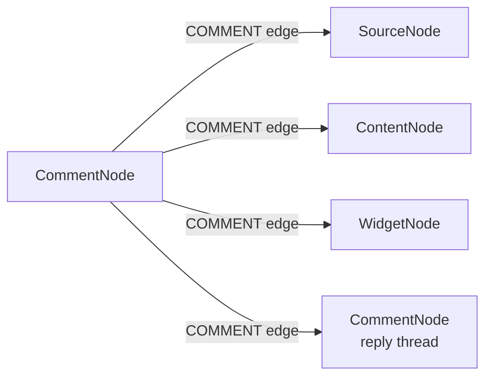
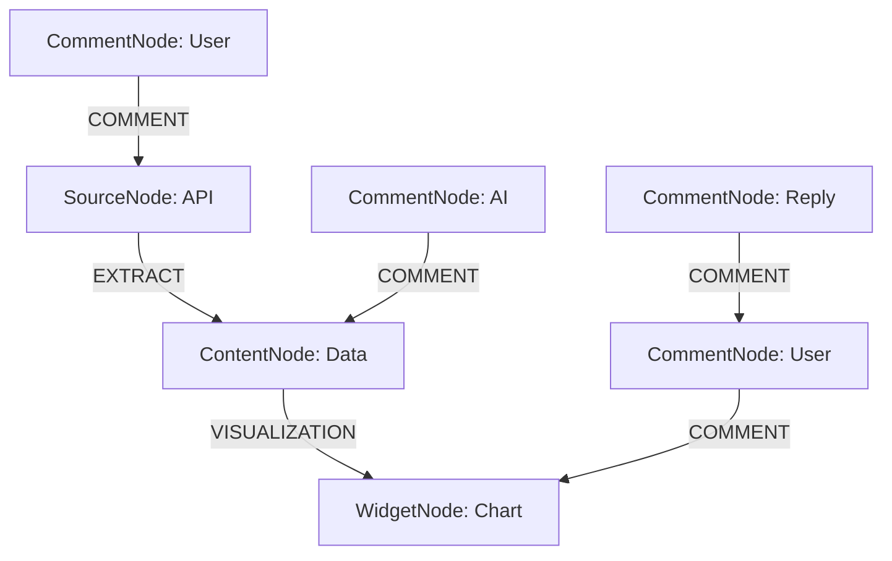

# Collaborative Features: Annotations, Comments & Real-Time Collaboration

**Статус**: 🚧 Планируется  
**Приоритет**: Must Have (Phase 2)  
**Дата создания**: 24 января 2026

---

## 🎯 Executive Summary

Система совместной работы для GigaBoard, позволяющая командам обсуждать данные и визуализации прямо на досках в реальном времени.

### Ключевые концепции
- **CommentNode как узел** — комментарии не метаданные, а полноценные узлы на canvas
- **COMMENT edges** — связи от CommentNode к SourceNode/ContentNode/WidgetNode/другим CommentNode
- **AI как участник** — @AI mentions для контекстных инсайтов и анализа данных
- **Real-time sync** — мгновенная синхронизация через Socket.IO
- **Visual annotations** — графические пометки (стрелки, подсветки, круги) поверх виджетов

### Типы комментариев
- **Public**: видны всем участникам доски
- **Private**: только автор + упомянутые пользователи (@mentions)
- **Team**: только члены команды

### Основные функции
- 💬 Комментарии с @mentions (пользователи + @AI)
- 🧵 Треды обсуждений (reply threads)
- 📍 Позиционирование комментариев на canvas
- 🎨 Визуальные аннотации (5 типов: arrow, highlight, circle, rectangle, freehand)
- ✅ Resolution workflow (is_resolved, resolved_by, resolved_at)
- 🔔 Real-time уведомления (Socket.IO + email + push)
- 🤖 AI автоответы с контекстным анализом
- 😊 Reactions (emoji)
- 🔍 Поиск по комментариям

---

## 📋 Обзор

**Архитектура**: Data-Centric Canvas с CommentNode
- **CommentNode**: Отдельный тип узла на доске для комментариев
- **COMMENT edges**: Связи от CommentNode к любым узлам (SourceNode, ContentNode, WidgetNode, другим CommentNode)
- **AI-generated comments**: AI Assistant может создавать CommentNode с инсайтами

---

## 🏗️ Архитектура

### Структура данных

**Ключевые сущности:**
- **CommentNode**: текст комментария, позиция на canvas, mentions[], visibility (public/private/team), is_resolved, author (user/ai)
- **CommentEdge**: связь COMMENT от CommentNode к целевому узлу (SourceNode/ContentNode/WidgetNode/другому CommentNode)
- **Annotation**: визуальные пометки на виджетах (arrow, highlight, circle, rectangle, line, freehand)
- **CommentThread**: метаданные треда (root_comment_id, participants[], is_resolved, comment_count)

**Связи:**


<details>
<summary>📄 Полная Database Schema (развернуть)</summary>

```python
# Database Models

class CommentNode(Base):
    """Комментарий как отдельный узел на доске"""
    __tablename__ = 'comment_nodes'
    
    id = Column(UUID, primary_key=True, default=uuid4)
    board_id = Column(UUID, ForeignKey('boards.id'), nullable=False)
    user_id = Column(UUID, ForeignKey('users.id'), nullable=False)
    
    # Node type
    node_type = Column(String(50), default='comment_node')
    
    # Content
    comment_text = Column(Text, nullable=False)
    mentions = Column(ARRAY(UUID))  # User IDs mentioned in comment
    
    # Position on canvas
    position = Column(JSONB)  # {x: float, y: float, width: int, height: int}
    
    # Target node (connected via COMMENT edge)
    # target_node_id stored in Edge table
    
    # Visibility
    visibility = Column(Enum('public', 'private', 'team'), default='public')
    team_id = Column(UUID, ForeignKey('teams.id'), nullable=True)
    
    # Status
    is_resolved = Column(Boolean, default=False)
    resolved_by = Column(UUID, ForeignKey('users.id'), nullable=True)
    resolved_at = Column(DateTime, nullable=True)
    
    # Metadata
    created_at = Column(DateTime, default=datetime.utcnow)
    updated_at = Column(DateTime, onupdate=datetime.utcnow)
    edited = Column(Boolean, default=False)
    
    # Reactions
    reactions = Column(JSONB)  # {emoji: [user_ids]}
    
    # AI interaction
    author = Column(Enum('user', 'ai'), default='user')
    ai_context = Column(JSONB)  # Context used by AI for response


class CommentEdge(Base):
    """
COMMENT edge: связь от CommentNode к целевому узлу
    Может связывать CommentNode с:
    - DataNode (комментарий к данным)
    - WidgetNode (комментарий к визуализации)
    - CommentNode (ответ на комментарий)
    """
    __tablename__ = 'edges'
    
    id = Column(UUID, primary_key=True, default=uuid4)
    from_node_id = Column(UUID, nullable=False)  # CommentNode ID
    to_node_id = Column(UUID, nullable=False)    # Target node (DataNode/WidgetNode/CommentNode)
    edge_type = Column(String(50), default='COMMENT')
    
    # Visual config
    visual_config = Column(JSONB)  # {color, line_style, arrow_type}
    
    # Metadata
    metadata = Column(JSONB)  # {label, description}


class Annotation(Base):
    """Визуальная аннотация на виджете"""
    __tablename__ = 'widget_annotations'
    
    id = Column(UUID, primary_key=True, default=uuid4)
    widget_id = Column(UUID, ForeignKey('widgets.id'), nullable=False)
    user_id = Column(UUID, ForeignKey('users.id'), nullable=False)
    comment_id = Column(UUID, ForeignKey('widget_comments.id'), nullable=True)
    
    # Annotation type
    annotation_type = Column(Enum(
        'arrow',      # Стрелка
        'highlight',  # Подсветка области
        'circle',     # Круг/овал
        'rectangle',  # Прямоугольник
        'line',       # Линия
        'freehand'    # Свободное рисование
    ))
    
    # Geometry
    geometry = Column(JSONB)  # Type-specific coordinates
    # arrow: {start: {x, y}, end: {x, y}}
    # highlight: {x, y, width, height}
    # circle: {center: {x, y}, radius}
    # freehand: {points: [{x, y}, ...]}
    
    # Style
    color = Column(String(7), default='#FF6B6B')  # Hex color
    stroke_width = Column(Integer, default=2)
    opacity = Column(Float, default=0.8)
    
    created_at = Column(DateTime, default=datetime.utcnow)


class CommentThread(Base):
    """Тред обсуждения"""
    __tablename__ = 'comment_threads'
    
    id = Column(UUID, primary_key=True, default=uuid4)
    root_comment_id = Column(UUID, ForeignKey('widget_comments.id'))
    board_id = Column(UUID, ForeignKey('boards.id'))
    
    # Status
    is_resolved = Column(Boolean, default=False)
    participant_ids = Column(ARRAY(UUID))  # All users in thread
    
    # Metadata
    created_at = Column(DateTime, default=datetime.utcnow)
    last_activity = Column(DateTime, default=datetime.utcnow)
    comment_count = Column(Integer, default=0)
```

</details>

---

## 🔄 Real-Time Synchronization

**События Socket.IO:**
- `comment:create` — создание нового комментария
- `comment:reply` — ответ в треде
- `comment:update` — редактирование комментария
- `comment:resolve` — пометить как resolved
- `comment:delete` — удаление комментария
- `annotation:create` — создание визуальной аннотации
- `annotation:update` / `annotation:delete` — управление аннотациями

**Уведомления:**
- При @mention — Socket.IO broadcast + email (если включено)
- При reply — уведомление автору родительского комментария
- При resolve — уведомление всем участникам треда

<details>
<summary>📄 Socket.IO Events API (развернуть)</summary>

```typescript
// Client → Server

socket.emit('comment:create', {
  widgetId: 'widget-123',
  text: '@john Почему эта метрика упала?',
  positionX: 0.65,
  positionY: 0.42,
  anchorType: 'point',
  mentions: ['user-john-id']
});

socket.emit('comment:reply', {
  parentCommentId: 'comment-456',
  text: 'Проверил данные, это сезонный эффект',
  mentions: []
});

socket.emit('comment:resolve', {
  commentId: 'comment-789'
});

socket.emit('annotation:create', {
  widgetId: 'widget-123',
  type: 'arrow',
  geometry: {
    start: {x: 0.3, y: 0.5},
    end: {x: 0.7, y: 0.3}
  },
  color: '#FF6B6B'
});


// Server → Clients

socket.on('comment:created', (data) => {
  // Display new comment on widget
  addCommentMarker(data.widgetId, data);
  
  // Show notification if mentioned
  if (data.mentions.includes(currentUserId)) {
    showNotification(`${data.userName} mentioned you in a comment`);
  }
});

socket.on('comment:updated', (data) => {
  updateComment(data.commentId, data);
});

socket.on('comment:resolved', (data) => {
  markCommentResolved(data.commentId);
});

socket.on('annotation:created', (data) => {
  renderAnnotation(data.widgetId, data);
});
```

</details>

---

## 🎨 UI/UX Компоненты

**Основные UI элементы:**
1. **CommentMarker** — иконка комментария на виджете с:
   - Badge для unread count
   - Зелёная галочка если resolved
   - Hover preview первых 2 строк комментария

2. **CommentThreadPanel** — боковая панель со списком комментариев:
   - Фильтры: All / Unresolved / Mine / AI
   - Поиск по тексту комментариев
   - Группировка по тредам

3. **AnnotationToolbar** — панель инструментов для рисования:
   - 5 типов аннотаций (arrow, circle, rectangle, highlight, freehand)
   - Color picker
   - Stroke width, opacity

4. **MentionTextarea** — textarea с автодополнением:
   - @ для упоминания пользователей
   - @ai для вызова AI
   - Markdown поддержка

<details>
<summary>📄 React Components (развернуть)</summary>

```tsx
// CommentMarker.tsx

interface CommentMarkerProps {
  comment: WidgetComment;
  position: {x: number, y: number};
  onOpen: () => void;
  unreadCount?: number;
}

export const CommentMarker: React.FC<CommentMarkerProps> = ({
  comment,
  position,
  onOpen,
  unreadCount = 0
}) => {
  return (
    <div 
      className="absolute z-50 cursor-pointer transform -translate-x-1/2 -translate-y-1/2"
      style={{
        left: `${position.x * 100}%`,
        top: `${position.y * 100}%`
      }}
      onClick={onOpen}
    >
      <div className="relative">
        {/* Comment Icon */}
        <div className="w-8 h-8 bg-blue-500 rounded-full flex items-center justify-center shadow-lg hover:scale-110 transition-transform">
          <MessageCircle className="w-4 h-4 text-white" />
        </div>
        
        {/* Unread Badge */}
        {unreadCount > 0 && (
          <div className="absolute -top-1 -right-1 w-5 h-5 bg-red-500 rounded-full flex items-center justify-center text-xs text-white font-bold">
            {unreadCount}
          </div>
        )}
        
        {/* Resolved Indicator */}
        {comment.isResolved && (
          <div className="absolute -bottom-1 -right-1 w-4 h-4 bg-green-500 rounded-full flex items-center justify-center">
            <Check className="w-3 h-3 text-white" />
          </div>
        )}
      </div>
    </div>
  );
};
```

### 2. Comment Thread Panel

```tsx
// CommentThreadPanel.tsx

interface CommentThreadPanelProps {
  widgetId: string;
  comments: WidgetComment[];
  onReply: (text: string, parentId: string) => void;
  onResolve: (commentId: string) => void;
}

export const CommentThreadPanel: React.FC<CommentThreadPanelProps> = ({
  widgetId,
  comments,
  onReply,
  onResolve
}) => {
  const [replyText, setReplyText] = useState('');
  const [selectedCommentId, setSelectedCommentId] = useState<string | null>(null);

  return (
    <div className="w-96 h-full bg-white dark:bg-gray-900 border-l border-gray-200 dark:border-gray-700 flex flex-col">
      {/* Header */}
      <div className="p-4 border-b border-gray-200 dark:border-gray-700">
        <h3 className="text-lg font-semibold">Comments</h3>
        <p className="text-sm text-gray-500">{comments.length} comments</p>
      </div>
      
      {/* Comment List */}
      <div className="flex-1 overflow-y-auto p-4 space-y-4">
        {comments.map(comment => (
          <CommentItem
            key={comment.id}
            comment={comment}
            onReply={() => setSelectedCommentId(comment.id)}
            onResolve={onResolve}
          />
        ))}
      </div>
      
      {/* Reply Input */}
      <div className="p-4 border-t border-gray-200 dark:border-gray-700">
        <MentionTextarea
          value={replyText}
          onChange={setReplyText}
          placeholder="Add a comment... Use @ to mention"
          onSubmit={() => {
            onReply(replyText, selectedCommentId || '');
            setReplyText('');
          }}
        />
      </div>
    </div>
  );
};
```

### 3. Annotation Tools

```tsx
// AnnotationToolbar.tsx

export const AnnotationToolbar: React.FC = () => {
  const [selectedTool, setSelectedTool] = useState<AnnotationType | null>(null);
  const [color, setColor] = useState('#FF6B6B');

  return (
    <div className="absolute top-4 left-1/2 transform -translate-x-1/2 bg-white dark:bg-gray-800 rounded-lg shadow-lg p-2 flex items-center gap-2">
      {/* Tool Buttons */}
      <ToolButton
        icon={<ArrowRight />}
        active={selectedTool === 'arrow'}
        onClick={() => setSelectedTool('arrow')}
        tooltip="Arrow"
      />
      
      <ToolButton
        icon={<Circle />}
        active={selectedTool === 'circle'}
        onClick={() => setSelectedTool('circle')}
        tooltip="Circle"
      />
      
      <ToolButton
        icon={<Square />}
        active={selectedTool === 'rectangle'}
        onClick={() => setSelectedTool('rectangle')}
        tooltip="Rectangle"
      />
      
      <ToolButton
        icon={<Highlighter />}
        active={selectedTool === 'highlight'}
        onClick={() => setSelectedTool('highlight')}
        tooltip="Highlight"
      />
      
      <div className="w-px h-6 bg-gray-300 dark:bg-gray-600" />
      
      {/* Color Picker */}
      <input
        type="color"
        value={color}
        onChange={(e) => setColor(e.target.value)}
        className="w-8 h-8 rounded cursor-pointer"
      />
      
      {/* Clear All */}
      <button
        onClick={() => clearAllAnnotations()}
        className="p-2 hover:bg-gray-100 dark:hover:bg-gray-700 rounded"
      >
        <Trash2 className="w-4 h-4" />
      </button>
    </div>
  );
};
```

</details>

---

## 🤖 AI Integration

**Возможности AI в комментариях:**
- **@AI mentions** — упоминание AI для получения инсайтов
- **Контекстный анализ** — AI видит данные виджета + контекст всей доски
- **Автоответы** — AI создаёт CommentNode с ответом как reply
- **Проактивные инсайты** — AI может сам создавать ComментNode при обнаружении аномалий

**Пример взаимодействия:**
```
User: "@AI почему метрика упала на 15%?"

AI: "Анализирую данные...
     Падение на 15% произошло в период 18-22 января.
     Основная причина: снижение трафика из organic search (-20%).
     Рекомендую проверить позиции в поисковой выдаче."

User: "@AI что делать?"

AI: "Рекомендации:
     1. Audit SEO: проверить индексацию страниц
     2. Проанализировать конкурентов
     3. Обновить контент на главных лендингах
     
     Хотите чтобы я создал детальный отчёт по SEO?"
```

<details>
<summary>📄 AI Agent Implementation (развернуть)</summary>

```python
# AI Assistant в комментариях

class CommentAIAgent:
    """AI агент для работы с комментариями"""
    
    async def handle_mention(self, comment: WidgetComment):
        """Обработка @AI упоминаний"""
        
        if '@ai' not in comment.text.lower():
            return
        
        # Get context
        widget = await get_widget(comment.widget_id)
        board_context = await get_board_context(comment.board_id)
        
        # Extract question
        question = self._extract_question(comment.text)
        
        # Get AI response
        response = await self._generate_response(
            question=question,
            widget_data=widget.data,
            board_context=board_context
        )
        
        # Post reply as AI
        await create_comment(
            widget_id=comment.widget_id,
            parent_comment_id=comment.id,
            text=response,
            user_id=AI_USER_ID,
            is_ai_response=True,
            ai_context={
                'question': question,
                'confidence': 0.92,
                'sources': ['widget_data', 'board_context']
            }
        )
    
    async def _generate_response(self, question, widget_data, board_context):
        """Генерация ответа от AI"""
        
        prompt = f"""
        User question: {question}
        
        Widget data: {widget_data}
        Board context: {board_context}
        
        Provide a concise, helpful answer explaining the data or insight.
        """
        
        response = await gigachat.ask(prompt)
        return response
```

</details>

---

## 🔔 Notifications System

**Типы уведомлений:**
- `comment_mention` — пользователя упомянули в комментарии (@username)
- `comment_reply` — кто-то ответил на ваш комментарий
- `comment_resolved` — комментарий помечен как resolved
- `thread_activity` — новая активность в треде, где вы участвуете

**Каналы доставки:**
- Real-time через Socket.IO (мгновенно)
- In-app notification badge (постоянно)
- Email (если включено в настройках)
- Browser push (если есть разрешение)

**Настройки пользователя:**
- Частота email: instant / hourly digest / daily digest / off
- Push notifications: on / off
- Quiet hours: не беспокоить с 22:00 до 8:00

<details>
<summary>📄 Notification System Implementation (развернуть)</summary>

```typescript
// Notification Types

interface CommentNotification {
  type: 'comment_mention' | 'comment_reply' | 'comment_resolved' | 'thread_activity';
  commentId: string;
  widgetId: string;
  boardId: string;
  fromUser: User;
  text: string;
  timestamp: Date;
  isRead: boolean;
}

// Notification Manager

class NotificationManager {
  async sendCommentNotification(
    userId: string,
    notification: CommentNotification
  ) {
    // Real-time notification via Socket.IO
    socket.to(userId).emit('notification:new', notification);
    
    // In-app notification
    await db.notifications.create({
      userId,
      type: notification.type,
      data: notification,
      isRead: false
    });
    
    // Email notification (if user preferences allow)
    if (await shouldSendEmail(userId, notification.type)) {
      await sendEmail({
        to: user.email,
        subject: `${notification.fromUser.name} mentioned you in a comment`,
        template: 'comment_mention',
        data: notification
      });
    }
    
    // Browser push notification
    if (await hasPushSubscription(userId)) {
      await sendPushNotification(userId, {
        title: 'New mention',
        body: notification.text,
        url: `/boards/${notification.boardId}?comment=${notification.commentId}`
      });
    }
  }
}
```

</details>

---

## 📊 Analytics & Metrics

**Board-level метрики:**
- Общее количество комментариев
- Активные комментаторы (unique users)
- Среднее время ответа на комментарий
- AI interactions count
- Resolution rate (% resolved comments)
- Самые обсуждаемые виджеты

**User-level метрики:**
- Комментарии опубликовано
- Mentions получено
- Тредов начато
- Collaboration score (engagement метрика)

<details>
<summary>📄 Analytics Implementation (развернуть)</summary>

```python
# Метрики для комментариев

class CommentAnalytics:
    """Аналитика использования комментариев"""
    
    async def get_board_engagement(self, board_id: str) -> Dict:
        """Engagement метрики для доски"""
        
        return {
            'total_comments': await count_comments(board_id),
            'active_users': await count_active_commenters(board_id),
            'avg_response_time': await avg_comment_response_time(board_id),
            'ai_interactions': await count_ai_mentions(board_id),
            'resolution_rate': await calculate_resolution_rate(board_id),
            'most_discussed_widgets': await get_top_commented_widgets(board_id)
        }
    
    async def get_user_engagement(self, user_id: str) -> Dict:
        """Engagement метрики для пользователя"""
        
        return {
            'comments_posted': await count_user_comments(user_id),
            'mentions_received': await count_mentions(user_id),
            'threads_started': await count_threads_started(user_id),
            'avg_response_time': await user_avg_response_time(user_id),
            'collaboration_score': await calculate_collaboration_score(user_id)
        }
```

</details>

---

## 🚀 Implementation Roadmap

### Phase 1: Basic Comments (2 weeks)
- ✅ Database schema
- ✅ API endpoints (CRUD comments)
- ✅ Socket.IO events
- ✅ UI: Comment markers on widgets
- ✅ UI: Comment panel

### Phase 2: Threading & Mentions (1 week)
- ✅ Reply threads
- ✅ @Mentions with autocomplete
- ✅ Notification system

### Phase 3: AI Integration (1 week)
- ✅ @AI mention handler
- ✅ AI response generation
- ✅ Context-aware answers

### Phase 4: Annotations (2 weeks)
- ✅ Annotation drawing tools
- ✅ Arrow, circle, highlight, freehand
- ✅ Annotation persistence
- ✅ Linking annotations to comments

### Phase 5: Advanced Features (2 weeks)
- ✅ Comment resolution workflow
- ✅ Private/team-only comments
- ✅ Reactions (emoji)
- ✅ Comment search
- ✅ Analytics dashboard

---

## 🎯 Success Metrics

- **Adoption Rate**: 80%+ досок с комментариями в первый месяц
- **Engagement**: Среднее 5+ комментариев на доску
- **AI Interactions**: 30%+ комментариев с @AI mentions
- **Resolution Time**: Среднее 2 часа от создания до resolve
- **User Satisfaction**: 4.5+ из 5 звезд

---

## 🔒 Security & Privacy

### Access Control
- Комментарии видны только участникам доски
- Private comments видны только автору и упомянутым пользователям
- Team comments видны только членам команды
- Audit log всех операций с комментариями

### Data Protection
- Sanitization HTML в комментариях
- Rate limiting для предотвращения spam
- Encryption комментариев с sensitive данными
- GDPR compliance: право на удаление комментариев

---

## 🔗 Интеграция с Source-Content Architecture

**Обновление (29 января 2026):**

CommentNode может быть привязан к любому типу узла:
- **SourceNode** — комментарии к источникам данных ("API недоступен", "Нужно обновить credentials")
- **ContentNode** — комментарии к обработанным данным ("Эти данные устарели", "Нужна валидация")
- **WidgetNode** — комментарии к визуализациям ("График не отражает реальность", "Добавить фильтр по датам")
- **CommentNode** — replies в тредах обсуждений



---

**Последнее обновление**: 29 января 2026
