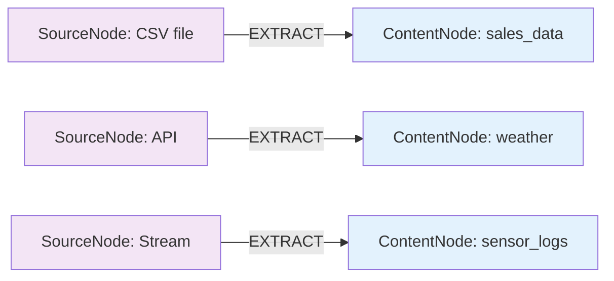
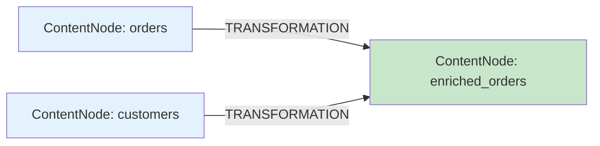
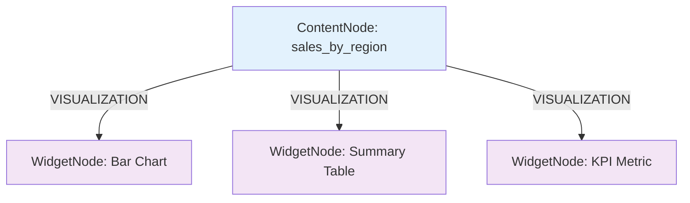
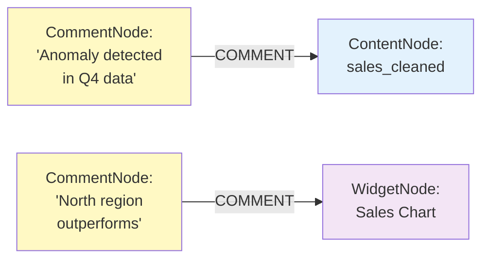
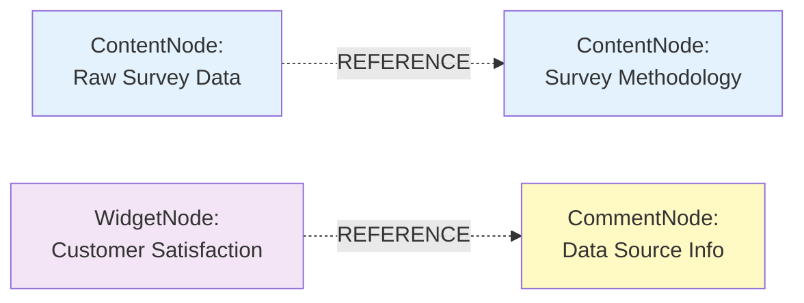
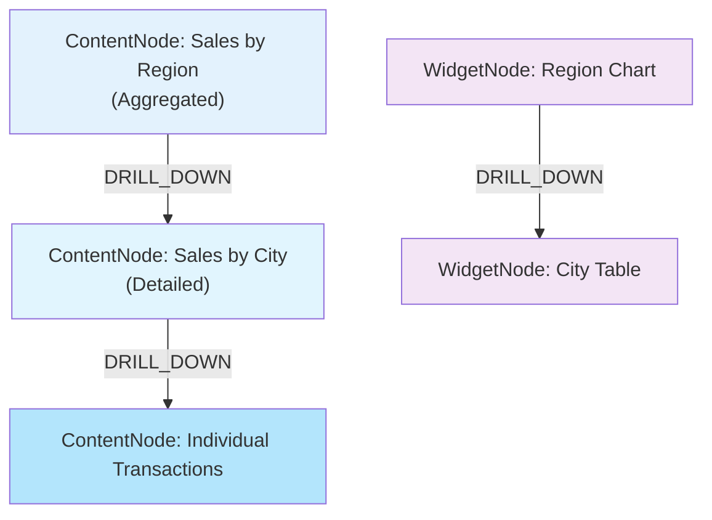
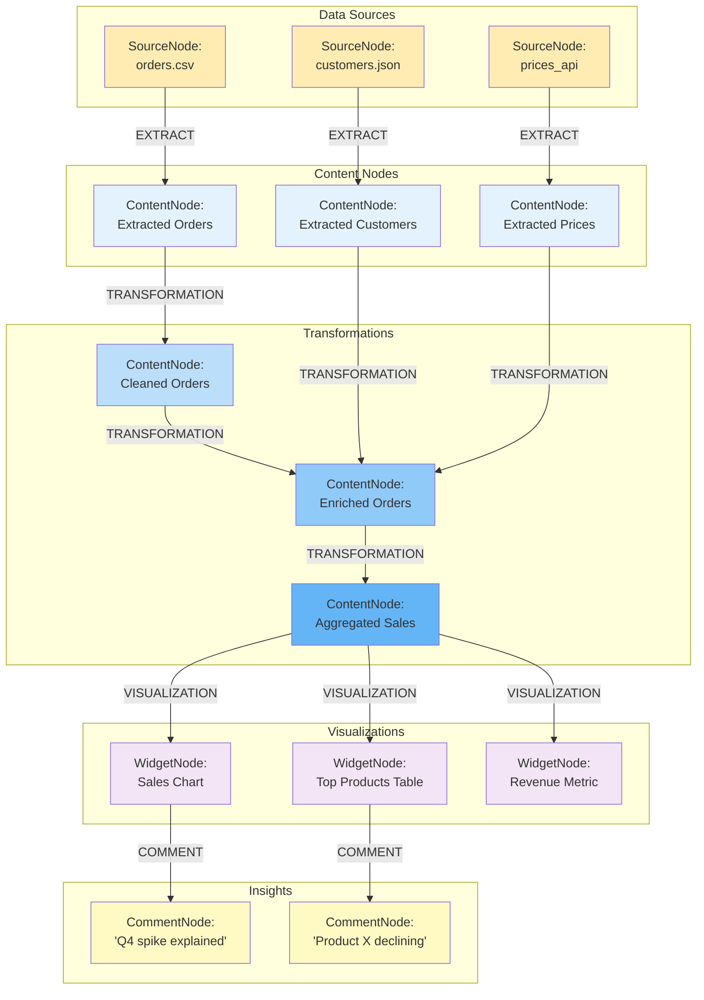

# Connection Types & Node Relationships System

## 🎯 Executive Summary

Система связей между узлами на досках GigaBoard обеспечивает создание **направленного ациклического графа (DAG)** data pipelines с автоматическим распространением изменений.

### Ключевые концепции
- **6 типов связей**: EXTRACT, TRANSFORMATION, VISUALIZATION, COMMENT, REFERENCE, DRILL_DOWN
- **Автоматическая propagation**: изменения в SourceNode → обновление ContentNode → перерисовка WidgetNode
- **Executable edges**: EXTRACT и TRANSFORMATION содержат исполняемый код
- **Data lineage**: полная прозрачность происхождения данных

### Типы связей

1. **EXTRACT** 🆕 (SourceNode → ContentNode) — извлечение данных из источников (файлы, API, БД, streams)
2. **TRANSFORMATION** (ContentNode → ContentNode) — преобразование данных через Python код (поддержка N источников)
3. **VISUALIZATION** (ContentNode → WidgetNode) — визуализация данных (авто-обновление при изменении ContentNode)
4. **COMMENT** (CommentNode → любой узел) — аннотации и инсайты
5. **REFERENCE** (любой → любой) — справочные связи и документирование
6. **DRILL_DOWN** (Content/Widget → Content/Widget) — детализация от сводных к детальным данным

---

> **✅ Обновлено (29.01.2026)**: Документ актуализирован для Source-Content Node Architecture (FR-14/FR-23). Добавлен тип связи **EXTRACT** для работы с SourceNode. См. [SOURCE_CONTENT_NODE_CONCEPT.md](SOURCE_CONTENT_NODE_CONCEPT.md) для полной спецификации.

---

## Core Connection Types

### 1. EXTRACT (SourceNode → ContentNode) 🆕

**Purpose**: Extract structured data from source and create ContentNode with text description + N tables

**Characteristics**:
- **Single source**: One SourceNode extracts to one ContentNode
- **Multiple tables**: ContentNode can contain N tables from extraction
- **Auto-refresh**: ContentNode updates when SourceNode refreshes (for api/database/stream types)
- **Streaming support**: Real-time accumulation with archiving strategy
- **Extraction method**: Varies by SourceNode type (file parsing, SQL query, API call, AI generation, manual input)



**Metadata Structure**:

```python
extract_edge = {
    "id": "uuid",
    "edge_type": "EXTRACT",
    "from_node_id": "source_node_123",    # SourceNode
    "to_node_id": "content_node_456",     # ContentNode
    
    "visual_config": {
        "color": "#9C27B0",      # Purple
        "line_style": "solid",
        "arrow_type": "extract",
        "animation": "flow",
        "label": "Extract Data"
    },
    
    "metadata": {
        "extraction_method": "csv_parse",  # or sql_query, api_call, ai_generate, manual_input
        "last_extract": "2026-01-29T10:30:00Z",
        "rows_extracted": 1500,
        "tables_created": 2
    },
    
    "created_at": "2026-01-29T10:00:00Z"
}
```

<details>
<summary>📋 Implementation (развернуть)</summary>

```python
class ExtractEdge:
    """SourceNode → ContentNode extraction edge"""
    
    edge_type = 'EXTRACT'
    
    async def execute_extract(self, source_node: SourceNode) -> ContentNode:
        """Execute data extraction based on SourceNode type"""
        
        if source_node.source_type == 'file':
            return await self._extract_from_file(source_node)
        elif source_node.source_type == 'api':
            return await self._extract_from_api(source_node)
        elif source_node.source_type == 'database':
            return await self._extract_from_database(source_node)
        elif source_node.source_type == 'stream':
            return await self._extract_from_stream(source_node)
        elif source_node.source_type == 'prompt':
            return await self._extract_from_prompt(source_node)
        else:  # manual
            return await self._extract_manual(source_node)
```

</details>

---

### 2. TRANSFORMATION (ContentNode → ContentNode)

**Purpose**: Transform one or multiple ContentNodes into a new ContentNode using arbitrary Python code

**Characteristics**:
- **Multiple inputs**: Can accept N source ContentNodes (1+)
- **Single output**: Creates 1 target ContentNode
- **Executable code**: Contains Python transformation code generated by Transformation Agent
- **Automatic replay**: Can re-execute when source data changes (5 replay modes)
- **Versioned**: Transformation code is versioned for audit trail



<details>
<summary>📄 TRANSFORMATION Metadata Structure (развернуть)</summary>

```python
transformation_edge = {
    "id": "uuid",
    "edge_type": "TRANSFORMATION",
    "from_node_ids": ["content_node_123", "content_node_456"],  # Multiple sources
    "to_node_id": "content_node_789",
    "transformation_id": "transformation_uuid",
    
    "visual_config": {
        "color": "#2196F3",      # Blue
        "line_style": "solid",
        "arrow_type": "code",    # Shows code icon
        "animation": "flow",
        "label": "Join & Enrich"
    },
    
    "created_at": "2026-01-24T10:30:00Z"
}

transformation_metadata = {
    "transformation_id": "uuid",
    "prompt": "Join orders with customers by customer_id and calculate total revenue",
    "generated_code": """
def transform_data(orders, customers):
    import pandas as pd
    
    orders_df = pd.read_csv(orders)
    customers_df = pd.read_json(customers)
    
    result = orders_df.merge(customers_df, on='customer_id')
    result['total_revenue'] = result.groupby('customer_id')['amount'].transform('sum')
    
    return result.to_csv(index=False)
    """,
    "source_node_ids": ["content_node_123", "content_node_456"],
    "target_node_id": "content_node_789",
    "input_mapping": {
        "content_node_123": "orders",
        "content_node_456": "customers"
    },
    "execution_metadata": {
        "status": "success",
        "duration_ms": 2340,
        "memory_mb": 85,
        "executed_at": "2026-01-24T10:30:15Z"
    },
    "replay_enabled": True,
    "version": 1
}
```

</details>

<details>
<summary>📋 Implementation (развернуть)</summary>

```python
class TransformationEdge:
    """ContentNode → ContentNode transformation edge"""
    
    edge_type = 'TRANSFORMATION'
    
    def __init__(
        self,
        source_node_ids: List[str],
        target_node_id: str,
        transformation_id: str
    ):
        self.source_node_ids = source_node_ids
        self.target_node_id = target_node_id
        self.transformation_id = transformation_id
        
        self.visual_config = {
            'color': '#2196F3',
            'line_style': 'solid',
            'arrow_type': 'code_icon',
            'label': 'Transform',
            'animation': 'flow',
            'stroke_width': 2
        }
    
    async def replay(self):
        """Re-execute transformation with current source data"""
        transformation = await db.transformations.find_one(
            {"id": self.transformation_id}
        )
        
        executor = ExecutorAgent()
        new_target = await executor.execute_transformation(
            transformation_id=self.transformation_id
        )
        
        # Update target ContentNode
        await db.content_nodes.update_one(
            {"id": self.target_node_id},
            {"$set": {
                "content": new_target.content,
                "updated_at": datetime.now()
            }}
        )
        
        # Notify board
        await broadcast_to_board(self.board_id, {
            "type": "transformation_replayed",
            "transformation_id": self.transformation_id,
            "target_node_id": self.target_node_id
        })
```

</details>

**Example Workflow**:

```
USER: "Join sales data with customer info"

1. Transformation Agent analyzes:
   - ContentNode #1: sales.csv (order_id, customer_id, amount, date)
   - ContentNode #2: customers.json (customer_id, name, tier)

2. Generates transformation code:
   def transform_data(sales, customers):
       # Join logic...
       
3. Executes in sandbox → ContentNode #3: enriched_sales

4. Creates TRANSFORMATION edges:
   - ContentNode #1 → ContentNode #3
   - ContentNode #2 → ContentNode #3

5. User uploads new customers.json → System automatically:
   - Detects change in ContentNode #2
   - Replays transformation
   - Updates ContentNode #3
   - Refreshes any WidgetNodes visualizing ContentNode #3
```

---

### 2. VISUALIZATION (ContentNode → WidgetNode)

**Purpose**: Create visual representation of ContentNode through HTML/CSS/JS code

**Characteristics**:
- **One-to-many**: One ContentNode can have multiple WidgetNode visualizations
- **Code-based**: WidgetNode contains fully custom HTML/CSS/JS generated by Reporter Agent
- **Auto-refresh**: WidgetNode automatically updates when parent ContentNode changes
- **Always custom**: All visualizations are generated as complete HTML/CSS/JS code from scratch, no predefined templates

**Creation Rules**:
- WidgetNode создаётся только при наличии родительского ContentNode: требуется параметр `parent_content_node_id`.
- WidgetNode не может существовать отдельно от ContentNode; удаление ContentNode приводит к каскадному удалению/деактивации связанных WidgetNode.

**UI Handle Position**:
- WidgetNodeCard имеет **только верхний Handle** (Position.Top) для входящего VISUALIZATION edge
- Это соответствует визуальной парадигме: данные "текут" сверху вниз (ContentNode → WidgetNode)



**Metadata Structure**:

```python
visualization_edge = {
    "id": "uuid",
    "edge_type": "VISUALIZATION",
    "from_node_id": "content_node_123",
    "to_node_id": "widget_node_456",
    
    "visual_config": {
        "color": "#4CAF50",       # Green
        "line_style": "solid",
        "arrow_type": "chart",    # Shows chart icon
        "animation": "pulse",
        "label": "Visualized as Bar Chart"
    },
    
    "metadata": {
        "description": "Bar chart visualization",
        "auto_refresh": True
    },
    
    "created_at": "2026-01-24T10:35:00Z"
}
```

<details>
<summary>📋 Implementation (развернуть)</summary>

```python
class VisualizationEdge:
    """ContentNode → WidgetNode visualization edge"""
    
    edge_type = 'VISUALIZATION'
    
    def __init__(
        self,
        content_node_id: str,
        widget_node_id: str,
        widget_type: str
    ):
        self.content_node_id = content_node_id
        self.widget_node_id = widget_node_id
        self.widget_type = widget_type
        
        self.visual_config = {
            'color': '#4CAF50',
            'line_style': 'solid',
            'arrow_type': 'chart_icon',
            'label': f'Visualize as {widget_type}',
            'animation': 'pulse'
        }
    
    async def refresh_widget(self):
        """Refresh WidgetNode when ContentNode changes"""
        
        content_node = await db.content_nodes.find_one({"id": self.content_node_id})
        widget_node = await db.widget_nodes.find_one({"id": self.widget_node_id})
        
        # Notify board to re-inject data into widget
        await broadcast_to_board(widget_node["board_id"], {
            "type": "widget_data_updated",
            "widget_node_id": self.widget_node_id,
            "new_data": content_node["content"]
        })
```

</details>

**Example Workflow**:

```
ContentNode: aggregated_sales (contains CSV with region, total_sales, avg_sales)

Reporter Agent creates three visualizations:

1. WidgetNode #1: Bar Chart
   - Shows total_sales by region
   - VISUALIZATION edge: ContentNode → WidgetNode #1
   
2. WidgetNode #2: Summary Table
   - Shows all columns in sortable table
   - VISUALIZATION edge: ContentNode → WidgetNode #2
   
3. WidgetNode #3: Metric Widget
   - Shows grand total of all sales
   - VISUALIZATION edge: ContentNode → WidgetNode #3

When ContentNode updates (new sales data):
- All 3 WidgetNodes automatically refresh
- Bar Chart re-renders with new bars
- Table updates rows
- Metric shows new total
```

---

### 3. COMMENT (CommentNode → SourceNode/ContentNode/WidgetNode)

**Purpose**: Annotate nodes with insights, notes, or AI-generated analysis

**Characteristics**:
- **User or AI authored**: CommentNode created by users or Analyst Agent
- **Contextual**: Attached to specific SourceNode, ContentNode, or WidgetNode
- **Rich content**: Can include markdown, insights, recommendations
- **Threaded**: Comments can reply to other comments

**Creation Rules**:
- CommentNode всегда должен ссылаться на целевой узел: `target_node_id` обязателен.
- Целевой узел должен быть **SourceNode**, **ContentNode** или **WidgetNode**.
- При удалении родительского SourceNode/ContentNode комментарии, привязанные напрямую к нему и к его WidgetNode, удаляются/деактивируются каскадно.



**Metadata Structure**:

```python
comment_edge = {
    "id": "uuid",
    "edge_type": "COMMENT",
    "from_node_id": "comment_node_789",
    "to_node_id": "content_node_123",  # or source_node_id or widget_node_id
    
    "visual_config": {
        "color": "#FFC107",       # Yellow/Amber
        "line_style": "dotted",
        "arrow_type": "comment",  # Shows comment bubble icon
        "animation": "none",
        "label": "User comment"
    },
    
    "metadata": {
        "author": "user_id or analyst_agent",
        "comment_type": "insight|anomaly|note|recommendation"
    },
    
    "created_at": "2026-01-24T10:40:00Z"
}
```

<details>
<summary>📋 Implementation (развернуть)</summary>

```python
class CommentEdge:
    """CommentNode → SourceNode/ContentNode/WidgetNode annotation edge"""
    
    edge_type = 'COMMENT'
    
    def __init__(
        self,
        comment_node_id: str,
        target_node_id: str,
        comment_type: str = "note"
    ):
        self.comment_node_id = comment_node_id
        self.target_node_id = target_node_id
        self.comment_type = comment_type  # 'insight', 'anomaly', 'note', 'recommendation'
        
        self.visual_config = {
            'color': '#FFC107',
            'line_style': 'dotted',
            'arrow_type': 'comment_bubble',
            'label': f'{comment_type.capitalize()}',
            'animation': 'none'
        }

# AI-generated comment example
async def create_ai_insight(content_node_id: str) -> CommentNode:
    """Analyst Agent creates insight about ContentNode"""
    
    content_node = await db.content_nodes.find_one({"id": content_node_id})
    
    # Analyze data
    analysis = await analyst_agent.analyze_data(content_node["content"])
    
    # Create CommentNode
    comment = CommentNode(
        id=uuid.uuid4(),
        board_id=content_node["board_id"],
        text=analysis["insight"],
        author="analyst_agent",
        target_node_id=content_node_id,
        position={"x": content_node["position"]["x"] + 250, "y": content_node["position"]["y"]}
    )
    
    await db.comment_nodes.insert_one(comment.to_dict())
    
    # Create COMMENT edge
    await create_edge(
        from_node_id=comment.id,
        to_node_id=content_node_id,
        edge_type="COMMENT",
        metadata={"comment_type": "insight"}
    )
    
    return comment
```

</details>

**Example Workflow**:

```
ContentNode: sales_data
  ↓
User: "What anomalies do you see in this data?"
  ↓
Analyst Agent analyzes ContentNode:
  - Detects spike on 2025-12-15
  - Identifies missing data on 2025-12-25
  - Finds correlation with marketing campaign
  ↓
Creates CommentNode:
  "⚠️ Anomalies detected:
   • Spike on Dec 15 (+350%) - likely Black Friday
   • Missing data Dec 25 - Christmas holiday
   • Strong correlation with email campaign (+0.82)"
  ↓
Creates COMMENT edge: CommentNode → ContentNode
  ↓
User sees comment bubble connected to ContentNode on canvas
```

---

### 4. REFERENCE (Any Node → Any Node)

**Purpose**: Create informational or dependency link between any two nodes

**Characteristics**:
- **Flexible**: Can connect any node types
- **Non-executable**: Doesn't trigger transformations or updates
- **Documentation**: Used for documenting relationships
- **Lightweight**: Minimal overhead



**Visual Config**:

```python
reference_edge = {
    "edge_type": "REFERENCE",
    "visual_config": {
        "color": "#9E9E9E",      # Gray
        "line_style": "dotted",
        "arrow_type": "simple",
        "animation": "none",
        "label": "Reference",
        "stroke_width": 1
    }
}
```

**Use Cases**:
- Link ContentNode to CommentNode explaining data source
- Link WidgetNode to reference documentation
- Link related ContentNodes for context
- Document metadata and lineage

---

### 5. DRILL_DOWN (ContentNode → ContentNode or WidgetNode → WidgetNode)

**Purpose**: Navigate from summary data to detailed data

**Characteristics**:
- **Interactive**: Triggered by user click on element
- **Hierarchical**: Moves from aggregated to granular data
- **Breadcrumbs**: Tracks navigation path
- **Reversible**: Can navigate back to summary



**Visual Config**:

```python
drill_down_edge = {
    "edge_type": "DRILL_DOWN",
    "visual_config": {
        "color": "#9C27B0",      # Purple
        "line_style": "dashed",
        "arrow_type": "magnifier",
        "animation": "zoom",
        "label": "Drill Down"
    },
    "metadata": {
        "drill_level": 2,         # Depth in hierarchy
        "drill_path": "region > city > transaction"
    }
}
```

<details>
<summary>📋 Implementation (развернуть)</summary>

```python
class DrillDownEdge:
    """Navigate from summary to detail"""
    
    edge_type = 'DRILL_DOWN'
    
    async def handle_drill_click(self, element_id: str):
        """
        User clicks on element in summary node
        
        Example: User clicks "North" region in sales chart
        """
        
        # Get detail ContentNode
        detail_node = await db.content_nodes.find_one({"id": self.target_node_id})
        
        # Filter detail data by clicked element
        filtered_data = await self.filter_detail_data(
            data=detail_node["content"],
            filter_key="region",
            filter_value="North"
        )
        
        # Create temporary or new ContentNode with filtered data
        drilled_node = await create_content_node(
            board_id=self.board_id,
            content=filtered_data,
            content_type="csv",
            metadata={"drill_source": element_id}
        )
        
        # Highlight drill path
        await broadcast_to_board(self.board_id, {
            "type": "drill_down_activated",
            "source_node": self.source_node_id,
            "target_node": drilled_node.id,
            "breadcrumbs": ["All Regions", "North"]
        })
```

</details>

---

## Edge Visualization Standards

### Visual Styling Guide

| Edge Type      | Color   | Style  | Arrow Type | Animation | Stroke Width |
| -------------- | ------- | ------ | ---------- | --------- | ------------ |
| EXTRACT        | #FF9800 | Solid  | Download   | Flow      | 2px          |
| TRANSFORMATION | #2196F3 | Solid  | Code icon  | Flow      | 2px          |
| VISUALIZATION  | #4CAF50 | Solid  | Chart icon | Pulse     | 2px          |
| COMMENT        | #FFC107 | Dotted | Bubble     | None      | 1.5px        |
| REFERENCE      | #9E9E9E | Dotted | Simple     | None      | 1px          |
| DRILL_DOWN     | #9C27B0 | Dashed | Magnifier  | Zoom      | 2px          |

### CSS Implementation

```css
/* EXTRACT Edge */
.edge.extract {
    stroke: #FF9800;
    stroke-width: 2;
    stroke-dasharray: none;
    animation: flowAnimation 2s infinite;
}

.edge.extract .icon {
    content: url('data:image/svg+xml,...'); /* Download icon */
}

/* TRANSFORMATION Edge */
.edge.transformation {
    stroke: #2196F3;
    stroke-width: 2;
    stroke-dasharray: none;
    animation: flowAnimation 2s infinite;
}

.edge.transformation .icon {
    content: url('data:image/svg+xml,...'); /* Code icon */
}

@keyframes flowAnimation {
    0%, 100% { stroke-dashoffset: 0; }
    50% { stroke-dashoffset: 10; }
}

/* VISUALIZATION Edge */
.edge.visualization {
    stroke: #4CAF50;
    stroke-width: 2;
    animation: pulseAnimation 1.5s infinite;
}

@keyframes pulseAnimation {
    0%, 100% { opacity: 0.7; }
    50% { opacity: 1; }
}

/* COMMENT Edge */
.edge.comment {
    stroke: #FFC107;
    stroke-width: 1.5;
    stroke-dasharray: 2, 4;
}

/* REFERENCE Edge */
.edge.reference {
    stroke: #9E9E9E;
    stroke-width: 1;
    stroke-dasharray: 2, 6;
    opacity: 0.5;
}

/* DRILL_DOWN Edge */
.edge.drill-down {
    stroke: #9C27B0;
    stroke-width: 2;
    stroke-dasharray: 5, 3;
    animation: zoomAnimation 0.5s ease-in-out;
}

@keyframes zoomAnimation {
    0% { transform: scale(1); }
    50% { transform: scale(1.1); }
    100% { transform: scale(1); }
}
```

---

## Edge Validation Rules

### Type-Based Validation

```python
class EdgeValidationRules:
    """Rules for validating edge creation"""
    
    # Allowed connections by edge type
    ALLOWED_CONNECTIONS = {
        'EXTRACT': {
            ('SourceNode', 'ContentNode'): True,      # ✅
            ('SourceNode', 'WidgetNode'): False,      # ❌
            ('ContentNode', 'ContentNode'): False,    # ❌
        },
        'TRANSFORMATION': {
            ('ContentNode', 'ContentNode'): True,      # ✅
            ('ContentNode', 'WidgetNode'): False,   # ❌
            ('WidgetNode', 'ContentNode'): False,   # ❌
        },
        'VISUALIZATION': {
            ('ContentNode', 'WidgetNode'): True,    # ✅
            ('ContentNode', 'ContentNode'): False,     # ❌
            ('WidgetNode', 'WidgetNode'): False, # ❌
        },
        'COMMENT': {
            ('CommentNode', 'SourceNode'): True,   # ✅
            ('CommentNode', 'ContentNode'): True,   # ✅
            ('CommentNode', 'WidgetNode'): True, # ✅
            ('CommentNode', 'CommentNode'): False, # ❌
            ('ContentNode', 'CommentNode'): False,  # ❌ (wrong direction)
        },
        'REFERENCE': {
            # Any → Any allowed
            ('ContentNode', 'ContentNode'): True,
            ('ContentNode', 'WidgetNode'): True,
            ('WidgetNode', 'ContentNode'): True,
            ('WidgetNode', 'WidgetNode'): True,
            ('CommentNode', 'ContentNode'): True,
            # ... all combinations allowed
        },
        'DRILL_DOWN': {
            ('ContentNode', 'ContentNode'): True,      # ✅
            ('WidgetNode', 'WidgetNode'): True,  # ✅
            ('WidgetNode', 'ContentNode'): False,   # ❌
        }
    }
    
    async def validate_edge(
        self,
        from_node_id: str,
        to_node_id: str,
        edge_type: str
    ) -> Tuple[bool, List[str]]:
        """Validate if edge can be created"""
        
        errors = []
        
        # 1. Get node types
        from_node = await self.get_node(from_node_id)
        to_node = await self.get_node(to_node_id)
        
        if not from_node or not to_node:
            errors.append("One or both nodes not found")
            return (False, errors)
        
        from_type = from_node["type"]
        to_type = to_node["type"]
        
        # 2. Check if connection allowed
        allowed = self.ALLOWED_CONNECTIONS.get(edge_type, {})
        if (from_type, to_type) not in allowed or not allowed[(from_type, to_type)]:
            errors.append(f"Cannot create {edge_type} edge from {from_type} to {to_type}")
        
        # 3. Prevent self-loops (except REFERENCE)
        if from_node_id == to_node_id and edge_type != 'REFERENCE':
            errors.append("Self-loops not allowed for this edge type")
        
        # 4. Check for cycles (TRANSFORMATION and VISUALIZATION only)
        if edge_type in ['TRANSFORMATION', 'VISUALIZATION']:
            if await self.would_create_cycle(from_node_id, to_node_id):
                errors.append("This would create a circular dependency")
        
        # 5. Check for duplicate edges
        existing = await db.edges.find_one({
            "from_node_id": from_node_id,
            "to_node_id": to_node_id,
            "edge_type": edge_type
        })
        if existing:
            errors.append("Identical edge already exists")
        
        return (len(errors) == 0, errors)
    
    async def would_create_cycle(self, from_id: str, to_id: str) -> bool:
        """Check if adding edge would create cycle using DFS"""
        
        async def has_path(start: str, end: str, visited: set) -> bool:
            if start in visited:
                return False
            if start == end:
                return True
            
            visited.add(start)
            
            # Find outgoing edges
            edges = await db.edges.find({"from_node_id": start}).to_list()
            for edge in edges:
                if await has_path(edge["to_node_id"], end, visited):
                    return True
            
            return False
        
        # Check if path exists from to_id → from_id
        return await has_path(to_id, from_id, set())
```

---

## Data Lineage Graph

### Complete Pipeline Example



**Automatic Propagation Example**:

```
Scenario: User uploads new orders.csv (SN1 SourceNode changes)

System automatically:
1. Detects SN1 changed
2. Triggers EXTRACT edge → Updates CN1 (ContentNode: Extracted Orders)
3. Finds downstream TRANSFORMATION edges
4. Replays in topological order:
   a. CN1 → CN4 (clean transformation)
   b. CN4 + CN2 + CN3 → CN5 (enrich transformation)
   c. CN5 → CN6 (aggregate transformation)
5. Finds downstream VISUALIZATION edges
6. Refreshes all WidgetNodes:
   a. WN1 (Sales Chart)
   b. WN2 (Top Products Table)
   c. WN3 (Revenue Metric)
7. Notifies user: "Pipeline updated: 1 extraction, 3 transformations replayed, 3 widgets refreshed"
```

---

## Edge Operations API

### REST Endpoints

```
# Create edge
POST /api/v1/boards/{boardId}/edges
{
    "from_node_id": "content_node_123",
    "to_node_id": "content_node_456",
    "edge_type": "TRANSFORMATION",
    "metadata": {
        "transformation_id": "trans_xyz"
    }
}

Response: 201 Created
{
    "id": "edge_abc",
    "edge_type": "TRANSFORMATION",
    "from_node_id": "content_node_123",
    "to_node_id": "content_node_456",
    "visual_config": {...},
    "created_at": "2026-01-24T10:30:00Z"
}

# Get all edges for board
GET /api/v1/boards/{boardId}/edges
Query params:
  - edge_type: filter by type
  - from_node_id: filter by source
  - to_node_id: filter by target

Response: 200 OK
{
    "edges": [
        {
            "id": "edge_1",
            "edge_type": "TRANSFORMATION",
            "from_node_id": "content_node_1",
            "to_node_id": "content_node_2",
            ...
        },
        ...
    ],
    "total": 15
}

# Get edge details
GET /api/v1/boards/{boardId}/edges/{edgeId}

Response: 200 OK
{
    "id": "edge_abc",
    "edge_type": "TRANSFORMATION",
    "transformation": {
        "code": "def transform_data(...)...",
        "prompt": "Clean and filter data",
        ...
    },
    ...
}

# Delete edge
DELETE /api/v1/boards/{boardId}/edges/{edgeId}

Response: 204 No Content

# Validate edge before creation
POST /api/v1/boards/{boardId}/edges/validate
{
    "from_node_id": "...",
    "to_node_id": "...",
    "edge_type": "TRANSFORMATION"
}

Response: 200 OK
{
    "is_valid": false,
    "errors": ["This would create a circular dependency"]
}
```

---

## Real-Time Edge Events

### Socket.IO Events

```typescript
// Edge created
socket.on('edge_created', (data) => {
    const { edge_id, from_node_id, to_node_id, edge_type, visual_config } = data;
    
    // Add edge to React Flow canvas
    setEdges(edges => [...edges, {
        id: edge_id,
        source: from_node_id,
        target: to_node_id,
        type: edge_type,
        style: visual_config
    }]);
});

// Edge deleted
socket.on('edge_deleted', (data) => {
    const { edge_id } = data;
    setEdges(edges => edges.filter(e => e.id !== edge_id));
});

// Transformation executed via edge
socket.on('transformation_executed', (data) => {
    const { transformation_id, target_node_id, duration_ms } = data;
    
    // Show progress animation on edge
    highlightEdge(transformation_id, 'executing');
    
    setTimeout(() => {
        highlightEdge(transformation_id, 'success');
    }, duration_ms);
});

// Drill-down activated
socket.on('drill_down_activated', (data) => {
    const { source_node, target_node, breadcrumbs } = data;
    
    // Highlight drill path
    highlightDrillPath(source_node, target_node);
    
    // Update breadcrumbs UI
    updateBreadcrumbs(breadcrumbs);
});
```

---

## Edge Management Best Practices

### 1. Avoid Circular Dependencies

```python
# ❌ BAD: Creates cycle
ContentNode A → (transform) → ContentNode B
ContentNode B → (transform) → ContentNode A  # Cycle!

# ✅ GOOD: Linear pipeline
ContentNode A → (transform) → ContentNode B → (transform) → ContentNode C
```

### 2. Limit Edge Complexity

```python
# ❌ BAD: Too many incoming edges
ContentNode X ← 10 different source ContentNodes  # Hard to understand

# ✅ GOOD: Create intermediate node
ContentNodes 1-5 → (transform) → Intermediate ContentNode
ContentNodes 6-10 → (transform) → Intermediate ContentNode
Both Intermediate → (transform) → ContentNode X
```

### 3. Use Appropriate Edge Types

```python
# ❌ BAD: Using REFERENCE for data transformation
ContentNode A --REFERENCE--> ContentNode B  # No execution

# ✅ GOOD: Use TRANSFORMATION
ContentNode A --TRANSFORMATION--> ContentNode B  # Executable code

# ❌ BAD: Using TRANSFORMATION for visualization
ContentNode --TRANSFORMATION--> WidgetNode  # Wrong type

# ✅ GOOD: Use VISUALIZATION
ContentNode --VISUALIZATION--> WidgetNode
```

### 4. Maintain Data Lineage

```python
# ✅ GOOD: Clear lineage
Raw Data → Clean → Filter → Aggregate → Visualize

# ❌ BAD: Unclear lineage
Raw Data → ??? → ??? → Widget  # Missing transformation details
```

---

## Database Schema

```sql
CREATE TABLE edges (
    id UUID PRIMARY KEY,
    board_id UUID NOT NULL,
    
    -- Node connections
    from_node_id UUID NOT NULL,
    to_node_id UUID NOT NULL,
    edge_type VARCHAR(50) NOT NULL,  -- TRANSFORMATION, VISUALIZATION, COMMENT, REFERENCE, DRILL_DOWN
    
    -- Metadata
    label VARCHAR(200),
    metadata JSONB DEFAULT '{}',
    
    -- Visual configuration
    visual_config JSONB DEFAULT '{
        "color": "#666",
        "line_style": "solid",
        "arrow_type": "simple",
        "animation": "none"
    }',
    
    -- For TRANSFORMATION edges
    transformation_id UUID,  -- Links to transformations table
    
    -- Tracking
    created_by VARCHAR(100),  -- user_id or agent_name
    created_at TIMESTAMP DEFAULT NOW(),
    updated_at TIMESTAMP,
    
    -- Constraints
    CONSTRAINT fk_board FOREIGN KEY (board_id) REFERENCES boards(id) ON DELETE CASCADE,
    CONSTRAINT fk_from_node FOREIGN KEY (from_node_id) REFERENCES nodes(id) ON DELETE CASCADE,
    CONSTRAINT fk_to_node FOREIGN KEY (to_node_id) REFERENCES nodes(id) ON DELETE CASCADE,
    CONSTRAINT fk_transformation FOREIGN KEY (transformation_id) REFERENCES transformations(id) ON DELETE SET NULL
);

-- Indexes
CREATE INDEX idx_edges_board ON edges(board_id);
CREATE INDEX idx_edges_from ON edges(from_node_id);
CREATE INDEX idx_edges_to ON edges(to_node_id);
CREATE INDEX idx_edges_type ON edges(edge_type);
CREATE INDEX idx_edges_transformation ON edges(transformation_id);

-- Prevent duplicate edges
CREATE UNIQUE INDEX idx_edges_unique ON edges(from_node_id, to_node_id, edge_type) 
WHERE edge_type IN ('TRANSFORMATION', 'VISUALIZATION');
```

---

## Status

**Status**: ✅ Актуализирован под Source-Content Node Architecture  
**Updated**: 29 January 2026  
**Changes**:
- Добавлен новый тип связи **EXTRACT** (SourceNode → ContentNode)
- Обновлены все типы связей: заменены упоминания DataNode на SourceNode/ContentNode
- Обновлены диаграммы и примеры кода
- Добавлены правила валидации для EXTRACT edge
- Приведены в соответствие с FR-14 и FR-23

**Key Changes**:
- Replaced widget-based edges with node-based edges
- 5 core edge types: TRANSFORMATION, VISUALIZATION, COMMENT, REFERENCE, DRILL_DOWN
- TRANSFORMATION edges contain executable Python code
- Automatic propagation and replay capabilities
- Validation rules prevent cycles and invalid connections

**Next Steps**:
1. Implement edge validation system
2. Build automatic propagation engine
3. Create edge visualization components (React Flow)
4. Implement transformation replay system
