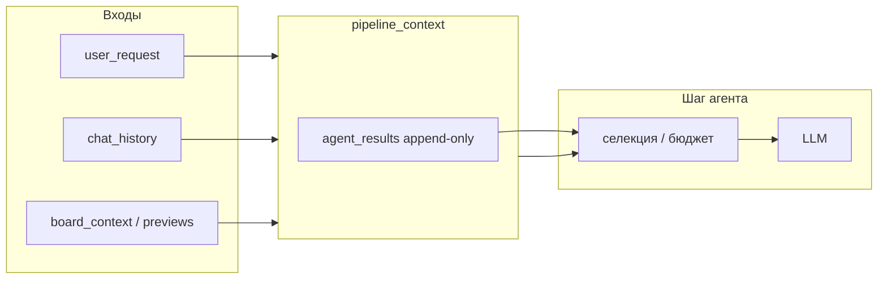
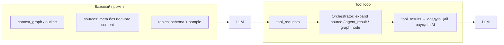

# Context Engineering — план внедрения для Multi-Agent GigaBoard

**Дата**: 22 марта 2026 (статус внедрения — апрель 2026; концепция pull-контекста — апрель 2026)  
**Статус**: в реализации (фаза 0 завершена; контекстный граф L0+L1/L2 — в продакшен-контуре; фазы 1–5 — частично; **pull-модель детализации** — зафиксирована как целевое направление, см. §3.1)  
**Связанные документы**: [`MULTI_AGENT.md`](./MULTI_AGENT.md), [`PLANNING_DECOMPOSITION_STRATEGY.md`](./PLANNING_DECOMPOSITION_STRATEGY.md), [`history/2026-02-17_CONTEXT_ARCHITECTURE_IMPLEMENTED.md`](./history/2026-02-17_CONTEXT_ARCHITECTURE_IMPLEMENTED.md)

---

## Executive Summary

**Context engineering** в GigaBoard — это набор правил и механизмов, определяющих, **какие данные** попадают в промпт LLM на каждом шаге пайплайна, в **каком объёме** и в **каком виде**, при сохранении контракта `pipeline_context` + `agent_results`.

Цель внедрения:

- снизить риск ошибок вида «context too long», таймаутов и нестабильного поведения модели;
- уменьшить шум в промпте (role-aware подача данных, а не broadcast всей истории всем агентам);
- сделать поведение **измеримым** (метрики размера контекста по шагам);
- сохранить совместимость с существующим Orchestrator Single Path и форматом `AgentPayload`.

**Целевое направление (концепция):** помимо сжатия и срезов в промпте — переход к **pull-модели**: в агент изначально уходит **компактный** контекст, а **детализация** (сырой фрагмент шага, полный текст источника после discovery/research и т.п.) запрашивается **оркестраторским тулом** в ходе tool loop, по аналогии с уже существующим паттерном `readTableListFromContentNodes` / `readTableData` для таблиц. Подробнее — §3.1.

Ниже — **текущая базовая линия** в репозитории и **пошаговый план фаз** с привязкой к файлам и критериям готовности.

### Статус внедрения (апрель 2026)

- ✅ **Контекстный граф — базовый контур**: в `pipeline_context` инициализируется `context_graph` (`apps/backend/app/services/multi_agent/context_graph/`). При каждом append в `agent_results` — **ingest узла L0** (в `summary_text` — narrative/findings и **дайджесты** `tables_digest` / `sources_digest` для опоры без дублирования полного `PREVIOUS RESULTS`); при наличии `LLMRouter` и `MULTI_AGENT_CONTEXT_GRAPH_LLM_COMPRESSION=true` (по умолчанию вкл.) — **два** вызова сжатия с ключом **`context_graph_compression`**: поля `l1_summary`, `l2_one_liner` на узле L0. Лимит узлов: `MULTI_AGENT_CONTEXT_GRAPH_MAX_NODES`. **Срез для промпта**: `build_context_graph_slice` + `resolve_slice_node_body` по `compaction_level`. **Push-first компактность**: при уровне **`full`** в срез идёт **L1** (при наличии) + однострочный якорь **L2**, а не полный L0 — детализация через **expand***-тулы. При **`compact`** в срезе приоритет **L2** → L1 → L0; при **`minimal`** — L2 или усечённые L1/L0 (`MULTI_AGENT_CONTEXT_GRAPH_SLICE_MINIMAL_L1_MAX` / `..._L0_MAX`). Блок `_context_graph_slice` подмешивается в **Planner**, **Analyst**, **Reporter**.
- ✅ **Graph-primary (основная память шагов)**: при `MULTI_AGENT_CONTEXT_GRAPH_PRIMARY=true` (по умолчанию) и непустом графе `select_context_for_step` оставляет в `effective_context["agent_results"]` только **хвост** последних шагов (`MULTI_AGENT_CONTEXT_GRAPH_PRIMARY_TAIL_ITEMS`, по умолчанию 2); полная роль-бюджетная выборка хранится в **`_agent_results_selected_budget`** — её использует **Reporter** для синтеза таблиц/кода, чтобы не терять данные при коротком хвосте. История для LLM на шаге — **граф** + хвост; дублирование длинной ленты `PREVIOUS RESULTS` убрано.
- ⏳ **Граф — дальше по плану**: заполнение **`edges`**, семантический отбор / embeddings, метрики сжатия в trace.
- ✅ **Pull-тулы (MVP, фаза 2.4)**: в `Orchestrator._execute_orchestrator_tool_request` добавлены **`expandResearchSourceContent`**, **`expandAgentResult`**, **`expandContextGraphNode`** (`context_expand_tools.py`); кэш `_tool_result_cache` и digest-строки как у табличных тулов; master-switch **`MULTI_AGENT_CONTEXT_EXPAND_TOOLS`** (по умолчанию вкл.); лимиты **`MULTI_AGENT_TOOL_EXPAND_SOURCE_MAX_CHARS`**, **`MULTI_AGENT_TOOL_EXPAND_AGENT_MAX_CHARS`**. Инструкции в **`tabular_tool_contract.TOOL_MODE_AGENT_SYSTEM_APPENDIX_RU`** для агентов с tool mode. Остаётся: по умолчанию **не класть** полный `sources[].content` в push-промпт (сейчас санитизация как прежде).

**Остаточные задачи (сводка по фазам документа)**:

| Область | Сделано | Осталось |
|--------|---------|----------|
| Фаза 0 (метрики trace) | `context_estimates`, порог `MULTI_AGENT_CONTEXT_WARN_CHARS` | Расширить при необходимости: отдельные поля по сжатию графа (latency, ошибки) |
| Фаза 1 (селекция) | `context_selection` + `effective_context`, task-aware бюджеты, граф-срез для planner/analyst/reporter | Единый селектор везде, где ещё ad-hoc; полная документированная «карта полей» по всем агентам |
| Фаза 2 (тяжёлые поля) | Санитизация; **pull-тулы MVP** (`expand*`) + кэш | Урезать push `sources.content` по умолчанию; интеграционные тесты; при необходимости отдельный тул «список узлов графа» |
| Фаза 3 (`pipeline_memory`) | Ключ в контексте, приоритет в planner | Строгая схема обновлений и лимиты без «раздувания» |
| Фаза 4 (`chat_history`) | Нормализация в `effective_context` | Разные N по контроллерам / summary старой части — по метрикам |
| Фаза 5 (тесты) | Юнит-тесты графа/среза | Интеграционные сценарии «большой контекст» + E2E с реальным API (см. `ROADMAP`) |

- ✅ **Фаза 0**: добавлены `context_metrics.py` и trace-поля `context_estimates` + warning по `MULTI_AGENT_CONTEXT_WARN_CHARS`. В событии **`agent_call_start`** дополнительно пишется **`context_efficiency`** (срез графа, graph-primary, размер `_agent_results_selected_budget`, узлов в графе, записей в кэше тулов). Для pull-тулов в **`tool_result`** добавлены поля **`context_pull_*`**. Опционально **INFO**-логи строкой `[context_efficiency]` / `[context_pull_tool]`: env **`MULTI_AGENT_CONTEXT_EFFICIENCY_LOG=true`**. Агрегация по сохранённым JSONL: `tests/backend/runtime_trace_context_report.py`.
- ✅ **Трейсы expand / compaction / LLM-сжатие графа**: в JSONL пишутся **`expand_step_evaluated`** (результат вызова planner с `expand_step`: `atomic`, `sub_steps_count`, `expand_call_status`), **`expand_step_skipped`** (`disable_heavy_decomposition` или widget/transform codex pipeline), **`context_compaction_budget`** (при `compaction_level` ≠ `full`: сырой и эффективный бюджет items/chars, лимиты чата, длина среза графа), **`context_graph_llm_compressed`** (после `maybe_compress_l0_node_with_llm`: длины L0/L1/L2, флаг `partial` если L2 не удался). Опциональные **INFO**-логи `[context_expand]`, `[context_compaction]`, `[context_graph_compress]`: env **`MULTI_AGENT_CONTEXT_EXPAND_COMPACT_LOG=true`** (по умолчанию выкл.).
- 🔄 **Фаза 1 (частично)**: добавлен `context_selection.py` (role-aware поля, бюджеты, санитизация `sources`/`tables`), подключено в Orchestrator как `effective_context` перед вызовом агента.
- 🔄 **Фаза 1 (частично)**: task-aware профили бюджета для `planner` (`create_plan` / `expand_step` / `revise_remaining` / `replan`) и fallback-защита в `Analyst`/`Reporter`.
- 🔄 **Фаза 1 (частично)**: в `effective_context` добавлена нормализация `chat_history` и `input_data_preview` / `catalog_data_preview` (ограничение сообщений, таблиц, колонок).
- ✅ **Policy Engine**: task-aware `timeout/retry/context_ladder` (full/compact/minimal) подключены в Orchestrator; source policy — `agent_llm_override.runtime_options` (БД) с поддержкой `task_overrides`.
- 🔄 **Фаза 3 (частично)**: добавлен `pipeline_memory` в `pipeline_context`, planner/revise/replan получают приоритетный memory-блок.
- 🔄 **Фаза 4 (частично)**: в runtime-check и trace добавлены KPI `time_to_first_result_ms`, `planner_error_streak_max`, `fallback_reason`, `context_compaction_level`.

---

## 1. Термины

| Термин | Значение в GigaBoard |
|--------|----------------------|
| `pipeline_context` | Один мутабельный dict на запуск Orchestrator: `user_request`, данные контроллера, служебные ключи, **`agent_results`** (append-only), опционально **`context_graph`** (shared memory, см. статус внедрения). |
| `context_graph` | Граф памяти сессии: узлы **L0** с `summary_text`, опционально **`l1_summary`** / **`l2_one_liner`** (после LLM-сжатия), `agent_result_index`, `step_id` / `phase`; срез в промпт — `_context_graph_slice`. Поле **`edges`** в схеме есть, пока **не заполняется** (явные связи — в планах). Модель сжатия: привязка **`context_graph_compression`** в `agent_llm_override`; без неё — **системная модель по умолчанию**, как у агентов без пресета (см. [`LLM_CONFIGURATION_CONCEPT.md`](./LLM_CONFIGURATION_CONCEPT.md)). |
| `agent_results` | Хронологический список сериализованных результатов агентов; полная история шагов текущего и связанных проходов. |
| Промпт контекста | То, что реально собирается в `messages` / строку задачи перед вызовом LLM (может отличаться от полного `agent_results` после фильтрации). |
| Рабочая память | Сжатый **структурированный** слой: цель пользователя, принятые решения, инварианты — для replan и долгих сессий (целевое состояние, см. фазу 3). |
| Бюджет | Верхняя граница по элементам списка, символам или оценочным токенам на шаг или на поле (`sources`, `tables`, …). |
| **Pull-контекст** (целевое состояние) | Политика «**сжато по умолчанию**»: в промпт попадают оглавление/дайджесты (граф L0/L1/L2, схемы таблиц, **метаданные источников без полного `content`**). Полные или удлинённые фрагменты агент получает через **вызов тула оркестратора** в рамках уже существующего tool loop (`tool_requests` → исполнение → `tool_results`). |

---

## 2. Базовая линия (уже есть в коде)

Ниже — опорные точки, на которые опирается план; их не нужно «изобретать заново», а **развивать единообразно**.

| Механизм | Где | Назначение |
|----------|-----|------------|
| Единый `pipeline_context`, append в `agent_results` | `apps/backend/app/services/multi_agent/orchestrator.py` | Один объект контекста на пайплайн; агенты видят накопленную историю. |
| Лимиты пошагового плана | `MAX_STEPS_EXECUTED`, `MAX_REVISE_REMAINING_PER_SESSION`, `MAX_EXPAND_PER_STEP` в `orchestrator.py` | Защита от бесконечных циклов декомпозиции и выполнения. |
| Централизованная селекция `agent_results` | `context_selection.py` + вызов из `orchestrator.py` (`effective_context`) | Role-aware срез и бюджеты перед каждым агентом (в текущей фазе: planner/analyst/reporter). |
| Трассировка JSONL | `MultiAgentTraceLogger` в `orchestrator.py`, события `run_start`, `pipeline_context_built`, `plan_created`, `agent_call_end`, … | Основа для **наблюдаемости**; расширяется в фазе 0. |
| Хелперы чтения истории | `BaseAgent._last_result`, `_all_results` в `agents/base.py` | Выборка по `agent` без дублирования логики в каждом агенте. |
| Специальные пути контекста | `suggestions_fast_path`, `assistant_simple_qa`, отключение тяжёлой декомпозиции для widget/transformation | Уже учитывают стоимость контекста/шагов; документировать как политики. |

---

## 3. Целевая модель (к чему приходим)

Идеально промпт на шаге собирается из **четырёх слоёв** (не все обязательны в каждом вызове):

1. **Системные правила** — роль агента, формат ответа (уже в system prompt агентов).
2. **Рабочая память** — короткий structured block в `pipeline_context` (фаза 3).
3. **Релевантные результаты предшественников** — не весь `agent_results`, а срез по роли шага и бюджету (фазы 1–2).
4. **Сырые входы сценария** — `user_request`, при необходимости усечённый `chat_history`, превью таблиц (фаза 4).

Оркестратор остаётся **единственным местом**, где задаётся порядок шагов; селекция контекста может жить в **отдельном модуле** (например `context_policy.py` или слой внутри `BaseAgent`), вызываемом перед сборкой промпта.

### 3.1 Pull-модель детализации и результаты поиска (целевое направление)

Сейчас основной рычаг — **push**: в `effective_context` попадает уже отобранный и усечённый текст (в т.ч. санитизация `sources[]` в `context_selection.py`). Это снижает риск переполнения, но при большом числе страниц и длинных вытяжках **даже усечённые** массивы могут давать заметный шум и дублирование с контекстным графом.

**Целевая идея — pull:**

1. **Базовый промпт** на шаге содержит только **индекс/каркас**: для пайплайна — срез графа или краткий outline шагов; для таблиц — схема и `row_count` (как сейчас в духе tool-first); для **discovery/research** — список источников с `url`, `title`, `snippet`, статусом, **без** полного `content` (или с минимальным cap).
2. **Детализация по требованию** — отдельные **оркестраторские тулы** (новые или расширение контракта существующих), например:
   - развернуть **узел контекстного графа** / запись `agent_results` по индексу с белым списком полей и лимитом символов;
   - развернуть **тело страницы** (или фрагмент `sources[i].content`) по стабильному ключу (`agent_result_index` + индекс источника, либо `url`), с параметрами `max_chars` / head+tail.
3. **Исполнение** — тот же цикл, что у Analyst/Structurizer с `readTableData`: JSON с `tool_requests` → оркестратор выполняет тул → результаты попадают в контекст следующего раунда; желательно **кэш** по ключу запроса (аналог `_tool_result_cache` для табличных тулов).
4. **Совместимость с остальным стеком**: лестница `context_ladder` при **retry после ошибки** остаётся **аварийным** ужатием того, что уже в промпте; pull-модель и retry **не исключают** друг друга.

**Почему это особенно важно для поиска:** объём извлечённого текста с сайтов **непредсказуем**; держать десятки страниц в `PREVIOUS RESULTS` дорого и часто избыточно. Pull позволяет **Structurizer/Analyst** сначала выбрать релевантные URL по каркасу, затем **один или несколько** целевых вызовов тула — с контролируемой стоимостью раундов (`MULTI_AGENT_TOOL_MAX_ROUNDS_PER_STEP`).

**Связь с фазой 2 (план):** задачи 2.1–2.3 дополняются явным пунктом: **не только усечение в селекторе**, а **контракт pull-тулов** + описание в [`MULTI_AGENT.md`](./MULTI_AGENT.md) для агентов с `tools_enabled` (research → structurizer → analyst).

---

## 4. План внедрения по фазам

### Фаза 0 — Наблюдаемость и базовая линия метрик

**Цель**: любое изменение промптов или политик сопровождается цифрами «до/после».

| # | Задача | Детали реализации | Критерий готовности |
|---|--------|-------------------|---------------------|
| 0.1 | Расширить события трассировки | В `agent_call_start` / перед вызовом агента логировать: `agent`, `step_id`, оценку размера `len(json.dumps(agent_results, default=str))`, число элементов `agent_results`, наличие и длину `chat_history` (суммарно символы). | В JSONL-trace видно поле `context_estimates` (или аналог) на каждый шаг. |
| 0.2 | Единая функция оценки размера | Вынести в утилиту (например `multi_agent/context_metrics.py`): `estimate_serialized_size(obj)`, `summarize_agent_results_stats(agent_results)`. | Импорт используется в Orchestrator и при необходимости в тестах. |
| 0.3 | Опционально: env-порог предупреждения | `MULTI_AGENT_CONTEXT_WARN_CHARS` — лог `warning`, если оценка превышает порог (без обрезки). | Включение/выключение без перекомпиляции. |

**Файлы**: `orchestrator.py`, новый модуль метрик, при необходимости `config.py` для порогов.

**Риски**: низкие; объём логов — контролировать ротацией и флагом `MULTI_AGENT_TRACE_ENABLED`. Событие `tool_result` в JSONL содержит поле `result` — сериализуемый ответ инструмента (после усечения длинных списков); при превышении `MULTI_AGENT_TRACE_TOOL_DATA_MAX_CHARS` тело переносится в `result_json_head`, флаг `result_truncated`.

---

### Фаза 1 — Централизованная селекция и бюджеты по ролям

**Цель**: уйти от ситуации, когда только Analyst обрезает историю, а остальные агенты потенциально получают полный список при сборке промпта.

| # | Задача | Детали реализации | Критерий готовности |
|---|--------|-------------------|---------------------|
| 1.1 | Карта «агент → разрешённые поля» | Таблица или dict: для шага `analyst` в промпт попадают, например, последние N записей с полями `agent`, `narrative`, `findings`, `tables` (см. профиль); для `reporter` — агрегированный срез и последние код-блоки. | Документированная схема в этом файле + код в одном месте. |
| 1.2 | Функция `select_context_for_step(agent_name, pipeline_context, step_task) -> dict` | Возвращает **копию** среза для промпта (не мутирует `pipeline_context`). Используется в агентах или в общем `_build_messages` слое. | Юнит-тесты: на длинном `agent_results` размер среза ограничен бюджетом. |
| 1.3 | Параметры бюджетов из конфига | `TimeoutConfig` / новый `ContextBudgetConfig`: `max_agent_result_items`, `max_total_chars`, пер-агент overrides. | Значения по умолчанию близки к текущим эвристикам Analyst. |
| 1.4 | Рефакторинг Analyst | Заменить ad-hoc вызов `_limit_agent_results_for_prompt` на общий селектор (или обёртку над ним). | Поведение не хуже текущего на типовых сценариях. |

**Файлы**: `agents/analyst.py`, `agents/reporter.py`, `agents/planner.py`, … — по мере необходимости; новый `context_selection.py` (или аналог).

**Риски**: регрессии качества — смягчаются фазой 5 (набор сценариев) и сохранением старых лимитов как default.

---

### Фаза 2 — Семантическое усечение «тяжёлых» полей и pull-детализация

**Цель**: даже при включённом срезе записей `agent_results` отдельные payload могут быть огромными (длинный `sources[].content`, большие `tables`). Дополнительно — заложить **pull** как основной способ получать полноту там, где push-усечения недостаточно или всё равно дорого.

| # | Задача | Детали реализации | Критерий готовности |
|---|--------|-------------------|---------------------|
| 2.1 | Политика для `sources` | Обрезка `content` до K символов на URL в селекторе; **целевое состояние** — в промпте по умолчанию только meta/snippet, полный текст — через тул (см. §3.1). Логирование факта усечения в metadata среза. | Промпт не содержит полных статей без лимита / без явного tool-запроса. |
| 2.2 | Политика для `tables` / ContentTable | Передача в LLM: схема + sample строк (первые M строк) + row_count; полные данные — через **`readTableData`** (уже в духе pull). | Codex/Analyst получают согласованный формат. |
| 2.3 | Единая точка санитизации | Функции `truncate_sources_for_llm`, `truncate_tables_for_llm` в модуле рядом с селектором; переиспользование в Research/Structurizer downstream при необходимости. | Дублирование логики в агентах сокращено. |
| 2.4 | Тулы развёртывания контекста | **Реализовано (MVP):** `expandResearchSourceContent`, `expandAgentResult`, `expandContextGraphNode` в `orchestrator.py` + `context_expand_tools.py`; кэш; приложение к system prompt через `TOOL_MODE_AGENT_SYSTEM_APPENDIX_RU`. Дальше: ослабить push-политику для `sources` при включённых тулах; при необходимости — отдельный тул outline графа. | pytest `tests/backend/test_context_expand_tools.py`; события `tool_request` / `tool_result` в trace как у прочих тулов. |

**Файлы**: `orchestrator.py`, `context_selection.py`, агенты с тулами (`structurizer.py`, `research.py`, `analyst.py`, …), `docs/MULTI_AGENT.md`.

**Риски**: потеря деталей для анализа — компенсировать pull-тулами и лимитами раундов; лишние вызовы — метрики в фазе 0.

---

### Фаза 3 — Рабочая память (`pipeline_memory`)

**Цель**: явные **инварианты** и **решения**, которые не должны теряться при усечении истории и при `replan`.

| # | Задача | Детали реализации | Критерий готовности |
|---|--------|-------------------|---------------------|
| 3.1 | Схема `pipeline_memory` | Поля: `user_goal`, `constraints[]`, `decisions[]`, `open_questions[]`, обновление на ключевых шагах (после Planner, после Analyst, перед Reporter — по политике). | Структура описана в `MULTI_AGENT.md` или здесь; ключ присутствует в `pipeline_context`. |
| 3.2 | Кто обновляет | Минимальный вариант: Planner и Reporter пишут краткие bullet'ы; Orchestrator мержит без дублирования (max N пунктов). | В trace видны обновления памяти. |
| 3.3 | Использование в промпте | Planner при `revise_remaining` / `replan` получает `pipeline_memory` в первую очередь. | Качество replan на длинных сессиях стабильнее (подтверждается сценариями). |

**Файлы**: `orchestrator.py`, `agents/planner.py`, опционально `agents/reporter.py`.

**Риски**: раздувание памяти — жёсткий лимит символов на `pipeline_memory` и приоритизация последних решений.

---

### Фаза 4 — Политика `chat_history`

**Цель**: не передавать в LLM неограниченную историю чата на каждом шаге.

| # | Задача | Детали реализации | Критерий готовности |
|---|--------|-------------------|---------------------|
| 4.1 | Серверное ограничение | При сборке контекста: последние N сообщений или последние N + summary старой части (summary — отдельная задача/эндпоинт или эвристика). | В метриках видно сокращение длины `chat_history` в промпте. |
| 4.2 | Согласование с фронтом | Документировать: клиент может слать полную историю, сервер **нормализует** для LLM. | `MULTI_AGENT.md` принцип 6 уточнён или дополнен ссылкой сюда. |
| 4.3 | Разные лимиты по контроллерам | Transform/Widget — возможно больший вес последних сообщений; AI Assistant — свой N. | Конфиг по `controller` / `mode`. |

**Файлы**: `orchestrator.py` (нормализация при построении `pipeline_context`) или контроллеры до вызова Orchestrator.

**Риски**: потеря контекста диалога — частично компенсируется фазой 3.

---

### Фаза 5 — Регрессия и качество

**Цель**: изменения контекста не ломают пайплайны.

| # | Задача | Детали реализации | Критерий готовности |
|---|--------|-------------------|---------------------|
| 5.1 | Набор фикстур | JSON с минимальными `pipeline_context` + ожидаемые свойства после `select_context_for_step` (размер, наличие полей). | pytest покрывает селектор и усечения. |
| 5.2 | Интеграционные тесты Orchestrator | С моком LLM: проверка, что при большом `agent_results` вызов не превышает порог символов. | CI зелёный. |
| 5.3 | Опционально: E2E с GigaChat | По `ROADMAP` — для реальных лимитов API. | Отчёт о лимитах и таймаутах зафиксирован. |

---

## 5. Порядок работ (рекомендуемый)

Рекомендуемая последовательность: **0 → 1 → 2 → 4 → 3 → 5** (фаза 4 раньше 3, если больнее всего «раздувает» именно чат; иначе строго по номерам).

Кратко:

1. **Метрики** (фаза 0) — без них оптимизация слепая.  
2. **Селекция и бюджеты** (фаза 1) — максимальный эффект при текущей архитектуре.  
3. **Усечение тяжёлых полей** (фаза 2) — убирает выбросы по одному payload.  
4. **chat_history** (фаза 4) или **pipeline_memory** (фаза 3) — в зависимости от того, что хуже по метрикам.  
5. **Тесты и E2E** (фаза 5) — постоянно, не только в конце.

---

## 6. Связь с «мировыми» практиками

| Практика | Где в плане |
|----------|-------------|
| Role-aware / маршрутизация памяти | Фазы 1–2: разные срезы и поля для разных агентов. |
| Явное состояние (не только текст чата) | Фаза 3: `pipeline_memory`. |
| Бюджеты токенов/символов | Фазы 0–2, 4. |
| Детерминированные факты вне промпта | Уже есть (исполнение кода, QualityGate); усиление — не дублировать большие таблицы в LLM, фаза 2. |
| **Retrieval / tool-augmented context** | §3.1 + фаза 2.4: компактный промпт, детали по запросу через оркестратор (как `readTableData` для строк таблиц). |
| Наблюдаемость | Фаза 0 + trace. |

---

## 7. Чеклист для ревью PR (context engineering)

- [ ] Изменён ли только промпт/контекст, без скрытой мутации `pipeline_context` там, где нужна неизменность среза?
- [ ] Задокументированы новые env и дефолты?
- [ ] Есть ли метрика или лог размера «до» для сравнения?
- [ ] Добавлены или обновлены юнит-тесты на селектор/бюджет?
- [ ] Обновлён этот документ или `MULTI_AGENT.md` при изменении контракта контекста (в т.ч. новые pull-тулы)?

---

## 8. Runtime policy в LLM Overrides

Runtime-политика исполнения теперь хранится рядом с LLM-привязкой агента в `agent_llm_override.runtime_options`.

Что покрывает `runtime_options`:

- `timeout_sec`, `max_retries`, `context_ladder` — управление retry/деградацией контекста;
- `max_items`, `max_total_chars` — бюджет для `context_selection`;
- `task_overrides` — точечные правила для `task_type` (например `create_plan`, `replan`, `validate`).

Приоритеты разрешения:

1. task-specific значения из `runtime_options.task_overrides[task_type]`;
2. общие значения из `runtime_options`;
3. env/default значения в коде.
