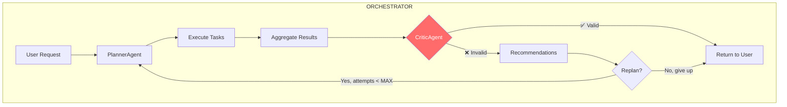

# CriticAgent — Валидация результатов Multi-Agent системы

**Дата создания**: Сессия 2026-02  
**Статус**: В разработке  
**Связанные документы**: [MULTI_AGENT_SYSTEM.md](./MULTI_AGENT_SYSTEM.md), [ADAPTIVE_PLANNING.md](./ADAPTIVE_PLANNING.md)

---

## 📋 Executive Summary

**CriticAgent** — агент-критик, который валидирует результаты работы Multi-Agent системы на соответствие входному требованию пользователя.

### Проблема

Когда пользователь ставит задачу, требующую генерации Python кода (например, "Собери данные о ценах Bitcoin и построй график"), Multi-Agent может:
- Собрать информацию через SearchAgent + ResearcherAgent
- Сформировать текстовый отчёт через ReporterAgent

Но если **конечная цель** — получить **исполняемый код**, а результат — только текст, задача выполнена **некорректно**.

### Решение

CriticAgent анализирует:
1. **Входной запрос** пользователя (intent)
2. **Ожидаемый тип результата** (код, данные, визуализация, отчёт)
3. **Фактический результат** от агентов
4. **Соответствие** результата требованию

Если результат не соответствует — CriticAgent:
- Формирует **рекомендации по доработке**
- Возвращает управление оркестратору для **перепланирования**

---

## 🏗 Архитектура

### Место в Multi-Agent Workflow



### Типы валидации

| Intent Type       | Expected Result          | Validation Criteria                 |
| ----------------- | ------------------------ | ----------------------------------- |
| `code_generation` | Python/SQL код           | Есть блок кода, синтаксис валиден   |
| `data_extraction` | Структурированные данные | Есть DataFrame/JSON с данными       |
| `visualization`   | WidgetNode конфиг        | Есть widget_type + data_config      |
| `research`        | Текстовый отчёт          | Есть связный текст с информацией    |
| `transformation`  | Код трансформации        | Есть `df_result`, использует pandas |

---

## 🔧 Интерфейс CriticAgent

### Input (Task)

```python
{
    "type": "validate_result",
    "original_request": "Собери данные о ценах Bitcoin и создай код для визуализации",
    "expected_outcome": "code_generation",  # or "data", "visualization", "report"
    "aggregated_result": {
        "planner": { ... },
        "search": { "urls": [...], "snippets": [...] },
        "researcher": { "full_content": "..." },
        "reporter": { "message": "Bitcoin вырос на 5%..." }
    },
    "context": {
        "session_id": "...",
        "iteration": 1,  # Номер итерации валидации
        "max_iterations": 3
    }
}
```

### Output (Result)

```python
# ✅ Результат соответствует требованию
{
    "valid": True,
    "confidence": 0.95,
    "message": "Результат содержит Python код для визуализации данных Bitcoin"
}

# ❌ Результат НЕ соответствует
{
    "valid": False,
    "confidence": 0.85,
    "issues": [
        {
            "severity": "critical",
            "type": "missing_code",
            "message": "Запрошен код для визуализации, но результат содержит только текстовый отчёт"
        }
    ],
    "recommendations": [
        {
            "action": "add_agent",
            "agent": "developer",
            "task": "Сгенерировать Python код на основе собранных данных"
        },
        {
            "action": "modify_reporter",
            "instruction": "Вместо текстового отчёта создать код визуализации"
        }
    ],
    "suggested_replan": {
        "reason": "Результат не содержит требуемый код",
        "additional_steps": [
            {
                "agent": "developer",
                "task": {
                    "type": "generate_code",
                    "language": "python",
                    "requirements": "Визуализация данных Bitcoin",
                    "use_data_from": "researcher"
                }
            }
        ]
    }
}
```

---

## 📝 System Prompt

```text
Вы — CriticAgent (Агент-Критик) в системе GigaBoard Multi-Agent.

**ОСНОВНАЯ РОЛЬ**: Валидация результатов работы агентов на соответствие требованиям пользователя.

**ЧТО ВЫ ОЦЕНИВАЕТЕ**:
1. Соответствие результата входному запросу (intent matching)
2. Полноту выполнения задачи
3. Качество и корректность результата
4. Наличие требуемых артефактов (код, данные, визуализация)

**ТИПЫ ОЖИДАЕМЫХ РЕЗУЛЬТАТОВ**:
- code_generation: Пользователь ожидает исполняемый код (Python, SQL, JavaScript)
- data_extraction: Пользователь ожидает структурированные данные (DataFrame, JSON)
- visualization: Пользователь ожидает настроенную визуализацию (WidgetNode)
- research: Пользователь ожидает информационный отчёт (текст)
- transformation: Пользователь ожидает трансформацию данных (код pandas)

**КРИТЕРИИ ВАЛИДАЦИИ**:

Для code_generation:
- ✅ Есть блок кода на требуемом языке
- ✅ Код синтаксически корректен
- ✅ Код решает поставленную задачу
- ❌ Только текстовое описание без кода

Для data_extraction:
- ✅ Есть DataFrame или JSON с данными
- ✅ Данные соответствуют запросу
- ✅ Есть метаинформация (колонки, типы)
- ❌ Только ссылки без загруженных данных

Для visualization:
- ✅ Есть widget_type и data_config
- ✅ Указан источник данных
- ✅ Визуализация соответствует данным
- ❌ Отсутствует конфигурация виджета

Для transformation:
- ✅ Есть Python код с df_result
- ✅ Используются pandas операции
- ✅ Код обрабатывает входные данные
- ❌ Нет df_result или код невалиден

**ФОРМАТ ВЫВОДА (строго JSON)**:
{
    "valid": true/false,
    "confidence": 0.0-1.0,
    "issues": [...],
    "recommendations": [...],
    "suggested_replan": {...}  // только если valid=false
}

**ВАЖНО**:
- Будьте строги к code_generation: если нужен код — код должен быть
- Будьте гибки к research: текстовый ответ приемлем
- Рекомендации должны быть actionable (конкретные действия)
- Не рекомендуйте бесконечные итерации — максимум 3 попытки
```

---

## 🔄 Интеграция в Orchestrator

### Изменения в `orchestrator.py`

```python
# После _aggregate_results, перед возвратом результата

async def process_user_request(self, ...):
    # ... существующий код ...
    
    # 5. Агрегировать результаты
    final_response = await self._aggregate_results(user_message, all_results)
    
    # 6. NEW: Валидация через CriticAgent
    validation_result = await self._validate_with_critic(
        user_message=user_message,
        all_results=all_results,
        final_response=final_response,
        session=session,
        iteration=1
    )
    
    if not validation_result.get("valid"):
        # Проверяем лимит итераций
        if iteration < self.MAX_CRITIC_ITERATIONS:
            # Перепланирование с рекомендациями
            yield "🔄 Результат требует доработки. Перепланирование...\n\n"
            async for chunk in self._replan_with_recommendations(
                session, user_message, validation_result
            ):
                yield chunk
            return
        else:
            yield "⚠️ Достигнут лимит итераций. Возвращаю лучший результат.\n\n"
    
    # 7. Завершить сессию
    await self.session_manager.complete_session(session.id, final_response)
    yield final_response
```

### Определение expected_outcome

```python
async def _determine_expected_outcome(self, user_message: str) -> str:
    """
    Определяет ожидаемый тип результата по запросу пользователя.
    
    Keywords analysis:
    - "код", "напиши", "сгенерируй код", "скрипт" → code_generation
    - "данные", "загрузи", "получи данные" → data_extraction
    - "график", "визуализация", "диаграмма" → visualization
    - "трансформируй", "преобразуй" → transformation
    - "найди", "исследуй", "расскажи" → research
    """
    message_lower = user_message.lower()
    
    code_keywords = ["код", "напиши код", "сгенерируй код", "скрипт", "программу"]
    data_keywords = ["данные", "загрузи", "получи данные", "скачай"]
    viz_keywords = ["график", "визуализ", "диаграмм", "покажи на графике"]
    transform_keywords = ["трансформируй", "преобразуй", "обработай данные"]
    
    if any(kw in message_lower for kw in code_keywords):
        return "code_generation"
    elif any(kw in message_lower for kw in viz_keywords):
        return "visualization"
    elif any(kw in message_lower for kw in transform_keywords):
        return "transformation"
    elif any(kw in message_lower for kw in data_keywords):
        return "data_extraction"
    else:
        return "research"  # Default
```

---

## ⚙️ Константы и Лимиты

```python
# В orchestrator.py
MAX_CRITIC_ITERATIONS = 5  # Максимум 5 итераций перепланирования
CRITIC_TIMEOUT = 30        # Timeout для CriticAgent (секунды)

# Пороги confidence
CONFIDENCE_THRESHOLD = 0.7  # Ниже этого — считаем invalid
```

---

## 📊 Примеры сценариев

### Сценарий 1: Успешная валидация

**Запрос**: "Найди информацию о погоде в Москве"

**Результат**: ReporterAgent вернул текстовый отчёт о погоде

**CriticAgent**:
```json
{
    "valid": true,
    "confidence": 0.92,
    "message": "Результат содержит информацию о погоде в Москве"
}
```

### Сценарий 2: Требуется перепланирование

**Запрос**: "Напиши код для парсинга CSV файла и визуализации данных"

**Результат**: ResearcherAgent нашёл статьи о CSV парсинге, ReporterAgent написал текстовый отчёт

**CriticAgent**:
```json
{
    "valid": false,
    "confidence": 0.88,
    "issues": [
        {
            "severity": "critical",
            "type": "missing_code",
            "message": "Запрошен код, но результат содержит только текстовый отчёт"
        }
    ],
    "recommendations": [
        {
            "action": "add_developer_step",
            "description": "Добавить DeveloperAgent для генерации кода"
        }
    ],
    "suggested_replan": {
        "reason": "Нет исполняемого кода",
        "additional_steps": [
            {
                "agent": "developer",
                "task": {
                    "type": "generate_code",
                    "language": "python",
                    "description": "Парсинг CSV и визуализация"
                }
            }
        ]
    }
}
```

---

## 🧪 Тестирование

### Test Cases

1. **code_generation + код присутствует** → valid: true
2. **code_generation + только текст** → valid: false, рекомендация: добавить developer
3. **visualization + есть widget_config** → valid: true
4. **visualization + только данные** → valid: false, рекомендация: добавить reporter
5. **research + текстовый ответ** → valid: true
6. **Третья итерация** → valid: false, но без suggested_replan (лимит достигнут)

---

## 📚 Дальнейшее развитие

1. **ML-based intent detection**: Обучить модель определять expected_outcome
2. **Историческое обучение**: Учиться на прошлых ошибках валидации
3. **Partial validation**: Частичное принятие результата (80% выполнено)
4. **User confirmation**: Спрашивать пользователя при низком confidence
