# Cross-Filter System (Кросс-фильтрация)

**Статус**: ✅ Реализовано (28 февраля 2026)  
**Актуализировано**: 20 марта 2026 — §3.5: связь с Multi-Agent (`readTableData`, `_compute_filtered_pipeline`)  
**Приоритет**: High  
**Дата создания**: 27 февраля 2026  
**Связанные документы**: [BOARD_SYSTEM.md](./BOARD_SYSTEM.md), [DASHBOARD_SYSTEM.md](./DASHBOARD_SYSTEM.md), [DATA_NODE_SYSTEM.md](./DATA_NODE_SYSTEM.md), [DRILL_DOWN_SYSTEM.md](./DRILL_DOWN_SYSTEM.md), [MULTI_AGENT.md](./MULTI_AGENT.md) (тулы оркестратора и `_compute_filtered_pipeline`), [PROJECT_ACCESS.md](./PROJECT_ACCESS.md) (роль **viewer**: без мутаций измерений/пресетов и записи фильтров на сервере)

---

## 📋 Executive Summary

**Cross-Filter System** — движок глобальных фильтров для досок и дашбордов GigaBoard. Позволяет пользователю интерактивно фильтровать данные **кликами по виджетам** (столбец диаграммы, строка таблицы) или **вручную через Filter Bar**, при этом **все виджеты на доске/дашборде обновляются** в соответствии с активными фильтрами.

### Ключевые принципы

1. **Фильтрация как пост-процессинг** — данные в SourceNode/ContentNode хранятся в исходном состоянии. Фильтры применяются на этапе отдачи данных потребителю (WidgetNode, следующий ContentNode)
2. **Измерения (Dimensions)** — каталог именованных измерений на уровне проекта. Столбцы таблиц ассоциируются с измерениями. Фильтр применяется к измерению, но затрагивает все таблицы, содержащие сопоставленные столбцы
3. **Инкрементальные фильтры** — пользователь может последовательно кликать по разным виджетам, накапливая условия фильтрации из разных измерений
4. **Сохраняемые наборы** — фильтры можно сохранять как именованные пресеты и применять повторно или автоматически при открытии дашборда

### Отличие от DRILL_DOWN

| Аспект           | Cross-Filter                              | Drill-Down                           |
| ---------------- | ----------------------------------------- | ------------------------------------ |
| Область действия | Все виджеты на доске/дашборде             | Один виджет → один дочерний          |
| Данные           | Одни и те же данные, разные ракурсы       | Переход к более детальному уровню    |
| Навигация        | Фильтр-бар с чипами                       | Breadcrumb drill-path                |
| Хранение         | Оригинальные данные не меняются           | Создаёт новые ContentNode/WidgetNode |
| Комбинирование   | AND/OR между фильтрами из разных виджетов | Линейный путь Level 0 → 1 → 2        |

---

## 1. Измерения (Dimensions)

### 1.1 Концепция

**Измерение** — именованная аналитическая ось данных, существующая на уровне проекта. Примеры: «Регион», «Дата», «Категория товара», «Менеджер». Измерения обеспечивают **семантическое связывание** столбцов из разных таблиц: если столбец `region` в таблице заказов и столбец `sales_region` в таблице клиентов оба привязаны к измерению «Регион» — глобальный фильтр по «Регион» затронет обе таблицы.

### 1.2 Модель данных

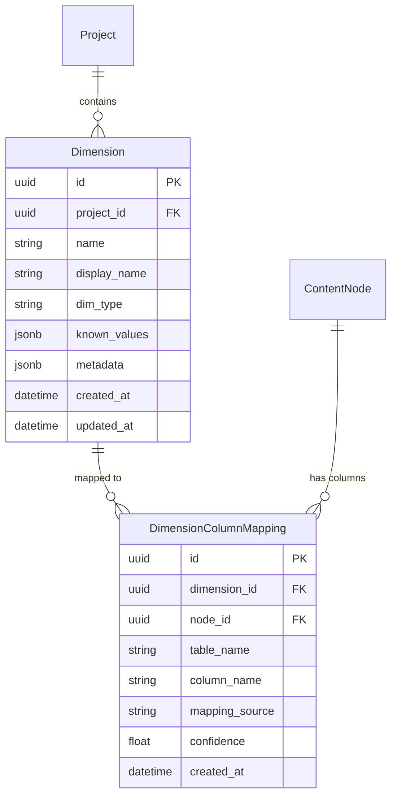

### 1.3 Dimension (измерение)

| Поле           | Тип      | Описание                                                    |
| -------------- | -------- | ----------------------------------------------------------- |
| `id`           | UUID     | Первичный ключ                                              |
| `project_id`   | UUID FK  | Проект                                                      |
| `name`         | string   | Системное имя (slug): `region`, `date`, `product_category`  |
| `display_name` | string   | Отображаемое имя: «Регион», «Дата», «Категория товара»      |
| `dim_type`     | enum     | Тип: `string`, `number`, `date`, `boolean`                  |
| `known_values` | JSONB    | Известные значения (опционально, для autocomplete/chiplist) |
| `metadata`     | JSONB    | Дополнительная информация                                   |
| `created_at`   | DateTime | Дата создания                                               |
| `updated_at`   | DateTime | Дата обновления                                             |

**`dim_type` enum**:
- `string` — текстовые значения, операторы: `==`, `!=`, `in`, `not_in`, `contains`, `starts_with`
- `number` — числовые значения, операторы: `==`, `!=`, `>`, `<`, `>=`, `<=`, `between`
- `date` — даты, операторы: `==`, `!=`, `>`, `<`, `>=`, `<=`, `between`
- `boolean` — логические, операторы: `==`, `!=`

**`known_values` пример**:
```json
{
  "values": ["North", "South", "East", "West"],
  "auto_detected": true,
  "last_scan": "2026-02-27T10:00:00Z"
}
```

### 1.4 DimensionColumnMapping (маппинг столбца → измерение)

| Поле             | Тип      | Описание                                            |
| ---------------- | -------- | --------------------------------------------------- |
| `id`             | UUID     | PK                                                  |
| `dimension_id`   | UUID FK  | Какое измерение                                     |
| `node_id`        | UUID FK  | В каком SourceNode/ContentNode                      |
| `table_name`     | string   | Имя таблицы внутри `content.tables[]`               |
| `column_name`    | string   | Имя столбца в таблице                               |
| `mapping_source` | enum     | `manual` / `ai_suggested` / `auto_detected`         |
| `confidence`     | float    | Уверенность AI-маппинга (0.0–1.0), для manual = 1.0 |
| `created_at`     | DateTime | Когда создан маппинг                                |

### 1.5 Автоматическое определение измерений

При создании SourceNode / выполнении трансформации система может автоматически:

1. **Сканировать столбцы** — имена, типы, уникальность значений
2. **Сопоставлять с существующими измерениями** — fuzzy-match имён столбцов к существующим `Dimension.name` (например, `sales_region` → `region`)
3. **Предлагать новые измерения** — если столбец с категориальными данными не сопоставлен ни с одним измерением
4. **Подтверждение** — AI-маппинги показываются пользователю как suggestions (жёлтый badge)

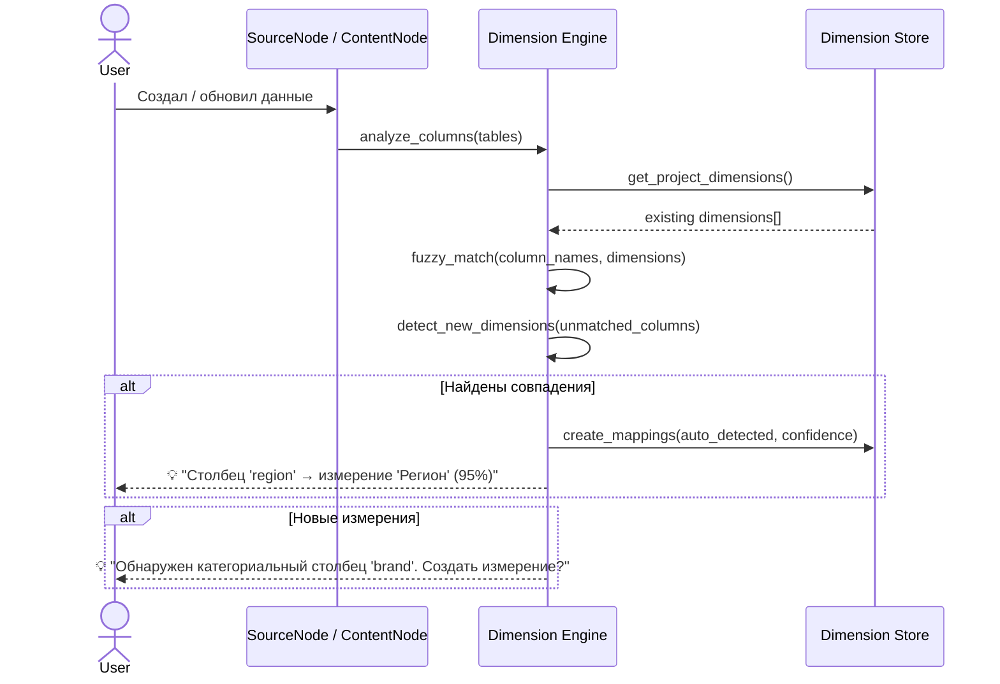

### 1.6 UI управления измерениями

Измерения доступны в **проектном дереве** (новая секция) и в **инспекторе ноды**:

**Проектное дерево — секция «Измерения»**:
```
📐 Измерения
├── 🌍 Регион (string) — 4 значения, 3 таблицы
├── 📅 Дата (date) — 2 таблицы
├── 📦 Категория (string) — 12 значений, 2 таблицы
├── 💰 Сумма (number) — 3 таблицы
└── ➕ Создать измерение...
```

**Инспектор ноды — вкладка «Измерения»**:
Показывает все столбцы таблиц ноды и их маппинги на измерения. Можно привязывать/отвязывать вручную.

---

## 2. Структура фильтров

### 2.1 Условие фильтрации (FilterCondition)

Элементарное условие:
```json
{
  "dim": "region",
  "op": "==",
  "value": "North"
}
```

### 2.2 Поддерживаемые операторы

| Оператор      | Применимость | Описание           | Пример                                                       |
| ------------- | ------------ | ------------------ | ------------------------------------------------------------ |
| `==`          | all          | Равно              | `{"dim": "region", "op": "==", "value": "North"}`            |
| `!=`          | all          | Не равно           | `{"dim": "status", "op": "!=", "value": "cancelled"}`        |
| `>`           | number, date | Больше             | `{"dim": "amount", "op": ">", "value": 10000}`               |
| `<`           | number, date | Меньше             | `{"dim": "amount", "op": "<", "value": 100}`                 |
| `>=`          | number, date | Больше или равно   | `{"dim": "date", "op": ">=", "value": "2024-01-01"}`         |
| `<=`          | number, date | Меньше или равно   | `{"dim": "date", "op": "<=", "value": "2024-12-31"}`         |
| `in`          | string       | Одно из            | `{"dim": "region", "op": "in", "value": ["North", "South"]}` |
| `not_in`      | string       | Не одно из         | `{"dim": "status", "op": "not_in", "value": ["draft"]}`      |
| `between`     | number, date | Диапазон           | `{"dim": "amount", "op": "between", "value": [100, 500]}`    |
| `contains`    | string       | Содержит подстроку | `{"dim": "name", "op": "contains", "value": "Apple"}`        |
| `starts_with` | string       | Начинается с       | `{"dim": "code", "op": "starts_with", "value": "RU-"}`       |

### 2.3 Составные выражения (AND / OR)

Фильтры комбинируются деревом логических выражений:

```json
{
  "type": "and",
  "conditions": [
    { "dim": "region", "op": "==", "value": "North" },
    {
      "type": "or",
      "conditions": [
        { "dim": "amount", "op": ">", "value": 10000 },
        { "dim": "status", "op": "==", "value": "premium" }
      ]
    }
  ]
}
```

**TypeScript-типы**:

```typescript
/** Элементарное условие фильтрации */
interface FilterCondition {
  dim: string          // имя измерения (Dimension.name)
  op: FilterOperator   // оператор сравнения
  value: FilterValue   // значение / массив значений
}

type FilterOperator = 
  | '==' | '!=' 
  | '>' | '<' | '>=' | '<='
  | 'in' | 'not_in' 
  | 'between' 
  | 'contains' | 'starts_with'

type FilterValue = string | number | boolean | string[] | number[] | [number, number]

/** Составное выражение */
interface FilterGroup {
  type: 'and' | 'or'
  conditions: Array<FilterCondition | FilterGroup>
}

/** Корень фильтрующего выражения */
type FilterExpression = FilterCondition | FilterGroup
```

**Python (Pydantic)**:

```python
from pydantic import BaseModel
from typing import Literal, Union
from enum import Enum

class FilterOperator(str, Enum):
    EQ = "=="
    NE = "!="
    GT = ">"
    LT = "<"
    GTE = ">="
    LTE = "<="
    IN = "in"
    NOT_IN = "not_in"
    BETWEEN = "between"
    CONTAINS = "contains"
    STARTS_WITH = "starts_with"

class FilterCondition(BaseModel):
    dim: str
    op: FilterOperator
    value: Union[str, int, float, bool, list[str], list[int], list[float]]

class FilterGroup(BaseModel):
    type: Literal["and", "or"]
    conditions: list[Union[FilterCondition, "FilterGroup"]]

FilterExpression = Union[FilterCondition, FilterGroup]
```

### 2.4 Примеры

**Клик на столбец "North" гистограммы**:
```json
{ "dim": "region", "op": "==", "value": "North" }
```

**Затем клик на строку таблицы с amount=45000**:
```json
{
  "type": "and",
  "conditions": [
    { "dim": "region", "op": "==", "value": "North" },
    { "dim": "amount", "op": "==", "value": 45000 }
  ]
}
```

**Сложный фильтр (ручной построитель)**:
```json
{
  "type": "and",
  "conditions": [
    { "dim": "date", "op": "between", "value": ["2024-01-01", "2024-06-30"] },
    {
      "type": "or",
      "conditions": [
        { "dim": "region", "op": "in", "value": ["North", "East"] },
        { "dim": "amount", "op": ">", "value": 50000 }
      ]
    }
  ]
}
```

---

## 3. Движок фильтрации (Filter Engine)

### 3.1 Архитектура

Движок фильтрации — это **серверный пост-процессор**, который стоит между хранилищем данных (ContentNode.content.tables) и отдачей данных потребителю. Данные в ContentNode **не модифицируются** — фильтрация применяется на лету.

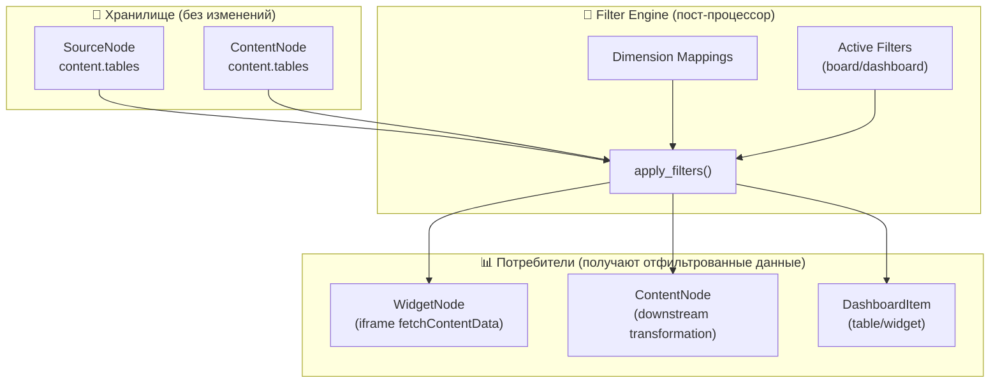

### 3.2 Точка интеграции: API отдачи данных

Фильтрация встраивается в существующие API-эндпоинты получения данных. Все потребители данных проходят через общий путь, куда добавляется слой фильтрации:

| Потребитель                 | Текущий API                                             | С фильтрами                                              |
| --------------------------- | ------------------------------------------------------- | -------------------------------------------------------- |
| WidgetNode (iframe)         | `GET /api/v1/content-nodes/{id}` → `fetchContentData()` | `GET /api/v1/content-nodes/{id}?filters=<encoded>`       |
| DashboardItem (widget)      | `GET /api/v1/content-nodes/{id}`                        | `GET /api/v1/content-nodes/{id}?filters=<encoded>`       |
| DashboardItem (table)       | `GET /api/v1/library/tables/{id}/data`                  | `GET /api/v1/library/tables/{id}/data?filters=<encoded>` |
| Transformation (downstream) | Internal: `get_content_node_tables()`                   | Internal: `get_filtered_tables(node_id, filters)`        |

**Изменения в iframe API** (`widgetApiScript.ts`):

```javascript
// Текущий API (без фильтров)
window.fetchContentData()  // → GET /api/v1/content-nodes/{id}

// Новый API (с фильтрами)
window.fetchContentData()  // → GET /api/v1/content-nodes/{id}?filters=<active_filters>
window.ACTIVE_FILTERS      // текущие активные фильтры (для отображения в виджете)

// Виджет получает уже отфильтрованные данные — код виджета не меняется!
```

### 3.3 Алгоритм применения фильтров

```python
def apply_filters(
    tables: list[dict],           # content.tables из ContentNode
    filters: FilterExpression,     # активные фильтры
    mappings: list[DimensionColumnMapping]  # маппинги для данного node
) -> list[dict]:
    """
    Применяет фильтры к таблицам ContentNode.
    Возвращает отфильтрованные таблицы (оригиналы не модифицируются).
    """
    result = []
    for table in tables:
        # 1. Определить какие измерения затрагивают эту таблицу
        table_mappings = {
            m.dimension.name: m.column_name
            for m in mappings 
            if m.table_name == table["name"]
        }
        
        # 2. Если таблица не содержит столбцов, связанных с 
        #    измерениями из фильтра — вернуть как есть
        filter_dims = extract_dimensions(filters)
        relevant_dims = filter_dims & set(table_mappings.keys())
        
        if not relevant_dims:
            result.append(table)  # фильтр не затрагивает эту таблицу
            continue
        
        # 3. Конвертировать таблицу в DataFrame
        df = table_dict_to_dataframe(table)
        
        # 4. Применить фильтры (рекурсивно для AND/OR)
        mask = evaluate_filter_expression(df, filters, table_mappings)
        
        # 5. Отфильтровать и вернуть
        filtered_df = df[mask]
        result.append(dataframe_to_table_dict(
            filtered_df, 
            table_name=table["name"]
        ))
    
    return result


def evaluate_filter_expression(
    df: pd.DataFrame,
    expr: FilterExpression,
    column_map: dict[str, str]  # dim_name → column_name
) -> pd.Series:
    """Рекурсивно вычисляет маску фильтрации."""
    
    if isinstance(expr, FilterCondition):
        col = column_map.get(expr.dim)
        if col is None or col not in df.columns:
            return pd.Series(True, index=df.index)  # измерение не в этой таблице
        
        series = df[col]
        match expr.op:
            case "==":  return series == expr.value
            case "!=":  return series != expr.value
            case ">":   return series > expr.value
            case "<":   return series < expr.value
            case ">=":  return series >= expr.value
            case "<=":  return series <= expr.value
            case "in":  return series.isin(expr.value)
            case "not_in": return ~series.isin(expr.value)
            case "between": return series.between(expr.value[0], expr.value[1])
            case "contains": return series.str.contains(expr.value, na=False)
            case "starts_with": return series.str.startswith(expr.value, na=False)
    
    elif isinstance(expr, FilterGroup):
        masks = [evaluate_filter_expression(df, c, column_map) for c in expr.conditions]
        if expr.type == "and":
            return reduce(lambda a, b: a & b, masks)
        else:  # "or"
            return reduce(lambda a, b: a | b, masks)
    
    return pd.Series(True, index=df.index)
```

### 3.4 Каскадная фильтрация в pipeline

**Реализованный подход** (вместо row-level filter на отдаче данных): при изменении активных фильтров система **полностью перевыполняет pipeline** от SourceNode через все ContentNode с применением фильтра к исходным данным. Результат кэшируется в `filteredNodeData` (Zustand) и передаётся в виджеты как `precomputedTables`.

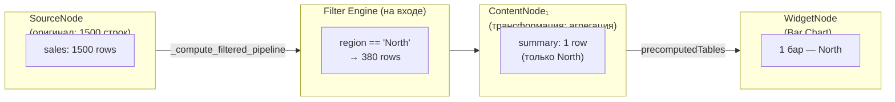

**`_compute_filtered_pipeline` (backend, `routes/filters.py`)**:
- Принимает `board_id` + `FilterExpression`
- Применяет фильтр к исходным данным SourceNode через `FilterEngine.apply_filters()`
- Перевыполняет все трансформации цепочки на отфильтрованных данных
- Возвращает `{ nodes: { [contentNodeId]: { tables: [...] } } }`

**`computeFiltered` (frontend, `filterStore.ts`)**:
- Вызывается при каждом изменении `activeFilters` (через `addCondition`, `removeCondition`, `setFilters`)
- Для доски: `POST /api/v1/boards/{id}/filters/compute-filtered`
- Для дашборда: `POST /api/v1/dashboards/{id}/filters/compute-filtered`
- Результат → `filteredNodeData` в Zustand

**Передача в виджеты (`precomputedTables`)**:
- `WidgetNodeCard` и `DashboardItemRenderer` подписаны на `filteredNodeData`
- При изменении `filteredNodeData` → `refreshKey` инкрементируется → iframe пересоздаётся
- `buildWidgetApiScript` получает `precomputedTables` → `fetchContentData()` возвращает их без HTTP-запроса
- Если `filteredNodeData` не заполнен (нет активных фильтров) — `fetchContentData()` делает обычный `GET /api/v1/content-nodes/{id}`

### 3.5 Multi-Agent и AI Assistant (оркестратор)

Тулы **`readTableData`** и **`readTableListFromContentNodes`** при включённом `MULTI_AGENT_TOOLS_USE_FILTERED_PIPELINE` используют тот же бэкендный пересчёт **`_compute_filtered_pipeline`** (`app/routes/filters.py`), что и UI после применения эффективного фильтра (активные фильтры board/dashboard из `FilterStateService` и при необходимости выражение из чата `_orchestrator_applied_filter_expression`). Результат лениво кэшируется в `pipeline_context["_raw_filtered_pipeline_result"]` (`Orchestrator._ensure_filtered_pipeline_raw_cache`, `_resolve_effective_filter_for_tools`). При известном `board_id` в контексте запроса пересчёт выполняется и при **отсутствии** активного фильтра (`filters=None`), чтобы цепочка upstream→downstream не заменялась чтением сырого `ContentNode.content` из БД без исполнения пайплайна.

Если в снимке у таблицы задан `row_count`, но массив `rows` пуст, оркестратор догружает строки через повторный вызов **`_compute_filtered_pipeline`** (`_compute_filtered_pipeline_tables_for_node`, `_merge_filtered_pipeline_into_raw_cache`); при недоступности пересчёта — оставлен контролируемый fallback на `ContentNode.content` (`_hydrate_table_rows_from_content_db`). Подробности и env — см. **`docs/MULTI_AGENT.md`** (разделы «Кросс-фильтр и тулы», «Вызов `readTableData`»).

---

## 4. Состояние фильтров (Filter State)

### 4.1 Модели хранения

Фильтры существуют на двух уровнях: **Board** и **Dashboard**.

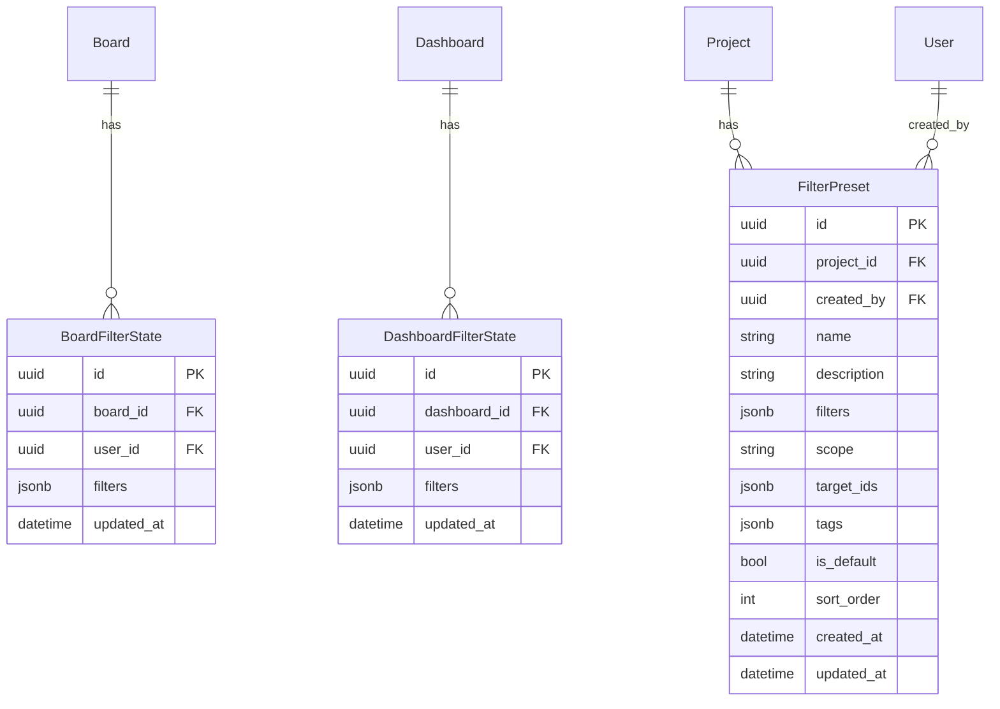

### 4.2 BoardFilterState / DashboardFilterState

**Активное состояние фильтров** — per-user, per-board/dashboard. Каждый пользователь имеет свой набор активных фильтров на каждой доске/дашборде.

| Поле                        | Тип      | Описание                                             |
| --------------------------- | -------- | ---------------------------------------------------- |
| `id`                        | UUID     | PK                                                   |
| `board_id` / `dashboard_id` | UUID FK  | Доска или дашборд                                    |
| `user_id`                   | UUID FK  | Пользователь (персональное состояние)                |
| `filters`                   | JSONB    | Текущее `FilterExpression` или `null` (нет фильтров) |
| `updated_at`                | DateTime | Последнее обновление                                 |

**Пример `filters` JSONB**:
```json
{
  "type": "and",
  "conditions": [
    { "dim": "region", "op": "==", "value": "North" },
    { "dim": "amount", "op": ">", "value": 10000 }
  ]
}
```

### 4.3 FilterPreset (сохранённый набор фильтров)

Именованный набор фильтров, сохранённый для повторного применения.

| Поле          | Тип      | Описание                                                   |
| ------------- | -------- | ---------------------------------------------------------- |
| `id`          | UUID     | PK                                                         |
| `project_id`  | UUID FK  | Проект                                                     |
| `created_by`  | UUID FK  | Автор                                                      |
| `name`        | string   | Название: «Север, крупные сделки»                          |
| `description` | string   | Описание набора                                            |
| `filters`     | JSONB    | `FilterExpression`                                         |
| `scope`       | enum     | `board` / `dashboard` / `universal` — область применения   |
| `target_ids`  | JSONB    | Опционально: привязка к конкретным board_id / dashboard_id |
| `tags`        | JSONB    | Теги для группировки: `["region", "finance"]`              |
| `is_default`  | bool     | Применять автоматически при открытии (для scope=dashboard) |
| `sort_order`  | int      | Порядок в списке пресетов                                  |
| `created_at`  | DateTime | Когда создан                                               |
| `updated_at`  | DateTime | Последнее обновление                                       |

**Сценарий ЛПР**: Аналитик создаёт пресеты «Q1 2024», «Q2 2024», «Только Север», «Крупные сделки > 50k». ЛПР открывает дашборд и переключает пресеты одним кликом, наблюдая изменение виджетов.

---

## 5. API

**Права доступа:** мутации измерений, маппингов, пресетов и изменение сохранённых фильтров на доске/дашборде выполняются только при **праве на изменение** проекта (не **viewer**). Чтение измерений, списка пресетов и данных с учётом фильтров — в рамках доступа к проекту/доске для просмотра. Подробнее: [`PROJECT_ACCESS.md`](./PROJECT_ACCESS.md).

### 5.1 Dimensions API

```
# CRUD измерений
GET    /api/v1/projects/{project_id}/dimensions
POST   /api/v1/projects/{project_id}/dimensions
GET    /api/v1/projects/{project_id}/dimensions/{dim_id}
PUT    /api/v1/projects/{project_id}/dimensions/{dim_id}
DELETE /api/v1/projects/{project_id}/dimensions/{dim_id}

# Маппинги столбцов
GET    /api/v1/projects/{project_id}/dimensions/{dim_id}/mappings
POST   /api/v1/projects/{project_id}/dimensions/{dim_id}/mappings
DELETE /api/v1/projects/{project_id}/dimensions/mappings/{mapping_id}

# Маппинги конкретной ноды
GET    /api/v1/content-nodes/{node_id}/dimension-mappings

# AI auto-detect измерений для ноды
POST   /api/v1/content-nodes/{node_id}/detect-dimensions

# Значения измерения (для autocomplete в фильтр-UI)
GET    /api/v1/projects/{project_id}/dimensions/{dim_id}/values
```

### 5.2 Filters API (Board)

```
# Активные фильтры доски (per-user)
GET    /api/v1/boards/{board_id}/filters
PUT    /api/v1/boards/{board_id}/filters
DELETE /api/v1/boards/{board_id}/filters

# Добавить условие в фильтр (инкрементально)
POST   /api/v1/boards/{board_id}/filters/add-condition
Body: { "dim": "region", "op": "==", "value": "North" }

# Удалить условие из фильтра
POST   /api/v1/boards/{board_id}/filters/remove-condition
Body: { "dim": "region" }  // удалить все условия по измерению

# Очистить все фильтры
POST   /api/v1/boards/{board_id}/filters/clear
```

### 5.3 Filters API (Dashboard)

```
# Аналогично Board
GET    /api/v1/dashboards/{dashboard_id}/filters
PUT    /api/v1/dashboards/{dashboard_id}/filters
DELETE /api/v1/dashboards/{dashboard_id}/filters
POST   /api/v1/dashboards/{dashboard_id}/filters/add-condition
POST   /api/v1/dashboards/{dashboard_id}/filters/remove-condition
POST   /api/v1/dashboards/{dashboard_id}/filters/clear
```

### 5.4 Filter Presets API

```
# CRUD пресетов
GET    /api/v1/projects/{project_id}/filter-presets
POST   /api/v1/projects/{project_id}/filter-presets
GET    /api/v1/projects/{project_id}/filter-presets/{preset_id}
PUT    /api/v1/projects/{project_id}/filter-presets/{preset_id}
DELETE /api/v1/projects/{project_id}/filter-presets/{preset_id}

# Применить пресет к доске/дашборду
POST   /api/v1/boards/{board_id}/filters/apply-preset/{preset_id}
POST   /api/v1/dashboards/{dashboard_id}/filters/apply-preset/{preset_id}

# Сохранить текущие фильтры как пресет
POST   /api/v1/boards/{board_id}/filters/save-as-preset
Body: { "name": "North big deals", "description": "...", "tags": ["region"] }
```

### 5.5 Изменения в существующих API (получение данных с фильтрами)

```
# ContentNode данные с фильтрами
GET /api/v1/content-nodes/{id}?filters=<url-encoded FilterExpression JSON>

# Или через POST (для больших выражений)
POST /api/v1/content-nodes/{id}/filtered-data
Body: { "filters": <FilterExpression> }

# Данные таблицы из библиотеки с фильтрами
GET /api/v1/library/tables/{id}/data?filters=<url-encoded>
```

### 5.6 Socket.IO события

```
# Сервер → Клиент: фильтры изменились (для всех пользователей на доске/дашборде)
Event: "filters:changed"
Data: {
  "board_id": "uuid" | null,
  "dashboard_id": "uuid" | null,
  "user_id": "uuid",        // кто изменил
  "filters": <FilterExpression>,
  "source": "click" | "manual" | "preset"  // источник изменения
}

# Клиент → Сервер: пользователь изменил фильтры
Event: "filters:update"
Data: {
  "board_id": "uuid",
  "filters": <FilterExpression>
}
```

---

## 6. Взаимодействие виджетов с фильтрами (Click-to-Filter)

### 6.1 Механизм: клик → postMessage → filterStore → pipeline re-computation

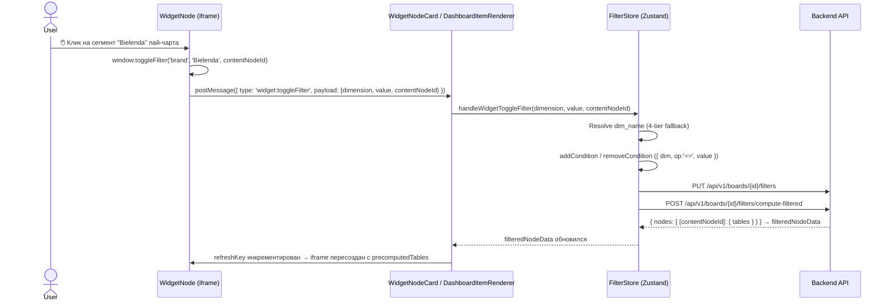

**Ключевое правило**: `event.source` check в обработчике гарантирует, что каждый `WidgetNodeCard` / `DashboardItemRenderer` обрабатывает только сообщения от **своего** `iframe`, предотвращая двойной вызов `toggleFilter` при наличии нескольких виджетов на доске.

### 6.2 Widget API — полный список функций (widgetApiScript.ts)

Все функции доступны через `window.*` внутри iframe:

```javascript
// === Данные ===
window.fetchContentData()
// Возвращает данные ContentNode.
// Приоритет: precomputedTables (если filteredNodeData передан) → GET /api/v1/content-nodes/{id}?filters=...
// Виджет всегда получает уже отфильтрованные данные — фильтровать вручную НЕ нужно.

// === Фильтры — установка ===
window.toggleFilter(dimensionColumnName, value, contentNodeId?)
// Toggle фильтра: добавляет если нет, удаляет если уже установлен.
// РЕКОМЕНДУЕМЫЙ метод для click-to-filter.
// dimensionColumnName — точное имя столбца из данных (например, 'brand', 'region')

window.addFilter(dimensionColumnName, value, contentNodeId?)
// Добавить условие (без toggle — всегда добавляет)

window.removeFilter(dimensionColumnName)
// Удалить фильтр по измерению

// === Фильтры — состояние ===
window.getActiveFilters()
// Возвращает FilterExpression | null. Только для отображения — не фильтровать данные вручную!

window.isFilterActive(dimensionColumnName, value)
// Проверить, активен ли фильтр по конкретному значению. Используется для визуального выделения.
// Возвращает boolean

// === Автообновление ===
window.startAutoRefresh(renderCallback, intervalMs?)
// Запустить автообновление виджета (вызывает renderCallback)

window.stopAutoRefresh(timerId)
// Остановить автообновление

// === Resize ===
window.__widgetResize = () => { /* вызывается при изменении размера iframe */ }
```

### 6.3 Обязательный паттерн click-to-filter для ECharts

Каждый виджет, генерируемый `WidgetCodexAgent`, **обязан** содержать click-handler:

```javascript
// Пример для pie chart / bar chart
const dimCol = 'brand'  // ← точное имя столбца из данных

// 1. Визуальное выделение активного значения
const option = {
  series: [{
    data: tbl.rows.map(r => {
      const isActive = window.isFilterActive && window.isFilterActive(dimCol, r[dimCol])
      return {
        name: r[dimCol],
        value: Number(r['sales_count']),
        itemStyle: isActive
          ? { borderWidth: 3, borderColor: '#6366f1', shadowBlur: 10 }
          : {}
      }
    })
  }]
}

window.chartInstance.setOption(option)

// 2. Click handler — ТОЛЬКО через chartInstance.on('click', ...)
window.chartInstance.on('click', function(params) {
  if (window.toggleFilter) window.toggleFilter(dimCol, params.name)
  // После toggleFilter → filterStore обновится → iframe пересоздастся
  // render() будет вызван заново с новыми данными
})
```

**Категорические запреты** (частые ошибки WidgetCodex):
- ❌ `onclick` / `onClick` в `series[].data[]` — ECharts не поддерживает
- ❌ `window.getActiveFilters()` для ручной фильтрации `fetchContentData()` результата — данные уже отфильтрованы
- ❌ Ручные `.filter()` вызовы над данными из `fetchContentData()`
- ✅ ТОЛЬКО `window.chartInstance.on('click', ...)` для обработки кликов ECharts

### 6.4 postMessage протокол (widget → parent)

| Тип сообщения         | Payload                                         | Действие в filterStore             |
| --------------------- | ----------------------------------------------- | ---------------------------------- |
| `widget:toggleFilter` | `{ dimension, value, contentNodeId }`           | `handleWidgetToggleFilter()`       |
| `widget:addFilter`    | `{ dimension, value, contentNodeId }`           | `handleWidgetClick()` (add-only)   |
| `widget:click`        | `{ field, value, contentNodeId }`               | `handleWidgetClick()` (add-only)   |
| `widget:removeFilter` | `{ dimension }`                                 | `handleWidgetRemoveFilter()`       |

### 6.5 Разрешение dim_name (4-tier fallback в filterStore)

`handleWidgetToggleFilter` резолвит имя измерения из имени столбца в 4 шага:

1. `resolveFieldToDimension(field, nodeId)` — точный поиск по `nodeMappings[nodeId]`
2. Поиск во всех `nodeMappings` (независимо от nodeId)
3. Поиск среди `dimensions` по `dimension.name === field`
4. Fallback: использовать `field` как `dim_name` напрямую

После первого клика: lazy-load `loadMappingsForNode(nodeId)` — маппинги подгружаются для следующих вызовов.

---

## 7. UI: Визуализация фильтров

### 7.1 Рекомендуемый подход: Filter Bar + Filter Panel

Комбинация двух элементов обеспечивает баланс между компактностью и мощностью:

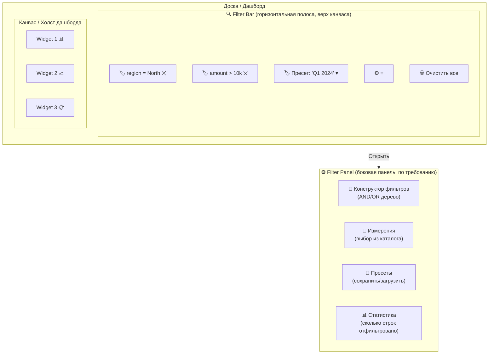

### 7.2 Filter Bar (всегда видимый)

**Расположение**: горизонтальная полоса между toolbar и канвасом (на доске — под React Flow toolbar, на дашборде — под dashboard toolbar).

**Содержимое**:
- 🔍 Иконка фильтра + индикатор количества активных фильтров
- **Чипы (Filter Chips)** — каждое активное условие отображается как chip:
  - Текст: `region = North`, `amount > 10k`, `date: Q1 2024`
  - ✕ для удаления
  - Клик на chip → редактирование (inline dropdown)
- **Пресет-селектор** — dropdown для быстрого переключения между пресетами
- **Кнопка ⚙** — открыть полный Filter Panel
- **Кнопка «Очистить»** — сбросить все фильтры

**Поведение**:
- Filter Bar **скрыт** когда нет активных фильтров (но можно раскрыть кнопкой «Добавить фильтр»)
- **Анимированное появление** при первом добавлении фильтра (клик по виджету)
- **Цветовая индикация**: chip окрашен в цвет измерения (опционально)

### 7.3 Filter Chips — дизайн

```
┌─────────────────────────────────────────────────────────────────┐
│ 🔍 3 фильтра │ [🌍 region = North ✕] [💰 amount > 10k ✕]     │
│               │ [📅 date: 2024-01..06 ✕]    [Пресеты ▾] [⚙] [🗑]│
└─────────────────────────────────────────────────────────────────┘
```

**Chip anatomy**:
```
┌──────────────────────┐
│ 🏷 region = North  ✕ │
│ [icon] [dim] [op] [v]│
└──────────────────────┘
```

- `icon` — маленькая иконка типа измерения (🌍, 💰, 📅, ✔)
- `dim` — display_name измерения
- `op` + `v` — условие
- `✕` — удалить фильтр
- **Hover** → показать полную информацию (tooltip)
- **Click** на chip → inline-редактирование (изменить оператор или значение)

### 7.4 Filter Panel (расширенный конструктор)

Открывается по кнопке ⚙ из Filter Bar. Выезжает как **правая боковая панель** (аналогично Inspector на дашборде).

**Секции панели**:

#### A. Конструктор выражений (Filter Builder)

Визуальное дерево AND/OR с возможностью перетаскивания:

```
AND
├── 🌍 region    =    [North       ▾]    [✕]
├── 💰 amount    >    [10000       ]     [✕]
└── OR
    ├── 📦 category =  [Electronics ▾]   [✕]
    └── 📦 category =  [Clothing    ▾]   [✕]
    [+ Добавить условие в OR]
[+ Добавить условие]  [+ Добавить группу AND/OR]
```

**Dropdown измерения**: при добавлении нового условия — выбор из каталога измерений проекта. Автоматически подставляет доступные операторы по `dim_type`.

**Значение**: для `string` — dropdown с known_values / autocomplete. Для `number` — input. Для `date` — date picker. Для `boolean` — toggle.

#### B. Секция пресетов

```
💾 Пресеты
├── ⭐ Q1 2024 (default)        [Применить] [✏] [🗑]
├── Только Север                [Применить] [✏] [🗑]
├── Крупные сделки > 50k        [Применить] [✏] [🗑]
└── [+ Сохранить текущие фильтры как пресет]
```

- **⭐ default** — пресет с `is_default=true` применяется автоматически при открытии дашборда
- **Применить** — заменяет текущие фильтры на фильтры пресета
- **✏** — переименовать/редактировать
- **🗑** — удалить

#### C. Статистика

```
📊 Статистика фильтрации
├── Sales table:     380 / 1500 строк (25%)
├── Customers table: 42 / 200 строк (21%)
└── Orders table:    1200 / 5000 строк (24%)
```

Отображает, сколько строк осталось после фильтрации в каждой таблице, затронутой активными фильтрами.

### 7.5 Макет на доске (Board)

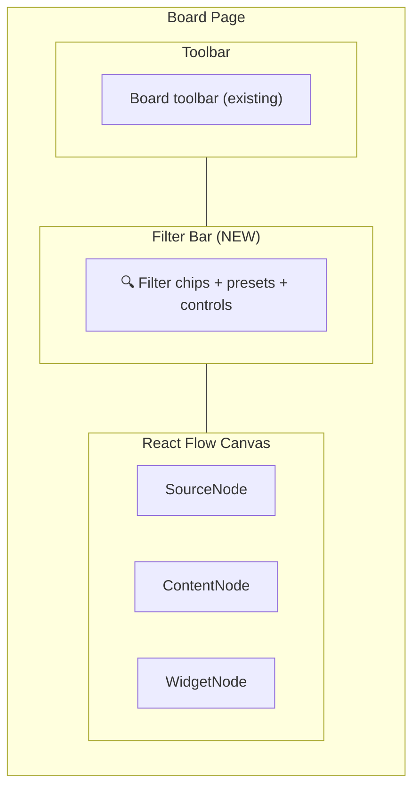

### 7.6 Макет на дашборде (Dashboard)

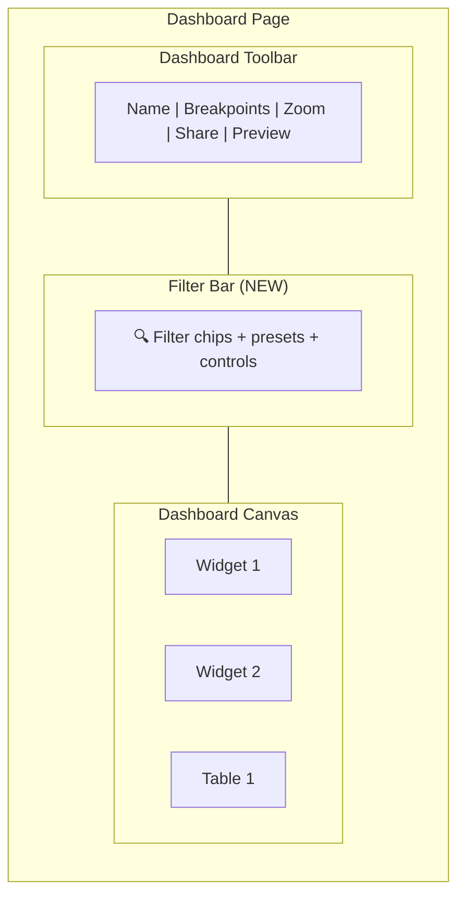

### 7.7 Пресет-селектор (Quick Switch для ЛПР)

Специальный компактный UI для быстрого переключения пресетов без открытия полной панели:

```
┌───────────────────────────────────┐
│  📋 Пресеты:                      │
│  ┌──────┐ ┌──────┐ ┌──────────┐  │
│  │ Q1   │ │ Q2   │ │ Все      │  │
│  │ 2024 │ │ 2024 │ │ регионы  │  │
│  │  ✓   │ │      │ │          │  │
│  └──────┘ └──────┘ └──────────┘  │
│  ┌──────────┐ ┌──────────────┐   │
│  │ Крупные  │ │ Без возврат. │   │
│  │ > 50k    │ │              │   │
│  └──────────┘ └──────────────┘   │
└───────────────────────────────────┘
```

Отображается как **карусель карточек** или **список кнопок** в Filter Bar. Активный пресет подсвечен. Клик меняет активный пресет → мгновенное обновление всех виджетов.

---

## 8. Frontend State Management (Zustand)

### 8.1 FilterStore (текущая реализация)

```typescript
interface FilterState {
  // === Активные фильтры ===
  activeFilters: FilterExpression | null
  activePresetId: string | null

  // === Пересчитанные данные pipeline ===
  filteredNodeData: Record<string, { tables: TableData[] }> | null
  // Заполняется после computeFiltered() — ключи: contentNodeId → таблицы

  // === Измерения проекта ===
  dimensions: Dimension[]
  nodeMappings: Record<string, DimensionColumnMapping[]>  // nodeId → mappings
  isLoadingDimensions: boolean

  // === Контекст (доска или дашборд) ===
  context: { type: 'board'; id: string } | { type: 'dashboard'; id: string } | null

  // === UI состояние ===
  isFilterBarVisible: boolean
  isFilterPanelOpen: boolean
  isComputingFiltered: boolean
  filterStats: FilterStat[]

  // === Actions — фильтры ===
  setFilters: (filters: FilterExpression | null) => void
  addCondition: (condition: FilterCondition) => void
  removeCondition: (dimName: string) => void
  clearFilters: () => void

  // === Actions — click-to-filter ===
  handleWidgetClick: (field: string, value: any, contentNodeId: string) => void
  handleWidgetToggleFilter: (dimension: string, value: any, contentNodeId: string) => void
  handleWidgetRemoveFilter: (dimension: string) => void

  // === Actions — pipeline re-computation ===
  computeFiltered: () => Promise<void>
  // POST /boards/{id}/filters/compute-filtered или /dashboards/{id}/filters/compute-filtered

  // === Actions — измерения ===
  loadDimensions: (projectId: string) => Promise<void>
  loadMappingsForNode: (nodeId: string) => Promise<void>
  resolveFieldToDimension: (field: string, nodeId: string) => Dimension | undefined

  // === Actions — контекст ===
  setContext: (ctx: FilterContext | null) => void

  // === Синхронизация с backend ===
  syncFiltersToBackend: () => Promise<void>
  getFiltersQueryParam: () => string | undefined  // URL-encoded JSON для ?filters=
}
```

**Важно о `filteredNodeData`**:
- Устанавливается при `computeFiltered()` — содержит полностью пересчитанные таблицы
- Сбрасывается в `null` при `clearFilters()`
- `WidgetNodeCard` и `DashboardItemRenderer` читают `filteredNodeData[sourceContentNodeId]?.tables` → передают в `precomputedTables` → виджет не делает HTTP-запрос

### 8.2 Интеграция с существующими store

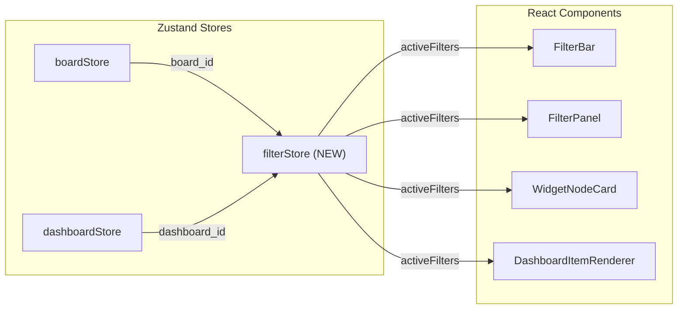

**Ключевой момент**: `WidgetNodeCard` и `DashboardItemRenderer` при построении `buildWidgetApiScript()` передают `precomputedTables` из `filteredNodeData[contentNodeId]?.tables` (если пересчитанные данные есть). Если `precomputedTables` не передан — fallback на `?filters=<encoded>` в URL запроса `fetchContentData()`.

---

## 9. Real-time синхронизация

### 9.1 Потоки событий

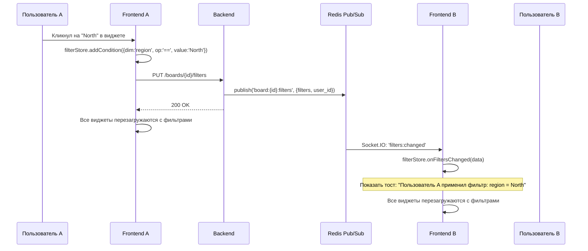

### 9.2 Collaborative vs Personal фильтры

Два режима работы (настраивается в Board/Dashboard settings):

| Режим             | Описание                                                | Использование                  |
| ----------------- | ------------------------------------------------------- | ------------------------------ |
| **Collaborative** | Фильтры общие — изменение одним пользователем видят все | Презентации, совместный анализ |
| **Personal**      | У каждого свои фильтры — изменения не влияют на других  | Параллельная работа аналитиков |

**Настройка**: `Board.settings.filter_mode: 'collaborative' | 'personal'` (по умолчанию `personal`).

---

## 10. Сохранение и применение пресетов

### 10.1 Workflow аналитика

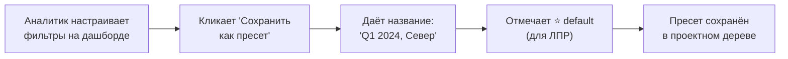

### 10.2 Workflow ЛПР

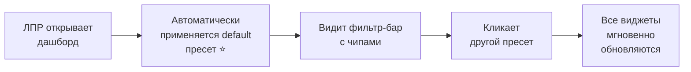

### 10.3 Проектное дерево — секция «Фильтры»

```
🔍 Фильтры
├── ⭐ Q1 2024 (default)
├── Q2 2024
├── Только Север
├── Крупные сделки > 50k
├── Без возвратов
└── ➕ Создать фильтр...
```

### 10.4 Auto-apply при открытии дашборда

Если у дашборда есть пресет с `is_default=true`:
1. При открытии дашборда (Editor или View режим) автоматически загружается пресет
2. Filter Bar показывает чипы default-пресета
3. Все виджеты загружают данные с этими фильтрами
4. Пользователь может сбросить фильтры или переключить пресет

---

## 11. Интеграция с существующими системами

### 11.1 Трансформации (Transform Dialog)

Фильтры **НЕ** влияют на трансформации. Python-код выполняется над полными данными. Это гарантирует детерминированность и воспроизводимость трансформаций.

**Зачем**: Если бы трансформация (например, GROUP BY region) выполнялась над фильтрованными данными (только North), результат был бы неполным. Пользователь увидел бы только 1 строку вместо 4.

### 11.2 Auto-refresh и Replay

При изменении SourceNode (refresh) → вся цепочка трансформаций пересчитывается с полными данными → виджеты перезагружаются с применением текущих фильтров. Pipe: refresh → replay → filter → display.

### 11.3 Drill-Down

Cross-Filter и Drill-Down дополняют друг друга:
- **Cross-Filter**: слайсинг текущих данных (все виджеты, без навигации)
- **Drill-Down**: навигация вглубь (один виджет → дочерний уровень)

При наличии обеих систем: Drill-Down может наследовать активные фильтры. Если пользователь отфильтровал `region=North` и затем делает drill-down по продуктам — drill-down WidgetNode тоже получит данные только по North.

### 11.4 Widget Generation

`WidgetCodexAgent` генерирует виджеты с обязательным click-to-filter. Промпт агента содержит:

- Секцию `🎯 ИНТЕРАКТИВНОСТЬ — ОБЯЗАТЕЛЬНОЕ СВОЙСТВО КАЖДОГО ВИДЖЕТА`
- Чеклист перед генерацией: определить `dimCol`, добавить click handler, добавить `isFilterActive` для визуального выделения
- Строгий запрет на `onclick`/`onClick` в конфиге ECharts — только `chartInstance.on('click', ...)`
- Строгий запрет на ручную фильтрацию данных — `fetchContentData()` уже возвращает отфильтрованные данные

**Автосанаторы кода** (`widget_codex.py`) исправляют типичные ошибки LLM:
- `_strip_markdown_from_code` — убирает `###` markdown-артефакты
- `_fix_echarts_onclick_in_series` — заменяет `onclick` в series-конфиге на `chartInstance.on('click', ...)`
- `_fix_invalid_formatter` — удаляет невалидные `${...}` template literals в ECharts formatter

Правильный паттерн для ECharts: см. [ECHARTS_WIDGET_REFERENCE.md](./ECHARTS_WIDGET_REFERENCE.md) и секцию 6.3 этого документа.

---

## 12. Производительность

### 12.1 Оптимизации

| Аспект                                  | Стратегия                                                              |
| --------------------------------------- | ---------------------------------------------------------------------- |
| Фильтрация больших таблиц (>100k строк) | Backend Pandas фильтрация — быстро для in-memory                       |
| Частые обновления фильтров              | Debounce на frontend (300ms) перед отправкой на backend                |
| Кэширование                             | Redis cache по ключу `(node_id, filter_hash)` → отфильтрованные данные |
| Множество виджетов                      | Parallel fetch с одинаковыми фильтрами → бэкенд дедуплицирует          |
| Пустой фильтр                           | Bypass — вернуть данные как есть, без конвертации в DataFrame          |

### 12.2 Лимиты

| Параметр                         | Лимит     |
| -------------------------------- | --------- |
| Max conditions в одном выражении | 50        |
| Max глубина вложенности AND/OR   | 5         |
| Max known_values для измерения   | 10 000    |
| Debounce период                  | 300ms     |
| Redis cache TTL                  | 60 секунд |

---

## 13. Примеры сценариев

### Сценарий 1: Аналитик исследует данные продаж

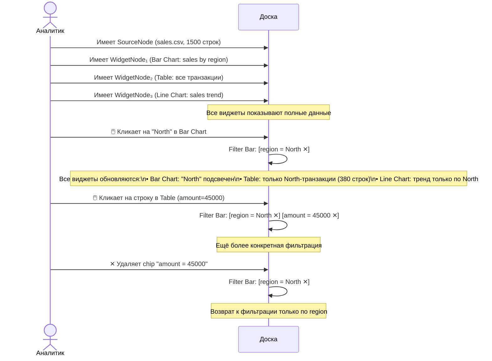

### Сценарий 2: ЛПР просматривает подготовленный дашборд

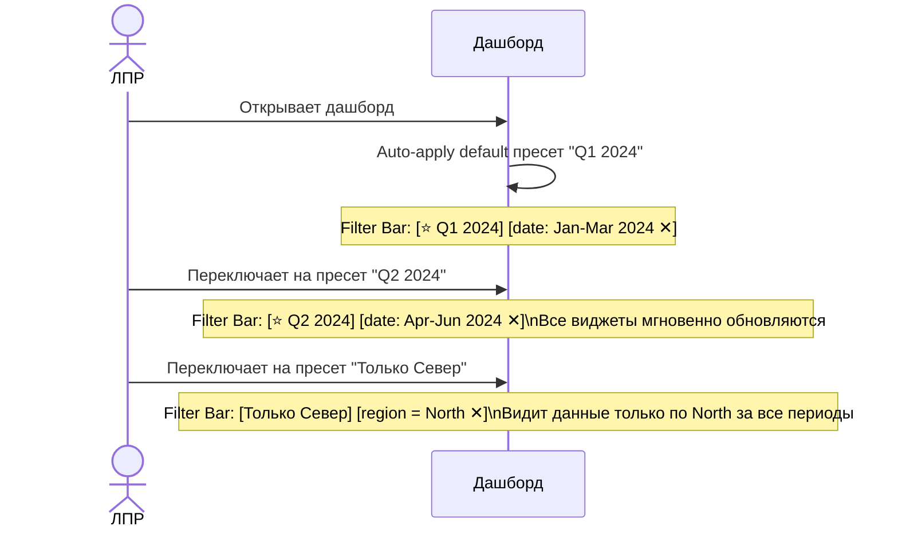

---

## 14. Детальный план реализации

### Phase 1: Backend — Модели и миграции (Dimensions + Filter State)

> **Цель**: создать фундамент хранения — таблицы `dimensions`, `dimension_column_mappings`, `filter_presets` и Pydantic-схемы.

**Шаг 1.1. Pydantic-схемы фильтров**

Создать файл `apps/backend/app/schemas/cross_filter.py`:

```python
# Схемы: FilterOperator, FilterCondition, FilterGroup, FilterExpression
# Схемы: DimensionCreate, DimensionUpdate, DimensionResponse
# Схемы: DimensionColumnMappingCreate, DimensionColumnMappingResponse
# Схемы: FilterPresetCreate, FilterPresetUpdate, FilterPresetResponse
# Схемы: ActiveFiltersUpdate (для PUT /boards/{id}/filters)
```

Схемы нужны первыми, потому что и модели, и маршруты на них ссылаются. `FilterExpression = Union[FilterCondition, FilterGroup]` — рекурсивный тип с `model_rebuild()`.

**Шаг 1.2. SQLAlchemy-модели**

Создать три файла:

| Файл                                                  | Модель                   | Таблица                     | FK                                                   |
| ----------------------------------------------------- | ------------------------ | --------------------------- | ---------------------------------------------------- |
| `apps/backend/app/models/dimension.py`                | `Dimension`              | `dimensions`                | `project_id → projects.id`                           |
| `apps/backend/app/models/dimension_column_mapping.py` | `DimensionColumnMapping` | `dimension_column_mappings` | `dimension_id → dimensions.id`, `node_id → nodes.id` |
| `apps/backend/app/models/filter_preset.py`            | `FilterPreset`           | `filter_presets`            | `project_id → projects.id`, `created_by → users.id`  |

Зарегистрировать в `apps/backend/app/models/__init__.py` — добавить импорты и `__all__`.

**Шаг 1.3. Alembic-миграция**

```bash
uv run alembic revision --autogenerate -m "add_dimensions_and_filter_presets"
uv run alembic upgrade head
```

Проверить сгенерированную миграцию — 3 новых таблицы, индексы на `(project_id)`, `(dimension_id, node_id, table_name)`, уникальность `(dimension_id, node_id, table_name, column_name)`.

**Шаг 1.4. Добавить `settings` JSONB в Board (необязательный, но полезный)**

Сейчас `Board` не имеет `settings` (у Dashboard есть). Добавить `settings = Column(JSONB, nullable=True)` в `apps/backend/app/models/board.py` для хранения `filter_mode: 'personal' | 'collaborative'`. Миграция: `uv run alembic revision --autogenerate -m "add_board_settings"`.

> **Чекпоинт 1**: Таблицы созданы, `uv run alembic upgrade head` успешен, модели импортируются без ошибок. Можно руками вставить строку в `dimensions` через `check_db.py`.

---

### Phase 2: Backend — Filter Engine сервис

> **Цель**: Ядро системы — сервис `FilterEngine`, который принимает таблицы ContentNode + фильтры + маппинги и возвращает отфильтрованные таблицы.

**Шаг 2.1. Создать `apps/backend/app/services/filter_engine.py`**

Ключевые функции:

```python
class FilterEngine:
    @staticmethod
    def apply_filters(
        tables: list[dict],
        filters: FilterExpression,
        mappings: list[DimensionColumnMapping]
    ) -> list[dict]:
        """Применяет фильтры к таблицам. Возвращает копии — оригиналы не трогает."""

    @staticmethod
    def evaluate_expression(
        df: pd.DataFrame,
        expr: FilterExpression,
        column_map: dict[str, str]  # dim_name → column_name
    ) -> pd.Series:
        """Рекурсивно вычисляет булеву маску для FilterCondition / FilterGroup."""

    @staticmethod
    def extract_dimensions(expr: FilterExpression) -> set[str]:
        """Извлекает все имена измерений из выражения."""
```

Используем существующие хелперы из `python_executor.py`:
- `table_dict_to_dataframe()` — конвертация таблицы → DataFrame
- `dataframe_to_table_dict()` — обратная конвертация

**Шаг 2.2. Unit-тесты для FilterEngine**

Создать `tests/test_filter_engine.py`:
- Тест каждого оператора (`==`, `!=`, `>`, `<`, `>=`, `<=`, `in`, `not_in`, `between`, `contains`, `starts_with`)
- Тест AND / OR / вложенные группы
- Тест: таблица без маппинга на измерение → возвращается как есть
- Тест: пустой фильтр → данные без изменений
- Тест: фильтр по несуществующему столбцу → данные без изменений
- Тест: большой DataFrame (10k строк) — проверка производительности

**Шаг 2.3. Создать `apps/backend/app/services/dimension_service.py`**

CRUD-операции для `Dimension` и `DimensionColumnMapping`:
- `create_dimension(project_id, data)` → Dimension
- `list_dimensions(project_id)` → list[Dimension]
- `get_dimension(dim_id)` → Dimension
- `update_dimension(dim_id, data)` → Dimension
- `delete_dimension(dim_id)` — каскадное удаление маппингов
- `create_mapping(dimension_id, node_id, table_name, column_name, source)` → DimensionColumnMapping
- `get_mappings_for_node(node_id)` → list[DimensionColumnMapping]
- `get_mappings_for_dimension(dimension_id)` → list[DimensionColumnMapping]
- `delete_mapping(mapping_id)`

**Шаг 2.4. Создать `apps/backend/app/services/filter_preset_service.py`**

CRUD-операции для `FilterPreset`:
- `create_preset(project_id, user_id, data)` → FilterPreset
- `list_presets(project_id)` → list[FilterPreset]
- `get_preset(preset_id)` → FilterPreset
- `update_preset(preset_id, data)` → FilterPreset
- `delete_preset(preset_id)`
- `get_default_preset(project_id, scope, target_id)` → FilterPreset | None

> **Чекпоинт 2**: `FilterEngine` покрыт тестами, `pytest tests/test_filter_engine.py` проходит. Сервисы Dimension/Preset готовы.

---

### Phase 3: Backend — API-маршруты

> **Цель**: REST-эндпоинты для CRUD измерений, управления фильтрами и получения отфильтрованных данных.

**Шаг 3.1. Создать `apps/backend/app/routes/dimensions.py`**

Новый роутер: `APIRouter(prefix="/api/v1/projects/{project_id}/dimensions", tags=["dimensions"])`

Endpoints:
```
GET    /                              → list_dimensions
POST   /                              → create_dimension
GET    /{dim_id}                      → get_dimension
PUT    /{dim_id}                      → update_dimension
DELETE /{dim_id}                      → delete_dimension
GET    /{dim_id}/mappings             → list_mappings
POST   /{dim_id}/mappings             → create_mapping
DELETE /mappings/{mapping_id}         → delete_mapping
GET    /{dim_id}/values               → get_dimension_values (агрегация уникальных значений из маппированных столбцов)
```

Дополнительный эндпоинт в content_nodes.py:
```
GET    /api/v1/content-nodes/{node_id}/dimension-mappings   → get_mappings_for_node
POST   /api/v1/content-nodes/{node_id}/detect-dimensions    → auto-detect (Phase 5)
```

**Шаг 3.2. Создать `apps/backend/app/routes/filters.py`**

Два роутера (board + dashboard):

```
# Board filters
GET    /api/v1/boards/{board_id}/filters                    → get_active_filters
PUT    /api/v1/boards/{board_id}/filters                    → set_filters (полная замена)
POST   /api/v1/boards/{board_id}/filters/add-condition      → add_condition (инкрементально)
POST   /api/v1/boards/{board_id}/filters/remove-condition   → remove_condition
POST   /api/v1/boards/{board_id}/filters/clear              → clear
POST   /api/v1/boards/{board_id}/filters/apply-preset/{id}  → apply_preset
POST   /api/v1/boards/{board_id}/filters/save-as-preset     → save_as_preset

# Dashboard filters (аналогично)
GET    /api/v1/dashboards/{dashboard_id}/filters            → ...
PUT    /api/v1/dashboards/{dashboard_id}/filters            → ...
... (аналогичный набор)
```

Хранение активных фильтров — в Redis (`board:{board_id}:user:{user_id}:filters` → JSON). Не в PostgreSQL — фильтры эфемерны, меняются часто.

**Шаг 3.3. Модификация `/api/v1/content-nodes/{id}` — поддержка `?filters=`**

В `apps/backend/app/routes/content_nodes.py` модифицировать endpoint `GET /api/v1/content-nodes/{id}`:
- Добавить optional query param: `filters: str | None = Query(None)`
- Если `filters` передан — декодировать JSON, получить маппинги для данной ноды, вызвать `FilterEngine.apply_filters()`
- Вернуть модифицированный `content` с отфильтрованными таблицами

```python
@router.get("/{content_node_id}")
async def get_content_node(
    content_node_id: UUID,
    filters: str | None = Query(None, description="URL-encoded FilterExpression JSON"),
    db: AsyncSession = Depends(get_db),
    current_user: User = Depends(get_current_user),
):
    node = await ContentNodeService.get(db, content_node_id)
    if not node:
        raise HTTPException(404)
    
    result = _serialize_content_node(node)
    
    if filters:
        filter_expr = parse_filter_expression(url_decode(filters))
        mappings = await DimensionService.get_mappings_for_node(db, content_node_id)
        result["content"]["tables"] = FilterEngine.apply_filters(
            result["content"]["tables"], filter_expr, mappings
        )
    
    return result
```

**Шаг 3.4. Регистрация роутеров**

В `apps/backend/app/routes/__init__.py`:
```python
from .dimensions import router as dimensions_router
from .filters import board_filter_router, dashboard_filter_router
```

В `apps/backend/app/main.py` — `app.include_router(dimensions_router)`, `app.include_router(board_filter_router)`, `app.include_router(dashboard_filter_router)`.

**Шаг 3.5. Filter Preset API**

В `apps/backend/app/routes/filters.py` (или отдельный файл):
```
GET    /api/v1/projects/{project_id}/filter-presets      → list_presets
POST   /api/v1/projects/{project_id}/filter-presets      → create_preset
GET    /api/v1/projects/{project_id}/filter-presets/{id}  → get_preset
PUT    /api/v1/projects/{project_id}/filter-presets/{id}  → update_preset
DELETE /api/v1/projects/{project_id}/filter-presets/{id}  → delete_preset
```

> **Чекпоинт 3**: Все API доступны, `http://localhost:8000/docs` показывает новые endpoints. CRUD измерений работает. `GET /content-nodes/{id}?filters=...` отдаёт отфильтрованные данные. Ручная проверка через Swagger / curl.

---

### Phase 4: Frontend — FilterStore + widgetApiScript

> **Цель**: Zustand-стор для фильтров + модификация iframe API для передачи/получения фильтров.

**Шаг 4.1. Создать типы `apps/web/src/types/crossFilter.ts`**

```typescript
export interface FilterCondition { dim: string; op: FilterOperator; value: FilterValue }
export interface FilterGroup { type: 'and' | 'or'; conditions: (FilterCondition | FilterGroup)[] }
export type FilterExpression = FilterCondition | FilterGroup
export type FilterOperator = '==' | '!=' | '>' | '<' | '>=' | '<=' | 'in' | 'not_in' | 'between' | 'contains' | 'starts_with'
export type FilterValue = string | number | boolean | string[] | number[] | [number, number]

export interface Dimension { id: string; project_id: string; name: string; display_name: string; dim_type: 'string' | 'number' | 'date' | 'boolean'; known_values: { values: any[] } | null }
export interface DimensionColumnMapping { id: string; dimension_id: string; node_id: string; table_name: string; column_name: string; mapping_source: string; confidence: number }
export interface FilterPreset { id: string; project_id: string; name: string; description: string; filters: FilterExpression; scope: string; is_default: boolean; tags: string[] }
```

**Шаг 4.2. Добавить API-клиент `apps/web/src/services/api.ts`**

Новая секция `dimensionsAPI` + `filtersAPI`:
```typescript
export const dimensionsAPI = {
  list: (projectId: string) => api.get(`/api/v1/projects/${projectId}/dimensions`),
  create: (projectId: string, data: any) => api.post(`/api/v1/projects/${projectId}/dimensions`, data),
  getMappingsForNode: (nodeId: string) => api.get(`/api/v1/content-nodes/${nodeId}/dimension-mappings`),
  getValues: (projectId: string, dimId: string) => api.get(`/api/v1/projects/${projectId}/dimensions/${dimId}/values`),
  // ...
}

export const filtersAPI = {
  getBoardFilters: (boardId: string) => api.get(`/api/v1/boards/${boardId}/filters`),
  setBoardFilters: (boardId: string, filters: any) => api.put(`/api/v1/boards/${boardId}/filters`, { filters }),
  addBoardCondition: (boardId: string, condition: any) => api.post(`/api/v1/boards/${boardId}/filters/add-condition`, condition),
  removeBoardCondition: (boardId: string, dimName: string) => api.post(`/api/v1/boards/${boardId}/filters/remove-condition`, { dim: dimName }),
  clearBoardFilters: (boardId: string) => api.post(`/api/v1/boards/${boardId}/filters/clear`),
  applyPreset: (boardId: string, presetId: string) => api.post(`/api/v1/boards/${boardId}/filters/apply-preset/${presetId}`),
  // Dashboard аналогично...
  listPresets: (projectId: string) => api.get(`/api/v1/projects/${projectId}/filter-presets`),
  createPreset: (projectId: string, data: any) => api.post(`/api/v1/projects/${projectId}/filter-presets`, data),
  // ...
}
```

**Шаг 4.3. Создать `apps/web/src/store/filterStore.ts`**

Zustand-стор:
```typescript
interface FilterStore {
  // State
  activeFilters: FilterExpression | null
  dimensions: Dimension[]
  dimensionMappings: Map<string, DimensionColumnMapping[]>  // nodeId → mappings
  presets: FilterPreset[]
  activePresetId: string | null
  isFilterBarVisible: boolean
  isFilterPanelOpen: boolean
  context: { type: 'board'; id: string } | { type: 'dashboard'; id: string } | null
  
  // Actions — фильтры
  setContext: (ctx) => void                    // при открытии доски/дашборда
  addCondition: (condition: FilterCondition) => void
  removeCondition: (dimName: string) => void
  setFilters: (filters: FilterExpression | null) => void
  clearFilters: () => void
  
  // Actions — пресеты
  loadPresets: (projectId: string) => Promise<void>
  applyPreset: (presetId: string) => void
  saveAsPreset: (name: string) => Promise<void>
  
  // Actions — измерения
  loadDimensions: (projectId: string) => Promise<void>
  loadMappingsForNode: (nodeId: string) => Promise<void>
  
  // Actions — click-to-filter
  handleWidgetClick: (field: string, value: any, nodeId: string) => void
  
  // Helpers
  getFiltersQueryParam: () => string | undefined   // → URL-encoded JSON для ?filters=
  resolveFieldToDimension: (field: string, nodeId: string) => Dimension | null
}
```

**Шаг 4.4. Модифицировать `widgetApiScript.ts`**

Изменения в `buildWidgetApiScript()`:
1. Добавить параметр `activeFilters?: string` (encoded JSON)
2. В `fetchContentData()` — добавить `?filters=<activeFilters>` к URL
3. Добавить `window.ACTIVE_FILTERS` глобальную переменную
4. Добавить `window.emitClick(field, value, metadata)` — `postMessage` наверх
5. Добавить listener для `message` event типа `'filters:update'` — пере-fetch данных

**Шаг 4.5. Модифицировать `WidgetNodeCard.tsx`**

1. Импортировать `useFilterStore`
2. Подписаться на `activeFilters` — передать в `buildWidgetApiScript()`
3. При изменении `activeFilters` — перезагружать iframe (или отправить `postMessage`)
4. Слушать `postMessage` от iframe типа `'widget:click'` → вызвать `filterStore.handleWidgetClick()`

> **Чекпоинт 4**: Клик на виджете логируется в консоли. `filterStore.activeFilters` обновляется. Все виджеты перезапрашивают данные с параметром `?filters=`. Данные фильтруются на бэкенде.

---

### Phase 5: Frontend — Filter Bar UI

> **Цель**: Визуальный Filter Bar с чипами, кнопками «Очистить» и пресет-селектором.

**Шаг 5.1. Создать `apps/web/src/components/filters/FilterChip.tsx`**

Компонент одного chip-фильтра:
- Отображает `dim display_name`, `op`, `value`
- Кнопка ✕ удаляет условие (`filterStore.removeCondition`)
- Клик на chip — inline-редактирование (значение, оператор)
- Иконка по `dim_type` (🌍, 💰, 📅, ✔)

**Шаг 5.2. Создать `apps/web/src/components/filters/FilterBar.tsx`**

Горизонтальная полоса:
- Показывает все активные `FilterChip`'ы из `filterStore.activeFilters`
- Кнопка «⚙ Фильтры» — `filterStore.setFilterPanelOpen(true)`
- Кнопка «🗑 Очистить» — `filterStore.clearFilters()`
- Dropdown пресетов — `filterStore.presets`
- Скрывается когда `activeFilters === null`
- Появляется анимированно (`framer-motion` / CSS transition)

**Шаг 5.3. Интегрировать FilterBar в BoardPage**

В `apps/web/src/pages/BoardPage.tsx` (или аналогичный компонент доски):
- Рендерить `<FilterBar />` между toolbar и React Flow canvas
- При загрузке доски: `filterStore.setContext({ type: 'board', id: boardId })`
- При загрузке доски: `filterStore.loadDimensions(projectId)`

**Шаг 5.4. Интегрировать FilterBar в DashboardPage**

В `apps/web/src/pages/DashboardPage.tsx`:
- Рендерить `<FilterBar />` между dashboard toolbar и DashboardCanvas
- `filterStore.setContext({ type: 'dashboard', id: dashboardId })`
- Auto-apply default пресет при загрузке

**Шаг 5.5. Аналогичная интеграция для DashboardItemRenderer (таблицы)**

Компонент рендеринга таблиц на дашборде должен:
- Передавать `?filters=` при запросе данных таблицы
- Обрабатывать клик по строке → `filterStore.handleWidgetClick()`

> **Чекпоинт 5**: На доске/дашборде виден Filter Bar. Клик по виджету добавляет chip. Чипы удаляются кликом ✕. «Очистить» сбрасывает всё. Данные всех виджетов обновляются при изменении фильтров.

---

### Phase 6: Frontend — Filter Panel (конструктор)

> **Цель**: Боковая панель со строителем AND/OR-дерева, секцией пресетов и статистикой.

**Шаг 6.1. Создать `apps/web/src/components/filters/FilterPanel.tsx`**

Правая боковая панель (overlay или slide-in):
- Секция A: **Filter Builder** — визуальное дерево
- Секция B: **Пресеты** — список, применение, сохранение
- Секция C: **Статистика** — кол-во строк до/после фильтрации

**Шаг 6.2. Создать `apps/web/src/components/filters/FilterBuilder.tsx`**

Рекурсивный компонент для визуального дерева AND/OR:
- Рендерит `FilterConditionRow` для каждого `FilterCondition`
- Рендерит вложенный `FilterBuilder` для каждого `FilterGroup`
- Кнопки «+ Условие», «+ Группа AND/OR»
- Drag & Drop пере-упорядочивание (опционально)

**Шаг 6.3. Создать `apps/web/src/components/filters/FilterConditionRow.tsx`**

Одна строка условия:
- Dropdown: выбор измерения (из `filterStore.dimensions`)
- Dropdown: выбор оператора (зависит от `dim_type`)
- Input: значение (text input, number input, date picker, dropdown с known_values — в зависимости от типа)
- Кнопка ✕ удалить

**Шаг 6.4. Создать `apps/web/src/components/filters/PresetSelector.tsx`**

Список пресетов с действиями:
- Список карточек пресетов
- Кнопка «Применить» → `filterStore.applyPreset(id)`
- ⭐ маркер default
- Кнопка «Сохранить текущие как пресет»

**Шаг 6.5. Создать `apps/web/src/components/filters/FilterStats.tsx`**

Статистика фильтрации:
- Для каждой таблицы, затронутой фильтрами, показать `N / M строк (X%)`
- Запрашивать через отдельный API или вычислять на клиенте из данных виджетов

> **Чекпоинт 6**: Filter Panel открывается по кнопке ⚙. Можно строить AND/OR выражения визуально. Пресеты отображаются и применяются.

---

### Phase 7: Backend — Filter Presets (полный CRUD)

> **Цель**: Полноценная работа с пресетами — CRUD, auto-apply, save-as.

**Шаг 7.1. API пресетов** (если не реализовано в Phase 3)

Финализировать все endpoint'ы из секции 5.4 документа.

**Шаг 7.2. Auto-apply при открытии дашборда**

В dashboard API — endpoint `GET /api/v1/dashboards/{id}` добавить поле `default_filter_preset` в ответ (или клиент загружает пресеты и применяет `is_default=true`).

**Шаг 7.3. Секция «Фильтры» в проектном дереве**

В `apps/web/src/components/project/ProjectExplorer.tsx`:
- Добавить секцию «🔍 Фильтры» между «Таблицы» и «Дашборды»
- Список `FilterPreset` из `filterStore.presets`
- Действия: переименовать, удалить, клик → применить на текущей доске/дашборде

> **Чекпоинт 7**: Аналитик может сохранить текущие фильтры как пресет. ЛПР открывает дашборд — default-пресет применяется автоматически. Пресеты видны в проектном дереве.

---

### Phase 8: Dimensions — UI управления и AI auto-detect

> **Цель**: UI для управления измерениями + автоматическое определение измерений при загрузке данных.

**Шаг 8.1. Секция «Измерения» в проектном дереве**

В `ProjectExplorer.tsx`:
- Секция «📐 Измерения» — список с `Dimension.display_name`, количеством маппингов
- Кнопка «+ Создать измерение»
- Клик на измерение → открыть панель деталей

**Шаг 8.2. Вкладка «Измерения» в инспекторе ContentNode / SourceNode**

При выделении ноды на канвасе → в правой панели (инспекторе ноды или контекстном меню):
- Список столбцов всех таблиц ноды
- Для каждого столбца — dropdown «Измерение» (привязать / отвязать)
- AI-suggested маппинги показываются жёлтым badge с confirm/reject

**Шаг 8.3. Endpoint `POST /content-nodes/{id}/detect-dimensions`**

В `apps/backend/app/routes/content_nodes.py`:
- Сканирует столбцы таблиц ноды
- Fuzzy-match имён к существующим `Dimension.name` (Levenshtein / token match)
- Эвристики: столбцы с <50 уникальных значений → категориальные → кандидаты в измерения
- Возвращает `suggestions[]` с `confidence`

**Шаг 8.4. Автоматический вызов detect-dimensions**

При создании SourceNode (после extract) и при выполнении трансформации (после execute):
- Backend автоматически вызывает `detect_dimensions()` для нового ContentNode
- Результаты сохраняются как `DimensionColumnMapping(mapping_source='auto_detected')`
- Frontend показывает тост: «Обнаружены 3 измерения для таблицы Sales»

> **Чекпоинт 8**: При загрузке CSV автоматически создаются маппинги. В инспекторе ноды видны столбцы и их привязки к измерениям. Можно привязать вручную.

---

### Phase 9: Widget Click Protocol — генерация emitClick() в виджетах

> **Цель**: AI-генерируемые виджеты автоматически поддерживают click-to-filter.

**Шаг 9.1. Обновить промпты WidgetCodexAgent / ReporterAgent**

В `apps/backend/app/services/multi_agent/agents/` — добавить в system prompt:

```
CROSS-FILTER SUPPORT: Always add click handlers that call window.emitClick(field, value) 
when user clicks on chart elements. Examples:
- ECharts: chart.on('click', (p) => window.emitClick && window.emitClick(p.name, p.value))
- Chart.js: onClick handler → window.emitClick(label, value)
- Table: row click → window.emitClick(firstColumnName, cellValue)
```

**Шаг 9.2. Обновить существующие виджеты**

Для уже созданных виджетов, которые не содержат `emitClick`:
- При редактировании виджета в WidgetDialog — AI автоматически добавит `emitClick`
- Или: middleware в `widgetApiScript.ts` — перехватывать клики по стандартным элементам ECharts/Chart.js

> **Чекпоинт 9**: Новые виджеты генерируются с `emitClick()`. Клик по столбцу диаграммы добавляет фильтр. Все остальные виджеты обновляются.

---

### Phase 10: Real-time и Redis

> **Цель**: Socket.IO sync фильтров между пользователями + Redis cache.

**Шаг 10.1. Socket.IO события фильтров**

В `apps/backend/app/routes/` (Socket.IO handlers):
- `filters:update` (client → server) — пользователь изменил фильтры
- `filters:changed` (server → client) — broadcast остальным пользователям в комнате
- Redis pub/sub channel: `board:{id}:filters`

**Шаг 10.2. Redis-хранение активных фильтров**

Ключ: `filters:board:{board_id}:user:{user_id}` → JSON FilterExpression  
TTL: 24 часа (фильтры эфемерны — при повторном входе пользователь начинает без фильтров, если нет default-пресета)

**Шаг 10.3. Redis-кэш отфильтрованных данных**

Ключ: `filtered_data:{node_id}:{filter_hash}` → JSON таблиц  
TTL: 60 секунд  
Инвалидация: при обновлении ContentNode → удалить все ключи `filtered_data:{node_id}:*`

**Шаг 10.4. Collaborative mode**

В Board settings: `filter_mode: 'collaborative' | 'personal'`
- `collaborative`: фильтры синхронизируются между всеми участниками
- `personal`: каждый видит свои фильтры

> **Чекпоинт 10**: Два пользователя на одной доске. В collaborative mode — фильтр одного пользователя автоматически применяется у другого. В personal — нет.

---

### Общая последовательность и зависимости

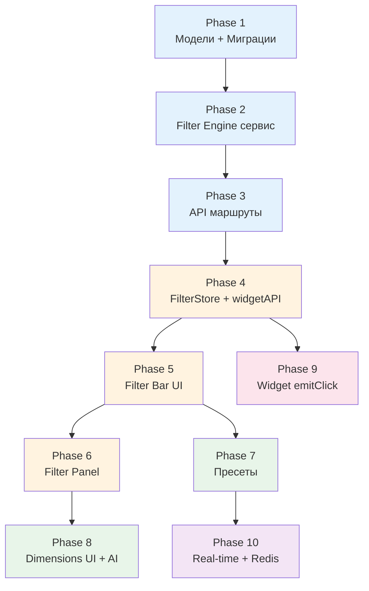

**Легенда**: 🔵 Backend core → 🟠 Frontend core → 🟢 Features → 🔴 AI → 🟣 Advanced

### Оценка трудозатрат

| Phase     | Описание                  | Ориентир        |
| --------- | ------------------------- | --------------- |
| 1         | Модели + миграции         | 2-3 часа        |
| 2         | FilterEngine + тесты      | 3-4 часа        |
| 3         | API маршруты              | 4-5 часов       |
| 4         | FilterStore + widgetAPI   | 4-5 часов       |
| 5         | Filter Bar UI             | 3-4 часа        |
| 6         | Filter Panel + Builder    | 5-6 часов       |
| 7         | Пресеты (full)            | 3-4 часа        |
| 8         | Dimensions UI + AI detect | 4-5 часов       |
| 9         | Widget emitClick          | 2-3 часа        |
| 10        | Real-time + Redis         | 3-4 часа        |
| **Итого** |                           | **~34-43 часа** |

### MVP (минимально жизнеспособный): Phases 1–5

Phases 1–5 дают работающую кросс-фильтрацию: измерения, движок, API, стор, Filter Bar с чипами. Это ~16-21 часов. Всё остальное — итеративное улучшение.

---

## 15. Связанные документы

- [BOARD_SYSTEM.md](./BOARD_SYSTEM.md) — система доски (4 типа нод, 5 типов связей)
- [DASHBOARD_SYSTEM.md](./DASHBOARD_SYSTEM.md) — система дашбордов
- [DATA_NODE_SYSTEM.md](./DATA_NODE_SYSTEM.md) — pipeline и трансформации
- [DRILL_DOWN_SYSTEM.md](./DRILL_DOWN_SYSTEM.md) — drill-down (дополняет cross-filter)
- [WIDGET_GENERATION_SYSTEM.md](./WIDGET_GENERATION_SYSTEM.md) — генерация виджетов
- [ARCHITECTURE.md](./ARCHITECTURE.md) — общая архитектура
