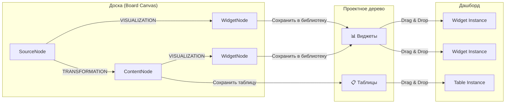
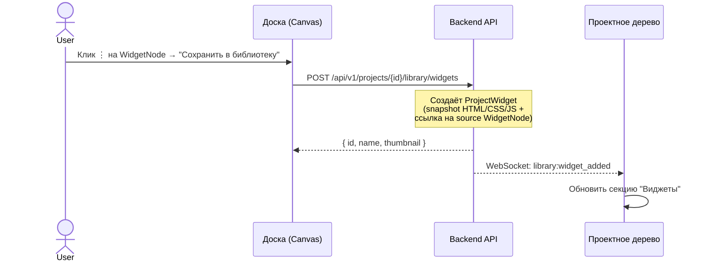
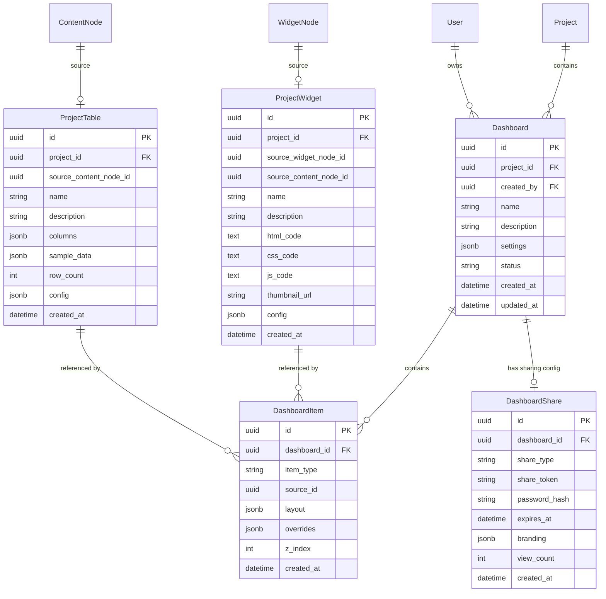
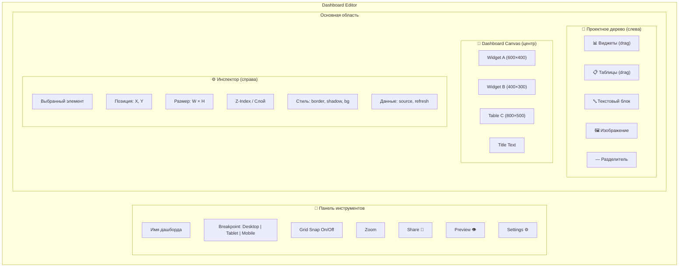
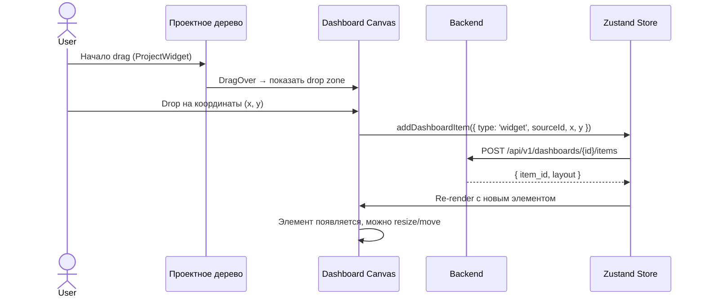
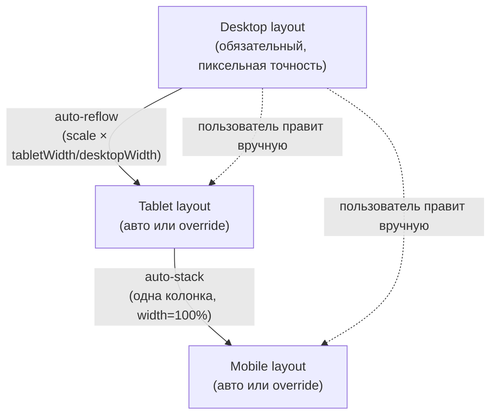
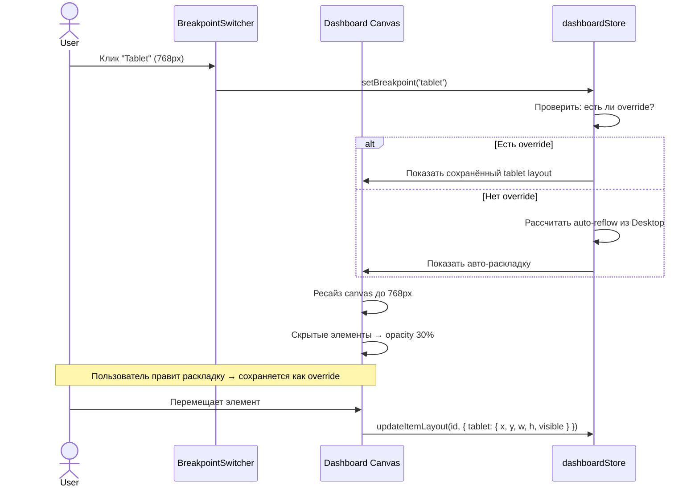
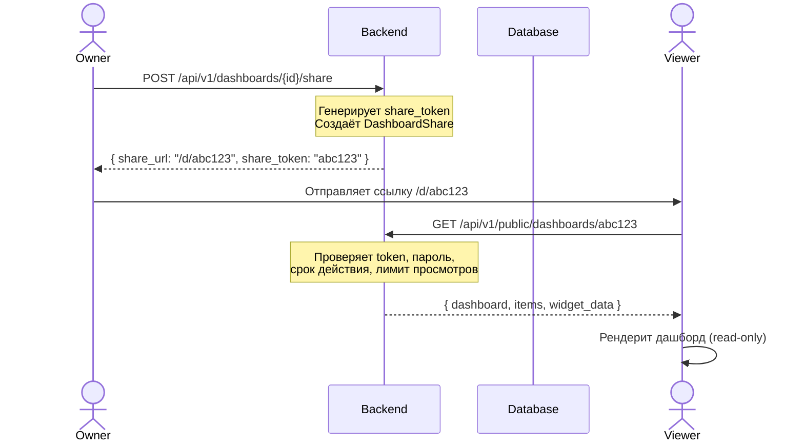
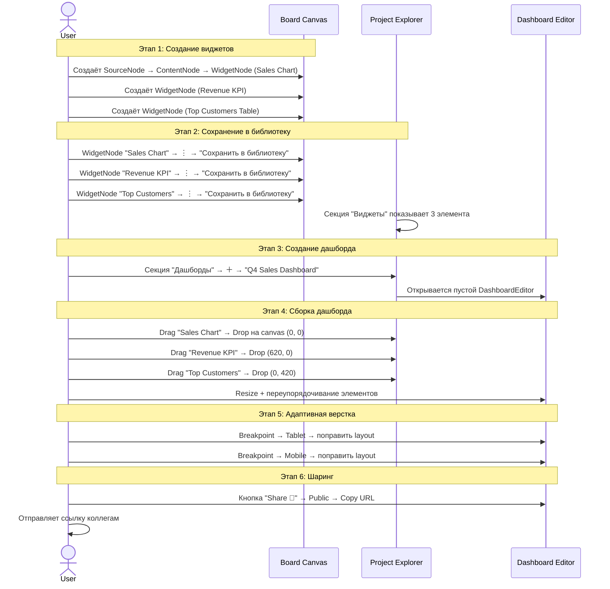
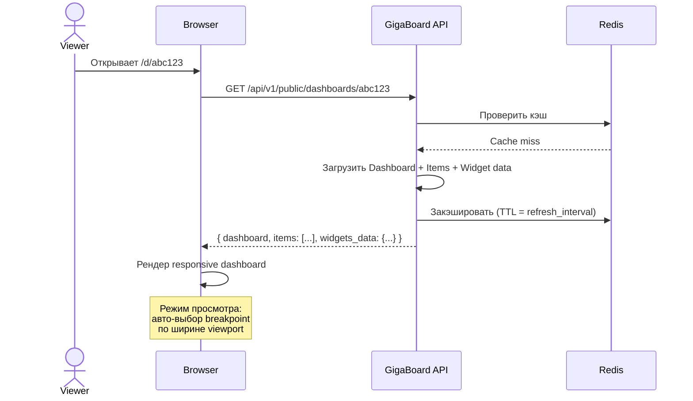

# Dashboard System

**Статус**: ✅ Реализовано (базовая система)  
**Приоритет**: High  
**Дата создания**: 26 февраля 2026  
**Последнее обновление**: 21 марта 2026  

---

## 📋 Executive Summary

**Dashboard System** — подсистема GigaBoard, позволяющая пользователям **собирать интерактивные дашборды** из виджетов и таблиц, созданных на досках (Board). Дашборд — это **презентационный слой**, отделённый от рабочего полотна: он не использует React Flow, а предоставляет **PowerPoint-подобный интерфейс свободного размещения** виджетов с поддержкой адаптивных макетов и просмотра в отдельном окне.

### ✅ Что реализовано (27.02.2026)

| Компонент                                       | Статус | Примечание                                                  |
| ----------------------------------------------- | ------ | ----------------------------------------------------------- |
| Backend: модели Dashboard, DashboardItem        | ✅      | PostgreSQL + Alembic миграции                               |
| Backend: CRUD API дашбордов и items             | ✅      | `/api/v1/dashboards/...`                                    |
| Backend: ProjectWidget, ProjectTable библиотека | ✅      | Список виджетов и таблиц проекта                            |
| Frontend: DashboardPage (редактор)              | ✅      | Режимы edit/view, toolbar                                   |
| Frontend: DashboardCanvas (холст)               | ✅      | Свободное размещение, zoom, grid                            |
| Frontend: DashboardItemRenderer                 | ✅      | Drag, resize, rotate, snap, z-order, portal toolbar         |
| Элемент: виджет (iframe)                        | ✅      | Sandboxed iframe с API injection                            |
| Элемент: таблица                                | ✅      | Интерактивная таблица                                       |
| Элемент: текст                                  | ✅      | Rich text editing (bold/italic/headings/lists/colors)       |
| Элемент: изображение                            | ✅      | Загрузка, URL, object-fit (tile/contain/fill/none)          |
| Элемент: произвольная линия                     | ✅      | SVG-линия, drag-эндпоинты, стиль/ширина/цвет                |
| Snap to grid                                    | ✅      | 8px сетка, toggle                                           |
| Smart guides                                    | ✅      | Направляющие при выравнивании по другим элементам           |
| Z-order управление                              | ✅      | 4 кнопки: на перед/назад/вперёд на уровень/назад на уровень |
| Вращение элементов                              | ✅      | RotateCw handle, Shift = 15° snap                           |
| Floating portal toolbar                         | ✅      | Всегда поверх всех элементов через `createPortal`           |
| Режим просмотра (view)                          | ✅      | Отдельная страница `DashboardViewPage`                      |
| Snap на эндпоинтах линии                        | ✅      | Сетка + smart guides для точек линии                        |
| Публичные изображения                           | ✅      | `GET /api/v1/files/image/{id}` без авторизации              |
| ИИ-ассистент на дашборде                        | ✅      | `AIAssistantPanel` с `scope=dashboard`; стрим прогресса мультиагента через Socket.IO (`ai_chat_stream` + JWT), см. [AI_ASSISTANT.md](./AI_ASSISTANT.md) |

### ⏳ Не реализовано (запланировано)

| Компонент                                          | Приоритет |
| -------------------------------------------------- | --------- |
| Публичный sharing (share token / URL)              | Medium    |
| Embed-режим (`/embed/d/:token`)                    | Low       |
| Multi-select (marquee selection)                   | Medium    |
| Copy/paste элементов                               | Medium    |
| Undo/redo                                          | Low       |
| Адаптивные breakpoints (auto-reflow tablet/mobile) | Medium    |
| Real-time collaborative editing                    | Low       |

### Ключевые идеи

1. **Проектное дерево как хаб** — виджеты и таблицы, созданные на досках, сохраняются в проектное дерево (разделы «Виджеты» и «Таблицы»), формируя **библиотеку переиспользуемых компонентов**
2. **Дашборды как отдельная сущность** — раздел «Дашборды» в проектном дереве, аналогичный разделу «Доски», но с принципиально другим UI (свободная сетка вместо бесконечного канваса)
3. **Drag & Drop из дерева** — виджеты перетаскиваются из проектного дерева на дашборд и размещаются свободно, как слайды в PowerPoint
4. **Публичный доступ** — каждый дашборд получает уникальный URL для шаринга (public/private/password)
5. **Адаптивные макеты** — поддержка Desktop / Tablet / Mobile breakpoints для корректного отображения на любых устройствах

### Связь с существующей архитектурой



---

## 1. Проектное дерево — новые разделы

### 1.1 Текущее состояние ProjectExplorer

Сейчас в `ProjectExplorer.tsx` есть 5 секций:

| Секция               | Статус        | Содержание                          |
| -------------------- | ------------- | ----------------------------------- |
| **Источники данных** | ✅ Работает    | SourceVitrina (9 типов drag & drop) |
| **Доски**            | ✅ Работает    | Список Board'ов проекта             |
| **Артефакты**        | ⬜ Placeholder | Пусто (0)                           |
| **Инструменты**      | ⬜ Placeholder | Пусто (0)                           |
| **Отчёты**           | ⬜ Placeholder | Пусто (0)                           |

### 1.2 Новая структура ProjectExplorer

Предлагается **переработать** секции проектного дерева:

| Секция               | Иконка | Содержание                                  | Действия                                 |
| -------------------- | ------ | ------------------------------------------- | ---------------------------------------- |
| **Источники данных** | 🔌      | SourceVitrina (без изменений)               | Drag & Drop на доску                     |
| **Доски**            | 📋      | Список Board'ов                             | +Создать, Открыть, Удалить               |
| **Виджеты**          | 📊      | Сохранённые виджеты из досок                | Drag & Drop на дашборд, Preview, Удалить |
| **Таблицы**          | 📋      | Сохранённые таблицы (ContentNode snapshots) | Drag & Drop на дашборд, Preview, Удалить |
| **Дашборды**         | 📊      | Список Dashboard'ов                         | +Создать, Открыть, Поделиться, Удалить   |

> **Секции «Артефакты», «Инструменты» и «Отчёты»** можно оставить или объединить: «Виджеты» и «Таблицы» по сути и являются артефактами. Отчёты могут трансформироваться в «Дашборды».

### 1.3 Сохранение виджета в библиотеку

**Workflow:**



**Что сохраняется:**
- `name` — имя виджета (из WidgetNode.name)
- `description` — описание
- `html_code`, `css_code`, `js_code` — snapshot кода на момент сохранения
- `thumbnail` — автогенерируемый скриншот (через html2canvas или серверный рендер)
- `source_widget_node_id` — ссылка на оригинал WidgetNode (для sync при обновлении)
- `source_content_node_id` — ссылка на ContentNode-источник данных
- `config` — конфигурация (auto_refresh, interval, etc.)

### 1.4 Сохранение таблицы в библиотеку

**Аналогичный workflow** для ContentNode:

- Пользователь кликает ⋮ на ContentNode → «Сохранить таблицу в библиотеку»
- Сохраняется snapshot таблицы (columns, sample rows, row count) + ссылка на ContentNode
- На дашборде таблица рендерится как интерактивная таблица (сортировка, фильтрация, пагинация)

---

## 2. Dashboard — модель данных

### 2.1 Основные сущности



### 2.2 Описание полей

#### Dashboard

| Поле          | Тип     | Описание                             |
| ------------- | ------- | ------------------------------------ |
| `id`          | UUID    | Первичный ключ                       |
| `project_id`  | UUID FK | Проект, которому принадлежит дашборд |
| `created_by`  | UUID FK | Автор                                |
| `name`        | string  | Название дашборда                    |
| `description` | string  | Описание                             |
| `settings`    | JSONB   | Глобальные настройки дашборда        |
| `status`      | enum    | `draft` / `published` / `archived`   |

**`settings` JSONB:**
```json
{
  "theme": "light",
  "background_color": "#ffffff",
  "grid_snap": true,
  "grid_size": 8,
  "canvas_width": 1440,
  "canvas_height": null,
  "canvas_preset": "hd",
  "responsive_breakpoints": {
    "desktop": { "width": 1440 },
    "tablet":  { "width": 768 },
    "mobile":  { "width": 375 }
  },
  "auto_refresh_global": false,
  "refresh_interval": 60
}
```

#### DashboardItem

| Поле           | Тип     | Описание                                                          |
| -------------- | ------- | ----------------------------------------------------------------- |
| `id`           | UUID    | Первичный ключ                                                    |
| `dashboard_id` | UUID FK | Дашборд                                                           |
| `item_type`    | enum    | `widget` / `table` / `text` / `image` / `line`                    |
| `source_id`    | UUID    | FK на ProjectWidget или ProjectTable (в зависимости от item_type) |
| `layout`       | JSONB   | Позиция и размеры для каждого breakpoint                          |
| `overrides`    | JSONB   | Локальные переопределения стилей/настроек                         |
| `z_index`      | int     | Порядок наложения (как слои в PowerPoint)                         |

**`layout` JSONB** (мастер-layout + опциональные override'ы):
```json
{
  "desktop": { "x": 100, "y": 50, "width": 600, "height": 400, "visible": true, "rotation": 0 },
  "tablet":  null,
  "mobile":  { "x": 0, "y": 200, "width": 375, "height": 300, "visible": true }
}
// tablet = null → используется desktop layout
// mobile = {...} → ручной override
// visible: false → элемент скрыт на этом breakpoint
// rotation → угол поворота в градусах (0–360), хранится только в сохранённых desktop/mobile/tablet
```

**`content` JSONB** (данные для text/image/line элементов):
```json
// text
{ "html": "<b>Заголовок</b><p>Текст...</p>" }

// image
{ "url": "http://...", "alt": "Alt text", "object_fit": "cover" }
// object_fit: "cover" (tile — background-image repeat), "contain", "fill", "none"

// line
{
  "x1": 16, "y1": 16,      // координата первой точки (в px, относительно item)
  "x2": 284, "y2": 16,     // координата второй точки
  "line_style": "solid",   // "solid" | "dashed" | "dotted"
  "line_width": 2,         // 1–8 px
  "line_color": "#333333"  // CSS-цвет или пустая строка (→ hsl(var(--border)))
}
```

**`overrides` JSONB** (переопределения для конкретного placement):
```json
{
  "title_override": "Custom Title",
  "show_title": true,
  "border_radius": 12,
  "shadow": true,
  "padding": 16,
  "background": "#f8f9fa"
}
```

---

## 3. Dashboard UI — интерфейс дашборда

### 3.1 Общая концепция

Дашборд — это **НЕ** React Flow канвас. Это **свободный 2D-холст** (подобный PowerPoint или Figma), где элементы размещаются с фиксированными координатами и размерами.

### 3.2 Макет интерфейса



### 3.3 Режимы работы

| Режим      | Описание                                             | URL                                 |
| ---------- | ---------------------------------------------------- | ----------------------------------- |
| **Editor** | Полный редактор с панелями, drag & drop, инспектор   | `/project/:pid/dashboard/:did/edit` |
| **View**   | Только просмотр, без редактирования (для владельца)  | `/project/:pid/dashboard/:did`      |
| **Public** | Публичный просмотр по share-токену (без авторизации) | `/d/:shareToken`                    |
| **Embed**  | Встраиваемый режим (без шапки/навигации)             | `/embed/d/:shareToken`              |

### 3.4 Drag & Drop из проектного дерева



### 3.5 Поведение элементов на холсте

Каждый элемент дашборда поддерживает:

| Функция          | Поведение                                                           |
| ---------------- | ------------------------------------------------------------------- |
| **Move**         | Свободное перемещение (с привязкой к сетке, если grid_snap включён) |
| **Resize**       | Тянуть за углы/стороны (как в PowerPoint)                           |
| **Z-order**      | Bring to Front / Send to Back / ±1 level (контекстное меню)         |
| **Select**       | Клик = выбор → инспектор показывает свойства                        |
| **Multi-select** | Shift+Click или Marquee selection (прямоугольное выделение)         |
| **Group move**   | Перемещение нескольких выделенных элементов                         |
| **Snap guides**  | Направляющие при выравнивании по другим элементам (как в Figma/PPT) |
| **Copy/Paste**   | Ctrl+C/Ctrl+V для дублирования элементов                            |
| **Delete**       | Del / Backspace → удаление с подтверждением                         |

---

## 4. Адаптивные макеты (Responsive Layouts)

### 4.1 Подход: Desktop-мастер + опциональные override'ы

**Desktop layout — обязательный.** Tablet и Mobile рассчитываются автоматически, но пользователь может переключиться в режим tablet/mobile и вручную поправить раскладку. Ручные правки сохраняются как override и не теряются.



### 4.2 Breakpoints

| Breakpoint  | Ширина холста                                   | Описание               | Override         |
| ----------- | ----------------------------------------------- | ---------------------- | ---------------- |
| **Desktop** | Выбирается при создании (1200/1440/1920/custom) | Основной мастер-layout | **Обязательный** |
| **Tablet**  | 768px                                           | Авто-reflow из Desktop | Опциональный     |
| **Mobile**  | 375px                                           | Авто-stack вертикально | Опциональный     |

### 4.3 Выбор ширины Desktop-холста

При создании дашборда пользователь выбирает пресет ширины холста (можно изменить позже в настройках):

| Пресет      | Ширина | Когда использовать                                                |
| ----------- | ------ | ----------------------------------------------------------------- |
| **HD**      | 1440px | Универсальный — подходит большинству мониторов (**по умолчанию**) |
| **Full HD** | 1920px | Для больших мониторов / телевизоров                               |
| **Compact** | 1200px | Минимальный, для ноутбуков                                        |
| **Custom**  | N px   | Пользователь вводит произвольную ширину                           |

Высота холста — **динамическая** (определяется самым нижним элементом + отступ).

### 4.4 Скрытие элементов по breakpoint'ам

Каждый элемент можно **скрыть** на отдельном breakpoint через `visible: false` в layout override. Это позволяет:

- Скрыть тяжёлые графики на mobile, оставив только KPI-карточки
- Убрать второстепенные таблицы на tablet
- Показать специальные элементы **только** на mobile (напр. упрощённый сводный виджет)

**UX в редакторе:**
- В режиме tablet/mobile скрытые элементы показываются полупрозрачными (opacity 30%) с иконкой 👁‍🗨 (скрыт)
- ПКМ на элементе → «Скрыть на Tablet» / «Показать на Mobile»
- В Inspector — чекбоксы видимости по breakpoint'ам

### 4.5 Стратегия auto-layout

Auto-layout срабатывает **только при первом переключении** на breakpoint, где ещё нет override. После любых ручных правок уже используется override. Пользователь может сбросить override кнопкой «Сбросить до авто».

#### Tablet auto-reflow
1. Взять Desktop layout
2. Масштабировать координаты и размеры: `scale = tabletWidth / desktopWidth`
3. Проверить перекрытия (AABB collision detection)
4. Если есть перекрытия — сдвинуть вниз, сохраняя относительный порядок
5. Минимальный размер элемента: 200×150 px

#### Mobile auto-stack
1. Все элементы в одну колонку
2. Ширина каждого элемента = 375px (ширина mobile-viewport)
3. Порядок сверху вниз: по desktop-координате Y (сначала верхние элементы, при равной Y — по X слева направо)
4. Высота сохраняется из Desktop (минимум 200px)
5. Отступ между элементами: 16px

### 4.6 Переключение breakpoint в редакторе



### 4.7 Просмотр публичного дашборда

При открытии публичной ссылки `/d/:shareToken`:
1. Viewer-приложение определяет `window.innerWidth`
2. Выбирает breakpoint: ≥ desktop width → Desktop, ≥ 768 → Tablet, иначе → Mobile
3. Если для breakpoint есть override — использует его, иначе — auto-layout
4. Элементы с `visible: false` не рендерятся
5. При `resize` окна — автоматически переключается breakpoint

---

## 5. Публичный доступ и шаринг

### 5.1 Механизм sharing



### 5.2 Типы доступа

| Тип          | Описание                                          | Требования               |
| ------------ | ------------------------------------------------- | ------------------------ |
| **public**   | Доступен всем по ссылке                           | Только share_token       |
| **password** | Требуется пароль                                  | share_token + password   |
| **private**  | Только для авторизованных пользователей с правами | JWT + project membership |

### 5.3 URL-структура

| URL                                 | Назначение                |
| ----------------------------------- | ------------------------- |
| `/project/:pid/dashboard/:did/edit` | Редактор (авторизованный) |
| `/project/:pid/dashboard/:did`      | Просмотр (авторизованный) |
| `/d/:shareToken`                    | Публичный просмотр        |
| `/embed/d/:shareToken`              | Встраиваемый iframe       |

### 5.4 Embed-код

При расшаривании дашборда генерируется HTML-сниппет для встраивания:

```html
<!-- GigaBoard Dashboard Embed -->
<iframe 
  src="https://gigaboard.app/embed/d/abc123"
  width="100%" 
  height="600"
  frameborder="0"
  style="border: none; border-radius: 8px;"
  allow="fullscreen"
></iframe>
```

---

## 6. Живые данные и auto-refresh

### 6.1 Связь виджетов с данными

Каждый виджет на дашборде **связан с данными через цепочку**:

```
DashboardItem → ProjectWidget → WidgetNode → ContentNode (данные)
```

### 6.2 Режимы обновления данных

| Режим         | Описание                                                |
| ------------- | ------------------------------------------------------- |
| **Snapshot**  | Данные на момент добавления в библиотеку (по умолчанию) |
| **Live**      | Данные подтягиваются в реальном времени из ContentNode  |
| **Scheduled** | Обновление по расписанию (каждые N секунд/минут)        |

### 6.3 Обновление для публичных дашбордов

Публичный viewer получает данные через специальный read-only API:

```
GET /api/v1/public/dashboards/:token/items/:itemId/data
```

Этот endpoint:
- Не требует авторизации (токен = доступ)
- Возвращает текущие данные ContentNode
- Rate-limited (макс. 60 запросов/мин на токен)
- Кэшируется Redis (TTL = refresh_interval)

---

## 7. Стек технологий

### 7.1 Frontend — Dashboard Editor

| Технология       | Назначение                                          | Статус         |
| ---------------- | --------------------------------------------------- | -------------- |
| **React**        | UI фреймворк                                        | ✅ Используется |
| **Zustand**      | State management (`dashboardStore`, `libraryStore`) | ✅ Используется |
| **ShadCN UI**    | Компоненты (toolbar, buttons, dropdowns)            | ✅ Используется |
| **Lucide React** | Иконки в тулбарах и кнопках                         | ✅ Используется |

#### Реализованный подход: кастомные mouse event handlers

Вместо `react-moveable` принято решение реализовать drag/resize/rotate **вручную** через `mousedown`/`mousemove`/`mouseup` на `document`. Это обеспечивает полный контроль над поведением и исключает зависимость от тяжёлой внешней библиотеки.

| Операция           | Реализация                                                                       |
| ------------------ | -------------------------------------------------------------------------------- |
| **Drag**           | `dragStart` ref + `mousemove` на `document`, с учётом `zoom` и `snap()`          |
| **Resize**         | `resizeStart` ref + нижний правый handle, min-size защита                        |
| **Rotate**         | `atan2`-расчёт угла от центра элемента, Shift = snap 15°                         |
| **Snap to grid**   | Функция `snap(val)` = `Math.round(val / gridSize) * gridSize`                    |
| **Smart guides**   | `onDragMove(itemId, rect)` → callback из `DashboardCanvas` → рисует направляющие |
| **Drag линии**     | Endpoint-handles (SVG circle) с отдельной логикой пересчёта bounding box         |
| **Portal toolbar** | `createPortal(toolbar, document.body)` → `position: fixed; z-index: 9999`        |

### 7.2 Frontend — Рендеринг виджетов

| Технология                | Назначение                                                                   |
| ------------------------- | ---------------------------------------------------------------------------- |
| **sandboxed iframe**      | Безопасный рендеринг HTML/CSS/JS виджетов (уже реализовано в WidgetNodeCard) |
| **Intersection Observer** | Ленивая загрузка виджетов (рендерить только видимые)                         |

### 7.3 Backend

| Технология     | Назначение                                                         | Почему           |
| -------------- | ------------------------------------------------------------------ | ---------------- |
| **FastAPI**    | REST API для дашбордов                                             | Уже используется |
| **SQLAlchemy** | ORM — модели Dashboard, DashboardItem, ProjectWidget, ProjectTable | Уже используется |
| **Alembic**    | Миграции БД                                                        | Уже используется |
| **PostgreSQL** | Хранение данных                                                    | Уже используется |
| **Redis**      | Кэш публичных дашбордов, rate limiting                             | Уже используется |
| **Socket.IO**  | Real-time обновления элементов дашборда                            | Уже используется |

### 7.4 Sharing & Embedding

| Технология                               | Назначение                                      |
| ---------------------------------------- | ----------------------------------------------- |
| **nanoid** или **secrets.token_urlsafe** | Генерация share-токенов                         |
| **bcrypt**                               | Хэширование пароля для protected дашбордов      |
| **Redis**                                | Кэширование публичных дашбордов + rate limiting |

### 7.5 Скриншотирование / Thumbnails

| Вариант                    | Описание                    | Trade-off                           |
| -------------------------- | --------------------------- | ----------------------------------- |
| **html2canvas (frontend)** | Скриншот виджета на клиенте | Быстро, но зависит от клиента       |
| **Playwright (backend)**   | Серверный рендер HTML → PNG | Точнее, но требует headless browser |

**Рекомендация**: html2canvas (frontend) для MVP, Playwright для production.

---

## 8. API Endpoints

### 8.1 Project Library (Виджеты и Таблицы)

```
# Виджеты
POST   /api/v1/projects/{projectId}/library/widgets         # Сохранить виджет в библиотеку
GET    /api/v1/projects/{projectId}/library/widgets         # Список виджетов
GET    /api/v1/projects/{projectId}/library/widgets/{id}    # Получить виджет
DELETE /api/v1/projects/{projectId}/library/widgets/{id}    # Удалить

# Таблицы
POST   /api/v1/projects/{projectId}/library/tables          # Сохранить таблицу в библиотеку
GET    /api/v1/projects/{projectId}/library/tables          # Список таблиц
GET    /api/v1/projects/{projectId}/library/tables/{id}     # Получить таблицу
DELETE /api/v1/projects/{projectId}/library/tables/{id}     # Удалить
```

### 8.2 Dashboards CRUD

```
POST   /api/v1/projects/{projectId}/dashboards              # Создать дашборд
GET    /api/v1/projects/{projectId}/dashboards              # Список дашбордов проекта
GET    /api/v1/dashboards/{dashboardId}                     # Получить дашборд
PATCH  /api/v1/dashboards/{dashboardId}                     # Обновить настройки
DELETE /api/v1/dashboards/{dashboardId}                     # Удалить

# Items (элементы дашборда)
POST   /api/v1/dashboards/{dashboardId}/items               # Добавить элемент
GET    /api/v1/dashboards/{dashboardId}/items               # Список элементов
PATCH  /api/v1/dashboards/{dashboardId}/items/{itemId}      # Обновить позицию/размер/стиль
DELETE /api/v1/dashboards/{dashboardId}/items/{itemId}      # Удалить элемент

# Batch update (для перемещения нескольких элементов)
PATCH  /api/v1/dashboards/{dashboardId}/items/batch         # Обновить несколько элементов
```

### 8.3 Sharing

```
POST   /api/v1/dashboards/{dashboardId}/share               # Создать/обновить sharing
GET    /api/v1/dashboards/{dashboardId}/share               # Получить Share config
DELETE /api/v1/dashboards/{dashboardId}/share               # Отключить sharing

# Public endpoints (без авторизации)
GET    /api/v1/public/dashboards/{shareToken}               # Получить публичный дашборд
POST   /api/v1/public/dashboards/{shareToken}/verify        # Проверить пароль
GET    /api/v1/public/dashboards/{shareToken}/items/{id}/data  # Получить данные элемента
```

---

## 9. Frontend — новые компоненты

### 9.1 Структура файлов (реализовано)

```
apps/web/src/
├── components/
│   └── dashboard/
│       ├── DashboardCanvas.tsx        # Холст: items по z-index, snap guides, zoom
│       └── DashboardItemRenderer.tsx  # Один элемент: drag/resize/rotate/content + portal toolbar
│           # Содержит суб-компоненты:
│           #   WidgetContent     — sandboxed iframe
│           #   TableContent      — интерактивная таблица
│           #   TextContent       — rich text (contentEditable + форматирование)
│           #   ImageContent      — загрузка/URL, object-fit режимы
│           #   LineContent       — SVG-линия, drag-эндпоинты, стиль
│           #   TextFormattingToolbar — B/I/U, H1-H3, align, lists, font, color
│           #   ZOrderControls    — 4 кнопки управления порядком слоёв
│           #   LineStyleControls — тип/ширина/цвет линии в toolbar
├── pages/
│   ├── DashboardPage.tsx              # Редактор (/project/:pid/dashboard/:did) + toolbar
│   ├── DashboardViewPage.tsx          # Просмотр в отдельном окне (/project/:pid/dashboard/:did/view)
│   └── PublicDashboardPage.tsx        # Public view (структура для будущего публичного доступа)
├── store/
│   ├── dashboardStore.ts              # Zustand: CRUD, items, selectedItemIds, activeBreakpoint
│   └── libraryStore.ts               # Zustand: ProjectWidget[], ProjectTable[]
├── services/
│   └── api.ts                         # dashboardsAPI, itemsAPI, filesAPI
└── types/
    └── dashboard.ts                   # Dashboard, DashboardItem, DashboardItemType,
                                       # ItemBreakpointLayout (x,y,width,height,visible,rotation?)
```

```
apps/backend/app/
├── models/
│   ├── dashboard.py          # Dashboard (JSONB settings)
│   ├── dashboard_item.py     # DashboardItem (item_type, layout JSONB, content JSONB, z_index)
│   ├── project_widget.py     # ProjectWidget
│   └── project_table.py      # ProjectTable
├── schemas/
│   └── dashboard.py          # Pydantic: Dashboard*, DashboardItem*, ItemBreakpointLayoutSchema
├── routes/
│   ├── dashboards.py         # CRUD: дашборды + items
│   ├── library.py            # CRUD: ProjectWidget, ProjectTable
│   └── files.py              # GET /api/v1/files/image/{id} (публичный доступ к файлам)
└── services/
    ├── dashboard_service.py   # Бизнес-логика
    └── file_storage.py        # DatabaseFileStorage (BYTEA) + mime_type
```

### 9.2 Zustand — dashboardStore

```typescript
interface DashboardStore {
  // Dashboard
  dashboards: Dashboard[]
  currentDashboard: Dashboard | null
  items: DashboardItem[]
  
  // UI state
  selectedItemIds: string[]
  activeBreakpoint: 'desktop' | 'tablet' | 'mobile'
  isGridSnap: boolean
  zoom: number
  
  // CRUD
  fetchDashboards: (projectId: string) => Promise<void>
  createDashboard: (data: CreateDashboardDTO) => Promise<Dashboard>
  updateDashboard: (id: string, data: Partial<Dashboard>) => Promise<void>
  deleteDashboard: (id: string) => Promise<void>
  
  // Items
  fetchItems: (dashboardId: string) => Promise<void>
  addItem: (item: AddDashboardItemDTO) => Promise<void>
  updateItem: (itemId: string, data: Partial<DashboardItem>) => Promise<void>
  updateItemLayout: (itemId: string, layout: ItemLayout) => Promise<void>
  removeItem: (itemId: string) => Promise<void>
  batchUpdateItems: (updates: BatchItemUpdate[]) => Promise<void>
  
  // Selection
  selectItem: (id: string) => void
  toggleSelectItem: (id: string) => void
  selectAll: () => void
  clearSelection: () => void
  
  // Layout
  setBreakpoint: (bp: Breakpoint) => void
  toggleGridSnap: () => void
  setZoom: (zoom: number) => void
  
  // Sharing
  shareConfig: DashboardShare | null
  createShare: (dashboardId: string, config: ShareConfig) => Promise<string>
  deleteShare: (dashboardId: string) => Promise<void>
}
```

### 9.3 Zustand — libraryStore

```typescript
interface LibraryStore {
  // Widgets
  widgets: ProjectWidget[]
  fetchWidgets: (projectId: string) => Promise<void>
  saveWidget: (data: SaveWidgetDTO) => Promise<ProjectWidget>
  deleteWidget: (id: string) => Promise<void>
  
  // Tables
  tables: ProjectTable[]
  fetchTables: (projectId: string) => Promise<void>
  saveTable: (data: SaveTableDTO) => Promise<ProjectTable>
  deleteTable: (id: string) => Promise<void>
}
```

---

## 10. Backend — новые файлы

### 10.1 Структура

```
apps/backend/app/
├── models/
│   ├── dashboard.py                # Dashboard, DashboardItem
│   ├── dashboard_share.py          # DashboardShare
│   ├── project_widget.py           # ProjectWidget (библиотека виджетов)
│   └── project_table.py            # ProjectTable (библиотека таблиц)
├── schemas/
│   ├── dashboard.py                # Pydantic schemas для Dashboard, Items
│   ├── library.py                  # Schemas для ProjectWidget, ProjectTable
│   └── share.py                    # Schemas для sharing
├── routes/
│   ├── dashboards.py               # CRUD дашбордов + items
│   ├── library.py                  # CRUD виджетов и таблиц в библиотеке
│   └── public.py                   # Публичные endpoints (без авторизации)
├── services/
│   ├── dashboard_service.py        # Бизнес-логика дашбордов
│   ├── library_service.py          # Бизнес-логика библиотеки
│   └── share_service.py            # Генерация токенов, проверка доступа
```

---

## 11. Маршрутизация (Routes)

### Frontend (React Router)

```typescript
<Routes>
  {/* Существующие */}
  <Route path="/" element={<LandingPage />} />
  <Route path="/welcome" element={<WelcomePage />} />
  <Route path="/project/:projectId" element={<ProjectOverviewPage />} />
  <Route path="/project/:projectId/board/:boardId" element={<BoardPage />} />

  {/* Новые — Dashboard */}
  <Route path="/project/:projectId/dashboard/:dashboardId/edit" element={<DashboardEditorPage />} />
  <Route path="/project/:projectId/dashboard/:dashboardId" element={<DashboardViewPage />} />
  
  {/* Публичные */}
  <Route path="/d/:shareToken" element={<PublicDashboardPage />} />
  <Route path="/embed/d/:shareToken" element={<PublicDashboardPage embed />} />
</Routes>
```

---

## 12. Сценарии использования

### Сценарий 1: Создание дашборда из Board-виджетов



### Сценарий 2: Публичный просмотр



---

## 13. Интеграция с существующей системой

### 13.1 Что НЕ меняется

- React Flow канвас досок — без изменений
- WidgetNode на доске — без изменений
- ContentNode, SourceNode — без изменений
- AI агенты — без изменений
- Socket.IO инфраструктура — переиспользуется

### 13.2 Что добавляется к существующим компонентам

| Компонент             | Изменение                                                                               |
| --------------------- | --------------------------------------------------------------------------------------- |
| `ProjectExplorer.tsx` | +2 секции (Виджеты, Таблицы), +1 секция (Дашборды). Замена Артефакты/Инструменты/Отчёты |
| `WidgetNodeCard.tsx`  | +пункт контекстного меню «Сохранить в библиотеку»                                       |
| `ContentNodeCard.tsx` | +пункт контекстного меню «Сохранить таблицу в библиотеку»                               |
| `App.tsx`             | +Routes для Dashboard (editor, view, public)                                            |
| `api.ts`              | +методы для dashboards, library, share                                                  |
| `uiStore.ts`          | +dialog state для CreateDashboardDialog                                                 |
| Backend `main.py`     | +include routers для dashboards, library, public                                        |

---

## 14. Фазы реализации

### Фаза A: Библиотека виджетов и таблиц ✅ Завершено
- ✅ Модели ProjectWidget, ProjectTable
- ✅ API: CRUD для библиотеки
- ✅ Frontend: виджеты и таблицы в ProjectExplorer
- ✅ Кнопка «Сохранить в библиотеку» в WidgetNodeCard

### Фаза B: Dashboard MVP ✅ Завершено
- ✅ Модели Dashboard, DashboardItem (PostgreSQL + Alembic)
- ✅ API: CRUD дашбордов и items
- ✅ Frontend: DashboardPage (редактор), DashboardCanvas
- ✅ Добавление виджетов/таблиц из ProjectExplorer
- ✅ Toolbar: zoom, snap, edit/view, add elements
- ✅ Секция «Дашборды» в ProjectExplorer

### Фаза B+: Расширенный редактор ✅ Завершено
- ✅ Элементы: текст (rich text), изображение, произвольная линия
- ✅ Drag + Resize (кастомные mouse handlers)
- ✅ Z-order управление (4 кнопки)
- ✅ Вращение элементов (Shift = 15° snap)
- ✅ Smart guides при drag/resize/линия-эндпоинты
- ✅ Snap to grid (8px)
- ✅ Floating portal toolbar (всегда поверх)
- ✅ Произвольные линии с drag-эндпоинтами + гиды
- ✅ Режим просмотра в отдельном окне
- ✅ Изображения: upload, URL, tile/contain/fill/none
- ✅ Публичный endpoint для изображений без авторизации

### Фаза C: Адаптивные макеты ⏳ Частично
- ✅ Multi-breakpoint switcher (Desktop/Tablet/Mobile) в UI
- ✅ `rotation` сохраняется в layout JSONB
- ⏳ Auto-reflow алгоритм (tablet/mobile auto-stack)
- ⏳ Скрытие элементов по breakpoint

### Фаза D: Sharing и публичный доступ ⏳ Не реализовано
- ⏳ Модель DashboardShare
- ⏳ API: Share/unshare + `/d/:shareToken`
- ⏳ Frontend: ShareDialog
- ⏳ Rate limiting + Redis кэш
- ⏳ Embed-режим

### Фаза E: Polish и UX ⏳ Частично
- ⏳ Copy/paste элементов
- ⏳ Undo/redo в редакторе
- ⏳ Multi-select (marquee)
- ⏳ Thumbnails для библиотечных элементов
- ⏳ Real-time sync дашборда

---

## 15. Открытые вопросы

| #   | Вопрос                                             | Варианты                                                        | Решение                                                                         |
| --- | -------------------------------------------------- | --------------------------------------------------------------- | ------------------------------------------------------------------------------- |
| 1   | ~~Grid vs Free-form placement?~~                   | ~~react-grid-layout vs @dnd-kit~~                               | ✅ Решено: **react-moveable** — пиксельная точность + snap to grid + snap guides |
| 2   | Синхронизация виджета при обновлении на доске?     | Auto-sync / Manual / Prompt user                                | TBD                                                                             |
| 3   | Ограничение по количеству виджетов на дашборде?    | 20 / 50 / Без ограничений                                       | TBD                                                                             |
| 4   | Текстовые блоки и изображения на дашборде?         | Только виджеты+таблицы / +Text / +Images / +Shapes              | ✅ Решено: text, image, line реализованы                                         |
| 5   | Collaborative editing дашбордов (real-time)?       | Socket.IO / Только CRUD / Post-MVP                              | Post-MVP                                                                        |
| 6   | Переименовать существующие секции ProjectExplorer? | Заменить «Артефакты/Инструменты/Отчёты» / Добавить рядом        | ✅ Добавлены секции Виджеты, Таблицы, Дашборды                                   |
| 7   | Тип линии: «separator» или свободная линия?        | Горизонтальная линия-разделитель / SVG-линия с drag-эндпоинтами | ✅ Решено: `line` — SVG-линия с двумя свободными точками                         |

---

**Последнее обновление**: 27 февраля 2026
