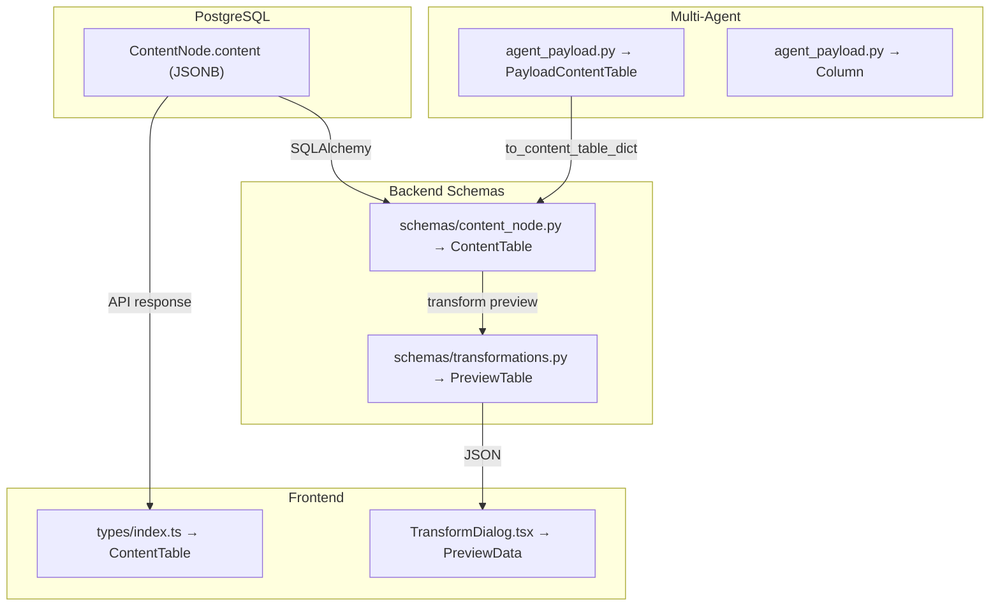
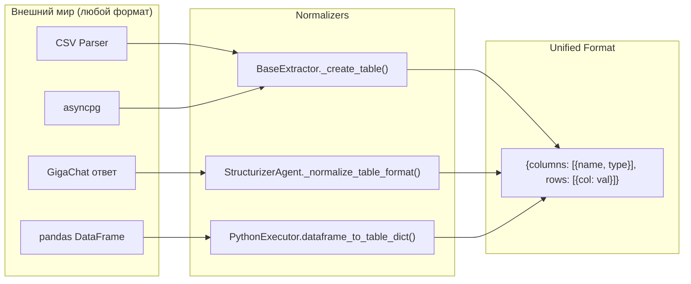

# Форматы хранения данных в GigaBoard

**Последнее обновление**: февраль 2026

---

## Executive Summary

GigaBoard использует **единый (unified) формат** для хранения табличных данных на всех уровнях системы — от PostgreSQL JSONB до фронтенда. Формат спроектирован для удобства доступа к ячейкам по имени колонки, типизации колонок и совместимости с pandas DataFrame.

**Ключевые принципы:**
- Колонки — массив объектов `{name, type}`
- Строки — массив словарей `{col_name: value}`
- Единый формат на всех уровнях: БД → Backend schemas → Agent payload → Frontend
- Нет обратной совместимости с устаревшими форматами

---

## Единый формат таблицы (Unified Table Format)

### Структура

```json
{
  "id": "uuid-string",
  "name": "sales_by_region",
  "columns": [
    {"name": "region", "type": "string"},
    {"name": "revenue", "type": "float"},
    {"name": "units", "type": "int"}
  ],
  "rows": [
    {"region": "North",  "revenue": 45000.0, "units": 120},
    {"region": "South",  "revenue": 38000.0, "units": 95},
    {"region": "West",   "revenue": 52000.0, "units": 140}
  ],
  "row_count": 3,
  "column_count": 3
}
```

### Колонки (`columns`)

Массив объектов с обязательными полями:

| Поле   | Тип      | Описание                                                       |
| ------ | -------- | -------------------------------------------------------------- |
| `name` | `string` | Имя колонки (уникальное в пределах таблицы)                    |
| `type` | `string` | Тип данных: `"string"`, `"int"`, `"float"`, `"date"`, `"bool"` |

```json
[
  {"name": "month",   "type": "string"},
  {"name": "revenue", "type": "float"},
  {"name": "active",  "type": "bool"}
]
```

### Строки (`rows`)

Массив словарей, где ключи — имена колонок, значения — данные ячеек:

```json
[
  {"month": "January",  "revenue": 400000.0, "active": true},
  {"month": "February", "revenue": 450000.0, "active": true},
  {"month": "March",    "revenue": 0.0,      "active": false}
]
```

**Доступ к данным:**
- Python: `row["revenue"]` или `row.get("revenue", 0)`
- TypeScript: `row["revenue"]` или `row?.revenue ?? 0`
- pandas: `pd.DataFrame(rows)` — мгновенная конвертация

### Счётчики

| Поле                | Тип   | Описание                          |
| ------------------- | ----- | --------------------------------- |
| `row_count`         | `int` | Общее количество строк в таблице  |
| `column_count`      | `int` | Количество колонок                |
| `preview_row_count` | `int` | Количество строк в preview (≤100) |

> `preview_row_count` используется когда таблица обрезана для предпросмотра. Если `preview_row_count < row_count`, фронтенд показывает "Показано N из M строк".

---

## Где хранятся данные



### 1. PostgreSQL — `ContentNode.content` (JSONB)

Модель: `app/models/content_node.py`

```python
content: Mapped[dict[str, Any]] = mapped_column(JSONB, nullable=False)
```

Структура поля `content`:

```json
{
  "text": "Sales data for Q1 2024. Total revenue: $1.2M",
  "tables": [
    {
      "id": "uuid",
      "name": "Monthly Sales",
      "columns": [{"name": "month", "type": "string"}, {"name": "revenue", "type": "float"}],
      "rows": [{"month": "January", "revenue": 400000}],
      "row_count": 3,
      "column_count": 2
    }
  ]
}
```

### 2. Backend Pydantic Schemas

#### `ContentTable` — основная read/write схема

Файл: `app/schemas/content_node.py`

```python
class ContentTable(BaseModel):
    id: str
    name: str
    columns: list[dict[str, str]]         # [{"name": str, "type": str}]
    rows: list[dict[str, Any]]            # [{col_name: value, ...}]
    row_count: int
    column_count: int
    preview_row_count: int
```

#### `PreviewTable` — preview результата трансформации

Файл: `app/schemas/transformations.py`

```python
class PreviewTable(BaseModel):
    name: str
    columns: list[dict[str, str]]
    rows: list[dict[str, Any]]
    row_count: int
    preview_row_count: int
```

### 3. Multi-Agent система — `PayloadContentTable`

Файл: `app/services/multi_agent/schemas/agent_payload.py`

```python
class Column(BaseModel):
    name: str
    type: str = "string"  # "string" | "int" | "float" | "date" | "bool"

class PayloadContentTable(BaseModel):
    id: str
    name: str
    columns: list[Column]                 # Pydantic-модели вместо dict
    rows: list[dict[str, Any]]            # [{col_name: value, ...}]
    row_count: int
    column_count: int
    preview_row_count: int
```

> `PayloadContentTable` использует типизированную модель `Column` вместо `dict[str, str]`. Метод `to_content_table_dict()` сериализует в общий формат.

### 4. Frontend TypeScript

Файл: `apps/web/src/types/index.ts`

```typescript
interface ContentTable {
  name: string;
  columns: Array<{ name: string; type: string }>;
  rows: Array<Record<string, any>>;
  row_count: number;
  column_count: number;
  metadata?: Record<string, any>;
}
```

**Доступ во фронтенде:**
```typescript
// Имена колонок
const colNames = table.columns.map(c => c.name)

// Значение ячейки
const value = row[colName]

// Рендер таблицы
table.rows.map(row =>
  table.columns.map(col => row?.[col.name] ?? '')
)
```

---

## Конвертация данных

### pandas DataFrame → Unified Format

Файл: `app/services/executors/python_executor.py`

```python
def dataframe_to_table_dict(self, df: pd.DataFrame, table_name: str) -> dict:
    # Типизация колонок из DataFrame.dtypes
    columns = []
    for col in df.columns:
        dtype = str(df[col].dtype)
        if 'int' in dtype:      col_type = "int"
        elif 'float' in dtype:  col_type = "float"
        elif 'bool' in dtype:   col_type = "bool"
        elif 'datetime' in dtype: col_type = "date"
        else:                   col_type = "string"
        columns.append({"name": str(col), "type": col_type})

    # Строки через to_dict(orient='records')
    rows = df.fillna("").to_dict(orient='records')

    return {
        "name": table_name,
        "columns": columns,
        "rows": rows,
        "row_count": len(rows),
        "column_count": len(columns),
    }
```

### Unified Format → pandas DataFrame

```python
def table_dict_to_dataframe(self, table: dict) -> pd.DataFrame:
    columns = table["columns"]
    rows = table.get("rows", [])
    column_names = [col["name"] for col in columns]
    return pd.DataFrame(rows, columns=column_names)
```

### Extractors — нормализация входных данных

Файл: `app/services/extractors/base.py`

Метод `_create_table()` принимает данные в любом формате от источников (CSV парсеры, pandas, asyncpg) и нормализует в unified формат:

```python
def _create_table(
    self,
    name: str,
    columns: list[str] | list[dict[str, str]],   # Принимает оба варианта
    rows: list[list] | list[dict[str, Any]],       # Принимает оба варианта
) -> dict[str, Any]:
    # → Всегда выдаёт:
    #   columns: [{name, type}, ...]
    #   rows: [{col: val}, ...]
```

Это **единственное место**, где допускается вход в виде `list[str]` для колонок и `list[list]` для строк — потому что внешние библиотеки (pandas, CSV reader, asyncpg) возвращают данные именно так.

### LLM-ответы — нормализация

Агенты `StructurizerAgent` и `PromptExtractor` нормализуют ответы LLM, которые могут приходить в произвольном формате:

```python
# structurizer.py — _normalize_table_format()
for c in columns:
    if isinstance(c, dict):
        typed_columns.append(c)
    else:
        typed_columns.append({"name": str(c), "type": "string"})

for row in rows:
    if isinstance(row, dict):
        new_rows.append(row)
    elif isinstance(row, list):
        new_rows.append({col_names[j]: v for j, v in enumerate(row)})
```

> LLM может вернуть данные в любом формате. Нормализация происходит **один раз** на границе системы, дальше используется только unified формат.

---

## Правила и ограничения

### ✅ Всегда

1. Колонки — `[{name, type}]`, строки — `[{col: val}]`
2. Доступ к значению ячейки — `row["col_name"]` (Python) / `row[colName]` (TS)
3. Получение имён колонок — `[c["name"] for c in columns]` / `columns.map(c => c.name)`
4. Конвертация в DataFrame — `pd.DataFrame(rows)`

### ❌ Никогда

1. ~~`columns: ["name", "age"]`~~ — колонки как массив строк (вне extractors/LLM normalizers)
2. ~~`rows: [["Alice", 30], ["Bob", 25]]`~~ — строки как массив массивов (вне extractors/LLM normalizers)
3. ~~`rows: [{id: 1, values: ["Alice", 30]}]`~~ — устаревший формат с `values`
4. ~~`typeof col === 'string' ? col : col.name`~~ — проверки на старый формат

### Граница нормализации



---

## Реализации по файлам

| Файл                                            | Роль                                                      |
| ----------------------------------------------- | --------------------------------------------------------- |
| `models/content_node.py`                        | SQLAlchemy модель, хранит `content` как JSONB             |
| `schemas/content_node.py`                       | Pydantic `ContentTable` — API read/write                  |
| `schemas/transformations.py`                    | Pydantic `PreviewTable` — preview трансформаций           |
| `services/multi_agent/schemas/agent_payload.py` | `PayloadContentTable` + `Column` — межагентный обмен      |
| `services/executors/python_executor.py`         | `dataframe_to_table_dict()` / `table_dict_to_dataframe()` |
| `services/extractors/base.py`                   | `_create_table()` — normalizer для extractors             |
| `services/multi_agent/agents/structurizer.py`   | `_normalize_table_format()` — normalizer для LLM          |
| `sources/base.py`                               | `TableData` dataclass + `ExtractionResult.to_content()`   |
| `apps/web/src/types/index.ts`                   | TypeScript `ContentTable` интерфейс                       |
