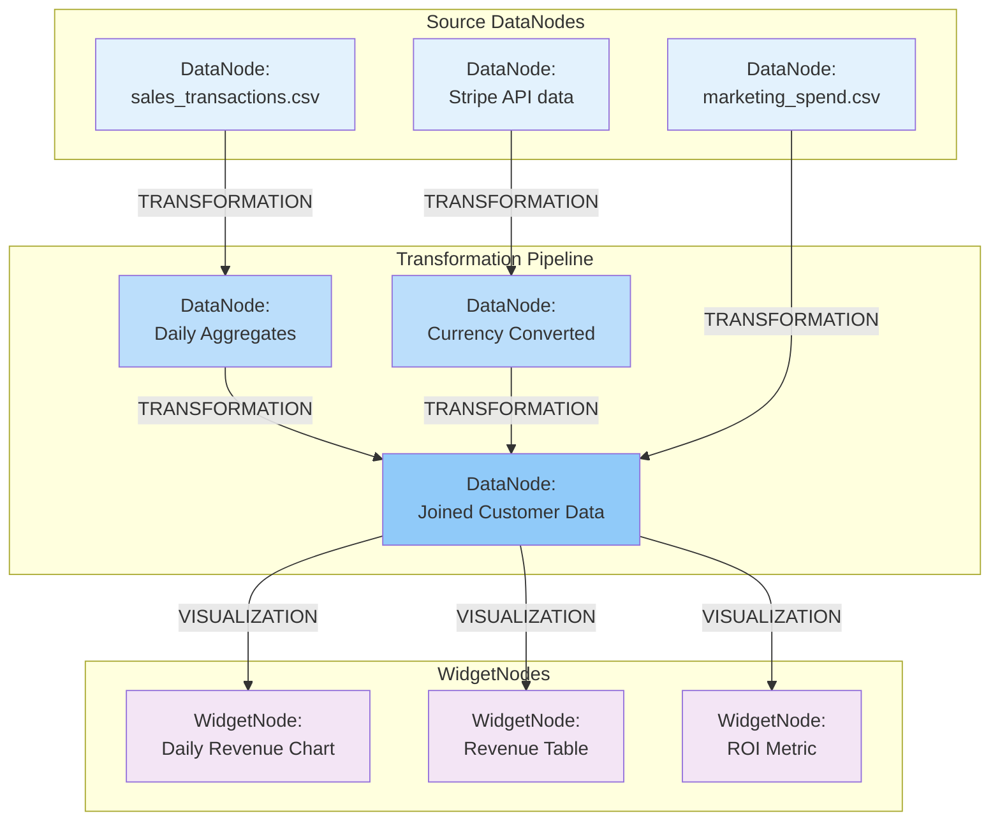

# Smart Data Lineage & Impact Analysis System

**Status**: 🚧 Planned  
**Priority**: Should Have (Phase 3)  
**Last Updated**: 24 January 2026

---

## Overview

The **Smart Data Lineage & Impact Analysis System** tracks the complete chain of data transformations—from source DataNodes through transformation pipelines to final WidgetNodes—with comprehensive change impact analysis.

### Key Capabilities
- 🔍 **Lineage Graph**: Full DAG visualization showing DataNode → TRANSFORMATION → DataNode flows
- 📊 **Impact Analysis**: "What breaks if I change this DataNode?"
- 🕐 **Historical Tracking**: Complete history of transformations and data changes
- 🔗 **Dependency Mapping**: Automatic graph construction from TRANSFORMATION edges
- 🎯 **Root Cause Analysis**: AI-powered debugging of data issues
- 📝 **Audit Trail**: Who, when, and how data was transformed
- ⚡ **Performance Insights**: Transformation execution metrics
- 🔔 **Change Alerts**: Notifications when upstream DataNodes change

---

## Architecture

### Data Lineage Graph Structure

The lineage graph is derived from the board's node and edge structure:
- **DataNodes** are nodes in the lineage graph
- **TRANSFORMATION edges** represent transformation steps
- **VISUALIZATION edges** link data to visual representations
- **Automatic replay** propagates changes through the graph



---

## Database Schema

### Lineage Metadata Tables

```sql
-- Tracks transformation execution history
CREATE TABLE transformation_executions (
    id UUID PRIMARY KEY,
    transformation_id UUID NOT NULL,
    
    -- Input and output DataNodes
    source_node_ids UUID[] NOT NULL,
    target_node_id UUID NOT NULL,
    
    -- Execution details
    status VARCHAR(50) NOT NULL,  -- success, failed, timeout
    started_at TIMESTAMP NOT NULL,
    completed_at TIMESTAMP,
    duration_ms INTEGER,
    
    -- Resources
    memory_mb INTEGER,
    cpu_percent FLOAT,
    
    -- Errors
    error_message TEXT,
    error_traceback TEXT,
    
    -- Data statistics
    input_row_count INTEGER,
    output_row_count INTEGER,
    data_size_bytes BIGINT,
    
    CONSTRAINT fk_transformation FOREIGN KEY (transformation_id) 
        REFERENCES transformations(id) ON DELETE CASCADE
);

-- Tracks data change events for lineage analysis
CREATE TABLE data_change_events (
    id UUID PRIMARY KEY,
    
    -- What changed
    entity_type VARCHAR(50) NOT NULL,  -- data_node, widget_node, transformation
    entity_id UUID NOT NULL,
    board_id UUID NOT NULL,
    
    -- Change details
    change_type VARCHAR(50) NOT NULL,  -- content_updated, schema_changed, code_changed
    change_details JSONB DEFAULT '{}',
    
    -- Before/after snapshots (for schema changes)
    before_schema JSONB,
    after_schema JSONB,
    
    -- Impact
    affected_downstream_nodes UUID[],
    impact_severity VARCHAR(20),  -- low, medium, high, critical
    
    -- Who made the change
    changed_by VARCHAR(100),
    changed_at TIMESTAMP DEFAULT NOW(),
    
    -- Notification status
    notifications_sent BOOLEAN DEFAULT FALSE,
    acknowledged_by UUID[],
    
    CONSTRAINT fk_board FOREIGN KEY (board_id) REFERENCES boards(id) ON DELETE CASCADE
);

-- Lineage snapshots for historical analysis
CREATE TABLE lineage_snapshots (
    id UUID PRIMARY KEY,
    board_id UUID NOT NULL,
    
    -- Full graph snapshot
    nodes JSONB NOT NULL,  -- All data_nodes, widget_nodes
    edges JSONB NOT NULL,  -- All edges (TRANSFORMATION, VISUALIZATION, etc)
    transformations JSONB NOT NULL,  -- Transformation code at this point
    
    -- Metadata
    snapshot_type VARCHAR(50),  -- manual, scheduled, change_triggered
    created_by VARCHAR(100),
    created_at TIMESTAMP DEFAULT NOW(),
    
    -- Statistics
    node_count INTEGER,
    edge_count INTEGER,
    max_depth INTEGER,  -- Longest transformation chain
    total_transformations INTEGER,
    
    CONSTRAINT fk_board FOREIGN KEY (board_id) REFERENCES boards(id) ON DELETE CASCADE
);

-- Impact analysis results
CREATE TABLE impact_analyses (
    id UUID PRIMARY KEY,
    board_id UUID NOT NULL,
    
    -- Analysis target
    target_node_id UUID NOT NULL,
    target_node_type VARCHAR(50),  -- data_node, transformation
    
    -- Hypothetical change
    hypothetical_change JSONB NOT NULL,
    
    -- Impact results
    affected_data_nodes UUID[],
    affected_widget_nodes UUID[],
    affected_transformations UUID[],
    affected_boards UUID[],
    
    -- Severity breakdown
    critical_impact_count INTEGER DEFAULT 0,
    high_impact_count INTEGER DEFAULT 0,
    medium_impact_count INTEGER DEFAULT 0,
    low_impact_count INTEGER DEFAULT 0,
    
    -- Analysis metadata
    analyzed_by VARCHAR(100),
    analyzed_at TIMESTAMP DEFAULT NOW(),
    analysis_duration_ms INTEGER,
    
    CONSTRAINT fk_board FOREIGN KEY (board_id) REFERENCES boards(id) ON DELETE CASCADE
);

-- Indexes
CREATE INDEX idx_transformation_executions_transformation ON transformation_executions(transformation_id);
CREATE INDEX idx_transformation_executions_target ON transformation_executions(target_node_id);
CREATE INDEX idx_transformation_executions_started ON transformation_executions(started_at);

CREATE INDEX idx_data_change_events_entity ON data_change_events(entity_type, entity_id);
CREATE INDEX idx_data_change_events_board ON data_change_events(board_id);
CREATE INDEX idx_data_change_events_time ON data_change_events(changed_at);

CREATE INDEX idx_lineage_snapshots_board ON lineage_snapshots(board_id);
CREATE INDEX idx_lineage_snapshots_created ON lineage_snapshots(created_at);

CREATE INDEX idx_impact_analyses_target ON impact_analyses(target_node_id);
CREATE INDEX idx_impact_analyses_board ON impact_analyses(board_id);
```

---

## Lineage Manager

### Building and Querying Lineage Graphs

```python
class LineageManager:
    """
    Manages data lineage graph construction and queries
    """
    
    def __init__(self, db_session):
        self.db = db_session
    
    async def build_lineage_graph(self, board_id: UUID) -> Dict:
        """
        Build complete lineage graph for a board
        
        Returns:
            {
                "nodes": [
                    {"id": "...", "type": "data_node", "label": "...", ...},
                    {"id": "...", "type": "widget_node", "label": "...", ...}
                ],
                "edges": [
                    {"from": "...", "to": "...", "type": "TRANSFORMATION", ...},
                    {"from": "...", "to": "...", "type": "VISUALIZATION", ...}
                ],
                "statistics": {
                    "total_nodes": 15,
                    "total_edges": 12,
                    "max_depth": 4,
                    "transformation_count": 8
                }
            }
        """
        
        # Get all nodes
        data_nodes = await self.db.data_nodes.find({"board_id": board_id}).to_list()
        widget_nodes = await self.db.widget_nodes.find({"board_id": board_id}).to_list()
        comment_nodes = await self.db.comment_nodes.find({"board_id": board_id}).to_list()
        
        # Get all edges
        edges = await self.db.edges.find({"board_id": board_id}).to_list()
        
        # Build graph structure
        graph_nodes = []
        
        for dn in data_nodes:
            graph_nodes.append({
                "id": str(dn["id"]),
                "type": "data_node",
                "label": self._generate_node_label(dn),
                "content_type": dn.get("content_type"),
                "position": dn.get("position"),
                "metadata": dn.get("metadata", {})
            })
        
        for wn in widget_nodes:
            graph_nodes.append({
                "id": str(wn["id"]),
                "type": "widget_node",
                "label": f"{wn.get('description', 'Widget')}",
                "description": wn.get("description"),
                "parent_data_node_id": str(wn.get("parent_data_node_id")),
                "position": wn.get("position")
            })
        
        # Build graph edges
        graph_edges = []
        
        for edge in edges:
            graph_edges.append({
                "id": str(edge["id"]),
                "from": str(edge["from_node_id"]),
                "to": str(edge["to_node_id"]),
                "type": edge["edge_type"],
                "label": edge.get("label", edge["edge_type"]),
                "transformation_id": str(edge.get("transformation_id")) if edge.get("transformation_id") else None
            })
        
        # Calculate statistics
        max_depth = self._calculate_max_depth(graph_nodes, graph_edges)
        transformation_count = len([e for e in graph_edges if e["type"] == "TRANSFORMATION"])
        
        return {
            "nodes": graph_nodes,
            "edges": graph_edges,
            "statistics": {
                "total_nodes": len(graph_nodes),
                "total_edges": len(graph_edges),
                "max_depth": max_depth,
                "transformation_count": transformation_count,
                "data_node_count": len(data_nodes),
                "widget_node_count": len(widget_nodes),
                "comment_node_count": len(comment_nodes)
            }
        }
    
    async def get_upstream_nodes(self, node_id: UUID) -> List[Dict]:
        """
        Get all upstream (source) nodes for a given node
        
        Example: For a WidgetNode, returns its parent DataNode
                 For a DataNode, returns source DataNodes via TRANSFORMATION edges
        """
        
        visited = set()
        upstream = []
        
        async def traverse_upstream(current_id):
            if current_id in visited:
                return
            visited.add(current_id)
            
            # Find incoming edges
            incoming_edges = await self.db.edges.find({
                "to_node_id": current_id
            }).to_list()
            
            for edge in incoming_edges:
                source_id = edge["from_node_id"]
                
                # Get source node
                source_node = await self._get_node(source_id)
                if source_node:
                    upstream.append({
                        "node": source_node,
                        "edge_type": edge["edge_type"],
                        "transformation_id": edge.get("transformation_id")
                    })
                    
                    # Recursively traverse
                    await traverse_upstream(source_id)
        
        await traverse_upstream(node_id)
        return upstream
    
    async def get_downstream_nodes(self, node_id: UUID) -> List[Dict]:
        """
        Get all downstream (dependent) nodes for a given node
        
        Example: For a DataNode, returns:
                 - DataNodes created via TRANSFORMATION from it
                 - WidgetNodes visualizing it via VISUALIZATION
        """
        
        visited = set()
        downstream = []
        
        async def traverse_downstream(current_id):
            if current_id in visited:
                return
            visited.add(current_id)
            
            # Find outgoing edges
            outgoing_edges = await self.db.edges.find({
                "from_node_id": current_id
            }).to_list()
            
            for edge in outgoing_edges:
                target_id = edge["to_node_id"]
                
                # Get target node
                target_node = await self._get_node(target_id)
                if target_node:
                    downstream.append({
                        "node": target_node,
                        "edge_type": edge["edge_type"],
                        "transformation_id": edge.get("transformation_id")
                    })
                    
                    # Recursively traverse
                    await traverse_downstream(target_id)
        
        await traverse_downstream(node_id)
        return downstream
    
    async def get_transformation_chain(self, target_node_id: UUID) -> List[Dict]:
        """
        Get ordered list of transformations leading to target DataNode
        
        Returns:
            [
                {
                    "step": 1,
                    "transformation_id": "...",
                    "source_nodes": [...],
                    "target_node": {...},
                    "code": "...",
                    "avg_execution_time_ms": 234
                },
                ...
            ]
        """
        
        chain = []
        
        # Start from target and work backwards
        current_id = target_node_id
        step = 0
        
        while True:
            # Find incoming TRANSFORMATION edge
            transformation_edge = await self.db.edges.find_one({
                "to_node_id": current_id,
                "edge_type": "TRANSFORMATION"
            })
            
            if not transformation_edge:
                break  # No more upstream transformations
            
            step += 1
            
            # Get transformation details
            transformation = await self.db.transformations.find_one({
                "id": transformation_edge["transformation_id"]
            })
            
            # Get source nodes
            source_ids = transformation["source_node_ids"]
            source_nodes = []
            for src_id in source_ids:
                src_node = await self._get_node(src_id)
                if src_node:
                    source_nodes.append(src_node)
            
            # Get execution statistics
            avg_exec_time = await self._get_avg_execution_time(transformation["id"])
            
            chain.insert(0, {  # Insert at beginning to maintain order
                "step": step,
                "transformation_id": str(transformation["id"]),
                "source_nodes": source_nodes,
                "target_node": await self._get_node(current_id),
                "code": transformation["generated_code"],
                "prompt": transformation["prompt"],
                "avg_execution_time_ms": avg_exec_time
            })
            
            # Move to first source node (for simplicity; could handle multiple)
            if source_ids:
                current_id = source_ids[0]
            else:
                break
        
        return chain
    
    async def create_lineage_snapshot(
        self,
        board_id: UUID,
        snapshot_type: str = "manual",
        created_by: str = None
    ) -> Dict:
        """Create snapshot of current lineage state"""
        
        graph = await self.build_lineage_graph(board_id)
        
        # Get all transformations
        transformations = await self.db.transformations.find({
            "target_node_id": {"$in": [node["id"] for node in graph["nodes"] if node["type"] == "data_node"]}
        }).to_list()
        
        snapshot = {
            "id": str(uuid.uuid4()),
            "board_id": str(board_id),
            "nodes": graph["nodes"],
            "edges": graph["edges"],
            "transformations": [
                {
                    "id": str(t["id"]),
                    "prompt": t["prompt"],
                    "code": t["generated_code"],
                    "source_node_ids": [str(sid) for sid in t["source_node_ids"]],
                    "target_node_id": str(t["target_node_id"])
                }
                for t in transformations
            ],
            "snapshot_type": snapshot_type,
            "created_by": created_by,
            "created_at": datetime.now(),
            "node_count": graph["statistics"]["total_nodes"],
            "edge_count": graph["statistics"]["total_edges"],
            "max_depth": graph["statistics"]["max_depth"],
            "total_transformations": len(transformations)
        }
        
        await self.db.lineage_snapshots.insert_one(snapshot)
        
        return snapshot
    
    def _calculate_max_depth(self, nodes: List[Dict], edges: List[Dict]) -> int:
        """Calculate maximum depth of transformation chain"""
        
        # Build adjacency list
        graph = defaultdict(list)
        for edge in edges:
            if edge["type"] == "TRANSFORMATION":
                graph[edge["from"]].append(edge["to"])
        
        # Find all source nodes (no incoming TRANSFORMATION edges)
        all_targets = {e["to"] for e in edges if e["type"] == "TRANSFORMATION"}
        all_sources = {n["id"] for n in nodes if n["type"] == "data_node"}
        source_nodes = all_sources - all_targets
        
        # DFS from each source
        max_depth = 0
        
        def dfs(node_id, depth):
            nonlocal max_depth
            max_depth = max(max_depth, depth)
            
            for neighbor in graph[node_id]:
                dfs(neighbor, depth + 1)
        
        for source in source_nodes:
            dfs(source, 0)
        
        return max_depth
    
    async def _get_node(self, node_id: UUID) -> Optional[Dict]:
        """Get node by ID from any node type"""
        
        # Try data_node
        node = await self.db.data_nodes.find_one({"id": node_id})
        if node:
            return {"type": "data_node", **node}
        
        # Try widget_node
        node = await self.db.widget_nodes.find_one({"id": node_id})
        if node:
            return {"type": "widget_node", **node}
        
        # Try comment_node
        node = await self.db.comment_nodes.find_one({"id": node_id})
        if node:
            return {"type": "comment_node", **node}
        
        return None
    
    async def _get_avg_execution_time(self, transformation_id: UUID) -> float:
        """Get average execution time for transformation"""
        
        result = await self.db.transformation_executions.aggregate([
            {"$match": {"transformation_id": transformation_id, "status": "success"}},
            {"$group": {"_id": None, "avg_duration": {"$avg": "$duration_ms"}}}
        ]).to_list()
        
        return result[0]["avg_duration"] if result else 0
    
    def _generate_node_label(self, data_node: Dict) -> str:
        """Generate human-readable label for DataNode"""
        
        content_type = data_node.get("content_type", "unknown")
        metadata = data_node.get("metadata", {})
        
        # Try to extract filename or description
        if "filename" in metadata:
            return metadata["filename"]
        elif "description" in metadata:
            return metadata["description"]
        else:
            return f"{content_type} data"
```

---

## Impact Analyzer

### Analyzing Change Impact

```python
class ImpactAnalyzer:
    """
    Analyzes the impact of changes to DataNodes or Transformations
    """
    
    def __init__(self, db_session, lineage_manager: LineageManager):
        self.db = db_session
        self.lineage = lineage_manager
    
    async def analyze_change_impact(
        self,
        node_id: UUID,
        proposed_change: Dict
    ) -> Dict:
        """
        Analyze impact of changing a DataNode or Transformation
        
        Args:
            node_id: ID of node being changed
            proposed_change: {
                "type": "schema_change|content_update|code_change",
                "details": {...}
            }
        
        Returns:
            {
                "target_node": {...},
                "affected_data_nodes": [...],
                "affected_widget_nodes": [...],
                "affected_transformations": [...],
                "severity_breakdown": {...},
                "recommendation": "..."
            }
        """
        
        # Get all downstream nodes
        downstream = await self.lineage.get_downstream_nodes(node_id)
        
        # Classify impacts
        affected_data_nodes = []
        affected_widget_nodes = []
        affected_transformations = []
        
        severity_counts = {
            "critical": 0,
            "high": 0,
            "medium": 0,
            "low": 0
        }
        
        for item in downstream:
            node = item["node"]
            edge_type = item["edge_type"]
            
            # Determine severity
            severity = await self._assess_impact_severity(
                proposed_change, node, edge_type
            )
            
            severity_counts[severity] += 1
            
            if node["type"] == "data_node":
                affected_data_nodes.append({
                    **node,
                    "impact_severity": severity
                })
            elif node["type"] == "widget_node":
                affected_widget_nodes.append({
                    **node,
                    "impact_severity": severity
                })
            
            if item.get("transformation_id"):
                transformation = await self.db.transformations.find_one({
                    "id": item["transformation_id"]
                })
                if transformation:
                    affected_transformations.append({
                        **transformation,
                        "impact_severity": severity
                    })
        
        # Generate recommendation
        recommendation = self._generate_recommendation(
            proposed_change, severity_counts, len(downstream)
        )
        
        # Save analysis
        analysis = {
            "id": str(uuid.uuid4()),
            "board_id": str((await self._get_node(node_id))["board_id"]),
            "target_node_id": str(node_id),
            "target_node_type": (await self._get_node(node_id))["type"],
            "hypothetical_change": proposed_change,
            "affected_data_nodes": [str(n["id"]) for n in affected_data_nodes],
            "affected_widget_nodes": [str(n["id"]) for n in affected_widget_nodes],
            "affected_transformations": [str(t["id"]) for t in affected_transformations],
            "critical_impact_count": severity_counts["critical"],
            "high_impact_count": severity_counts["high"],
            "medium_impact_count": severity_counts["medium"],
            "low_impact_count": severity_counts["low"],
            "analyzed_at": datetime.now(),
            "recommendation": recommendation
        }
        
        await self.db.impact_analyses.insert_one(analysis)
        
        return {
            "analysis_id": analysis["id"],
            "affected_data_nodes": affected_data_nodes,
            "affected_widget_nodes": affected_widget_nodes,
            "affected_transformations": affected_transformations,
            "severity_breakdown": severity_counts,
            "total_affected": len(downstream),
            "recommendation": recommendation
        }
    
    async def _assess_impact_severity(
        self,
        change: Dict,
        affected_node: Dict,
        edge_type: str
    ) -> str:
        """
        Assess severity of impact on a specific node
        
        Returns: "critical" | "high" | "medium" | "low"
        """
        
        change_type = change["type"]
        
        # Schema changes are most critical
        if change_type == "schema_change":
            if affected_node["type"] == "widget_node":
                # WidgetNode might break if schema changes
                return "critical"
            elif edge_type == "TRANSFORMATION":
                # Transformation might fail if input schema changes
                return "high"
            else:
                return "medium"
        
        # Content updates are less severe
        elif change_type == "content_update":
            if affected_node["type"] == "widget_node":
                # Widget will auto-refresh, minimal impact
                return "low"
            else:
                # DataNode will re-transform automatically
                return "medium"
        
        # Code changes to transformations
        elif change_type == "code_change":
            if affected_node["type"] == "widget_node":
                return "high"  # Transformation logic change affects downstream
            else:
                return "medium"
        
        return "low"
    
    def _generate_recommendation(
        self,
        change: Dict,
        severity_counts: Dict,
        total_affected: int
    ) -> str:
        """Generate human-readable recommendation"""
        
        if severity_counts["critical"] > 0:
            return (
                f"⚠️ CRITICAL: {severity_counts['critical']} nodes will likely break. "
                f"Review affected WidgetNodes and Transformations before proceeding. "
                f"Consider creating a backup or test board first."
            )
        elif severity_counts["high"] > 5:
            return (
                f"⚠️ HIGH IMPACT: {total_affected} nodes affected. "
                f"Test transformations after applying change. "
                f"Expect automatic replay of {severity_counts['high']} transformations."
            )
        elif total_affected > 10:
            return (
                f"⚡ MODERATE IMPACT: {total_affected} nodes will update automatically. "
                f"Monitor transformation replay queue. Safe to proceed."
            )
        else:
            return (
                f"✅ LOW IMPACT: {total_affected} nodes affected. "
                f"All updates will happen automatically. Safe to proceed."
            )
    
    async def _get_node(self, node_id: UUID) -> Dict:
        """Helper to get node"""
        return await self.lineage._get_node(node_id)
```

---

## Status

**Status**: 🚧 Planned (Phase 3)  
**Priority**: Should Have  
**Last Updated**: 24 January 2026

**Key Changes from Original**:
- Updated terminology: DataSource → DataNode, Transform → TRANSFORMATION edge
- Lineage graph derived from board structure (nodes + edges)
- Impact analysis considers DataNode, WidgetNode, and Transformation nodes
- Automatic replay propagation built into lineage system
- Historical tracking via transformation executions and change events

**Next Steps**:
1. Implement LineageManager class
2. Build ImpactAnalyzer
3. Create change event tracking
4. Implement UI components (React Flow visualization)
5. Add AI-powered root cause analysis

**Success Metrics**:
- 80% boards with active lineage tracking
- 50% reduction in debugging time for data issues
- 95%+ accuracy in impact prediction
- 70% of breaking changes prevented via impact analysis
