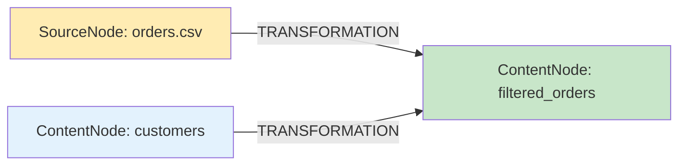
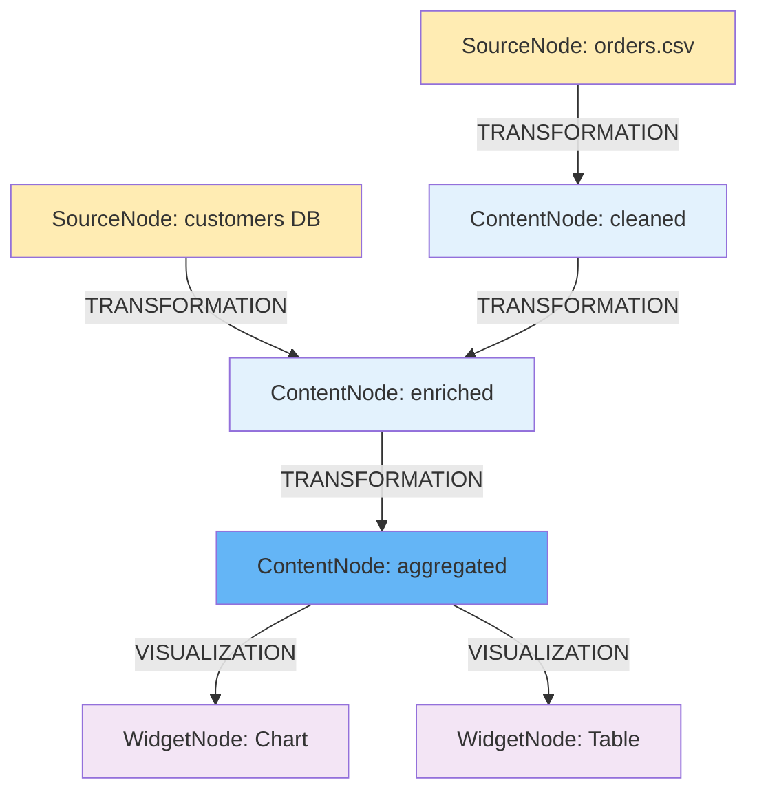

# Data-Centric Canvas: Система узлов и трансформаций

## 🎯 Executive Summary

GigaBoard построен на парадигме **Data-Centric Canvas** — вместо размещения виджетов на канвасе, система работает с **узлами данных** и их **трансформациями**. Это выводит продукт за рамки чистой визуализации к **инструменту создания и автоматизации data pipelines** с AI-ассистентом.

### Ключевые концепции

- **Данные первичны, визуализация вторична.** Каждый объект на канвасе содержит данные (SourceNode/ContentNode), визуализирует их (WidgetNode) или аннотирует (CommentNode)
- **SourceNode наследует ContentNode** — источник данных хранит и конфигурацию, и извлечённые данные в одной ноде
- **5 типов связей**: TRANSFORMATION, VISUALIZATION, COMMENT, REFERENCE, DRILL_DOWN
- **Произвольный Python код** для трансформаций — не ограничены шаблонами
- **Автоматический replay** — обновление source запускает перепросчёт всего pipeline

### Правила создания узлов

- **SourceNode** — точка входа данных, создаётся пользователем (файл, API, БД, AI Research, ручной ввод)
- **ContentNode** — создаётся как результат трансформации одного или нескольких SourceNode/ContentNode
- **WidgetNode** — визуализация ContentNode/SourceNode. Требует VISUALIZATION edge, не существует без привязки к данным
- **CommentNode** — аннотация к SourceNode, ContentNode или WidgetNode. Не создаётся изолированно
- Удаление **SourceNode/ContentNode** → каскадное удаление связанных WidgetNode и CommentNode

---

## Типы узлов на канвасе

### 1. SourceNode (узел-источник данных)

**Назначение**: Точка входа данных в pipeline. Хранит **и** конфигурацию источника, **и** извлечённые данные.

**Иерархия наследования**: `BaseNode → ContentNode → SourceNode`

SourceNode наследует все поля ContentNode (content, lineage, metadata, position) и добавляет:
- `source_type` — тип источника
- `config` — конфигурация подключения/извлечения
- `created_by` — создатель

**9 типов источников** (`SourceType` enum):

| Тип        | Описание                | Extraction                                                |
| ---------- | ----------------------- | --------------------------------------------------------- |
| `csv`      | CSV файлы               | Auto-parse с AI-определением схемы                        |
| `json`     | JSON файлы              | AI-генерация Python кода извлечения                       |
| `excel`    | Excel файлы             | Spreadsheet grid + Smart Detect + по-регионное извлечение |
| `document` | PDF/DOCX/TXT            | Multi-agent extraction + OCR                              |
| `api`      | REST API endpoint       | GET/POST с auth, retry, pagination                        |
| `database` | PostgreSQL/MySQL/SQLite | Async SQL queries                                         |
| `research` | AI Research             | Multi-agent deep research (search → research → analyze)   |
| `manual`   | Ручной ввод             | Table constructor, прямой ввод данных                     |
| `stream`   | Streaming (Phase 4)     | WebSocket, SSE, Kafka                                     |

**Структура данных SourceNode**:
```json
{
  "id": "uuid",
  "node_type": "source_node",
  "board_id": "uuid",
  "source_type": "csv",
  "config": {
    "file_id": "uploaded_file_uuid",
    "delimiter": ",",
    "encoding": "utf-8"
  },
  "content": {
    "text": "Sales data for Q1 2024. 1500 rows, 5 columns.",
    "tables": [
      {
        "id": "sales_table",
        "name": "Sales",
        "columns": [
          {"name": "region", "type": "string"},
          {"name": "amount", "type": "number"},
          {"name": "date", "type": "string"}
        ],
        "rows": [
          ["North", 45000, "2024-01-15"],
          ["South", 38000, "2024-01-15"]
        ]
      }
    ]
  },
  "lineage": {},
  "position": {"x": 100, "y": 200},
  "created_by": "user_uuid"
}
```

### 2. ContentNode (узел данных — результат обработки)

**Назначение**: Результат трансформации одного или нескольких SourceNode/ContentNode.

**Иерархия**: `BaseNode → ContentNode`

**Поля**:
- `content` — данные: `{text: str, tables: [{id, name, columns, rows}]}`
- `lineage` — data lineage: `{source_node_id, transformation_id, parent_content_ids}`
- `node_metadata` — метаданные: `{row_count, table_count, data_quality}`
- `position` — позиция на канвасе: `{x, y}`

**Структура content**:
```json
{
  "text": "Filtered sales — only Europe region. 320 rows remain.",
  "tables": [
    {
      "id": "filtered_sales",
      "name": "European Sales",
      "columns": [
        {"name": "region", "type": "string"},
        {"name": "amount", "type": "number"}
      ],
      "rows": [
        ["Germany", 125000],
        ["France", 98000]
      ]
    }
  ]
}
```

### 3. WidgetNode (узел визуализации)

**Назначение**: HTML/CSS/JS визуализация ContentNode или SourceNode.

**Характеристики**:
- Создаётся через **WidgetCodexAgent** на основе анализа данных (итеративный чат в WidgetDialog)
- Содержит сгенерированный HTML/CSS/JS код (Chart.js, Plotly, D3, ECharts)
- Связан с родительским ContentNode/SourceNode через VISUALIZATION edge
- Множественные WidgetNode могут визуализировать один ContentNode
- Имеет **только верхний Handle** — данные «текут» сверху вниз

**Поля**: `html_code`, `css_code`, `js_code`, `description`, `auto_refresh`, `generated_by`, `generation_prompt`

### 4. CommentNode (узел комментария)

**Назначение**: Аннотации, заметки, инсайты от пользователей или AI.

**Характеристики**:
- Текстовые комментарии с Markdown поддержкой
- AI-сгенерированные инсайты (аномалии, паттерны)
- Привязаны к SourceNode/ContentNode/WidgetNode через COMMENT edge
- Поддержка resolve/unresolve статуса

---

## Типы связей (Edges)

5 типов связей определяют отношения между узлами:

### 1. TRANSFORMATION (трансформация данных)

**Направление**: SourceNode/ContentNode → ContentNode

**Характеристики**:
- Множественные источники: N source nodes → 1 target ContentNode
- Произвольный Python код, сгенерированный **TransformCodexAgent** / пайплайном трансформаций
- Автоматический replay при обновлении source данных
- Код версионируется



### 2. VISUALIZATION (визуализация)

**Направление**: ContentNode/SourceNode → WidgetNode

- Один ContentNode может иметь множественные визуализации
- WidgetCodexAgent генерирует HTML/CSS/JS код виджета (см. [WIDGET_GENERATION_SYSTEM.md](WIDGET_GENERATION_SYSTEM.md))
- Авто-обновление при изменении данных

### 3. COMMENT (комментирование)

**Направление**: CommentNode → SourceNode/ContentNode/WidgetNode

### 4. REFERENCE (ссылка)

**Направление**: любой → любой (справочные связи)

### 5. DRILL_DOWN (детализация)

**Направление**: ContentNode/WidgetNode → ContentNode/WidgetNode (навигация от сводных к детальным данным)

---

## Процесс работы с трансформациями

### 1. Создание трансформации

**Входные данные**:
- Source node(s): один или несколько SourceNode/ContentNode
- Текстовое описание задачи от пользователя

**Процесс**:
1. **TransformCodexAgent** (через контроллер трансформаций) получает запрос
2. Анализирует source node(s): тип данных, схему, размер, примеры
3. Генерирует Python код для трансформации
4. Валидирует код (AST parsing, security check)
5. Выполняет в sandbox с resource limits
6. Создаёт target ContentNode с результатом
7. Создаёт TRANSFORMATION edge(s): source → target
8. Сохраняет код трансформации и метаданные

**Пример**:
```
Пользователь: "Отфильтруй продажи где сумма > 10000, сгруппируй по категориям"

→ TransformCodex генерирует:

def transform(source_tables, gb):
    import pandas as pd
    df = source_tables["sales"]
    filtered = df[df['amount'] > 10000]
    result = filtered.groupby('category')['amount'].mean().reset_index()
    return {"result": result}
```

### 2. Автоматизация (replay трансформаций)

**Сценарий**: Source node обновляется (пользователь загрузил новый файл)

**Процесс**:
1. Система детектирует изменение source node
2. Находит downstream трансформации (DAG traversal)
3. Выполняет replay в топологическом порядке
4. Обновляет все target ContentNode
5. Обновляет все downstream WidgetNode (авто-refresh)
6. Отправляет real-time события через Socket.IO

### 3. Data Lineage (граф зависимостей)



---

## Примеры использования

### Пример 1: Простой data pipeline

```
[SourceNode: sales.csv] 
      ↓ TRANSFORMATION (filter region='Europe')
[ContentNode: filtered_sales]
      ↓ VISUALIZATION
[WidgetNode: Line Chart]
```

### Пример 2: Многовходовая трансформация

```
[SourceNode: orders] ──────┐
                           │ TRANSFORMATION (join + LTV)
[SourceNode: customers] ───┘
                           ↓
             [ContentNode: customer_ltv]
                           ↓ VISUALIZATION
                 [WidgetNode: Table]
```

### Пример 3: Pipeline с AI Resolver

```
[SourceNode: names.csv]
      ↓ TRANSFORMATION (gb.ai_resolve_batch → определение пола)
[ContentNode: names_with_gender]
      ↓ VISUALIZATION
[WidgetNode: Distribution Chart]
```

---

## Технические детали

### Безопасность выполнения кода

**Sandbox с ограничениями**:
- Timeout: max 60 seconds
- Memory: max 512 MB
- Disk: max 100 MB
- Network: whitelist URLs only
- No file system write, no subprocess

**Валидация кода**: AST parsing, security scan (no eval/exec), linting

### Масштабируемость

- Chunked processing для больших данных
- Task queue для множественных трансформаций
- Параллельное выполнение независимых трансформаций
- Caching промежуточных результатов

---

> **Предыдущая версия**: Устаревший документ с DataNode-терминологией доступен в [history/DATA_NODE_SYSTEM_LEGACY.md](history/DATA_NODE_SYSTEM_LEGACY.md)

**Статус**: Актуален  
**Версия**: 2.0  
**Последнее обновление**: 2026-03-01 (WidgetCodexAgent, ссылка на WIDGET_GENERATION_SYSTEM)
