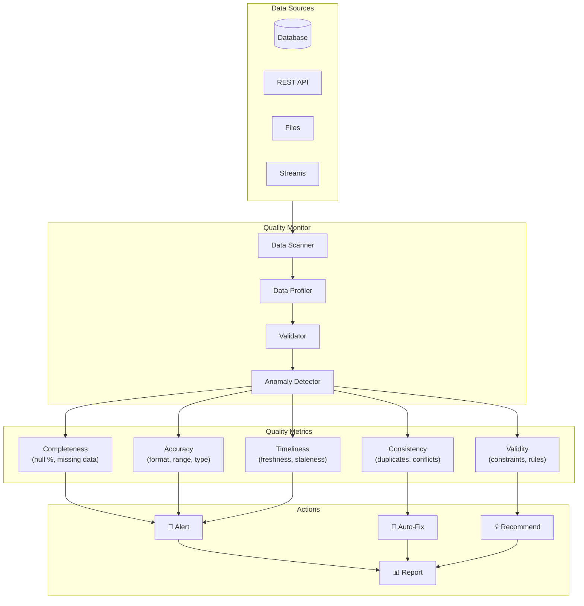

# AI-Powered Data Quality Monitor

**Статус**: 🚧 Планируется  
**Приоритет**: Should Have (Phase 4)  
**Дата создания**: 24 января 2026

---

## 📋 Обзор

**AI-Powered Data Quality Monitor** — интеллектуальная система мониторинга качества данных, которая автоматически обнаруживает проблемы и предлагает решения.

### Ключевые возможности
- 🔍 **Auto-Detection**: Автоматическое обнаружение проблем с данными
- 📊 **Quality Metrics**: Полнота, точность, консистентность, актуальность
- 🚨 **Real-Time Alerts**: Мгновенные уведомления о проблемах
- 🤖 **AI Recommendations**: Умные предложения по исправлению
- 📈 **Quality Trends**: Отслеживание динамики качества
- 🔧 **Auto-Fix**: Автоматическое исправление простых проблем
- 📝 **Data Profiling**: Анализ распределений и паттернов
- 🎯 **Anomaly Detection**: Обнаружение статистических аномалий

---

## 🏗️ Архитектура

### Data Quality Dimensions



### Database Schema

```python
class DataQualityRule(Base):
    """Правило качества данных"""
    __tablename__ = 'data_quality_rules'
    
    id = Column(UUID, primary_key=True, default=uuid4)
    
    # Target
    data_source_id = Column(UUID, ForeignKey('data_sources.id'))
    table_name = Column(String(200))
    column_name = Column(String(200))
    
    # Rule definition
    rule_type = Column(Enum(
        'not_null',           # Column should not be null
        'unique',             # Values should be unique
        'range',              # Value within range
        'format',             # Matches pattern/format
        'reference',          # Foreign key integrity
        'freshness',          # Data updated within timeframe
        'completeness',       # Percentage of non-null values
        'custom'              # Custom SQL/Python check
    ))
    
    rule_config = Column(JSONB)
    # Examples:
    # {'min': 0, 'max': 100} for range
    # {'pattern': r'^\d{3}-\d{2}-\d{4}$'} for format
    # {'max_age_hours': 24} for freshness
    
    # Severity
    severity = Column(Enum('critical', 'high', 'medium', 'low'))
    
    # Status
    is_active = Column(Boolean, default=True)
    last_checked = Column(DateTime)
    
    created_by = Column(UUID, ForeignKey('users.id'))
    created_at = Column(DateTime, default=datetime.utcnow)


class DataQualityIssue(Base):
    """Обнаруженная проблема качества"""
    __tablename__ = 'data_quality_issues'
    
    id = Column(UUID, primary_key=True, default=uuid4)
    rule_id = Column(UUID, ForeignKey('data_quality_rules.id'))
    data_source_id = Column(UUID)
    
    # Issue details
    issue_type = Column(String(100))
    title = Column(String(300))
    description = Column(Text)
    
    # Affected data
    table_name = Column(String(200))
    column_name = Column(String(200))
    affected_row_count = Column(Integer)
    total_row_count = Column(Integer)
    sample_values = Column(JSONB)  # Examples of bad data
    
    # Severity
    severity = Column(Enum('critical', 'high', 'medium', 'low'))
    impact_score = Column(Float)  # 0-1
    
    # AI analysis
    ai_diagnosis = Column(Text)
    ai_recommendation = Column(Text)
    ai_confidence = Column(Float)
    
    # Auto-fix
    is_auto_fixable = Column(Boolean, default=False)
    auto_fix_strategy = Column(JSONB)
    
    # Status
    status = Column(Enum('open', 'in_progress', 'resolved', 'ignored'))
    resolved_at = Column(DateTime)
    resolved_by = Column(UUID, ForeignKey('users.id'))
    resolution_note = Column(Text)
    
    # Tracking
    detected_at = Column(DateTime, default=datetime.utcnow)
    notification_sent = Column(Boolean, default=False)
    
    # Widget impact
    affected_widget_ids = Column(ARRAY(UUID))


class DataQualityMetric(Base):
    """Метрики качества данных"""
    __tablename__ = 'data_quality_metrics'
    
    id = Column(UUID, primary_key=True, default=uuid4)
    data_source_id = Column(UUID)
    table_name = Column(String(200))
    
    # Quality scores (0-100)
    completeness_score = Column(Float)
    accuracy_score = Column(Float)
    consistency_score = Column(Float)
    timeliness_score = Column(Float)
    validity_score = Column(Float)
    overall_score = Column(Float)
    
    # Details
    total_rows = Column(Integer)
    null_count = Column(Integer)
    duplicate_count = Column(Integer)
    invalid_count = Column(Integer)
    
    # Timestamp
    measured_at = Column(DateTime, default=datetime.utcnow)


class DataProfile(Base):
    """Профиль данных (статистика)"""
    __tablename__ = 'data_profiles'
    
    id = Column(UUID, primary_key=True, default=uuid4)
    data_source_id = Column(UUID)
    table_name = Column(String(200))
    column_name = Column(String(200))
    
    # Statistics
    data_type = Column(String(50))
    non_null_count = Column(Integer)
    null_count = Column(Integer)
    null_percentage = Column(Float)
    
    # Numeric stats
    min_value = Column(Float)
    max_value = Column(Float)
    mean_value = Column(Float)
    median_value = Column(Float)
    std_dev = Column(Float)
    
    # Categorical stats
    unique_count = Column(Integer)
    most_common_values = Column(JSONB)  # Top 10 values with counts
    
    # Distribution
    histogram = Column(JSONB)  # Bin counts
    percentiles = Column(JSONB)  # p10, p25, p50, p75, p90
    
    profiled_at = Column(DateTime, default=datetime.utcnow)
```

---

## 🔍 Data Quality Checks

### Quality Check Engine

```python
class DataQualityChecker:
    """Проверка качества данных"""
    
    async def run_all_checks(self, data_source_id: UUID):
        """Запуск всех проверок для источника"""
        
        # Get active rules
        rules = await self._get_active_rules(data_source_id)
        
        issues = []
        
        for rule in rules:
            issue = await self._check_rule(rule)
            if issue:
                issues.append(issue)
        
        # Run AI-powered anomaly detection
        ai_issues = await self._ai_anomaly_detection(data_source_id)
        issues.extend(ai_issues)
        
        # Calculate quality metrics
        metrics = await self._calculate_metrics(data_source_id, issues)
        
        # Send alerts if needed
        await self._send_alerts(issues)
        
        return {
            'issues': issues,
            'metrics': metrics
        }
    
    async def _check_rule(self, rule: DataQualityRule) -> Optional[DataQualityIssue]:
        """Проверка конкретного правила"""
        
        if rule.rule_type == 'not_null':
            return await self._check_not_null(rule)
        
        elif rule.rule_type == 'unique':
            return await self._check_unique(rule)
        
        elif rule.rule_type == 'range':
            return await self._check_range(rule)
        
        elif rule.rule_type == 'format':
            return await self._check_format(rule)
        
        elif rule.rule_type == 'freshness':
            return await self._check_freshness(rule)
        
        elif rule.rule_type == 'completeness':
            return await self._check_completeness(rule)
        
        elif rule.rule_type == 'custom':
            return await self._check_custom(rule)
    
    async def _check_not_null(self, rule: DataQualityRule) -> Optional[DataQualityIssue]:
        """Проверка на null значения"""
        
        query = f"""
            SELECT COUNT(*) as null_count, 
                   (SELECT COUNT(*) FROM {rule.table_name}) as total_count
            FROM {rule.table_name}
            WHERE {rule.column_name} IS NULL
        """
        
        result = await db.execute(query)
        null_count = result['null_count']
        total_count = result['total_count']
        
        if null_count > 0:
            percentage = (null_count / total_count) * 100
            
            return DataQualityIssue(
                rule_id=rule.id,
                data_source_id=rule.data_source_id,
                issue_type='null_values',
                title=f"Null values found in {rule.column_name}",
                description=f"{null_count} null values ({percentage:.1f}%) found",
                table_name=rule.table_name,
                column_name=rule.column_name,
                affected_row_count=null_count,
                total_row_count=total_count,
                severity=rule.severity,
                is_auto_fixable=True,
                auto_fix_strategy={
                    'method': 'fill_with_default',
                    'default_value': rule.rule_config.get('default_value')
                }
            )
        
        return None
    
    async def _check_unique(self, rule: DataQualityRule) -> Optional[DataQualityIssue]:
        """Проверка уникальности"""
        
        query = f"""
            SELECT {rule.column_name}, COUNT(*) as count
            FROM {rule.table_name}
            GROUP BY {rule.column_name}
            HAVING COUNT(*) > 1
        """
        
        duplicates = await db.execute(query)
        
        if len(duplicates) > 0:
            duplicate_count = sum(d['count'] - 1 for d in duplicates)
            
            return DataQualityIssue(
                rule_id=rule.id,
                issue_type='duplicates',
                title=f"Duplicate values in {rule.column_name}",
                description=f"{duplicate_count} duplicate rows found",
                affected_row_count=duplicate_count,
                sample_values=[d[rule.column_name] for d in duplicates[:10]],
                severity=rule.severity,
                is_auto_fixable=True,
                auto_fix_strategy={'method': 'remove_duplicates', 'keep': 'first'}
            )
        
        return None
    
    async def _check_freshness(self, rule: DataQualityRule) -> Optional[DataQualityIssue]:
        """Проверка актуальности данных"""
        
        max_age_hours = rule.rule_config['max_age_hours']
        timestamp_column = rule.rule_config.get('timestamp_column', 'updated_at')
        
        query = f"""
            SELECT MAX({timestamp_column}) as last_update
            FROM {rule.table_name}
        """
        
        result = await db.execute(query)
        last_update = result['last_update']
        
        if last_update:
            age_hours = (datetime.utcnow() - last_update).total_seconds() / 3600
            
            if age_hours > max_age_hours:
                return DataQualityIssue(
                    rule_id=rule.id,
                    issue_type='stale_data',
                    title=f"Stale data in {rule.table_name}",
                    description=f"Data is {age_hours:.1f} hours old (max: {max_age_hours}h)",
                    severity=rule.severity,
                    is_auto_fixable=False
                )
        
        return None


# AI-Powered Anomaly Detection

class AIAnomalyDetector:
    """AI обнаружение аномалий"""
    
    async def detect_anomalies(
        self,
        data_source_id: UUID,
        table_name: str
    ) -> List[DataQualityIssue]:
        """Обнаружение аномалий с помощью AI"""
        
        # Get data profile
        profile = await self._get_data_profile(data_source_id, table_name)
        
        # Get recent data samples
        samples = await self._get_data_samples(data_source_id, table_name, limit=1000)
        
        # Use AI to analyze
        prompt = f"""
        Analyze this data for quality issues and anomalies.
        
        Data Profile:
        {json.dumps(profile, indent=2)}
        
        Sample Data (first 20 rows):
        {json.dumps(samples[:20], indent=2)}
        
        Look for:
        1. Unexpected value distributions
        2. Outliers beyond reasonable bounds
        3. Pattern breaks (e.g., sudden format changes)
        4. Missing required relationships
        5. Data type inconsistencies
        
        For each issue found, provide:
        - Issue type
        - Description
        - Severity (critical/high/medium/low)
        - Affected row estimate
        - Recommendation for fixing
        
        Return as JSON array.
        """
        
        response = await gigachat.ask(prompt)
        ai_findings = json.loads(response)
        
        issues = []
        for finding in ai_findings:
            issue = DataQualityIssue(
                data_source_id=data_source_id,
                issue_type=finding['type'],
                title=finding['title'],
                description=finding['description'],
                table_name=table_name,
                severity=finding['severity'],
                ai_diagnosis=finding['description'],
                ai_recommendation=finding['recommendation'],
                ai_confidence=finding.get('confidence', 0.8)
            )
            issues.append(issue)
        
        return issues
```

---

## 🔧 Auto-Fix System

### Automatic Issue Resolution

```python
class AutoFixEngine:
    """Автоматическое исправление проблем"""
    
    async def auto_fix_issue(self, issue: DataQualityIssue) -> bool:
        """Автоматическое исправление проблемы"""
        
        if not issue.is_auto_fixable:
            return False
        
        strategy = issue.auto_fix_strategy
        
        try:
            if strategy['method'] == 'fill_with_default':
                await self._fill_nulls(issue, strategy['default_value'])
            
            elif strategy['method'] == 'remove_duplicates':
                await self._remove_duplicates(issue, keep=strategy.get('keep', 'first'))
            
            elif strategy['method'] == 'truncate_values':
                await self._truncate_values(issue, strategy['max_length'])
            
            elif strategy['method'] == 'cast_type':
                await self._cast_type(issue, strategy['target_type'])
            
            # Mark as resolved
            issue.status = 'resolved'
            issue.resolved_at = datetime.utcnow()
            issue.resolution_note = f"Auto-fixed using {strategy['method']}"
            
            await db.commit()
            
            return True
        
        except Exception as e:
            logger.error(f"Auto-fix failed for issue {issue.id}: {e}")
            return False
    
    async def _fill_nulls(self, issue: DataQualityIssue, default_value):
        """Заполнение null значений"""
        
        query = f"""
            UPDATE {issue.table_name}
            SET {issue.column_name} = :default_value
            WHERE {issue.column_name} IS NULL
        """
        
        await db.execute(query, {'default_value': default_value})
    
    async def _remove_duplicates(self, issue: DataQualityIssue, keep='first'):
        """Удаление дубликатов"""
        
        if keep == 'first':
            query = f"""
                DELETE FROM {issue.table_name}
                WHERE id NOT IN (
                    SELECT MIN(id)
                    FROM {issue.table_name}
                    GROUP BY {issue.column_name}
                )
            """
        
        await db.execute(query)
```

---

## 📊 Quality Dashboard

### UI Components

```tsx
// DataQualityDashboard.tsx

export const DataQualityDashboard: React.FC = () => {
  const { data: metrics } = useQuery(['quality-metrics']);
  const { data: issues } = useQuery(['quality-issues']);

  return (
    <div className="p-6">
      {/* Overall Score */}
      <div className="mb-6">
        <QualityScoreCard
          overall={metrics?.overall_score}
          completeness={metrics?.completeness_score}
          accuracy={metrics?.accuracy_score}
          consistency={metrics?.consistency_score}
          timeliness={metrics?.timeliness_score}
          validity={metrics?.validity_score}
        />
      </div>

      {/* Issues by Severity */}
      <div className="grid grid-cols-4 gap-4 mb-6">
        <IssueCountCard severity="critical" count={issues?.critical || 0} />
        <IssueCountCard severity="high" count={issues?.high || 0} />
        <IssueCountCard severity="medium" count={issues?.medium || 0} />
        <IssueCountCard severity="low" count={issues?.low || 0} />
      </div>

      {/* Active Issues */}
      <IssuesList issues={issues?.items || []} />
    </div>
  );
};
```

---

## 🚀 Implementation Roadmap

### Phase 1: Core Monitoring (3 weeks)
- ✅ Rule engine
- ✅ Basic checks (nulls, duplicates, formats)
- ✅ Issue detection & logging

### Phase 2: AI Integration (2 weeks)
- ✅ Anomaly detection
- ✅ AI recommendations
- ✅ Pattern recognition

### Phase 3: Auto-Fix (2 weeks)
- ✅ Auto-fix engine
- ✅ Safe resolution strategies
- ✅ Rollback support

### Phase 4: UI & Alerts (2 weeks)
- ✅ Quality dashboard
- ✅ Real-time alerts
- ✅ Trend visualization

---

## 🎯 Success Metrics

- **Issue Detection**: 95%+ качественных проблем обнаружено
- **False Positives**: <5% ложных срабатываний
- **Auto-Fix Success**: 80%+ проблем исправлено автоматически
- **Response Time**: Alerts отправлены в течение 5 минут
- **Data Quality Improvement**: 30% улучшение overall quality score

---

**Последнее обновление**: 24 января 2026
