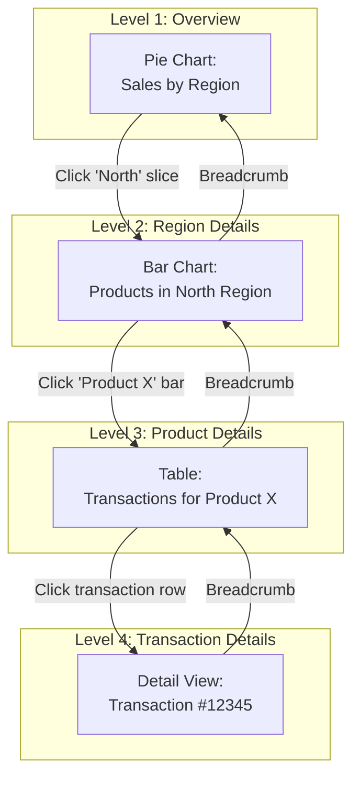

# Interactive Widget Drill-Down System

**Статус**: 🚧 Планируется  
**Приоритет**: Must Have (Phase 2)  
**Дата создания**: 24 января 2026

---

## 📋 Обзор

**Interactive Widget Drill-Down** — система интерактивных виджетов, позволяющая пользователям кликать на элементы графиков для получения детальной информации.

### Ключевые возможности
- 🖱️ **Click-to-Drill**: Клик на любой элемент графика открывает детали
- 🎯 **Auto-Filter**: Автоматическое создание фильтрованных виджетов
- 🔗 **Parent-Child Links**: Связь между родительским и дочерним виджетом
- 🗂️ **Breadcrumb Navigation**: Путь навигации "назад к обзору"
- 📊 **Multiple Levels**: Многоуровневый drill-down (категория → продукт → транзакция)
- 🤖 **AI Suggestions**: AI предлагает полезные drill-downs
- 💾 **Save Drill Paths**: Сохранение часто используемых путей
- ⚡ **Fast Navigation**: Мгновенное переключение между уровнями

---

## 🏗️ Архитектура

### Drill-Down Flow



### Database Schema

```python
class WidgetDrillDownConfig(Base):
    """Конфигурация drill-down для виджета"""
    __tablename__ = 'widget_drill_down_configs'
    
    id = Column(UUID, primary_key=True, default=uuid4)
    widget_id = Column(UUID, ForeignKey('widgets.id'))
    
    # Drill-down behavior
    is_enabled = Column(Boolean, default=True)
    drill_down_type = Column(Enum(
        'auto',      # AI automatically creates drill-down
        'manual',    # User configures drill-down
        'template'   # Use predefined template
    ))
    
    # Target configuration
    target_widget_type = Column(String(50))  # Deprecated - use user_prompt instead
    target_config = Column(JSONB)
    # {
    #   'user_prompt': 'Create bar chart showing products grouped by name',
    #   'data_source': 'same_as_parent',
    #   'filters': [
    #     {'field': 'region', 'operator': '=', 'value': '$clicked_value'}
    #   ],
    #   'group_by': ['product_name'],
    #   'aggregation': 'sum'
    # }
    
    # Click target mapping
    click_targets = Column(JSONB)
    # [
    #   {'element': 'pie_slice', 'maps_to': 'region'},
    #   {'element': 'bar', 'maps_to': 'product_id'},
    #   {'element': 'table_row', 'maps_to': 'transaction_id'}
    # ]
    
    # Display options
    display_mode = Column(Enum(
        'modal',      # Open in modal dialog
        'panel',      # Open in side panel
        'inline',     # Replace current widget
        'new_widget'  # Add as new widget to board
    ))
    
    # Animation
    animation_type = Column(String(50))  # 'slide', 'fade', 'zoom'
    
    created_at = Column(DateTime, default=datetime.utcnow)
    updated_at = Column(DateTime, onupdate=datetime.utcnow)


class DrillDownInstance(Base):
    """Активная drill-down сессия"""
    __tablename__ = 'drill_down_instances'
    
    id = Column(UUID, primary_key=True, default=uuid4)
    user_id = Column(UUID, ForeignKey('users.id'))
    board_id = Column(UUID, ForeignKey('boards.id'))
    
    # Drill path (breadcrumb trail)
    drill_path = Column(JSONB)
    # [
    #   {'level': 0, 'widget_id': 'parent', 'label': 'All Sales'},
    #   {'level': 1, 'widget_id': 'child1', 'label': 'North Region', 'filter': {'region': 'North'}},
    #   {'level': 2, 'widget_id': 'child2', 'label': 'Product X', 'filter': {'product_id': 123}}
    # ]
    
    current_level = Column(Integer, default=0)
    max_level = Column(Integer)
    
    # Temporary widgets created for drill-down
    temp_widget_ids = Column(ARRAY(UUID))
    
    # Status
    is_active = Column(Boolean, default=True)
    started_at = Column(DateTime, default=datetime.utcnow)
    last_interaction = Column(DateTime, default=datetime.utcnow)


class DrillDownTemplate(Base):
    """Шаблон drill-down пути"""
    __tablename__ = 'drill_down_templates'
    
    id = Column(UUID, primary_key=True, default=uuid4)
    
    name = Column(String(200))
    description = Column(Text)
    category = Column(String(100))  # 'sales', 'marketing', 'product'
    
    # Template definition
    levels = Column(JSONB)
    # [
    #   {
    #     'level': 0,
    #     'name': 'Overview',
    #     'user_prompt': 'Create pie chart showing sales by region',
    #     'group_by': ['region'],
    #     'metric': 'sum(sales)'
    #   },
    #   {
    #     'level': 1,
    #     'name': 'Region Detail',
    #     'user_prompt': 'Create bar chart showing sales by product category',
    #     'group_by': ['product_category'],
    #     'filters': [{'field': 'region', 'value': '$parent_click'}]
    #   },
    #   {
    #     'level': 2,
    #     'name': 'Product List',
    #     'user_prompt': 'Create table with product details including name, sales, and units',
    #     'columns': ['product_name', 'sales', 'units'],
    #     'filters': [
    #       {'field': 'region', 'value': '$level_0_click'},
    #       {'field': 'category', 'value': '$level_1_click'}
    #     ]
    #   }
    # ]
    
    # Metadata
    usage_count = Column(Integer, default=0)
    rating = Column(Float)
    
    is_public = Column(Boolean, default=False)
    created_by = Column(UUID, ForeignKey('users.id'))
    created_at = Column(DateTime, default=datetime.utcnow)
```

---

## 🖱️ Click Handler System

### Event Handling

```typescript
// WidgetClickHandler.tsx

interface ClickEvent {
  widget_id: string;
  element_type: 'pie_slice' | 'bar' | 'line_point' | 'table_row' | 'heatmap_cell';
  clicked_value: any;
  metadata: Record<string, any>;
}

export class DrillDownManager {
  private activeDrillDown: DrillDownInstance | null = null;

  async handleWidgetClick(event: ClickEvent) {
    // Get drill-down config
    const config = await this.getDrillDownConfig(event.widget_id);
    
    if (!config || !config.is_enabled) {
      return; // No drill-down configured
    }

    // Create or extend drill-down instance
    if (!this.activeDrillDown) {
      this.activeDrillDown = await this.startDrillDown(event.widget_id);
    }

    // Build child widget
    const childWidget = await this.buildDrillDownWidget(
      config,
      event.clicked_value,
      event.metadata
    );

    // Display child widget
    await this.displayDrillDownWidget(childWidget, config.display_mode);

    // Update drill path
    await this.updateDrillPath(event);
  }

  async buildDrillDownWidget(
    config: WidgetDrillDownConfig,
    clickedValue: any,
    metadata: Record<string, any>
  ): Promise<Widget> {
    if (config.drill_down_type === 'auto') {
      // AI creates drill-down automatically
      return await this.aiGenerateDrillDown(config, clickedValue, metadata);
    } else {
      // Use manual configuration
      return await this.manualDrillDown(config, clickedValue);
    }
  }

  async aiGenerateDrillDown(
    config: WidgetDrillDownConfig,
    clickedValue: any,
    metadata: Record<string, any>
  ): Promise<Widget> {
    // Ask AI to create appropriate drill-down
    const prompt = `
      User clicked on "${clickedValue}" in a visualization widget.
      
      Context:
      - Parent widget shows: ${metadata.parent_summary}
      - Clicked element represents: ${metadata.dimension}
      - Current filters: ${JSON.stringify(metadata.filters)}
      
      Generate complete HTML/CSS/JS code for a drill-down widget that shows detailed breakdown of this selection.
      Consider:
      1. What level of detail makes sense
      2. Best visualization approach for drill-down
      3. Relevant metrics and dimensions
      
      Return JSON config for the child widget.
    `;

    const aiResponse = await gigachat.ask(prompt);
    const childConfig = JSON.parse(aiResponse);

    // Create temporary widget
    return await this.createTempWidget(childConfig);
  }

  async displayDrillDownWidget(widget: Widget, mode: string) {
    switch (mode) {
      case 'modal':
        this.openModal(widget);
        break;
      
      case 'panel':
        this.openSidePanel(widget);
        break;
      
      case 'inline':
        this.replaceWidget(widget);
        break;
      
      case 'new_widget':
        this.addWidgetToBoard(widget);
        break;
    }
  }
}
```

---

## 🎯 Auto-Filter Generation

### Filter Builder

```python
class DrillDownFilterBuilder:
    """Построение фильтров для drill-down"""
    
    def build_filter(
        self,
        parent_widget: Widget,
        clicked_element: Dict,
        drill_config: WidgetDrillDownConfig
    ) -> List[Dict]:
        """Построение фильтров на основе клика"""
        
        filters = []
        
        # Map clicked element to filter
        for target in drill_config.click_targets:
            if target['element'] == clicked_element['type']:
                field = target['maps_to']
                value = clicked_element['value']
                
                filters.append({
                    'field': field,
                    'operator': '=',
                    'value': value
                })
        
        # Inherit parent filters
        if parent_widget.filters:
            filters.extend(parent_widget.filters)
        
        return filters
    
    def build_query(
        self,
        base_query: str,
        filters: List[Dict],
        group_by: List[str],
        aggregations: List[Dict]
    ) -> str:
        """Построение SQL запроса для drill-down"""
        
        # Add WHERE clauses
        where_clauses = []
        for f in filters:
            where_clauses.append(f"{f['field']} {f['operator']} '{f['value']}'")
        
        # Build query
        query = f"""
            SELECT 
                {', '.join(group_by)},
                {', '.join([f"{a['func']}({a['field']}) as {a['alias']}" for a in aggregations])}
            FROM {base_query}
            WHERE {' AND '.join(where_clauses)}
            GROUP BY {', '.join(group_by)}
            ORDER BY {aggregations[0]['alias']} DESC
        """
        
        return query
```

---

## 🍞 Breadcrumb Navigation

### Navigation Component

```tsx
// DrillDownBreadcrumb.tsx

interface BreadcrumbItem {
  level: number;
  label: string;
  widget_id: string;
  filter?: Record<string, any>;
}

export const DrillDownBreadcrumb: React.FC<{
  drillPath: BreadcrumbItem[];
  onNavigate: (level: number) => void;
}> = ({ drillPath, onNavigate }) => {
  return (
    <div className="flex items-center gap-2 px-4 py-2 bg-gray-100 dark:bg-gray-800 rounded-lg">
      {drillPath.map((item, index) => (
        <React.Fragment key={item.level}>
          <button
            onClick={() => onNavigate(item.level)}
            className={`px-3 py-1 rounded hover:bg-gray-200 dark:hover:bg-gray-700 transition-colors ${
              index === drillPath.length - 1
                ? 'font-semibold text-blue-600'
                : 'text-gray-600 dark:text-gray-400'
            }`}
          >
            {item.label}
          </button>
          
          {index < drillPath.length - 1 && (
            <ChevronRight className="w-4 h-4 text-gray-400" />
          )}
        </React.Fragment>
      ))}
      
      {/* Quick Actions */}
      <div className="ml-auto flex gap-2">
        <button
          onClick={() => onNavigate(0)}
          className="p-1 hover:bg-gray-200 dark:hover:bg-gray-700 rounded"
          title="Back to top"
        >
          <Home className="w-4 h-4" />
        </button>
        
        <button
          onClick={() => saveDrillPath(drillPath)}
          className="p-1 hover:bg-gray-200 dark:hover:bg-gray-700 rounded"
          title="Save this drill path"
        >
          <Bookmark className="w-4 h-4" />
        </button>
      </div>
    </div>
  );
};
```

---

## 🤖 AI Drill-Down Suggestions

### Suggestion Engine

```python
class DrillDownSuggestionEngine:
    """AI предложения по drill-down"""
    
    async def suggest_drill_downs(
        self,
        widget: Widget,
        user_context: Dict
    ) -> List[Dict]:
        """Предложение полезных drill-downs"""
        
        # Analyze widget data
        data_analysis = await self._analyze_widget_data(widget)
        
        # Get user behavior patterns
        user_patterns = await self._get_user_patterns(user_context['user_id'])
        
        # Use AI to suggest drill-downs
        prompt = f"""
        Suggest useful drill-down paths for this widget.
        
        Widget Description: {widget.description}
        Current Data: {json.dumps(data_analysis, indent=2)}
        
        User typically looks at: {user_patterns}
        
        Suggest 3-5 drill-down paths that would provide valuable insights.
        For each suggestion:
        1. Name the drill-down path
        2. Describe what insights it reveals
        3. Describe the visualization approach
        4. List the dimensions/filters to use
        
        Return as JSON array.
        """
        
        response = await gigachat.ask(prompt)
        suggestions = json.loads(response)
        
        return suggestions


# API Endpoint

@router.get('/api/v1/widgets/{widget_id}/drill-down-suggestions')
async def get_drill_down_suggestions(
    widget_id: UUID,
    current_user: User = Depends(get_current_user)
):
    widget = await get_widget(widget_id)
    engine = DrillDownSuggestionEngine()
    
    suggestions = await engine.suggest_drill_downs(
        widget=widget,
        user_context={'user_id': current_user.id}
    )
    
    return {'suggestions': suggestions}
```

---

## 💾 Saved Drill Paths

### Template System

```python
class DrillPathManager:
    """Управление сохраненными drill paths"""
    
    async def save_drill_path(
        self,
        user_id: UUID,
        drill_path: List[Dict],
        name: str
    ) -> DrillDownTemplate:
        """Сохранение drill path как шаблона"""
        
        # Extract pattern from drill path
        levels = []
        for step in drill_path:
            level_config = {
                'level': step['level'],
                'name': step['label'],
                'user_prompt': step.get('user_prompt', f"Create visualization for {step['label']}"),
                'filters': step.get('filter', {}),
                'group_by': step.get('group_by', []),
                'metric': step.get('metric')
            }
            levels.append(level_config)
        
        # Create template
        template = DrillDownTemplate(
            name=name,
            levels=levels,
            created_by=user_id
        )
        
        await db.add(template)
        await db.commit()
        
        return template
    
    async def apply_template(
        self,
        template: DrillDownTemplate,
        widget: Widget
    ) -> DrillDownInstance:
        """Применение сохраненного шаблона"""
        
        # Create drill-down instance from template
        instance = DrillDownInstance(
            widget_id=widget.id,
            drill_path=[],
            max_level=len(template.levels) - 1
        )
        
        # Create widgets for each level
        for level_config in template.levels:
            child_widget = await self._create_widget_from_level(
                level_config,
                widget.data_source_id
            )
            
            instance.drill_path.append({
                'level': level_config['level'],
                'widget_id': child_widget.id,
                'label': level_config['name']
            })
        
        await db.add(instance)
        await db.commit()
        
        return instance
```

---

## 📊 UI Components

### Interactive Chart with Drill-Down

```tsx
// InteractiveChart.tsx

export const InteractiveChart: React.FC<{
  widget: Widget;
  drillDownEnabled: boolean;
}> = ({ widget, drillDownEnabled }) => {
  const drillDownManager = useDrillDownManager();

  const handleElementClick = async (element: any) => {
    if (!drillDownEnabled) return;

    await drillDownManager.handleWidgetClick({
      widget_id: widget.id,
      element_type: element.type,
      clicked_value: element.value,
      metadata: {
        dimension: element.dimension,
        parent_summary: widget.title,
        filters: widget.filters
      }
    });
  };

  return (
    <div className="relative">
      {/* Chart */}
      <ResponsiveChart
        data={widget.data}
        type={widget.chart_type}
        onElementClick={handleElementClick}
        clickableElements={drillDownEnabled}
      />

      {/* Drill-Down Hint */}
      {drillDownEnabled && (
        <div className="absolute top-2 right-2 bg-blue-50 dark:bg-blue-900/20 px-3 py-1 rounded text-xs">
          🖱️ Click any element to drill down
        </div>
      )}

      {/* Active Drill-Down Indicator */}
      {drillDownManager.isActive && (
        <DrillDownBreadcrumb
          drillPath={drillDownManager.currentPath}
          onNavigate={drillDownManager.navigateToLevel}
        />
      )}
    </div>
  );
};
```

---

## 🚀 Implementation Roadmap

### Phase 1: Basic Drill-Down (2 weeks)
- ✅ Click handlers
- ✅ Auto-filter generation
- ✅ Modal display mode
- ✅ Breadcrumb navigation

### Phase 2: Multiple Display Modes (1 week)
- ✅ Side panel mode
- ✅ Inline mode
- ✅ New widget mode

### Phase 3: AI Integration (2 weeks)
- ✅ Auto drill-down suggestions
- ✅ Smart filter generation
- ✅ Pattern recognition

### Phase 4: Templates (1 week)
- ✅ Save drill paths
- ✅ Template marketplace
- ✅ One-click apply

---

## 🎯 Success Metrics

- **Adoption**: 70%+ виджетов используют drill-down
- **Engagement**: 3+ drill-down clicks per session
- **Template Usage**: 40% пользователей сохраняют drill paths
- **AI Accuracy**: 85%+ drill-down suggestions релевантны
- **User Satisfaction**: 4.5+ звезд

---

**Последнее обновление**: 24 января 2026
