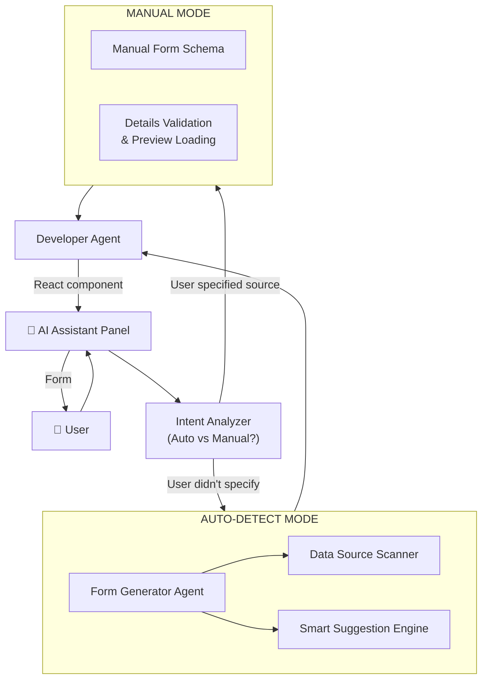

# Dynamic Form Generation System

**Последнее обновление**: 23 января 2026 | **Статус**: ✅ Включено в MVP

---

## 📖 Обзор

**Dynamic Form Generation** — система, которая позволяет AI автоматически создавать интерактивные формы ввода в процессе диалога с пользователем. Формы адаптируются под контекст, автоматически находят доступные источники данных и создают умные подсказки на основе анализа.

### Ключевые возможности
- 🔍 **Автопоиск данных**: Сканирование БД, файлов, API, Cloud storage
- ✋ **Ручной ввод**: Пользователь может явно указать источник, если он известен
- 🎨 **Динамическая генерация**: Формы создаются на лету под задачу
- 🧠 **Умные подсказки**: AI анализирует данные и предлагает опции
- 🌿 **Conditional logic**: Поля появляются/скрываются в зависимости от выбора
- ⚡ **Spinner для загрузки**: Показывает прогресс без блокировки UI
- 🔄 **Переиспользование**: Формы кэшируются и переиспользуются

---

## 🏗️ Архитектура

### Компоненты системы



### Workflow: Два режима

**Режим 1: АВТОПОИСК (Auto-detect)**
```
User: "Проанализируй продажи"
         ↓
AI анализирует намерение → НЕ УКАЗАН источник → Запуск АВТОПОИСКА
         ↓
Form Generator Agent начинает сканирование:
  1. Data Source Scanner находит источники
  2. Smart Suggestion Engine анализирует превью
  3. Генерируется форма со списком найденных источников
         ↓
Форма показывается пользователю (с Spinner при загрузке)
         ↓
User выбирает источник → Загрузка данных → Анализ
```

**Режим 2: РУЧНОЙ ВВОД (Manual)**
```
User: "Используй таблицу 'sales' из PostgreSQL хоста db.company.com"
         ↓
AI распознает явное указание → РУЧНОЙ ВВОД
         ↓
Form Generator Agent генерирует форму с полями:
  - Database Type (PostgreSQL, MySQL, MongoDB, etc.)
  - Host/Connection String
  - Database Name
  - Table/Collection Name
  - Credentials (username, password)
  - Дополнительные параметры (port, schema, etc.)
         ↓
User заполняет форму → Валидация подключения
         ↓
При подключении:
  - Проверка доступности хоста
  - Проверка учетных данных
  - Проверка существования таблицы
         ↓
Spinner: "Загружаю preview данных..."
         ↓
Smart Suggestion Engine анализирует превью
         ↓
Предложение анализа на основе найденных колонок
         ↓
User подтверждает → Полный анализ
```

---

## 🔍 Data Source Scanner

### Типы источников данных

#### 1. Локальные файлы
```python
async def scan_local_files(self, user_intent: str) -> List[DataSource]:
    """
    Сканирует файлы пользователя:
    - CSV, Excel, JSON
    - В папках: ~/Downloads, ~/Documents, ~/Desktop
    - Фильтрация по ключевым словам из intent
    """
    keywords = extract_keywords(user_intent)  # "продажи" → "sales", "продаж", etc.
    
    files = []
    search_dirs = [
        Path.home() / "Downloads",
        Path.home() / "Documents",
        Path.home() / "Desktop",
    ]
    
    for directory in search_dirs:
        for pattern in ["*.csv", "*.xlsx", "*.json"]:
            for file in directory.rglob(pattern):
                if any(kw in file.name.lower() for kw in keywords):
                    files.append(DataSource(
                        type="file",
                        name=file.name,
                        path=str(file),
                        size=file.stat().st_size,
                        modified=file.stat().st_mtime
                    ))
    
    return files
```

#### 2. Базы данных
```python
async def scan_databases(self) -> List[DataSource]:
    """
    Проверяет подключенные БД:
    - PostgreSQL, MySQL
    - MongoDB
    - Redis
    """
    databases = []
    
    # PostgreSQL/MySQL
    async with get_db_connection() as conn:
        tables = await conn.fetch("SELECT table_name FROM information_schema.tables")
        for table in tables:
            row_count = await conn.fetchval(f"SELECT COUNT(*) FROM {table['table_name']}")
            databases.append(DataSource(
                type="database",
                name=f"PostgreSQL: {table['table_name']}",
                table=table['table_name'],
                rows=row_count
            ))
    
    return databases
```

#### 3. Cloud Storage
```python
async def scan_cloud_storage(self) -> List[DataSource]:
    """
    Сканирует облачные хранилища:
    - Google Drive
    - Dropbox
    - AWS S3
    """
    sources = []
    
    # Google Drive
    if user_has_gdrive_token():
        gdrive = GoogleDriveAPI(token=get_user_token())
        files = await gdrive.search(
            query="mimeType='application/vnd.google-apps.spreadsheet' or "
                  "mimeType='text/csv'"
        )
        for file in files:
            sources.append(DataSource(
                type="google_drive",
                name=file['name'],
                file_id=file['id'],
                modified=file['modifiedTime']
            ))
    
    return sources
```

#### 4. API Integrations
```python
async def scan_api_integrations(self) -> List[DataSource]:
    """
    Проверяет подключенные API:
    - Stripe
    - Shopify
    - Custom REST APIs
    """
    apis = []
    
    # Stripe
    if user_has_stripe_key():
        apis.append(DataSource(
            type="api",
            name="Stripe Payments",
            provider="stripe",
            endpoints=["/charges", "/customers", "/products"],
            requires_auth=True
        ))
    
    return apis
```

### Ранжирование по релевантности

```python
async def rank_by_relevance(
    self, 
    sources: List[DataSource], 
    user_intent: str
) -> List[DataSource]:
    """
    Ранжирует источники по релевантности запросу.
    
    Факторы:
    1. Совпадение ключевых слов в названии (50%)
    2. Свежесть данных (20%)
    3. История использования (20%)
    4. Размер/полнота данных (10%)
    """
    keywords = extract_keywords(user_intent)
    user_history = await get_user_history_sources(self.user_id)
    
    scored_sources = []
    for source in sources:
        score = 0
        
        # 1. Keyword matching
        name_lower = source.name.lower()
        keyword_score = sum(1 for kw in keywords if kw in name_lower) / len(keywords)
        score += keyword_score * 0.5
        
        # 2. Freshness (newer = better)
        if hasattr(source, 'modified'):
            days_old = (datetime.now() - source.modified).days
            freshness_score = max(0, 1 - (days_old / 365))  # Decay over year
            score += freshness_score * 0.2
        
        # 3. User history (used before = better)
        if source.id in user_history:
            score += 0.2
        
        # 4. Completeness (more data = better)
        if hasattr(source, 'rows') and source.rows > 1000:
            score += 0.1
        
        scored_sources.append((source, score))
    
    # Sort by score descending
    scored_sources.sort(key=lambda x: x[1], reverse=True)
    
    return [source for source, _ in scored_sources]
```

---

## 🧠 Smart Suggestion Engine

### Анализ структуры данных

```python
class SmartSuggestionEngine:
    """
    Анализирует данные и генерирует умные подсказки
    """
    
    async def suggest_analysis_options(
        self, 
        data_preview: pd.DataFrame
    ) -> List[AnalysisOption]:
        """
        Анализирует preview данных и предлагает опции анализа
        """
        suggestions = []
        columns = data_preview.columns.tolist()
        
        # Detect time series
        date_cols = [col for col in columns if self._is_date_column(col, data_preview)]
        if date_cols:
            suggestions.append(AnalysisOption(
                id="time_series",
                label="Временные ряды",
                description="Анализ трендов по времени",
                enabled=True,
                reason=f"Найдена колонка с датами: {date_cols[0]}"
            ))
            
            # Check for seasonality
            if len(data_preview) > 30:
                seasonality = self._detect_seasonality(data_preview, date_cols[0])
                if seasonality:
                    suggestions.append(AnalysisOption(
                        id="seasonality",
                        label="Сезонность",
                        description="Обнаружены сезонные паттерны",
                        enabled=True,
                        recommended=True,
                        reason="Найдены повторяющиеся паттерны!"
                    ))
        
        # Detect numerical columns for analysis
        numeric_cols = data_preview.select_dtypes(include=[np.number]).columns
        if len(numeric_cols) > 0:
            # Check for anomalies
            anomalies = self._detect_anomalies(data_preview[numeric_cols[0]])
            if len(anomalies) > 0:
                suggestions.append(AnalysisOption(
                    id="anomalies",
                    label=f"Аномалии ({len(anomalies)} найдено)",
                    description="Выбросы и аномальные значения",
                    enabled=True,
                    recommended=True,
                    reason="Обнаружены значительные отклонения"
                ))
        
        # Detect categorical columns for grouping
        categorical_cols = data_preview.select_dtypes(include=['object']).columns
        if len(categorical_cols) > 0:
            unique_counts = {col: data_preview[col].nunique() for col in categorical_cols}
            good_for_grouping = [col for col, count in unique_counts.items() if 2 <= count <= 20]
            
            if good_for_grouping:
                suggestions.append(AnalysisOption(
                    id="group_by",
                    label=f"Анализ по {good_for_grouping[0]}",
                    description=f"Группировка по категориям",
                    enabled=True,
                    params={"column": good_for_grouping[0]}
                ))
        
        return suggestions
    
    def _detect_seasonality(self, df: pd.DataFrame, date_col: str) -> bool:
        """
        Проверяет наличие сезонности в данных
        Используется автокорреляция
        """
        if len(df) < 30:
            return False
        
        # Sort by date
        df = df.sort_values(date_col)
        
        # Get first numeric column
        numeric_cols = df.select_dtypes(include=[np.number]).columns
        if len(numeric_cols) == 0:
            return False
        
        values = df[numeric_cols[0]].values
        
        # Calculate autocorrelation for different lags
        from statsmodels.tsa.stattools import acf
        autocorr = acf(values, nlags=min(30, len(values) // 2))
        
        # Check if there's significant autocorrelation at lag 7 (weekly) or 30 (monthly)
        weekly_corr = autocorr[7] if len(autocorr) > 7 else 0
        monthly_corr = autocorr[30] if len(autocorr) > 30 else 0
        
        return weekly_corr > 0.5 or monthly_corr > 0.5
    
    def _detect_anomalies(self, series: pd.Series) -> List[int]:
        """
        Детектирует аномалии используя IQR метод
        """
        Q1 = series.quantile(0.25)
        Q3 = series.quantile(0.75)
        IQR = Q3 - Q1
        
        lower_bound = Q1 - 3 * IQR
        upper_bound = Q3 + 3 * IQR
        
        anomalies = series[(series < lower_bound) | (series > upper_bound)].index.tolist()
        
        return anomalies
```

---

## 📋 Form Schema Structure

### JSON Schema Format

```json
{
  "form_id": "data-source-selector-20260123-143022",
  "type": "data_source_selection",
  "title": "Выберите источник данных",
  "description": "Найдено 4 источника с данными о продажах",
  
  "fields": [
    {
      "id": "source",
      "type": "radio",
      "label": "Источник данных",
      "required": true,
      "options": [
        {
          "value": "gdrive_sales_2025",
          "label": "Google Drive",
          "sublabel": "Sales 2025.xlsx (обновлён вчера)",
          "icon": "gdrive",
          "recommended": true,
          "metadata": {
            "file_id": "1A2B3C4D",
            "size": "2.3 MB",
            "modified": "2026-01-22",
            "rows": 45230
          }
        },
        {
          "value": "postgres_sales",
          "label": "PostgreSQL Database",
          "sublabel": "Таблица: sales (1.2M записей)",
          "icon": "database",
          "metadata": {
            "table": "sales",
            "rows": 1200000
          }
        },
        {
          "value": "csv_local",
          "label": "CSV файлы (3 файла)",
          "sublabel": "/data/sales/q1-q4_2025.csv",
          "icon": "file"
        },
        {
          "value": "shopify_api",
          "label": "Shopify API",
          "sublabel": "Требуется авторизация",
          "icon": "api",
          "disabled": true,
          "disabledReason": "Подключите Shopify в настройках"
        }
      ]
    },
    
    {
      "id": "date_range",
      "type": "conditional",
      "condition": "source === 'postgres_sales'",
      "fields": [
        {
          "id": "start_date",
          "type": "date",
          "label": "С даты",
          "default": "2025-01-01",
          "min": "2020-01-01",
          "max": "2026-01-23"
        },
        {
          "id": "end_date",
          "type": "date",
          "label": "По дату",
          "default": "2025-12-31",
          "min": "2020-01-01",
          "max": "2026-01-23"
        }
      ]
    },
    
    {
      "id": "analysis_options",
      "type": "conditional",
      "condition": "source !== null",
      "fields": [
        {
          "id": "metrics",
          "type": "checkbox",
          "label": "Выберите метрики (можно несколько)",
          "options": [
            {
              "value": "revenue",
              "label": "Общая выручка по месяцам",
              "checked": true
            },
            {
              "value": "top_products",
              "label": "Топ-10 продуктов",
              "checked": true
            },
            {
              "value": "regions",
              "label": "Анализ по регионам",
              "checked": false
            },
            {
              "value": "avg_check",
              "label": "Динамика среднего чека",
              "checked": false
            }
          ]
        },
        {
          "id": "smart_suggestions",
          "type": "checkbox",
          "label": "💡 Рекомендую также",
          "description": "На основе анализа данных",
          "options": [
            {
              "value": "seasonality",
              "label": "Сезонность (найдены паттерны!)",
              "recommended": true,
              "reason": "Обнаружены повторяющиеся всплески в декабре и июне"
            },
            {
              "value": "anomalies",
              "label": "Аномалии (обнаружено 3 выброса)",
              "recommended": true,
              "reason": "Найдены значительные отклонения в марте, июле, октябре"
            }
          ]
        }
      ]
    }
  ],
  
  "actions": [
    {
      "type": "submit",
      "label": "Создать анализ",
      "style": "primary",
      "disabled_when": "source === null"
    },
    {
      "type": "button",
      "label": "Все источники",
      "action": "merge_all_sources",
      "style": "secondary"
    }
  ],
  
  "validation": {
    "rules": [
      {
        "field": "source",
        "rule": "required",
        "message": "Выберите источник данных"
      },
      {
        "field": "date_range.start_date",
        "rule": "before",
        "value": "date_range.end_date",
        "message": "Начальная дата должна быть раньше конечной"
      }
    ]
  },
  
  "smart_features": {
    "auto_detect_similar_files": true,
    "suggest_missing_data": true,
    "preview_data": true,
    "cache_results": true
  },
  
  "loading": {
    "show_spinner": true,
    "spinner_text": "Загружаю данные...",
    "estimated_time_seconds": 3
  }
}
```

---

## ⚛️ React Component Generation

### Developer Agent создаёт компонент

```typescript
// AUTO-GENERATED by Developer Agent
// Form ID: data-source-selector-20260123-143022
// Generated at: 2026-01-23 14:30:22

import { useState, useEffect } from 'react';
import { 
  RadioGroup, 
  Radio, 
  Checkbox, 
  Button, 
  DatePicker,
  Icon,
  Spinner 
} from '@/components/ui';
import { FormSchema, FormValues } from './types';

interface DynamicFormProps {
  schema: FormSchema;
  onSubmit: (values: FormValues) => Promise<void>;
  onCancel?: () => void;
}

export const DynamicForm = ({ schema, onSubmit, onCancel }: DynamicFormProps) => {
  const [values, setValues] = useState<FormValues>({});
  const [errors, setErrors] = useState<Record<string, string>>({});
  const [loading, setLoading] = useState(false);
  
  // Evaluate conditional logic
  const evaluateCondition = (condition: string): boolean => {
    try {
      // Safe evaluation in sandbox
      const func = new Function('values', `with(values) { return ${condition}; }`);
      return func(values);
    } catch {
      return false;
    }
  };
  
  // Render field based on type
  const renderField = (field: FormField) => {
    // Check condition
    if (field.condition && !evaluateCondition(field.condition)) {
      return null;
    }
    
    switch (field.type) {
      case 'radio':
        return (
          <RadioGroup
            value={values[field.id]}
            onChange={(val) => setValues({ ...values, [field.id]: val })}
          >
            {field.options?.map(option => (
              <Radio
                key={option.value}
                value={option.value}
                disabled={option.disabled}
              >
                <div className="flex items-center gap-3">
                  <Icon name={option.icon} />
                  <div>
                    <div className="font-medium">
                      {option.label}
                      {option.recommended && (
                        <span className="ml-2 text-xs bg-blue-100 text-blue-800 px-2 py-1 rounded">
                          ⭐ рекомендую
                        </span>
                      )}
                    </div>
                    <div className="text-sm text-gray-500">{option.sublabel}</div>
                  </div>
                </div>
              </Radio>
            ))}
          </RadioGroup>
        );
      
      case 'checkbox':
        return (
          <div className="space-y-2">
            <label className="text-sm font-medium">{field.label}</label>
            {field.description && (
              <p className="text-xs text-gray-500">{field.description}</p>
            )}
            {field.options?.map(option => (
              <Checkbox
                key={option.value}
                checked={values[field.id]?.includes(option.value)}
                onChange={(checked) => {
                  const current = values[field.id] || [];
                  const updated = checked
                    ? [...current, option.value]
                    : current.filter(v => v !== option.value);
                  setValues({ ...values, [field.id]: updated });
                }}
              >
                {option.label}
                {option.recommended && (
                  <span className="ml-2 text-xs text-blue-600">💡</span>
                )}
              </Checkbox>
            ))}
          </div>
        );
      
      case 'date':
        return (
          <DatePicker
            label={field.label}
            value={values[field.id]}
            onChange={(val) => setValues({ ...values, [field.id]: val })}
            min={field.min}
            max={field.max}
          />
        );
      
      case 'conditional':
        return (
          <div className="space-y-4">
            {field.fields?.map(subField => renderField(subField))}
          </div>
        );
      
      default:
        return null;
    }
  };
  
  // Validate form
  const validate = (): boolean => {
    const newErrors: Record<string, string> = {};
    
    schema.validation?.rules.forEach(rule => {
      const value = values[rule.field];
      
      if (rule.rule === 'required' && !value) {
        newErrors[rule.field] = rule.message;
      }
      
      // Add more validation rules...
    });
    
    setErrors(newErrors);
    return Object.keys(newErrors).length === 0;
  };
  
  // Handle submit
  const handleSubmit = async () => {
    if (!validate()) return;
    
    setLoading(true);
    try {
      await onSubmit(values);
    } catch (error) {
      console.error('Form submission error:', error);
    } finally {
      setLoading(false);
    }
  };
  
  return (
    <div className="dynamic-form p-6 bg-white rounded-lg shadow-sm">
      <h3 className="text-lg font-semibold mb-2">{schema.title}</h3>
      {schema.description && (
        <p className="text-sm text-gray-600 mb-6">{schema.description}</p>
      )}
      
      <div className="space-y-6">
        {schema.fields.map(field => (
          <div key={field.id}>
            {renderField(field)}
            {errors[field.id] && (
              <p className="text-sm text-red-600 mt-1">{errors[field.id]}</p>
            )}
          </div>
        ))}
      </div>
      
      <div className="flex gap-3 mt-6">
        {schema.actions.map(action => (
          <Button
            key={action.label}
            type={action.type === 'submit' ? 'submit' : 'button'}
            variant={action.style}
            onClick={action.type === 'submit' ? handleSubmit : undefined}
            disabled={loading || (action.disabled_when && evaluateCondition(action.disabled_when))}
          >
            {loading && action.type === 'submit' ? (
              <>
                <Spinner size="sm" className="mr-2" />
                {schema.loading?.spinner_text || 'Загрузка...'}
              </>
            ) : (
              action.label
            )}
          </Button>
        ))}
        
        {onCancel && (
          <Button variant="ghost" onClick={onCancel}>
            Отмена
          </Button>
        )}
      </div>
    </div>
  );
};
```

---

## 🔐 Security Considerations

### Безопасное выполнение conditional logic

```typescript
// ❌ НЕБЕЗОПАСНО: eval()
const result = eval(condition); // XSS risk!

// ✅ БЕЗОПАСНО: Sandboxed evaluation
import { create, all } from 'mathjs';

const math = create(all);
const limitedScope = {
  values: values,
  // Только безопасные операции
  eq: (a, b) => a === b,
  gt: (a, b) => a > b,
  lt: (a, b) => a < b,
};

try {
  const result = math.evaluate(condition, limitedScope);
} catch (error) {
  console.error('Invalid condition:', error);
  return false;
}
```

### Валидация schema перед использованием

```python
from pydantic import BaseModel, validator

class FormSchema(BaseModel):
    form_id: str
    type: str
    fields: List[FormField]
    
    @validator('form_id')
    def validate_form_id(cls, v):
        if not re.match(r'^[a-z0-9-]+$', v):
            raise ValueError('Invalid form_id format')
        return v
    
    @validator('fields')
    def validate_no_malicious_code(cls, v):
        # Check for suspicious patterns
        for field in v:
            if field.get('condition'):
                if any(word in field['condition'] for word in ['eval', 'exec', 'import']):
                    raise ValueError('Malicious code detected in condition')
        return v
```

---

## 📊 Performance Optimizations

### Кэширование результатов сканирования

```python
@lru_cache(maxsize=100)
async def get_cached_data_sources(user_id: str) -> List[DataSource]:
    """
    Кэш результатов на 10 минут
    """
    sources = await scan_all_sources(user_id)
    return sources

# Redis cache
async def get_data_sources_with_redis(user_id: str) -> List[DataSource]:
    cache_key = f"data_sources:{user_id}"
    
    # Try cache first
    cached = await redis.get(cache_key)
    if cached:
        return json.loads(cached)
    
    # Scan and cache
    sources = await scan_all_sources(user_id)
    await redis.setex(cache_key, 600, json.dumps(sources))  # 10 min TTL
    
    return sources
```

### Ленивая загрузка больших списков

```typescript
// Для больших списков файлов используем виртуализацию
import { FixedSizeList } from 'react-window';

const VirtualizedOptions = ({ options }) => (
  <FixedSizeList
    height={400}
    itemCount={options.length}
    itemSize={60}
  >
    {({ index, style }) => (
      <div style={style}>
        <Radio value={options[index].value}>
          {options[index].label}
        </Radio>
      </div>
    )}
  </FixedSizeList>
);
```

---

## 🧪 Testing Strategy

### Backend Tests

```python
@pytest.mark.asyncio
async def test_form_generator_creates_valid_schema():
    """Test that form generator creates valid schema"""
    agent = FormGeneratorAgent()
    
    context = {
        'user_intent': 'Analyze sales for 2025',
        'user_id': 'user_123'
    }
    
    form = await agent.generate_form(context)
    
    assert form.schema['form_id'] is not None
    assert form.schema['type'] == 'data_source_selection'
    assert len(form.schema['fields']) > 0
    
    # Validate schema structure
    FormSchema.parse_obj(form.schema)  # Pydantic validation

@pytest.mark.asyncio
async def test_data_source_scanner_finds_files():
    """Test that scanner finds relevant files"""
    scanner = DataSourceScanner()
    
    sources = await scanner.scan_local_files('sales 2025')
    
    assert len(sources) > 0
    assert any('sales' in s.name.lower() for s in sources)

@pytest.mark.asyncio
async def test_smart_suggestions_detects_seasonality():
    """Test seasonality detection"""
    engine = SmartSuggestionEngine()
    
    # Create data with weekly pattern
    dates = pd.date_range('2025-01-01', periods=90)
    values = [10 + 5 * np.sin(2 * np.pi * i / 7) for i in range(90)]
    df = pd.DataFrame({'date': dates, 'value': values})
    
    suggestions = await engine.suggest_analysis_options(df)
    
    assert any(s.id == 'seasonality' for s in suggestions)
```

### Frontend Tests

```typescript
import { render, screen, fireEvent, waitFor } from '@testing-library/react';
import { DynamicForm } from './DynamicForm';

describe('DynamicForm', () => {
  const mockSchema = {
    form_id: 'test-form',
    title: 'Test Form',
    fields: [
      {
        id: 'source',
        type: 'radio',
        options: [
          { value: 'opt1', label: 'Option 1' },
          { value: 'opt2', label: 'Option 2' }
        ]
      }
    ],
    actions: [
      { type: 'submit', label: 'Submit', style: 'primary' }
    ]
  };
  
  it('renders form with fields', () => {
    render(<DynamicForm schema={mockSchema} onSubmit={jest.fn()} />);
    
    expect(screen.getByText('Test Form')).toBeInTheDocument();
    expect(screen.getByText('Option 1')).toBeInTheDocument();
    expect(screen.getByText('Option 2')).toBeInTheDocument();
  });
  
  it('shows conditional fields when condition is met', async () => {
    const schemaWithConditional = {
      ...mockSchema,
      fields: [
        ...mockSchema.fields,
        {
          id: 'extra',
          type: 'conditional',
          condition: 'source === "opt1"',
          fields: [
            { id: 'extra_input', type: 'text', label: 'Extra Input' }
          ]
        }
      ]
    };
    
    render(<DynamicForm schema={schemaWithConditional} onSubmit={jest.fn()} />);
    
    // Initially hidden
    expect(screen.queryByText('Extra Input')).not.toBeInTheDocument();
    
    // Select option 1
    fireEvent.click(screen.getByText('Option 1'));
    
    // Should appear
    await waitFor(() => {
      expect(screen.getByText('Extra Input')).toBeInTheDocument();
    });
  });
  
  it('shows loading spinner on submit', async () => {
    const onSubmit = jest.fn(() => new Promise(resolve => setTimeout(resolve, 100)));
    
    render(<DynamicForm schema={mockSchema} onSubmit={onSubmit} />);
    
    fireEvent.click(screen.getByText('Option 1'));
    fireEvent.click(screen.getByText('Submit'));
    
    await waitFor(() => {
      expect(screen.getByText(/Загрузка/)).toBeInTheDocument();
    });
  });
});
```

---

## 🚀 MVP Implementation Plan

### Phase 1: Core Infrastructure (Week 1-2)
- [ ] Создать Form Generator Agent
- [ ] Реализовать Data Source Scanner (файлы + БД)
- [ ] Базовая генерация form schema
- [ ] API endpoint для генерации форм

### Phase 2: Smart Features (Week 3-4)
- [ ] Smart Suggestion Engine
- [ ] Детекция сезонности и аномалий
- [ ] Ранжирование источников по релевантности
- [ ] Автопоиск недостающих данных

### Phase 3: Frontend (Week 5-6)
- [ ] React компоненты форм
- [ ] Conditional logic в UI
- [ ] Loading spinners
- [ ] Интеграция с AI Assistant Panel

### Phase 4: Advanced Features (Week 7-8)
- [ ] Cloud storage integration (Google Drive)
- [ ] API integrations (Stripe, Shopify)
- [ ] Кэширование и оптимизация
- [ ] Comprehensive testing

---

**Статус**: ✅ Готово к разработке  
**Приоритет**: High (MVP)  
**Estimated effort**: 8 недель  
**Зависимости**: Multi-Agent System, Developer Agent, AI Assistant Panel
