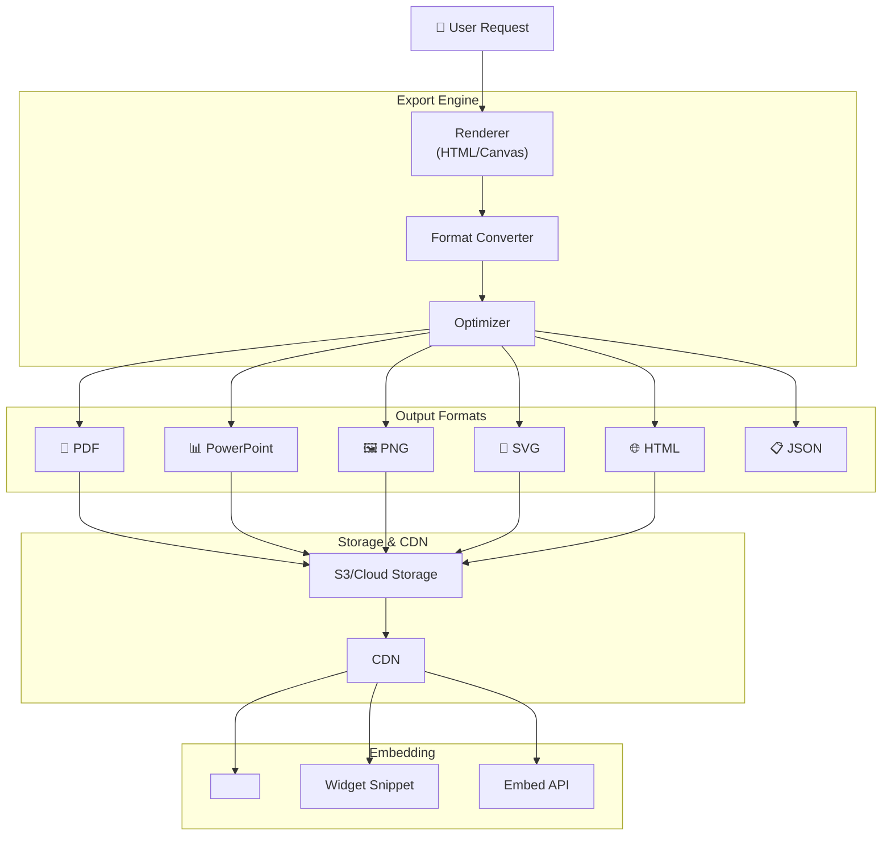

# Export & Embedding System

**Статус**: 🚧 Планируется  
**Приоритет**: Should Have (Phase 3)  
**Дата создания**: 24 января 2026

---

## 📋 Обзор

**Export & Embedding System** — система экспорта досок и виджетов в различных форматах с возможностью встраивания на внешние сайты.

### Ключевые возможности
- 📄 **Multiple Formats**: PDF, PowerPoint, HTML, PNG, SVG, JSON
- 🌐 **Web Embedding**: Iframe embed code для сайтов
- 🔗 **Public Sharing**: Публичные ссылки с токенами
- 🔒 **Access Control**: Public, Private, Password-protected
- 📱 **Responsive Embeds**: Адаптивные встраиваемые виджеты
- 🎨 **Branding Options**: Кастомизация логотипов и цветов
- ⚡ **Live Updates**: Real-time обновление embedded виджетов
- 📊 **Analytics**: Отслеживание просмотров embedded контента

---

## 🏗️ Архитектура

### Export Pipeline



### Database Schema

```python
class SharedBoard(Base):
    """Публично расшаренная доска"""
    __tablename__ = 'shared_boards'
    
    id = Column(UUID, primary_key=True, default=uuid4)
    board_id = Column(UUID, ForeignKey('boards.id'))
    
    # Access configuration
    share_type = Column(Enum('public', 'private', 'password'))
    share_token = Column(String(64), unique=True)  # URL token
    password_hash = Column(String(255), nullable=True)
    
    # Permissions
    allow_download = Column(Boolean, default=False)
    allow_comments = Column(Boolean, default=False)
    allowed_domains = Column(ARRAY(String))  # For CORS
    
    # Expiration
    expires_at = Column(DateTime, nullable=True)
    max_views = Column(Integer, nullable=True)
    current_views = Column(Integer, default=0)
    
    # Branding
    custom_branding = Column(JSONB)
    # {
    #   'logo_url': 'https://...',
    #   'colors': {'primary': '#1E40AF'},
    #   'hide_gigaboard_branding': False
    # }
    
    # Metadata
    created_by = Column(UUID, ForeignKey('users.id'))
    created_at = Column(DateTime, default=datetime.utcnow)
    last_accessed = Column(DateTime)
    
    # Analytics
    view_count = Column(Integer, default=0)
    unique_visitors = Column(Integer, default=0)


class ExportJob(Base):
    """Задача экспорта"""
    __tablename__ = 'export_jobs'
    
    id = Column(UUID, primary_key=True, default=uuid4)
    board_id = Column(UUID, ForeignKey('boards.id'))
    widget_id = Column(UUID, ForeignKey('widgets.id'), nullable=True)
    
    # Export configuration
    export_format = Column(Enum('pdf', 'pptx', 'png', 'svg', 'html', 'json'))
    export_options = Column(JSONB)
    # {
    #   'page_size': 'A4',
    #   'orientation': 'landscape',
    #   'include_comments': True,
    #   'theme': 'light',
    #   'resolution': 300  # DPI for images
    # }
    
    # Status
    status = Column(Enum('pending', 'processing', 'completed', 'failed'))
    progress = Column(Integer, default=0)  # 0-100%
    error_message = Column(Text, nullable=True)
    
    # Output
    output_url = Column(String(500))
    file_size = Column(Integer)  # bytes
    
    # Metadata
    created_by = Column(UUID, ForeignKey('users.id'))
    created_at = Column(DateTime, default=datetime.utcnow)
    completed_at = Column(DateTime)
    processing_time = Column(Float)  # seconds


class EmbedConfig(Base):
    """Конфигурация встраивания"""
    __tablename__ = 'embed_configs'
    
    id = Column(UUID, primary_key=True, default=uuid4)
    board_id = Column(UUID, ForeignKey('boards.id'))
    widget_id = Column(UUID, ForeignKey('widgets.id'), nullable=True)
    
    # Embed settings
    embed_type = Column(Enum('iframe', 'widget', 'api'))
    
    # Display options
    width = Column(Integer)  # pixels or null for responsive
    height = Column(Integer)
    theme = Column(Enum('light', 'dark', 'auto'))
    show_title = Column(Boolean, default=True)
    show_toolbar = Column(Boolean, default=False)
    enable_interactions = Column(Boolean, default=True)
    
    # Auto-refresh
    auto_refresh = Column(Boolean, default=False)
    refresh_interval = Column(Integer)  # seconds
    
    # Security
    allowed_domains = Column(ARRAY(String))
    require_auth = Column(Boolean, default=False)
    
    created_at = Column(DateTime, default=datetime.utcnow)


class EmbedAnalytics(Base):
    """Аналитика встраиваний"""
    __tablename__ = 'embed_analytics'
    
    id = Column(UUID, primary_key=True, default=uuid4)
    embed_config_id = Column(UUID, ForeignKey('embed_configs.id'))
    
    # Visitor info
    visitor_id = Column(String(64))  # Anonymous ID
    ip_address = Column(String(45))
    user_agent = Column(String(500))
    referrer = Column(String(500))
    
    # Interaction
    view_duration = Column(Integer)  # seconds
    interactions = Column(Integer, default=0)
    
    viewed_at = Column(DateTime, default=datetime.utcnow)
```

---

## 📄 Export Formats

### 1. PDF Export

```python
class PDFExporter:
    """Экспорт в PDF"""
    
    async def export_board_to_pdf(
        self,
        board: Board,
        options: Dict
    ) -> str:
        """Экспорт доски в PDF"""
        
        # Render board to HTML
        html_content = await self._render_board_html(board, options)
        
        # Convert HTML to PDF using WeasyPrint or Playwright
        pdf_buffer = await self._html_to_pdf(
            html_content,
            page_size=options.get('page_size', 'A4'),
            orientation=options.get('orientation', 'landscape')
        )
        
        # Upload to S3
        filename = f"board_{board.id}_{datetime.now().strftime('%Y%m%d_%H%M%S')}.pdf"
        url = await upload_to_s3(pdf_buffer, filename)
        
        return url
    
    async def _render_board_html(self, board: Board, options: Dict) -> str:
        """Рендер доски в HTML"""
        
        template = """
        <!DOCTYPE html>
        <html>
        <head>
            <meta charset="UTF-8">
            <title>{{ board.name }}</title>
            <style>
                @page {
                    size: {{ page_size }} {{ orientation }};
                    margin: 2cm;
                }
                body {
                    font-family: 'Inter', sans-serif;
                    color: #1f2937;
                }
                .widget {
                    page-break-inside: avoid;
                    margin-bottom: 2rem;
                }
                .widget-title {
                    font-size: 1.5rem;
                    font-weight: bold;
                    margin-bottom: 1rem;
                }
                .chart {
                    max-width: 100%;
                }
            </style>
        </head>
        <body>
            <h1>{{ board.name }}</h1>
            <p class="meta">Generated on {{ timestamp }}</p>
            
            
            <div class="widget">
                <h2 class="widget-title">{{ widget.title }}</h2>
                {{ widget.rendered_html | safe }}
            </div>
            
            
            
            <div class="comments-section">
                <h2>Comments</h2>
                
                <div class="comment">
                    <strong>{{ comment.user.name }}</strong>: {{ comment.text }}
                </div>
                
            </div>
            
        </body>
        </html>
        """
        
        # Render widgets
        widgets_html = []
        for widget in board.widgets:
            rendered = await self._render_widget(widget)
            widgets_html.append(rendered)
        
        # Get comments if requested
        comments = []
        if options.get('include_comments'):
            comments = await get_board_comments(board.id)
        
        # Render template
        html = jinja2.Template(template).render(
            board=board,
            widgets=widgets_html,
            comments=comments,
            options=options,
            timestamp=datetime.now().strftime('%Y-%m-%d %H:%M')
        )
        
        return html
    
    async def _html_to_pdf(
        self,
        html: str,
        page_size: str,
        orientation: str
    ) -> bytes:
        """Конвертация HTML в PDF"""
        
        # Use WeasyPrint
        from weasyprint import HTML, CSS
        
        pdf_bytes = HTML(string=html).write_pdf(
            stylesheets=[CSS(string=f'@page {{ size: {page_size} {orientation}; }}')]
        )
        
        return pdf_bytes
```

### 2. PowerPoint Export

```python
class PowerPointExporter:
    """Экспорт в PowerPoint"""
    
    async def export_to_pptx(
        self,
        board: Board,
        options: Dict
    ) -> str:
        """Экспорт в PPTX"""
        
        from pptx import Presentation
        from pptx.util import Inches, Pt
        
        prs = Presentation()
        prs.slide_width = Inches(16)
        prs.slide_height = Inches(9)
        
        # Title slide
        title_slide = prs.slides.add_slide(prs.slide_layouts[0])
        title_slide.shapes.title.text = board.name
        title_slide.placeholders[1].text = f"Generated on {datetime.now().strftime('%Y-%m-%d')}"
        
        # Widget slides
        for widget in board.widgets:
            slide = prs.slides.add_slide(prs.slide_layouts[5])  # Blank layout
            
            # Add title
            title_box = slide.shapes.add_textbox(
                Inches(0.5), Inches(0.5),
                Inches(15), Inches(1)
            )
            title_frame = title_box.text_frame
            title_frame.text = widget.title
            title_frame.paragraphs[0].font.size = Pt(32)
            title_frame.paragraphs[0].font.bold = True
            
            # Add widget image
            widget_image = await self._render_widget_image(widget)
            slide.shapes.add_picture(
                widget_image,
                Inches(1), Inches(2),
                width=Inches(14)
            )
        
        # Save to buffer
        buffer = BytesIO()
        prs.save(buffer)
        buffer.seek(0)
        
        # Upload
        filename = f"board_{board.id}.pptx"
        url = await upload_to_s3(buffer.read(), filename)
        
        return url
```

### 3. Image Export (PNG/SVG)

```python
class ImageExporter:
    """Экспорт в изображения"""
    
    async def export_to_png(
        self,
        widget: Widget,
        options: Dict
    ) -> str:
        """Экспорт виджета в PNG"""
        
        # Render widget to HTML
        html = await self._render_widget_html(widget)
        
        # Use Playwright to screenshot
        async with async_playwright() as p:
            browser = await p.chromium.launch()
            page = await browser.new_page(
                viewport={'width': options.get('width', 1200), 
                         'height': options.get('height', 800)}
            )
            
            await page.set_content(html)
            
            # Wait for charts to render
            await page.wait_for_timeout(2000)
            
            # Screenshot
            screenshot = await page.screenshot(
                type='png',
                full_page=options.get('full_page', False)
            )
            
            await browser.close()
        
        # Upload
        filename = f"widget_{widget.id}.png"
        url = await upload_to_s3(screenshot, filename)
        
        return url
    
    async def export_to_svg(self, widget: Widget) -> str:
        """Экспорт в SVG (для chart/graph visualizations)"""
        
        # Check if widget contains chart-like visualization
        if not self._is_chart_visualization(widget):
            raise ValueError("SVG export only supports chart/graph visualizations")
        
        # Generate SVG from widget's HTML/CSS/JS code
        svg_content = await self._generate_svg_from_widget_code(widget)
        
        # Upload
        filename = f"widget_{widget.id}.svg"
        url = await upload_to_s3(svg_content.encode(), filename)
        
        return url
```

---

## 🌐 Web Embedding

### Iframe Embed Code Generator

```python
class EmbedCodeGenerator:
    """Генерация embed кода"""
    
    def generate_iframe_code(
        self,
        board_id: UUID,
        config: EmbedConfig
    ) -> str:
        """Генерация iframe embed кода"""
        
        base_url = f"https://gigaboard.app/embed/board/{board_id}"
        
        # Build query params
        params = []
        if config.theme:
            params.append(f"theme={config.theme}")
        if not config.show_title:
            params.append("title=0")
        if not config.show_toolbar:
            params.append("toolbar=0")
        if config.auto_refresh:
            params.append(f"refresh={config.refresh_interval}")
        
        url = base_url + ("?" + "&".join(params) if params else "")
        
        # Generate iframe code
        width = f"{config.width}px" if config.width else "100%"
        height = f"{config.height}px" if config.height else "600px"
        
        iframe_code = f'''
<!-- GigaBoard Embed -->
<iframe
  src="{url}"
  width="{width}"
  height="{height}"
  frameborder="0"
  allow="fullscreen"
  style="border: 1px solid #e5e7eb; border-radius: 8px;"
></iframe>
'''.strip()
        
        return iframe_code
    
    def generate_widget_snippet(
        self,
        widget_id: UUID,
        config: EmbedConfig
    ) -> str:
        """Генерация JavaScript widget snippet"""
        
        snippet = f'''
<!-- GigaBoard Widget -->
<div id="gigaboard-widget-{widget_id}"></div>
<script src="https://cdn.gigaboard.app/embed.js"></script>
<script>
  GigaBoard.embed({{
    container: '#gigaboard-widget-{widget_id}',
    widgetId: '{widget_id}',
    theme: '{config.theme}',
    autoRefresh: {str(config.auto_refresh).lower()},
    refreshInterval: {config.refresh_interval or 'null'}
  }});
</script>
'''.strip()
        
        return snippet
```

### Embed Endpoint

```python
@router.get('/embed/board/{board_id}')
async def embed_board(
    board_id: UUID,
    theme: str = 'light',
    title: int = 1,
    toolbar: int = 0,
    refresh: Optional[int] = None
):
    """Endpoint для embedded досок"""
    
    # Get board
    board = await get_board(board_id)
    
    # Check if board is shared
    shared = await get_shared_board(board_id)
    if not shared or not await verify_access(shared):
        raise HTTPException(status_code=403, detail="Access denied")
    
    # Increment view count
    await increment_view_count(shared.id)
    
    # Render embed template
    return templates.TemplateResponse(
        'embed/board.html',
        {
            'board': board,
            'theme': theme,
            'show_title': bool(title),
            'show_toolbar': bool(toolbar),
            'auto_refresh': refresh,
            'branding': shared.custom_branding
        }
    )


# Embed JavaScript SDK
@router.get('/embed.js')
async def embed_sdk():
    """JavaScript SDK для embedding"""
    
    sdk_code = '''
(function() {
  window.GigaBoard = {
    embed: function(options) {
      const container = document.querySelector(options.container);
      const iframe = document.createElement('iframe');
      
      iframe.src = `https://gigaboard.app/embed/widget/${options.widgetId}?theme=${options.theme}`;
      iframe.width = options.width || '100%';
      iframe.height = options.height || '400px';
      iframe.frameBorder = '0';
      iframe.style.border = '1px solid #e5e7eb';
      iframe.style.borderRadius = '8px';
      
      container.appendChild(iframe);
      
      // Auto-refresh
      if (options.autoRefresh && options.refreshInterval) {
        setInterval(() => {
          iframe.contentWindow.postMessage({ type: 'refresh' }, '*');
        }, options.refreshInterval * 1000);
      }
    }
  };
})();
'''.strip()
    
    return Response(content=sdk_code, media_type='application/javascript')
```

---

## 🔒 Access Control

### Share Link Manager

```python
class ShareLinkManager:
    """Управление share links"""
    
    async def create_share_link(
        self,
        board_id: UUID,
        share_type: str,
        options: Dict
    ) -> str:
        """Создание share link"""
        
        # Generate unique token
        token = secrets.token_urlsafe(32)
        
        # Create shared board record
        shared = SharedBoard(
            board_id=board_id,
            share_type=share_type,
            share_token=token,
            password_hash=hash_password(options.get('password')) if options.get('password') else None,
            expires_at=options.get('expires_at'),
            max_views=options.get('max_views'),
            allow_download=options.get('allow_download', False),
            allowed_domains=options.get('allowed_domains', [])
        )
        
        await db.add(shared)
        await db.commit()
        
        # Generate URL
        share_url = f"https://gigaboard.app/s/{token}"
        
        return share_url
    
    async def verify_access(
        self,
        token: str,
        password: Optional[str] = None
    ) -> bool:
        """Проверка доступа"""
        
        shared = await get_shared_board_by_token(token)
        
        if not shared:
            return False
        
        # Check expiration
        if shared.expires_at and datetime.utcnow() > shared.expires_at:
            return False
        
        # Check max views
        if shared.max_views and shared.current_views >= shared.max_views:
            return False
        
        # Check password
        if shared.share_type == 'password':
            if not password or not verify_password(password, shared.password_hash):
                return False
        
        return True
```

---

## 📊 Analytics Dashboard

```tsx
// EmbedAnalyticsDashboard.tsx

export const EmbedAnalyticsDashboard: React.FC<{ boardId: string }> = ({ boardId }) => {
  const { data: analytics } = useQuery(['embed-analytics', boardId]);

  return (
    <div className="p-6">
      <h2 className="text-2xl font-bold mb-6">Embed Analytics</h2>

      {/* Stats Cards */}
      <div className="grid grid-cols-4 gap-4 mb-6">
        <StatsCard
          title="Total Views"
          value={analytics?.total_views}
          change="+12%"
        />
        <StatsCard
          title="Unique Visitors"
          value={analytics?.unique_visitors}
          change="+8%"
        />
        <StatsCard
          title="Avg. Duration"
          value={`${analytics?.avg_duration}s`}
        />
        <StatsCard
          title="Interactions"
          value={analytics?.total_interactions}
        />
      </div>

      {/* Views Over Time */}
      <div className="mb-6">
        <LineChart
          data={analytics?.views_over_time}
          title="Views Over Time"
        />
      </div>

      {/* Top Referrers */}
      <div>
        <h3 className="font-semibold mb-3">Top Referrers</h3>
        <ReferrerTable data={analytics?.top_referrers} />
      </div>
    </div>
  );
};
```

---

## 🚀 Implementation Roadmap

### Phase 1: Basic Export (2 weeks)
- ✅ PDF export
- ✅ PNG export
- ✅ JSON export

### Phase 2: Advanced Exports (2 weeks)
- ✅ PowerPoint export
- ✅ SVG export
- ✅ HTML export

### Phase 3: Web Embedding (2 weeks)
- ✅ Iframe embeds
- ✅ Widget snippet
- ✅ JavaScript SDK

### Phase 4: Access Control & Analytics (1 week)
- ✅ Share links
- ✅ Password protection
- ✅ View analytics

---

## 🎯 Success Metrics

- **Export Usage**: 50%+ досок экспортируются регулярно
- **Embed Adoption**: 30% досок встроены на внешних сайтах
- **Format Distribution**: PDF 40%, PPTX 30%, PNG 20%, Others 10%
- **Share Link Usage**: 5+ share links per active board
- **Embed Performance**: <2s load time для embedded виджетов

---

**Последнее обновление**: 24 января 2026
