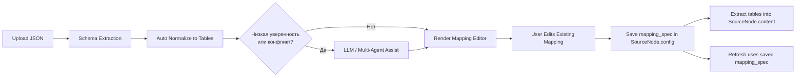
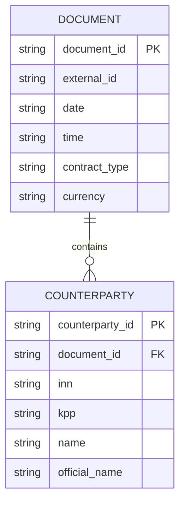

# JSON Source Parsing

## Executive Summary

`JSON Source Parsing` вводит единый сценарий работы с JSON-источниками:

1. Система автоматически извлекает схему JSON (`schema_snapshot`).
2. Система автоматически раскладывает JSON в 1..N нормализованных таблиц (`mapping_spec`).
3. При сложной структуре система может использовать LLM/мультиагент для повышения качества раскладки.
4. Пользователь редактирует уже созданную конструкцию (таблицы, колонки, мэппинг путей, связи PK/FK).
5. Конструкция сохраняется в `SourceNode.config` и повторно используется при `refresh`.

Главная цель: перейти от эвристического "угадывания" к воспроизводимому и редактируемому пайплайну JSON → таблицы.

---

## Контекст и проблемы текущего подхода

- Вложенные JSON-структуры трудно надёжно представить одной плоской таблицей.
- Для сложных документов (например, коммерческие документы с массивами контрагентов, позиций, реквизитов) требуется автоматическая нормализация в связанные таблицы.
- Пользователю нужна прозрачность: откуда взялся каждый столбец и как он связан с полем JSON.
- Для `refresh` требуется стабильный и повторяемый контракт извлечения.

---

## Цели и границы MVP

### Цели

- Автоматически извлекать схему JSON и хранить её снимок.
- Автоматически генерировать реляционную модель (1..N таблиц).
- Давать пользователю возможность редактировать сгенерированную модель без переключения режимов.
- Обеспечить повторяемый `refresh` на основе сохранённого `mapping_spec`.

### Не цели MVP

- Полноценный SQL-планировщик для произвольных join-стратегий.
- Полный JSONPath-движок со всеми расширениями.
- Автоматическая семантическая дедупликация сущностей на уровне MDM.

---

## Единый сценарий работы



---

## Архитектурные компоненты

### 1. Schema Extractor

Отвечает за построение дерева схемы и статистик:

- Полный путь (`$....`), включая массивы (`[*]`).
- Тип узла: `object`, `array`, `scalar`.
- Наблюдаемые типы значений: `string`, `number`, `boolean`, `date`, `null`, `mixed`.
- Кардинальность: `1`, `0..1`, `1..N`, `0..N`.
- Профиль качества: `null_ratio`, `distinct_count` (на сэмпле), `sample_values`.

Результат сохраняется как `schema_snapshot`.

### 2. Auto Normalizer

На основе `schema_snapshot` строит `mapping_spec`:

- Определяет корневые сущности таблиц (обычно массивы объектов).
- Формирует родительские и дочерние таблицы.
- Назначает PK/FK (surrogate PK по умолчанию + FK на parent).
- Прокладывает мэппинг колонок к JSON path.
- Учитывает стратегии обработки массивов:
  - `normalize` (в отдельную таблицу),
  - `inline_json` (сериализованный JSON в колонку),
  - `skip` (исключить).

### 3. LLM/Multi-Agent Assist (внутренний шаг)

Вызывается только при неоднозначностях:

- конкурирующие кандидаты на PK;
- смешанные типы в ключевых полях;
- несколько возможных разбиений массива на сущности;
- низкая структурная уверенность эвристик.

Выход ассистента приводит к тому же формату `mapping_spec` и не создаёт альтернативных пользовательских режимов.

### 4. Mapping Editor (frontend)

Показывает готовую конструкцию и даёт возможность правок:

- список таблиц и их связи;
- колонки и их source path;
- типы колонок и nullable;
- PK/FK;
- preview строк.

---

## Контракт хранения в SourceNode.config

```json
{
  "file_id": "uuid",
  "filename": "example.json",
  "schema_snapshot": {
    "version": "1.0",
    "root_type": "object",
    "nodes": [
      {
        "path": "$.КоммерческаяИнформация.Документ[*].Ид",
        "node_kind": "scalar",
        "value_types": ["string"],
        "cardinality": "1"
      }
    ]
  },
  "mapping_spec": {
    "version": "1.0",
    "tables": [
      {
        "id": "document",
        "name": "document",
        "base_path": "$.КоммерческаяИнформация.Документ[*]",
        "pk": {
          "column": "document_id",
          "strategy": "surrogate_uuid"
        },
        "columns": [
          {
            "name": "external_id",
            "type": "string",
            "path": "$.Ид",
            "nullable": false
          },
          {
            "name": "date",
            "type": "string",
            "path": "$.Дата",
            "nullable": true
          }
        ]
      },
      {
        "id": "counterparty",
        "name": "counterparty",
        "base_path": "$.КоммерческаяИнформация.Документ[*].Контрагенты.Контрагент[*]",
        "pk": {
          "column": "counterparty_id",
          "strategy": "surrogate_uuid"
        },
        "fk": [
          {
            "column": "document_id",
            "ref_table": "document",
            "ref_column": "document_id"
          }
        ],
        "columns": [
          {
            "name": "inn",
            "type": "string",
            "path": "$.ИНН",
            "nullable": true
          },
          {
            "name": "kpp",
            "type": "string",
            "path": "$.КПП",
            "nullable": true
          }
        ]
      }
    ]
  },
  "generation_meta": {
    "generated_by": "heuristic_or_llm",
    "confidence": 0.86,
    "warnings": []
  }
}
```

---

## Контракт результата извлечения

Результат в `SourceNode.content.tables` должен соответствовать unified формату (см. `docs/DATA_FORMATS.md`):

- `name`
- `columns: [{name, type}]`
- `rows: [{col_name: value}]`
- `row_count`
- `column_count`

Дополнительно рекомендуется сохранять в `metadata`:

- `table_count`
- `normalized: true`
- `mapping_version`
- `last_extraction_mode` (`heuristic`, `llm_assisted`)

---

## Алгоритм авто-нормализации (MVP)

1. Построить `schema_snapshot` из JSON (с ограничением глубины и объёма сэмпла).
2. Найти массивы объектов как кандидаты на таблицы.
3. Выбрать корневую таблицу(и) по ближайшему уровню к корню и плотности скалярных полей.
4. Для каждого вложенного массива:
   - создать дочернюю таблицу,
   - добавить FK на родителя.
5. Для скалярных полей сформировать колонки в текущей таблице.
6. Для вложенных объектов без массива:
   - flatten в текущую таблицу (с префиксом) или отдельная таблица при высокой вложенности.
7. Сформировать `mapping_spec`.
8. Выполнить extraction по `mapping_spec` и вернуть preview таблиц.

---

## UX требования к редактору мэппинга

- Левая панель:
  - выбор JSON-файла;
  - предпросмотр исходного JSON в виде дерева с раскрытием/сворачиванием узлов.
- Правая панель:
  - таблицы мэппинга (табы);
  - редактирование имени таблицы по кнопке в табе;
  - удаление таблицы в табе;
  - `Base path` + кнопка добавления столбца;
  - список столбцов (path/name/type) с прокруткой;
  - предпросмотр активной таблицы внутри того же блока (мэппинг + preview в одном контейнере).
- Добавление нового столбца автоматически прокручивает список к созданной строке.
- Поля path выбираются из схемы и фильтруются по текущему `base_path`.
- Для nested-массивов поддерживается путь вида `...[*][*]`.
- Валидация перед сохранением:
  - уникальность имён таблиц;
  - корректность PK/FK;
  - валидность path;
  - отсутствие дубликатов колонок в одной таблице.

---

## Обработка ошибок и fallback

- Если JSON невалиден: явная ошибка парсинга с указанием позиции.
- Если `mapping_spec` невалиден: не сохранять, показать список ошибок валидации.
- Если extraction частично успешен:
  - сохранить успешные таблицы,
  - вернуть предупреждения по неуспешным мэппингам.
- При низкой уверенности автонормализации:
  - выполнить LLM/Multi-Agent assist,
  - если после assist уверенность не улучшилась, сохранить с предупреждением и дать пользователю вручную скорректировать.

---

## План внедрения

### Шаг 1. Backend foundation

- `json_schema_extractor.py`
- `json_mapping_spec.py` (Pydantic-схемы)
- `json_normalizer.py` (auto decomposition)
- обновление `apps/backend/app/sources/json/extractor.py`:
  - pipeline: `schema -> mapping_spec -> extraction`
  - сохранение артефактов в `config`

### Шаг 2. Frontend editor

- обновление `apps/web/src/components/dialogs/sources/JSONSourceDialog.tsx`:
  - левый блок: upload + collapsible JSON tree,
  - правый блок: табы таблиц + редактор колонок/path + встроенный preview,
  - inline-операции с таблицами (rename/delete/add),
  - автогенерация таблиц и связей (PK/FK) по `schema_snapshot`.

### Шаг 3. Refresh consistency

- `refresh` всегда использует сохранённый `mapping_spec`.
- при изменении схемы входного файла:
  - мягкая валидация старого `mapping_spec`,
  - предупреждения по отсутствующим path.

### Шаг 4. Тестирование

- Unit tests:
  - schema extraction,
  - auto normalization,
  - mapping validation,
  - extraction by mapping.
- Integration tests:
  - create source,
  - edit mapping,
  - refresh with same mapping.

---

## Пример разложения (из коммерческого JSON)



---

## Критерии готовности

- Система автоматически формирует 1..N таблиц для вложенного JSON без ручной настройки.
- Пользователь может редактировать сгенерированную конструкцию и сохранять её.
- `refresh` воспроизводит извлечение по сохранённому `mapping_spec`.
- Выходные таблицы соответствуют unified формату `docs/DATA_FORMATS.md`.
- Диалог JSON-источника использует единый UX для `create/edit` с одинаковой структурой панелей.
- Для сложных nested-структур (включая `[*][*]`) preview и мэппинг работают консистентно.

---

**Статус**: В работе (MVP реализован, UX/эвристики уточняются)  
**Версия**: 1.0  
**Связанные документы**: `docs/SOURCE_NODE_CONCEPT.md`, `docs/DATA_FORMATS.md`, `docs/API.md`, `docs/DATA_NODE_SYSTEM.md`
