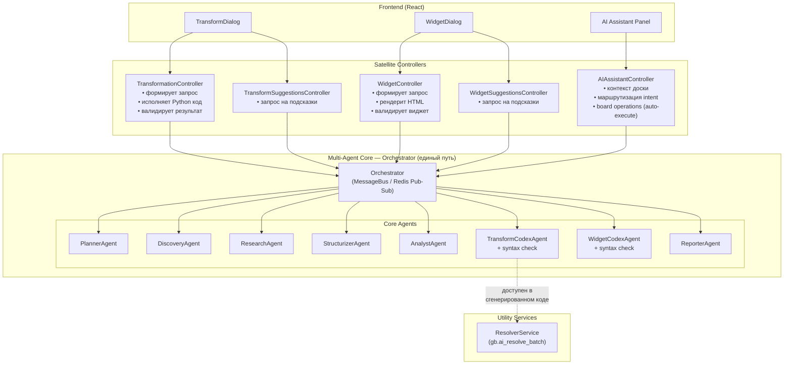
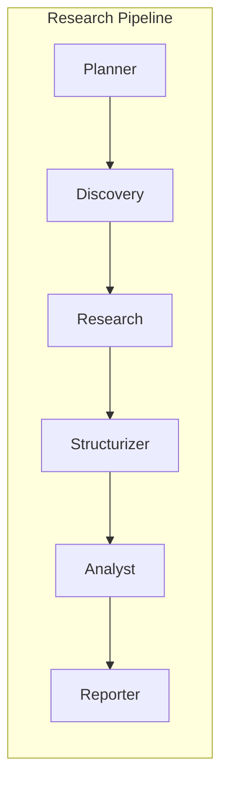
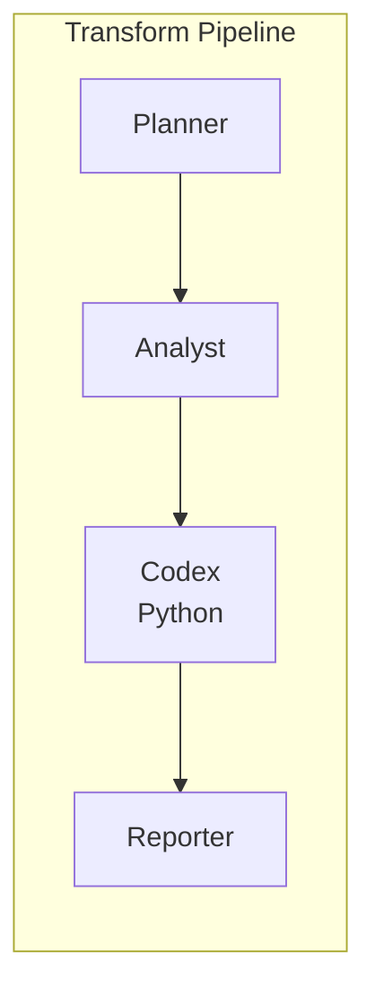
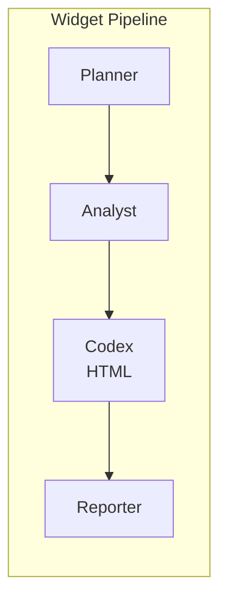
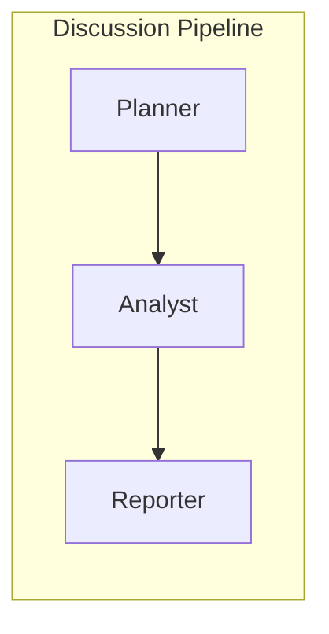
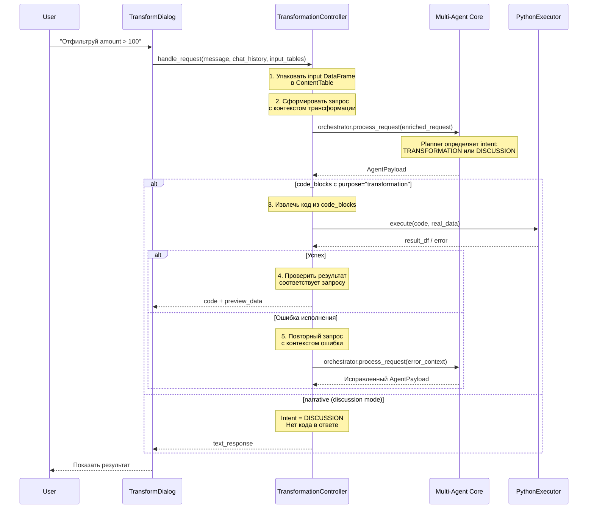
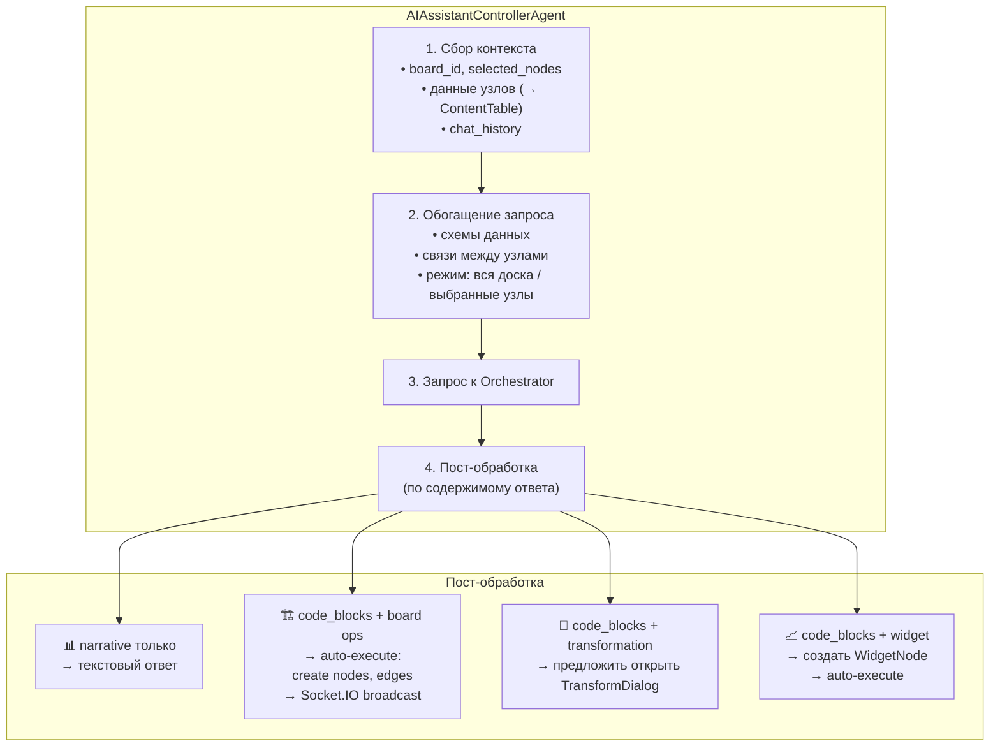
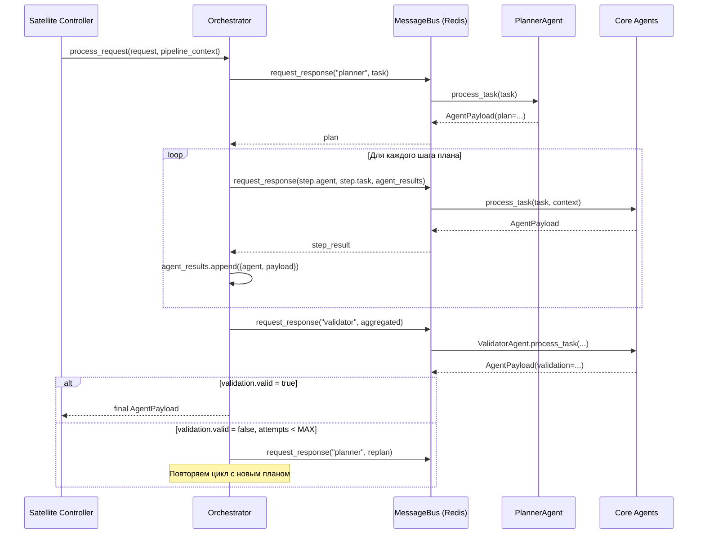
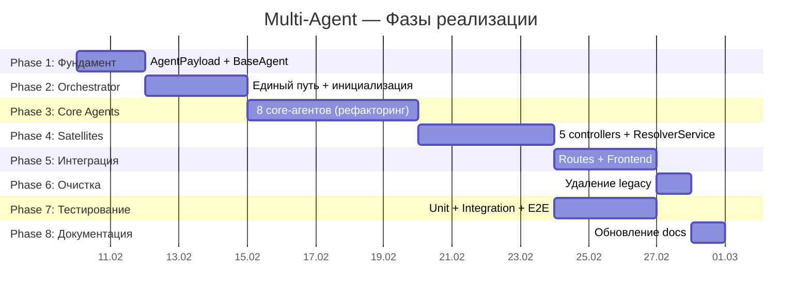
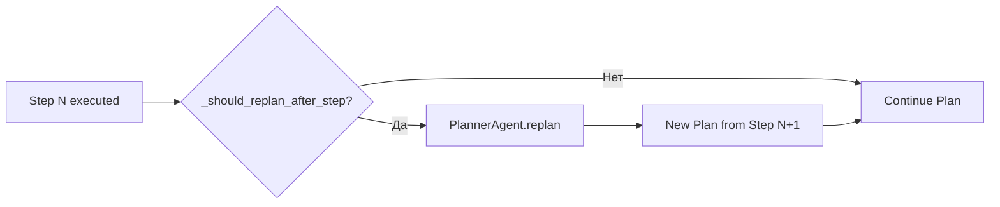

# Multi-Agent System — Концепция

**Дата создания**: 7 февраля 2026  
**Статус**: Реализована (Февраль 2026)  
**Актуализировано**: 4 апреля 2026 — принцип 7: целевая **pull-модель** контекста и результаты поиска (см. `CONTEXT_ENGINEERING.md` §3.1). Ранее 22 марта 2026 — таблица ядра: `context_filter`, роли **QualityGate** vs **ValidatorAgent**; ранее 20 марта — тулы `readTableData` / `readTableListFromContentNodes` и **`_compute_filtered_pipeline`** (ленивый кэш `_raw_filtered_pipeline_result`, гидратация строк при метаданных без `rows`, пересчёт при известном `board_id` даже без активного фильтра). Ранее 18 марта — устойчивость парсинга **AnalystAgent**, анти-петля **QualityGateAgent**, HTTP **ResearchAgent**.

---

## Executive Summary

Мультиагентный слой — один из главных способов **в этом инструменте** **манипулировать данными через ИИ** (см. видение в [`README.md`](./README.md), [`ARCHITECTURE.md`](./ARCHITECTURE.md)): планирование, специализированные агенты и тулы оркестратора.

**Мультиагентная система GigaBoard** — архитектура с чётким разделением на три слоя:

**Настройки `MULTI_AGENT_*`:** параметры с теми же именами, что переменные окружения (трейсы, бюджеты контекста, таймауты, retry и т.д.), можно задать в **Профиль → Multi-Agent** (только администратор) без правки `.env`. Приоритет: значения в профиле пользователя → env на сервере → дефолты в коде (`runtime_overrides.py`, колонка `user_ai_settings.multi_agent_settings` на время `process_request`).

**Доступ к таблицам через тулы оркестратора:** формулировка шага плана («проанализируй данные») сама по себе не гарантирует вызов `readTableListFromContentNodes` / `readTableData`. Поэтому (1) в промпт планировщика при `tools_enabled` и наличии табличного контекста добавляется блок с требованием явно связать шаги analyst/transform_codex/widget_codex/structurizer с этими инструментами; (2) оркестратор перед выполнением шага дополняет `task.description` у перечисленных агентов стандартным контрактом (`tabular_tool_contract.py`), чтобы пользовательский запрос и механизм тулов оказались в одной задаче.

**Кросс-фильтр и тулы:** `readTableData` / `readTableListFromContentNodes` по возможности берут таблицы из **снимка пайплайна после `_compute_filtered_pipeline`** (см. `docs/CROSS_FILTER_SYSTEM.md`) — тот же путь, что и UI доски/дашборда. После шага `context_filter` сырой результат сохраняется в `pipeline_context["_raw_filtered_pipeline_result"]` (полные строки); если снимка ещё нет, выполняется ленивый пересчёт: эффективный фильтр (активные фильтры board/dashboard из `FilterStateService` и при необходимости `_orchestrator_applied_filter_expression` из чата) передаётся в `_compute_filtered_pipeline`; при **отсутствии** активного фильтра, но при известном `board_id` в контексте, цепочка всё равно пересчитывается с `filters=None` (без кросс-фильтра по измерениям, но с исполнением upstream-трансформаций), чтобы не подставлять сырой `content` из БД в обход пайплайна. Отключить: `MULTI_AGENT_TOOLS_USE_FILTERED_PIPELINE=false`. Реализация: `Orchestrator._load_content_node_tables`, `_ensure_filtered_pipeline_raw_cache`, `_resolve_effective_filter_for_tools`, при догрузке строк — `_compute_filtered_pipeline_tables_for_node`, `_merge_filtered_pipeline_into_raw_cache`, `_hydrate_table_rows_from_content_db`.

**Лимит tool loop:** на один шаг агента с включёнными тулами действует `MULTI_AGENT_TOOL_MAX_ROUNDS_PER_STEP` (дефолт и **минимум в коде — 15** раундов: старые значения вроде `3` в env или профиле поднимаются до 15; больше 15 можно задать явно). Реализация: цикл с `tool_loop_*` в `Orchestrator.process_user_request`.

**Кэш результатов тулов:** на время одного запроса к оркестратору успешные ответы `readTableListFromContentNodes`, `readTableData` и pull-тулов контекста (`expandResearchSourceContent`, `expandAgentResult`, `expandContextGraphNode`, см. `CONTEXT_ENGINEERING.md` §3.1) кладутся в `pipeline_context["_tool_result_cache"]` по стабильному ключу от нормализованных аргументов; повторный идентичный запрос возвращает кэш (событие трейса `tool_cache_hit`). В `pipeline_context["tool_request_cache_digest_lines"]` накапливаются короткие строки-напоминания; **Analyst**, **TransformCodex** (в т.ч. итеративный режим), **Structurizer** и **WidgetCodex** подмешивают их в промпт перед блоком результатов тулов, чтобы модель не дублировала те же `tool_requests`.

**Analyst и tool loop:** в промпте после блока `TOOL RESULTS` добавлены правила «анти-петля» (не повторять те же `readTableData`, при достаточных данных — сразу `findings`). Оркестратор дедуплицирует одинаковые `tool_requests` в одном раунде и ограничивает их число (`MULTI_AGENT_ANALYST_MAX_TOOL_REQUESTS_PER_ROUND`, по умолчанию 2), чтобы не исчерпывать лимит раундов параллельными повторами.

**Ответ `readTableListFromContentNodes`:** в элементах `tables` и `nodes` (и в каждой записи таблицы внутри `nodes`) возвращаются `content_node_name` и `content_node_description`: имя берётся из контекста пайплайна (`metadata` / `name` / `node_name`) или из БД (`ContentNode.node_metadata.name`), описание — текстовый summary ноды (`text` в снимке контекста или `content.text` в БД).

**Вызов `readTableData`:** оркестратор нормализует `jsonDecl`: алиасы `table_name` / `tableName` / `name` / `table` → `table_id`; при отсутствии `table_id` подставляет его из последнего успешного `readTableListFromContentNodes` для того же `contentNodeId` (чтобы агенты не падали на пустом `table_id`). Если в снимке пайплайна у таблицы есть положительный `row_count`, но массив `rows` пуст (метаданные без тела строк), оркестратор **сначала** пересчитывает полную pandas-цепочку на бэке через `_compute_filtered_pipeline` (тот же эффективный фильтр, что у тулов: board/dashboard + чат; при отсутствии фильтра — цепочка без кросс-фильтра) и обновляет `_raw_filtered_pipeline_result`; затем при необходимости — fallback на `ContentNode.content` в БД (`_hydrate_table_rows_from_content_db` в `orchestrator.py`), чтобы аналитик не получал «пустые» таблицы при реальных данных и не видел несогласованных с доской данных из сырого `content` без пересчёта.

- **Core (Ядро)** — специализированные агенты анализа, генерации кода и формирования ответа. Взаимодействуют через единый **Orchestrator** (MessageBus/Redis), формат **AgentPayload**. Финальный **QualityGateAgent** в оркестраторе **не вызывается**; минимальные критерии шагов — **per-step acceptance** (`step_acceptance.py`).
- **Satellite Controllers (Спутники)** — контекстные контроллеры, привязанные к UI-сценариям (трансформации, виджеты, AI Assistant, подсказки, **Поиск с ИИ** и др.). Формируют запросы к ядру, исполняют результаты, валидируют в контексте задачи. Не входят в состав ядра.
- **Utility Services** — вспомогательные сервисы (ResolverService), доступные агентам как утилиты.

---

## Статус реализации

> **2026** — система реализована: ядро агентов (оркестратор по умолчанию без финального Quality Gate) + satellite-контроллеры (включая `ResearchController` для источника «Поиск с ИИ»).

### Core Agents (Слой 1)

| Файл                        | Агент                     | Статус       |
| --------------------------- | ------------------------- | ------------ |
| `agents/planner.py`         | PlannerAgent              | ✅ Реализован |
| `agents/discovery.py`       | DiscoveryAgent            | ✅ Реализован |
| `agents/research.py`        | ResearchAgent             | ✅ Реализован |
| `agents/structurizer.py`    | StructurizerAgent         | ✅ Реализован |
| `agents/analyst.py`         | AnalystAgent              | ✅ Реализован |
| `agents/transform_codex.py` | TransformCodexAgent       | ✅ Реализован |
| `agents/widget_codex.py`    | WidgetCodexAgent          | ✅ Реализован |
| `agents/reporter.py`        | ReporterAgent             | ✅ Реализован |
| `agents/context_filter.py`  | ContextFilterAgent        | ✅ Реализован |
| `agents/quality_gate.py`    | QualityGateAgent          | ✅ Реализован; **финальный вызов из Orchestrator отключён** (ключ плана **`validator`** пропускается) |
| `agents/validator.py`       | ValidatorAgent            | ✅ Реализован; проверка Python-кода трансформаций (отдельно от `quality_gate.py`) |
| `agents/resolver.py`        | ResolverService (утилита) | ✅ Реализован |
| `agents/base.py`            | BaseAgent                 | ✅ Реализован |

### Satellite Controllers (Слой 2)

| Файл                                              | Контроллер                          | Статус       |
| ------------------------------------------------- | ----------------------------------- | ------------ |
| `controllers/base_controller.py`                  | BaseController                      | ✅ Реализован |
| `controllers/transformation_controller.py`        | TransformationControllerAgent       | ✅ Реализован |
| `controllers/transform_suggestions_controller.py` | TransformSuggestionsControllerAgent | ✅ Реализован |
| `controllers/widget_controller.py`                | WidgetControllerAgent               | ✅ Реализован |
| `controllers/widget_suggestions_controller.py`    | WidgetSuggestionsControllerAgent    | ✅ Реализован |
| `controllers/ai_assistant_controller.py`          | AIAssistantControllerAgent          | ✅ Реализован |
| `controllers/research_controller.py`             | ResearchController                  | ✅ Реализован |

---

## Архитектура

### Общая схема



### Принципы

1. **Single Path** — все запросы идут через Orchestrator + MessageBus.
2. **Агенты не общаются друг с другом напрямую** — Orchestrator медиирует все вызовы.
3. **Единый формат** — все агенты возвращают `AgentPayload`. Orchestrator передаёт `agent_results` (хронологический list) без маппинга. Каждый агент сам берёт нужные секции.
4. **ContentTable везде** — структурированные данные на всех уровнях (вход/выход агентов, передача от satellite к ядру) используют формат ContentTable.
5. **Satellite = контекст** — вся контекстно-зависимая логика (исполнение кода, рендеринг, board operations) живёт в satellite-контроллерах, не в ядре.
6. **Frontend передаёт полную историю** — состояние сессии хранится на клиенте, каждый запрос включает полный `chat_history`.
7. **Context engineering** — объём и состав данных в промпте LLM на каждом шаге управляются осознанно (бюджеты, селекция фрагментов `agent_results`, усечение тяжёлых полей, контекстный граф). **Целевое направление:** pull-модель — в промпт по умолчанию компактный слой, полнота (в т.ч. тексты страниц после discovery/research) — по запросу через оркестраторские тулы в tool loop, по аналогии с `readTableData`. См. [`CONTEXT_ENGINEERING.md`](./CONTEXT_ENGINEERING.md) §3.1.
8. **Policy-driven execution** — таймауты, retry и уровни деградации контекста (`full`/`compact`/`minimal`) задаются task-aware политиками, а не ad-hoc условиями в шагах.
9. **Structured working memory** — в `pipeline_context.pipeline_memory` хранятся цель, ограничения и ключевые решения для стабильного `replan/revise_remaining` в длинных сессиях.

---

## Слой 1: Core Agents (Ядро)

### Реестр агентов

| #   | Агент                   | Ключ в плане   | Ответственность                                                                                                    | Заполняет в AgentPayload      |
| --- | ----------------------- | -------------- | ------------------------------------------------------------------------------------------------------------------ | ----------------------------- |
| 1   | **PlannerAgent**        | `planner`      | Декомпозиция задач, определение intent, построение плана                                                           | `plan`                        |
| 2   | **DiscoveryAgent**      | `discovery`    | Поиск в интернете (DuckDuckGo), поиск публичных датасетов                                                          | `sources`, `narrative`        |
| 3   | **ResearchAgent**       | `research`     | Загрузка контента по URL, API-вызовы, извлечение текста                                                            | `sources` (с `fetched: true`) |
| 4   | **StructurizerAgent**   | `structurizer` | Извлечение структурированных данных из текста/HTML                                                                 | `tables`                      |
| 5   | **AnalystAgent**        | `analyst`      | Анализ данных (структурированных и неструктурированных), выводы, рекомендации                                      | `narrative`, `findings`       |
| 6   | **TransformCodexAgent** | `codex`        | Генерация Python/pandas кода для трансформаций данных, базовый syntax check                                        | `code_blocks`, `narrative`    |
| 6b  | **WidgetCodexAgent**    | `widget_codex` | Генерация HTML/CSS/JS виджетов, базовый syntax check                                                               | `code_blocks`, `narrative`    |
| 7   | **ReporterAgent**       | `reporter`     | Формирование финального ответа пользователю (текст или код) из результатов всех агентов                            | `narrative`, `code_blocks`    |
| 8   | **QualityGateAgent** (ключ `validator`) | `validator` | Реализован в `quality_gate.py`; **оркестратор после reporter больше не вызывает** финальный gate (контроль — **per-step acceptance**). Шаги `validator` в плане пропускаются. Код пригоден для переиспользования / тестов | `validation` |

### Детальное описание агентов

#### 1. PlannerAgent

**Ответственность**: Разбивает запрос пользователя на подзадачи, определяет intent, маршрутизирует к агентам.

**Intent Detection**:
- **DISCUSSION** — исследовательские/вопросительные запросы → `analyst → reporter`
- **TRANSFORMATION** — генерация Python кода → `analyst → codex`
- **RESEARCH** — поиск информации → `discovery → research → structurizer → analyst → reporter`
- **VISUALIZATION** — генерация HTML виджета → `analyst → codex`
- **BOARD_CONSTRUCTION** — построение дашборда → комплексный план

**Декомпозиция объёмных задач**: запросы с несколькими подвопросами/источниками/виджетами нужно разбивать на атомарные шаги (один discovery — один query; несколько виджетов — несколько шагов widget_codex). Стратегии и порядок внедрения описаны в [PLANNING_DECOMPOSITION_STRATEGY.md](./PLANNING_DECOMPOSITION_STRATEGY.md).

**Выход**: `AgentPayload.plan`

**Adaptive Planning**: Поддерживает `replan` после получения результатов шагов (по запросу ValidatorAgent или при ошибках).

#### 2. DiscoveryAgent

**Ответственность**: Поиск информации в интернете и публичных датасетах.

**Возможности**:
- Web-поиск через DuckDuckGo (текущая реализация SearchAgent)
- News-поиск
- Поиск публичных датасетов (функция бывшего DataDiscoveryAgent)
- В перспективе: Google, Bing, специализированные API

**Выход**: `AgentPayload.sources` (URL, title, snippet) + `AgentPayload.narrative` (summary)

**Несколько запросов к DuckDuckGo**: для длинных запросов с признаками исследования (найди, топ, продажи, sales, статистика, рынок и т.п.) агент строит до нескольких формулировок (эвристики: исходный `query`, `description`, RU для РФ+авто, год −1, `site:ru` и т.д.), опционально **дополняет до 4 строками от LLM** (короткий JSON-массив альтернативных запросов; отключение: `task.llm_query_expansion: false`). Выполняется отдельный `ddgs.text` на каждую формулировку, склейка URL с **round-robin**, затем **приоритизация доменов** (выше: autostat.ru, .ru СМИ, rosstat; ниже: statista при 403, развлекательные домены). Далее **off-topic-фильтр** и top-`max_results`. В `metadata`: `search_queries_used`. Лимиты: `multi_query`, `max_search_queries`, `per_query_results`.

**Off-topic-фильтр (развлечения при запросах про данные/авто)**: если по тексту запроса (`query`) эвристика считает тему «авто / продажи / статистика / данные» (ключевые слова: электромобил, авто, марки, бренд, продажи, car, рейтинг и т.п.), из списка результатов отбрасываются URL и заголовки с паттернами кино/сериалов (например `kinopoisk`, `imdb`, `топ-250`, `фильм`, `сериал` в пути или title). Запрашивается расширенный пул результатов до фильтрации, чтобы после отсева осталось достаточно ссылок. Если после фильтра список пуст — возвращаются исходные результаты (пайплайн не обрывается).

**Два шага discovery в плане** (Planner): для региональной статистики и широкого охвата — два `discovery` с **разными** `query`, затем один `research` с увеличенным `max_urls` (8–10). ResearchAgent **не дублирует** URL уже успешно скачанные предыдущим шагом `research` в той же сессии.

#### 3. ResearchAgent

**Ответственность**: Загрузка полного содержимого по URL, API-вызовы, извлечение текста из HTML.

**Входные данные**: Читает `sources` из `agent_results` (от DiscoveryAgent через `_all_results()`), загружает те, у которых `fetched: false`.

**Выход**: `AgentPayload.sources` (с `fetched: true`, `content` заполнен)

**HTTP при загрузке URL**: клиент использует **браузероподобные** заголовки (в т.ч. `User-Agent`, имитирующий Firefox, и типичные `Accept*`, `Sec-Fetch-*` и др.), чтобы снизить вероятность отказов со стороны сайтов с антибот-фильтрами. См. `agents/research.py`, методы настройки заголовков.

#### 4. StructurizerAgent

**Ответственность**: Извлечение структурированных данных из неструктурированного текста/HTML.

**Входные данные**: Читает `sources[].content` из `agent_results` (от ResearchAgent через `_last_result()`).

**Выход**: `AgentPayload.tables` — все извлечённые данные в формате ContentTable:
- Табличные данные → ContentTable напрямую
- Entities → ContentTable `(name="entities", columns=[type, value, confidence])`
- Key-value пары → ContentTable `(name="metadata", columns=[key, value])`

**Принцип**: Всё → ContentTable. Никаких отдельных секций `entities` или `key_value_pairs`.

**Устойчивость к ответам LLM**: при ответе без JSON (например короткое служебное сообщение вместо объекта) или при сбое парсинга агент возвращает пустой набор таблиц и логирует предупреждение; перед вызовом LLM контент может санитизироваться (ограничение длины, маскирование URL), чтобы снизить риск отказа модели.

#### 5. AnalystAgent

**Ответственность**: Анализ данных и формирование выводов/рекомендаций.

**Входные данные**: Читает `tables` из `agent_results` (от StructurizerAgent или напрямую от satellite-контроллера через `_all_results()`). Может также анализировать неструктурированный текст из `sources[].content` и `narrative.text`.

**Граница с StructurizerAgent**:
- **StructurizerAgent** = извлечение (text → tables)
- **AnalystAgent** = анализ (tables/text → insights, recommendations)

AnalystAgent может **читать** неструктурированный текст для формирования выводов, но **не обязан** его структурировать в таблицы. Если нужна структура — сначала Structurizer, потом Analyst.

**Выход**: `AgentPayload.narrative` (текст анализа) + `AgentPayload.findings` (insights, recommendations, data quality issues)

**Устойчивость к «битому» JSON от LLM**: основной контракт ответа — JSON с полями `text`, `insights`, `recommendations` и т.д. Если модель вернула JSON-подобный текст с синтаксической ошибкой (типичный случай — лишняя запятая, неэкранированные кавычки):
- выполняется **повторный вызов** LLM с явным требованием вернуть **только валидный JSON** (механизм `_call_llm_with_json_retry` в `BaseAgent`);
- если парсинг по-прежнему не удаётся — **fallback**: из сырого текста извлекаются фрагменты вроде `"finding"` / `"action"` и формируются минимальные `findings`, плюс при необходимости narrative берётся из текста сообщения. Это предотвращает ситуацию «данные в контексте есть, а аналитик формально дал 0 findings» только из-за сбоя формата ответа модели.

#### 6. TransformCodexAgent

**Ответственность**: Специалист по генерации Python/pandas кода для трансформаций данных (`purpose: "transformation"`).

**Встроенная валидация**: TransformCodexAgent выполняет базовый статический анализ (syntax check) сгенерированного кода перед возвратом. Поле `CodeBlock.syntax_valid` отражает результат.

**ResolverService**: TransformCodexAgent знает о доступности `gb.ai_resolve_batch()` и может включать его вызовы в сгенерированный код.

**Выход**: `AgentPayload.code_blocks` + `AgentPayload.narrative` (описание)

#### 6b. WidgetCodexAgent

**Ответственность**: Специалист по генерации HTML/CSS/JS виджетов (`purpose: "widget"`).

**Встроенная валидация**: WidgetCodexAgent выполняет базовый статический анализ (syntax check) сгенерированного кода перед возвратом. Поле `CodeBlock.syntax_valid` отражает результат.

**Выход**: `AgentPayload.code_blocks` + `AgentPayload.narrative` (описание)

**Метаданные виджетов**:
- Имя виджета → `CodeBlock.description`
- Тип виджета → `AgentPayload.metadata["widget_type"]` (`"chart"`, `"table"`, `"metric"`, `"text"`, `"custom"`)

#### 7. ReporterAgent

**Ответственность**: Формирование финального ответа пользователю. Собирает результаты всех предыдущих агентов и компонует user-facing ответ.

**Важно**: ReporterAgent **не генерирует код**. Если в результатах уже есть `code_blocks` (от TransformCodexAgent/WidgetCodexAgent), Reporter включает их в ответ. Если нужен только текстовый ответ — формирует narrative.

**Выход**: `AgentPayload.narrative` (финальный ответ) + пробрасывает `code_blocks` из предыдущих шагов

**Контекст — что есть, то и используется**: Reporter не обрабатывает отдельно отсутствие элементов на доске или виджетов на дашборде. В контекст передаётся то, что есть (user_request, описание задачи, при наличии — данные доски, findings); чего нет — не подставляется. LLM получает единый запрос и формирует ответ по имеющемуся контексту.

#### 8. QualityGateAgent (`validator`) — не финальный шаг оркестратора

**Реализация**: `agents/quality_gate.py`; имя агента в payload — **`validator`**.

**Статус в Orchestrator (актуально)**: финальная фаза «после reporter» **отключена**. Итог пайплайна не блокируется и не перепланируется через этот агент; шаги с `agent: "validator"` в плане **пропускаются** (трейс `step_skipped`, причина `quality_gate_disabled`). Контроль минимального артефакта на шагах — **`step_acceptance.py`** (в т.ч. reporter).

**Поведение класса** (для справки и юнит-тестов): при ручном вызове `process_task` агент по-прежнему может агрегировать `agent_results` (в т.ч. через **`aggregate_agent_results_for_validation`**), оценивать соответствие запросу (эвристика + LLM), возвращать **`validation`** с **`suggested_replan`**. Ранее оркестратор использовал это для replan после `valid=false` (лимиты **MULTI_AGENT_MAX_VALIDATION_RECOVERY**, **MAX_REPLAN_ATTEMPTS**); эта ветка **снята**.

**Пошаговое планирование**: по-прежнему действуют `expand_step`, `revise_remaining` и адаптивный replan по сигналам контекста (см. **docs/PLANNING_DECOMPOSITION_STRATEGY.md**).

**Per-step acceptance**: после успешного выполнения шага плана (`execute_step`, в т.ч. `context_filter`) оркестратор вызывает **`step_acceptance.py`**. Уровни: **ok** / **warn** / **fail**; трейс **`step_acceptance`**; заметки в **`pipeline_memory.open_questions`**; лог **`pipeline_context["_step_acceptance_log"]`**; в **`run_finish`** — **`step_acceptance_fail_count`** / **`step_acceptance_warn_count`**. Выключение: env **`MULTI_AGENT_STEP_ACCEPTANCE_ENABLED=false`**. Пропуск шага: **`"acceptance": {"skip": true}`**. Для **`partial`** уровни **fail** → **warn**. Имя **`codex`** в acceptance нормализуется к **`transform_codex`**.

**Критерии по агентам** (пороги см. константы в `step_acceptance.py`):

| Агент (ключ шага) | fail | warn |
| ----------------- | ---- | ---- |
| **reporter** | нет ни `narrative.text`, ни непустого `tables` | только `tables` без narrative; или очень короткий narrative без таблиц |
| **transform_codex** / **widget_codex** | нет ни одного `code_blocks[].code` непустого | `syntax_valid=false` у блока; несоответствие `language` роли (python vs html/js); непустой, но очень короткий narrative |
| **structurizer** | — | нет таблиц и пустой narrative; есть `tables`, но без колонок/строк/`row_count`; часть таблиц «пустые» |
| **analyst** | — | нет findings с непустым `text` и narrative короче порога; мало findings и narrative короче порога |
| **discovery** | непустой `sources`, но ни у одной записи нет `url` | нет источников/ресурсов и пустой narrative; короткий narrative при наличии ссылок |
| **research** | — | нет сигналов (URL/fetched в sources, narrative); есть URL, но ни одного `fetched` и очень короткий narrative |
| **context_filter** | — | `filter_expression=null` и слишком короткий `metadata.reason` |
| **validator** | — | per-step для `validator` не используется в типовом прогоне (финальный gate отключён) |
| прочие (в т.ч. **planner** как шаг) | — | per-step проверки не заданы |

**Примечание**: для `status=error` проверка **не выполняется** (`skipped_error_status`).

**Выход QualityGateAgent** (при прямом вызове): `AgentPayload.validation` (valid, confidence, issues, recommendations, suggested_replan).

> **Примечание**: файл `agents/validator.py` — отдельный **ValidatorAgent** для проверки сгенерированного Python-кода трансформаций (синтаксис, безопасность, `df_result` и т.д.); к **QualityGateAgent** не относится.

### Типичные pipelines









---

## Слой 2: Satellite Controllers (Спутники)

### Общие принципы

- **Не входят в состав ядра** — живут в `apps/backend/app/services/controllers/`
- **Вызываются из HTTP routes** напрямую, без MessageBus
- **Взаимодействуют с ядром** через `Orchestrator.process_request()` — единый интерфейс
- **Контекстная логика** — исполнение кода, рендеринг, board operations, валидация результатов в контексте UI
- **Frontend передаёт полную историю** при каждом запросе (`chat_history`)

### Реестр контроллеров

| #   | Контроллер                              | UI-компонент       | Задача                                      |
| --- | --------------------------------------- | ------------------ | ------------------------------------------- |
| 1   | **TransformationControllerAgent**       | TransformDialog    | Генерация и исполнение Python-трансформаций |
| 2   | **TransformSuggestionsControllerAgent** | TransformDialog    | Подсказки по трансформациям                 |
| 3   | **WidgetControllerAgent**               | WidgetDialog       | Генерация и валидация HTML-виджетов         |
| 4   | **WidgetSuggestionsControllerAgent**    | WidgetDialog       | Подсказки по виджетам                       |
| 5   | **AIAssistantControllerAgent**          | AI Assistant Panel | Свободный диалог, board operations          |

### Быстрый путь для подсказок (`transform_suggestions` / `widget_suggestions`)

Если в контексте передан `controller` ∈ `transform_suggestions` | `widget_suggestions`, **Orchestrator** не вызывает Planner на построение плана и не делает `expand_step` / `revise_remaining`: выполняется фиксированная цепочка **analyst → reporter**. Так снижается число запросов к OAuth/API GigaChat и не запускаются structurizer / transform_codex. **AnalystAgent**: при нуле рекомендаций после специализированного промпта (в т.ч. из‑за blacklist) — **повтор** с базовым промптом аналитика; если снова 0 — **третья попытка**: только схема столбцов (имена + типы, без sample_rows и без имён таблиц), короткий нейтральный system prompt — чтобы снизить срабатывание blacklist на контенте вроде вакансий.

### Детальное описание контроллеров

#### 1. TransformationControllerAgent

**UI**: TransformDialog (dual-panel: чат + preview/code)

**Workflow**:



**Ключевые моменты**:
- **Упаковка данных**: Входные DataFrame конвертируются в ContentTable перед отправкой в ядро. Это **тот же формат**, что использует StructurizerAgent.
- **Детекция намерения**: Выполняется **мультиагентом** (PlannerAgent), не контроллером. Контроллер смотрит на тип ответа: есть `code_blocks` → transformation mode, только `narrative` → discussion mode.
- **Исполнение кода**: Контроллер запускает код с **реальными данными** через PythonExecutor и проверяет результат.
- **Обработка ошибок**: При ошибке исполнения контроллер формирует повторный запрос к ядру с трассой ошибки — заменяет функционал упразднённого ErrorAnalyzerAgent.

#### 2. TransformSuggestionsControllerAgent

**UI**: TransformDialog (панель подсказок между чатом и полем ввода)

**Workflow**:
1. Получает `input_schemas`, `existing_code`, `chat_history`
2. Формирует запрос к ядру: "Предложи трансформации для данных с такой схемой"
3. Из AgentPayload извлекает `findings` с `type="recommendation"`
4. Форматирует в компактные теги для UI

**Два режима**:
- **NEW TRANSFORMATION** — подсказки на основе схемы данных
- **ITERATIVE IMPROVEMENT** — подсказки на основе текущего кода

#### 3. WidgetControllerAgent

**UI**: WidgetDialog (dual-panel: чат + preview)

**Workflow**: Аналогичен TransformationControllerAgent, но:
- Ищет `code_blocks` с `purpose="widget"` вместо `"transformation"`
- Тип виджета из `metadata["widget_type"]`
- Имя виджета из `CodeBlock.description`
- Валидация: рендеринг HTML в iframe, проверка отсутствия ошибок JS
- Нет исполнения Python ​— вместо этого preview HTML

#### 4. WidgetSuggestionsControllerAgent

**UI**: WidgetDialog (панель подсказок)

**Workflow**: Аналогичен TransformSuggestionsControllerAgent, но для виджетов:
- **NEW WIDGET** — варианты типов визуализаций
- **EXISTING WIDGET** — улучшения, альтернативы, стилистические правки

#### 5. AIAssistantControllerAgent

**UI**: AI Assistant Panel (правая боковая панель)

**Единый контроллер** с внутренней маршрутизацией по типу результата:



**Board Operations — Auto-execute**:
- AI сразу создаёт/удаляет/перемещает узлы на доске без подтверждения
- Операции: `create_node`, `delete_node`, `move_node`, `create_edge`, `delete_edge`
- Все изменения транслируются через Socket.IO для синхронизации

**Категории запросов**:

| Категория         | Пример                        | Pipeline                                                 |
| ----------------- | ----------------------------- | -------------------------------------------------------- |
| Анализ данных     | "Какой средний чек?"          | analyst → reporter                                       |
| Построение доски  | "Создай дашборд продаж"       | planner → (discovery → research →) codex → reporter      |
| Модификация доски | "Удали этот виджет"           | прямое исполнение (без ядра)                             |
| Исследование      | "Найди данные по Bitcoin"     | discovery → research → structurizer → analyst → reporter |
| Общие вопросы     | "Как работают трансформации?" | reporter                                                 |

---

## Слой 3: Utility Services

### ResolverService

**Бывший**: ResolverAgent  
**Новый статус**: Утилитарный сервис, **не агент**

**Назначение**: Batch AI-разрешение семантических задач (определение пола по имени, sentiment analysis, категоризация).

**Использование**: Доступен в сгенерированном коде через `gb.ai_resolve_batch()`:

```python
# Внутри кода, сгенерированного TransformCodexAgent:
names = df['name'].tolist()
genders = gb.ai_resolve_batch(names, "определи пол: M или F")
df['gender'] = genders
```

**Не вызывается Orchestrator'ом** — это runtime-утилита для исполняемого кода.

---

## AgentPayload — Универсальный формат данных

### Принципы

1. **Аддитивные секции** — агент заполняет только релевантные поля, остальное пустое
2. **ContentTable — единый формат данных** — все структурированные данные (таблицы, entities, key-value) передаются как ContentTable
3. **Нулевой маппинг** — Orchestrator передаёт `agent_results` (List[Dict]) без трансформации. Каждый агент сам берёт нужные секции через `_last_result()` / `_all_results()` хелперы.
4. **Самодокументируемость** — по содержимому AgentPayload можно понять, что произошло

### Схема

```python
class AgentPayload(BaseModel):
    """Универсальный формат данных для всех core-агентов.
    
    Каждый агент заполняет релевантные секции, оставляя остальные пустыми.
    Satellite-контроллеры читают нужные секции напрямую.
    Orchestrator передаёт agent_results (хронологический list) без маппинга.
    """
    
    # === ENVELOPE (обязательные) ===
    status: Literal["success", "error", "partial"]   # результат выполнения
    agent: str                                        # имя агента-отправителя
    timestamp: str                                    # ISO 8601
    
    # === NARRATIVE (текстовый ответ) ===
    narrative: Optional[Narrative] = None
    
    # === DATA (структурированные данные) ===
    tables: list[ContentTable] = []                   # единый формат данных
    
    # === CODE (сгенерированный код) ===
    code_blocks: list[CodeBlock] = []
    
    # === SOURCES (источники информации) ===
    sources: list[Source] = []
    
    # === FINDINGS (выводы, рекомендации, проблемы) ===
    findings: list[Finding] = []
    
    # === VALIDATION (результат проверки) ===
    validation: Optional[ValidationResult] = None
    
    # === PLAN (план выполнения) ===
    plan: Optional[Plan] = None
    
    # === METADATA (агент-специфичные данные) ===
    metadata: dict[str, Any] = {}                     # widget_type и др.
    
    # === ERROR (при status="error") ===
    error: Optional[str] = None
    suggestions: list[str] = []                       # подсказки для recovery
```

### Вложенные модели

```python
class Narrative(BaseModel):
    """Текстовый ответ для пользователя."""
    text: str
    format: Literal["markdown", "plain", "html"] = "markdown"


class ContentTable(BaseModel):
    """Единый формат структурированных данных.
    
    Используется ВЕЗДЕ: выход StructurizerAgent, входные данные от satellite,
    результаты трансформаций, извлечённые entities, key-value пары.
    """
    id: str                                           # UUID
    name: str                                         # семантическое имя, e.g. "sales_by_region"
    columns: list[Column]                             # [{"name": "region", "type": "string"}]
    rows: list[Row]                                   # [{"id": "uuid", "values": ["Moscow", 150]}]
    row_count: int                                    # общее количество строк
    column_count: int                                 # количество колонок
    preview_row_count: int                            # строк в preview (≤100)


class Column(BaseModel):
    """Описание колонки таблицы."""
    name: str
    type: str                                         # "string" | "int" | "float" | "date" | "bool"


class Row(BaseModel):
    """Строка таблицы."""
    id: str                                           # UUID
    values: list[Any]


class CodeBlock(BaseModel):
    """Блок сгенерированного кода."""
    code: str                                         # исходный код
    language: Literal["python", "html", "sql", "javascript"]
    purpose: Literal[
        "transformation",                             # pandas трансформация данных
        "widget",                                     # HTML/CSS/JS виджет
        "analysis",                                   # аналитический скрипт
        "utility"                                     # вспомогательный код
    ]
    variable_name: Optional[str] = None               # "df_sales_filtered" для transformation
    syntax_valid: Optional[bool] = None               # результат syntax check от TransformCodexAgent/WidgetCodexAgent
    warnings: list[str] = []                          # предупреждения
    description: Optional[str] = None                 # имя виджета или описание кода


class Source(BaseModel):
    """Источник информации (URL, API, файл)."""
    url: str
    title: Optional[str] = None
    snippet: Optional[str] = None                     # краткий фрагмент
    content: Optional[str] = None                     # полный текст (после fetch)
    source_type: Literal["web", "news", "api", "database", "file"] = "web"
    status_code: Optional[int] = None
    fetched: bool = False                             # True если content загружен
    content_size: Optional[int] = None                # размер в байтах


class Finding(BaseModel):
    """Вывод, рекомендация или проблема."""
    type: Literal[
        "insight",                                    # аналитический вывод
        "recommendation",                             # рекомендация к действию
        "data_quality_issue",                         # проблема качества данных
        "validation_issue",                           # проблема валидации результата
        "warning"                                     # предупреждение
    ]
    text: str                                         # описание
    severity: Literal["critical", "high", "medium", "low", "info"] = "medium"
    confidence: Optional[float] = None                # 0.0-1.0
    refs: list[str] = []                              # ссылки на колонки, таблицы, шаги
    action: Optional[str] = None                      # рекомендуемое действие


class ValidationResult(BaseModel):
    """Результат валидации от ValidatorAgent."""
    valid: bool
    confidence: float = 0.0
    message: Optional[str] = None
    issues: list[Finding] = []                        # type="validation_issue"
    recommendations: list[Finding] = []               # type="recommendation"
    suggested_replan: Optional[SuggestedReplan] = None


class SuggestedReplan(BaseModel):
    """Рекомендация по перепланированию."""
    reason: str
    additional_steps: list[PlanStep] = []


class Plan(BaseModel):
    """План выполнения от PlannerAgent."""
    plan_id: str                                      # UUID
    user_request: str
    steps: list[PlanStep]
    estimated_total_time: Optional[str] = None


class PlanStep(BaseModel):
    """Шаг плана."""
    step_id: str                                      # "1", "2", ...
    agent: str                                        # "discovery" | "research" | "codex" | ...
    task: dict[str, Any]                              # задача для агента
    depends_on: list[str] = []                        # зависимости от step_id
    estimated_time: Optional[str] = None
```

### Что заполняет каждый агент

#### PlannerAgent → AgentPayload

```python
AgentPayload(
    status="success",
    agent="planner",
    plan=Plan(
        plan_id="uuid",
        user_request="Найди цены на Bitcoin",
        steps=[
            PlanStep(step_id="1", agent="discovery", task={"description": "Поиск цен Bitcoin"}),
            PlanStep(step_id="2", agent="research", task={"description": "Загрузить страницы"}, depends_on=["1"]),
            PlanStep(step_id="3", agent="structurizer", task={"description": "Извлечь таблицы"}, depends_on=["2"]),
            PlanStep(step_id="4", agent="analyst", task={"description": "Анализ цен"}, depends_on=["3"]),
            PlanStep(step_id="5", agent="reporter", task={"description": "Сформировать отчёт"}, depends_on=["4"]),
        ]
    )
)
```

#### DiscoveryAgent → AgentPayload

```python
AgentPayload(
    status="success",
    agent="discovery",
    sources=[
        Source(url="https://...", title="Bitcoin Price Today", snippet="BTC is trading at...", fetched=False),
        Source(url="https://...", title="Crypto Market Cap", snippet="...", fetched=False),
    ],
    narrative=Narrative(text="Найдено 5 релевантных источников о ценах Bitcoin.")
)
```

#### ResearchAgent → AgentPayload

```python
AgentPayload(
    status="success",
    agent="research",
    sources=[
        Source(url="https://...", title="Bitcoin Price", content="<full page text>",
               fetched=True, status_code=200, content_size=15000),
        Source(url="https://...", title="Crypto Data", content="<full page text>",
               fetched=True, status_code=200, content_size=8000),
    ]
)
```

#### StructurizerAgent → AgentPayload

```python
AgentPayload(
    status="success",
    agent="structurizer",
    tables=[
        ContentTable(
            id="uuid", name="bitcoin_prices",
            columns=[Column(name="date", type="date"), Column(name="price_usd", type="float")],
            rows=[Row(id="uuid", values=["2026-01-01", 95000.50]), ...],
            row_count=30, column_count=2, preview_row_count=30
        ),
        ContentTable(
            id="uuid", name="entities",
            columns=[Column(name="type", type="string"), Column(name="value", type="string"),
                     Column(name="confidence", type="float")],
            rows=[Row(id="uuid", values=["currency", "BTC", 0.99]), ...],
            row_count=5, column_count=3, preview_row_count=5
        ),
        ContentTable(
            id="uuid", name="metadata",
            columns=[Column(name="key", type="string"), Column(name="value", type="string")],
            rows=[Row(id="uuid", values=["source_date", "2026-02-07"]),
                  Row(id="uuid", values=["market_cap", "1.8T"])],
            row_count=2, column_count=2, preview_row_count=2
        ),
    ]
)
```

**Отладка StructurizerAgent** (когда в narrative попадает "JSON parse error" или tables пустые):

1. **Логи**: в логах бэкенда при ошибке парсинга пишется длина ответа LLM, превью candidate и (при уровне DEBUG) путь к дампу: `logs/structurizer_last_response.txt` — там сырой ответ и извлечённый фрагмент.
2. **Парсинг**: агент сначала извлекает JSON по балансу скобок (без жадного regex), затем при `JSONDecodeError` применяет repair (висячие запятые, баланс `{}[]`) и повторяет парсинг.
3. **Входной контент**: на вход идёт обрезанный до 15000 символов текст из `sources[].content` (Research). Если страницы очень большие/шумные, можно доработать препроцессинг (удаление тегов, выделение текста) перед отправкой в LLM.
4. **Тест на фикстурах**: сохранить реальный ответ Research (или обрезанный HTML) в тест и вызывать `StructurizerAgent.process_task` с этим контекстом — воспроизвести ошибку и проверить правки парсера/repair.
5. **max_tokens**: ответ Structurizer ограничен 4000 токенов; при очень большом числе таблиц/строк ответ может обрезаться — при необходимости увеличить или упростить промпт (например, «не более N таблиц»).

**Варианты тестов для отладки мультиагента** (ручные запросы в AI Assistant или E2E/интеграционные тесты):

| Цель | Запрос / сценарий | Что проверяем |
|------|-------------------|----------------|
| **DISCUSSION (короткий путь)** | «Привет», «Что ты умеешь?», «Объясни разницу между bar chart и line chart» | Planner → analyst → reporter без discovery/structurizer; ответ без доски. |
| **RESEARCH (полный поиск)** | «Какая завтра погода?», «Курс доллара на сегодня», «Последние новости по ИИ» | discovery → research → structurizer → analyst → reporter; парсинг HTML, таблицы, итоговый отчёт. |
| **RESEARCH + Structurizer** | «Найди таблицу с демографией по регионам РФ» | Качество извлечения таблиц из веб-страниц; падение/repair JSON в Structurizer. |
| **TRANSFORMATION (код)** | На доске с ContentNode: «Отфильтруй строки где amount > 100», «Добавь колонку total = price * qty» | planner → analyst → codex → reporter; наличие code_blocks, исполнение кода в контроллере. |
| **WIDGET (визуализация)** | На доске с данными: «Построй столбчатую диаграмму по продажам», «Таблица с сортировкой» | analyst → widget_codex → reporter; генерация HTML/JS, passthrough code_blocks. |
| **Контекст доски пуст** | Запрос без доски или на пустой доске: «Привет», «Построй график» | Reporter не требует ContentNode; ответ по запросу или вежливое уточнение. |
| **Контекст доски есть** | Запрос на доске с 1–2 ContentNode с таблицами | board_context в контексте; analyst/reporter используют данные доски. |
| **Граничные случаи** | Очень длинный запрос (500+ слов), запрос на английском, «» (пустая строка) | Поведение Planner и Validator; отсутствие падений. |
| **Replan** | Запрос, где первый ответ не устраивает Validator (при необходимости — мок) | suggested_replan, повторный проход Planner → агенты. |
| **Только один агент** | В unit-тесте вызвать только Structurizer с фикстурой HTML/текста | Воспроизведение JSON parse error, проверка repair и извлечения таблиц. |

Рекомендации: сохранять логи и полный JSON ответа пайплайна для падающих сценариев; при отладке Structurizer включать DEBUG и смотреть `logs/structurizer_last_response.txt`; для стабильной отладки использовать фикстуры (сохранённый вывод Research) в pytest.

#### AnalystAgent → AgentPayload

```python
AgentPayload(
    status="success",
    agent="analyst",
    narrative=Narrative(text="## Анализ цен Bitcoin\n\nНаблюдается восходящий тренд..."),
    findings=[
        Finding(type="insight", text="Рост на 15% за последний месяц",
                confidence=0.9, severity="high", refs=["bitcoin_prices.price_usd"]),
        Finding(type="recommendation", text="Добавить скользящее среднее за 7 дней",
                severity="medium", action="add_moving_average"),
        Finding(type="data_quality_issue", text="Пропущены данные за 3 дня",
                severity="low", refs=["bitcoin_prices.date"]),
    ]
)
```

#### TransformCodexAgent → AgentPayload

```python
# Пример: трансформация
AgentPayload(
    status="success",
    agent="codex",
    code_blocks=[
        CodeBlock(
            code="df_filtered = df[df['amount'] > 100].sort_values('date', ascending=False)",
            language="python",
            purpose="transformation",
            variable_name="df_filtered",
            syntax_valid=True,
            description="Фильтрация по сумме > 100 с сортировкой"
        )
    ],
    narrative=Narrative(text="Создан код для фильтрации записей с amount > 100.")
)

# Пример: виджет
AgentPayload(
    status="success",
    agent="codex",
    code_blocks=[
        CodeBlock(
            code="<!DOCTYPE html><html>...<script>Chart.js...</script></html>",
            language="html",
            purpose="widget",
            syntax_valid=True,
            description="Sales by Region — Bar Chart"
        )
    ],
    narrative=Narrative(text="Создан виджет столбчатой диаграммы продаж по регионам."),
    metadata={"widget_type": "chart"}
)
```

#### ReporterAgent → AgentPayload

```python
AgentPayload(
    status="success",
    agent="reporter",
    narrative=Narrative(
        text="## Результаты анализа цен Bitcoin\n\n..."
    ),
    # Пробрасывает code_blocks от CodexAgent, если они есть
    code_blocks=[...],
    # Пробрасывает tables, если они нужны в ответе
    tables=[...],
    metadata={"widget_type": "chart"}  # если есть виджет
)
```

#### ValidatorAgent → AgentPayload

```python
# Результат соответствует
AgentPayload(
    status="success",
    agent="validator",
    validation=ValidationResult(
        valid=True,
        confidence=0.95,
        message="Ответ содержит запрошенный код трансформации и описание"
    )
)

# Результат НЕ соответствует
AgentPayload(
    status="success",
    agent="validator",
    validation=ValidationResult(
        valid=False,
        confidence=0.8,
        message="Запрошен код, но ответ содержит только текст",
        issues=[
            Finding(type="validation_issue", text="Отсутствует блок кода",
                    severity="critical")
        ],
        recommendations=[
            Finding(type="recommendation", text="Добавить шаг CodexAgent",
                    action="add_codex_step")
        ],
        suggested_replan=SuggestedReplan(
            reason="Ответ не содержит запрошенного кода",
            additional_steps=[
                PlanStep(step_id="6", agent="codex",
                         task={"description": "Сгенерировать Python код на основе анализа"})
            ]
        )
    )
)
```

### Межагентная передача данных

**Нулевой маппинг** — Orchestrator передаёт `agent_results: List[Dict]` каждому агенту:

```python
class Orchestrator:
    async def execute_plan(self, plan: Plan, pipeline_context: dict) -> AgentPayload:
        agent_results: list[dict] = []
        
        for step in plan.steps:
            result = await self._execute_agent(
                agent_name=step.agent,
                task=step.task,
                pipeline_context=pipeline_context,
                agent_results=agent_results,
            )
            
            # Хронологический append — порядок = порядок выполнения
            agent_results.append({
                "step_id": step.step_id,
                "agent": step.agent,
                "payload": result,
            })
        
        return agent_results[-1]["payload"]
```

**Агенты сами берут нужное** через хелперы `_last_result()` / `_all_results()`:

```python
class ResearchAgent(BaseAgent):
    async def process_task(self, task: dict, context: dict) -> AgentPayload:
        # Собираем все unfetched sources из предыдущих результатов
        urls_to_fetch = []
        for entry in self._all_results(context):
            payload = entry["payload"]
            for source in payload.sources:
                if not source.fetched:
                    urls_to_fetch.append(source.url)
        
        # Загружаем контент
        fetched_sources = await self._fetch_urls(urls_to_fetch)
        return AgentPayload(status="success", agent="research", sources=fetched_sources)


class AnalystAgent(BaseAgent):
    async def process_task(self, task: dict, context: dict) -> AgentPayload:
        # Собираем все таблицы из предыдущих результатов
        all_tables = []
        all_text = []
        for entry in self._all_results(context):
            payload = entry["payload"]
            all_tables.extend(payload.tables)
            for source in payload.sources:
                if source.fetched and source.content:
                    all_text.append(source.content)
        
        # Анализируем
        analysis = await self._analyze(all_tables, all_text, task)
        return AgentPayload(status="success", agent="analyst", ...)
```

---

## Формат `pipeline_context`

`pipeline_context` — единый объект, создаётся **один раз** контроллером и передаётся по ссылке через весь pipeline. Orchestrator пополняет `agent_results` через `append`, агенты всегда видят актуальное состояние и полную хронологию.

> **Важно**: порядок ключей имеет значение для Attention-механизма LLM — менее важные данные (infra, auth) идут в начале, результаты агентов — в конце.

```python
pipeline_context: Dict[str, Any] = {
    # === INFRA (Orchestrator) ===
    "session_id": "abc123def456",
    "board_id": "uuid-string",
    "user_id": "uuid-string",
    "user_request": "Проанализируй продажи за Q3",

    # === ROUTING (Controller → Orchestrator) ===
    "controller": "transformation",   # тип контроллера
    "mode": "transformation",          # режим работы

    # === BOARD CONTEXT (Controller) ===
    "selected_node_ids": ["node_1", "node_2"],
    "content_nodes_data": [{"name": "Sales", "tables": [...], "text": "..."}],
    "board_context": {...},

    # === INPUT DATA (Controller) ===
    "input_data_preview": {
        "sales": {"columns": [...], "dtypes": {...}, "row_count": 1000, "sample_rows": [...]},
    },

    # === CODE CONTEXT (Controller) ===
    "existing_code": "import pandas...",
    "existing_widget_code": "<div>...</div>",
    "chat_history": [{"role": "user", "content": "..."}],

    # === AGENT RESULTS (Orchestrator, append-only, ПОСЛЕДНИЙ КЛЮЧ) ===
    "agent_results": [
        {"agent": "planner",  "status": "success", "timestamp": "T1", "plan": {...}},
        {"agent": "analyst",  "status": "success", "timestamp": "T2", "findings": [...]},
        {"agent": "codex",    "status": "error",   "timestamp": "T3", "error": "..."},
        {"agent": "codex",    "status": "success", "timestamp": "T4", "code_blocks": [...]},
        {"agent": "reporter", "status": "success", "timestamp": "T5", "narrative": {...}},
    ],
}
```

### Таблица ключей

| Ключ                   | Кто заполняет | Тип               | Описание                                                                         |
| ---------------------- | ------------- | ----------------- | -------------------------------------------------------------------------------- |
| `session_id`           | Orchestrator  | `str`             | ID сессии                                                                        |
| `board_id`             | Orchestrator  | `str`             | ID доски                                                                         |
| `user_id`              | Orchestrator  | `str`             | ID пользователя                                                                  |
| `user_request`         | Orchestrator  | `str`             | Текст запроса                                                                    |
| `steps[].task.summary` | Planner       | `str`             | Краткий заголовок шага для UI прогресса (полное задание — в `task.description`)   |
| `controller`           | Controller    | `str`             | Тип контроллера (`transformation`, `analyst`, ...)                               |
| `mode`                 | Controller    | `str`             | Режим работы                                                                     |
| `selected_node_ids`    | Controller    | `list[str]`       | Выбранные ноды на канвасе                                                        |
| `content_nodes_data`   | Controller    | `list[dict]`      | Данные ContentNode (таблицы, текст)                                              |
| `board_context`        | Controller    | `dict`            | Контекст доски (структура, метаданные)                                           |
| `input_data_preview`   | Controller    | `dict[str, dict]` | Схема входных данных + sample rows для LLM                                       |
| `keep_tabular_context_in_prompt` | `TransformationController`, `WidgetController`, `TransformSuggestionsController`, `WidgetSuggestionsController` | `bool` | Если `true`, при `force_tool_data_access` не вырезаются превью таблиц из контекста (`context_selection`), и агенты не делают обязательный первый вызов `readTableListFromContentNodes` |
| `existing_code`        | Controller    | `str \| None`     | Текущий Python-код (при итеративной трансформации)                               |
| `existing_widget_code` | Controller    | `str \| None`     | Текущий HTML-код виджета                                                         |
| `chat_history`         | Controller    | `list[dict]`      | История диалога `[{role, content}]`                                              |
| `agent_results`        | Orchestrator  | `List[Dict]`      | Хронологический append-only список. Каждый элемент = `AgentPayload.model_dump()` |

### Удалённые ключи (Context Refactoring, 02.2026)

| Ключ                        | Причина удаления                                                               |
| --------------------------- | ------------------------------------------------------------------------------ |
| `previous_results`          | Заменён на `agent_results` — list вместо Dict, история не теряется при реплане |
| `step_context`              | Один мутабельный объект вместо snapshot per step                               |
| `board_data`                | Мёртвый ключ → заменён на `board_context`                                      |
| `input_schemas` (в context) | Дубль `input_data_preview`                                                     |
| `auth_token`                | Агенты внутри backend — авторизация не нужна                                   |
| `input_data` (DataFrame)    | Вынесен в `execution_context` — мегабайты данных не для LLM                    |

---

## Orchestrator (единый путь)

### Single Path через Orchestrator

Все запросы к агентам идут исключительно через Orchestrator (MessageBus).

**Преимущества**:
- Единообразие — все агенты вызываются одинаково
- MessageBus обеспечивает логирование, timeout, retry
- Satellite-контроллеры вызывают ядро через один интерфейс
- Один путь — проще отладка и мониторинг

### Основной flow



---

## Структура файлов

```
apps/backend/app/
├── services/
│   ├── controllers/                          # Satellite Controllers (NEW)
│   │   ├── __init__.py
│   │   ├── base_controller.py                # Базовый класс контроллера
│   │   ├── transformation_controller.py      # TransformationControllerAgent
│   │   ├── transform_suggestions_controller.py
│   │   ├── widget_controller.py              # WidgetControllerAgent
│   │   ├── widget_suggestions_controller.py
│   │   └── ai_assistant_controller.py        # AIAssistantControllerAgent
│   │
│   ├── multi_agent/
│   │   ├── orchestrator.py                   # Единый Orchestrator (рефакторинг)
│   │   ├── message_bus.py                    # MessageBus (без изменений)
│   │   ├── message_types.py                  # AgentMessage (обновлён: payload=AgentPayload)
│   │   │
│   │   ├── agents/
│   │   │   ├── base.py                       # BaseAgent (обновлён: returns AgentPayload)
│   │   │   ├── planner.py                    # PlannerAgent
│   │   │   ├── discovery.py                  # DiscoveryAgent (бывший search.py)
│   │   │   ├── research.py                   # ResearchAgent (бывший researcher.py)
│   │   │   ├── structurizer.py               # StructurizerAgent
│   │   │   ├── analyst.py                    # AnalystAgent
│   │   │   ├── transform_codex.py               # TransformCodexAgent (NEW)
│   │   │   ├── widget_codex.py                  # WidgetCodexAgent (NEW)
│   │   │   ├── reporter.py                   # ReporterAgent (рефакторинг)
│   │   │   └── validator.py                  # ValidatorAgent (бывший critic.py)
│   │   │
│   │   ├── schemas/
│   │   │   └── agent_payload.py              # AgentPayload + все вложенные модели (NEW)
│   │   │
│   │   ├── config.py
│   │   ├── redis_config.py
│   │   ├── session.py
│   │   ├── metrics.py
│   │   ├── retry_logic.py
│   │   └── timeout_monitor.py
│   │
│   ├── resolver_service.py                   # ResolverService (бывший agents/resolver.py)
│   └── ...
│
├── routes/
│   └── content_nodes.py                      # Рефакторинг: вызов controllers вместо прямой логики
```

---

## Фазы реализации

#### Startup (main.py)

```python
_orchestrator = Orchestrator(
    enable_agents=["planner", "discovery", "research", "structurizer",
                   "analyst", "codex", "reporter", "validator"],
    adaptive_planning=True
)
await _orchestrator.initialize()

# Controllers инициализируются per-request (не singleton)
```

---

### Phase 1: AgentPayload + BaseAgent (1–2 дня)

> **Примечание (02.2026)**: Все фазы реализованы. В феврале 2026 также проведён **Context Architecture Refactoring**: `previous_results` заменён на `agent_results` (хронологический list), `step_context` → `pipeline_context`, добавлен `execution_context`. Формат `pipeline_context` описан в разделе [Формат `pipeline_context`](#формат-pipeline_context) выше. Подробная история изменений: [`history/2026-02-17_CONTEXT_ARCHITECTURE_IMPLEMENTED.md`](history/2026-02-17_CONTEXT_ARCHITECTURE_IMPLEMENTED.md)

**Цель**: Создать фундамент — универсальный формат данных и обновлённый базовый класс.

| #   | Задача                                                         | Файл                                                  | Зависимости | Критерий выполнения                                                                                                                                                                                  |
| --- | -------------------------------------------------------------- | ----------------------------------------------------- | ----------- | ---------------------------------------------------------------------------------------------------------------------------------------------------------------------------------------------------- |
| 1.1 | Создать все Pydantic модели AgentPayload                       | `services/multi_agent/schemas/agent_payload.py` (NEW) | —           | Все модели (AgentPayload, Narrative, ContentTable, Column, Row, CodeBlock, Source, Finding, ValidationResult, SuggestedReplan, Plan, PlanStep) определены, импортируемы, проходят тесты сериализации |
| 1.2 | Обновить BaseAgent: `process_task()` возвращает `AgentPayload` | `services/multi_agent/agents/base.py`                 | 1.1         | Абстрактный метод `process_task() → AgentPayload`. Helper-методы: `_success_payload()`, `_error_payload()`. Обратная совместимость `_handle_message()` с AgentPayload                                |
| 1.3 | Обновить AgentMessage: payload типизирован                     | `services/multi_agent/message_types.py`               | 1.1         | `payload: dict[str, Any]` теперь содержит сериализованный AgentPayload. Добавить `to_agent_payload() → AgentPayload` метод                                                                           |

**Файлы**: 1 новый, 2 изменённых

---

### Phase 2: Orchestrator (единый путь) (2–3 дня)

**Цель**: Рефакторинг Orchestrator на единый flow с нулевым маппингом. Перенос инициализации агентов из Engine в Orchestrator.

| #   | Задача                                                   | Файл                                   | Зависимости | Критерий выполнения                                                                                                                                |
| --- | -------------------------------------------------------- | -------------------------------------- | ----------- | -------------------------------------------------------------------------------------------------------------------------------------------------- |
| 2.1 | Перенести инициализацию агентов из Engine в Orchestrator | `services/multi_agent/orchestrator.py` | Phase 1     | `Orchestrator.__init__()` принимает `enable_agents`, создаёт инстансы агентов. `initialize()` подключает MessageBus, запускает `start_listening()` |
| 2.2 | Реализовать единый `process_request()` flow              | `services/multi_agent/orchestrator.py` | 2.1         | Цикл: PlannerAgent → execute steps → ValidatorAgent → (pass \| replan). `previous_results: dict[str, AgentPayload]` передаётся без маппинга        |
| 2.3 | Обновить `_execute_task()` — нулевой маппинг             | `services/multi_agent/orchestrator.py` | 2.2         | Убрать весь enrichment-код (if agent=="researcher" → ...). Агенты сами берут данные из `previous_results`                                          |
| 2.4 | Добавить `get_orchestrator()` singleton в main.py        | `main.py`                              | 2.1         | Заменить `get_multi_agent_engine()` на `get_orchestrator()`. Обновить lifespan startup/shutdown                                                    |
| 2.5 | Обновить config.py — новые имена агентов                 | `services/multi_agent/config.py`       | —           | Timeouts для `discovery`, `research`, `codex`, `validator` вместо старых имён                                                                      |

**Файлы**: 2 изменённых (orchestrator.py, main.py), 1 изменённый (config.py)

---

### Phase 3: Core Agents — переименование и рефакторинг (3–5 дней)

**Цель**: Привести все 8 core-агентов к формату AgentPayload.

**Порядок**: от low-dependency к high-dependency (агенты, которые не читают previous_results → агенты, которые читают).

| #   | Задача                                                | Файл                                                         | Источник                                    | Зависимости | Критерий выполнения                                                                                                                                                                                                                                                                          |
| --- | ----------------------------------------------------- | ------------------------------------------------------------ | ------------------------------------------- | ----------- | -------------------------------------------------------------------------------------------------------------------------------------------------------------------------------------------------------------------------------------------------------------------------------------------- |
| 3.1 | **PlannerAgent** — обновить промпты                   | `agents/planner.py`                                          | planner.py (изменение)                      | Phase 1     | Все `agent: "search"` → `"discovery"`, `"researcher"` → `"research"`, `"transformation"` → `"codex"`, `"critic"` → `"validator"`. Возвращает `AgentPayload(plan=...)`. Intent detection включает VISUALIZATION                                                                               |
| 3.2 | **DiscoveryAgent** — рефакторинг SearchAgent          | `agents/discovery.py` (NEW)                                  | search.py                                   | 3.1         | Переименован. Web + News поиск. Поиск датасетов (из DataDiscovery). Возвращает `AgentPayload(sources=[Source(fetched=False)], narrative=...)`                                                                                                                                                |
| 3.3 | **ResearchAgent** — рефакторинг ResearcherAgent       | `agents/research.py` (NEW)                                   | researcher.py                               | 3.2         | Переименован. Читает `sources` из `previous_results` (любой агент). Загружает контент, заполняет `fetched=True`, `content`. Возвращает `AgentPayload(sources=[Source(fetched=True)])`                                                                                                        |
| 3.4 | **StructurizerAgent** — всё в ContentTable            | `agents/structurizer.py`                                     | structurizer.py (изменение)                 | 3.3         | Entities → `ContentTable(name="entities")`. Key-value → `ContentTable(name="metadata")`. Читает `sources[].content` из `previous_results`. Возвращает `AgentPayload(tables=[...])`                                                                                                           |
| 3.5 | **AnalystAgent** — input из tables/sources            | `agents/analyst.py`                                          | analyst.py (изменение)                      | 3.4         | Читает `tables` и `sources` из всех `previous_results`. Не структурирует — только анализирует. Возвращает `AgentPayload(narrative=..., findings=[...])`                                                                                                                                      |
| 3.6 | **TransformCodexAgent + WidgetCodexAgent** — code-gen | `agents/transform_codex.py` + `agents/widget_codex.py` (NEW) | transformation.py + reporter.py (code part) | 3.5         | TransformCodexAgent: `purpose="transformation"` (Python/pandas), syntax check (`ast.parse`). Знает про `gb.ai_resolve_batch()`. WidgetCodexAgent: `purpose="widget"` (HTML/CSS/JS), syntax check. Возвращают `AgentPayload(code_blocks=[...], narrative=..., metadata={"widget_type": ...})` |
| 3.7 | **ReporterAgent** — только формирование ответа        | `agents/reporter.py`                                         | reporter.py (изменение)                     | 3.6         | Убрать генерацию HTML/JS кода (теперь TransformCodexAgent/WidgetCodexAgent). Собирает narrative из findings, tables, code_blocks предыдущих агентов. Возвращает `AgentPayload(narrative=..., code_blocks=[пробрасывает], tables=[пробрасывает])`                                             |
| 3.8 | **Исторический** шаг: рефакторинг CriticAgent → отдельные агенты | `agents/validator.py`, `agents/quality_gate.py` | — | 3.7 | В **текущем** оркестраторе финальный gate — **QualityGateAgent** под ключом **`validator`**; `validator.py` — про проверку Python-кода трансформаций.                                                                                                                                                  |

**Файлы**: 4 новых (discovery.py, research.py, transform_codex.py, widget_codex.py), 5 изменённых (planner.py, structurizer.py, analyst.py, reporter.py, validator.py ← critic.py)

---

### Phase 4: Satellite Controllers (3–4 дня)

**Цель**: Создать контроллеры, которые инкапсулируют контекстную логику из routes.

| #   | Задача                                  | Файл                                                             | Источник логики                                               | Зависимости  | Критерий выполнения                                                                                                                                                                                                                                                        |
| --- | --------------------------------------- | ---------------------------------------------------------------- | ------------------------------------------------------------- | ------------ | -------------------------------------------------------------------------------------------------------------------------------------------------------------------------------------------------------------------------------------------------------------------------- |
| 4.1 | **BaseController**                      | `services/controllers/base_controller.py` (NEW)                  | —                                                             | Phase 2      | Базовый класс. `process_request(user_message, context) → ControllerResult`. Вызов `orchestrator.process_request()`. Обработка ошибок                                                                                                                                       |
| 4.2 | **TransformationControllerAgent**       | `services/controllers/transformation_controller.py` (NEW)        | content_nodes.py: routes #1,3,5,10 + TransformationMultiAgent | 4.1, Phase 3 | Упаковка входных DataFrame → ContentTable. Отправка в оркестратор. Извлечение `code_blocks[purpose="transformation"]`. Исполнение через PythonExecutor. Валидация результата. При ошибке — повторный запрос с контекстом ошибки. Discussion mode: возврат `narrative.text` |
| 4.3 | **TransformSuggestionsControllerAgent** | `services/controllers/transform_suggestions_controller.py` (NEW) | content_nodes.py: route #12 + TransformSuggestionsAgent       | 4.1          | Формирование запроса на подсказки. Извлечение `findings[type="recommendation"]`. Форматирование в UI-теги                                                                                                                                                                  |
| 4.4 | **WidgetControllerAgent**               | `services/controllers/widget_controller.py` (NEW)                | content_nodes.py: routes #7,8,9                               | 4.1, Phase 3 | Аналог TransformationController. Извлечение `code_blocks[purpose="widget"]`. Имя из `description`, тип из `metadata["widget_type"]`. Preview HTML. Discussion mode                                                                                                         |
| 4.5 | **WidgetSuggestionsControllerAgent**    | `services/controllers/widget_suggestions_controller.py` (NEW)    | content_nodes.py: route #11 + WidgetSuggestionAgent           | 4.1          | Аналог TransformSuggestionsController для виджетов                                                                                                                                                                                                                         |
| 4.6 | **AIAssistantControllerAgent**          | `services/controllers/ai_assistant_controller.py` (NEW)          | ai_assistant.py + AIService + socketio.py                     | 4.1, Phase 3 | Сбор контекста доски (selected_nodes → ContentTable). Обогащение запроса. Пост-обработка: текст/board ops (auto-execute)/виджеты. Board operations через DB + Socket.IO                                                                                                    |
| 4.7 | **ResolverService**                     | `services/resolver_service.py` (NEW)                             | agents/resolver.py                                            | —            | Вынос из agents/ в services/. Не агент. Интерфейс `gb.ai_resolve_batch()` без изменений                                                                                                                                                                                    |

**Файлы**: 7 новых

---

### Phase 5: Интеграция Routes + Frontend (2–3 дня)

**Цель**: Перевести HTTP routes на вызов controllers. Обновить frontend API.

| #   | Задача                                            | Файл                                         | Зависимости | Критерий выполнения                                                                                                                                        |
| --- | ------------------------------------------------- | -------------------------------------------- | ----------- | ---------------------------------------------------------------------------------------------------------------------------------------------------------- |
| 5.1 | Рефакторинг `content_nodes.py` — Transform routes | `routes/content_nodes.py`                    | Phase 4     | Routes #1,3,5,6,10 → вызов `TransformationController`. Routes #2,4 → `TransformationController.test/execute`. Route #12 → `TransformSuggestionsController` |
| 5.2 | Рефакторинг `content_nodes.py` — Widget routes    | `routes/content_nodes.py`                    | Phase 4     | Routes #7,8,9 → вызов `WidgetController`. Route #11 → `WidgetSuggestionsController`                                                                        |
| 5.3 | Рефакторинг `ai_assistant.py` + `socketio.py`     | `routes/ai_assistant.py`, `core/socketio.py` | Phase 4     | Route #13, event #14 → вызов `AIAssistantController`                                                                                                       |
| 5.4 | Консолидация API endpoints (опционально)          | `routes/content_nodes.py`                    | 5.1, 5.2    | Объединить `preview`/`iterative`/`multiagent` в один endpoint. Frontend определяет mode через request body                                                 |
| 5.5 | Обновить `main.py` — startup/shutdown             | `main.py`                                    | Phase 2     | `get_orchestrator()` вместо `get_multi_agent_engine()`. Убрать инициализацию Engine                                                                        |
| 5.6 | Обновить Frontend API                             | `apps/web/src/services/api.ts`               | 5.4         | Привести к новым endpoint-ам (если консолидация). Обновить типы ответов                                                                                    |
| 5.7 | Обновить Frontend компоненты (при необходимости)  | `apps/web/src/components/...`                | 5.6         | TransformDialog, WidgetDialog, AIAssistantPanel — если изменились форматы ответов                                                                          |

**Файлы**: ~5 изменённых (backend) + ~3 изменённых (frontend)

---

### Phase 6: Очистка и удаление legacy (1 день)

**Цель**: Удалить все устаревшие файлы и зависимости.

| #   | Задача                              | Файлы                                                                                                                                                                                                              | Зависимости | Критерий выполнения                                        |
| --- | ----------------------------------- | ------------------------------------------------------------------------------------------------------------------------------------------------------------------------------------------------------------------ | ----------- | ---------------------------------------------------------- |
| 6.1 | Удалить Engine                      | `services/multi_agent/engine.py`                                                                                                                                                                                   | Phase 5     | Файл удалён. Все импорты `get_multi_agent_engine` заменены |
| 6.2 | Удалить старые агенты               | `agents/search.py`, `agents/researcher.py`, `agents/transformation.py`, `agents/critic.py`, `agents/error_analyzer.py`, `agents/suggestions.py`, `agents/widget_suggestions.py`, `agents/transform_suggestions.py` | Phase 5     | Файлы удалены. Все импорты обновлены                       |
| 6.3 | Удалить legacy директорию           | `services/agents/transformation_agent.py`, `services/agents/transformation_multi_agent.py`                                                                                                                         | Phase 5     | Директория `services/agents/` удалена                      |
| 6.4 | Обновить `__init__.py` всех пакетов | `services/multi_agent/__init__.py`, `services/multi_agent/agents/__init__.py`                                                                                                                                      | 6.1-6.3     | Экспорты соответствуют новым файлам                        |
| 6.5 | Удалить/обновить legacy тесты       | `tests/test_*.py`, `tests/backend/test_*.py`                                                                                                                                                                       | 6.1-6.3     | Тесты, ссылающиеся на старые классы, удалены или обновлены |

**Файлы**: ~12 удалённых, ~5 изменённых

---

### Phase 7: Тестирование (2–3 дня)

**Цель**: Полное покрытие тестами новой системы.

| #    | Задача                           | Файл                                      | Зависимости | Критерий выполнения                                                                                      |
| ---- | -------------------------------- | ----------------------------------------- | ----------- | -------------------------------------------------------------------------------------------------------- |
| 7.1  | Unit тесты AgentPayload          | `tests/test_agent_payload.py` (NEW)       | Phase 1     | Сериализация/десериализация всех моделей. Валидация обязательных полей. Edge cases (пустые списки, None) |
| 7.2  | Unit тесты core-агентов          | `tests/test_core_agents.py` (NEW)         | Phase 3     | Каждый агент: mock LLM → проверка формата AgentPayload. Проверка чтения previous_results                 |
| 7.3  | Unit тесты controllers           | `tests/test_controllers.py` (NEW)         | Phase 4     | Mock Orchestrator → проверка формирования запроса, извлечения результата, обработки ошибок               |
| 7.4  | Integration: Research pipeline   | `tests/test_pipeline_research.py` (NEW)   | Phase 3     | Discovery → Research → Structurizer → Analyst → Reporter → Validator. Real LLM (или mock)                |
| 7.5  | Integration: Transform pipeline  | `tests/test_pipeline_transform.py` (NEW)  | Phase 4     | TransformationController → Orchestrator → CodexAgent → PythonExecutor. Проверка исполнения кода          |
| 7.6  | Integration: Widget pipeline     | `tests/test_pipeline_widget.py` (NEW)     | Phase 4     | WidgetController → Orchestrator → CodexAgent. Проверка HTML-вывода                                       |
| 7.7  | Integration: Discussion pipeline | `tests/test_pipeline_discussion.py` (NEW) | Phase 4     | TransformationController → Orchestrator (discussion mode). Проверка: нет code_blocks, есть narrative     |
| 7.8  | E2E: TransformDialog             | manual                                    | Phase 5     | Сценарий: открыть → ввести запрос → получить код → preview → сохранить                                   |
| 7.9  | E2E: WidgetDialog                | manual                                    | Phase 5     | Сценарий: открыть → ввести запрос → получить виджет → preview → сохранить                                |
| 7.10 | E2E: AI Assistant Panel          | manual                                    | Phase 5     | Сценарий: задать вопрос → получить ответ → board operation                                               |

**Файлы**: 7 новых тестов

---

### Phase 8: Документация (1 день)

| #   | Задача                                          | Файл                                                                                              | Критерий выполнения                                          |
| --- | ----------------------------------------------- | ------------------------------------------------------------------------------------------------- | ------------------------------------------------------------ |
| 8.1 | Обновить ARCHITECTURE.md                        | `docs/ARCHITECTURE.md`                                                                            | 8 core-агентов, 5 controllers, AgentPayload, Single Path     |
| 8.2 | Обновить API.md (если есть изменения endpoints) | `docs/API.md`                                                                                     | Консолидированные endpoints                                  |
| 8.3 | Пометить устаревшие документы                   | `docs/MULTI_AGENT_SYSTEM.md`, `docs/CRITIC_AGENT_SYSTEM.md`, `docs/STRUCTURIZER_AGENT_CONCEPT.md` | Добавить баннер "УСТАРЕВШЕЕ — см. MULTI_AGENT.md" |
| 8.4 | Обновить README.md                              | `docs/README.md`                                                                                  | Ссылки на актуальную документацию                            |

---

### Сводка по фазам



### Итого

| Фаза                  | Срок          | Новых файлов | Изменённых | Удалённых |
| --------------------- | ------------- | ------------ | ---------- | --------- |
| Phase 1: Фундамент    | 1–2 дня       | 1            | 2          | 0         |
| Phase 2: Orchestrator | 2–3 дня       | 0            | 3          | 0         |
| Phase 3: Core Agents  | 3–5 дней      | 3            | 5          | 0         |
| Phase 4: Satellites   | 3–4 дня       | 7            | 0          | 0         |
| Phase 5: Интеграция   | 2–3 дня       | 0            | ~8         | 0         |
| Phase 6: Очистка      | 1 день        | 0            | ~5         | ~12       |
| Phase 7: Тестирование | 2–3 дня       | 7            | 0          | 0         |
| Phase 8: Документация | 1 день        | 0            | ~5         | 0         |
| **ИТОГО**             | **15–22 дня** | **18**       | **~28**    | **~12**   |

### Риски и митигация

| Риск                                                 | Вероятность | Влияние     | Митигация                                                                           |
| ---------------------------------------------------- | ----------- | ----------- | ----------------------------------------------------------------------------------- |
| Регрессия в TransformDialog                          | Высокая     | Критическое | Phase 7.5: Integration test + 7.8: E2E                                              |
| Регрессия в WidgetDialog                             | Высокая     | Критическое | Phase 7.6: Integration test + 7.9: E2E                                              |
| MessageBus timeout при новом flow                    | Средняя     | Высокое     | Phase 2.5: Обновить timeouts в config.py                                            |
| LLM-промпты не работают после переименования агентов | Средняя     | Высокое     | Phase 3.1: Тщательная проверка PlannerAgent промптов                                |
| Frontend несовместимость при консолидации endpoints  | Средняя     | Среднее     | Phase 5.4 опциональна — можно оставить старые URL                                   |
| Big Bang ломает всё одновременно                     | Высокая     | Критическое | Git branch `feature/multi-agent-refactor`. Поэтапные коммиты по фазам. Возможность отката |

### Стратегия коммитов

```
feature/multi-agent-refactor
├── commit: "feat: AgentPayload schemas + BaseAgent update"           (Phase 1)
├── commit: "refactor: Orchestrator single-path, remove Engine init"  (Phase 2)
├── commit: "refactor: PlannerAgent prompts"                          (Phase 3.1)
├── commit: "feat: DiscoveryAgent (ex SearchAgent)"                   (Phase 3.2)
├── commit: "feat: ResearchAgent (ex ResearcherAgent)"                (Phase 3.3)
├── commit: "refactor: StructurizerAgent → ContentTable only"         (Phase 3.4)
├── commit: "refactor: AnalystAgent (tables + findings)"              (Phase 3.5)
├── commit: "feat: CodexAgent (unified code generation)"              (Phase 3.6)
├── commit: "refactor: ReporterAgent (no code gen)"                   (Phase 3.7)
├── commit: (история) refactor CriticAgent → Validator / QualityGate               (Phase 3.8)
├── commit: "feat: Satellite Controllers (5 controllers)"             (Phase 4)
├── commit: "refactor: Routes → Controllers integration"              (Phase 5)
├── commit: "chore: Remove legacy agents and Engine"                  (Phase 6)
├── commit: "test: Unit + Integration tests"                          (Phase 7)
└── commit: "docs: Update ARCHITECTURE.md + mark V1 obsolete"        (Phase 8)
```

---

## Адаптивное планирование

### Декомпозиция объёмных запросов

Запросы, требующие нескольких подзадач (несколько поисков, несколько виджетов, сравнение нескольких источников), должны разбиваться на атомарные шаги. Рекомендуемые стратегии: один план с гранулярными шагами; двухфазное планирование (сбор данных → план анализа/отчёта); явный шаг декомпозиции (Decomposer). Подробно см. [PLANNING_DECOMPOSITION_STRATEGY.md](./PLANNING_DECOMPOSITION_STRATEGY.md).

### Концепция: Full Replan

Система использует подход **Full Replan** — план не просто оптимизируется, а пересоздаётся заново после каждого шага выполнения. Full Replan позволяет полностью изменить стратегию на основе реально полученных данных.



### `_should_replan_after_step()`

Вызывается после каждого шага. Использует GigaChat (temp=0.3) для строгой оценки.

**Параметры передачи:**
- Оригинальный запрос пользователя
- Оригинальный план (все шаги)
- Текущий шаг (номер + описание)
- Результат текущего шага
- Все накопленные результаты предыдущих шагов

**Возвращает:**
```json
{
  "replan": true,
  "reason": "Найдены новые источники данных, не предусмотренные планом",
  "key_insights": ["инсайт 1", "инсайт 2"]
}
```

**Критерии переплановки (5):**
1. Обнаружена существенно новая информация, меняющая понимание задачи
2. Найдены новые источники данных, не предусмотренные исходным планом
3. Текущий план неоптимален на основе полученных данных
4. Порядок шагов нужно изменить из-за реальных данных
5. Часть шагов можно пропустить или объединить без потери качества

### `PlannerAgent.replan()`

При переплановке создаётся **полностью новый план** начиная со следующего шага:

- Передаются ВСЕ накопленные результаты (`accumulated_results`)
- Передаётся оригинальный запрос и оригинальный план (как контекст)
- Новый план генерируется с нуля, а не патчится

**Лимиты:**
- `MAX_REPLAN_ATTEMPTS = 2` — максимум 2 переплановки за весь пайплайн
- После исчерпания лимита выполнение продолжается по текущему плану без изменений

---

## MessageBus — Справочник

MessageBus — слой обмена сообщениями поверх Redis. Все агенты и контроллеры общаются только через него.

### Redis-каналы

| Канал                     | Назначение                                      |
| ------------------------- | ----------------------------------------------- |
| `gigaboard:user_requests` | Входящие запросы от UI (Socket.IO → MessageBus) |
| `gigaboard:task_queue`    | Очередь задач агентам от контроллеров           |
| `gigaboard:results`       | Результаты выполнения задач                     |
| `gigaboard:agent_queries` | Вопросы агентов к пользователю (CLARIFICATION)  |
| `gigaboard:heartbeat`     | Мониторинг живости агентов                      |

### Типы сообщений (MessageType)

| Тип                      | Направление        | Описание                            |
| ------------------------ | ------------------ | ----------------------------------- |
| `USER_REQUEST`           | UI → Controller    | Запрос от фронтенда через Socket.IO |
| `TASK_REQUEST`           | Controller → Agent | Делегирование задачи агенту         |
| `TASK_RESULT`            | Agent → Controller | Результат выполнения задачи         |
| `CLARIFICATION_REQUEST`  | Agent → User       | Агент задаёт уточняющий вопрос      |
| `CLARIFICATION_RESPONSE` | User → Agent       | Ответ пользователя на вопрос        |
| `PROGRESS_UPDATE`        | Agent → UI         | Промежуточный прогресс выполнения   |
| `SUGGESTION`             | Agent → UI         | Предложение действий на выбор       |
| `ERROR`                  | Any → Controller   | Ошибка выполнения                   |
| `ACK`                    | Any → Any          | Подтверждение получения сообщения   |
| `HEARTBEAT`              | Agent → Monitor    | Проверка живости агента             |

### Таймауты по умолчанию

| Тип сообщения  | Таймаут |
| -------------- | ------- |
| `USER_REQUEST` | 120 сек |
| `TASK_REQUEST` | 60 сек  |
| `AGENT_QUERY`  | 10 сек  |
| `ACK`          | 5 сек   |
| `HEARTBEAT`    | 3 сек   |

**Retry**: экспоненциальный backoff, максимум 3 попытки.

### Паттерны взаимодействия

**1. Простое делегирование**
```
Controller → TASK_REQUEST → MessageBus → Agent → TASK_RESULT → Controller
```

**2. Прогресс-апдейты** — агент отправляет `PROGRESS_UPDATE` в процессе работы, контроллер транслирует их на фронтенд через Socket.IO.

**3. Предложения действий** — агент отправляет `SUGGESTION` с массивом вариантов. Пользователь выбирает, ответ приходит как `CLARIFICATION_RESPONSE`.

**4. Обработка ошибок** — при ошибке агент отправляет `ERROR` с полями `error_type`, `message`, `context`. Контроллер решает: retry, fallback или эскалация.

### DO / DON'T

| ✅ DO                               | ❌ DON'T                       |
| ---------------------------------- | ----------------------------- |
| Используй `MessageType` константы  | Пиши строки типов вручную     |
| Всегда устанавливай `timeout`      | Ждать ответа бесконечно       |
| Логируй `message_id` для трейсинга | Игнорировать `ACK`            |
| Обрабатывай `TimeoutError`         | Делать агентов синхронными    |
| Один канал — одна цель             | Смешивать типы в одном канале |

---

## Типы задач агентов

### Сводная таблица

| Агент               | Поддерживаемые `task_type`                                                    |
| ------------------- | ----------------------------------------------------------------------------- |
| ResearchAgent       | `fetch_from_api`, `fetch_urls`, `parse_data`                                  |
| AnalystAgent        | `generate_sql`, `analyze_data`, `find_insights`                               |
| DiscoveryAgent      | `web_search`, `news_search`, `instant_answer`                                 |
| TransformCodexAgent | `create_transformation`, `validate_transformation`, `optimize_transformation` |
| WidgetCodexAgent    | `create_visualization`, `generate_visualization`, `update_visualization`      |
| StructurizerAgent   | `structure_data`, `infer_schema`                                              |
| ValidatorAgent      | `validate_data`, `check_quality`                                              |
| QualityGateAgent    | `run_quality_gate`                                                            |
| PlannerAgent        | `create_plan`, `replan`                                                       |
| ReporterAgent       | `generate_report`                                                             |

### ResearchAgent

| task_type        | Описание                                     | Ключевые поля payload                |
| ---------------- | -------------------------------------------- | ------------------------------------ |
| `fetch_from_api` | Загрузить данные из API-эндпоинта            | `url`, `method`, `headers`, `params` |
| `fetch_urls`     | Загрузить список URL и вернуть контент       | `urls: list[str]`                    |
| `parse_data`     | Распарсить данные в структурированный формат | `raw_data`, `format`                 |

> `query_database` — запланировано, **не реализовано**

### AnalystAgent

| task_type       | Описание                                | Ключевые поля payload             |
| --------------- | --------------------------------------- | --------------------------------- |
| `generate_sql`  | Сгенерировать SQL-запрос из NL-описания | `question`, `schema`              |
| `analyze_data`  | Провести статистический анализ данных   | `dataframe_json`, `analysis_type` |
| `find_insights` | Найти инсайты и паттерны в данных       | `dataframe_json`, `context`       |

> `generate_data` — не реализовано

### DiscoveryAgent

| task_type        | Описание                       | Ключевые поля payload  |
| ---------------- | ------------------------------ | ---------------------- |
| `web_search`     | Веб-поиск через DuckDuckGo     | `query`, `max_results` |
| `news_search`    | Поиск новостей                 | `query`, `max_results` |
| `instant_answer` | Мгновенный ответ (DDG instant) | `query`                |

### TransformCodexAgent

| task_type                 | Описание                               | Ключевые поля payload                  |
| ------------------------- | -------------------------------------- | -------------------------------------- |
| `create_transformation`   | Сгенерировать Python-код трансформации | `description`, `schema`, `sample_data` |
| `validate_transformation` | Провалидировать и исполнить код        | `code`, `dataframe_json`               |
| `optimize_transformation` | Улучшить существующий код              | `code`, `issue`, `error_hint`          |

### WidgetCodexAgent

| task_type                | Описание                     | Ключевые поля payload           |
| ------------------------ | ---------------------------- | ------------------------------- |
| `create_visualization`   | Создать HTML-виджет с нуля   | `description`, `dataframe_json` |
| `generate_visualization` | Генерация по типу графика    | `chart_type`, `dataframe_json`  |
| `update_visualization`   | Обновить существующий виджет | `existing_html`, `changes`      |

---

## Связанные документы

> Этот документ является **единственным источником истины** по всем аспектам Multi-Agent системы.
> Документы ниже дают более широкий контекст по смежным темам.

- [ARCHITECTURE.md](./ARCHITECTURE.md) — общая архитектура системы (ноды, борды, сервисы)
- [WIDGET_SUGGESTIONS_SYSTEM.md](./WIDGET_SUGGESTIONS_SYSTEM.md) — UI/UX Widget Suggestions
- [AI_ASSISTANT.md](./AI_ASSISTANT.md) — AI Assistant Panel: доска и дашборд, Socket.IO-стрим с `ai:stream:progress`, REST fallback
- [CONNECTION_TYPES.md](./CONNECTION_TYPES.md) — типы связей между нодами
- [DATA_NODE_SYSTEM.md](./DATA_NODE_SYSTEM.md) — система DataNode

> **Поглощённые документы** (содержимое перенесено в этот файл, оригиналы сохранены как архив):
> `ADAPTIVE_PLANNING.md`, `MESSAGE_BUS_QUICKSTART.md`, `TASK_TYPES_REFERENCE.md`
