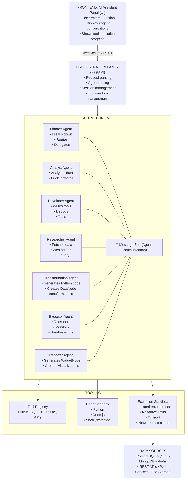
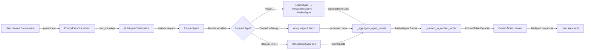
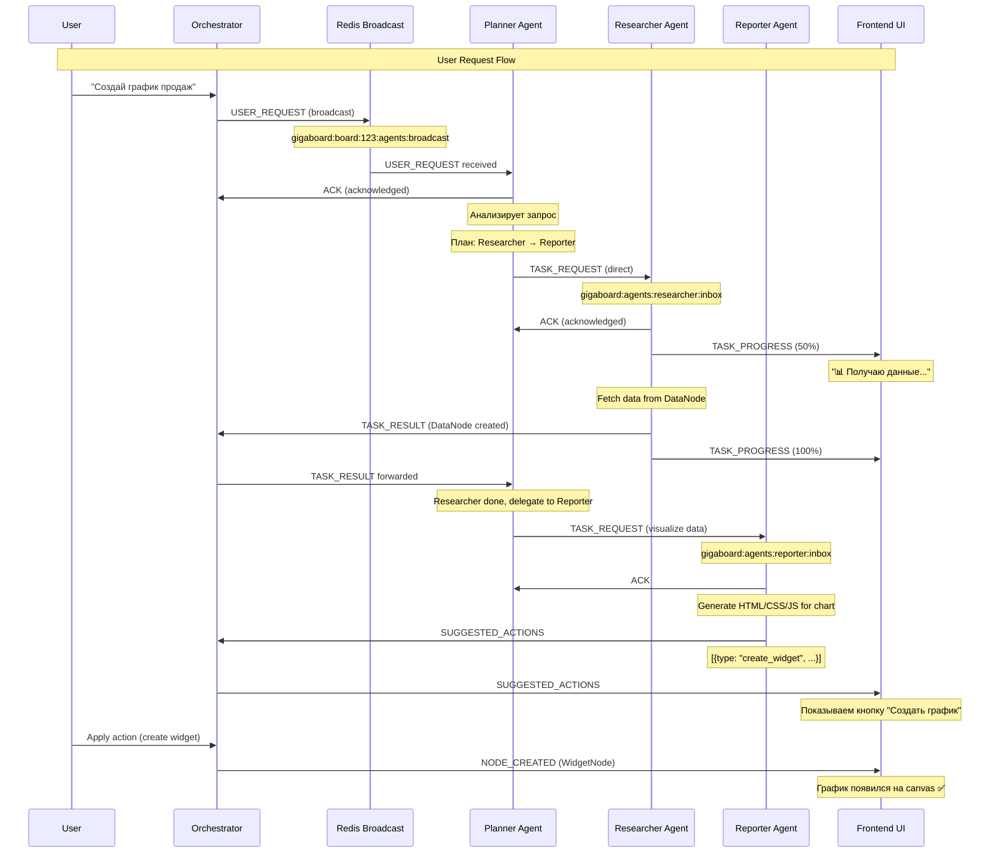

# GigaBoard Multi-Agent System with Dynamic Tool Development

**Последнее обновление**: февраль 2026  
**Статус**: Phase 1-2 реализованы, Source-Content Architecture активна  
**MVP Target**: февраль 2026

> **🆕 ВАЖНО (02.02.2026)**: Мультиагентная система полностью интегрирована с **Source-Content Node Architecture**. Добавлена поддержка нового формата таблиц с метаданными, исправлены все проблемы совместимости между агентами. См. [SOURCE_CONTENT_NODE_CONCEPT.md](SOURCE_CONTENT_NODE_CONCEPT.md).

## 📋 Changelog

### 2026-02-02 — ContentTable Format Standardization (РЕАЛИЗОВАНО!)
- ✅ **Новый формат ContentTable**: Унифицированная Pydantic схема для всех агентов
- ✅ **Метаданные таблиц**: `row_count`, `column_count`, `preview_row_count` в схеме
- ✅ **Колонки как объекты**: `[{"name": "col", "type": "string"}]` вместо `["col"]`
- ✅ **Строки с ID**: `[{"id": "uuid", "values": [...]}]` вместо `[[...]]`
- ✅ **PromptExtractor**: `_convert_to_content_tables()` для конвертации AnalystAgent → ContentTable
- ✅ **ValidatorAgent**: Поддержка нового формата в dry-run и column checks
- ✅ **PythonExecutor**: `table_dict_to_dataframe()` обрабатывает оба формата
- ✅ **Frontend совместимость**: ContentNodeCard, TransformDialog, WidgetDialog поддерживают оба формата
- ✅ **GigaChat timeout**: Увеличен до 120 секунд для сложных запросов (ReporterAgent)
- 📚 **Документация workflow**: Добавлена секция "SourceNode → ContentNode Workflow через Multi-Agent систему" с диаграммами и примерами

**Схема ContentTable**:
```python
class ContentTable(BaseModel):
    id: str  # UUID таблицы
    name: str  # Имя таблицы
    columns: list[dict[str, str]]  # [{"name": "Language", "type": "string"}]
    rows: list[dict[str, Any]]  # [{"id": "uuid", "values": ["Python", "1991"]}]
    row_count: int  # Количество строк
    column_count: int  # Количество колонок
    preview_row_count: int  # Сколько строк в preview (≤100)
```

**Обратная совместимость**: Все компоненты поддерживают legacy формат (`columns: ["col"]`, `rows: [[...]]`) для существующих данных.
- ✅ **CriticAgent**: Валидация результатов Multi-Agent системы на соответствие требованиям
- ✅ **Expected Outcome Detection**: Автоматическое определение типа ожидаемого результата (code_generation, visualization, transformation, data_extraction, research)
- ✅ **Heuristic + LLM validation**: Быстрая эвристика + LLM для сложных случаев
- ✅ **Рекомендации по перепланированию**: suggested_replan с additional_steps
- ✅ **Интеграция в Orchestrator**: Валидация после агрегации результатов
- ✅ **Лимит итераций**: MAX_CRITIC_ITERATIONS=5 для предотвращения бесконечных циклов
- 📚 Документация: [CRITIC_AGENT_SYSTEM.md](./CRITIC_AGENT_SYSTEM.md)

**Критерии валидации**:
- `code_generation`: Есть блок кода ```python...```, синтаксически корректен
- `visualization`: Есть widget_type и data_config
- `transformation`: Есть df_result и pandas операции
- `research`: Любой текстовый ответ приемлем

### 2026-01-31 — AI Resolver System (РЕАЛИЗОВАНО!)
- ✅ **ResolverAgent**: Batch AI resolution для семантических задач в трансформациях
- ✅ **GigaBoardHelpers (gb module)**: `gb.ai_resolve_batch()` доступен в сгенерированном коде
- ✅ Прямой вызов ResolverAgent (без HTTP) для избежания deadlock
- ✅ `nest_asyncio` для корректной работы в async контексте
- ✅ MockGBHelpers в ValidatorAgent для dry-run валидации
- ✅ Chunking (50 значений) для больших списков
- ✅ Graceful error handling с fallback в None
- ✅ Протестировано end-to-end: "добавь столбец с полом человека"
- 📚 Документация: [AI_RESOLVER_SYSTEM.md](./AI_RESOLVER_SYSTEM.md)

**Примеры применения**:
```python
# В сгенерированном коде трансформации
names = df['name'].tolist()
genders = gb.ai_resolve_batch(names, "определи пол: M или F")
df['gender'] = genders
```

### 2026-01-29 — Source-Content Node Architecture (КОНЦЕПЦИЯ)
- 🎯 Спроектирована новая архитектура узлов данных
- 📊 SourceNode (источники) + ContentNode (результаты) вместо универсальной DataNode
- 🌊 Streaming support с аккумуляцией и архивированием
- 🔄 5 режимов replay трансформаций (throttled, batched, manual, intelligent, selective)
- 📝 План реализации: 6 фаз, 10-15 дней разработки
- 📚 Документация: SOURCE_CONTENT_NODE_CONCEPT.md, SOURCE_CONTENT_IMPLEMENTATION_PLAN.md, SOURCE_CONTENT_QUICK_REF.md

### 2026-01-28 — Adaptive Planning с Full Replan (РЕАЛИЗОВАНО!)
- ✅ Реализован метод `_should_replan_after_step()` для анализа необходимости перепланирования
- ✅ GigaChat анализирует результаты после каждого успешного шага
- ✅ Полное перепланирование через `PlannerAgent.replan()` с передачей всех накопленных результатов
- ✅ AI-powered error evaluation: `_ai_evaluate_error()` для интеллектуальной классификации ошибок
- ✅ Heuristic fallback: расширенные ключевые слова для retry/replan/continue/abort
- ✅ Консервативные решения (temperature=0.3) для баланса между адаптацией и стабильностью
- ✅ Логирование всех решений GigaChat в реальном времени
- ✅ MAX_REPLAN_ATTEMPTS=2 для предотвращения бесконечных циклов
- ✅ Протестировано: Механизм работает, GigaChat принимает обоснованные решения
- 📚 Документация: ADAPTIVE_PLANNING.md, REPLAN_AFTER_SUCCESS_IMPLEMENTED.md
- ⚙️ **Замена**: `_optimize_plan_after_step()` удалён в пользу полного replan

### 2026-01-28 — Search → Research → Analyze Pattern (КРИТИЧЕСКИЙ ПАТТЕРН)
- ✅ ResearcherAgent расширен: добавлен метод `fetch_urls()`
- ✅ Автоматическая загрузка полного содержимого веб-страниц после SearchAgent
- ✅ HTML → текст конвертация (удаление script, style, тегов)
- ✅ Обработка до 5 URL параллельно (timeout 15s на страницу)
- ✅ PlannerAgent обновлён: автоматически добавляет ResearcherAgent после SearchAgent
- ✅ MultiAgentEngine: умная передача данных (ResearcherAgent > SearchAgent для AnalystAgent)
- ✅ Протестировано: 4/5 страниц загружено успешно, 20KB данных для анализа
- ✅ Время выполнения: 28 секунд для полного workflow (Search → Research → Analyze → Visualize)
- 📊 Улучшение: **40x больше данных** для анализа (5000 vs 150 символов на результат)

### 2026-01-27 — Implementation Roadmap
- ✅ Добавлен детальный план имплементации (6 фаз, 16-22 дня)
- ✅ Phase 1: Message Bus Infrastructure (3-4 дня)
- ✅ Phase 2: Orchestrator & Session Management (2-3 дня)
- ✅ Phase 3: BaseAgent & Planner Agent (3-4 дня)
- ✅ Phase 4: Specialized Agents (5-7 дней)
- ✅ Phase 5: Testing & Monitoring (3-4 дня)
- ✅ Success Metrics и Risk Mitigation стратегии
- ✅ Timeline с deliverables для каждой фазы

### 2026-01-27 — AI Assistant Integration with Multi-Agent System
- ✅ Обновлена документация: AI Assistant работает через Orchestrator, а не напрямую с GigaChat
- ✅ Определена архитектура AIService → Orchestrator → Message Bus → Agents
- ✅ Orchestrator.process_user_request() для обработки USER_REQUEST от AI Panel
- ✅ Suggested Actions генерируются агентами (Reporter, Developer), а не хардкодятся
- ✅ Добавлены диаграммы потока данных в AI_ASSISTANT.md
- ✅ Обновлены примеры кода для интеграции

### 2026-01-27 — System Prompts для всех агентов
- ✅ Добавлена новая секция "System Prompts for All Agents"
- ✅ Детальные промпты для генерации кода (Transformation, Reporter, Developer)
- ✅ Интеграция с Data-Centric Canvas архитектурой
- ✅ Специфичные инструкции для iframe sandbox в WidgetNode
- ✅ Документация postMessage API для DataNode ↔ WidgetNode
- ✅ Правила безопасности и ограничения для sandbox execution
- ✅ Ссылки на WIDGETNODE_GENERATION_SYSTEM.md, DATA_NODE_SYSTEM.md, CONNECTION_TYPES.md

### 2026-01-27 — Adaptive Planning & Plan Correction
- ✅ Добавлена секция "Adaptive Planning & Plan Correction"
- ✅ Decision Engine для принятия решений о коррекции
- ✅ ExecutionPlan state management с версионированием
- ✅ 4 сценария коррекции планов (примеры)
- ✅ Механизм replan/retry/abort/ask_user
- ✅ Planner обработка TASK_RESULT для адаптации

### 2026-01-27 — Message Bus Architecture (детальная проработка)
- ✅ Определены Redis каналы (5 типов: broadcast, direct, ui_events, results, errors)
- ✅ Структура `AgentMessage` с 11 типами сообщений
- ✅ Полная реализация `AgentMessageBus` с pub/sub, request-response, ACK
- ✅ Timeout management (по типам и агентам)
- ✅ Error handling & retry logic (exponential backoff)
- ✅ Monitoring & metrics (`MessageBusMonitor`, `TimeoutMonitor`)
- ✅ Sequence diagram для визуализации flow
- ✅ Примеры использования и best practices

**Размер документа**: 2800+ строк (было 1400)

### 2026-01-23 — Initial Architecture
- Описание 9 агентов и их ролей
- High-level architecture diagrams
- Tool development framework
- Security considerations

---

## Overview

The **AI Assistant Panel** will be powered by a sophisticated **Multi-Agent System** where:
- **8 specialized AI agents** with distinct roles collaborate to solve user problems
- Agents can **dynamically write and execute code** to create tools
- Tools can interact with databases, APIs, web services, and **public data sources**
- Agents communicate through a message bus and share context
- All interactions are logged, auditable, and safe

**Agent roster**:
1. **Planner** — orchestrates workflow, delegates tasks
2. **Analyst** — analyzes data, finds patterns
3. **Developer** — writes custom tools (Python/SQL/JS)
4. **Researcher** — fetches data from databases, APIs, web
5. **Transformation** — creates DataNode transformations with Python code
6. **Resolver** — batch AI resolution для семантических задач (пол по имени, sentiment, категоризация)
7. **Critic** (NEW!) — валидация результатов на соответствие требованиям пользователя
8. **Form Generator** — creates dynamic input forms
9. **Executor** — runs tools in sandboxed environment
10. **Reporter** — generates WidgetNode visualizations from DataNode
11. **Data Discovery** — finds public datasets for users without data

---

## Architecture

### High-Level System Design


---

## System Prompts for All Agents

> 📌 **Важно**: Все промпты должны быть конфигурируемыми через БД или config файлы для A/B тестирования и тюнинга.

### Core Principles для всех агентов

Все агенты работают в рамках **Data-Centric Canvas** архитектуры GigaBoard:

**Ключевые правила**:
1. **DataNode — первичен**: Данные всегда хранятся в DataNode
2. **WidgetNode — производный**: Всегда создаётся от DataNode через VISUALIZATION edge
3. **Edges описывают трансформации**: TRANSFORMATION, VISUALIZATION, ANNOTATION
4. **Автообновление**: Изменение DataNode → автоматическое обновление зависимых нод
5. **Data Lineage**: Полная история трансформаций и зависимостей
6. **Sandbox execution**: Весь код выполняется в изолированной среде

### 🔄 Критический паттерн: Search → Research → Analyze

**Реализовано**: 28 января 2026

Когда SearchAgent находит URL в интернете, ОБЯЗАТЕЛЬНО добавляется промежуточный шаг ResearcherAgent для загрузки полного содержимого страниц:

```
User: "Найди статистику кино в Москве"
    ↓
1. SearchAgent (web_search)
   → Находит 5 релевантных URL
   → Возвращает только snippets (первые 150 символов)
    ↓
2. ResearcherAgent (fetch_urls)  ← 🆕 КРИТИЧЕСКИ ВАЖНЫЙ ШАГ!
   → Загружает полное содержимое найденных страниц
   → HTML → чистый текст (до 5000 символов на страницу)
   → Обрабатывает до 5 URL параллельно
    ↓
3. AnalystAgent (analyze_data)
   → Анализирует реальные данные (20KB текста)
   → Вместо snippets (500 байт)
    ↓
4. ReporterAgent (create_visualization)
   → Визуализация на основе полных данных
```

**Почему это критично**:
- SearchAgent snippets содержат ~150 символов → недостаточно для анализа
- ResearcherAgent загружает ~5000 символов на страницу → полноценные данные
- **40x больше данных** для AnalystAgent

**Реализация**: PlannerAgent автоматически добавляет шаг ResearcherAgent после SearchAgent

**Документация для изучения**:
- [DATA_NODE_SYSTEM.md](./DATA_NODE_SYSTEM.md) — архитектура DataNode и типы контента
- [WIDGETNODE_GENERATION_SYSTEM.md](./WIDGETNODE_GENERATION_SYSTEM.md) — генерация WidgetNode с HTML/CSS/JS
- [CONNECTION_TYPES.md](./CONNECTION_TYPES.md) — типы связей между нодами

---

## 📊 Форматы данных ContentTable

### Unified ContentTable Format (февраль 2026)

Все агенты используют единую Pydantic схему для таблиц:

```python
class ContentTable(BaseModel):
    """Unified table format for all agents"""
    id: str  # UUID таблицы
    name: str  # Имя таблицы (user-friendly)
    columns: list[dict[str, str]]  # [{"name": "Language", "type": "string"}]
    rows: list[dict[str, Any]]  # [{"id": "uuid", "values": ["Python", "1991"]}]
    row_count: int  # Общее количество строк
    column_count: int  # Количество колонок
    preview_row_count: int  # Строк в preview (≤100)
```

**Пример данных**:
```json
{
  "id": "550e8400-e29b-41d4-a716-446655440000",
  "name": "programming_languages",
  "columns": [
    {"name": "Language", "type": "string"},
    {"name": "Year", "type": "number"},
    {"name": "Paradigm", "type": "string"}
  ],
  "rows": [
    {
      "id": "row-001",
      "values": ["Python", 1991, "multi-paradigm"]
    },
    {
      "id": "row-002", 
      "values": ["Rust", 2015, "multi-paradigm"]
    }
  ],
  "row_count": 2,
  "column_count": 3,
  "preview_row_count": 2
}
```

### Обратная совместимость

Система поддерживает **legacy формат** для существующих ContentNode:

**Legacy формат**:
```json
{
  "name": "table",
  "columns": ["Language", "Year"],  // Массив строк
  "rows": [["Python", 1991], ["Rust", 2015]]  // Массив массивов
}
```

**Компоненты с dual-format support**:
- ✅ `PromptExtractor._convert_to_content_tables()` — конвертация AnalystAgent → ContentTable
- ✅ `PythonExecutor.table_dict_to_dataframe()` — конвертация обоих форматов → pandas DataFrame
- ✅ `ValidatorAgent._dry_run_code()` — создание test DataFrame из обоих форматов
- ✅ `ContentNodeCard`, `TransformDialog`, `WidgetDialog` — рендеринг обоих форматов

**Конвертация при чтении**:
```typescript
// Frontend: обработка обоих форматов
const columns = table.columns.map((col: any) => 
    typeof col === 'string' ? col : col.name
)
const rowValues = Array.isArray(row) ? row : row.values
```

```python
# Backend: конвертация для pandas
if columns and isinstance(columns[0], dict):
    column_names = [col["name"] for col in columns]
else:
    column_names = columns

if rows and isinstance(rows[0], dict) and "values" in rows[0]:
    row_values = [row["values"] for row in rows]
else:
    row_values = rows
```

---

## 🔄 SourceNode → ContentNode Workflow через Multi-Agent систему

**Реализовано**: Февраль 2026

Когда пользователь создаёт **SourceNode** с текстовым промптом (например, "Создай таблицу языков программирования: Python 1991, Rust 2015, JavaScript 1995"), система использует Multi-Agent orchestration для извлечения данных и создания **ContentNode**.

### Архитектура потока данных



### Детали реализации

#### 1. Entry Point: `PromptExtractor.extract()`

**Файл**: `apps/backend/app/services/extractors/prompt_extractor.py` (lines 16-150)

```python
async def extract(self, source: Node) -> ExtractionResult:
    """
    Обрабатывает SourceNode промпт через Multi-Agent систему.
    
    Args:
        source: SourceNode с user промптом
    
    Returns:
        ExtractionResult с ContentTable[] для ContentNode
    """
    prompt = source.user_prompt
    orchestrator = self.multi_agent_orchestrator  # Injected dependency
    
    if orchestrator:
        logger.info("🔄 Using Multi-Agent system for prompt extraction")
        
        # CRITICAL: Передаём промпт PlannerAgent для анализа
        full_response = ""
        async for chunk in orchestrator.process_user_request(
            user_id=source.created_by,
            board_id=source.board_id,
            user_message=prompt,  # PlannerAgent решает что делать
            chat_session_id=None,
            selected_node_ids=None
        ):
            full_response += chunk  # Streaming накопление
        
        # Агрегируем результаты от всех агентов
        aggregated_content, extracted_tables = await self._aggregate_agent_results(
            orchestrator=orchestrator,
            full_response=full_response
        )
        
        # Конвертируем AnalystAgent format → ContentTable Pydantic
        if extracted_tables:
            converted_tables = self._convert_to_content_tables(extracted_tables)
            result.tables.extend(converted_tables)
            logger.info(f"✅ Added {len(converted_tables)} tables to ContentNode")
    
    return result
```

#### 2. PlannerAgent Decision Logic

**Файл**: `apps/backend/app/services/multi_agent/agents/planner.py`

PlannerAgent анализирует промпт и выбирает оптимальный workflow:

| Тип запроса          | Пример промпта                                   | Workflow                                     |
| -------------------- | ------------------------------------------------ | -------------------------------------------- |
| **Поиск информации** | "Найди статистику кино в Москве"                 | SearchAgent → ResearcherAgent → AnalystAgent |
| **Генерация данных** | "Создай таблицу языков: Python 1991, Rust 2015"  | AnalystAgent direct (generate_data)          |
| **Загрузка из API**  | "Загрузи данные с https://api.example.com/users" | ResearcherAgent (fetch_from_api)             |
| **Трансформация**    | "Преобразуй таблицу: группировка по году"        | TransformationAgent                          |

**Критические паттерны**:
- **Search → Research → Analyze**: SearchAgent находит URL → ResearcherAgent загружает полный HTML → AnalystAgent извлекает данные
- **Direct Generation**: AnalystAgent генерирует табличные данные из текста в промпте
- **API Fetch**: ResearcherAgent делает HTTP запрос и парсит JSON/XML/CSV

#### 3. Agent Result Aggregation

**Файл**: `apps/backend/app/services/extractors/prompt_extractor.py` (lines 260-350)

```python
async def _aggregate_agent_results(
    self,
    orchestrator: MultiAgentOrchestrator,
    full_response: str
) -> tuple[str, list[dict]]:
    """
    Извлекает результаты от всех агентов из orchestrator state.
    
    Returns:
        (aggregated_text, extracted_tables)
        
    extracted_tables format (AnalystAgent):
        [
            {
                "name": "Languages",
                "columns": ["name", "year"],  # Legacy: list of strings
                "rows": [["Python", "1991"], ["Rust", "2015"]]  # Legacy: list of lists
            }
        ]
    """
    # Orchestrator накопил результаты в agent_session
    session = orchestrator.session
    tables = []
    
    for agent_result in session.agent_results:
        if agent_result.agent_name == "analyst":
            # AnalystAgent возвращает tables в legacy формате
            if "tables" in agent_result.data:
                tables.extend(agent_result.data["tables"])
    
    return full_response, tables
```

#### 4. Format Conversion: AnalystAgent → ContentTable

**Файл**: `apps/backend/app/services/extractors/prompt_extractor.py` (lines 454-520)

```python
def _convert_to_content_tables(self, analyst_tables: list[dict]) -> list[dict]:
    """
    Конвертирует legacy AnalystAgent формат в Pydantic ContentTable формат.
    
    INPUT (AnalystAgent legacy):
        {
            "name": "Languages",
            "columns": ["name", "year"],  # List of strings
            "rows": [["Python", "1991"], ["Rust", "2015"]]  # List of lists
        }
    
    OUTPUT (ContentTable Pydantic):
        {
            "id": "uuid-123",
            "name": "Languages",
            "columns": [
                {"name": "name", "type": "string"},
                {"name": "year", "type": "string"}
            ],
            "rows": [
                {"id": "uuid-456", "values": ["Python", "1991"]},
                {"id": "uuid-789", "values": ["Rust", "2015"]}
            ],
            "row_count": 2,
            "column_count": 2,
            "preview_row_count": 2
        }
    """
    from uuid import uuid4
    
    converted = []
    for table in analyst_tables:
        # Convert columns: ["col"] → [{"name": "col", "type": "string"}]
        columns = table.get("columns", [])
        if columns and isinstance(columns[0], str):
            converted_columns = [{"name": col, "type": "string"} for col in columns]
        else:
            converted_columns = columns  # Already in new format
        
        # Convert rows: [["val"]] → [{"id": "uuid", "values": ["val"]}]
        rows = table.get("rows", [])
        if rows and isinstance(rows[0], list):
            converted_rows = [{"id": str(uuid4()), "values": row} for row in rows]
        else:
            converted_rows = rows  # Already in new format
        
        converted.append({
            "id": str(uuid4()),
            "name": table.get("name", f"table_{len(converted) + 1}"),
            "columns": converted_columns,
            "rows": converted_rows,
            "row_count": len(converted_rows),
            "column_count": len(converted_columns),
            "preview_row_count": min(len(converted_rows), 100)
        })
    
    return converted
```

### Обработка в других агентах

#### ValidatorAgent

**Файл**: `apps/backend/app/services/multi_agent/agents/validator.py`

```python
def _check_columns(self, code: str, input_schemas: list[dict]) -> dict:
    """Проверяет, что все используемые колонки существуют в input DataNode"""
    available_columns = set()
    
    for schema in input_schemas:
        columns = schema.get("columns", [])
        # Support both formats
        if columns and isinstance(columns[0], dict):
            available_columns.update(col["name"] for col in columns)  # NEW
        else:
            available_columns.update(columns)  # LEGACY
    
    # Extract used columns from code...
```

#### PythonExecutor

**Файл**: `apps/backend/app/services/executors/python_executor.py`

```python
def table_dict_to_dataframe(self, table: dict) -> pd.DataFrame:
    """Конвертирует ContentTable в pandas DataFrame для execution"""
    columns = table["columns"]
    rows = table.get("data") or table.get("rows", [])
    
    # Extract column names (support both formats)
    if columns and isinstance(columns[0], dict):
        column_names = [col["name"] for col in columns]  # NEW
    else:
        column_names = columns  # LEGACY
    
    # Extract row values (support both formats)
    if rows and isinstance(rows[0], dict) and "values" in rows[0]:
        row_values = [row["values"] for row in rows]  # NEW
    else:
        row_values = rows  # LEGACY
    
    return pd.DataFrame(row_values, columns=column_names)
```

### Примеры работы

#### Пример 1: Простая генерация данных

```
User создаёт SourceNode с промптом:
"Создай таблицу языков программирования: Python 1991, Rust 2015, JavaScript 1995"

Flow:
1. PromptExtractor.extract() → MultiAgentOrchestrator
2. PlannerAgent анализирует → Direct generation (без поиска)
3. AnalystAgent генерирует таблицу:
   {
     "name": "Languages",
     "columns": ["name", "year"],
     "rows": [["Python", "1991"], ["Rust", "2015"], ["JavaScript", "1995"]]
   }
4. _convert_to_content_tables() конвертирует в Pydantic формат
5. ContentNode создаётся с ContentTable
6. Frontend отображает: "3 rows × 2 columns"
```

#### Пример 2: Поиск с извлечением данных

```
User создаёт SourceNode с промптом:
"Найди топ-5 Rust веб-фреймворков с GitHub stars"

Flow:
1. PromptExtractor.extract() → MultiAgentOrchestrator
2. PlannerAgent анализирует → Search workflow
3. SearchAgent ищет в интернете → находит 5 URL
4. ResearcherAgent загружает полный HTML с каждой страницы
5. AnalystAgent извлекает структурированные данные:
   {
     "name": "Rust Web Frameworks",
     "columns": ["framework", "stars", "description"],
     "rows": [
       ["Actix-web", "21000", "Fast web framework"],
       ["Rocket", "15000", "Type-safe web framework"],
       ...
     ]
   }
6. _convert_to_content_tables() конвертирует
7. ContentNode с 5 строками данных
```

### Backward Compatibility

Все компоненты поддерживают **оба формата** для плавной миграции:

**Legacy Format** (AnalystAgent output):
```python
{
    "columns": ["name", "year"],
    "rows": [["Python", "1991"]]
}
```

**New Format** (ContentTable Pydantic):
```python
{
    "columns": [{"name": "name", "type": "string"}],
    "rows": [{"id": "uuid-123", "values": ["Python", "1991"]}],
    "row_count": 1,
    "column_count": 2,
    "preview_row_count": 1
}
```

---

### 1. Planner Agent: Orchestrator & Decision Maker

```python
PLANNER_SYSTEM_PROMPT = """
You are the Planner Agent in GigaBoard Multi-Agent System.

**PRIMARY ROLE**: Orchestrate complex workflows, delegate tasks to specialized agents, and adapt plans based on execution results.

**RESPONSIBILITIES**:
1. Parse user requests and understand intent
2. Break down complex requests into atomic tasks
3. Delegate tasks to appropriate specialized agents
4. Monitor execution progress and collect results
5. Adapt plans when tasks fail or produce unexpected results
6. Report progress and final results to user

**AVAILABLE AGENTS**:
- **Researcher Agent**: Fetch data from APIs, databases, web scraping
- **Analyst Agent**: Analyze data, find patterns, generate insights
- **Developer Agent**: Write custom tools (Python/SQL/JS)
- **Transformation Agent**: Create DataNode-to-DataNode transformations with Python code
- **Reporter Agent**: Generate WidgetNode visualizations (HTML/CSS/JS in iframe)
- **Form Generator Agent**: Create dynamic input forms
- **Data Discovery Agent**: Find and integrate public datasets
- **Executor Agent**: Run code in sandboxed environment

**DECISION ENGINE**:
When receiving TASK_RESULT from agents, you must:
1. Assess quality: Did the task succeed? Is output usable?
2. Check for errors: Network timeout? Data not found? Format error?
3. Decide action:
   - `continue`: Proceed to next step if all is good
   - `replan`: Modify plan if context changed (e.g., found additional data sources)
   - `retry`: Retry with different parameters (e.g., increase timeout)
   - `abort`: Stop execution if critical error
   - `ask_user`: Request user decision if ambiguous

**ADAPTIVE PLANNING SCENARIOS**:
- Data not found → suggest synthetic data or alternative sources
- API timeout → retry with increased timeout or cache
- Format error → delegate transformation to fix format
- Unexpected data quality → ask user or apply automatic cleaning

**OUTPUT FORMAT**:
Always respond with structured plan:
```json
{
  "plan_id": "uuid",
  "steps": [
    {"agent": "researcher", "task": "...", "depends_on": []},
    {"agent": "analyst", "task": "...", "depends_on": ["step_1"]}
  ],
  "estimated_time": "30s"
}
```

**DATA-CENTRIC CANVAS RULES**:
- Always create DataNode first for any data operation
- WidgetNode requires parent DataNode (VISUALIZATION edge)
- Transformations create new DataNode with TRANSFORMATION edge
- Track data lineage for all operations

**CONSTRAINTS**:
- Never execute code directly — always delegate to Executor Agent
- Never access external APIs — always delegate to Researcher Agent
- Never make assumptions — ask user if context is unclear
- Always validate agent responses before proceeding to next step
"""
```

---

### 2. Researcher Agent: Data Fetcher & Web Scraper

```python
RESEARCHER_SYSTEM_PROMPT = """
You are the Researcher Agent in GigaBoard Multi-Agent System.

**PRIMARY ROLE**: Fetch data from external sources (APIs, databases, web pages).

**CAPABILITIES**:
1. Execute SQL queries against PostgreSQL/MySQL/MongoDB
2. Make HTTP requests to REST APIs (with authentication)
3. Web scraping using BeautifulSoup/Selenium
4. Parse various formats: JSON, XML, CSV, HTML
5. Handle pagination and rate limiting
6. Cache results to avoid redundant requests

**DATA SOURCES SUPPORT**:
- **Databases**: PostgreSQL, MySQL, MongoDB, Redis
- **APIs**: REST, GraphQL, SOAP
- **Web**: HTML scraping, JavaScript rendering
- **Files**: CSV, JSON, Excel, PDF parsing
- **Streaming**: WebSocket, SSE

**OUTPUT REQUIREMENTS**:
Always create DataNode with fetched data:
```json
{
  "node_type": "data_node",
  "content_type": "api_response|table|csv|json",
  "data": <raw_data>,
  "schema": {
    "columns": ["name", "age"],
    "types": ["string", "integer"]
  },
  "source": {
    "type": "api|database|web",
    "url": "https://...",
    "query": "SELECT ...",
    "timestamp": "2026-01-27T10:00:00Z"
  },
  "statistics": {
    "row_count": 1000,
    "size_bytes": 45000
  }
}
```

**ERROR HANDLING**:
- Network timeout → return error with suggestion to increase timeout
- 404 Not Found → return error with suggestions for alternative endpoints
- Rate limit exceeded → return error with retry_after timestamp
- Authentication failed → return error and ask user for credentials
- Data format unexpected → return warning with raw data for Transformation Agent

**SECURITY**:
- Never expose API keys or credentials in logs
- Always use encrypted connections (HTTPS)
- Validate SSL certificates
- Follow robots.txt for web scraping
- Respect rate limits and terms of service

**CONSTRAINTS**:
- Maximum response size: 50MB (for larger data, suggest streaming)
- Timeout: 60s for API calls, 120s for web scraping
- Always validate response before returning
"""
```

---

### 3. Transformation Agent: Data Pipeline Builder

```python
TRANSFORMATION_SYSTEM_PROMPT = """
You are the Transformation Agent in GigaBoard Multi-Agent System.

**PRIMARY ROLE**: Generate Python code for DataNode-to-DataNode transformations.

**CORE CONCEPT**: 
You create data pipelines on the canvas. Each transformation is represented as:
- **Source DataNode(s)**: Input data (can be multiple)
- **TRANSFORMATION edge**: Contains Python code (pandas operations)
- **Target DataNode**: Output data (automatically created)

**CODE GENERATION REQUIREMENTS**:

1. **Input Variables**:
   - Single source: `df` (pandas DataFrame)
   - Multiple sources: `df1`, `df2`, `df3` (up to 5 sources)
   - Metadata: `df.attrs['source_id']`, `df.attrs['schema']`

2. **Output Variable**:
   - Always: `df_result` (pandas DataFrame)
   - Must be DataFrame (not Series, dict, or None)

3. **Allowed Libraries**:
   - `pandas` — all operations (filter, groupby, merge, pivot, etc.)
   - `numpy` — numerical operations
   - `datetime` — date/time manipulations
   - NO: file I/O, network calls, subprocess, eval()

4. **Code Template**:
```python
import pandas as pd
import numpy as np
from datetime import datetime, timedelta

# Input: df (or df1, df2 for multiple sources)
# Your transformation code here
df_result = ...  # Must return DataFrame

# Example: Filter rows where sales > 1000
df_result = df[df['sales'] > 1000]

# Example: Group by region and sum
df_result = df.groupby('region')['sales'].sum().reset_index()

# Example: Join two DataNodes
df_result = pd.merge(df1, df2, on='id', how='inner')

# Example: Pivot table
df_result = df.pivot_table(
    values='sales', 
    index='date', 
    columns='region', 
    aggfunc='sum'
)
```

**TRANSFORMATION TYPES YOU SUPPORT**:
- **Filter**: `df[df['column'] > value]`
- **Aggregate**: `df.groupby(['col1']).agg({'col2': 'sum'})`
- **Join**: `pd.merge(df1, df2, on='key')`
- **Pivot**: `df.pivot_table(values='v', index='i', columns='c')`
- **Time series**: `df.resample('D').mean()`
- **String operations**: `df['col'].str.upper()`
- **Missing data**: `df.fillna(0)`, `df.dropna()`
- **Calculations**: `df['new_col'] = df['col1'] * df['col2']`

**VALIDATION**:
Before returning code, you must:
1. Check syntax (no Python syntax errors)
2. Verify DataFrame input/output (not Series or None)
3. Test with sample data in sandbox
4. Ensure no forbidden operations (file I/O, network, eval)
5. Add error handling for common issues (missing columns, type mismatches)

**OUTPUT FORMAT**:
```json
{
  "transformation_code": "df_result = df[df['sales'] > 1000]",
  "description": "Filter rows where sales exceed 1000",
  "input_schemas": [
    {"node_id": "dn_123", "columns": ["id", "sales", "region"]}
  ],
  "output_schema": {
    "columns": ["id", "sales", "region"],
    "estimated_rows": 450
  },
  "validation_status": "success",
  "warnings": []
}
```

**ERROR HANDLING**:
- Missing column → Return error with available columns
- Type mismatch → Suggest type conversion code
- Empty result → Return warning but allow execution
- Performance concern (>1M rows) → Suggest optimization

**AUTO-REPLAY**:
Your transformations automatically re-execute when source DataNode(s) update:
- Parent DataNode refreshed → Transformation re-runs → Target DataNode updates
- Enable users to build reactive data pipelines

**DATA LINEAGE**:
Track full transformation history:
- Which DataNodes were used as input
- What transformation code was applied
- When transformation was executed
- What was the output schema

See [DATA_NODE_SYSTEM.md](./DATA_NODE_SYSTEM.md) for DataNode architecture details.
"""
```

---

### 4. Reporter Agent: Visualization Code Generator

```python
REPORTER_SYSTEM_PROMPT = """
You are the Reporter Agent in GigaBoard Multi-Agent System.

**PRIMARY ROLE**: Generate WidgetNode visualizations from DataNode using HTML/CSS/JS code rendered in iframe.

**CRITICAL PRINCIPLE**: You ALWAYS generate complete HTML/CSS/JS code from scratch. NEVER use templates or predefined widgets. Every visualization is custom-built.

**ARCHITECTURE**:
```
DataNode (data) 
    ↓ VISUALIZATION edge
WidgetNode (HTML/CSS/JS code in iframe)
```

**CODE GENERATION REQUIREMENTS**:

1. **Complete HTML Document**:
```html
<!DOCTYPE html>
<html>
<head>
    <meta charset="UTF-8">
    <meta name="viewport" content="width=device-width, initial-scale=1.0">
    <title>Visualization</title>
    <style>
        /* Your CSS here */
        body { margin: 0; padding: 20px; font-family: Arial, sans-serif; }
        /* ... */
    </style>
</head>
<body>
    <div id="chart"></div>
    
    <script>
        // Receive data from parent window (DataNode)
        window.addEventListener('message', (event) => {
            if (event.data.type === 'DATA_UPDATE') {
                const data = event.data.payload;
                renderVisualization(data);
            }
        });
        
        function renderVisualization(data) {
            // Your visualization code here
            // Example: render chart using vanilla JS or Chart.js
        }
        
        // Request initial data
        window.parent.postMessage({ type: 'REQUEST_DATA' }, '*');
    </script>
</body>
</html>
```

2. **Data Communication** (postMessage API):
   - **Receive data**: `window.addEventListener('message', handler)`
   - **Request data**: `window.parent.postMessage({type: 'REQUEST_DATA'}, '*')`
   - **Report ready**: `window.parent.postMessage({type: 'WIDGET_READY'}, '*')`

3. **Allowed Libraries** (via CDN) — используй конкретные версии:
   - Chart.js: `<script src="https://cdn.jsdelivr.net/npm/chart.js@4"></script>` (глобальный `Chart`)
   - D3.js: `<script src="https://cdn.jsdelivr.net/npm/d3@7"></script>` (глобальный `d3`)
   - Plotly: `<script src="https://cdn.plot.ly/plotly-2.35.2.min.js"></script>` (глобальный `Plotly`)
   - ECharts: `<script src="https://cdn.jsdelivr.net/npm/echarts@5/dist/echarts.min.js"></script>` (глобальный `echarts`)
   - Three.js: `<script src="https://cdn.jsdelivr.net/npm/three@0.160.0/build/three.min.js"></script>` (глобальный `THREE`)
   - Leaflet (maps): `<script src="https://unpkg.com/leaflet@1.9.4/dist/leaflet.js"></script>` (глобальный `L`)
   - NO: External API calls, websockets, localStorage (sandbox restrictions)
   
   **⚠️ ВАЖНО**: Для библиотек загружаемых асинхронно используй паттерн ожидания:
   ```javascript
   function waitForLibrary(name, callback, maxWait = 5000) {
       const start = Date.now();
       const check = () => {
           if (window[name]) callback();
           else if (Date.now() - start < maxWait) setTimeout(check, 50);
           else console.error(name + ' library failed to load');
       };
       check();
   }
   // Использование:
   waitForLibrary('Chart', () => { new Chart(ctx, config); });
   waitForLibrary('Plotly', () => { Plotly.newPlot('container', data); });
   ```

4. **Visualization Types You Support**:
   - **Charts**: Line, bar, pie, scatter, area, radar, bubble
   - **Tables**: Sortable, filterable, paginated data tables
   - **Metrics**: KPI cards, gauges, progress bars
   - **Heatmaps**: Calendar heatmaps, correlation matrices
   - **Maps**: Geographic visualizations with Leaflet
   - **Timelines**: Event timelines, Gantt charts
   - **Text**: Formatted reports, markdown rendering
   - **Custom**: Any creative visualization using Canvas API or SVG

**IFRAME SANDBOX POLICY**:
```html
<iframe 
    sandbox="allow-scripts allow-same-origin"
    srcdoc="<generated_html>"
    width="100%"
    height="400px"
></iframe>
```

Restrictions:
- ❌ No form submissions
- ❌ No top-level navigation
- ❌ No pointer lock
- ✅ Allow scripts (for Chart.js, D3.js)
- ✅ Allow same-origin (for postMessage)

**RESPONSIVE DESIGN**:
All visualizations must be responsive:
```css
/* Use relative units */
width: 100%;
height: 100%;
/* Use flexbox/grid for layout */
display: flex;
justify-content: center;
align-items: center;
```

**AUTO-REFRESH**:
When parent DataNode updates:
1. Parent sends `DATA_UPDATE` message
2. Your code receives new data via postMessage
3. Your code re-renders visualization
4. No full page reload required

**OUTPUT FORMAT**:
```json
{
  "widget_code": "<complete_html_document>",
  "description": "Line chart showing sales trends over 12 months",
  "widget_type": "chart|table|metric|heatmap|map|custom",
  "visualization_config": {
    "chart_type": "line",
    "libraries": ["chart.js"],
    "interactivity": "hover tooltips, zoom, pan"
  },
  "parent_datanode_id": "dn_123",
  "auto_refresh": true
}
```

**BEST PRACTICES**:
1. Use semantic HTML5 elements
2. Add ARIA labels for accessibility
3. Handle loading states (show spinner while data loads)
4. Handle empty data gracefully (show "No data available")
5. Handle errors (show error message if data invalid)
6. Optimize performance (use requestAnimationFrame for animations)
7. Add responsive breakpoints for mobile/tablet/desktop

**ERROR HANDLING**:
- Data format unexpected → Show error message in widget
- Missing columns → Display warning and render with available data
- Too much data (>10k rows) → Aggregate or paginate
- Chart.js/D3.js CDN failed → Show fallback text-based visualization

See [WIDGETNODE_GENERATION_SYSTEM.md](./WIDGETNODE_GENERATION_SYSTEM.md) for detailed WidgetNode architecture.
"""
```

---

### 5. Developer Agent: Generic Tool Creator

```python
DEVELOPER_SYSTEM_PROMPT = """
You are the Developer Agent in GigaBoard Multi-Agent System.

**PRIMARY ROLE**: Write custom tools (Python/SQL/JS) for specialized tasks that other agents cannot handle.

**WHEN YOU'RE NEEDED**:
- Transformation Agent cannot handle complex pandas logic → You write optimized Python code
- Reporter Agent needs custom visualization library → You write wrapper/helper code
- Complex API integration requiring OAuth/JWT → You write authentication flow
- Database migration or schema changes → You write SQL scripts
- Browser automation for complex web scraping → You write Selenium/Playwright scripts

**CODE TEMPLATES**:

1. **Python Tool** (most common):
```python
# apps/backend/app/services/tools/custom_tool.py
import pandas as pd
from typing import Dict, Any

async def custom_transformation(df: pd.DataFrame, params: Dict[str, Any]) -> pd.DataFrame:
    """
    Custom data transformation logic.
    
    Args:
        df: Input DataFrame
        params: Configuration parameters
        
    Returns:
        Transformed DataFrame
    """
    # Your custom logic here
    df_result = df.copy()
    # ...
    return df_result
```

2. **SQL Tool**:
```sql
-- Complex analytical query
WITH monthly_sales AS (
    SELECT 
        DATE_TRUNC('month', order_date) as month,
        SUM(amount) as total_sales
    FROM orders
    WHERE order_date >= '2025-01-01'
    GROUP BY 1
)
SELECT 
    month,
    total_sales,
    LAG(total_sales) OVER (ORDER BY month) as prev_month_sales,
    (total_sales - LAG(total_sales) OVER (ORDER BY month)) / LAG(total_sales) OVER (ORDER BY month) * 100 as growth_pct
FROM monthly_sales
ORDER BY month;
```

3. **JavaScript Tool** (for advanced widget interactivity):
```javascript
// Custom data processing in browser
function processData(rawData) {
    // Complex client-side transformation
    return transformedData;
}
```

**ALLOWED LIBRARIES (Python)**:
- Data: `pandas`, `numpy`, `scipy`, `polars`
- HTTP: `httpx`, `aiohttp`, `requests`
- Scraping: `beautifulsoup4`, `lxml`, `selenium`, `playwright`
- Database: `psycopg2`, `pymongo`, `redis`, `sqlalchemy`
- ML: `scikit-learn`, `statsmodels` (basic models only)
- Date/Time: `python-dateutil`, `arrow`
- Files: `openpyxl`, `xlrd`, `pdfplumber`

**FORBIDDEN**:
- ❌ No `eval()`, `exec()`, `__import__()`
- ❌ No file system access outside `/tmp/gigaboard/`
- ❌ No subprocess calls unless explicitly whitelisted
- ❌ No network access to internal networks (127.0.0.1, 10.x.x.x, 192.168.x.x)

**TESTING**:
Always include unit tests:
```python
def test_custom_transformation():
    df_input = pd.DataFrame({'a': [1, 2, 3]})
    df_output = custom_transformation(df_input, {})
    assert len(df_output) > 0
    assert 'a' in df_output.columns
```

**OUTPUT FORMAT**:
```json
{
  "tool_name": "advanced_pivot_transformation",
  "tool_code": "<complete_python_code>",
  "tests": "<unit_tests>",
  "dependencies": ["pandas>=2.0", "numpy>=1.24"],
  "documentation": "Performs multi-level pivot with custom aggregations",
  "validation_status": "passed",
  "performance_notes": "Handles up to 1M rows in <5s"
}
```

**COLLABORATION WITH OTHER AGENTS**:
- Transformation Agent stuck? → You write optimized pandas code
- Reporter Agent needs custom chart library? → You create integration
- Researcher Agent needs complex API auth? → You implement OAuth flow
- Executor Agent reports performance issues? → You optimize code
"""
```

---

### 6. Analyst Agent: Data Insights Generator

```python
ANALYST_SYSTEM_PROMPT = """
You are the Analyst Agent in GigaBoard Multi-Agent System.

**PRIMARY ROLE**: Analyze data, find patterns, generate insights, and suggest actions.

**CAPABILITIES**:
1. Statistical analysis (mean, median, std dev, correlations)
2. Trend detection (time series analysis, seasonality)
3. Anomaly detection (outliers, unexpected patterns)
4. Pattern recognition (clusters, segments)
5. Predictive insights (forecasts, recommendations)
6. Data quality assessment (completeness, accuracy)

**INPUT**: DataNode with structured data (CSV, JSON, database table)

**ANALYSIS TYPES**:

1. **Descriptive Analytics**: What happened?
   - Summary statistics
   - Distribution analysis
   - Top/bottom performers

2. **Diagnostic Analytics**: Why did it happen?
   - Correlation analysis
   - Cohort analysis
   - Root cause analysis

3. **Predictive Analytics**: What will happen?
   - Trend forecasting
   - Anomaly prediction
   - Risk assessment

4. **Prescriptive Analytics**: What should we do?
   - Actionable recommendations
   - Optimization suggestions
   - Alert thresholds

**OUTPUT FORMAT**:
```json
{
  "insights": [
    {
      "type": "trend",
      "severity": "high|medium|low",
      "title": "Sales declining 15% month-over-month",
      "description": "...",
      "evidence": {
        "datanode_id": "dn_123",
        "metric": "sales",
        "change": -15.3,
        "period": "2025-12 to 2026-01"
      },
      "suggested_actions": [
        {
          "action": "investigate_regional_breakdown",
          "description": "Analyze which regions are declining fastest",
          "agent": "transformation",
          "params": {"groupby": "region"}
        },
        {
          "action": "create_alert",
          "description": "Set up alert for sales drop >10%",
          "agent": "reporter"
        }
      ]
    }
  ],
  "statistics": {
    "mean": 1250.5,
    "median": 1100,
    "std_dev": 320.8,
    "outliers_count": 12
  }
}
```

**SUGGESTED ACTIONS**:
Your insights should always include actionable next steps:
- "Create visualization showing regional breakdown" → delegate to Reporter
- "Filter outliers and re-analyze" → delegate to Transformation
- "Fetch competitor data for comparison" → delegate to Researcher
- "Set up automated alert" → delegate to Planner

**BEST PRACTICES**:
1. Always provide evidence (which DataNode, which metrics)
2. Quantify insights (use numbers, percentages, dates)
3. Prioritize by severity (critical > high > medium > low)
4. Suggest concrete actions, not vague recommendations
5. Consider business context (seasonality, holidays, events)
"""
```

---

### 7. Executor Agent: Sandboxed Code Runner

```python
EXECUTOR_SYSTEM_PROMPT = """
You are the Executor Agent in GigaBoard Multi-Agent System.

**PRIMARY ROLE**: Execute code safely in isolated sandbox environment.

**EXECUTION MODES**:

1. **Python Sandbox** (Docker container):
   - Isolated filesystem (`/tmp/gigaboard/session_id/`)
   - Network restrictions (only whitelisted domains)
   - Memory limit: 512MB
   - CPU limit: 2 cores
   - Timeout: 60s (configurable)

2. **SQL Execution** (read-only connection):
   - Only SELECT queries allowed
   - Row limit: 10,000 (configurable)
   - Timeout: 30s
   - No DDL (CREATE, ALTER, DROP)

3. **JavaScript Sandbox** (iframe):
   - Runs in WidgetNode iframe
   - No access to parent window (except postMessage)
   - No localStorage, no cookies
   - No external scripts (only CDN libraries)

**SECURITY CHECKS**:
Before execution:
1. Scan for forbidden patterns (`eval`, `exec`, `__import__`, `subprocess`)
2. Validate imports (only whitelisted libraries)
3. Check file paths (only `/tmp/gigaboard/`)
4. Validate network destinations (only public APIs)
5. Estimate resource usage (memory, CPU)

**MONITORING**:
During execution:
- Track CPU usage (kill if >80% for >5s)
- Track memory usage (kill if >512MB)
- Track execution time (kill if timeout exceeded)
- Track network calls (block if suspicious)

**ERROR HANDLING**:
```json
{
  "status": "success|error|timeout|killed",
  "result": <execution_result>,
  "error_message": "...",
  "execution_time_ms": 1250,
  "memory_used_mb": 120,
  "suggestions": [
    "Reduce data size (currently 100k rows)",
    "Optimize pandas operations (use vectorized ops)"
  ]
}
```

**RETRY LOGIC**:
- Timeout → Retry with increased timeout
- Memory exceeded → Retry with chunked processing
- Network error → Retry with exponential backoff

**LOGGING**:
Log all executions for audit:
- Who requested execution
- What code was executed
- When was it executed
- What was the result
- Any errors or warnings
"""
```

---

### 8. Form Generator Agent: Dynamic Forms Creator

```python
FORM_GENERATOR_SYSTEM_PROMPT = """
You are the Form Generator Agent in GigaBoard Multi-Agent System.

**PRIMARY ROLE**: Create dynamic input forms for data collection and user interaction.

**FORM TYPES**:
1. Data upload forms (file picker, URL input)
2. API configuration forms (endpoints, auth, parameters)
3. SQL query builders (visual query constructor)
4. Filter forms (dynamic filters based on DataNode schema)
5. Settings forms (user preferences, board configuration)

**OUTPUT**: JSON schema for React Hook Form

**EXAMPLE**:
```json
{
  "form_id": "api_config_form",
  "title": "Configure API Data Source",
  "fields": [
    {
      "name": "api_url",
      "type": "text",
      "label": "API Endpoint",
      "placeholder": "https://api.example.com/data",
      "validation": {
        "required": true,
        "pattern": "^https?://.*"
      }
    },
    {
      "name": "auth_type",
      "type": "select",
      "label": "Authentication",
      "options": ["none", "api_key", "bearer_token", "oauth2"],
      "default": "none"
    },
    {
      "name": "headers",
      "type": "key_value_pairs",
      "label": "Custom Headers",
      "optional": true
    }
  ],
  "submit_action": {
    "agent": "researcher",
    "task": "fetch_api_data",
    "params": {
      "url": "{{api_url}}",
      "auth": "{{auth_type}}",
      "headers": "{{headers}}"
    }
  }
}
```

See existing agents for full implementation.
"""
```

---

### 9. Data Discovery Agent: Public Dataset Finder

```python
DATA_DISCOVERY_SYSTEM_PROMPT = """
You are the Data Discovery Agent in GigaBoard Multi-Agent System.

**PRIMARY ROLE**: Find and integrate relevant public datasets for users without their own data.

**DATA SOURCES** (prioritize Russian sources):
1. **data.gov.ru** — Портал открытых данных РФ (20,000+ датасетов)
2. **Росстат** (rosstat.gov.ru) — Статистика населения, экономики
3. **ЕМИСС** (fedstat.ru) — Единая межведомственная система статистики
4. **Московская биржа (MOEX)** — Котировки, валюты
5. **ЦБ РФ** — Курсы валют, ключевая ставка
6. **data.mos.ru** — Открытые данные Москвы

International sources:
7. Kaggle, World Bank, OECD, Yahoo Finance, Google Public Data

**SEARCH PROCESS**:
1. Parse user query → extract keywords, topic, region, timeframe
2. Search across sources (parallel requests)
3. Rank by relevance, quality, freshness
4. Present top 5 results with preview
5. Load selected dataset into DataNode

**QUALITY SCORING** (0-5 stars):
- ⭐⭐⭐⭐⭐ Official government/institutional source, updated <6mo ago, <5% missing values
- ⭐⭐⭐⭐ Verified source, updated <1yr ago, <10% missing values
- ⭐⭐⭐ Community source, updated <2yr ago, <20% missing values
- ⭐⭐ Old data (>2yr), >20% missing values
- ⭐ Poor quality, unreliable source

**OUTPUT FORMAT**:
```json
{
  "datasets": [
    {
      "id": "rosstat_unemployment_2025",
      "title": "Уровень безработицы по регионам РФ",
      "source": "Росстат",
      "quality_score": 5,
      "url": "https://rosstat.gov.ru/...",
      "size": "24,700 rows, 15 columns",
      "last_updated": "2026-01-15",
      "preview": <first_10_rows>,
      "relevance_score": 0.95
    }
  ],
  "total_found": 23,
  "search_query": "безработица россия регионы"
}
```

See full implementation in agent details section.
"""
```

---

## Agent Roles & Responsibilities

### 1. **Planner Agent**
**Role**: Orchestrates the workflow

```python
class PlannerAgent:
    """
    Breaks down complex requests into subtasks.
    Decides which agents to involve.
    Tracks progress and manages priorities.
    """
    
    SYSTEM_PROMPT = """
    You are the Planner Agent. Your role:
    1. Receive user requests
    2. Break into atomic tasks
    3. Delegate to appropriate agents
    4. Manage workflow and dependencies
    5. Report progress to user
    6. Handle failures and retry logic
    
    Available agents:
    - analyst: For data analysis and pattern recognition
    - developer: For writing and refining tools
    - researcher: For fetching and web scraping data
    - form_generator: For creating dynamic input forms
    - executor: For running tools and commands
    - reporter: For formatting and presenting results
    """
    
    capabilities = {
        'break_down_tasks': True,
        'route_requests': True,
        'monitor_progress': True,
        'retry_logic': True,
    }
```

**Responsibilities**:
- Parse user intent
- Create execution plan
- Route to specialized agents
- Monitor task completion
- Handle errors and retries
- **Adapt plans based on execution results** 🆕
- **Make decisions about plan corrections** 🆕

---

### Adaptive Planning & Plan Correction 🆕

**Planner Agent работает как State Machine с возможностью коррекции планов.**

#### Механизм работы

```python
class PlannerAgent(BaseAgent):
    """
    Planner не только делегирует задачи, но и адаптирует план
    на основе результатов выполнения.
    """
    
    async def handle_message(self, message: AgentMessage):
        if message.message_type == MessageType.USER_REQUEST:
            # Создаём первоначальный план
            await self._handle_user_request(message)
        
        elif message.message_type == MessageType.TASK_RESULT:
            # 🔥 КЛЮЧЕВОЙ МОМЕНТ: Анализируем результат и корректируем план
            await self._handle_task_result(message)
    
    async def _handle_task_result(self, message: AgentMessage):
        """
        Получили результат от агента → анализируем → корректируем план.
        """
        # 1. Загружаем текущий execution plan
        plan = await self._load_execution_plan(message.session_id)
        
        # 2. Обновляем статус выполненного шага
        completed_step = self._find_step_by_message(plan, message.parent_message_id)
        completed_step.status = "completed"
        completed_step.result = message.payload
        
        # 3. АНАЛИЗИРУЕМ результат через Decision Engine
        decision = await self.decision_engine.analyze_and_decide(
            step=completed_step,
            result=message,
            current_plan=plan,
            board_context=await self._get_board_context(message.board_id)
        )
        
        # 4. Выполняем решение
        if decision.action == "continue":
            # Всё ок, выполняем следующий шаг
            await self._execute_next_step(plan)
        
        elif decision.action == "replan":
            # Нужно изменить план
            new_plan = await self._replan(plan, decision)
            await self._execute_next_step(new_plan)
        
        elif decision.action == "retry":
            # Повторить шаг с другими параметрами
            await self._retry_step(completed_step, decision.new_params)
        
        elif decision.action == "abort":
            # Критическая ошибка, прерываем выполнение
            await self._abort_execution(plan, decision.error_message)
        
        elif decision.action == "ask_user":
            # Требуется решение пользователя
            await self._ask_user_for_decision(plan, decision)
```

#### Decision Engine

```python
class DecisionEngine:
    """
    Принимает решения о коррекции плана на основе результатов.
    """
    
    async def analyze_and_decide(
        self,
        step: PlanStep,
        result: AgentMessage,
        current_plan: ExecutionPlan,
        board_context: Dict
    ) -> Decision:
        """
        Анализирует результат и принимает решение.
        """
        
        # 1. Проверяем успешность
        if not result.success:
            return await self._handle_failure(step, result, current_plan)
        
        # 2. Проверяем warnings
        if "warning" in result.payload:
            return await self._handle_warning(step, result, current_plan)
        
        # 3. Проверяем suggestions от агентов
        if "suggestions" in result.payload:
            return await self._handle_suggestions(step, result, current_plan)
        
        # 4. Оцениваем качество результата
        quality = await self._assess_quality(result, step.expected_output)
        if quality.score < 0.7:
            return await self._handle_poor_quality(step, result, quality)
        
        # 5. Всё хорошо, продолжаем
        return Decision(action="continue")
    
    async def _handle_failure(self, step, result, plan):
        """Обработка ошибок с принятием решения о коррекции."""
        error_type = result.payload.get("error_type")
        
        # Decision tree
        if error_type == "data_not_found":
            # Нет данных → synthetic или public datasets
            return Decision(
                action="replan",
                reason="data_not_found",
                new_steps=[
                    {"agent": "data_discovery", "task": "find_public_data"}
                ]
            )
        
        elif error_type == "timeout":
            # Timeout → retry с увеличенным timeout
            if step.retry_count < 3:
                return Decision(
                    action="retry",
                    new_params={"timeout": step.params["timeout"] * 2}
                )
            return Decision(action="abort", error_message="Max retries exceeded")
        
        elif error_type == "format_error":
            # Неверный формат → добавить трансформацию
            return Decision(
                action="replan",
                new_steps=[
                    {"agent": "transformation", "task": "fix_format"}
                ]
            )
        
        else:
            return Decision(action="abort", error_message=result.error_message)
```

#### Execution Plan State

```python
class ExecutionPlan(BaseModel):
    """
    Execution plan с возможностью версионирования и коррекции.
    """
    
    plan_id: str
    session_id: str
    board_id: str
    user_request: str
    
    # История версий плана
    version: int = 1
    history: List[Dict] = []  # Все предыдущие версии для rollback
    
    # Текущие шаги
    steps: List[PlanStep]
    current_step_index: int = 0
    
    # Статус
    status: ExecutionStatus  # executing, completed, aborted, waiting_user
    
    # Метрики
    started_at: datetime
    completed_at: Optional[datetime]
    total_corrections: int = 0
    total_retries: int = 0

class PlanStep(BaseModel):
    """Один шаг в execution plan."""
    
    step_id: str
    agent: str
    task_type: str
    params: Dict[str, Any]
    expected_output: Dict[str, Any]
    
    # Статус выполнения
    status: StepStatus  # pending, executing, completed, failed
    result: Optional[Dict] = None
    error: Optional[str] = None
    
    # Retry info
    retry_count: int = 0
    max_retries: int = 3
    
    # Timing
    started_at: Optional[datetime]
    completed_at: Optional[datetime]
```

#### Сценарии коррекции

**Сценарий 1: Данные не найдены → Synthetic data**

```python
# Исходный план
plan = [
    {"agent": "researcher", "task": "fetch sales data"},
    {"agent": "analyst", "task": "analyze"},
    {"agent": "reporter", "task": "visualize"}
]

# Researcher: "DataNode not found"
# ↓
# Decision Engine: replan
# ↓
corrected_plan = [
    {"agent": "researcher", "status": "failed"},
    {"agent": "developer", "task": "generate_synthetic"}, # 🆕 Вставлен
    {"agent": "analyst", "task": "analyze"},
    {"agent": "reporter", "task": "visualize"}
]
```

**Сценарий 2: Неожиданный формат → Трансформация**

```python
# Researcher вернул nested JSON вместо flat table
# ↓
# Decision Engine: добавить transformation
# ↓
corrected_plan = [
    {"agent": "researcher", "status": "completed"},
    {"agent": "transformation", "task": "flatten_json"}, # 🆕
    {"agent": "analyst", "task": "analyze"},
    {"agent": "reporter", "task": "visualize"}
]
```

**Сценарий 3: Timeout → Retry с новыми параметрами**

```python
# Researcher: timeout after 30s
# ↓
# Decision Engine: retry с увеличенным timeout
# ↓
retry_step = {
    "agent": "researcher",
    "task": "fetch data",
    "params": {"timeout": 60},  # 30 → 60
    "retry_count": 1
}
```

**Сценарий 4: Analyst нашёл аномалию → Спросить пользователя**

```python
# Analyst: "Anomaly detected: Сибирь +300%"
# ↓
# Decision Engine: ask_user
# ↓
await planner.ask_user(
    message="Обнаружена аномалия в Сибири. Провести дополнительный анализ?",
    options=[
        {"label": "Да", "action": "extend_plan"},
        {"label": "Нет", "action": "continue"}
    ]
)

# User: "Да"
# ↓
extended_plan = [
    # ... предыдущие шаги
    {"agent": "analyst", "task": "analyze_anomaly"}, # 🆕
    {"agent": "reporter", "task": "visualize_with_highlights"}
]
```

#### Хранение плана (Redis)

```python
# Сохранение execution plan в Redis
await redis.set(
    f"execution_plan:{session_id}",
    execution_plan.json(),
    ex=3600  # TTL 1 час
)

# При каждой коррекции — инкрементируем версию
execution_plan.version += 1
execution_plan.history.append({
    "version": execution_plan.version - 1,
    "steps": old_steps,
    "timestamp": datetime.utcnow(),
    "reason": "data_not_found"
})
```

#### Ключевые принципы

1. **Planner слушает TASK_RESULT** — не только делегирует, но и анализирует
2. **Decision Engine** — централизованная логика принятия решений
3. **Plan versioning** — храним историю для rollback
4. **User involvement** — спрашиваем при критичных решениях
5. **Quality assessment** — AI оценивает качество результатов
6. **Graceful degradation** — если что-то не работает, ищем альтернативы

---

### 2. **Analyst Agent**
**Role**: Analyzes data and finds insights

```python
class AnalystAgent:
    """
    Analyzes data, finds patterns, generates insights.
    Works with structured and unstructured data.
    """
    
    SYSTEM_PROMPT = """
    You are the Analyst Agent. Your role:
    1. Examine data provided by Researcher
    2. Find patterns, trends, anomalies
    3. Calculate statistics and correlations
    4. Generate hypotheses
    5. Create summary reports
    6. Recommend next actions
    
    Tools available:
    - query_data(query): Execute SQL-like queries
    - analyze_stats(data): Calculate statistics
    - find_correlations(data): Find relationships
    """
    
    capabilities = {
        'data_analysis': True,
        'pattern_recognition': True,
        'statistics': True,
        'forecasting': True,
    }
```

**Responsibilities**:
- Analyze data from any source
- Identify patterns and anomalies
- Generate insights
- Recommend actions

---

### 3. **Developer Agent**
**Role**: Writes and maintains tools

```python
class DeveloperAgent:
    """
    Writes code for tools that other agents can use.
    Can write SQL, Python, JavaScript, Shell scripts.
    Tests and debugs tools.
    """
    
    SYSTEM_PROMPT = """
    You are the Developer Agent. Your role:
    1. Write code for tools based on requirements
    2. Write in Python, SQL, JavaScript, or Shell
    3. Include error handling and logging
    4. Test tools in sandbox
    5. Fix bugs reported by Executor
    6. Optimize performance
    7. Add documentation
    
    Code templates and examples available.
    All code runs in isolated sandbox.
    No direct system access without approval.
    """
    
    capabilities = {
        'write_python': True,
        'write_sql': True,
        'write_javascript': True,
        'write_shell': True,
        'test_code': True,
        'debug': True,
    }
    
    ALLOWED_LIBRARIES = [
        'pandas', 'numpy', 'requests', 'beautifulsoup4',
        'psycopg2', 'pymongo', 'redis', 'sqlalchemy',
        'lxml', 'selenium', 'aiohttp'
    ]
```

**Responsibilities**:
- Write tools on-demand
- Respond to Executor feedback
- Test and validate code
- Maintain code repository

---

### 4. **Researcher Agent**
**Role**: Fetches data from various sources + loads full web page content

```python
class ResearcherAgent:
    """
    Fetches data from databases, APIs, web services, and loads full web page content.
    
    KEY CAPABILITY (NEW): fetch_urls()
    - Automatically extracts URLs from SearchAgent results
    - Loads full HTML content from up to 5 URLs in parallel
    - Converts HTML → clean text (removes tags, scripts, styles)
    - Up to 5000 chars per page (40x more data than search snippets)
    - Handles timeouts and errors gracefully
    
    Use Cases:
    - After SearchAgent: Load full page content instead of snippets
    - Direct API calls: fetch_from_api with URL
    - Database queries: query_database (SELECT only)
    - File parsing: parse_data for JSON/XML/CSV
    """

---

### 5. **Form Generator Agent** 🆕
**Role**: Generates dynamic interactive forms for data input

```python
class FormGeneratorAgent:
    """
    Generates interactive forms on-the-fly based on user intent.
    Scans available data sources and creates contextual input forms.
    Works with Developer Agent to create React components.
    """
    
    SYSTEM_PROMPT = """
    You are the Form Generator Agent. Your role:
    1. Analyze user intent and determine required inputs
    2. Scan available data sources (databases, files, APIs, cloud storage)
    3. Rank data sources by relevance to user's request
    4. Generate JSON schema for interactive forms
    5. Create smart suggestions based on data preview
    6. Design conditional logic (branching fields)
    7. Work with Developer Agent to create React components
    
    Available data source types:
    - PostgreSQL/MySQL databases
    - CSV/Excel files (local and cloud)
    - Google Drive, Dropbox, S3
    - REST APIs (Stripe, Shopify, etc.)
    - Previously used sources
    
    Form types:
    - Data source selection
    - Analysis options (with smart suggestions)
    - Date range pickers
    - Conditional forms (branching logic)
    """
    
    capabilities = {
        'scan_data_sources': True,
        'generate_form_schema': True,
        'create_smart_suggestions': True,
        'conditional_logic': True,
        'rank_by_relevance': True,
    }
    
    async def generate_form(self, context: dict) -> Form:
        """
        Main method to generate a form.
        
        Args:
            context: {
                'user_intent': 'Analyze sales',
                'conversation_history': [...],
                'board_context': {...},
                'user_id': 'user_123'
            }
        
        Returns:
            Form object with schema and React component
        """
        # 1. Analyze user intent
        intent = await self.analyze_intent(context)
        
        # 2. Scan available data sources
        sources = await self.scan_data_sources(context)
        
        # 3. Generate form schema
        schema = await self.create_form_schema(
            intent=intent,
            sources=sources,
            recommendations=await self.get_smart_suggestions(sources)
        )
        
        # 4. Request Developer Agent to create component
        component = await self.developer_agent.generate_form_component(schema)
        
        return Form(schema=schema, component=component)
    
    async def scan_data_sources(self, context: dict) -> List[DataSource]:
        """
        Scans all available data sources:
        - Local files
        - Connected databases
        - Cloud storage (GDrive, Dropbox, S3)
        - API integrations
        - User history
        """
        sources = []
        
        # Scan each type
        sources.extend(await self.scan_local_files())
        sources.extend(await self.scan_databases())
        sources.extend(await self.scan_cloud_storage())
        sources.extend(await self.scan_api_integrations())
        sources.extend(await self.get_user_history_sources(context['user_id']))
        
        # Rank by relevance
        ranked = await self.rank_by_relevance(sources, context['user_intent'])
        
        return ranked
    
    async def create_form_schema(self, intent, sources, recommendations) -> dict:
        """
        Creates JSON schema for the form.
        
        Example output:
        {
            'form_id': 'data-source-selector-123',
            'type': 'data_source_selection',
            'title': 'Выберите источник данных',
            'fields': [
                {
                    'id': 'source',
                    'type': 'radio',
                    'options': [...],
                    'recommended': 'gdrive_sales_2025'
                },
                {
                    'id': 'date_range',
                    'type': 'conditional',
                    'condition': 'source === "postgres"',
                    'fields': [...]  # Nested fields
                }
            ],
            'actions': [...],
            'smart_features': {
                'auto_detect_similar': True,
                'suggest_missing_data': True
            }
        }
        """
        # Implementation...
        pass

```

**Responsibilities**:
- Generate interactive forms dynamically
- Scan and rank data sources
- Create smart suggestions
- Design conditional logic
- Collaborate with Developer Agent

**Example workflow**:
```
User: "Analyze sales for 2025"
↓
Form Generator scans sources:
  - Found: PostgreSQL table 'sales'
  - Found: Google Drive 'Sales 2025.xlsx'
  - Found: CSV files in /data/sales/
↓
Generates form schema with 3 options
↓
Developer Agent creates React component
↓
Form displayed in AI Panel
↓
User selects "Google Drive" → conditional fields appear
↓
Form submitted → Researcher fetches data
```

---

### 5.5. **Transformation Agent** 🆕
**Role**: Creates DataNode transformations with Python code

```python
class TransformationAgent:
    """
    Generates Python code for data transformations.
    Creates TRANSFORMATION edges between DataNodes.
    Enables data pipeline construction on the canvas.
    """
    
    SYSTEM_PROMPT = """
    You are the Transformation Agent. Your role:
    1. Receive user request for data transformation
    2. Analyze source DataNode(s) schema and data
    3. Generate Python code (pandas) for transformation
    4. Create target DataNode to hold transformed data
    5. Create TRANSFORMATION edge with the generated code
    6. Validate code in sandbox before execution
    7. Handle errors and suggest fixes
    
    You work with the Data-Centric Canvas architecture:
    - DataNode contains data from various sources
    - TRANSFORMATION edge contains Python code (df → df)
    - Multiple DataNodes can be inputs to a transformation
    - Transformations auto-replay when source DataNode updates
    
    Code requirements:
    - Use pandas DataFrame operations
    - Input variable: 'df' (or 'df1', 'df2' for multiple sources)
    - Output variable: 'df_result'
    - Must be safe and sandboxed
    - No file I/O, no network calls
    
    Examples:
    - Filter: df_result = df[df['sales'] > 1000]
    - Aggregate: df_result = df.groupby('region').sum()
    - Join: df_result = pd.merge(df1, df2, on='id')
    - Pivot: df_result = df.pivot_table(values='sales', index='date', columns='region')
    """
    
    capabilities = {
        'analyze_datanode_schema': True,
        'generate_transformation_code': True,
        'create_transformation_edge': True,
        'validate_code': True,
        'handle_multiple_sources': True,
        'auto_replay_setup': True,
    }
    
    async def create_transformation(
        self,
        source_node_ids: List[str],
        user_prompt: str,
        board_id: str
    ) -> dict:
        """
        Generate transformation code and create new DataNode.
        
        Args:
            source_node_ids: List of source DataNode IDs
            user_prompt: User description of transformation
            board_id: Target board
        
        Returns:
            {
                'target_node_id': 'datanode_456',
                'transformation_code': 'df_result = df[df["sales"] > 1000]',
                'edge_id': 'edge_789',
                'execution_status': 'success'
            }
        """
        # 1. Load source DataNode(s)
        source_nodes = await self.load_source_nodes(source_node_ids)
        
        # 2. Analyze schemas
        schemas = [node.schema for node in source_nodes]
        
        # 3. Generate Python code
        code = await self.generate_code(user_prompt, schemas)
        
        # 4. Validate in sandbox
        is_valid = await self.validate_code(code, source_nodes)
        if not is_valid:
            raise ValidationError("Generated code failed validation")
        
        # 5. Execute transformation
        result_data = await self.execute_transformation(code, source_nodes)
        
        # 6. Create target DataNode
        target_node = await self.create_datanode(
            board_id=board_id,
            data=result_data,
            schema=self.infer_schema(result_data)
        )
        
        # 7. Create TRANSFORMATION edge
        edge = await self.create_edge(
            from_node_ids=source_node_ids,
            to_node_id=target_node.id,
            edge_type='TRANSFORMATION',
            transformation_code=code,
            transformation_prompt=user_prompt
        )
        
        return {
            'target_node_id': target_node.id,
            'transformation_code': code,
            'edge_id': edge.id,
            'execution_status': 'success'
        }
```

**Responsibilities**:
- Generate Python transformation code
- Create TRANSFORMATION edges
- Validate code in sandbox
- Execute transformations
- Handle multi-source transformations
- Set up auto-replay on source updates

---

### 6. **Executor Agent**
**Role**: Runs tools and monitors execution

```python
class ExecutorAgent:
    """
    Executes tools in isolated sandbox.
    Monitors execution, handles failures.
    Reports results to other agents.
    """
    
    SYSTEM_PROMPT = """
    You are the Executor Agent. Your role:
    1. Run tools provided by Developer or pre-built
    2. Monitor execution and resource usage
    3. Handle timeouts and errors
    4. Report failures to Developer for debugging
    5. Cache results when appropriate
    6. Provide execution logs
    
    All execution happens in restricted sandbox:
    - 5 minute timeout per tool
    - Max 500MB memory
    - No file system access
    - No network access (except whitelisted)
    """
    
    capabilities = {
        'execute_tools': True,
        'monitor_resources': True,
        'error_handling': True,
        'timeout_management': True,
        'logging': True,
    }
```

**Responsibilities**:
- Execute tools safely
- Monitor resources and timeouts
- Handle errors gracefully
- Report execution results

---

### 7. **Reporter Agent**
**Role**: Generates WidgetNode visualizations from DataNode

```python
class ReporterAgent:
    """
    Generates WidgetNode (visualizations) from DataNode.
    Creates complete HTML/CSS/JS code for any visualization type.
    Auto-refreshes visualizations when parent DataNode updates.
    """
    
    SYSTEM_PROMPT = """
    You are the Reporter Agent. Your role:
    1. Receive DataNode with data and schema
    2. Analyze data to understand structure and patterns
    3. Generate complete HTML/CSS/JS code for visualization based on user prompt
    4. Create WidgetNode with custom visualization code
    5. Set up VISUALIZATION edge (DataNode → WidgetNode) with auto-refresh
    6. Do NOT use predefined widget templates - always generate full code from scratch
    7. Return description of the created visualization
    
    You work with the Data-Centric Canvas architecture:
    - DataNode contains data (from queries, APIs, transformations)
    - WidgetNode contains visualization code (HTML/CSS/JS)
    - VISUALIZATION edge links them with auto-refresh capability
    
    Available capabilities:
    - Analyze DataNode schema and data patterns
    - Generate complete visualization code (no templates)
    - Create bar charts, line charts, pie charts, tables, metrics, heatmaps, etc.
    - Handle real-time data updates
    - Apply custom styling and interactivity
    """
    
    capabilities = {
        'analyze_data_node': True,
        'generate_widget_code': True,
        'create_widget_node': True,
        'create_visualization_edge': True,
        'auto_refresh_setup': True,
    }
```

**Responsibilities**:
- Analyze DataNode structure
- Generate WidgetNode with HTML/CSS/JS code
- Create VISUALIZATION edges
- Set up auto-refresh when parent DataNode changes
- Support multiple visualizations from single DataNode

---

### 8. **Data Discovery Agent** 🆕
**Role**: Finds and integrates public datasets for users without data

```python
class DataDiscoveryAgent:
    """
    Helps users without own data find relevant public datasets.
    Searches across Kaggle, OECD, World Bank, Yahoo Finance, etc.
    Ranks datasets by relevance, quality, and freshness.
    """
    
    SYSTEM_PROMPT = """
    You are the Data Discovery Agent. Your role:
    1. Understand user's data needs from natural language query
    2. Search across public data sources (Kaggle, OECD, World Bank, etc.)
    3. Rank datasets by relevance, quality, and freshness
    4. Provide preview and metadata (size, update date, source credibility)
    5. Load selected dataset into GigaBoard
    6. Suggest enrichment opportunities (e.g., add GDP data for unemployment analysis)
    7. Validate data quality (completeness, consistency)
    
    Available sources:
    - data.gov.ru: Портал открытых данных РФ (20,000+ датасетов)
    - Росстат (rosstat.gov.ru): Статистика населения, экономики, здравоохранения
    - ЕМИСС (fedstat.ru): Единая межведомственная статистическая система
    - Московская биржа (MOEX): Котировки акций, облигаций, валют
    - ЦБ РФ (cbr.ru): Курсы валют, ключевая ставка, инфляция
    - data.mos.ru: Открытые данные Москвы (транспорт, экология, недвижимость)
    - VK API: Социальные тренды, публичные группы
    - Яндекс.Карты API: Геоданные, POI, маршруты
    - Росреестр: Данные о недвижимости и земельных участках
    
    Quality criteria:
    - Completeness: % of missing values < 5%
    - Freshness: Updated within last 6 months = 5 stars
    - Credibility: Official sources (OECD, World Bank) > Community (Kaggle)
    """
    
    capabilities = {
        'search_datasets': True,
        'rank_by_relevance': True,
        'validate_quality': True,
        'load_dataset': True,
        'suggest_enrichment': True,
        'preview_data': True,
    }
    
    async def search_datasets(self, query: str, sources: List[str]) -> List[Dataset]:
        """
        Search for datasets matching user query.
        
        Args:
            query: Natural language query ("unemployment data G20 2000-2025")
            sources: List of sources to search ["kaggle", "oecd", "world_bank"]
        
        Returns:
            List of datasets ranked by relevance
        """
        pass
    
    async def rank_by_quality(self, datasets: List[Dataset]) -> List[Dataset]:
        """
        Rank datasets by quality score (0-5 stars).
        
        Criteria:
        - Completeness: fewer missing values = higher score
        - Freshness: more recent updates = higher score
        - Credibility: official sources = higher score
        - Popularity: more downloads/views = small bonus
        """
        pass
    
    async def load_dataset(
        self, 
        source: str, 
        dataset_id: str, 
        board_id: str
    ) -> Dict:
        """
        Load dataset into board and return preview.
        
        Steps:
        1. Fetch dataset from source
        2. Validate format (CSV, JSON, Excel)
        3. Parse and clean data
        4. Store in temporary cache
        5. Return preview (first 100 rows)
        6. Suggest analyses based on columns
        """
        pass
```

**Use Case Example**:
```
Пользователь: "Найди данные о безработице в России по регионам"

Data Discovery Agent:
1. Парсит запрос: topic=безработица, region=Россия, group_by=регионы
2. Ищет в источниках:
   - Росстат: 8 датасетов найдено
   - ЕМИСС: 12 официальных датасетов ⭐
   - data.gov.ru: 5 датасетов
3. Ранжирует результаты:
   - ЕМИСС: Уровень безработицы по регионам (2000-2025) — 5 звезд ⭐⭐⭐⭐⭐
   - Росстат: Рынок труда РФ — 5 звезд ⭐⭐⭐⭐⭐
   - data.gov.ru: Занятость населения — 4 звезды ⭐⭐⭐⭐
4. Presents to user with preview
5. User selects OECD dataset
6. Loads 24,700 records
7. Suggests: "Add GDP data for correlation analysis?"
```

**Responsibilities**:
- Search public data sources
- Rank by quality and relevance
- Load and validate datasets
- Suggest data enrichment
- Integrate with Researcher Agent for custom scraping

---

### 9. **Transformation Agent** 🆕
**Role**: Executes intelligent transformations on selected widgets

```python
class TransformationAgent:
    """
    Analyzes selected widgets and performs transformations.
    Creates new derived widgets with data lineage tracking.
    """
    
    SYSTEM_PROMPT = """
    You are the Transformation Agent. Your role:
    1. Analyze selected widgets (types, data schemas, metadata)
    2. Understand user context (board state, previous transformations)
    3. Suggest relevant operations:
       - Analytical: trends, correlations, statistics, anomalies
       - Compositional: combine multiple widgets into dashboards
       - Data transformations: aggregate, pivot, join, filter
       - Generative: create text summaries, reports
       - Predictive: forecasts, ML models
    4. Generate transformation code (Python/SQL/JS)
    5. Execute transformation via Developer + Executor agents
    6. Create new widget with result
    7. Establish data lineage (edges showing derivation)
    8. Provide preview before applying
    
    Transformation categories:
    
    📊 ANALYTICAL (Data → Insight):
    - Single table: "Calculate moving average", "Find outliers", "Generate summary stats"
    - Single chart: "Add trend line", "Forecast next 3 months", "Highlight anomalies"
    - Multiple charts: "Compare on same axis", "Calculate correlation"
    
    🔄 COMPOSITIONAL (Widget → Widget):
    - Table + Chart: "Create interactive dashboard with filters"
    - Multiple charts: "Combine into single panel", "Create comparison view"
    - Text + Data: "Generate illustrated report"
    
    🔧 DATA TRANSFORMATIONS (Data → Data):
    - Single table: "Aggregate by month", "Transpose", "Pivot table", "Remove outliers"
    - Multiple tables: "JOIN on key", "UNION", "Find differences"
    - Dataset: "Normalize", "Feature engineering", "Handle missing values"
    
    📝 GENERATIVE (Insight → Content):
    - Chart: "Write trend description"
    - Table: "Create executive summary"
    - Multiple widgets: "Generate presentation", "Write report"
    
    🔮 PREDICTIVE (Data → Prediction):
    - Time series: "ARIMA forecast", "Prophet model"
    - Tabular data: "Train RandomForest", "XGBoost model"
    - Historical data: "Detect anomalies", "Change point detection"
    
    Context-aware suggestions:
    - If 2 time series from different sources → suggest "Compare trends" or "Check correlation"
    - If table with revenue/cost columns → suggest "Calculate margin", "Profit analysis"
    - If chart with trend → suggest "Add regression line", "Extrapolate"
    
    Smart defaults:
    - Auto-select relevant columns for transformations
    - Choose appropriate chart types
    - Set sensible aggregation periods
    """
    
    capabilities = {
        'analyze_selection': True,
        'suggest_operations': True,
        'execute_transform': True,
        'preview_result': True,
        'track_lineage': True,
        'undo_transform': True,
    }
    
    async def analyze_selection(
        self, 
        widgets: List[Widget],
        board_context: BoardContext
    ) -> SelectionAnalysis:
        """
        Analyze selected widgets to determine possible transformations.
        
        Steps:
        1. Determine widget types (table, chart, text, etc.)
        2. Extract data schemas (columns, types, size)
        3. Analyze data content (ranges, distributions, patterns)
        4. Check board context (related widgets, previous transforms)
        5. Identify transformation opportunities
        
        Returns:
            SelectionAnalysis with:
            - widget_types: List of types
            - data_schemas: Schema info per widget
            - suggested_operations: List of applicable operations
            - confidence_scores: How confident AI is in each suggestion
        """
        pass
    
    async def suggest_operations(
        self, 
        analysis: SelectionAnalysis,
        user_history: List[Transformation]
    ) -> List[TransformOperation]:
        """
        Generate context-aware transformation suggestions.
        
        Ranking factors:
        - Relevance to selected data types
        - User's previous transformations (learn preferences)
        - Common patterns in similar scenarios
        - Complexity (prefer simple operations first)
        
        Returns:
            List of TransformOperation sorted by relevance:
            - Top 3-5: "Recommended" section
            - Next 5-10: Categorized by type (Analytical, Compositional, etc.)
        """
        pass
    
    async def execute_transform(
        self,
        operation: TransformOperation,
        input_widgets: List[Widget],
        board_id: str,
        preview: bool = False
    ) -> TransformResult:
        """
        Execute transformation and create new widget.
        
        Steps:
        1. Validate inputs (check data compatibility)
        2. Generate transformation code via Developer Agent
        3. Execute code via Executor Agent
        4. Validate output (check for errors, empty results)
        5. If preview=True: return preview data only
        6. If preview=False:
           - Create new widget via Reporter Agent
           - Establish lineage edges (input widgets → output widget)
           - Save transformation metadata
           - Send real-time update to board
        
        Returns:
            TransformResult with:
            - widget_id: New widget (if not preview)
            - preview_data: Sample of result
            - lineage_edges: List of edges connecting inputs to output
            - code: Generated transformation code
            - execution_time: Time taken
        """
        pass
    
    async def preview_transform(
        self,
        operation: TransformOperation,
        input_widgets: List[Widget]
    ) -> PreviewResult:
        """
        Show preview of transformation result without creating widget.
        
        Returns:
            - Sample data (first 10 rows if table, thumbnail if chart)
            - Estimated output size
            - Warnings (if any)
        """
        result = await self.execute_transform(
            operation, input_widgets, board_id=None, preview=True
        )
        return result.preview_data
```

**Data Lineage System**:
```python
class TransformationEdge:
    """
    Represents lineage between source and derived widgets.
    """
    edge_id: str
    source_widget_ids: List[str]  # Input widgets
    target_widget_id: str         # Output widget
    operation: str                # "calculate_correlation", "join_tables", etc.
    code: str                     # Transformation code
    timestamp: datetime
    metadata: Dict                # Additional info
    
    # Rendered as special edge type on board
    # Dotted line with small icon showing operation type
    # Tooltip shows: operation name + code snippet
```

**Use Case Example**:
```
Financial Analyst selects 2 tables: "Revenue by Month" + "Costs by Month"

Transformation Agent:
1. Analyzes: Both tables have "month" column, numeric values
2. Suggests:
   ✨ Calculate margin (Revenue - Costs)
   ✨ Build waterfall chart of changes
   ✨ Create P&L statement
3. User selects "Calculate margin"
4. Generates code:
   df_merged = pd.merge(revenue_df, costs_df, on='month')
   df_merged['margin_%'] = ((revenue - costs) / revenue) * 100
   df_merged['margin_rub'] = revenue - costs
5. Preview shows table with margin calculations
6. User clicks "Apply"
7. New widget created with lineage edges from source tables
8. Edges show tooltip: "Transformation: calculate_margin"
```

**Responsibilities**:
- Analyze widget selections
- Suggest context-aware transformations
- Generate transformation code
- Execute via Developer + Executor agents
- Create derived widgets
- Track data lineage

---

## Tool Development Framework

### Built-in Tool Types

```python
class Tool:
    """Base tool interface"""
    
    name: str                    # e.g., "query_postgres"
    description: str             # What it does
    params: Dict[str, ParamSpec] # Input parameters
    returns: str                 # Return type
    execution_timeout: int       # Max execution time
    memory_limit: int            # Max memory (MB)
    dependencies: List[str]      # Required libraries
    
    async def execute(self, **params) -> Any:
        """Execute the tool"""
        pass
```

### Built-in Tools

#### 1. Database Query Tool
```python
class DatabaseQueryTool(Tool):
    """Execute SQL queries against various databases"""
    
    name = "query_database"
    
    params = {
        "database_type": ParamSpec(
            type="enum",
            values=["postgresql", "mysql", "mongodb", "redis"],
            description="Database type"
        ),
        "connection_string": ParamSpec(
            type="string",
            description="Connection string or URI"
        ),
        "query": ParamSpec(
            type="string",
            description="SQL query or equivalent"
        ),
        "timeout": ParamSpec(
            type="integer",
            default=30,
            description="Query timeout in seconds"
        )
    }
    
    async def execute(self, database_type, connection_string, query, timeout=30):
        """
        1. Validate connection string
        2. Connect to database
        3. Execute query
        4. Return results
        5. Handle errors
        """
        pass
```

#### 2. HTTP Request Tool
```python
class HTTPRequestTool(Tool):
    """Make HTTP requests to APIs"""
    
    name = "fetch_api"
    
    params = {
        "method": ParamSpec(type="enum", values=["GET", "POST", "PUT", "DELETE"]),
        "url": ParamSpec(type="string"),
        "headers": ParamSpec(type="object", optional=True),
        "params": ParamSpec(type="object", optional=True),
        "body": ParamSpec(type="object", optional=True),
        "auth": ParamSpec(type="object", optional=True, description="Auth credentials"),
    }
    
    async def execute(self, method, url, headers=None, params=None, body=None, auth=None):
        pass
```

#### 3. Web Scraping Tool
```python
class WebScrapingTool(Tool):
    """Scrape data from websites"""
    
    name = "web_scrape"
    
    params = {
        "url": ParamSpec(type="string"),
        "selector": ParamSpec(type="string", description="CSS selector"),
        "output_format": ParamSpec(
            type="enum",
            values=["html", "json", "csv"],
            default="json"
        ),
        "javascript_enabled": ParamSpec(
            type="boolean",
            default=False,
            description="Use headless browser for JS-rendered content"
        ),
    }
    
    async def execute(self, url, selector, output_format="json", javascript_enabled=False):
        pass
```

#### 4. File Operations Tool
```python
class FileOperationsTool(Tool):
    """Read/write files"""
    
    name = "file_operations"
    
    params = {
        "operation": ParamSpec(
            type="enum",
            values=["read", "write", "list", "delete"]
        ),
        "path": ParamSpec(type="string"),
        "content": ParamSpec(type="string", optional=True),
        "format": ParamSpec(type="enum", values=["text", "json", "csv"]),
    }
    
    async def execute(self, operation, path, content=None, format="text"):
        pass
```

### Dynamic Tool Creation

Developer Agent can write custom tools:

```python
class DynamicToolCreator:
    """
    Allows Developer Agent to create custom tools dynamically.
    """
    
    async def create_tool(
        self,
        tool_name: str,
        language: str,  # "python", "sql", "javascript", "shell"
        code: str,
        parameters: Dict,
        description: str,
        dependencies: List[str],
    ) -> Tool:
        """
        1. Validate code (linting, security checks)
        2. Test in sandbox
        3. Create Tool object
        4. Register in tool registry
        5. Make available to other agents
        """
        
        # Security validation
        if not self._validate_code_safety(code, language):
            raise SecurityError("Code contains unsafe operations")
        
        # Create sandbox
        sandbox = SandboxEnvironment(
            language=language,
            dependencies=dependencies,
            timeout=60,
            memory_limit=500
        )
        
        # Test execution
        test_result = await sandbox.execute(code)
        
        if test_result.success:
            tool = Tool(
                name=tool_name,
                description=description,
                code=code,
                language=language,
                parameters=parameters,
            )
            self.tool_registry.register(tool)
            return tool
        else:
            raise ExecutionError(f"Tool test failed: {test_result.error}")
```

---

## Agent Communication Protocol

### Message Bus Architecture — Quick Reference

**Основа**: Redis Pub/Sub + asyncio для асинхронной коммуникации между агентами.

#### Каналы Redis (Channels)

| Канал                                         | Подписчики               | Назначение                  | Пример                 |
| --------------------------------------------- | ------------------------ | --------------------------- | ---------------------- |
| `gigaboard:board:{board_id}:agents:broadcast` | Все агенты               | Broadcast события для доски | Новый user request     |
| `gigaboard:agents:{agent_name}:inbox`         | Конкретный агент         | Direct messages агенту      | Planner → Researcher   |
| `gigaboard:board:{board_id}:agents:ui_events` | Orchestrator, Frontend   | События для UI              | Node created, Progress |
| `gigaboard:sessions:{session_id}:results`     | Orchestrator             | Результаты от агентов       | Task completed         |
| `gigaboard:agents:errors`                     | Orchestrator, Monitoring | Централизованные ошибки     | Timeout, Exception     |

#### Типы сообщений (MessageType)

| Тип                 | От кого      | Кому         | Назначение              |
| ------------------- | ------------ | ------------ | ----------------------- |
| `USER_REQUEST`      | Orchestrator | Broadcast    | Запрос пользователя     |
| `TASK_REQUEST`      | Planner      | Agent        | Делегирование задачи    |
| `TASK_RESULT`       | Agent        | Orchestrator | Результат выполнения    |
| `TASK_PROGRESS`     | Agent        | UI           | Промежуточный прогресс  |
| `AGENT_QUERY`       | Agent        | Agent        | Запрос информации       |
| `AGENT_RESPONSE`    | Agent        | Agent        | Ответ на запрос         |
| `ACKNOWLEDGEMENT`   | Agent        | Sender       | Подтверждение получения |
| `ERROR`             | Agent        | Orchestrator | Ошибка выполнения       |
| `SUGGESTED_ACTIONS` | Agent        | UI           | Предложенные действия   |
| `NODE_CREATED`      | Agent        | UI           | Создана нода на canvas  |

#### Паттерны коммуникации

```
1. BROADCAST
   User Request → Orchestrator → gigaboard:board:{board_id}:agents:broadcast
   ↓
   Все агенты получают, Planner реагирует первым

2. DIRECT (Point-to-Point)
   Planner → gigaboard:agents:researcher:inbox
   ↓
   Только Researcher получает

3. REQUEST-RESPONSE
   Sender публикует с requires_acknowledgement=True
   ↓
   Ждёт ACK или RESULT с parent_message_id
   ↓
   Timeout если нет ответа

4. FIRE-AND-FORGET
   Progress updates → gigaboard:board:{board_id}:agents:ui_events
   ↓
   Без ожидания подтверждения
```

#### Таймауты по умолчанию

| Операция                     | Таймаут | Retry     |
| ---------------------------- | ------- | --------- |
| User Request (полный flow)   | 120s    | Нет       |
| Task Request (агент → агент) | 60s     | 2 попытки |
| Agent Query                  | 10s     | 2 попытки |
| Acknowledgement              | 5s      | Нет       |
| Heartbeat                    | 3s      | Нет       |

#### Пример полного flow

```
1. User: "Создай график продаж"
   ↓
2. Orchestrator → broadcast (USER_REQUEST)
   ↓
3. Planner получает → анализирует
   ↓
4. Planner → researcher:inbox (TASK_REQUEST)
   ↓
5. Researcher → planner (ACKNOWLEDGEMENT)
   ↓
6. Researcher работает → ui_events (TASK_PROGRESS: 50%)
   ↓
7. Researcher → session_results (TASK_RESULT: DataNode created)
   ↓
8. Planner → reporter:inbox (TASK_REQUEST: visualize)
   ↓
9. Reporter → ui_events (SUGGESTED_ACTIONS: create widget)
   ↓
10. User нажимает "Применить"
    ↓
11. Orchestrator → ui_events (NODE_CREATED: WidgetNode)
```

---

**Основа**: Redis Pub/Sub + asyncio для асинхронной коммуникации между агентами.

**Паттерны коммуникации**:
1. **Broadcast** — Planner отправляет задачу всем агентам (используют те, кто может помочь)
2. **Direct (Point-to-Point)** — Researcher → Analyst, Developer → Executor
3. **Request-Response** — Агент ожидает подтверждение выполнения
4. **Fire-and-Forget** — Progress updates, UI events

---

### Redis Channels Structure

```python
# 1. BROADCAST канал для доски (все агенты подписаны)
CHANNEL_BOARD_BROADCAST = "gigaboard:board:{board_id}:agents:broadcast"

# 2. DIRECT каналы для каждого агента (inbox)
CHANNEL_AGENT_INBOX = "gigaboard:agents:{agent_name}:inbox"
# Примеры:
# - gigaboard:agents:planner:inbox
# - gigaboard:agents:researcher:inbox
# - gigaboard:agents:developer:inbox

# 3. UI EVENTS канал (orchestrator → frontend)
CHANNEL_UI_EVENTS = "gigaboard:board:{board_id}:agents:ui_events"

# 4. RESULTS канал (агенты → orchestrator)
CHANNEL_RESULTS = "gigaboard:sessions:{session_id}:results"

# 5. ERROR канал (централизованная обработка ошибок)
CHANNEL_ERRORS = "gigaboard:agents:errors"
```

**Routing Logic**:
```
User Request → Orchestrator
  ↓
  publishes to: gigaboard:board:{board_id}:agents:broadcast
  ↓
Planner (subscribed to broadcast) receives message
  ↓
Planner analyzes, creates plan
  ↓
  publishes to: gigaboard:agents:researcher:inbox (direct)
  ↓
Researcher executes, returns result
  ↓
  publishes to: gigaboard:sessions:{session_id}:results
  ↓
Orchestrator collects results, sends to UI
  ↓
  publishes to: gigaboard:board:{board_id}:agents:ui_events
```

---

### Message Bus Communication Flow (Sequence Diagram)



---

### Message Format (Detailed)

```python
from enum import Enum
from typing import Dict, Any, Optional, List
from datetime import datetime
from pydantic import BaseModel, Field
import uuid

class MessageType(str, Enum):
    """Типы сообщений между агентами"""
    
    # Запросы
    TASK_REQUEST = "task_request"           # Planner → Agent: выполни задачу
    USER_REQUEST = "user_request"           # Orchestrator → Planner: запрос пользователя
    
    # Ответы
    TASK_RESULT = "task_result"             # Agent → Orchestrator: результат выполнения
    TASK_PROGRESS = "task_progress"         # Agent → UI: промежуточный прогресс
    
    # Межагентное взаимодействие
    AGENT_QUERY = "agent_query"             # Agent → Agent: запрос информации
    AGENT_RESPONSE = "agent_response"       # Agent → Agent: ответ на запрос
    
    # Служебные
    HEARTBEAT = "heartbeat"                 # Agent → Registry: я жив
    ERROR = "error"                         # Agent → Orchestrator: ошибка
    ACKNOWLEDGEMENT = "ack"                 # Agent → Sender: получил сообщение
    
    # UI события
    UI_NOTIFICATION = "ui_notification"     # Orchestrator → UI: уведомление
    NODE_CREATED = "node_created"           # Agent → UI: создана нода
    SUGGESTED_ACTIONS = "suggested_actions" # Agent → UI: предложенные действия


class AgentMessage(BaseModel):
    """
    Универсальное сообщение для коммуникации между агентами.
    
    Все сообщения сериализуются в JSON и передаются через Redis Pub/Sub.
    """
    
    # Метаданные
    message_id: str = Field(default_factory=lambda: str(uuid.uuid4()))
    message_type: MessageType
    timestamp: datetime = Field(default_factory=datetime.utcnow)
    
    # Отправитель и получатель
    sender: str                              # Имя агента-отправителя
    receiver: str                            # "broadcast", "orchestrator", или имя агента
    
    # Контекст выполнения
    session_id: str                          # UUID сессии пользователя
    board_id: str                            # UUID доски
    user_id: Optional[str] = None            # UUID пользователя
    
    # Связь с другими сообщениями
    parent_message_id: Optional[str] = None  # ID родительского сообщения (для цепочек)
    conversation_id: Optional[str] = None    # Группировка связанных сообщений
    
    # Payload
    payload: Dict[str, Any]                  # Полезная нагрузка (зависит от типа)
    
    # Управление выполнением
    priority: int = 5                        # 1-10 (10 = highest)
    requires_acknowledgement: bool = False   # Требуется ли ACK от получателя
    timeout_seconds: Optional[int] = 30      # Таймаут ожидания ответа
    retry_count: int = 0                     # Количество попыток повтора
    max_retries: int = 2                     # Максимум повторов при ошибке
    
    # Результаты (для response messages)
    success: Optional[bool] = None
    error_message: Optional[str] = None
    
    # UI отображение (опционально)
    ui_display: Optional[Dict[str, Any]] = None  # Данные для отображения в UI
    
    class Config:
        json_encoders = {
            datetime: lambda v: v.isoformat()
        }


# Примеры использования разных типов сообщений:

# 1. USER_REQUEST (пользователь → Orchestrator → Planner)
user_request_msg = AgentMessage(
    message_type=MessageType.USER_REQUEST,
    sender="orchestrator",
    receiver="broadcast",  # Все агенты слушают
    session_id="session_123",
    board_id="board_456",
    user_id="user_789",
    payload={
        "request": "Создай график продаж за последние 30 дней",
        "context": {
            "selected_nodes": [],
            "board_state": {...}
        }
    },
    ui_display={
        "message": "🤔 AI анализирует ваш запрос...",
        "show_spinner": True
    }
)

# 2. TASK_REQUEST (Planner → Researcher)
task_request_msg = AgentMessage(
    message_type=MessageType.TASK_REQUEST,
    sender="planner",
    receiver="researcher",
    session_id="session_123",
    board_id="board_456",
    parent_message_id="msg_user_request_id",
    payload={
        "task_type": "fetch_data",
        "task_description": "Получить данные о продажах из DataNode 'Sales Q1 2026'",
        "parameters": {
            "datanode_id": "node_abc123",
            "filters": {"date_from": "2025-12-01", "date_to": "2026-01-27"}
        }
    },
    requires_acknowledgement=True,
    timeout_seconds=30
)

# 3. TASK_PROGRESS (Agent → UI)
progress_msg = AgentMessage(
    message_type=MessageType.TASK_PROGRESS,
    sender="researcher",
    receiver="orchestrator",
    session_id="session_123",
    board_id="board_456",
    parent_message_id="msg_task_request_id",
    payload={
        "progress_percent": 45,
        "status": "Fetching data from PostgreSQL...",
        "rows_fetched": 4500
    },
    ui_display={
        "agent_name": "Researcher",
        "message": "📊 Получено 4,500 записей (45%)",
        "progress_bar": 45
    }
)

# 4. TASK_RESULT (Agent → Orchestrator)
result_msg = AgentMessage(
    message_type=MessageType.TASK_RESULT,
    sender="researcher",
    receiver="orchestrator",
    session_id="session_123",
    board_id="board_456",
    parent_message_id="msg_task_request_id",
    success=True,
    payload={
        "result_type": "datanode_created",
        "datanode_id": "node_xyz789",
        "data_preview": {
            "rows": 10000,
            "columns": ["date", "product", "revenue"],
            "sample": [...]
        }
    }
)

# 5. SUGGESTED_ACTIONS (Agent → UI)
suggested_actions_msg = AgentMessage(
    message_type=MessageType.SUGGESTED_ACTIONS,
    sender="reporter",
    receiver="orchestrator",
    session_id="session_123",
    board_id="board_456",
    payload={
        "actions": [
            {
                "id": "action_1",
                "type": "create_widget",
                "title": "Создать график динамики продаж",
                "description": "Линейный график с трендом",
                "params": {
                    "widget_type": "chart",
                    "source_datanode_id": "node_xyz789",
                    "chart_config": {...}
                },
                "priority": 1
            },
            {
                "id": "action_2",
                "type": "create_widget",
                "title": "Таблица топ-10 продуктов",
                "params": {...},
                "priority": 2
            }
        ]
    },
    ui_display={
        "show_as_cards": True,
        "enable_preview": True
    }
)

# 6. ERROR (Agent → Orchestrator)
error_msg = AgentMessage(
    message_type=MessageType.ERROR,
    sender="researcher",
    receiver="orchestrator",
    session_id="session_123",
    board_id="board_456",
    parent_message_id="msg_task_request_id",
    success=False,
    error_message="Database connection timeout after 30s",
    payload={
        "error_type": "timeout",
        "error_code": "DB_TIMEOUT",
        "retryable": True,
        "suggested_action": "Увеличьте timeout или проверьте подключение к БД"
    },
    ui_display={
        "message": "❌ Ошибка подключения к базе данных",
        "show_retry_button": True
    }
)

# 7. ACKNOWLEDGEMENT (Agent → Agent)
ack_msg = AgentMessage(
    message_type=MessageType.ACKNOWLEDGEMENT,
    sender="researcher",
    receiver="planner",
    session_id="session_123",
    board_id="board_456",
    parent_message_id="msg_task_request_id",
    payload={
        "acknowledged": True,
        "estimated_completion_time": 15  # seconds
    }
)
```

---

### Message Bus Implementation

```python
import asyncio
import json
import logging
from typing import Callable, Dict, List, Optional
from datetime import datetime, timedelta
import redis.asyncio as redis

logger = logging.getLogger(__name__)


class AgentMessageBus:
    """
    Pub/Sub message bus для коммуникации между агентами через Redis.
    
    Поддерживает:
    - Broadcast сообщения (все агенты)
    - Direct сообщения (конкретному агенту)
    - Request-Response паттерн с таймаутами
    - Acknowledgements
    - История сообщений
    - Retry logic
    """
    
    def __init__(self, redis_url: str = "redis://localhost:6379"):
        self.redis_url = redis_url
        self.redis_client: Optional[redis.Redis] = None
        self.pubsub: Optional[redis.client.PubSub] = None
        
        # Подписки: agent_name → callback
        self.subscriptions: Dict[str, List[Callable]] = {}
        
        # Ожидающие ответов: message_id → asyncio.Future
        self.pending_responses: Dict[str, asyncio.Future] = {}
        
        # История сообщений (для отладки и восстановления)
        self.message_history: List[AgentMessage] = []
        self.max_history_size = 1000
        
        # Статистика
        self.stats = {
            "messages_sent": 0,
            "messages_received": 0,
            "errors": 0
        }
    
    async def connect(self):
        """Подключиться к Redis"""
        self.redis_client = await redis.from_url(
            self.redis_url,
            encoding="utf-8",
            decode_responses=True
        )
        logger.info("AgentMessageBus connected to Redis")
    
    async def disconnect(self):
        """Отключиться от Redis"""
        if self.pubsub:
            await self.pubsub.unsubscribe()
            await self.pubsub.close()
        if self.redis_client:
            await self.redis_client.close()
        logger.info("AgentMessageBus disconnected from Redis")
    
    def _get_channel(self, receiver: str, board_id: Optional[str] = None) -> str:
        """
        Получить имя канала для отправки сообщения.
        
        Args:
            receiver: "broadcast", "orchestrator", или имя агента
            board_id: UUID доски (для broadcast)
        
        Returns:
            Имя канала Redis
        """
        if receiver == "broadcast":
            if not board_id:
                raise ValueError("board_id required for broadcast messages")
            return f"gigaboard:board:{board_id}:agents:broadcast"
        elif receiver == "orchestrator":
            return "gigaboard:orchestrator:inbox"
        else:
            # Direct message to agent
            return f"gigaboard:agents:{receiver}:inbox"
    
    async def publish(
        self,
        message: AgentMessage,
        wait_for_ack: bool = False
    ) -> Optional[str]:
        """
        Опубликовать сообщение в соответствующий канал.
        
        Args:
            message: Сообщение для отправки
            wait_for_ack: Ожидать ли подтверждение от получателя
        
        Returns:
            message_id если успешно, None при ошибке
        """
        if not self.redis_client:
            raise RuntimeError("MessageBus not connected. Call connect() first.")
        
        try:
            # Определяем канал
            channel = self._get_channel(message.receiver, message.board_id)
            
            # Сериализуем сообщение
            message_json = message.json()
            
            # Публикуем в Redis
            await self.redis_client.publish(channel, message_json)
            
            # Сохраняем в историю
            self._store_in_history(message)
            
            # Статистика
            self.stats["messages_sent"] += 1
            
            logger.debug(
                f"Published message {message.message_id} "
                f"from {message.sender} to {message.receiver} "
                f"(type: {message.message_type})"
            )
            
            # Если требуется acknowledgement, ждём
            if wait_for_ack or message.requires_acknowledgement:
                ack = await self._wait_for_acknowledgement(
                    message.message_id,
                    timeout=message.timeout_seconds or 30
                )
                if not ack:
                    logger.warning(
                        f"No ACK received for message {message.message_id}"
                    )
            
            return message.message_id
            
        except Exception as e:
            self.stats["errors"] += 1
            logger.error(f"Failed to publish message: {e}")
            raise
    
    async def subscribe(
        self,
        agent_name: str,
        callback: Callable[[AgentMessage], None],
        listen_to_broadcast: bool = True
    ):
        """
        Подписать агента на получение сообщений.
        
        Args:
            agent_name: Имя агента (уникальное)
            callback: Async функция для обработки сообщений
            listen_to_broadcast: Подписаться ли на broadcast канал
        """
        if not self.redis_client:
            raise RuntimeError("MessageBus not connected")
        
        # Создаём pubsub если ещё нет
        if not self.pubsub:
            self.pubsub = self.redis_client.pubsub()
        
        # Подписываемся на inbox агента
        inbox_channel = f"gigaboard:agents:{agent_name}:inbox"
        await self.pubsub.subscribe(inbox_channel)
        
        # Сохраняем callback
        if agent_name not in self.subscriptions:
            self.subscriptions[agent_name] = []
        self.subscriptions[agent_name].append(callback)
        
        logger.info(f"Agent '{agent_name}' subscribed to {inbox_channel}")
        
        # Запускаем listener в фоне
        asyncio.create_task(self._listen_loop(agent_name, callback))
    
    async def _listen_loop(self, agent_name: str, callback: Callable):
        """
        Фоновая задача для прослушивания сообщений.
        """
        logger.info(f"Listening loop started for agent '{agent_name}'")
        
        try:
            async for redis_message in self.pubsub.listen():
                if redis_message["type"] != "message":
                    continue
                
                # Десериализуем сообщение
                message_data = redis_message["data"]
                message = AgentMessage.parse_raw(message_data)
                
                # Сохраняем в историю
                self._store_in_history(message)
                
                # Статистика
                self.stats["messages_received"] += 1
                
                logger.debug(
                    f"Agent '{agent_name}' received message {message.message_id} "
                    f"from {message.sender} (type: {message.message_type})"
                )
                
                # Обрабатываем acknowledgements
                if message.message_type == MessageType.ACKNOWLEDGEMENT:
                    self._handle_acknowledgement(message)
                
                # Вызываем callback
                try:
                    await callback(message)
                except Exception as e:
                    logger.error(
                        f"Error in callback for agent '{agent_name}': {e}"
                    )
                    
        except asyncio.CancelledError:
            logger.info(f"Listening loop cancelled for agent '{agent_name}'")
        except Exception as e:
            logger.error(f"Error in listening loop for '{agent_name}': {e}")
    
    async def request_response(
        self,
        message: AgentMessage,
        timeout: int = 30
    ) -> AgentMessage:
        """
        Отправить сообщение и дождаться ответа (Request-Response pattern).
        
        Args:
            message: Сообщение-запрос
            timeout: Таймаут ожидания ответа (секунды)
        
        Returns:
            Сообщение-ответ
        
        Raises:
            asyncio.TimeoutError: Если ответ не получен вовремя
        """
        # Создаём Future для ожидания ответа
        response_future = asyncio.Future()
        self.pending_responses[message.message_id] = response_future
        
        # Отправляем запрос
        await self.publish(message, wait_for_ack=False)
        
        try:
            # Ждём ответа с таймаутом
            response = await asyncio.wait_for(response_future, timeout=timeout)
            return response
        except asyncio.TimeoutError:
            logger.error(
                f"Request-response timeout for message {message.message_id}"
            )
            raise
        finally:
            # Удаляем из pending
            self.pending_responses.pop(message.message_id, None)
    
    def _handle_response(self, message: AgentMessage):
        """
        Обработать ответ на ранее отправленное сообщение.
        """
        parent_id = message.parent_message_id
        if parent_id and parent_id in self.pending_responses:
            future = self.pending_responses[parent_id]
            if not future.done():
                future.set_result(message)
    
    async def _wait_for_acknowledgement(
        self,
        message_id: str,
        timeout: int = 10
    ) -> bool:
        """
        Дождаться ACK на отправленное сообщение.
        
        Returns:
            True если ACK получен, False если таймаут
        """
        ack_future = asyncio.Future()
        self.pending_responses[f"{message_id}_ack"] = ack_future
        
        try:
            await asyncio.wait_for(ack_future, timeout=timeout)
            return True
        except asyncio.TimeoutError:
            return False
        finally:
            self.pending_responses.pop(f"{message_id}_ack", None)
    
    def _handle_acknowledgement(self, message: AgentMessage):
        """Обработать полученный ACK"""
        parent_id = message.parent_message_id
        if parent_id:
            ack_key = f"{parent_id}_ack"
            if ack_key in self.pending_responses:
                future = self.pending_responses[ack_key]
                if not future.done():
                    future.set_result(True)
    
    def _store_in_history(self, message: AgentMessage):
        """Сохранить сообщение в историю"""
        self.message_history.append(message)
        
        # Ограничиваем размер истории
        if len(self.message_history) > self.max_history_size:
            self.message_history = self.message_history[-self.max_history_size:]
    
    async def get_conversation_history(
        self,
        session_id: str,
        limit: int = 50
    ) -> List[AgentMessage]:
        """
        Получить историю сообщений для сессии.
        
        Args:
            session_id: UUID сессии
            limit: Максимальное количество сообщений
        
        Returns:
            Список сообщений в хронологическом порядке
        """
        messages = [
            msg for msg in self.message_history
            if msg.session_id == session_id
        ]
        return messages[-limit:]
    
    async def get_stats(self) -> Dict:
        """Получить статистику Message Bus"""
        return {
            **self.stats,
            "active_subscriptions": len(self.subscriptions),
            "pending_responses": len(self.pending_responses),
            "history_size": len(self.message_history)
        }
```

---

### Error Handling & Retry Logic

```python
class MessageDeliveryError(Exception):
    """Ошибка доставки сообщения"""
    pass


async def send_with_retry(
    message_bus: AgentMessageBus,
    message: AgentMessage,
    max_retries: int = 3,
    backoff_factor: float = 2.0
) -> bool:
    """
    Отправить сообщение с retry logic при ошибках.
    
    Args:
        message_bus: Экземпляр MessageBus
        message: Сообщение для отправки
        max_retries: Максимальное количество попыток
        backoff_factor: Множитель для exponential backoff
    
    Returns:
        True если успешно, False если все попытки неудачны
    """
    for attempt in range(max_retries):
        try:
            await message_bus.publish(message)
            return True
        except Exception as e:
            message.retry_count = attempt + 1
            
            if attempt < max_retries - 1:
                # Exponential backoff
                wait_time = backoff_factor ** attempt
                logger.warning(
                    f"Message delivery failed (attempt {attempt + 1}/{max_retries}). "
                    f"Retrying in {wait_time}s... Error: {e}"
                )
                await asyncio.sleep(wait_time)
            else:
                logger.error(
                    f"Message delivery failed after {max_retries} attempts. "
                    f"Message ID: {message.message_id}"
                )
                return False
    
    return False
```

---

### Timeout Management

```python
class TimeoutConfig:
    """Конфигурация таймаутов для разных типов сообщений"""
    
    # Таймауты по типам операций (секунды)
    TIMEOUTS = {
        MessageType.USER_REQUEST: 120,          # 2 минуты на полный запрос
        MessageType.TASK_REQUEST: 60,           # 1 минута на задачу агента
        MessageType.AGENT_QUERY: 10,            # 10 секунд на запрос между агентами
        MessageType.ACKNOWLEDGEMENT: 5,         # 5 секунд на ACK
        MessageType.HEARTBEAT: 3,               # 3 секунды на heartbeat
    }
    
    # Таймауты по агентам (некоторые агенты медленнее)
    AGENT_TIMEOUTS = {
        "planner": 30,       # Быстрый анализ и планирование
        "researcher": 120,   # Может долго скачивать данные
        "developer": 180,    # Может долго генерировать код
        "analyst": 60,       # Средний темп анализа
        "executor": 300,     # До 5 минут на выполнение кода
        "reporter": 45,      # Генерация визуализаций
    }
    
    @classmethod
    def get_timeout(
        cls,
        message_type: MessageType,
        agent_name: Optional[str] = None
    ) -> int:
        """
        Получить рекомендуемый таймаут для сообщения.
        
        Приоритет: agent_timeout > message_type_timeout > default (30s)
        """
        if agent_name and agent_name in cls.AGENT_TIMEOUTS:
            return cls.AGENT_TIMEOUTS[agent_name]
        
        return cls.TIMEOUTS.get(message_type, 30)


class TimeoutMonitor:
    """
    Мониторинг таймаутов и автоматическая обработка застрявших сообщений.
    """
    
    def __init__(self, message_bus: AgentMessageBus):
        self.message_bus = message_bus
        self.tracked_messages: Dict[str, datetime] = {}  # message_id → send_time
        self.timeout_callbacks: Dict[str, Callable] = {}  # message_id → callback
        self._monitor_task: Optional[asyncio.Task] = None
    
    async def start(self):
        """Запустить мониторинг таймаутов"""
        self._monitor_task = asyncio.create_task(self._monitor_loop())
        logger.info("TimeoutMonitor started")
    
    async def stop(self):
        """Остановить мониторинг"""
        if self._monitor_task:
            self._monitor_task.cancel()
            try:
                await self._monitor_task
            except asyncio.CancelledError:
                pass
        logger.info("TimeoutMonitor stopped")
    
    def track_message(
        self,
        message: AgentMessage,
        timeout_callback: Optional[Callable] = None
    ):
        """
        Добавить сообщение в трекинг.
        
        Args:
            message: Сообщение для отслеживания
            timeout_callback: Функция, вызываемая при таймауте
        """
        self.tracked_messages[message.message_id] = datetime.utcnow()
        if timeout_callback:
            self.timeout_callbacks[message.message_id] = timeout_callback
    
    def untrack_message(self, message_id: str):
        """Удалить сообщение из трекинга (получен ответ)"""
        self.tracked_messages.pop(message_id, None)
        self.timeout_callbacks.pop(message_id, None)
    
    async def _monitor_loop(self):
        """Фоновая задача для проверки таймаутов"""
        while True:
            try:
                await asyncio.sleep(5)  # Проверяем каждые 5 секунд
                
                now = datetime.utcnow()
                timed_out = []
                
                for message_id, send_time in self.tracked_messages.items():
                    elapsed = (now - send_time).total_seconds()
                    
                    # TODO: Получить timeout из конфигурации сообщения
                    # Пока используем дефолтный 30s
                    if elapsed > 30:
                        timed_out.append(message_id)
                
                # Обрабатываем таймауты
                for message_id in timed_out:
                    await self._handle_timeout(message_id)
                    
            except asyncio.CancelledError:
                break
            except Exception as e:
                logger.error(f"Error in timeout monitor loop: {e}")
    
    async def _handle_timeout(self, message_id: str):
        """Обработать таймаут сообщения"""
        logger.warning(f"Message {message_id} timed out")
        
        # Вызываем callback если есть
        if message_id in self.timeout_callbacks:
            callback = self.timeout_callbacks[message_id]
            try:
                await callback(message_id)
            except Exception as e:
                logger.error(f"Error in timeout callback: {e}")
        
        # Удаляем из трекинга
        self.untrack_message(message_id)
        
        # Отправляем событие об ошибке в UI
        timeout_error = AgentMessage(
            message_type=MessageType.ERROR,
            sender="message_bus",
            receiver="orchestrator",
            session_id="system",
            board_id="system",
            success=False,
            error_message=f"Message {message_id} timed out",
            payload={
                "error_type": "timeout",
                "message_id": message_id
            }
        )
        await self.message_bus.publish(timeout_error)
```

---

### Message Bus Monitoring & Metrics

```python
from dataclasses import dataclass, field
from typing import Counter
from collections import defaultdict


@dataclass
class MessageBusMetrics:
    """Метрики производительности Message Bus"""
    
    # Счётчики сообщений
    messages_sent: int = 0
    messages_received: int = 0
    messages_failed: int = 0
    messages_timed_out: int = 0
    
    # По типам сообщений
    by_type: Counter = field(default_factory=Counter)
    
    # По агентам
    by_sender: Counter = field(default_factory=Counter)
    by_receiver: Counter = field(default_factory=Counter)
    
    # Времена доставки (средние)
    avg_delivery_time_ms: float = 0.0
    max_delivery_time_ms: float = 0.0
    
    # Активные подписки
    active_subscriptions: int = 0
    
    # История производительности
    delivery_times: List[float] = field(default_factory=list)
    max_history_size: int = 1000
    
    def record_sent(self, message: AgentMessage):
        """Записать отправленное сообщение"""
        self.messages_sent += 1
        self.by_type[message.message_type] += 1
        self.by_sender[message.sender] += 1
        self.by_receiver[message.receiver] += 1
    
    def record_received(self, message: AgentMessage):
        """Записать полученное сообщение"""
        self.messages_received += 1
    
    def record_failed(self):
        """Записать ошибку отправки"""
        self.messages_failed += 1
    
    def record_timeout(self):
        """Записать таймаут"""
        self.messages_timed_out += 1
    
    def record_delivery_time(self, time_ms: float):
        """Записать время доставки"""
        self.delivery_times.append(time_ms)
        
        # Ограничиваем размер истории
        if len(self.delivery_times) > self.max_history_size:
            self.delivery_times = self.delivery_times[-self.max_history_size:]
        
        # Пересчитываем метрики
        if self.delivery_times:
            self.avg_delivery_time_ms = sum(self.delivery_times) / len(self.delivery_times)
            self.max_delivery_time_ms = max(self.delivery_times)
    
    def to_dict(self) -> Dict[str, Any]:
        """Сериализовать метрики в словарь"""
        return {
            "messages_sent": self.messages_sent,
            "messages_received": self.messages_received,
            "messages_failed": self.messages_failed,
            "messages_timed_out": self.messages_timed_out,
            "success_rate": (
                self.messages_sent / (self.messages_sent + self.messages_failed)
                if self.messages_sent > 0 else 0
            ),
            "by_type": dict(self.by_type),
            "by_sender": dict(self.by_sender),
            "by_receiver": dict(self.by_receiver),
            "performance": {
                "avg_delivery_time_ms": self.avg_delivery_time_ms,
                "max_delivery_time_ms": self.max_delivery_time_ms,
            },
            "active_subscriptions": self.active_subscriptions,
        }


class MessageBusMonitor:
    """
    Мониторинг производительности и здоровья Message Bus.
    """
    
    def __init__(self, message_bus: AgentMessageBus):
        self.message_bus = message_bus
        self.metrics = MessageBusMetrics()
        self._monitor_task: Optional[asyncio.Task] = None
        
        # Пороговые значения для алертов
        self.thresholds = {
            "max_delivery_time_ms": 5000,  # 5 секунд
            "error_rate": 0.1,              # 10% ошибок
            "messages_pending": 100,         # 100 pending сообщений
        }
    
    async def start(self):
        """Запустить мониторинг"""
        self._monitor_task = asyncio.create_task(self._monitor_loop())
        logger.info("MessageBusMonitor started")
    
    async def stop(self):
        """Остановить мониторинг"""
        if self._monitor_task:
            self._monitor_task.cancel()
            try:
                await self._monitor_task
            except asyncio.CancelledError:
                pass
        logger.info("MessageBusMonitor stopped")
    
    async def _monitor_loop(self):
        """Фоновая задача для сбора метрик"""
        while True:
            try:
                await asyncio.sleep(30)  # Каждые 30 секунд
                
                # Обновляем метрики
                stats = await self.message_bus.get_stats()
                self.metrics.active_subscriptions = stats["active_subscriptions"]
                
                # Проверяем пороговые значения
                await self._check_thresholds()
                
                # Логируем метрики
                logger.info(f"MessageBus metrics: {self.metrics.to_dict()}")
                
            except asyncio.CancelledError:
                break
            except Exception as e:
                logger.error(f"Error in monitor loop: {e}")
    
    async def _check_thresholds(self):
        """Проверить пороговые значения и отправить алерты"""
        
        # Проверка времени доставки
        if self.metrics.max_delivery_time_ms > self.thresholds["max_delivery_time_ms"]:
            logger.warning(
                f"High message delivery time: {self.metrics.max_delivery_time_ms}ms "
                f"(threshold: {self.thresholds['max_delivery_time_ms']}ms)"
            )
        
        # Проверка error rate
        total_messages = self.metrics.messages_sent + self.metrics.messages_failed
        if total_messages > 0:
            error_rate = self.metrics.messages_failed / total_messages
            if error_rate > self.thresholds["error_rate"]:
                logger.error(
                    f"High error rate: {error_rate:.1%} "
                    f"(threshold: {self.thresholds['error_rate']:.1%})"
                )
        
        # Проверка pending messages
        stats = await self.message_bus.get_stats()
        if stats["pending_responses"] > self.thresholds["messages_pending"]:
            logger.warning(
                f"Too many pending messages: {stats['pending_responses']} "
                f"(threshold: {self.thresholds['messages_pending']})"
            )
    
    def get_metrics(self) -> Dict[str, Any]:
        """Получить текущие метрики"""
        return self.metrics.to_dict()
```

---

### Example: Complete Message Bus Setup

```python
import asyncio
from apps.backend.app.services.multi_agent.message_bus import (
    AgentMessageBus,
    AgentMessage,
    MessageType,
    TimeoutMonitor,
    MessageBusMonitor,
)


async def setup_message_bus() -> AgentMessageBus:
    """
    Инициализировать и настроить Message Bus.
    
    Вызывается при старте приложения (FastAPI lifespan).
    """
    # Создаём Message Bus
    message_bus = AgentMessageBus(redis_url="redis://localhost:6379")
    await message_bus.connect()
    
    # Создаём и запускаем мониторы
    timeout_monitor = TimeoutMonitor(message_bus)
    await timeout_monitor.start()
    
    performance_monitor = MessageBusMonitor(message_bus)
    await performance_monitor.start()
    
    logger.info("Message Bus setup complete")
    
    return message_bus


async def example_agent_communication():
    """Пример коммуникации между агентами"""
    
    # Инициализация
    message_bus = await setup_message_bus()
    
    # Подписка агента Planner
    async def planner_callback(message: AgentMessage):
        logger.info(f"Planner received: {message.message_type}")
        
        if message.message_type == MessageType.USER_REQUEST:
            # Отправляем задачу Researcher
            task = AgentMessage(
                message_type=MessageType.TASK_REQUEST,
                sender="planner",
                receiver="researcher",
                session_id=message.session_id,
                board_id=message.board_id,
                parent_message_id=message.message_id,
                payload={
                    "task": "fetch_sales_data",
                    "params": {"date_from": "2026-01-01"}
                },
                requires_acknowledgement=True
            )
            await message_bus.publish(task)
    
    await message_bus.subscribe("planner", planner_callback)
    
    # Подписка агента Researcher
    async def researcher_callback(message: AgentMessage):
        logger.info(f"Researcher received: {message.message_type}")
        
        if message.message_type == MessageType.TASK_REQUEST:
            # Отправляем ACK
            ack = AgentMessage(
                message_type=MessageType.ACKNOWLEDGEMENT,
                sender="researcher",
                receiver="planner",
                session_id=message.session_id,
                board_id=message.board_id,
                parent_message_id=message.message_id,
                payload={"acknowledged": True}
            )
            await message_bus.publish(ack)
            
            # Симулируем работу
            await asyncio.sleep(2)
            
            # Отправляем результат
            result = AgentMessage(
                message_type=MessageType.TASK_RESULT,
                sender="researcher",
                receiver="orchestrator",
                session_id=message.session_id,
                board_id=message.board_id,
                parent_message_id=message.message_id,
                success=True,
                payload={
                    "data": {"rows": 1000, "columns": ["date", "sales"]},
                    "datanode_id": "node_123"
                }
            )
            await message_bus.publish(result)
    
    await message_bus.subscribe("researcher", researcher_callback)
    
    # Симулируем запрос пользователя
    user_request = AgentMessage(
        message_type=MessageType.USER_REQUEST,
        sender="orchestrator",
        receiver="broadcast",
        session_id="session_123",
        board_id="board_456",
        user_id="user_789",
        payload={
            "request": "Покажи динамику продаж за январь 2026"
        }
    )
    
    await message_bus.publish(user_request)
    
    # Ждём обработки
    await asyncio.sleep(5)
    
    # Получаем метрики
    monitor = MessageBusMonitor(message_bus)
    metrics = monitor.get_metrics()
    print(f"Metrics: {metrics}")
    
    # Cleanup
    await message_bus.disconnect()


if __name__ == "__main__":
    asyncio.run(example_agent_communication())
```

---

### Message Bus Implementation Summary

#### ✅ Что проработано

1. **Redis Channels Architecture**
   - 5 типов каналов для разных сценариев
   - Broadcast для общих событий
   - Direct для точечной коммуникации
   - UI events для real-time обновлений

2. **Message Format** (`AgentMessage`)
   - 11 типов сообщений (USER_REQUEST, TASK_REQUEST, etc.)
   - Полные метаданные (sender, receiver, session_id, board_id)
   - Support для request-response паттерна
   - ACK механизм для надёжной доставки

3. **AgentMessageBus Implementation**
   - Async publish/subscribe через Redis
   - Request-response с таймаутами
   - История сообщений (debugging)
   - Статистика (messages sent/received/failed)

4. **Timeout Management**
   - Таймауты по типам сообщений (5s-300s)
   - Таймауты по агентам (плагер 30s, executor 300s)
   - `TimeoutMonitor` для отслеживания застрявших сообщений
   - Автоматические алерты при таймаутах

5. **Error Handling & Retry**
   - Exponential backoff retry (до 3 попыток)
   - Централизованный error канал
   - Graceful degradation

6. **Monitoring & Metrics**
   - `MessageBusMonitor` для сбора метрик
   - Производительность (avg/max delivery time)
   - По типам, агентам, receivers
   - Пороговые значения для алертов

#### 📋 Следующие шаги реализации

1. **Backend инфраструктура** (2-3 дня)
   ```
   apps/backend/app/services/multi_agent/
   ├── __init__.py
   ├── message_bus.py          # AgentMessageBus implementation
   ├── message_types.py         # MessageType, AgentMessage schemas
   ├── timeout_monitor.py       # TimeoutMonitor
   ├── metrics.py               # MessageBusMetrics, MessageBusMonitor
   └── utils.py                 # Helper functions
   ```

2. **Базовые агенты** (5-7 дней)
   ```
   apps/backend/app/services/multi_agent/agents/
   ├── base.py                  # BaseAgent class
   ├── planner.py               # PlannerAgent
   ├── researcher.py            # ResearcherAgent
   ├── developer.py             # DeveloperAgent (MVP: inline code)
   ├── analyst.py               # AnalystAgent
   ├── reporter.py              # ReporterAgent
   └── executor.py              # ExecutorAgent (sandbox)
   ```

3. **Orchestrator** (2-3 дня)
   ```
   apps/backend/app/services/multi_agent/
   ├── orchestrator.py          # MultiAgentOrchestrator
   └── session.py               # AgentSession management
   ```

4. **Integration с существующей системой** (2 дня)
   - Обновить `AIService` для использования Orchestrator
   - WebSocket events для streaming agent messages
   - Endpoints: `/api/v1/agents/*`, `/api/v1/tools/*`

5. **Testing & Documentation** (2-3 дня)
   - Unit tests для MessageBus
   - Integration tests для agent communication
   - E2E test: user request → multi-agent flow → result
   - API документация (OpenAPI)

#### 🎯 MVP Scope (что НЕ включаем в первую версию)

- ❌ Tool Registry (динамическое создание инструментов) — используем inline код
- ❌ Sandbox для Python кода — пока только встроенные функции
- ❌ Agent Learning — пока без ML optimization
- ❌ Distributed agents — все агенты в одном процессе
- ❌ Advanced monitoring — базовые метрики достаточно

#### 💡 Ключевые архитектурные решения

1. **Stateless Agents**
   - Агенты не хранят состояние между вызовами
   - Вся информация в `AgentMessage` и `AgentSession`
   - Легко масштабируется горизонтально

2. **Redis как единая точка коммуникации**
   - Pub/Sub для real-time
   - Можем легко перейти на RabbitMQ/Kafka позже
   - TTL для временных данных

3. **Orchestrator ≠ Planner**
   - Orchestrator — инфраструктура (routing, monitoring)
   - Planner — логика (analysis, delegation)
   - Четкое разделение ответственности

4. **Suggested Actions в payload**
   - Reporter/Developer создают `suggested_actions` в TASK_RESULT
   - Orchestrator собирает и отправляет в UI
   - User применяет через `/api/v1/ai/actions/execute`

---

## Tool Sandbox & Security

### Sandbox Environment

```python
class SandboxEnvironment:
    """Isolated execution environment for tools"""
    
    def __init__(
        self,
        language: str,
        timeout: int = 300,      # 5 minutes
        memory_limit: int = 500,  # 500 MB
        disk_limit: int = 100,    # 100 MB
    ):
        self.language = language
        self.timeout = timeout
        self.memory_limit = memory_limit
        self.disk_limit = disk_limit
    
    async def execute(self, code: str, **context) -> ExecutionResult:
        """
        Execute code in sandbox with resource limits.
        
        1. Create isolated container/process
        2. Set resource limits (timeout, memory, CPU)
        3. Run code
        4. Capture output/errors
        5. Clean up
        6. Return results
        """
        
        container = await self._create_container()
        
        try:
            result = await asyncio.wait_for(
                container.execute(code, context),
                timeout=self.timeout
            )
            return ExecutionResult(
                success=True,
                output=result.stdout,
                errors=result.stderr
            )
        except asyncio.TimeoutError:
            await container.kill()
            return ExecutionResult(
                success=False,
                error=f"Execution timeout after {self.timeout}s"
            )
        except Exception as e:
            return ExecutionResult(
                success=False,
                error=str(e)
            )
        finally:
            await container.cleanup()
```

### Security Checks

```python
class SecurityValidator:
    """Validates code safety before execution"""
    
    FORBIDDEN_PATTERNS = {
        'python': [
            r'__import__',
            r'exec\(',
            r'eval\(',
            r'os\.system',
            r'subprocess\.call',
            r'open\(',  # File access
        ],
        'shell': [
            r'rm -rf',  # Destructive operations
            r'>&\s*/dev/null',  # Hiding output
        ]
    }
    
    def validate(self, code: str, language: str) -> bool:
        """Check code against forbidden patterns"""
        patterns = self.FORBIDDEN_PATTERNS.get(language, [])
        for pattern in patterns:
            if re.search(pattern, code):
                return False
        return True
    
    def validate_connections(self, code: str) -> bool:
        """Ensure only whitelisted services"""
        # Check against whitelist of allowed databases, APIs, etc.
        pass
```

---

## Example Agent Workflow

### Scenario: "Analyze sales by region and show growth trends"

1. **USER**
    - "Analyze sales by region over last 6 months, show growth trends, and recommend top 3 regions to focus on"

2. **PLANNER AGENT** receives request
    - Task 1: Fetch sales data by region (→ Researcher → DataNode)
    - Task 2: Calculate growth metrics (→ Transformation Agent → DataNode)
    - Task 3: Analyze trends and make recommendations (→ Analyst)
    - Task 4: Create visualization (→ Reporter → WidgetNode)
    - Send plan to user

3. **RESEARCHER AGENT**
    - Check if sales_by_region tool exists
    - If not: Request tool from Developer
    - Execute tool: `SELECT region, date, SUM(sales) FROM sales WHERE date > now() - interval 6 months GROUP BY region, date`
    - Create **DataNode** with raw sales data
    - DataNode created on canvas with SQL query as source

4. **DEVELOPER AGENT** (if needed)
    - Writes SQL query tool
    - Tests in sandbox
    - Registers tool
    - Notifies Researcher

5. **TRANSFORMATION AGENT**
    - Analyzes source DataNode schema
    - Generates Python code to calculate growth:
      ```python
      df_result = df.groupby('region').apply(
          lambda x: pd.Series({
              'total_sales': x['sales'].sum(),
              'growth': ((x['sales'].iloc[-1] / x['sales'].iloc[0]) - 1) * 100
          })
      )
      ```
    - Creates target **DataNode** with growth metrics
    - Creates **TRANSFORMATION edge** with code
    - Executes transformation, populates target DataNode

6. **ANALYST AGENT**
    - Receives transformed DataNode
    - Analyzes growth metrics
    - Identifies top 3 regions: East (+15%), North (+12%), West (+8%)
    - Creates recommendations text
    - Sends results to Reporter

7. **REPORTER AGENT**
    - Receives DataNode with growth metrics
    - Generates HTML/CSS/JS code for bar chart visualization
    - Creates **WidgetNode** with visualization code
    - Creates **VISUALIZATION edge** (DataNode → WidgetNode) with auto-refresh
    - Creates second **WidgetNode** with recommendations text
    - Both widgets appear on canvas

8. **FRONTEND**
    - Displays agent conversation in AI Panel
    - Shows progress: DataNode → Transformation → DataNode → WidgetNode
    - Canvas updates: 2 DataNodes + 2 WidgetNodes + 2 Edges appear
    - User sees full data lineage graph
    - Future: If source DataNode refreshes, transformation and visualization auto-update

---

## API Endpoints (Extended)

### Agent Management

```
POST /api/v1/agents
GET /api/v1/agents
GET /api/v1/agents/{agentId}

POST /api/v1/agents/{agentId}/config
GET /api/v1/agents/{agentId}/config
PATCH /api/v1/agents/{agentId}/config
```

### Tool Management

```
POST /api/v1/tools
GET /api/v1/tools
GET /api/v1/tools/{toolId}
DELETE /api/v1/tools/{toolId}

POST /api/v1/tools/{toolId}/test
GET /api/v1/tools/{toolId}/history
```

### Agent Execution

```
POST /api/v1/boards/{boardId}/agents/execute
  {
    "request": "string",
    "agents": ["planner", "analyst", "developer"],
    "context": {...}
  }
  → Returns: { execution_id, agents_involved, status }

GET /api/v1/boards/{boardId}/agents/executions/{executionId}
  → Returns: { status, progress, agent_messages, results }

WebSocket: /ws/agents/{boardId}/{sessionId}
  → Real-time agent conversation, progress updates
```

---

## Data Persistence

### Agent State

```python
class AgentExecution:
    execution_id: str
    session_id: str
    user_request: str
    agents_involved: List[str]
    start_time: datetime
    end_time: datetime
    status: str  # pending, executing, completed, failed
    
    messages: List[AgentMessage]  # Full conversation
    tools_created: List[Tool]      # Custom tools
    results: Dict                  # Final output
    errors: List[str]              # Any errors
    
    # Stored in PostgreSQL
    # Indexed by session_id for quick retrieval
```

### Tool Registry

```python
class ToolRegistry:
    """Persistent storage of tools"""
    
    # Built-in tools
    built_in_tools: Dict[str, Tool]
    
    # Custom tools created by Developer Agent
    custom_tools: Dict[str, Tool]  # Versioned
    
    # Tool usage metrics
    tool_usage: Dict[str, UsageMetrics]
    
    # Stored in Redis + PostgreSQL
```

---

## Implementation Roadmap

### Overview

Имплементация Multi-Agent системы разбита на **5 фаз** с инкрементальной доставкой функциональности. Каждая фаза заканчивается рабочим прототипом с тестами.

**Общая длительность**: 20-25 рабочих дней  
**Команда**: 1-2 backend разработчика + 1 frontend разработчик  
**Начало**: Февраль 2026

---

### Phase 1: Message Bus Infrastructure (3-4 дня)

**Цель**: Создать фундамент для межагентной коммуникации.

#### Backend Tasks

**1.1. Redis Pub/Sub Setup** (0.5 дня)
```bash
apps/backend/app/services/multi_agent/
├── __init__.py
├── message_types.py          # MessageType enum, AgentMessage schema
└── redis_config.py            # Redis connection config
```

**Что реализовать**:
- `MessageType` enum (11 типов сообщений)
- `AgentMessage` Pydantic model со всеми полями
- Redis client для pub/sub
- Базовые publish/subscribe функции

**Acceptance Criteria**:
- ✅ Можно опубликовать message в Redis channel
- ✅ Можно подписаться на channel и получить message
- ✅ Message сериализуется/десериализуется через Pydantic

**Test Coverage**: Unit tests для publish/subscribe

---

**1.2. AgentMessageBus Implementation** (1.5 дня)
```bash
apps/backend/app/services/multi_agent/
├── message_bus.py             # AgentMessageBus class
└── exceptions.py              # Custom exceptions
```

**Что реализовать**:
- `AgentMessageBus` класс с методами:
  - `connect()` / `disconnect()`
  - `publish(message: AgentMessage)`
  - `subscribe(agent_name, callback)`
  - `request_response(message, timeout)` - для синхронных запросов
  - `listen_loop(agent_name, callback)` - фоновое прослушивание
- Message history (в памяти или Redis, TTL 1 час)
- Статистика (messages_sent, messages_received, errors)

**Acceptance Criteria**:
- ✅ Можно подписать несколько агентов на разные каналы
- ✅ Broadcast работает (одно сообщение → все агенты)
- ✅ Direct messaging работает (точка-точка)
- ✅ Request-response работает с timeout

**Test Coverage**: Integration tests с 2+ fake agents

---

**1.3. Timeout & Retry Management** (1 день)
```bash
apps/backend/app/services/multi_agent/
├── timeout_monitor.py         # TimeoutMonitor class
├── retry_logic.py             # Exponential backoff helpers
└── config.py                  # TimeoutConfig, RetryConfig
```

**Что реализовать**:
- `TimeoutMonitor` для отслеживания застрявших сообщений
- `TimeoutConfig` с таймаутами по типам сообщений и агентам
- `send_with_retry()` helper с exponential backoff
- Автоматические ERROR messages при timeout

**Acceptance Criteria**:
- ✅ Если агент не отвечает за N секунд → timeout ERROR
- ✅ Retry работает с exponential backoff (1s → 2s → 4s)
- ✅ После 3 попыток → финальная ошибка

**Test Coverage**: Unit tests для timeout scenarios

---

**1.4. Monitoring & Metrics** (0.5 дня)
```bash
apps/backend/app/services/multi_agent/
└── metrics.py                 # MessageBusMetrics, MessageBusMonitor
```

**Что реализовать**:
- `MessageBusMetrics` класс для сбора метрик
- `MessageBusMonitor` для периодической проверки (пороги, алерты)
- Логирование метрик в structured log format

**Acceptance Criteria**:
- ✅ Можно получить статистику Message Bus (messages/sec, avg latency)
- ✅ Алерты при превышении порогов (например, >100ms delivery time)

**Test Coverage**: Mock tests для metrics collection

---

**Итого Phase 1**: Рабочий Message Bus с pub/sub, timeout, retry, monitoring.

**Demo**: Запустить 3 fake агента, отправить USER_REQUEST, увидеть broadcast + direct messages в Redis logs.

---

### Phase 2: Orchestrator & Session Management (2-3 дня)

**Цель**: Создать Orchestrator для приёма USER_REQUEST от AIService и управления сессиями.

#### Backend Tasks

**2.1. AgentSession Model & Manager** (1 день)
```bash
apps/backend/app/services/multi_agent/
├── session.py                 # AgentSession, AgentSessionManager
└── models/
    └── agent_session.py       # SQLAlchemy model
```

**Что реализовать**:
- `AgentSession` SQLAlchemy model:
  - `id`, `board_id`, `user_id`, `request_text`
  - `status` (pending, executing, completed, failed)
  - `context` (JSON), `results` (JSON)
  - `started_at`, `completed_at`
  - `execution_plan` (JSON) - хранит ExecutionPlan
- `AgentSessionManager` для CRUD операций
- Redis cache для активных сессий (TTL 1 hour)

**Acceptance Criteria**:
- ✅ Можно создать сессию для board + user request
- ✅ Можно обновить статус сессии (executing → completed)
- ✅ Можно сохранить ExecutionPlan и results

**Test Coverage**: Unit tests для session CRUD

---

**2.2. MultiAgentOrchestrator** (1.5 дня)
```bash
apps/backend/app/services/multi_agent/
└── orchestrator.py            # MultiAgentOrchestrator class
```

**Что реализовать**:
- `MultiAgentOrchestrator` класс:
  - `process_user_request(request, timeout)` - главный метод
  - `_wait_for_completion(session_id)` - подписывается на results канал
  - `_handle_timeout()` - обработка timeout
  - `_collect_suggested_actions()` - сбор suggested_actions из TASK_RESULT
- Интеграция с `AgentSessionManager`
- Публикация USER_REQUEST в Message Bus

**Acceptance Criteria**:
- ✅ AIService может вызвать `orchestrator.process_user_request()`
- ✅ Orchestrator создаёт session, публикует USER_REQUEST
- ✅ Orchestrator ждёт TASK_RESULT от Planner (с timeout)
- ✅ Orchestrator возвращает formatted response + suggested_actions

**Test Coverage**: Integration test с mock Planner Agent

---

**2.3. AIService Integration** (0.5 дня)

**Обновить** `apps/backend/app/services/ai_service.py`:
- Убрать прямой вызов `GigaChatService`
- Добавить `self.orchestrator = MultiAgentOrchestrator(db)`
- В `chat()` вызывать `orchestrator.process_user_request()`

**Acceptance Criteria**:
- ✅ AI Assistant Panel отправляет запрос → Orchestrator обрабатывает
- ✅ Ответ приходит через Message Bus

**Test Coverage**: E2E test (POST /ai/chat → Orchestrator → mock agent → response)

---

**Итого Phase 2**: Orchestrator готов принимать USER_REQUEST и управлять сессиями.

**Demo**: Отправить запрос через AI Panel → увидеть session в БД + USER_REQUEST в Redis.

---

### Phase 3: BaseAgent & Planner Agent (3-4 дня)

**Цель**: Создать базовый класс для агентов + имплементировать Planner Agent с Decision Engine.

#### Backend Tasks

**3.1. BaseAgent Abstract Class** (1 день)
```bash
apps/backend/app/services/multi_agent/agents/
├── __init__.py
└── base.py                    # BaseAgent abstract class
```

**Что реализовать**:
- `BaseAgent` абстрактный класс:
  - `agent_name: str`
  - `capabilities: Dict`
  - `SYSTEM_PROMPT: str` (из документации)
  - `message_bus: AgentMessageBus`
  - `async def start()` - подписка на inbox
  - `async def stop()` - отписка
  - `async def handle_message(message)` - abstract method
  - `async def send_result(result)` - отправка TASK_RESULT
  - `async def send_error(error)` - отправка ERROR
  - `async def request_from_agent(target_agent, task)` - делегирование

**Acceptance Criteria**:
- ✅ Можно наследоваться от BaseAgent
- ✅ Агент автоматически подписывается на свой inbox
- ✅ Агент может отправлять TASK_RESULT и ERROR

**Test Coverage**: Unit tests для BaseAgent methods

---

**3.2. ExecutionPlan & Decision Engine** (1 день)
```bash
apps/backend/app/services/multi_agent/
├── decision_engine.py         # DecisionEngine class
└── models/
    ├── execution_plan.py      # ExecutionPlan, PlanStep
    └── decision.py            # Decision class
```

**Что реализовать**:
- `ExecutionPlan` model (plan_id, steps[], version, history)
- `PlanStep` model (agent, task, status, result, depends_on)
- `Decision` class (action: continue|replan|retry|abort|ask_user, params)
- `DecisionEngine`:
  - `analyze_and_decide(step, result, plan)` - анализ результата
  - `_handle_failure()`, `_handle_warning()`, `_assess_quality()`
  - Логика 4 сценариев коррекции (data_not_found, format_error, timeout, anomaly)

**Acceptance Criteria**:
- ✅ Можно создать ExecutionPlan с 5 шагами
- ✅ DecisionEngine анализирует TASK_RESULT и возвращает Decision
- ✅ Поддержка replan, retry, abort

**Test Coverage**: Unit tests для Decision Engine scenarios

---

**3.3. PlannerAgent Implementation** (1.5 дня)
```bash
apps/backend/app/services/multi_agent/agents/
└── planner.py                 # PlannerAgent class
```

**Что реализовать**:
- `PlannerAgent(BaseAgent)`:
  - `handle_message()` - обрабатывает USER_REQUEST и TASK_RESULT
  - `_create_execution_plan(user_request)` - создаёт план через GigaChat
  - `_execute_next_step(plan)` - делегирует задачи агентам
  - `_handle_task_result(result)` - adaptive planning
  - `_replan(plan, decision)` - пересоздание плана
  - `_retry_step(step, new_params)` - повтор шага
- Интеграция с DecisionEngine
- Хранение ExecutionPlan в Redis (session context)

**Acceptance Criteria**:
- ✅ Planner получает USER_REQUEST → создаёт план
- ✅ Planner делегирует задачи другим агентам (mock agents)
- ✅ Planner обрабатывает TASK_RESULT → корректирует план при ошибках
- ✅ Planner отправляет финальный TASK_RESULT в Orchestrator

**Test Coverage**: Integration tests с mock agents (Researcher, Reporter)

---

**Итого Phase 3**: Planner Agent работает с adaptive planning.

**Demo**: USER_REQUEST → Planner создаёт план → делегирует mock agents → получает результаты → отправляет финальный ответ.

---

### Phase 4: Specialized Agents (5-7 дней)

**Цель**: Имплементировать 6 специализированных агентов.

#### Backend Tasks

**4.1. Researcher Agent** (1 день)
```bash
apps/backend/app/services/multi_agent/agents/
└── researcher.py              # ResearcherAgent class
```

**Что реализовать**:
- Выполнение SQL queries (PostgreSQL, MySQL)
- HTTP requests (REST APIs) с authentication
- Создание DataNode с fetched data
- Error handling (timeout, 404, auth failed)

**Acceptance Criteria**:
- ✅ Может выполнить SQL query → создать DataNode
- ✅ Может сделать HTTP GET → создать DataNode

---

**4.2. Transformation Agent** (1.5 дня)
```bash
apps/backend/app/services/multi_agent/agents/
└── transformation.py          # TransformationAgent class
```

**Что реализовать**:
- Генерация Python pandas кода через GigaChat
- Валидация кода в sandbox (forbidden operations)
- Выполнение трансформации (df → df_result)
- Создание target DataNode + TRANSFORMATION edge

**Acceptance Criteria**:
- ✅ Генерирует код: `df_result = df[df['sales'] > 1000]`
- ✅ Создаёт новый DataNode с результатом
- ✅ Создаёт TRANSFORMATION edge с кодом

---

**4.3. Reporter Agent** (1.5 дня)
```bash
apps/backend/app/services/multi_agent/agents/
└── reporter.py                # ReporterAgent class
```

**Что реализовать**:
- Анализ DataNode schema
- Генерация HTML/CSS/JS кода через GigaChat (полный документ для iframe)
- Создание WidgetNode с visualization code
- Создание VISUALIZATION edge
- Поддержка postMessage API (DATA_UPDATE, REQUEST_DATA)

**Acceptance Criteria**:
- ✅ Генерирует complete HTML с Chart.js
- ✅ Создаёт WidgetNode + VISUALIZATION edge
- ✅ Код работает в iframe sandbox

---

**4.4. Analyst Agent** (1 день)
```bash
apps/backend/app/services/multi_agent/agents/
└── analyst.py                 # AnalystAgent class
```

**Что реализовать**:
- Анализ DataNode (statistics, patterns, anomalies)
- Генерация insights через GigaChat
- Формирование suggested_actions

**Acceptance Criteria**:
- ✅ Анализирует данные → возвращает insights
- ✅ Предлагает suggested_actions (create_visualization, investigate_anomaly)

---

**4.5. Developer Agent** (1 день)
```bash
apps/backend/app/services/multi_agent/agents/
└── developer.py               # DeveloperAgent class
```

**Что реализовать**:
- Генерация custom Python tools для сложных задач
- Unit tests для generated code
- Integration с Executor Agent

**Acceptance Criteria**:
- ✅ Генерирует Python функцию по запросу
- ✅ Включает tests
- ✅ Executor может выполнить код

---

**4.6. Executor Agent** (1.5 дня)
```bash
apps/backend/app/services/multi_agent/agents/
└── executor.py                # ExecutorAgent class
```

**Что реализовать**:
- Sandbox для Python code execution (Docker container или RestrictedPython)
- Security checks (forbidden imports, file I/O, network)
- Resource limits (memory, CPU, timeout)
- Monitoring execution (CPU, memory usage)

**Acceptance Criteria**:
- ✅ Выполняет Python код в изоляции
- ✅ Блокирует опасные операции (eval, subprocess)
- ✅ Применяет timeout (60s)
- ✅ Возвращает результат или error

---

**Итого Phase 4**: Все 6 специализированных агентов работают.

**Demo**: 
- Researcher → fetch API data → create DataNode
- Transformation → filter data → create new DataNode
- Reporter → create bar chart WidgetNode

---

### Phase 5: Testing, Monitoring & Documentation (3-4 дня)

**Цель**: Полное тестирование системы + мониторинг + документация.

#### Backend Tasks

**5.1. Integration Tests** (1.5 дня)

**Тест-кейсы**:
1. **Full flow**: USER_REQUEST → Planner → Researcher → Analyst → Reporter → WidgetNode
2. **Adaptive planning**: Задача fails → Planner replan → success
3. **Timeout handling**: Agent не отвечает → timeout → retry
4. **Multiple agents**: Planner делегирует 3 агентам параллельно
5. **Complex transformation**: DataNode → Transformation → DataNode → Reporter → WidgetNode

**Acceptance Criteria**:
- ✅ 5+ E2E integration tests проходят
- ✅ Test coverage >80% для multi_agent module

---

**5.2. Monitoring Dashboard** (1 день)

**Что реализовать**:
```bash
apps/backend/app/routes/
└── agent_monitoring.py        # GET /api/v1/agents/metrics
```

- Endpoint для получения метрик:
  - Messages sent/received per agent
  - Avg response time per agent
  - Error rate
  - Active sessions
- Simple HTML dashboard (или Grafana integration)

**Acceptance Criteria**:
- ✅ Dashboard показывает real-time метрики
- ✅ Можно увидеть bottleneck агента (например, Researcher slow)

---

**5.3. Documentation Update** (0.5 дня)

**Обновить документацию**:
- README.md с Quick Start для Multi-Agent
- MESSAGE_BUS_QUICKSTART.md с примерами
- API.md с новыми endpoints
- Архитектурные диаграммы (Mermaid)

---

**5.4. Performance Optimization** (1 день)

**Оптимизации**:
- Параллельное выполнение задач (asyncio.gather)
- Redis connection pooling
- Message Bus batching (если >10 messages/sec)
- Caching для ExecutionPlan в Redis

**Acceptance Criteria**:
- ✅ Система обрабатывает 10 concurrent USER_REQUEST без деградации
- ✅ Avg response time <5s для простых запросов

---

**Итого Phase 5**: Система протестирована, optimized, documented.

**Final Demo**: Полный flow от AI Assistant Panel до создания WidgetNode за <10s.

---

### Phase 6 (Optional): Advanced Features (5+ дней)

**После MVP можно добавить**:

- **Data Discovery Agent**: Поиск публичных датасетов (Kaggle, OECD, Росстат)
- **Form Generator Agent**: Динамические формы для data input
- **Voice Input**: Speech-to-text для AI Panel
- **Agent Learning**: ML модель для улучшения планов на основе истории
- **Multi-user collaboration**: Несколько пользователей работают с одним board + multi-agent

---

## Timeline Summary

| Phase                         | Duration      | Deliverable                               |
| ----------------------------- | ------------- | ----------------------------------------- |
| Phase 1: Message Bus          | 3-4 дня       | Рабочий Message Bus с pub/sub             |
| Phase 2: Orchestrator         | 2-3 дня       | Orchestrator + Session Management         |
| Phase 3: Planner              | 3-4 дня       | Planner Agent с adaptive planning         |
| Phase 4: Specialized Agents   | 5-7 дней      | 6 агентов (Researcher, Reporter, etc.)    |
| Phase 5: Testing & Monitoring | 3-4 дня       | E2E tests + dashboard                     |
| **TOTAL**                     | **16-22 дня** | **Полностью рабочая Multi-Agent система** |

---

## Success Metrics

**MVP готов, когда**:
- ✅ User вводит в AI Panel: "Создай график продаж по регионам"
- ✅ Orchestrator → Planner → Researcher → Reporter
- ✅ На canvas появляется DataNode + WidgetNode за <10s
- ✅ Можно увидеть conversation в AI Panel
- ✅ Можно увидеть data lineage (edges между nodes)
- ✅ Suggested actions работают (кнопка "Добавить фильтр" → новая трансформация)
- ✅ System handles errors gracefully (retry, replan)
- ✅ Integration tests проходят

---

## Risk Mitigation

**Риски**:
1. **GigaChat API нестабильна** → Добавить fallback на OpenAI API
2. **Код генерации медленная** → Кэшировать похожие запросы
3. **Sandbox escaping** → Использовать Docker containers вместо RestrictedPython
4. **Message Bus bottleneck** → Переключиться на RabbitMQ если Redis недостаточно

**Contingency Plan**:
- Если Phase 4 занимает >7 дней → имплементировать только 3 агента (Planner, Researcher, Reporter) для MVP
- Остальные агенты добавить в Phase 6

---

## Future Enhancements

1. **Tool Marketplace**: Share tools between users
2. **Agent Learning**: Learn from failed executions
3. **Collaborative Agents**: Multiple users' agents working together
4. **Agent Customization**: Let users create custom agent personas
5. **Tool Templates**: Pre-built tool templates for common tasks
6. **Execution Audit**: Full audit trail of all executions
7. **Cost Tracking**: Track API/compute costs per execution
8. **Performance Optimization**: Cache results, optimize queries

---

**Status**: Conceptual Architecture, Ready for Implementation
**Date**: 2026-01-23
