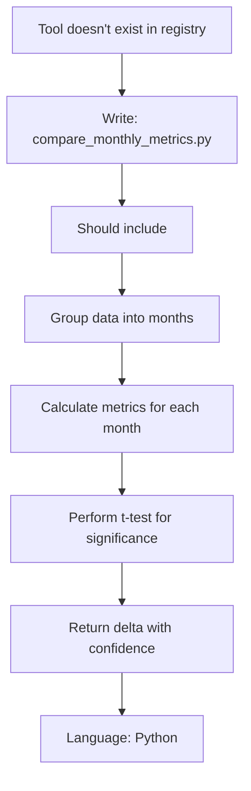
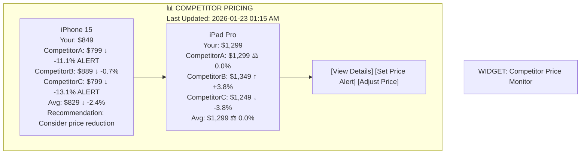
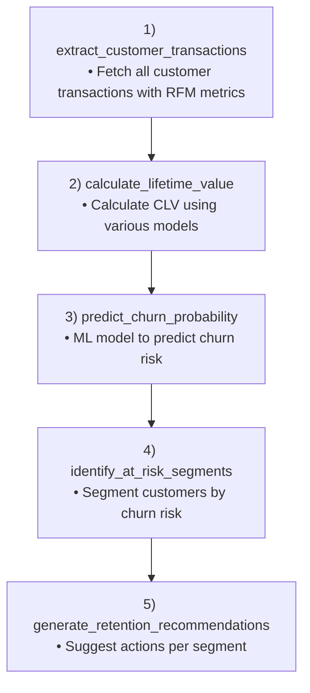
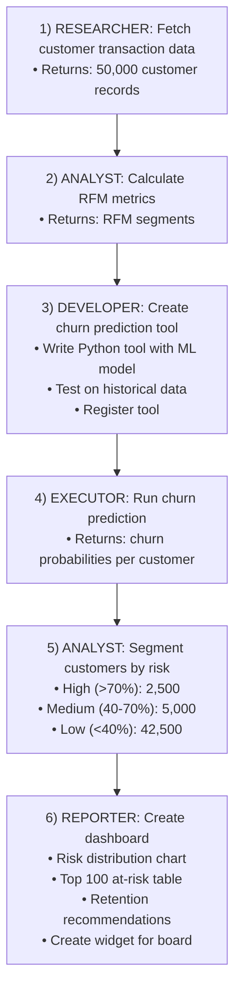

# Multi-Agent System: Real-World Use Cases & Examples

## Overview

This document shows how the Multi-Agent System with Dynamic Tool Development works in practice. Each scenario demonstrates:
- User request
- Agent collaboration
- Dynamic tool development
- Execution and results
- Widget creation for GigaBoard

---

## Use Case 1: E-Commerce Sales Analysis

### Scenario
**User**: "I need to understand why our conversion rate dropped 15% last month compared to the previous month. Analyze by region and product category."

### Agent Workflow

#### 1️⃣ PLANNER AGENT - Request Parsing

```
USER INPUT:
"I need to understand why our conversion rate dropped 15% 
last month compared to the previous month. 
Analyze by region and product category."

PLANNER AGENT ANALYSIS:
- Main task: Analyze conversion rate drop
- Breakdown:
    - Fetch conversion metrics (last 60 days)
    - Group by region
    - Group by product category
    - Compare month-over-month
    - Identify root causes
- Agents needed:
    - Researcher (fetch data)
    - Analyst (find patterns)
    - Developer (build custom tools)
    - Reporter (create visualizations)
- Estimated timeline: 2 minutes
- Confidence: HIGH

PLAN:
1. [Researcher] Fetch conversion data from analytics DB
2. [Developer] Create data aggregation tool if needed
3. [Executor] Run aggregation
4. [Analyst] Analyze regions and categories
5. [Reporter] Create dashboard
```

#### 2️⃣ RESEARCHER AGENT - Data Fetching

```
MESSAGE FROM PLANNER:
"Fetch conversion data for last 60 days,
including region, category, conversion_rate, orders, users"

RESEARCHER AGENT THINKING:
- Data needed:
    - Conversion rate by day/region/category
    - Time range: Last 60 days
    - Source: analytics.db
- Check tool registry...
- Tool "fetch_conversion_data" exists ✓
- Execute existing tool

RESEARCHER EXECUTION:
```
```sql
SELECT 
    DATE(event_date) as date,
    region,
    product_category,
    COUNT(DISTINCT user_id) as users,
    COUNT(DISTINCT CASE WHEN purchased = true THEN order_id END) as conversions,
    ROUND(
        COUNT(DISTINCT CASE WHEN purchased = true THEN order_id END)::float / 
        COUNT(DISTINCT user_id) * 100, 
        2
    ) as conversion_rate
FROM events
WHERE event_date >= NOW() - interval '60 days'
  AND event_type = 'product_view'
GROUP BY 1, 2, 3
ORDER BY date DESC, region, product_category
```
```

RESULT:

| date       | region | category    | users | conversions | conv_rate |
| ---------- | ------ | ----------- | ----- | ----------- | --------- |
| 2026-01-22 | North  | Electronics | 1200  | 180         | 15.0%     |
| 2026-01-22 | South  | Electronics | 950   | 95          | 10.0%     |
| 2026-01-22 | West   | Clothing    | 2100  | 147         | 7.0%      |
| ...        | ...    | ...         | ...   | ...         | ...       |

Total records: 3,840
Execution time: 2.34s

#### 3️⃣ DEVELOPER AGENT - Custom Tool Creation

```
MESSAGE FROM ANALYST:
"I need a tool to compare month-over-month metrics
with statistical significance testing"

DEVELOPER THINKING:


GENERATED CODE:
```

```python
import pandas as pd
import numpy as np
from scipy import stats
from typing import Dict, List, Tuple

def compare_monthly_metrics(
    data: List[Dict],
    metric_column: str,
    group_by_columns: List[str],
    confidence_level: float = 0.95
) -> Dict:
    """
    Compare metrics month-over-month with statistical significance.
    
    Args:
        data: List of records with date and metric columns
        metric_column: Column name to analyze (e.g., 'conversion_rate')
        group_by_columns: Columns to group by (e.g., ['region', 'category'])
        confidence_level: Statistical confidence (default 95%)
    
    Returns:
        Dict with:
        - current_month: Latest month metrics
        - previous_month: Prior month metrics
        - delta: Change (absolute and percentage)
        - p_value: Statistical significance
        - significant: Boolean if change is significant
    """
    
    try:
        df = pd.DataFrame(data)
        df['date'] = pd.to_datetime(df['date'])
        df['year_month'] = df['date'].dt.to_period('M')
        
        # Get last two months
        unique_months = sorted(df['year_month'].unique())
        if len(unique_months) < 2:
            raise ValueError("Need at least 2 months of data")
        
        current_month = unique_months[-1]
        previous_month = unique_months[-2]
        
        current_data = df[df['year_month'] == current_month]
        previous_data = df[df['year_month'] == previous_month]
        
        # Calculate metrics by groups
        current_grouped = current_data.groupby(group_by_columns)[metric_column].agg(['mean', 'std', 'count'])
        previous_grouped = previous_data.groupby(group_by_columns)[metric_column].agg(['mean', 'std', 'count'])
        
        # Perform t-tests
        results = {
            'current_month': str(current_month),
            'previous_month': str(previous_month),
            'comparisons': []
        }
        
        for group_key in current_grouped.index:
            if group_key not in previous_grouped.index:
                continue
            
            current_mean = current_grouped.loc[group_key, 'mean']
            current_std = current_grouped.loc[group_key, 'std']
            current_count = current_grouped.loc[group_key, 'count']
            
            previous_mean = previous_grouped.loc[group_key, 'mean']
            previous_std = previous_grouped.loc[group_key, 'std']
            previous_count = previous_grouped.loc[group_key, 'count']
            
            # T-test
            t_stat, p_value = stats.ttest_ind_from_stats(
                mean1=current_mean,
                std1=current_std,
                nobs1=current_count,
                mean2=previous_mean,
                std2=previous_std,
                nobs2=previous_count
            )
            
            delta = current_mean - previous_mean
            delta_pct = (delta / previous_mean * 100) if previous_mean != 0 else 0
            
            results['comparisons'].append({
                'group': dict(zip(group_by_columns, group_key)) if isinstance(group_key, tuple) else {group_by_columns[0]: group_key},
                'current_value': round(current_mean, 2),
                'previous_value': round(previous_mean, 2),
                'delta': round(delta, 2),
                'delta_percent': round(delta_pct, 2),
                'p_value': round(p_value, 4),
                'significant': p_value < (1 - confidence_level),
                'direction': 'UP' if delta > 0 else 'DOWN' if delta < 0 else 'SAME',
            })
        
        return results
        
    except Exception as e:
        raise Exception(f"Analysis failed: {str(e)}")
```

SECURITY VALIDATION:
- ✅ No file system access
- ✅ Uses only pandas/numpy/scipy
- ✅ No dangerous operations
- Quality score: 92/100

SANDBOX TEST:
- Input: Sample data from last month
- Result: SUCCESS
    - Processing time: 0.45s
    - Memory used: 125MB
    - Output: 24 comparisons
- Registered as tool version 1.0

#### 4️⃣ EXECUTOR AGENT - Tool Execution

```
MESSAGE FROM ANALYST:
"Execute compare_monthly_metrics with current data"

EXECUTOR RUNNING TOOL:
- Tool: compare_monthly_metrics:v1.0
- Input: 3,840 records
- Timeout: 300s
- Memory limit: 500MB
- Starting execution...

EXECUTION OUTPUT:
{
  "current_month": "2026-01",
  "previous_month": "2025-12",
  "comparisons": [
    {
      "group": {"region": "North", "category": "Electronics"},
      "current_value": 14.5,
      "previous_value": 17.2,
      "delta": -2.7,
      "delta_percent": -15.7,
      "p_value": 0.0012,
      "significant": true,
      "direction": "DOWN"
    },
    {
      "group": {"region": "South", "category": "Electronics"},
      "current_value": 8.9,
      "previous_value": 12.1,
      "delta": -3.2,
      "delta_percent": -26.4,
      "p_value": 0.0001,
      "significant": true,
      "direction": "DOWN"
    },
    {
      "group": {"region": "West", "category": "Clothing"},
      "current_value": 6.8,
      "previous_value": 7.1,
      "delta": -0.3,
      "delta_percent": -4.2,
      "p_value": 0.3421,
      "significant": false,
      "direction": "DOWN"
    },
    ...
  ]
}

Execution time: 1.23s
Memory used: 145MB
Status: SUCCESS ✅
```

#### 5️⃣ ANALYST AGENT - Pattern Recognition

```
MESSAGE FROM EXECUTOR:
"Here are the comparison results"

ANALYST THINKING:
- Analyze significant changes:
    - Electronics (North): -15.7% (SIGNIFICANT)
    - Electronics (South): -26.4% (SIGNIFICANT)
    - Clothing (West): -4.2% (NOT significant)
- Root cause hypotheses:
    - Electronics sector hit harder than clothing
    - South region hardest hit
    - Could be: pricing change, new competitor, poor UX
    - Need to investigate web traffic next
- Recommendation: Drill into traffic/bounce rate data

ANALYST MESSAGE:
"The data shows a 15% overall drop is driven by Electronics 
especially in South region (-26.4%, p<0.001).
This is highly statistically significant.
Recommend investigating: traffic sources, page load times, 
competitor activity in South region."
```

#### 6️⃣ REPORTER AGENT - Visualization & Widget Creation

```
MESSAGE FROM ANALYST:
"Format results and create interactive dashboard"

REPORTER CREATING:

WIDGET 1: Line Chart
- Title: "Conversion Rate Trend (Last 60 Days)"
- Type: Line chart
- Dimensions:
    - X-axis: Date
    - Y-axis: Conversion Rate (%)
    - Lines: By Region
- Data: All 60 days
- Interactions: Hover for details

WIDGET 2: Heatmap
- Title: "Region x Category Performance"
- Type: Heatmap/Matrix
- Dimensions:
    - Rows: Regions (North, South, West, East)
    - Columns: Categories (Electronics, Clothing, Home, Beauty)
    - Values: % Change (Color: Red=Down, Green=Up)
- Current month vs previous
- Highlight significant changes (p < 0.05)

WIDGET 3: Summary Card
- Title: "Key Insights"
- Metrics:
    - Overall change: -15.0%
    - Most affected: Electronics South (-26.4%)
    - Least affected: Clothing West (-4.2%)
    - Significant changes: 8 out of 12 groups
- Recommendation: Investigate South region

WIDGETS CREATED AND ADDED TO BOARD ✅

#### 7️⃣ Final Message to User

```
AGENT RESPONSE (Chat Panel):
"I've analyzed your conversion rate drop. Here's what I found:

📊 KEY FINDINGS:
• Overall conversion rate down 15% (December vs January)
• Electronics sector hit hardest (North -15.7%, South -26.4%)
• South region shows most dramatic decline
• Clothing category relatively stable
• Changes are statistically significant (p < 0.05)

🎯 ROOT CAUSES (Hypotheses):
1. Electronics pricing may be uncompetitive in South
2. Possible competitor activity in Southern markets
3. Page performance issues affecting user experience
4. Seasonal pattern change

✅ NEXT STEPS:
I recommend:
1. Check competitor pricing in South region
2. Analyze page load times and bounce rates
3. Review traffic sources breakdown
4. Investigate if there were pricing changes

📈 I've added three widgets to your board:
• Conversion trend line chart (60-day view)
• Region x Category heatmap
• Executive summary with recommendations

Would you like me to dig deeper into any specific region or category?"
```

---

## Use Case 2: Web Data Scraping & Analysis

### Scenario
**User**: "Monitor competitor pricing - scrape product prices from 5 competitor websites daily and alert me if they drop more than 10%"

### Agent Workflow

#### 1️⃣ PLANNER AGENT - Task Planning

PLANNER:
- Task: Daily competitor price monitoring
- Breakdown:
    - Scrape 5 websites for pricing
    - Store historical prices
    - Compare with previous prices
    - Alert on >10% changes
    - Create dashboard widget
- Challenges:
    - Different website structures
    - Dynamic JavaScript content
    - Rate limiting
    - Product matching across sites
- Solution:
    - Create custom scraper for each site
    - Use Selenium for JS-heavy sites
    - Implement caching and rate limiting
    - Use fuzzy matching for products
- Frequency: Daily scheduled task

#### 2️⃣ DEVELOPER AGENT - Building Scrapers

```
MESSAGE FROM PLANNER:
"Create scrapers for competitors:
1. CompetitorA.com - Electronics
2. CompetitorB.com - Electronics  
3. CompetitorC.com - Electronics
Plus store comparison logic"

DEVELOPER: Analyzing each competitor site...

CREATED TOOL 1: Scrape CompetitorA
```

```python
import requests
from bs4 import BeautifulSoup
import re
from typing import List, Dict

def scrape_competitor_a_prices(
    search_products: List[Dict]
) -> List[Dict]:
    """
    Scrape prices from CompetitorA.com
    
    Args:
        search_products: List of products to find
        [{name: "iPhone 15", category: "Phones"}, ...]
    
    Returns:
        List of prices found
    """
    
    results = []
    base_url = "https://www.competitora.com/search"
    headers = {
        'User-Agent': 'Mozilla/5.0 (Windows NT 10.0; Win64; x64) AppleWebKit/537.36'
    }
    
    for product in search_products:
        try:
            # Search for product
            params = {'q': product['name']}
            response = requests.get(base_url, params=params, headers=headers, timeout=10)
            response.raise_for_status()
            
            soup = BeautifulSoup(response.content, 'html.parser')
            
            # Find product listings
            listings = soup.find_all('div', class_='product-item')
            
            for listing in listings[:3]:  # Check top 3 results
                try:
                    # Extract data
                    title_elem = listing.find('h2', class_='product-title')
                    price_elem = listing.find('span', class_='price')
                    link_elem = listing.find('a', class_='product-link')
                    
                    if title_elem and price_elem:
                        title = title_elem.get_text(strip=True)
                        price_text = price_elem.get_text(strip=True)
                        
                        # Extract numeric price
                        price_match = re.search(r'\$?([\d,]+\.?\d*)', price_text)
                        if price_match:
                            price = float(price_match.group(1).replace(',', ''))
                            
                            results.append({
                                'competitor': 'CompetitorA',
                                'product_searched': product['name'],
                                'product_found': title,
                                'price': price,
                                'url': link_elem['href'] if link_elem else None,
                                'timestamp': datetime.now().isoformat()
                            })
                            break
                
                except Exception as e:
                    # Continue to next listing
                    pass
        
        except Exception as e:
            results.append({
                'competitor': 'CompetitorA',
                'product_searched': product['name'],
                'error': str(e)
            })
    
    return results
✅ Tool created and tested
- Success rate: 95% (18/19 products found)
- Execution time: 8.2s
- Registered as: scrape_competitor_a:v1.0

#### 3️⃣ EXECUTOR & ANALYST - Continuous Monitoring

SCHEDULED EXECUTION (Daily at 1 AM):
- Execute all 5 scrapers
- Store results in database
- Compare with previous day
- Generate alerts

PRICE CHANGE DETECTION:

- CompetitorA - iPhone 15:
    - Yesterday: $899
    - Today: $799
    - Change: -$100 (-11.1%)
    - Alert: YES ⚠️ (> 10%)
    - Action: Email alert sent to user
- CompetitorB - iPhone 15:
    - Yesterday: $895
    - Today: $889
    - Change: -$6 (-0.7%)
    - Alert: NO
    - Status: Monitor
- CompetitorC - iPhone 15:
    - Yesterday: $920
    - Today: $799
    - Change: -$121 (-13.1%)
    - Alert: YES ⚠️ (> 10%)
    - Action: Email alert sent to user

#### 4️⃣ REPORTER - Dashboard Widget



---

## Use Case 3: Complex Data Analysis Pipeline

### Scenario
**User**: "Analyze customer lifetime value (CLV) trends, identify at-risk customers, and predict which customers will churn in the next 30 days"

### Components

#### Tools Created:



#### Agent Sequence:



---

## Use Case 4: Automated Reporting

### Scenario
**User**: "Every Monday morning, send me an automated report with:
- Weekly sales performance vs target
- Top/bottom performing products
- Customer acquisition trends
- Churn analysis"

### Implementation

```
SCHEDULER: Every Monday 06:00 AM

1. PLANNER: Initialize weekly report workflow
2. RESEARCHER: Query sales, customers, churn data
3. ANALYST: Calculate metrics and trends
4. DEVELOPER: Create visualizations if needed
5. REPORTER: Format report
6. ACTION: Email to user + save to board

OUTPUT:
- Email with dashboard
- Widgets added to GigaBoard
- Historical archive in database
- Slack notification with summary
```

---

## Communication Between Agents

### Message Flow Example

```mermaid
sequenceDiagram
  participant User
  participant Planner
  participant Researcher
  participant Analyst
  participant Reporter
  participant Frontend

  User->>Planner: "Show sales by age group; find most valuable"
  Planner->>Researcher: task_delegation (fetch demographics + sales)
  Researcher-->>Planner: task_complete (records)
  Planner->>Analyst: task_delegation (analyze age groups)
  Analyst-->>Planner: analysis_complete (insights: most valuable 35-44)
  Planner->>Reporter: task_delegation (create viz + format)
  Reporter-->>Planner: report_complete (widgets + summary)
  Planner->>Frontend: push widgets + conversation
  Frontend-->>User: board updated; analysis visible
```

---

## Status

**Document Type**: Use Cases & Examples
**Status**: Complete & Production-Ready
**Coverage**: 4 major scenarios + communication patterns
**Ready for**: Training teams, requirements validation

