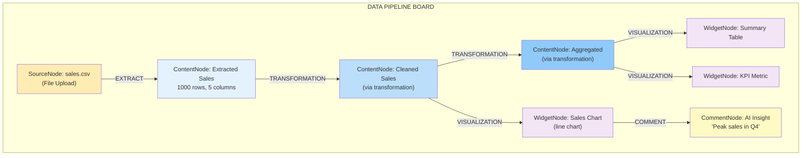

# Node Management System: AI-Driven Data Pipeline Construction

## Executive Summary

**Node Management System** — система управления узлами для построения AI-driven data pipelines на аналитических досках.

**Ключевые концепции:**
- **4 типа узлов**: SourceNode (источники данных), ContentNode (извлечённые данные + трансформации), WidgetNode (визуализации), CommentNode (аннотации)
- **6 типов связей**: EXTRACT, TRANSFORMATION, VISUALIZATION, COMMENT, REFERENCE, DRILL_DOWN
- **Агенты-менеджеры**: SourceNode Manager, Transformation Agent, Reporter Agent, Replay Manager
- **Data Lineage**: автоматическое отслеживание цепочек SourceNode → ContentNode → WidgetNode

**Архитектура Source-Content:**
- **SourceNode** (6 типов: prompt, file, database, api, stream, manual) — источники данных без извлечённого контента
- **ContentNode** (text + N tables) — результат extraction из SourceNode или transformation из других ContentNode
- **EXTRACT edge** — связь SourceNode → ContentNode (автоматическое извлечение данных)
- **Каскадные обновления**: изменение SourceNode → обновление ContentNode → replay transformations → refresh widgets

---

## Обзор

**Node Management System** позволяет AI-агентам активно строить и управлять data pipelines на аналитических досках. Вместо простого размещения виджетов, агенты работают с четырьмя типами узлов:

- **SourceNode** — источники данных (prompt, file, database, API, stream, manual) без извлечённого контента
- **ContentNode** — извлечённые данные из SourceNode или результаты трансформаций (text + N tables)
- **WidgetNode** — визуализации ContentNode (графики, таблицы, метрики) с AI-сгенерированным HTML/CSS/JS кодом
- **CommentNode** — пользовательские или AI аннотации, инсайты и заметки

Агенты могут:
- **Создавать** SourceNode, указывая источник данных (file upload, API config, database query, AI prompt, stream, manual input)
- **Извлекать** данные из SourceNode → ContentNode через EXTRACT edge
- **Трансформировать** ContentNode с помощью произвольного Python кода → новый ContentNode через TRANSFORMATION edge
- **Визуализировать** ContentNode, генерируя WidgetNode с кастомным кодом отрисовки через VISUALIZATION edge
- **Аннотировать** любой узел с помощью CommentNode, содержащего инсайты
- **Автоматизировать** data pipelines, включая автоматический replay трансформаций

Это трансформирует агентов из "строителей дашбордов" в **"архитекторов data pipelines"**.

---

## Основные концепции

### Доска как Data Pipeline Canvas



### Правила создания узлов

- **SourceNode** создаётся первым — указывается источник данных (file, api, database, stream, prompt, manual).
- **ContentNode** создаётся через EXTRACT edge из SourceNode или через TRANSFORMATION edge из других ContentNode.
- **WidgetNode** всегда создаётся как визуализация конкретного ContentNode и требует `parent_content_node_id`.
- **CommentNode** всегда создаётся как аннотация к существующему узлу и требует `target_node_id`, где целевой узел — **SourceNode**, **ContentNode** или **WidgetNode**.
- Удаление **SourceNode** → каскадное удаление связанных ContentNode → удаление их WidgetNode и CommentNode.
- Удаление **ContentNode** → каскадное удаление/деактивация всех его **WidgetNode** и связанных **CommentNode**.

### Типы узлов и операции

```python
from enum import Enum
from typing import Dict, List, Optional
from datetime import datetime

class NodeType(str, Enum):
    SOURCE = "source_node"
    CONTENT = "content_node"
    WIDGET = "widget_node"
    COMMENT = "comment_node"

class EdgeType(str, Enum):
    EXTRACT = "extract"                # SourceNode → ContentNode
    TRANSFORMATION = "transformation"   # ContentNode → ContentNode
    VISUALIZATION = "visualization"    # ContentNode → WidgetNode
    COMMENT = "comment"                # CommentNode → any node
    REFERENCE = "reference"            # any → any
    DRILL_DOWN = "drill_down"          # ContentNode → ContentNode

class NodeOperations:
    """Operations agents can perform on nodes"""
    
    AGENT_ACTIONS = {
        # SourceNode operations
        'create_source_node': {
            'params': ['board_id', 'source_type', 'source_config', 'position'],
            'agent': 'SourceNode Manager',
            'effect': 'Creates data source node (file, api, database, stream, prompt, manual)'
        },
        'update_source_node': {
            'params': ['node_id', 'source_config'],
            'agent': 'SourceNode Manager',
            'effect': 'Updates source configuration (e.g., API endpoint, file path)'
        },
        'delete_source_node': {
            'params': ['node_id'],
            'agent': 'SourceNode Manager',
            'effect': 'Removes source node (cascades to ContentNode, WidgetNode, CommentNode)'
        },
        
        # ContentNode operations
        'create_content_node': {
            'params': ['board_id', 'content', 'content_type', 'position'],
            'agent': 'Transformation Agent',
            'effect': 'Creates content node (via extraction or transformation)'
        },
        'update_content_node': {
            'params': ['node_id', 'new_content'],
            'agent': 'Transformation Agent',
            'effect': 'Updates content node data'
        },
        'delete_content_node': {
            'params': ['node_id'],
            'agent': 'Transformation Agent',
            'effect': 'Removes content node (cascades to dependent WidgetNode)'
        },
        
        # WidgetNode operations
        'create_widget_node': {
            'params': ['board_id', 'parent_content_node_id', 'description', 'html_code', 'css_code', 'js_code', 'position'],
            'agent': 'Reporter Agent',
            'effect': 'Creates visualization from ContentNode (parent_content_node_id is required)'
        },
        'update_widget_node': {
            'params': ['node_id', 'html_code', 'css_code', 'js_code'],
            'agent': 'Reporter Agent',
            'effect': 'Updates widget rendering code'
        },
        'refresh_widget_node': {
            'params': ['node_id'],
            'agent': 'Reporter Agent',
            'effect': 'Refreshes widget from parent ContentNode'
        },
        
        # CommentNode operations
        'create_comment_node': {
            'params': ['board_id', 'target_node_id', 'text', 'author'],
            'agent': 'Analyst Agent or User',
            'effect': 'Adds comment/insight to node (target_node_id must be SourceNode, ContentNode, or WidgetNode)'
        },
        'update_comment_node': {
            'params': ['node_id', 'new_text'],
            'agent': 'User',
            'effect': 'Updates comment text'
        },
        
        # Transformation operations
        'create_transformation': {
            'params': ['source_node_ids', 'target_node_id', 'code', 'prompt'],
            'agent': 'Transformation Agent',
            'effect': 'Creates TRANSFORMATION edge with Python code'
        },
        'execute_transformation': {
            'params': ['transformation_id'],
            'agent': 'Executor Agent',
            'effect': 'Runs transformation code in sandbox'
        },
        'replay_transformation': {
            'params': ['transformation_id'],
            'agent': 'Executor Agent',
            'effect': 'Re-executes transformation with updated source data'
        },
        
        # Edge operations
        'create_edge': {
            'params': ['from_node_id', 'to_node_id', 'edge_type', 'metadata'],
            'agent': 'Any Agent',
            'effect': 'Creates connection between nodes'
        },
        'delete_edge': {
            'params': ['edge_id'],
            'agent': 'Any Agent',
            'effect': 'Removes connection'
        },
        
        # Layout operations
        'move_node': {
            'params': ['node_id', 'x', 'y'],
            'agent': 'Layout Planner',
            'effect': 'Changes node position'
        },
        'resize_node': {
            'params': ['node_id', 'width', 'height'],
            'agent': 'Layout Planner',
            'effect': 'Changes node dimensions'
        }
    }
```

---

## Workflow построения Data Pipeline

### Сценарий: автоматизированный конвейер анализа продаж

**Запрос пользователя**: "Загрузи данные о продажах, очисти их, агрегируй по регионам и покажи графики"

#### Шаг 1: Planner Agent → подзадачи
1. Загрузить данные о продажах из источника
2. Очистить данные (удалить null, исправить типы)
3. Агрегировать по регионам
4. Создать визуализации
5. Сгенерировать инсайты

#### Шаг 2: SourceNode Manager + Transformation Agent → Data Pipeline

```python
# 1. Create SourceNode (file upload)
source_node = await create_source_node(
    board_id=board_id,
    source_type="file",
    source_config={
        "file_path": "uploads/sales.csv",
        "file_type": "csv"
    },
    position={"x": 0, "y": 0}
)

# 2. Extract data from SourceNode → ContentNode
extract_edge = await create_extract_edge(
    source_node_id=source_node.id,
    board_id=board_id
)

# Extraction creates ContentNode with extracted data
extracted_content_node = await execute_extraction(extract_edge.id)
# extracted_content_node.content = {
#     "text": "Sales data extracted from CSV",
#     "tables": [{"name": "sales", "schema": [...], "rows": 1000}]
# }

# 3. Create cleaning transformation
clean_transformation = await create_transformation(
    source_node_ids=[extracted_content_node.id],
    prompt="Remove rows with null values and convert amount to float",
    code="""
def transform_data(source_data):
    import pandas as pd
    
    df = pd.read_csv(source_data)
    
    # Remove nulls
    df = df.dropna()
    
    # Fix types
    df['amount'] = df['amount'].astype(float)
    df['date'] = pd.to_datetime(df['date'])
    
    return df.to_csv(index=False)
    """
)

# 4. Execute transformation → creates cleaned ContentNode
cleaned_content_node = await execute_transformation(clean_transformation.id)

# 5. Create aggregation transformation
agg_transformation = await create_transformation(
    source_node_ids=[cleaned_content_node.id],
    prompt="Aggregate sales by region, calculate total and average",
    code="""
def transform_data(cleaned_data):
    import pandas as pd
    
    df = pd.read_csv(cleaned_data)
    
    # Aggregate by region
    agg = df.groupby('region').agg({
        'amount': ['sum', 'mean', 'count']
    }).reset_index()
    
    agg.columns = ['region', 'total_sales', 'avg_sales', 'order_count']
    
    return agg.to_csv(index=False)
    """
)

# 6. Execute aggregation → creates aggregated ContentNode
aggregated_content_node = await execute_transformation(agg_transformation.id)
```

#### Шаг 3: Reporter Agent → визуализации

```python
# 7. Create WidgetNode: Bar Chart
chart_widget = await create_widget_node(
    board_id=board_id,
    parent_content_node_id=aggregated_content_node.id,
    description="Bar chart showing sales by region",
    html_code="""
    <div class="widget chart-widget">
        <h3>Sales by Region</h3>
        <canvas id="salesChart"></canvas>
    </div>
    """,
    css_code="""
    .chart-widget {
        background: var(--card-bg);
        padding: 20px;
        border-radius: 8px;
    }
    """,
    js_code="""
    // Chart.js rendering code
    const ctx = document.getElementById('salesChart');
    new Chart(ctx, {
        type: 'bar',
        data: {{data}},  // Injected from ContentNode
        options: {...}
    });
    """,
    position={"x": 400, "y": 0}
)

# 8. Create VISUALIZATION edge
await create_edge(
    from_node_id=aggregated_content_node.id,
    to_node_id=chart_widget.id,
    edge_type=EdgeType.VISUALIZATION
)

# 9. Create WidgetNode: Summary Table
table_widget = await create_widget_node(
    board_id=board_id,
    parent_content_node_id=aggregated_content_node.id,
    description="Table with aggregated sales data",
    html_code="<table>...</table>",
    position={"x": 400, "y": 320}
)

# 10. Create VISUALIZATION edge
await create_edge(
    from_node_id=aggregated_content_node.id,
    to_node_id=table_widget.id,
    edge_type=EdgeType.VISUALIZATION
)
```

#### Шаг 4: Analyst Agent → инсайты

```python
# 11. Create CommentNode with AI insight
insight = await create_comment_node(
    board_id=board_id,
    target_node_id=chart_widget.id,
    text="North region shows highest sales ($450K), 35% above average. Consider expanding operations there.",
    author="analyst_agent"
)

# 12. Create COMMENT edge
await create_edge(
    from_node_id=insight.id,
    to_node_id=chart_widget.id,
    edge_type=EdgeType.COMMENT
)
```

#### Результат: граф Data Pipeline

```
[SourceNode: sales.csv (file)] 
      ↓ EXTRACT
[ContentNode: Extracted Sales Data]
      ↓ TRANSFORMATION (clean data)
[ContentNode: Cleaned Sales]
      ↓ TRANSFORMATION (aggregate by region)
[ContentNode: Aggregated by Region]
      ├─ VISUALIZATION → [WidgetNode: Bar Chart]
      │                      ↓ COMMENT
      │                   [CommentNode: "North region highest"]
      └─ VISUALIZATION → [WidgetNode: Summary Table]
```

---

## Transformation Agent: построение конвейеров

```python
class TransformationAgent:
    """
    Agent that creates data transformations between ContentNodes
    """
    
    async def create_transformation(
        self,
        source_nodes: List[str],  # Can be multiple source ContentNodes
        prompt: str,
        board_id: str
    ) -> Transformation:
        """
        Generate and execute data transformation
        
        Args:
            source_nodes: List of source ContentNode IDs
            prompt: Natural language description of transformation
            board_id: Target board
        
        Returns:
            Transformation with generated code and target ContentNode
        """
        
        # 1. Analyze source ContentNodes
        source_data_analysis = []
        for node_id in source_nodes:
            node = await self.get_content_node(node_id)
            analysis = await self.analyze_content_node(node)
            source_data_analysis.append(analysis)
        
        # 2. Generate Python code using AI
        code = await self.generate_transformation_code(
            prompt=prompt,
            source_analysis=source_data_analysis
        )
        
        # 3. Validate code (security, syntax)
        validation_result = await self.validate_code(code)
        if not validation_result.is_valid:
            raise ValidationError(validation_result.errors)
        
        # 4. Create transformation metadata
        transformation = Transformation(
            id=uuid.uuid4(),
            source_node_ids=source_nodes,
            prompt=prompt,
            generated_code=code,
            created_at=datetime.now(),
            created_by="transformation_agent",
            version=1,
            replay_enabled=True
        )
        
        # 5. Save transformation
        await db.transformations.insert_one(transformation.to_dict())
        
        # 6. Execute transformation
        target_node = await self.execute_transformation(transformation.id)
        
        # 7. Create TRANSFORMATION edges
        for source_id in source_nodes:
            await self.create_edge(
                from_node_id=source_id,
                to_node_id=target_node.id,
                edge_type=EdgeType.TRANSFORMATION,
                metadata={
                    "transformation_id": str(transformation.id),
                    "prompt": prompt
                }
            )
        
        return transformation
    
    async def analyze_content_node(self, node: ContentNode) -> Dict:
        """
        Analyze ContentNode to understand structure
        """
        return {
            "content_type": node.content_type,
            "text": node.content.get("text", ""),
            "tables": node.content.get("tables", []),
            "sample": str(node.content)[:1000],  # First 1000 chars
            "size_bytes": len(str(node.content)),
            "table_count": len(node.content.get("tables", [])),
            "column_types": self._infer_types(node)
        }
    
    async def generate_transformation_code(
        self,
        prompt: str,
        source_analysis: List[Dict]
    ) -> str:
        """
        Use AI to generate Python transformation code
        """
        system_prompt = """
        You are a Python code generator for data transformations.
        Generate a function `transform_data` that takes source data as arguments
        and returns transformed data.
        
        Requirements:
        - Use pandas for tabular data
        - Handle errors gracefully
        - Return data in CSV format for tabular data
        - Be efficient (avoid loops when possible)
        """
        
        user_prompt = f"""
        Task: {prompt}
        
        Source data:
        {json.dumps(source_analysis, indent=2)}
        
        Generate Python code for transformation.
        """
        
        code = await ai_client.generate_code(
            system_prompt=system_prompt,
            user_prompt=user_prompt
        )
        
        return code
    
    async def execute_transformation(
        self,
        transformation_id: str
    ) -> ContentNode:
        """
        Execute transformation in sandbox and create target ContentNode
        """
        transformation = await db.transformations.find_one(
            {"id": transformation_id}
        )
        
        # 1. Load source data
        source_contents = []
        for source_id in transformation["source_node_ids"]:
            node = await self.get_content_node(source_id)
            source_contents.append(node.content)
        
        # 2. Execute in sandbox (with timeout, memory limits)
        result = await execute_in_sandbox(
            code=transformation["generated_code"],
            inputs=source_contents,
            timeout=60,
            memory_limit_mb=512
        )
        
        if result.status == "error":
            raise TransformationError(result.error_message)
        
        # 3. Create target ContentNode
        target_node = ContentNode(
            id=uuid.uuid4(),
            board_id=transformation["board_id"],
            content={
                "text": "Transformation result",
                "tables": [{
                    "name": "result",
                    "data": result.output
                }]
            },
            content_type="transformation_result",
            created_by="transformation_agent",
            created_at=datetime.now(),
            position=self._calculate_position(transformation["source_node_ids"])
        )
        
        await db.content_nodes.insert_one(target_node.to_dict())
        
        # 4. Update transformation with target
        await db.transformations.update_one(
            {"id": transformation_id},
            {
                "$set": {
                    "target_node_id": str(target_node.id),
                    "execution_metadata": {
                        "duration_ms": result.duration_ms,
                        "memory_mb": result.memory_mb,
                        "status": "success",
                        "executed_at": datetime.now()
                    }
                }
            }
        )
        
        # 5. Broadcast to board
        await broadcast_to_board(target_node.board_id, {
            "type": "content_node_created",
            "node_id": str(target_node.id),
            "node": target_node.to_dict()
        })
        
        return target_node
```

---

## Reporter Agent: построение визуализаций

```python
class ReporterAgent:
    """
    Agent that creates WidgetNode visualizations from ContentNode
    """
    
    async def create_visualization(
        self,
        content_node_id: str,
        user_prompt: str  # Required: describes what visualization to create
    ) -> WidgetNode:
        """
        Generate WidgetNode from ContentNode
        
        Args:
            content_node_id: Source ContentNode
            user_prompt: User description of desired visualization (e.g., "Create bar chart showing sales")
        
        Returns:
            WidgetNode with HTML/CSS/JS code
        """
        
        # 1. Load ContentNode
        content_node = await self.get_content_node(content_node_id)
        
        # 2. Analyze data
        analysis = await self.analyze_content_node(content_node)
        
        # 3. Generate complete HTML/CSS/JS code
        widget_code = await self.generate_widget_code(
            content_node=content_node,
            analysis=analysis,
            user_prompt=user_prompt
        )
        
        # 4. Create WidgetNode
        widget_node = WidgetNode(
            id=uuid.uuid4(),
            board_id=content_node.board_id,
            description=widget_code['description'],
            html_code=widget_code['html'],
            css_code=widget_code['css'],
            js_code=widget_code['js'],
            parent_content_node_id=content_node_id,
            created_by="reporter_agent",
            created_at=datetime.now(),
            position=self._calculate_widget_position(content_node_id)
        )
        
        await db.widget_nodes.insert_one(widget_node.to_dict())
        
        # 5. Create VISUALIZATION edge
        await self.create_edge(
            from_node_id=content_node_id,
            to_node_id=widget_node.id,
            edge_type=EdgeType.VISUALIZATION,
            metadata={"description": widget_code['description']}
        )
        
        # 6. Broadcast to board
        await broadcast_to_board(widget_node.board_id, {
            "type": "widget_node_created",
            "node_id": str(widget_node.id),
            "node": widget_node.to_dict()
        })
        
        return widget_node
    
    async def analyze_content_node(self, content_node: ContentNode) -> Dict:
        """
        Analyze ContentNode structure and patterns
        """
        # Use AI to analyze data
        # Returns schema, data types, patterns, insights
        pass
        # Multiple columns → Table
        if len(schema.get("columns", [])) > 3:
            return "table"
        
        # Matrix data → Heatmap
        if schema.get("is_matrix"):
            return "heatmap"
        
        # Default
        return "table"
    
    async def refresh_widget_from_content_node(
        self,
        widget_node_id: str
    ):
        """
        Refresh WidgetNode when parent ContentNode changes
        """
        widget = await db.widget_nodes.find_one({"id": widget_node_id})
        content_node = await db.content_nodes.find_one({"id": widget["parent_content_node_id"]})
        
        # Re-inject data into widget
        await broadcast_to_board(widget["board_id"], {
            "type": "widget_data_updated",
            "widget_node_id": widget_node_id,
            "new_data": content_node["content"]
        })
```

---

## Автоматизация: Replay трансформаций

### Автоматическое обновление конвейера при изменении источника

```python
class AutomationManager:
    """
    Manages automatic replay of transformations when source ContentNodes change
    """
    
    async def on_content_node_updated(self, content_node_id: str):
        """
        Triggered when ContentNode content changes
        """
        
        # 1. Find all downstream transformations
        transformations = await self.get_downstream_transformations(content_node_id)
        
        if not transformations:
            return
        
        # 2. Sort by dependency order (topological sort)
        sorted_transformations = self.topological_sort(transformations)
        
        # 3. Replay each transformation
        for trans in sorted_transformations:
            if trans.replay_enabled:
                await self.replay_transformation(trans.id)
    
    async def replay_transformation(self, transformation_id: str):
        """
        Re-execute transformation with updated source data
        """
        transformation = await db.transformations.find_one({"id": transformation_id})
        
        # Execute transformation
        executor = ExecutorAgent()
        new_target_node = await executor.execute_transformation(transformation_id)
        
        # Update all WidgetNodes that visualize this ContentNode
        await self.refresh_dependent_widgets(new_target_node.id)
    
    async def refresh_dependent_widgets(self, content_node_id: str):
        """
        Refresh all WidgetNodes that visualize this ContentNode
        """
        # Find all VISUALIZATION edges from this ContentNode
        edges = await db.edges.find({
            "from_node_id": content_node_id,
            "edge_type": "visualization"
        }).to_list()
        
        # Refresh each WidgetNode
        for edge in edges:
            widget_node_id = edge["to_node_id"]
            await reporter.refresh_widget_from_content_node(widget_node_id)
```

---

## Граф Data Lineage

### Управление графом зависимостей

```python
class LineageManager:
    """
    Manages data lineage and dependency graph
    """
    
    async def build_lineage_graph(self, board_id: str) -> nx.DiGraph:
        """
        Build directed acyclic graph (DAG) of data lineage
        """
        G = nx.DiGraph()
        
        # Add all nodes
        source_nodes = await db.source_nodes.find({"board_id": board_id}).to_list()
        content_nodes = await db.content_nodes.find({"board_id": board_id}).to_list()
        widget_nodes = await db.widget_nodes.find({"board_id": board_id}).to_list()
        
        for node in source_nodes + content_nodes + widget_nodes:
            G.add_node(node["id"], **node)
        
        # Add all edges
        edges = await db.edges.find({"board_id": board_id}).to_list()
        for edge in edges:
            G.add_edge(
                edge["from_node_id"],
                edge["to_node_id"],
                edge_type=edge["edge_type"],
                **edge.get("metadata", {})
            )
        
        return G
    
    async def get_upstream_nodes(self, node_id: str) -> List[str]:
        """
        Get all nodes that this node depends on
        """
        G = await self.build_lineage_graph(board_id)
        return list(nx.ancestors(G, node_id))
    
    async def get_downstream_nodes(self, node_id: str) -> List[str]:
        """
        Get all nodes that depend on this node
        """
        G = await self.build_lineage_graph(board_id)
        return list(nx.descendants(G, node_id))
    
    async def detect_circular_dependencies(self, board_id: str) -> List[List[str]]:
        """
        Find circular dependencies in the graph
        """
        G = await self.build_lineage_graph(board_id)
        
        try:
            cycles = list(nx.simple_cycles(G))
            return cycles
        except:
            return []
```

---

## API Endpoints

### Endpoints управления узлами

```
# SourceNode operations
POST   /api/v1/boards/{boardId}/source-nodes
GET    /api/v1/boards/{boardId}/source-nodes/{nodeId}
PATCH  /api/v1/boards/{boardId}/source-nodes/{nodeId}
DELETE /api/v1/boards/{boardId}/source-nodes/{nodeId}

# ContentNode operations
POST   /api/v1/boards/{boardId}/content-nodes
GET    /api/v1/boards/{boardId}/content-nodes/{nodeId}
PATCH  /api/v1/boards/{boardId}/content-nodes/{nodeId}
DELETE /api/v1/boards/{boardId}/content-nodes/{nodeId}

# WidgetNode operations
POST   /api/v1/boards/{boardId}/widget-nodes
GET    /api/v1/boards/{boardId}/widget-nodes/{nodeId}
PATCH  /api/v1/boards/{boardId}/widget-nodes/{nodeId}
DELETE /api/v1/boards/{boardId}/widget-nodes/{nodeId}
POST   /api/v1/boards/{boardId}/widget-nodes/{nodeId}/refresh

# CommentNode operations
POST   /api/v1/boards/{boardId}/comment-nodes
PATCH  /api/v1/boards/{boardId}/comment-nodes/{nodeId}
DELETE /api/v1/boards/{boardId}/comment-nodes/{nodeId}

# Transformation operations
POST   /api/v1/boards/{boardId}/transformations
GET    /api/v1/boards/{boardId}/transformations/{transformationId}
POST   /api/v1/boards/{boardId}/transformations/{transformationId}/execute
POST   /api/v1/boards/{boardId}/transformations/{transformationId}/replay
PATCH  /api/v1/boards/{boardId}/transformations/{transformationId}

# Edge operations
POST   /api/v1/boards/{boardId}/edges
GET    /api/v1/boards/{boardId}/edges
DELETE /api/v1/boards/{boardId}/edges/{edgeId}

# Lineage & Graph
GET    /api/v1/boards/{boardId}/lineage
GET    /api/v1/boards/{boardId}/lineage/upstream/{nodeId}
GET    /api/v1/boards/{boardId}/lineage/downstream/{nodeId}
GET    /api/v1/boards/{boardId}/lineage/graph

# Layout operations
PATCH  /api/v1/boards/{boardId}/layout
POST   /api/v1/boards/{boardId}/nodes/{nodeId}/move
POST   /api/v1/boards/{boardId}/nodes/{nodeId}/resize
```

---

## Real-Time события

### Socket.IO события узлов

```
NODE OPERATIONS:
- source_node_created: {node_id, source_type, source_config, position}
- source_node_updated: {node_id, new_config, updated_at}
- source_node_deleted: {node_id}

- content_node_created: {node_id, content_type, position}
- content_node_updated: {node_id, new_content, updated_at}
- content_node_deleted: {node_id}

- widget_node_created: {node_id, description, parent_content_node_id, position}
- widget_node_refreshed: {node_id, new_data}
- widget_node_deleted: {node_id}

- comment_node_created: {node_id, target_node_id, text, author}
- comment_node_updated: {node_id, new_text}

TRANSFORMATION OPERATIONS:
- transformation_created: {transformation_id, source_node_ids, prompt}
- transformation_executing: {transformation_id, status}
- transformation_completed: {transformation_id, target_node_id, duration_ms}
- transformation_failed: {transformation_id, error_message}
- transformation_replaying: {transformation_id, reason}

EDGE OPERATIONS:
- edge_created: {edge_id, from_node_id, to_node_id, edge_type}
- edge_deleted: {edge_id}

AUTOMATION EVENTS:
- pipeline_auto_update_started: {node_id, affected_nodes}
- pipeline_auto_update_completed: {updated_nodes, duration_ms}

AGENT OPERATIONS:
- agent_building_pipeline: {agent_name, status, progress}
- agent_pipeline_complete: {nodes_created, edges_created}
```

---

## Ограничения и правила

### Правила управления узлами

```python
NODE_CONSTRAINTS = {
    'max_source_nodes': 100,     # Per board
    'max_content_nodes': 200,    # Per board
    'max_widget_nodes': 100,     # Per board
    'max_comment_nodes': 500,    # Per board
    'max_transformations': 100,  # Per board
    'max_edges': 500,            # Per board
    
    'node_min_size': {'width': 200, 'height': 150},
    'node_max_size': {'width': 1200, 'height': 800},
    
    'transformation_timeout': 60,        # seconds
    'transformation_memory_limit': 512,  # MB
    'transformation_max_depth': 10,      # Prevent infinite loops
}

EDGE_RULES = {
    # EXTRACT edges
    'SourceNode → ContentNode': EdgeType.EXTRACT,          # ✅
    'SourceNode → WidgetNode': EdgeType.EXTRACT,           # ❌
    
    # TRANSFORMATION edges
    'ContentNode → ContentNode': EdgeType.TRANSFORMATION,  # ✅
    'ContentNode → WidgetNode': EdgeType.TRANSFORMATION,   # ❌
    
    # VISUALIZATION edges
    'ContentNode → WidgetNode': EdgeType.VISUALIZATION,    # ✅
    'WidgetNode → WidgetNode': EdgeType.VISUALIZATION,     # ❌
    
    # COMMENT edges
    'CommentNode → SourceNode': EdgeType.COMMENT,          # ✅
    'CommentNode → ContentNode': EdgeType.COMMENT,         # ✅
    'CommentNode → WidgetNode': EdgeType.COMMENT,          # ✅
    'CommentNode → CommentNode': EdgeType.COMMENT,         # ❌
    
    # REFERENCE edges (any → any)
    'any → any': EdgeType.REFERENCE,                       # ✅
}

AUTOMATION_RULES = {
    'auto_replay_on_source_update': True,
    'max_concurrent_replays': 5,
    'replay_debounce_ms': 1000,  # Wait 1s before replaying
}
```

---

## Database Schema

### Таблицы узлов

```sql
-- SourceNodes
CREATE TABLE source_nodes (
    id UUID PRIMARY KEY,
    board_id UUID NOT NULL,
    source_type VARCHAR(50) NOT NULL,  -- 'prompt', 'file', 'database', 'api', 'stream', 'manual'
    source_config JSONB,               -- Type-specific config (file_path, api_url, sql_query, etc.)
    refresh_config JSONB,              -- Auto-refresh settings (schedule, polling interval)
    position JSONB,                    -- {x, y, width, height}
    created_by VARCHAR(100),
    created_at TIMESTAMP,
    updated_at TIMESTAMP
);

-- ContentNodes
CREATE TABLE content_nodes (
    id UUID PRIMARY KEY,
    board_id UUID NOT NULL,
    content JSONB,                     -- {"text": "...", "tables": [{"name": "...", "schema": [...], "data": [...]}]}
    content_type VARCHAR(50),          -- 'extracted', 'transformed', 'manual'
    source_node_id UUID,               -- Reference to SourceNode (if extracted)
    statistics JSONB,                  -- Size, row count, etc.
    position JSONB,                    -- {x, y, width, height}
    created_by VARCHAR(100),
    created_at TIMESTAMP,
    updated_at TIMESTAMP,
    FOREIGN KEY (source_node_id) REFERENCES source_nodes(id) ON DELETE CASCADE
);

-- WidgetNodes
CREATE TABLE widget_nodes (
    id UUID PRIMARY KEY,
    board_id UUID NOT NULL,
    description VARCHAR(500),          -- Brief description (e.g., "Line chart showing sales over time")
    html_code TEXT,
    css_code TEXT,
    js_code TEXT,
    config JSONB,                      -- Widget-specific config
    parent_content_node_id UUID,       -- Source ContentNode
    position JSONB,
    created_by VARCHAR(100),
    created_at TIMESTAMP,
    FOREIGN KEY (parent_content_node_id) REFERENCES content_nodes(id) ON DELETE CASCADE
);

-- CommentNodes
CREATE TABLE comment_nodes (
    id UUID PRIMARY KEY,
    board_id UUID NOT NULL,
    text TEXT,
    author VARCHAR(100),         -- 'user_id' or 'agent_name'
    target_node_id UUID,         -- Node being commented on
    position JSONB,
    created_at TIMESTAMP,
    updated_at TIMESTAMP
);

-- Transformations
CREATE TABLE transformations (
    id UUID PRIMARY KEY,
    board_id UUID NOT NULL,
    source_node_ids UUID[],      -- Array of source ContentNode IDs
    target_node_id UUID,         -- Result ContentNode
    prompt TEXT,                 -- User/agent description
    generated_code TEXT,         -- Python code
    input_mapping JSONB,         -- {node_id: param_name}
    execution_metadata JSONB,    -- duration, memory, status, etc.
    replay_enabled BOOLEAN DEFAULT TRUE,
    schedule VARCHAR(50),        -- cron expression or null
    version INTEGER,
    created_by VARCHAR(100),
    created_at TIMESTAMP,
    FOREIGN KEY (target_node_id) REFERENCES content_nodes(id) ON DELETE SET NULL
);

-- Edges
CREATE TABLE edges (
    id UUID PRIMARY KEY,
    board_id UUID NOT NULL,
    from_node_id UUID,
    to_node_id UUID,
    edge_type VARCHAR(50),       -- 'extract', 'transformation', 'visualization', 'comment', etc.
    metadata JSONB,
    created_at TIMESTAMP
);
```

---

## Status

**Status**: ✅ Актуализирован под Source-Content Node Architecture  
**Updated**: 30 January 2026  
**Changes**:
- Добавлен Executive Summary
- Обновлена терминология: DataNode → SourceNode/ContentNode
- Добавлен EXTRACT edge (SourceNode → ContentNode)
- Обновлены все агенты: SourceNode Manager, Transformation Agent, Reporter Agent
- Обновлена Database Schema с source_nodes и content_nodes таблицами
- Обновлены API endpoints и Socket.IO events
**Replaces**: Previous DataNode-based architecture

**Next Steps**:
1. Implement DataNode, WidgetNode, CommentNode models
2. Build Transformation Agent with code generation
3. Update Reporter Agent for WidgetNode generation
4. Implement automation/replay system
5. Build data lineage visualization
