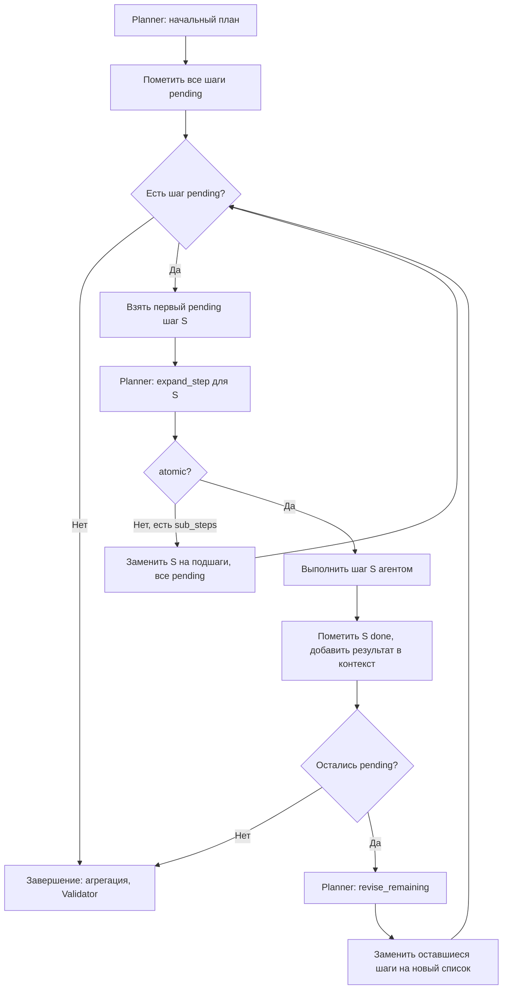

# Стратегия планирования: пошаговая декомпозиция и пересмотр остатка

**Executive Summary**: В мультиагентной системе планирование строится как **пошаговая декомпозиция с пересмотром остатка плана**. Оркестратор ведёт плоский список шагов; по одному берёт очередной шаг, при необходимости разбивает его на атомарные подшаги (через Planner), выполняет целевым агентом и после каждого выполнения вызывает Planner для **пересмотра оставшейся части плана** с учётом новых данных и инсайтов. Так достигаются атомарность задач, учёт контекста и инсайтов analyst без явных фаз и без отдельного «толстого» плана на старте. Документ описывает принципы атомарности, алгоритм, контракты Planner, ограничения и шаги имплементации.

---

## 1. Когда нужна декомпозиция

- Один запрос охватывает **несколько независимых подвопросов** (несколько поисковых запросов, несколько датасетов, несколько визуализаций).
- Задача для одного агента **превышает разумный объём** (например, «извлеки 10 таблиц из 20 страниц» → лучше разбить на батчи или источники).
- Нужен **последовательный учёт результатов** (сначала собрать данные, потом на их основе спланировать анализ и отчёт).

Без декомпозиции один «толстый» шаг даёт перегруженный промпт, нестабильный вывод LLM или таймауты. Подход «пошаговая декомпозиция + пересмотр остатка» решает это за счёт ленивого разбиения (только когда оркестратор доходит до шага) и постоянной корректировки оставшегося плана по контексту.

---

## 2. Принцип атомарности

**Атомарная подзадача** — одна единица работы для одного агента, с одним чётким входом и выходом.

| Агент          | Атомарная задача (примеры)                          | Неатомарно (стоит разбить) |
|----------------|-----------------------------------------------------|----------------------------|
| discovery      | Один поисковый запрос (один `query`)                | «Найди A, B и C» → несколько шагов discovery |
| research       | Загрузка до N URL из одного discovery               | «Загрузи 20 страниц» без разбиения по источникам |
| structurizer   | Извлечение структуры из одного блока контента/типа  | «Извлеки все таблицы из 10 статей» → по источнику или по типу |
| analyst        | Анализ одной таблицы / одного аспекта               | «Проанализируй 5 таблиц и сравни регионы и категории» → несколько шагов |
| reporter       | Один итоговый отчёт по накопленному контексту       | Обычно один шаг в конце |
| transform_codex / widget_codex | Одна трансформация / один виджет   | «Сделай 5 графиков» → несколько шагов widget_codex |

Правило: **один шаг плана = одна атомарная задача для одного агента**. Если запрос требует N таких единиц, в плане должно быть N шагов (или они появляются за счёт разбиения и пересмотра остатка).

Planner при разбиении шага (`expand_step`) и при пересмотре остатка (`revise_remaining`) руководствуется этими правилами атомарности.

---

## 3. Алгоритм

План — всегда **плоский** список шагов. Каждый шаг имеет внутренний статус: «предстоит» (`pending`) или «выполнен» (`done`). Оркестратор в цикле обрабатывает первый шаг в статусе «предстоит»: проверяет атомарность, при необходимости разбивает на подшаги, выполняет, затем пересматривает оставшуюся часть плана.

### Пошаговое описание

1. **Инициализация**  
   Planner по `user_request` формирует **начальный план** — последовательность шагов `[S1, S2, …, Sk]`. Всем шагам присваивается статус `pending`. Контекст `C` (например, `pipeline_context` с `agent_results`) изначально пуст или содержит board_context.

2. **Выбор очередного шага**  
   Берётся первый шаг в статусе `pending` — обозначим его `S`. Если таких нет — завершение (все шаги выполнены).

3. **Проверка атомарности**  
   Вызов Planner с задачей `expand_step`: вход — шаг `S` (без внутренних полей вроде `_status`), контекст. Выход — либо `{ "atomic": true }`, либо `{ "atomic": false, "sub_steps": [S_a, S_b, …] }`. Подшаги в том же формате, что и шаги плана (`agent`, `task`, при необходимости `step_id`, `depends_on`).

4. **Разбиение при необходимости**  
   Если `atomic === false` и `sub_steps` не пусты: в плане шаг `S` **заменяется** на последовательность подшагов (все со статусом `pending`). План остаётся плоским. Переход к п. 2 (очередной шаг — первый из вставленных). Должен действовать лимит числа расширений одного «исходного» шага (например, не более 3), чтобы избежать бесконечного разбиения.

5. **Исполнение атомарного шага**  
   Шаг `S` выполняется целевым агентом с контекстом `C`. Результат добавляется в контекст, шаг помечается как `done`. Переход к п. 6.

6. **Пересмотр оставшейся части плана**  
   Собираются выполненные шаги и текущий «остаток» (все шаги в статусе `pending`). Если остаток пуст — завершение.  
   **Критерии вызова revise_remaining** (вызов не после каждого шага, а по условиям):
   - **Всегда вызывать**: последний шаг завершился с ошибкой (`status == "error"`) — планировщик может пропустить или заменить шаг.
   - **Всегда вызывать**: последний шаг помечен как suboptimal (например, structurizer вернул пустые таблицы, discovery — ноль источников) — планировщик может добавить retry или альтернативу.
   - **Всегда вызывать**: последний выполненный шаг — **analyst** — findings/narrative могут требовать дополнительный discovery/research; планировщик может добавить шаги по инсайтам.
   - **Исключение (виджет ContentNode)**: при `mode/controller == widget`, успешном analyst и остатке с **widget_codex** без discovery/research в выполненных шагах — **не** вызывать `revise_remaining` (иначе планировщик часто вставляет structurizer без сырого контента → лишние LLM и повтор widget_codex).
   - **Исключение (TransformController)**: при `mode/controller == transformation`, успешном analyst и остатке с **transform_codex** без discovery/research — **не** вызывать `revise_remaining`; если в остатке только шаги **analyst** — тоже не вызывать (аналогично виджету, см. `_should_revise_remaining`).
   - **Обязательный хвост плана**: для WidgetController планировщик дополняется до **widget_codex → reporter**, для TransformController — до **transform_codex → reporter**, если LLM их опустил (`PlannerAgent._ensure_*_codex_in_plan`).
   - **Не вызывать**: после «рутинного» успешного discovery или research, если нет ошибки и не analyst — остаток плана не менять, перейти к следующему шагу (экономия вызовов LLM и снижение риска, что планировщик выбросит research/structurizer/reporter).

   Когда условие выполнено: вызывается Planner с задачей `revise_remaining`; на выход — новая последовательность шагов, заменяющая оставшуюся часть. Итоговый план = выполненные шаги (`done`) + новая оставшаяся последовательность (все `pending`). Переход к п. 2.  
   Когда условие не выполнено: остаток не меняется, переход к п. 2 без вызова Planner.  
   В коде оркестратора критерии реализованы в `_should_revise_remaining()`.

7. **Условие остановки**  
   - Нет шагов в статусе `pending` — завершение; финальный ответ формируется из контекста (reporter, агрегация, при необходимости Validator).  
   - Лимиты: максимальное число выполнений шагов за сессию, максимальное число вызовов `revise_remaining` за сессию — для защиты от зацикливания.

---

## 4. Свойства подхода

- **Планарность**: план всегда — линейный список шагов без вложенных подпланов. Расширение происходит только за счёт замены одного шага на несколько на том же уровне.
- **Ленивая декомпозиция**: разбиение только когда оркестратор доходит до шага; не нужно сразу строить максимально детальный план и упираться в лимит токенов.
- **Учёт инсайтов**: после каждого выполнения пересматривается именно **оставшаяся** часть с учётом нового контекста — в том числе findings и narrative analyst; Planner может добавить discovery/research для проверки гипотезы или углубления темы.
- **Единый цикл**: проверка атомарности → при необходимости расширение плана → выполнение → пересмотр остатка — один и тот же цикл для любого шага.
- **Адаптивность к провалам**: при ошибке выполнения шага в пересмотр остатка можно передать контекст ошибки; Planner может скорректировать остаток (пропустить или заменить шаг), не переписывая уже выполненную часть.

---

## 5. Контракты Planner

Для реализации нужны три типа вызовов Planner.

| Задача | Вход | Выход |
|--------|------|--------|
| **create_plan** | `user_request`, опционально board/context | Начальный план: `{ "steps": [S1, S2, …] }`. Каждый шаг: `agent`, `task`, при необходимости `step_id`, `depends_on`. |
| **expand_step** | Один шаг S (`agent`, `task`, …), контекст C | Либо `{ "atomic": true }`, либо `{ "atomic": false, "sub_steps": [Sa, Sb, …] }`. Подшаги в том же формате, что и шаги плана. |
| **revise_remaining** | `user_request`, выполненные_шаги (кратко), оставшиеся_шаги, полный контекст C (в т.ч. последние findings/narrative) | Новая последовательность шагов: `{ "remaining_steps": [S1, S2, …] }`. Может быть пустой или содержать только reporter (и при необходимости validator). |

В системном промпте Planner должны быть явно описаны:
- критерии атомарности по агентам (раздел 2), правило «один шаг — один query / одна таблица / один виджет» при `expand_step`;
- при `revise_remaining`: учитывать findings и narrative; при необходимости добавлять discovery/research по инсайтам; иначе сокращать остаток до reporter или оставлять только необходимые шаги.

---

## 6. Учёт инсайтов

Инсайты analyst (findings, narrative, гипотезы, рекомендации) **естественно учитываются** в этом подходе: после выполнения шага analyst контекст обновлён, и следующий вызов `revise_remaining` получает полный контекст, включая эти инсайты. Planner может:
- добавить шаги discovery/research для проверки гипотезы или сравнения с другими источниками;
- добавить шаги analyst для углубления темы;
- либо решить, что текущих данных и инсайтов достаточно, и вернуть только шаг reporter.

Отдельный «инсайт-реплан» или отдельные фазы не требуются — пересмотр остатка после каждого шага и есть механизм учёта инсайтов.

---

## 7. Ограничения и риски

- **Латентность**: на каждый шаг возможны до двух вызовов Planner (проверка атомарности/расширение и пересмотр остатка после выполнения). Снижение: проверку атомарности делать эвристически где возможно; пересмотр остатка вызывается **по критериям** (ошибка, suboptimal, шаг analyst), а не после каждого шага — см. п. 6 алгоритма.
- **Стабильность остатка**: если Planner при `revise_remaining` каждый раз радикально меняет оставшуюся часть (например, снова добавляет длинную цепочку discovery → …), цикл может не сходиться. Ограничить: лимит на число вызовов `revise_remaining` за сессию; в промпте требовать, что новый remaining не должен повторять уже выполненные типы шагов без явной причины (по инсайту).
- **Формат остатка**: при `revise_remaining` передаётся остаток как список шагов; Planner возвращает новый список. Зависимости между шагами внутри остатка можно считать последовательными (каждый опирается на предыдущие через общий контекст).
- **Захламление плана**: LLM при `revise_remaining` может вернуть «мусорные» step_id (например `6_retry`, `6.1.1.1.1...`, дубликаты discovery). **Меры**: (1) оркестратор после получения `remaining_steps` **нормализует** step_id до последовательных номеров (N+1, N+2, … по количеству выполненных шагов); (2) обрезка списка до лимита шагов за сессию; (3) в промпте Planner — не более 7 шагов в remaining_steps и простые step_id. Тест-кейс: запрос «Сравни цены на iPhone 15 в Маркете, Ситилинке и DNS» — план не должен содержать вложенные id и дубликаты одних и тех же подзадач.
- **Лимит revise_remaining**: при плане «9 discovery + research + structurizer + reporter» вызывается до 12 пересмотров. Если `MAX_REVISE_REMAINING_PER_SESSION = 10`, цикл обрывается с ещё не выполненными шагами (reporter и др.). Значение повышено до 25 (см. константы в orchestrator).
- **Цепочка research → structurizer**: Structurizer ожидает «raw content» (полные тексты страниц), которые даёт агент research. Если планировщик убирает research из остатка и оставляет только discovery → structurizer → reporter, structurizer логирует «No raw content provided» и не может построить таблицу. В промпте revise_remaining желательно явно указывать: не удалять шаг research, если в остатке есть structurizer и нужны полные тексты страниц.
- **Сворачивание остатка в один шаг**: Planner может заменить оставшиеся шаги на один (например только validator). **Причины**: (1) формулировка «достаточно отчёта» трактовалась широко, модель возвращала один лишь validator, пропуская reporter; (2) в контекст передаются только счётчики, без явной пометки «structurizer/reporter ещё не выполнялись». **Меры**: ограничение «не более 7 шагов» снято; в промпте явно: при сокращении до минимума — сначала reporter, затем validator, не возвращать один лишь validator без reporter; явная подсказка «таблица/отчёт не созданы», если structurizer/reporter в остатке и ещё не выполнялись; в оркестраторе — **безусловная защита**: если в текущем остатке были шаги structurizer или reporter, а в ответе Planner их нет — пересмотр не применяется, сохраняется исходный остаток (логируется предупреждение).

---

## 8. Связь с текущей архитектурой

- **Orchestrator** выполняет цикл по шагам с учётом статусов `pending`/`done`; при необходимости вызывает Planner для `expand_step` и `revise_remaining`. Реплан по ошибке (если используется) может быть сведён к одному вызову `revise_remaining` с контекстом ошибки, чтобы не переписывать выполненную часть плана.
- **Validator** и агрегация результата применяются после выхода из цикла так же, как при линейном выполнении плана: по результатам в `agent_results` (от начала текущего плана до конца).
- **MULTI_AGENT.md**: описание Planner и оркестратора дополняется отсылкой на настоящий документ (стратегия планирования).

---

## 9. Шаги имплементации

Пошаговый план внедрения с привязкой к коду. Режим является основным и работает всегда.

### 9.1. Конфигурация и константы

**Где**: `orchestrator.py` (константы рядом с `MAX_REPLAN_ATTEMPTS`).

**Константы**:
- `MAX_EXPAND_PER_STEP = 3` — максимум расширений одного шага в подшаги.
- `MAX_REVISE_REMAINING_PER_SESSION = 10` — максимум вызовов `revise_remaining` за один `process_request`.
- `MAX_STEPS_EXECUTED = 50` — максимум выполнений шагов за сессию.

---

### 9.2. Представление плана со статусами шагов

**Где**: оркестратор, внутренняя структура при работе в режиме пошагового планирования.

**Что сделать**:
- Шаг — словарь с доп. полем `"_status": "pending" | "done"` (внутреннее, не уходит в Planner/API). При извлечении плана из Planner всем шагам добавлять `_status: "pending"`.
- План хранить как список таких шагов. Очередной шаг = первый с `_status == "pending"`. При возврате результата пользователю убрать `_status` из шагов.

---

### 9.3. Planner: задача `expand_step`

**Где**: `apps/backend/app/services/multi_agent/agents/planner.py`.

**Что сделать**:
- В `process_task` добавить ветку `task_type == "expand_step"`.
- Реализовать метод `_expand_step(task, context)`: вход — `task["step"]`, контекст; промпт по правилам атомарности (раздел 2); парсинг JSON-ответа LLM; возврат структурированно в `metadata` или в отдельном поле payload (`atomic`, `sub_steps`), чтобы оркестратор не парсил narrative.

---

### 9.4. Planner: задача `revise_remaining`

**Где**: `apps/backend/app/services/multi_agent/agents/planner.py`.

**Что сделать**:
- В `process_task` добавить ветку `task_type == "revise_remaining"`.
- Реализовать метод `_revise_remaining(task, context)`: вход — `user_request`, `completed_steps` (краткие описания), `remaining_steps`, полный контекст (в т.ч. findings/narrative); промпт с инструкцией пересмотреть остаток с учётом инсайтов; парсинг ответа `remaining_steps`; возврат в формате, из которого оркестратор возьмёт новый список шагов (например `metadata["remaining_steps"]` или `plan.steps`).

---

### 9.5. Сериализация контекста для Planner

**Где**: оркестратор при формировании task/context для Planner.

**Что сделать**:
- Для `expand_step`: в контексте достаточно `user_request` и при необходимости минимальный board_context.
- Для `revise_remaining`: сжатое представление выполненных результатов (последние N записей agent_results, ключевые поля; при наличии последнего analyst — findings и narrative с ограничением по длине). Вынести хелпер `_serialize_results_for_planner(agent_results, max_items=20, include_last_narrative=True)` и использовать его при вызове `revise_remaining` (и при необходимости в реплане по ошибке).

---

### 9.6. Оркестратор: цикл по шагам

**Где**: `apps/backend/app/services/multi_agent/orchestrator.py`, метод `process_request`.

**Реализация**: после получения плана от Planner — цикл из раздела 3: инициализация статусов и счётчиков → пока есть pending и не превышены лимиты — взять первый pending → `expand_step` → при неатомарности подставить подшаги → выполнить шаг → пометить done → `revise_remaining` → заменить остаток → повторить. После выхода — агрегация, Validator, возврат. План в raw_results отдавать без `_status`.

---

### 9.7. Обработка ошибки шага

**Где**: оркестратор, внутри цикла при `step_payload.status == "error"`.

**Что сделать**:
- При ошибке выполнения шага передавать в следующий вызов `revise_remaining` контекст ошибки (last_error, failed_agent). Planner возвращает скорректированный остаток (пропуск или замена шага), выполненная часть плана сохраняется. Альтернатива: один раз вызвать полный реплан и подставить новый план как список pending шагов — документировать выбранный вариант в коде и в данном разделе.

---

### 9.8. Валидация и финальный отчёт

**Где**: оркестратор, после выхода из цикла.

**Что сделать**:
- Агрегировать результаты и вызывать Validator по тому же срезу `agent_results`, что и в классическом режиме. В raw_results сохранять план без `_status`.

---

### 9.9. Тесты и документация

**Где**: тесты, `docs/PLANNING_DECOMPOSITION_STRATEGY.md`, `docs/MULTI_AGENT.md`.

**Что сделать**:
- Интеграционный тест: простой запрос, проверить success и наличие narrative от reporter; при необходимости мокать Planner (expand_step всегда atomic, revise_remaining возвращает текущий remaining без изменений).
- В документации указать лимиты и форматы входа-выхода Planner для `expand_step` и `revise_remaining`. В MULTI_AGENT.md — отсылка к настоящему документу.

---

### 9.10. Порядок внедрения (чеклист)

| # | Шаг | Файлы | Зависимости |
|---|-----|--------|-------------|
| 1 | Константы лимитов | orchestrator.py | — |
| 2 | Planner: expand_step | planner.py | — |
| 3 | Planner: revise_remaining | planner.py | — |
| 4 | Сериализация контекста для Planner | orchestrator.py | — |
| 5 | Представление шагов со статусом (pending/done) | orchestrator.py | 1 |
| 6 | Цикл: выбор шага → expand_step → выполнение → revise_remaining | orchestrator.py | 1, 2, 3, 4, 5 |
| 7 | Обработка ошибки шага | orchestrator.py | 6 |
| 8 | Валидация и финальный результат | orchestrator.py | 6 |
| 9 | Тесты и обновление документации | tests/, docs/ | 6–8 |

Рекомендуемая последовательность: 1 → 2 → 3 → 4 → 5 → 6 → 7 → 8 → 9.
