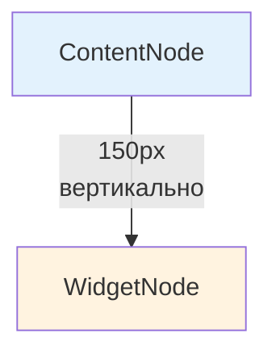
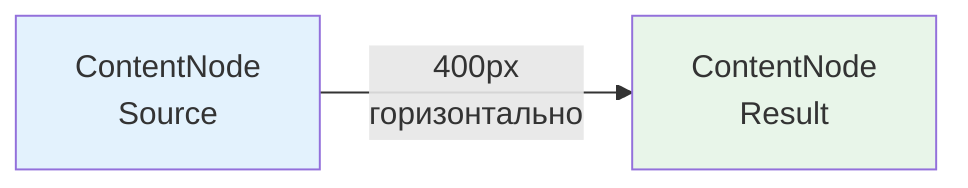
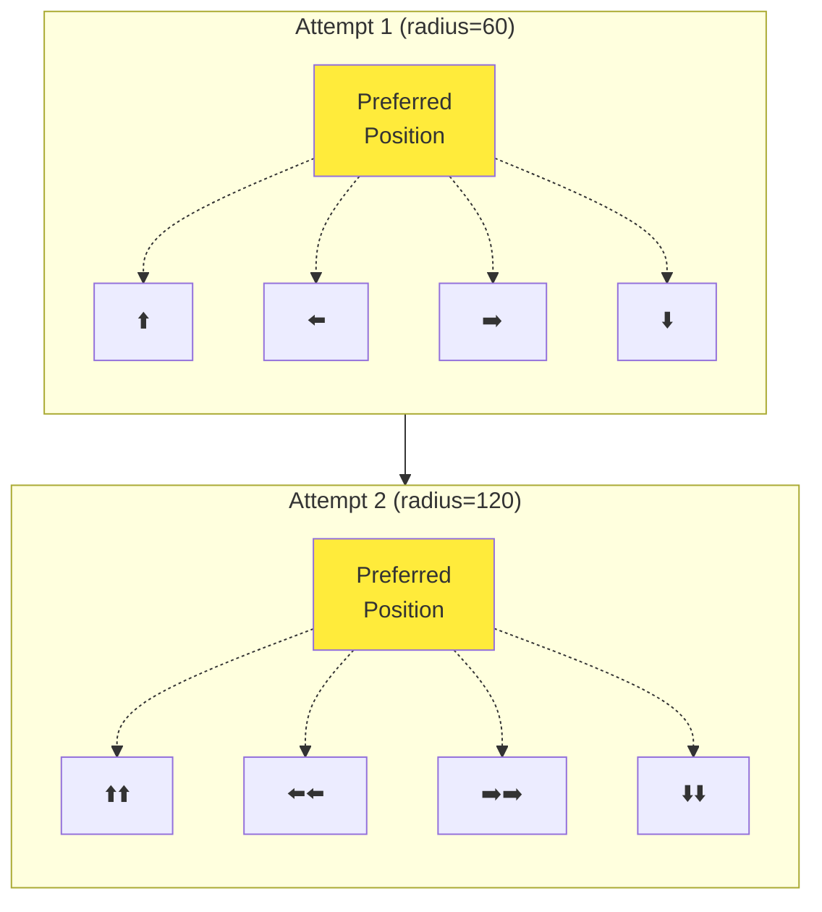
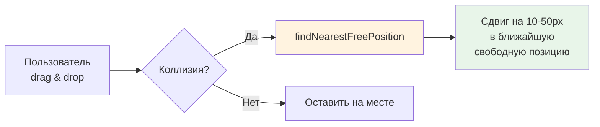

# Smart Node Auto-Placement System

## 📋 Executive Summary

Система умного автоматического размещения нодов на канвасе предотвращает перекрытие нодов и находит оптимальное свободное место с учётом типа связи.

**Ключевые возможности:**
- ✅ Проверка коллизий со всеми существующими нодами
- ✅ Вертикальное размещение для VISUALIZATION связей (WidgetNode под ContentNode)
- ✅ Горизонтальное размещение для TRANSFORMATION связей (ContentNode справа от source)
- ✅ Спиральный поиск свободного места при занятой предпочтительной позиции
- ✅ Учёт размеров нодов и минимальных отступов
- ✅ Автоматическая коррекция при ручном перемещении нодов (предотвращение наложения)
- ✅ Две функции: `findOptimalNodePosition` (для создания) и `findNearestFreePosition` (для перемещения)

## 🎯 Проблема и решение

### Проблема (было)
```typescript
// Простое смещение на фиксированное расстояние
x: sourceNode.x + 400,
y: sourceNode.y
```
**Недостатки:**
- Ноды накладываются друг на друга
- Не учитываются размеры нодов
- Всегда одна и та же позиция

### Решение (стало)
```typescript
const optimalPosition = findOptimalNodePosition({
    sourceNode,
    targetWidth: 400,
    targetHeight: 300,
    existingNodes: allNodesOnBoard,
    connectionType: 'visualization' // или 'transformation'
})
```
**Преимущества:**
- Проверяет коллизии со всеми нодами
- Учитывает размеры и отступы
- Ищет ближайшее свободное место
- Разные стратегии для разных типов связей

## 🔧 Архитектура

### Frontend (TypeScript)
**Файл:** `apps/web/src/lib/nodePositioning.ts`

```typescript
// Для создания новых нодов (с offset'ами)
interface FindPositionParams {
    sourceNode: NodePosition & { width?: number; height?: number }
    targetWidth: number
    targetHeight: number
    existingNodes: NodeBounds[]
    connectionType?: 'visualization' | 'transformation'
    padding?: number
}
function findOptimalNodePosition(params: FindPositionParams): NodePosition

// Для ручного перемещения (минимальный сдвиг)
function findNearestFreePosition(
    currentPosition: NodePosition,
    nodeWidth: number,
    nodeHeight: number,
    existingNodes: NodeBounds[],
    padding?: number
): NodePosition
```

### Backend (Python)
**Файл:** `apps/backend/app/utils/node_positioning.py`

```python
def find_optimal_node_position(
    source_node: Dict[str, float],
    target_width: float,
    target_height: float,
    existing_nodes: List[NodeBounds],
    connection_type: Literal["visualization", "transformation"] = "transformation",
    padding: float = DEFAULT_PADDING
) -> Dict[str, float]
```

## 🎨 Алгоритм размещения

### 1. Определение предпочтительной позиции

#### VISUALIZATION (вертикально)

*WidgetNode размещается по центру относительно ContentNode*

#### TRANSFORMATION (горизонтально)


### 2. Проверка коллизий (AABB)

```typescript
function checkCollision(bounds1, bounds2, padding) {
    return !(
        bounds1.x + bounds1.width + padding < bounds2.x ||
        bounds1.x > bounds2.x + bounds2.width + padding ||
        bounds1.y + bounds1.height + padding < bounds2.y ||
        bounds1.y > bounds2.y + bounds2.height + padding
    )
}
```

### 3. Спиральный поиск

Если предпочтительная позиция занята:
1. Увеличиваем радиус поиска на каждой итерации
2. Проверяем кандидатные позиции вокруг предпочтительной
3. Для visualization — приоритет вертикальным смещениям
4. Для transformation — приоритет горизонтальным смещениям



### 4. Fallback

Если после 100 попыток не найдено свободное место:
- Возвращаем предпочтительную позицию (с предупреждением)
- Лучше перекрытие, чем отсутствие нода

### 5. Коррекция ручного перемещения (findNearestFreePosition)

Когда пользователь перетаскивает ноду вручную и отпускает на занятом месте:



**Алгоритм поиска:**
- Шаг: 10px (минимальный визуальный сдвиг)
- 8 направлений: вверх, вниз, влево, вправо + диагонали
- Макс. 50 попыток (до 500px)
- Fallback: остаётся на исходной позиции

## 📊 Сравнение функций

| Характеристика       | `findOptimalNodePosition`   | `findNearestFreePosition` |
| -------------------- | --------------------------- | ------------------------- |
| **Назначение**       | Создание новых нод          | Ручное перемещение        |
| **Начальный offset** | 150-400px от источника      | 0 (текущая позиция)       |
| **Шаг поиска**       | 60px                        | 10px                      |
| **Направления**      | 4 (приоритет по типу связи) | 8 (включая диагонали)     |
| **Макс. попыток**    | 100                         | 50                        |
| **Используется в**   | WidgetDialog, Backend API   | BoardCanvas.onNodesChange |

## 📦 Константы

| Параметр             | Значение | Описание                                     |
| -------------------- | -------- | -------------------------------------------- |
| `DEFAULT_PADDING`    | 40px     | Минимальный отступ между нодами              |
| `VERTICAL_SPACING`   | 150px    | Вертикальное расстояние для visualization    |
| `HORIZONTAL_SPACING` | 400px    | Горизонтальное расстояние для transformation |
| `MIN_STEP`           | 10px     | Минимальный шаг для ручного перемещения      |

## 🚀 Интеграция

### Frontend (WidgetDialog)
```typescript
import { findOptimalNodePosition, convertNodesToBounds } from '@/lib/nodePositioning'

// Find optimal position for new WidgetNode
const optimalPosition = findOptimalNodePosition({
    sourceNode: { x, y, width: 320, height: 200 },
    targetWidth: 400,
    targetHeight: 300,
    existingNodes: convertNodesToBounds(allNodes),
    connectionType: 'visualization'
})
```

### Frontend (BoardCanvas — ручное перемещение)
```typescript
import { findNearestFreePosition, convertNodesToBounds } from '@/lib/nodePositioning'

// В onNodesChange обработчике
const handleNodesChange = useCallback((changes: NodeChange[]) => {
    changes.forEach(change => {
        if (change.type === 'position' && !change.dragging && change.position) {
            // После drag & drop проверяем коллизию
            const otherNodes = allNodes.filter(n => n.id !== change.id)
            const correctedPosition = findNearestFreePosition(
                change.position,
                nodeWidth,
                nodeHeight,
                convertNodesToBounds(otherNodes)
            )
            // Применяем скорректированную позицию
            if (correctedPosition.x !== change.position.x || 
                correctedPosition.y !== change.position.y) {
                updateNodePosition(change.id, correctedPosition)
            }
        }
    })
}, [allNodes])
```

### Backend (execute_transformation)
```python
from app.utils.node_positioning import find_optimal_node_position, NodeBounds

# Get all existing nodes
all_content_nodes = await ContentNodeService.get_board_contents(db, board_id)
all_source_nodes = await SourceNodeService.get_board_sources(db, board_id)

# Convert to bounds
existing_nodes = []
for node in all_content_nodes:
    pos = node.position or {"x": 0, "y": 0}
    existing_nodes.append(NodeBounds(
        id=str(node.id),
        x=pos.get("x", 0),
        y=pos.get("y", 0),
        width=node.width or 320,
        height=node.height or 200
    ))

# Find optimal position
optimal_position = find_optimal_node_position(
    source_node={
        "x": source_node.position.get("x", 0),
        "y": source_node.position.get("y", 0),
        "width": source_node.width or 320,
        "height": source_node.height or 200
    },
    target_width=320,
    target_height=200,
    existing_nodes=existing_nodes,
    connection_type="transformation"
)

# Use in node creation
new_node = await ContentNodeService.create_content_node(
    db,
    ContentNodeCreate(
        ...
        position=optimal_position
    )
)
```

## ✅ Покрытие

### Frontend
- ✅ **WidgetDialog** — создание WidgetNode из ContentNode
- ✅ **BoardCanvas.onNodesChange** — коррекция после ручного drag & drop
- ⚠️ **TransformDialog** — использует backend API (позиция определяется на backend)
- ⚠️ **Manual node creation** — пока использует `newNodePosition` из UI

### Backend
- ✅ **execute_transformation** — создание ContentNode из трансформации
- ⚠️ **AI-generated nodes** — могут использовать простой offset (требуется проверка)

## 🔮 Будущие улучшения

1. **Grid snapping** — привязка к сетке для аккуратного размещения
2. **Layout optimization** — автоматическая оптимизация всей доски
3. **User preferences** — настраиваемые расстояния и отступы
4. **Smart clustering** — группировка связанных нодов
5. **Canvas boundaries** — учёт границ видимой области

## 📚 См. также

- [DATA_NODE_SYSTEM.md](DATA_NODE_SYSTEM.md) — архитектура SourceNode/ContentNode
- [CONNECTION_TYPES.md](CONNECTION_TYPES.md) — типы связей

