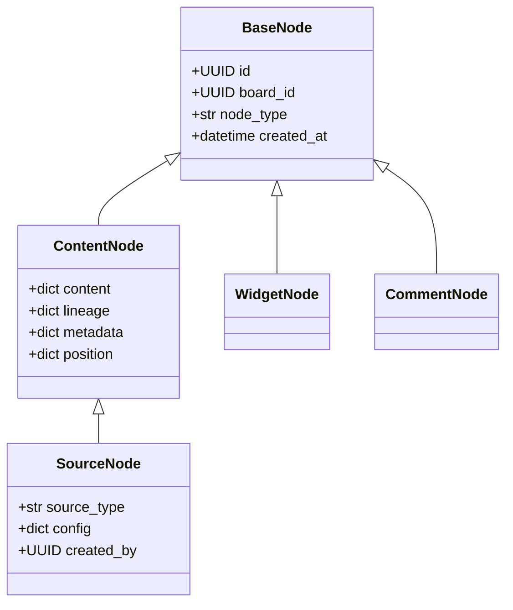
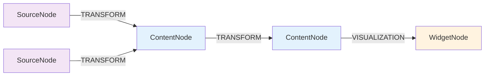
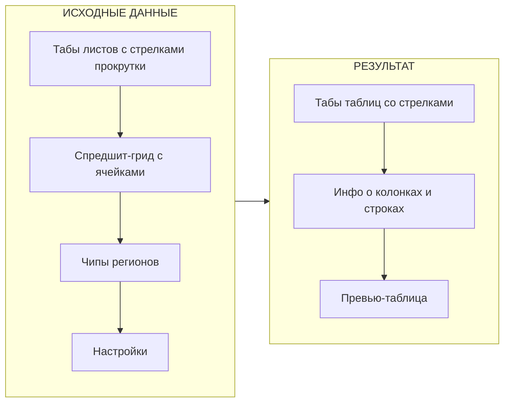

# Source Node Concept v2.0

**Статус**: 📋 Концепция согласована  
**Дата**: 3 февраля 2026  
**Цель**: Переосмысление SourceNode как расширения ContentNode с AI-first диалогами

---

## 🎯 Executive Summary

**Ключевые изменения в концепции SourceNode**:

1. **SourceNode наследует ContentNode** — источник содержит и конфиг, и данные (text + tables)
2. **Витрина источников** — drag & drop типов из левой панели на доску
3. **AI-first диалоги** — интеллектуальное извлечение данных с помощью AI-ассистента
4. **Убираем EXTRACT edge** — остаётся только TRANSFORM для всех преобразований
5. **ContentNode остаётся** — для результатов трансформаций (одинарных и множественных)
6. **Модульная архитектура** — каждый тип источника в отдельной папке

### Типы источников

| Тип                     | Иконка | Описание                 | AI Role                     |
| ----------------------- | ------ | ------------------------ | --------------------------- |
| CSV                     | 📊      | Табличные данные         | Автоопределение схемы       |
| JSON                    | { }    | Структурированные данные | Генерация extraction code   |
| Excel                   | 📗      | Многолистовые таблицы    | Генерация extraction code   |
| Документ (PDF/DOCX/TXT) | 📄      | Текстовые документы      | Мультиагент извлечения      |
| API                     | 🔗      | REST endpoints           | —                           |
| База данных             | 🗄️      | SQL databases            | —                           |
| AI Research             | 🔍      | Deep research            | Search → Research → Analyze |
| Ручной ввод             | ✏️      | Manual tables            | —                           |
| Стрим                   | 📡      | Real-time (Phase 4)      | —                           |

---

## 📊 Архитектура

### Наследование



### Структура SourceNode

```python
class SourceNode(ContentNode):
    """SourceNode = Source Config + Content Data"""
    
    # От ContentNode:
    content: dict = {
        "text": str,           # Текстовое описание/резюме
        "tables": [            # Массив таблиц
            {
                "id": str,
                "name": str,
                "columns": [{"name": str, "type": str}],
                "rows": [dict]
            }
        ]
    }
    lineage: dict              # Data lineage
    node_metadata: dict        # Метаданные
    position: dict             # {x, y}
    
    # Специфичные для SourceNode:
    source_type: str           # csv, json, excel, document, api, database, research, manual
    config: dict               # Конфигурация источника (connection, extraction_code, etc.)
    created_by: UUID           # Создатель
```

### Типы связей (обновлённые)



**Удалён**: EXTRACT edge  
**Остаются**: TRANSFORM, VISUALIZATION, COMMENT, REFERENCE, DRILL_DOWN

---

## 🎨 Витрина источников

### Расположение

В левой панели (ProjectExplorer) секция "Источники данных":

```
📂 Источники данных (Drag & Drop)
├── 📊 CSV
├── { } JSON  
├── 📗 Excel
├── 📄 Документ (PDF/DOCX/TXT)
├── 🔗 API
├── 🗄️ База данных
├── 🔍 AI Research
├── ✏️ Ручной ввод
└── 📡 Стрим (скоро)
```

### Поведение

1. Пользователь перетаскивает тип источника на доску
2. Открывается соответствующий диалог настройки
3. После заполнения и извлечения данных создаётся SourceNode
4. Нода появляется на доске с заполненным content

---

## 🖼️ Диалоги настройки источников

### Общий layout

Все диалоги имеют унифицированную структуру:

```
┌─────────────────────────────────────────────────────────────────────────────┐
│ [Иконка] Источник: [Тип] — [Название]                               [✕]    │
├────────────────────────────────────┬────────────────────────────────────────┤
│                                    │                                        │
│  ЛЕВАЯ ЧАСТЬ                       │  ПРАВАЯ ЧАСТЬ                          │
│  ────────────────────────────────  │  ────────────────────────────────────  │
│                                    │                                        │
│  • Исходные данные (preview)       │  • Результаты извлечения               │
│  • Настройки подключения           │  • Preview таблиц (табы)               │
│  • Параметры извлечения            │  • Python код (для JSON/Excel)         │
│                                    │  • AI-ассистент (если нужен)           │
│                                    │                                        │
├────────────────────────────────────┴────────────────────────────────────────┤
│                                          [Отмена]   [Создать источник]      │
└─────────────────────────────────────────────────────────────────────────────┘
```

> **Layout решение**: AI-ассистент размещается в правой части под превью результатов.
> Это позволяет сохранить больше места для исходных данных и настроек слева,
> при этом пользователь видит результат и диалог с AI одновременно.

### Название ноды

- Отображается в заголовке диалога
- Автогенерируется на основе файла/URL/промпта
- Редактируемое поле
- Можно изменить после создания на доске

---

## 📊 1. CSV Dialog

**Специфика**: Максимально автоматический — AI определяет схему.

```
┌─────────────────────────────────────────────────────────────────────────────┐
│ 📊 CSV — sales_q1_2024.csv                                            [✕]  │
├────────────────────────────────────┬────────────────────────────────────────┤
│                                    │                                        │
│  ┌─ Загрузка файла ───────────────┐│  ┌─ Результат извлечения ─────────────┐│
│  │                                ││  │                                    ││
│  │  [Drag & Drop зона]            ││  │  ☑ date       (дата)               ││
│  │                                ││  │  ☑ product    (текст)              ││
│  └────────────────────────────────┘│  │  ☑ region     (текст)              ││
│                                    │  │  ☐ manager    (текст) — исключён   ││
│  📎 sales_q1_2024.csv (245 KB)     │  │  ☑ quantity   (число)              ││
│                                    │  │  ☑ amount     (число)              ││
│  ┌─ AI-анализ ────────────────────┐│  │                                    ││
│  │ ✅ Разделитель: запятая        ││  │  ─────────────────────────────────  ││
│  │ ✅ Кодировка: UTF-8            ││  │                                    ││
│  │ ✅ Заголовки: первая строка    ││  │  | date       | product  | region |││
│  │ ✅ Строк: 1,247                ││  │  |------------|----------|--------|││
│  │ ✅ Столбцов: 6                 ││  │  | 2024-01-01 | Ноутбук  | Москва |││
│  └────────────────────────────────┘│  │  | 2024-01-01 | Смартфон | СПб    |││
│                                    │  │  | ...        | ...      | ...    |││
│  ▸ Ручные настройки               │  │                                    ││
│    (если AI ошибся)               │  │  Показано 10 из 1,247              ││
│                                    │  │                                    ││
│                                    │  └────────────────────────────────────┘│
│                                    │                                        │
├────────────────────────────────────┴────────────────────────────────────────┤
│                                          [Отмена]   [📊 Создать источник]   │
└─────────────────────────────────────────────────────────────────────────────┘
```

**Логика**:
1. Drop файл → AI Agent анализирует (сепаратор, кодировка, схема)
2. Справа: чекбоксы для выбора столбцов + preview
3. Ручные настройки свёрнуты (fallback)
4. "Создать" → SourceNode с content

**Config структура**:
```json
{
  "source_type": "csv",
  "config": {
    "file_id": "uuid",
    "filename": "sales_q1_2024.csv",
    "delimiter": ",",
    "encoding": "utf-8",
    "has_header": true,
    "selected_columns": ["date", "product", "region", "quantity", "amount"]
  }
}
```

---

## { } 2. JSON Dialog

**Специфика**: AI генерирует Python код для извлечения.

```
┌─────────────────────────────────────────────────────────────────────────────┐
│ { } JSON — products_catalog.json                                      [✕]  │
├────────────────────────────────────┬────────────────────────────────────────┤
│                                    │                                        │
│  📎 products_catalog.json (1.2 MB) │  [📊 Таблицы] [🐍 Python код]          │
│                                    │                                        │
│  ┌─ Содержимое файла ─────────────┐│  ═══ Таблицы ══════════════════════════│
│  │ {                              ││                                        │
│  │   "meta": {"version": "2.0"},  ││  [products] [categories]              │
│  │   "products": [                ││                                        │
│  │     {"id": 1, "name": "..."},  ││  | id | name     | price  | cat_id |  │
│  │     ...                        ││  |----|----------|--------|--------|  │
│  │   ],                           ││  | 1  | Widget A | 29.99  | 101    |  │
│  │   "categories": [...]          ││  | 2  | Widget B | 49.99  | 102    |  │
│  │ }                              ││                                        │
│  │                                ││  ─────────────────────────────────────  │
│  │ [Свернуть] [Форматировать]     ││                                        │
│  └────────────────────────────────┘│  ┌─ AI Ассистент ─────────────────────┐│
│                                    │  │                                    ││
│                                    │  │ 💬 Опишите что извлечь:            ││
│                                    │  │ ┌────────────────────────────────┐ ││
│                                    │  │ │ Извлеки products и categories │ ││
│                                    │  │ └────────────────────────────────┘ ││
│                                    │  │                        [Отправить] ││
│                                    │  │                                    ││
│                                    │  │ 📋 Рекомендации:                   ││
│                                    │  │ • Извлечь products                 ││
│                                    │  │ • Извлечь categories               ││
│                                    │  │                                    ││
│                                    │  │ [🔮 Авто]  [▶ Выполнить]           ││
│                                    │  └────────────────────────────────────┘│
│                                    │                                        │
├────────────────────────────────────┴────────────────────────────────────────┤
│                                          [Отмена]   [{ } Создать источник]  │
└─────────────────────────────────────────────────────────────────────────────┘
```

**Логика**:
1. Drop файл → preview JSON
2. AI-ассистент + рекомендации
3. "Авто" — AI сам извлекает данные
4. Справа: табы [Таблицы | Python код]
5. Python код сохраняется в config для refresh

**Config структура**:
```json
{
  "source_type": "json",
  "config": {
    "file_id": "uuid",
    "filename": "products_catalog.json",
    "extraction_code": "import json\ndata = json.loads(content)\n..."
  }
}
```

---

## 📗 3. Excel Dialog

**Реализован** — `apps/web/src/components/dialogs/sources/ExcelSourceDialog.tsx`

**Концепция**: Data-Centric Canvas — полноэкранный диалог с двумя панелями: исходные данные слева, результат справа.

### UX-флоу:
1. Пользователь загружает .xlsx файл (drag & drop или клик)
2. Файл отображается в виде spreadsheet-грида с ячейками (левая панель)
3. Пользователь выделяет зоны с таблицами мышью (click+drag с автоскроллом)
4. Кнопка «Умный поиск» автоматически находит и подсвечивает таблицы
5. Найденные таблицы отображаются в превью справа через табы
6. Пользователь может редактировать названия таблиц и столбцов
7. Настройка «Заголовки в первой строке» — индивидуальная для каждой таблицы

### Лейаут диалога:



### Ключевые фичи:
- **Spreadsheet Grid**: полноценный просмотр ячеек с sticky-заголовками и номерами строк
- **Mouse selection + auto-scroll**: выделение ячеек с автопрокруткой при перетаскивании за края грида
- **Smart Detect**: бэкенд-анализ `analyzeExcelSmart` — автопоиск таблиц
- **Многоцветные регионы**: до 6 цветов для подсветки выделенных зон
- **Автодетект заголовков**: эвристика на основе типов данных (текст vs числа)
- **Per-region headerRow**: настройка «Заголовки в первой строке» индивидуальна для каждой таблицы
- **Редактирование названий таблиц**: двойной клик по чипу/табу или иконка карандаша
- **Редактирование названий столбцов**: двойной клик по заголовку в превью (Tab/Shift+Tab для навигации)
- **Табы со стрелками**: ChevronLeft/ChevronRight для прокрутки листов и регионов
- **Полноэкранный диалог**: `100vw-2rem` × `100vh-2rem`

### Config структура:

```json
{
  "source_type": "excel",
  "config": {
    "file_id": "uuid",
    "filename": "report_2024.xlsx",
    "has_header": true,
    "analysis_mode": "smart",
    "max_rows": 10000,
    "detected_regions": [
      {
        "sheet_name": "Продажи",
        "start_row": 2,
        "start_col": 1,
        "end_row": 150,
        "end_col": 8,
        "header_row": 2,
        "table_name": "Продажи 2024",
        "column_overrides": { "0": "Дата", "3": "Сумма RUB" },
        "selected_columns": []
      }
    ]
  }
}
```

### Типы данных (frontend):

```typescript
interface TableRegion {
    id: string
    sheetName: string
    startRow: number       // 1-based
    startCol: number       // 1-based
    endRow: number         // 1-based inclusive
    endCol: number         // 1-based inclusive
    headerRow: number | null  // 1-based, null = без заголовков
    tableName: string
    colorIndex: number
    columnOverrides?: Record<number, string>  // colIndex (0-based) -> custom name
}
```

---

## 📄 4. Document Dialog (PDF/DOCX/TXT)

**Специфика**: Мультиагент извлекает данные. GigaChat распознаёт изображения для сканов.

```
┌─────────────────────────────────────────────────────────────────────────────┐
│ 📄 Документ — annual_report.pdf                                       [✕]  │
├────────────────────────────────────┬────────────────────────────────────────┤
│                                    │                                        │
│  📎 annual_report.pdf (2.1 MB)     │  ┌─ Результат извлечения ─────────────┐│
│                                    │  │                                    ││
│  ┌─ Предпросмотр документа ───────┐│  │  📝 Текст:                         ││
│  │                                ││  │  "Годовой отчёт компании за 2024   ││
│  │  ┌─────────────────────────┐   ││  │  год. Выручка составила 1.2 млрд   ││
│  │  │ ГОДОВОЙ ОТЧЁТ          │   ││  │  рублей, что на 15% выше..."       ││
│  │  │ 2024                   │   ││  │                                    ││
│  │  │                        │   ││  │  [Показать полностью]              ││
│  │  │ Компания достигла...   │   ││  │                                    ││
│  │  │                        │   ││  │  ─────────────────────────────────  ││
│  │  │ ┌────────────────┐     │   ││  │                                    ││
│  │  │ │ Q1  │ $300M    │     │   ││  │  📊 Таблицы:                       ││
│  │  │ │ Q2  │ $320M    │     │   ││  │  [quarterly] [regions] [products]  ││
│  │  │ └────────────────┘     │   ││  │                                    ││
│  │  └─────────────────────────┘   ││  │  | quarter | revenue | growth |   ││
│  │                                ││  │  |---------|---------|--------|   ││
│  │  Страница [1] из 15  [◀] [▶]   ││  │  | Q1      | 300M    | +12%   |   ││
│  └────────────────────────────────┘│  │  | Q2      | 320M    | +15%   |   ││
│                                    │  │                                    ││
│                                    │  └────────────────────────────────────┘│
│                                    │                                        │
│                                    │  ┌─ AI Ассистент ─────────────────────┐│
│                                    │  │                                    ││
│                                    │  │ 💬 Что извлечь из документа?       ││
│                                    │  │ ┌────────────────────────────────┐ ││
│                                    │  │ │ Найди все финансовые таблицы  │ ││
│                                    │  │ │ и ключевые метрики            │ ││
│                                    │  │ └────────────────────────────────┘ ││
│                                    │  │                        [Отправить] ││
│                                    │  │                                    ││
│                                    │  │ 🤖 Запускаю анализ...              ││
│                                    │  │ ✅ Найдено 3 таблицы               ││
│                                    │  │                                    ││
│                                    │  │ [🔮 Авто]  [▶ Извлечь данные]      ││
│                                    │  └────────────────────────────────────┘│
│                                    │                                        │
├────────────────────────────────────┴────────────────────────────────────────┤
│                                          [Отмена]   [📄 Создать источник]   │
└─────────────────────────────────────────────────────────────────────────────┘
```

**Обработка сканированных PDF**:
1. Разбить PDF на страницы
2. Конвертировать страницы в изображения
3. Отправить изображения в GigaChat для распознавания
4. Извлечь текст и таблицы из ответа AI

**Config структура**:
```json
{
  "source_type": "document",
  "config": {
    "file_id": "uuid",
    "filename": "annual_report.pdf",
    "document_type": "pdf",
    "is_scanned": false,
    "extraction_prompt": "Найди все финансовые таблицы..."
  }
}
```

---

## 🔗 5. API Dialog

**Специфика**: Конфигурация HTTP + пагинация.

```
┌─────────────────────────────────────────────────────────────────────────────┐
│ 🔗 API — github_repos                                                 [✕]  │
├────────────────────────────────────┬────────────────────────────────────────┤
│                                    │                                        │
│  ── Запрос ───────────────────────│  ┌─ Результат ─────────────────────────┐│
│                                    │  │                                    ││
│  [GET ▼]  [https://api.github...] │  │  ✅ 200 OK                          ││
│                                    │  │  📦 3 страницы загружено           ││
│  ┌─ Headers ──────────────────[+]─┐│  │  📊 287 записей • 145 KB           ││
│  │ Authorization │ Bearer xxx [✕] ││  │                                    ││
│  │ Accept        │ app/json   [✕] ││  │  ─────────────────────────────────  ││
│  └────────────────────────────────┘│  │                                    ││
│                                    │  │  | id     | name    | language |   ││
│  ┌─ Query Params ─────────────[+]─┐│  │  |--------|---------|----------|   ││
│  │ per_page      │ 100        [✕] ││  │  | 123456 | vscode  | TS       |   ││
│  │ sort          │ updated    [✕] ││  │  | 123457 | TS      | TS       |   ││
│  └────────────────────────────────┘│  │  | ...    | ...     | ...      |   ││
│                                    │  │                                    ││
│  ▸ Body (POST/PUT/PATCH)          │  │  Показано 10 из 287                ││
│                                    │  │                                    ││
│  ── Пагинация ────────────────────│  └────────────────────────────────────┘│
│                                    │                                        │
│  ☑ Включить пагинацию             │                                        │
│  Тип: [Page-based ▼]              │                                        │
│  Параметр: [page    ] Размер: 100 │                                        │
│  Макс. страниц: [10]              │                                        │
│                                    │                                        │
│  ── Парсинг ответа ───────────────│                                        │
│                                    │                                        │
│  JSONPath: [$ ▼]                  │                                        │
│                                    │                                        │
│  [🔍 Проверить запрос]             │                                        │
│                                    │                                        │
├────────────────────────────────────┴────────────────────────────────────────┤
│                                          [Отмена]   [🔗 Создать источник]   │
└─────────────────────────────────────────────────────────────────────────────┘
```

**Типы пагинации**:
- `page` — ?page=1&per_page=100
- `offset` — ?offset=0&limit=100
- `cursor` — ?cursor=xxx
- `link-header` — RFC 5988 Link header

**Config структура**:
```json
{
  "source_type": "api",
  "config": {
    "url": "https://api.github.com/users/microsoft/repos",
    "method": "GET",
    "headers": {"Authorization": "Bearer xxx"},
    "params": {"per_page": 100, "sort": "updated"},
    "pagination": {
      "enabled": true,
      "type": "page",
      "page_param": "page",
      "size_param": "per_page",
      "page_size": 100,
      "max_pages": 10
    },
    "json_path": "$"
  }
}
```

---

## 🗄️ 6. Database Dialog

**Специфика**: Подключение + выбор таблиц + WHERE.

```
┌─────────────────────────────────────────────────────────────────────────────┐
│ 🗄️ База данных — production_db                                        [✕]  │
├────────────────────────────────────┬────────────────────────────────────────┤
│                                    │                                        │
│  ── Подключение ──────────────────│  ── Выбранные таблицы ─────────────────│
│                                    │                                        │
│  Тип: [PostgreSQL ▼]              │  ┌────────────────────────────────────┐ │
│                                    │  │ 📋 orders                          │ │
│  Хост: [localhost    ] : [5432  ] │  │    WHERE: created_at > '2024-01-01'│ │
│  База: [sales_db             ]    │  │    Лимит: 1000 строк               │ │
│  User: [analyst ] Pass: [••••••]  │  │    [✏️] [✕]                         │ │
│                                    │  │                                    │ │
│  [🔌 Подключиться]                 │  │ 📋 products                        │ │
│  ✅ Подключено (PostgreSQL 15.2)  │  │    WHERE: (все записи)             │ │
│                                    │  │    Лимит: 1000 строк               │ │
│  ── Доступные таблицы ────────────│  │    [✏️] [✕]                         │ │
│                                    │  └────────────────────────────────────┘ │
│  🔍 [Поиск...]                    │                                        │
│                                    │  ── Предпросмотр: orders ─────────────│
│  ┌───────────────────────────────┐│                                        │
│  │ 📋 orders      (125,000) [→]  ││  | order_id | customer | total |      │
│  │ 📋 customers   (8,500)   [→]  ││  |----------|----------|-------|      │
│  │ 📋 products    (350)     [→]  ││  | 12345    | John     | 15000 |      │
│  │ 📋 order_items (450,000) [→]  ││  | 12346    | Jane     | 23000 |      │
│  │ 📋 categories  (25)      [→]  ││                                        │
│  │ 📋 regions     (12)      [→]  ││  Показано 10 из 847                   │
│  │ ...                           ││                                        │
│  └───────────────────────────────┘│                                        │
│                                    │                                        │
│  💡 Дважды кликните или           │                                        │
│  нажмите [→] для добавления       │                                        │
│                                    │                                        │
├────────────────────────────────────┴────────────────────────────────────────┤
│                                          [Отмена]   [🗄️ Создать источник]   │
└─────────────────────────────────────────────────────────────────────────────┘
```

**Редактор WHERE условия** (модальное окно при клике ✏️):
```
┌─────────────────────────────────────┐
│ Настройка таблицы: orders           │
├─────────────────────────────────────┤
│                                     │
│ WHERE условие (опционально):        │
│ ┌─────────────────────────────────┐ │
│ │ created_at > '2024-01-01'       │ │
│ │ AND status = 'completed'        │ │
│ └─────────────────────────────────┘ │
│                                     │
│ Лимит строк: [1000]                 │
│ ⓘ Максимум 1000 для MVP            │
│                                     │
│ [▶ Предпросмотр]                    │
│                                     │
├─────────────────────────────────────┤
│              [Отмена]  [Применить]  │
└─────────────────────────────────────┘
```

**Config структура**:
```json
{
  "source_type": "database",
  "config": {
    "db_type": "postgresql",
    "host": "localhost",
    "port": 5432,
    "database": "sales_db",
    "username": "analyst",
    "password": "encrypted:xxx",
    "tables": [
      {
        "name": "orders",
        "where": "created_at > '2024-01-01' AND status = 'completed'",
        "limit": 1000
      },
      {
        "name": "products",
        "where": null,
        "limit": 1000
      }
    ]
  }
}
```

---

## 🔍 7. AI Research Dialog

**Специфика**: Deep research через мультиагент. В этом диалоге AI-ассистент занимает всю левую часть, так как это основной инструмент взаимодействия.

```
┌─────────────────────────────────────────────────────────────────────────────┐
│ 🔍 AI Research — ev_sales_russia                                      [✕]  │
├────────────────────────────────────┬────────────────────────────────────────┤
│                                    │                                        │
│  ┌─ AI Ассистент ─────────────────┐│  ┌─ Результат исследования ───────────┐│
│  │                                ││  │                                    ││
│  │ 🤖 Привет! Я помогу найти и    ││  │  📝 Текст:                         ││
│  │ структурировать данные из      ││  │                                    ││
│  │ открытых источников.           ││  │  "Рынок электромобилей в России    ││
│  │                                ││  │  в 2024 году вырос на 47%.         ││
│  │ ──────────────────────────────  ││  │  Лидеры: LIVAN, Zeekr, Voyah..."   ││
│  │                                ││  │                                    ││
│  │ 👤 Найди статистику продаж     ││  │  [Показать полностью]              ││
│  │ электромобилей в России за     ││  │                                    ││
│  │ 2023-2024 годы с разбивкой     ││  │  ─────────────────────────────────  ││
│  │ по маркам и регионам.          ││  │                                    ││
│  │                                ││  │  📊 Таблицы:                       ││
│  │ ──────────────────────────────  ││  │  [by_brand] [by_region] [monthly] ││
│  │                                ││  │                                    ││
│  │ 🤖 Запускаю исследование...    ││  │  | brand  | 2023  | 2024  | +%   | ││
│  │                                ││  │  |--------|-------|-------|------|  ││
│  │ ⏳ SearchAgent: поиск...       ││  │  | LIVAN  | 5200  | 12100 | +133 |  ││
│  │ ✅ Найдено 12 источников       ││  │  | Zeekr  | 3800  | 8500  | +124 |  ││
│  │ ⏳ ResearcherAgent: загрузка...││  │  | Voyah  | 2100  | 5200  | +148 |  ││
│  │ ✅ Загружено 8 страниц (45 KB) ││  │                                    ││
│  │ ⏳ AnalystAgent: анализ...     ││  │  Источники:                        ││
│  │ ✅ Готово!                     ││  │  • autostat.ru                     ││
│  │                                ││  │  • avtostat.com                    ││
│  │ ──────────────────────────────  ││  │  • rbc.ru                          ││
│  │                                ││  │                                    ││
│  │ ┌──────────────────────────────┐│  └────────────────────────────────────┘│
│  │ │ Уточняющий вопрос...        ││                                        │
│  │ └──────────────────────────────┘│                                        │
│  │                      [Отправить]│                                        │
│  │                                ││                                        │
│  └────────────────────────────────┘│                                        │
│                                    │                                        │
├────────────────────────────────────┴────────────────────────────────────────┤
│                                          [Отмена]   [🔍 Создать источник]   │
└─────────────────────────────────────────────────────────────────────────────┘
```

> **Исключение**: В AI Research диалоге AI-ассистент остаётся слева, так как здесь нет исходных данных для превью — ассистент является основным элементом интерфейса.

**Config структура**:
```json
{
  "source_type": "research",
  "config": {
    "initial_prompt": "Найди статистику продаж электромобилей...",
    "conversation_history": [...],
    "sources": ["autostat.ru", "avtostat.com", "rbc.ru"]
  }
}
```

---

## ✏️ 8. Manual Input Dialog

**Специфика**: Конструктор таблиц с inline редактированием.

```
┌─────────────────────────────────────────────────────────────────────────────┐
│ ✏️ Ручной ввод — budget_2024                                          [✕]  │
├─────────────────────────────────────────────────────────────────────────────┤
│                                                                             │
│  [budget] [targets] [+]                                                    │
│                                                                             │
│  ═══ Таблица: budget ═══════════════════════════════════════════════════════│
│                                                                             │
│  ┌─────────────────────────────────────────────────────────────────────────┐│
│  │ | category ▼   | plan ▼     | fact ▼     | date ▼      |   [+ столбец] ││
│  │ | [Текст]      | [Число]    | [Число]    | [Дата]      |               ││
│  │ |--------------|------------|------------|-------------|               ││
│  │ | Разработка   | 500000     | 480000     | 2024-01-15  |          [✕]  ││
│  │ | Маркетинг    | 200000     | 215000     | 2024-01-20  |          [✕]  ││
│  │ | Инфра        | 150000     | 150000     | 2024-02-01  |          [✕]  ││
│  │ | [          ] | [        ] | [        ] | [         ] |    [+ строка] ││
│  └─────────────────────────────────────────────────────────────────────────┘│
│                                                                             │
│  ▸ Импорт из буфера обмена                                                 │
│                                                                             │
│  ┌─────────────────────────────────────────────────────────────────────────┐│
│  │ Вставьте данные из Excel (Ctrl+V):                                     ││
│  │ ┌─────────────────────────────────────────────────────────────────────┐ ││
│  │ │                                                                     │ ││
│  │ └─────────────────────────────────────────────────────────────────────┘ ││
│  │                                                        [Распознать]    ││
│  └─────────────────────────────────────────────────────────────────────────┘│
│                                                                             │
├─────────────────────────────────────────────────────────────────────────────┤
│                                          [Отмена]   [✏️ Создать источник]   │
└─────────────────────────────────────────────────────────────────────────────┘
```

**Типы столбцов** (dropdown при клике на заголовок):
- Текст
- Число
- Дата

**Config структура**:
```json
{
  "source_type": "manual",
  "config": {
    "tables": [
      {
        "name": "budget",
        "columns": [
          {"name": "category", "type": "text"},
          {"name": "plan", "type": "number"},
          {"name": "fact", "type": "number"},
          {"name": "date", "type": "date"}
        ]
      }
    ]
  }
}
```

---

## 🔄 Refresh источника

После создания SourceNode на карточке доступна кнопка **Refresh**:

```
┌──────────────────────────────────┐
│ 📊 sales_q1_2024                 │
│ CSV • 1,247 строк • 5 столбцов  │
│                                  │
│ Обновлено: 5 мин назад          │
│                                  │
│ [🔄 Refresh] [⚙️] [⋮]            │
└──────────────────────────────────┘
```

**Поведение Refresh по типам**:

| Тип        | Refresh action                               |
| ---------- | -------------------------------------------- |
| CSV        | Перечитать файл с теми же настройками        |
| JSON/Excel | Перезапустить extraction_code                |
| Документ   | Повторить извлечение с тем же промптом       |
| API        | Повторить запрос с пагинацией                |
| БД         | Повторить SQL запросы                        |
| Research   | Повторить исследование (или показать диалог) |
| Ручной     | Открыть диалог для редактирования            |

---

## 📁 Структура папок (Backend)

```
apps/backend/app/
├── sources/                         # Модуль источников
│   ├── __init__.py
│   ├── base.py                      # BaseSource абстрактный класс
│   ├── registry.py                  # Реестр типов источников
│   │
│   ├── csv/
│   │   ├── __init__.py
│   │   ├── extractor.py
│   │   ├── schema.py
│   │   └── analyzer.py              # AI-анализ схемы
│   │
│   ├── json/
│   │   ├── __init__.py
│   │   ├── extractor.py
│   │   ├── schema.py
│   │   └── code_generator.py        # Генерация Python кода
│   │
│   ├── excel/
│   │   ├── __init__.py
│   │   ├── extractor.py
│   │   ├── schema.py
│   │   └── code_generator.py
│   │
│   ├── document/
│   │   ├── __init__.py
│   │   ├── extractor.py
│   │   ├── schema.py
│   │   ├── pdf_processor.py         # Разбиение PDF на страницы
│   │   ├── docx_processor.py
│   │   └── ocr_handler.py           # GigaChat vision для сканов
│   │
│   ├── api/
│   │   ├── __init__.py
│   │   ├── extractor.py
│   │   ├── schema.py
│   │   └── pagination.py            # Обработчики пагинации
│   │
│   ├── database/
│   │   ├── __init__.py
│   │   ├── extractor.py
│   │   ├── schema.py
│   │   └── connectors/
│   │       ├── postgres.py
│   │       ├── mysql.py
│   │       └── sqlite.py
│   │
│   ├── research/
│   │   ├── __init__.py
│   │   ├── extractor.py
│   │   └── schema.py
│   │
│   ├── manual/
│   │   ├── __init__.py
│   │   ├── extractor.py
│   │   └── schema.py
│   │
│   └── stream/                      # Phase 4
│       ├── __init__.py
│       └── ...
│
├── models/
│   ├── source_node.py               # UPDATE: наследует ContentNode
│   └── ...
```

---

## 🔄 Миграция базы данных

### Изменения в SourceNode

```python
# Было:
class SourceNode(BaseNode):
    ...

# Стало:
class SourceNode(ContentNode):
    """SourceNode наследует ContentNode и добавляет config."""
    
    __tablename__ = "source_nodes"
    
    id: Mapped[UUID] = mapped_column(
        ForeignKey("content_nodes.id", ondelete="CASCADE"), 
        primary_key=True
    )
    
    source_type: Mapped[str] = mapped_column(String(50), nullable=False)
    config: Mapped[dict] = mapped_column(JSONB, nullable=False, default={})
    created_by: Mapped[UUID] = mapped_column(ForeignKey("users.id"))
    
    __mapper_args__ = {
        "polymorphic_identity": "source_node",
    }
```

### Удаление EXTRACT edge

```sql
-- Миграция
DELETE FROM edges WHERE edge_type = 'EXTRACT';

-- Обновление enum
ALTER TYPE edge_type DROP VALUE 'EXTRACT';
```

---

## 📋 Checklist для реализации

### Phase 1: Архитектура
- [ ] Обновить SourceNode → наследует ContentNode
- [ ] Удалить EXTRACT edge type
- [ ] Создать структуру папок `sources/`
- [ ] Реализовать BaseSource interface
- [ ] Создать SourceRegistry

### Phase 2: Витрина источников
- [ ] Обновить ProjectExplorer с типами источников
- [ ] Реализовать Drag & Drop на доску
- [ ] Создать SourceNodeCard компонент
- [ ] Добавить кнопку Refresh

### Phase 3: Диалоги (по приоритету)
- [ ] CSV Dialog
- [ ] Manual Input Dialog
- [ ] API Dialog
- [ ] Database Dialog
- [ ] JSON Dialog
- [x] Excel Dialog
- [ ] Document Dialog
- [x] AI Research Dialog (реализовано; план и детали: [AI_RESEARCH_SOURCE_IMPLEMENTATION_PLAN.md](./AI_RESEARCH_SOURCE_IMPLEMENTATION_PLAN.md))

### Phase 4: AI Integration
- [ ] CSV Schema Analyzer Agent
- [ ] JSON/Excel Code Generator (Transformation Agent)
- [ ] Document Extraction (Multi-Agent)
- [ ] Deep Research flow

---

## 📚 Связанные документы

- [SOURCE_CONTENT_NODE_CONCEPT.md](SOURCE_CONTENT_NODE_CONCEPT.md) — оригинальная концепция
- [ARCHITECTURE.md](ARCHITECTURE.md) — общая архитектура
- [CONNECTION_TYPES.md](CONNECTION_TYPES.md) — типы связей (обновить: удалить EXTRACT)
- [TRANSFORM_DIALOG_CHAT_SYSTEM.md](TRANSFORM_DIALOG_CHAT_SYSTEM.md) — референс для AI-диалогов
