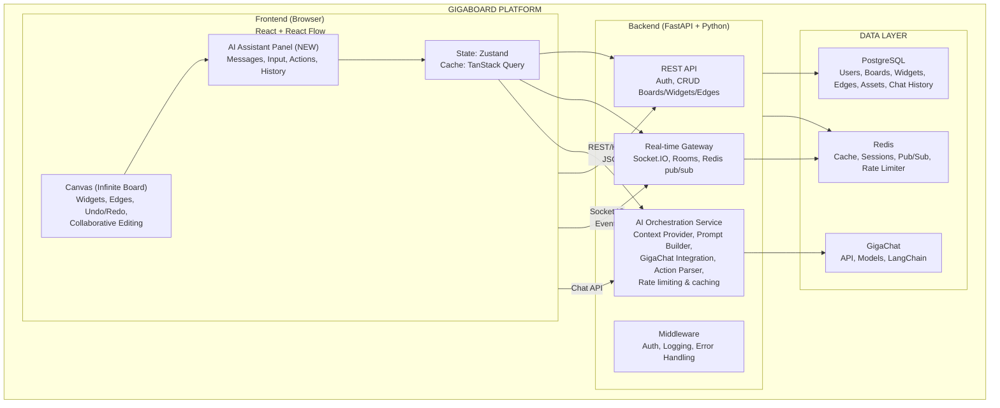
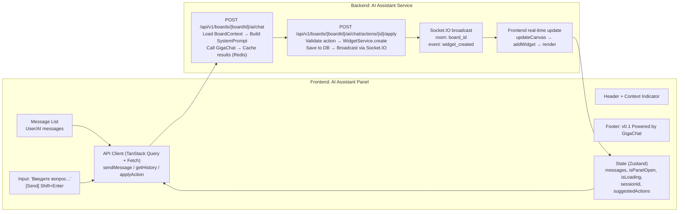
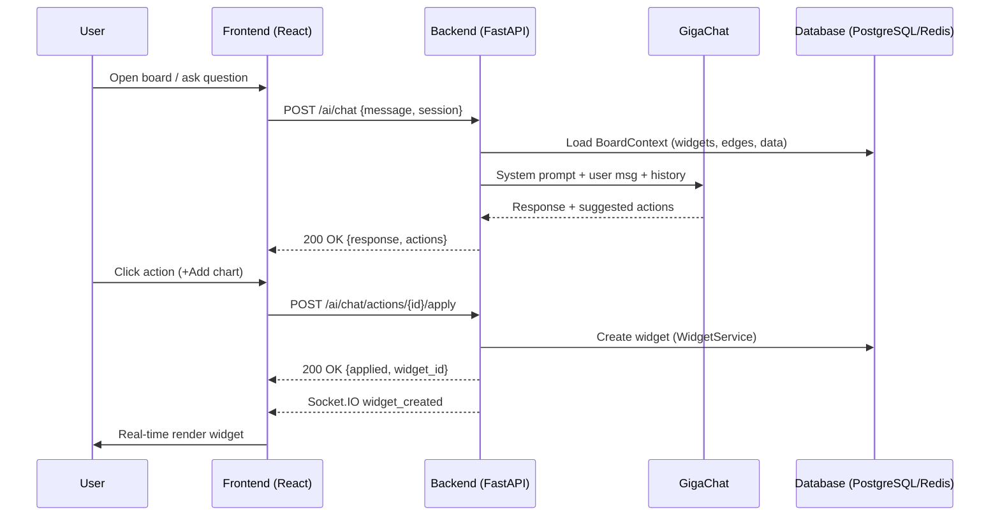
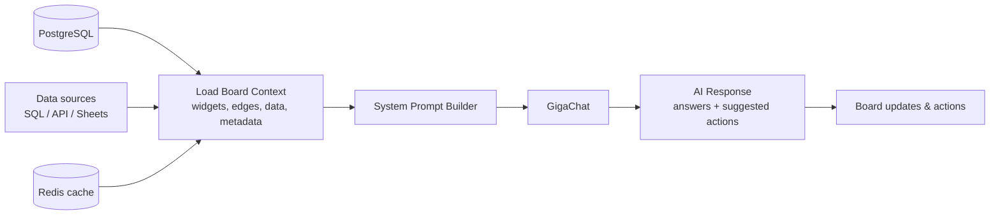
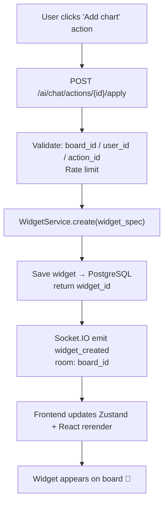
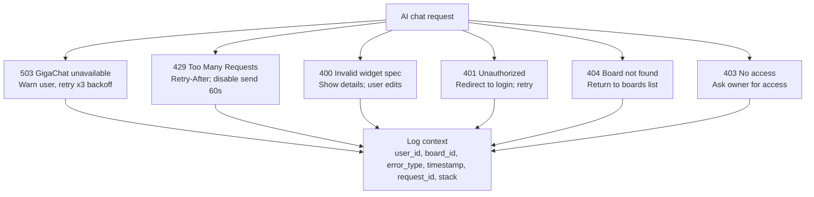

# GigaBoard with AI Assistant — System Diagrams

> **📌 Совет:** Диаграммы переведены в Mermaid — Markdown Preview Enhanced рендерит их прямо в превью, без доп. плагинов.

## 1. High-Level Architecture

---

## 2. AI Assistant Component Architecture

**Дополнительно:** rate limiting 10 msg/min (Redis counter), cache TTL 24h, session history TTL 4h.

---

## 3. Message Flow Sequence Diagram

---

## 4. Context Awareness Architecture

---

## 5. Data Flow for Widget Creation

---

## 6. Error Handling Flow

---

**Status**: Diagrams Complete ✅  
**Date**: 2026-01-23  
**Format**: Embedded Draw.io diagrams (editable inline)
