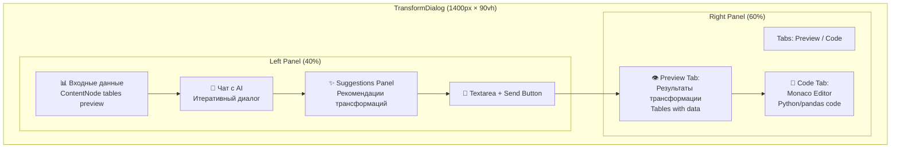
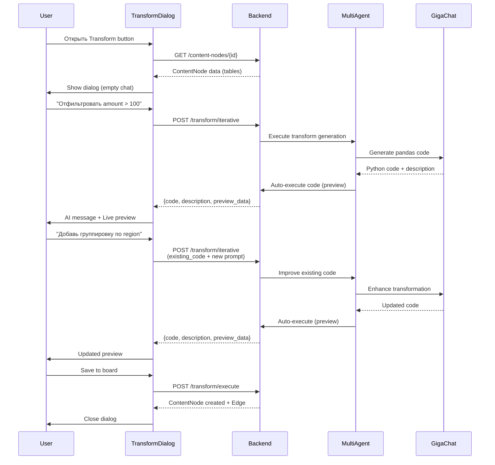

# Transform Dialog Chat System — AI-Powered Iterative Transformations

**Дата**: 02.2026  
**Статус**: ✅ Реализовано  
**Цель**: Переделать TransformDialog в полноценный AI-ассистент с итеративным чатом по аналогии с WidgetDialog

---

## 🎯 Executive Summary

**Transform Dialog Chat System** — интерактивный редактор data transformations с AI-ассистентом, позволяющий **итеративно** создавать и улучшать pandas/Python код через естественный диалог.

**Ключевые возможности**:
- ✅ **Итеративный чат** вместо 3-step wizard
- ✅ **Dual-panel layout** (40% chat + 60% preview/code) 
- ✅ **Live preview** результатов при каждом ответе AI
- ✅ **Suggestions Panel** — контекстные рекомендации трансформаций (5 категорий)
- ✅ **История чата** — сохранение и возобновление сессий с `crypto.randomUUID()` для уникальных ID
- ✅ **Manual code editing** в Monaco Editor с apply changes
- ✅ **Edit mode** — возобновление существующих трансформаций

**Workflow**:
```
ContentNode → Transform button → TransformDialog opens
→ Чат с AI: "Отфильтровать по amount > 100"
→ AI генерирует код → Live preview показывает результат
→ "Добавь группировку по region"
→ AI улучшает код → Preview обновляется
→ "Теперь pivot по месяцам"
→ AI дорабатывает → Сохранить трансформацию
```

---

## 📊 Архитектура

### Dual-Panel Layout



### Итеративный Chat Flow



### State Management

```typescript
interface TransformDialogState {
  // Chat state
  chatMessages: ChatMessage[]
  inputValue: string
  isGenerating: boolean
  
  // Transform state
  currentTransformation: {
    code: string
    description: string
    transformationId: string
    previewData?: PreviewData  // Quick preview without full execution
    error?: string  // Execution error message
  } | null
  
  // Manual editing
  editedCode: string | null  // User manual changes
  
  // UI state
  rightPanelTab: 'preview' | 'code'
  selectedSourceTableIndex: number  // For multi-table sources
  isSaving: boolean
}

interface ChatMessage {
  id: string  // crypto.randomUUID() — гарантированно уникальный
  role: 'user' | 'assistant'
  content: string
  timestamp: Date
}

interface PreviewData {
  tables: Array<{
    name: string
    columns: string[]
    rows: Array<Array<any>>
    row_count: number
    preview_row_count: number  // First N rows
  }>
  execution_time_ms: number
}
```

**Важно**: Для генерации `id` сообщений используется `crypto.randomUUID()` вместо `Date.now()` для гарантии уникальности при быстрых операциях.

---

## 🎨 UI Components

### 1. TransformDialog (главный компонент)

**Структура**:
```tsx
<Dialog open={open} onOpenChange={onOpenChange}>
  <DialogContent className="max-w-[1400px] h-[90vh]">
    <DialogHeader>
      <DialogTitle>
        <Code className="w-5 h-5" />
        AI-ассистент трансформаций
      </DialogTitle>
    </DialogHeader>
    
    <div className="flex flex-1 min-h-0">
      {/* Left Panel (40%) */}
      <div className="w-[40%] border-r flex flex-col">
        {/* 1. Source Data Preview */}
        <DataSourcePreview tables={sourceTables} />
        
        {/* 2. Chat Messages */}
        <ChatMessages 
          messages={chatMessages}
          isGenerating={isGenerating}
        />
        
        {/* 3. Suggestions Panel */}
        <TransformSuggestionsPanel
          contentNodeId={contentNode.id}
          chatHistory={chatMessages}
          currentCode={currentTransformation?.code}
          onSuggestionClick={handleSendMessage}
        />
        
        {/* 4. Chat Input */}
        <ChatInput
          value={inputValue}
          onChange={setInputValue}
          onSend={handleSendMessage}
          disabled={isGenerating}
        />
      </div>
      
      {/* Right Panel (60%) */}
      <div className="w-[60%] flex flex-col">
        {/* Tabs: Preview / Code */}
        <Tabs value={rightPanelTab} onValueChange={setRightPanelTab}>
          <TabsList>
            <TabsTrigger value="preview">
              <Eye /> Предпросмотр
            </TabsTrigger>
            <TabsTrigger value="code">
              <Code /> Код
            </TabsTrigger>
          </TabsList>
          
          {/* Preview Tab: Result Tables */}
          <TabsContent value="preview">
            {currentTransformation?.previewData ? (
              <ResultTablesPreview data={currentTransformation.previewData} />
            ) : (
              <EmptyState text="Результаты появятся здесь" />
            )}
          </TabsContent>
          
          {/* Code Tab: Monaco Editor */}
          <TabsContent value="code">
            <MonacoEditor
              language="python"
              value={editedCode || currentTransformation?.code}
              onChange={setEditedCode}
            />
            {editedCode && (
              <Button onClick={handleApplyCode}>
                Применить изменения
              </Button>
            )}
          </TabsContent>
        </Tabs>
      </div>
    </div>
    
    {/* Footer */}
    <DialogFooter>
      <Button variant="outline" onClick={onClose}>
        Отмена
      </Button>
      <Button 
        onClick={handleSaveToBoard}
        disabled={!currentTransformation || isSaving}
      >
        <Save /> Сохранить трансформацию
      </Button>
    </DialogFooter>
  </DialogContent>
</Dialog>
```

**Props**:
```typescript
interface TransformDialogProps {
  open: boolean
  onOpenChange: (open: boolean) => void
  sourceNode?: ContentNode
  sourceNodes?: ContentNode[]  // Multi-node support
  onTransform: (code: string, transformationId: string, description?: string) => Promise<void>
  // Edit mode — возобновление существующих трансформаций
  initialMessages?: ChatMessage[]  // Требует id, role, content, timestamp
  initialCode?: string
  initialTransformationId?: string
}
```

**Edit Mode**: При редактировании существующей трансформации, `ContentNodeCard` передаёт `initialMessages` с реконструированной историей чата. Каждое сообщение должно содержать уникальный `id` (генерируется через `crypto.randomUUID()`).

### 2. TransformSuggestionsPanel

**Назначение**: Анализирует входные данные и предлагает типичные трансформации

**Примеры рекомендаций**:
- "Фильтрация по значению колонки X"
- "Группировка + агрегация (sum, avg, count)"
- "Merge/Join с другой таблицей"
- "Pivot table (широкий → длинный формат)"
- "Добавить вычисляемую колонку"
- "Сортировка по колонке Y"
- "Удалить дубликаты"

**Структура**:
```tsx
interface TransformSuggestionsPanel {
  contentNodeId: string
  chatHistory: Array<{role: string, content: string}>
  currentCode?: string  // Existing transformation code
  onSuggestionClick: (prompt: string) => void
}
```

**UI**:
```tsx
<div className="p-2 border-t max-h-[120px] overflow-y-auto">
  <div className="text-xs font-medium mb-1.5">✨ Рекомендации</div>
  <div className="flex flex-wrap gap-1.5">
    {suggestions.map((sug) => (
      <Button
        key={sug.id}
        variant="outline"
        size="sm"
        className="h-7 text-xs"
        onClick={() => onSuggestionClick(sug.prompt)}
      >
        {sug.label}
      </Button>
    ))}
  </div>
  {isLoading && <Loader2 className="animate-spin" />}
</div>
```

---

## 🔧 Backend API

### 1. Iterative Transform Endpoint

**POST `/api/v1/content-nodes/{content_id}/transform/iterative`**

**Request**:
```python
class TransformIterativeRequest(BaseModel):
    user_prompt: str  # New instruction
    existing_code: str | None = None  # Current transformation code
    transformation_id: str | None = None  # Session ID
    chat_history: list[dict[str, str]] = []  # Full chat context
    selected_node_ids: list[str] = []  # Multi-node support
    preview_only: bool = True  # Don't create node, just preview
```

**Response**:
```python
class TransformIterativeResponse(BaseModel):
    transformation_id: str  # Session ID (for tracking)
    code: str  # Generated/improved Python code
    description: str  # AI explanation of changes
    preview_data: PreviewData | None  # Quick preview
    validation: ValidationResult
    agent_plan: AgentPlanInfo  # Multi-agent details
```

**Логика**:
1. Если `existing_code` — AI улучшает существующий код
2. Если `None` — AI генерирует новый код с нуля
3. Auto-execute код (sandbox) → preview_data
4. Валидация + безопасность
5. Возврат результата

### 2. Transform Suggestions Endpoint

**POST `/api/v1/content-nodes/{content_id}/analyze-transform-suggestions`**

**Request**:
```python
class TransformSuggestionsRequest(BaseModel):
    chat_history: list[dict[str, str]] = []
    current_code: str | None = None
```

**Response**:
```python
class TransformSuggestionsResponse(BaseModel):
    suggestions: list[TransformSuggestion]
    context: AnalysisContext

class TransformSuggestion(BaseModel):
    id: str
    label: str  # Short label (e.g., "Фильтрация")
    prompt: str  # Full prompt for AI (e.g., "Отфильтровать строки где...")
    category: str  # filter, aggregate, merge, reshape, compute
    confidence: float  # 0.0-1.0
```

**Логика**:
1. Анализ структуры данных ContentNode
2. Анализ текущего кода (если есть)
3. Анализ истории чата
4. GigaChat генерирует рекомендации
5. Возврат списка suggestions

---

## 🤖 Multi-Agent Integration

### TransformGeneratorAgent (улучшенный)

**Новые методы**:

```python
class TransformGeneratorAgent(BaseAgent):
    async def generate_iterative(
        self,
        content_node: ContentNode,
        user_prompt: str,
        existing_code: str | None = None,
        chat_history: list[dict] = None,
    ) -> TransformResult:
        """Generate or improve transformation code iteratively."""
        
        # 1. Build context
        context = await self._build_context(
            content_node=content_node,
            chat_history=chat_history or [],
            existing_code=existing_code
        )
        
        # 2. Determine mode
        if existing_code:
            mode = "improve"
            prompt = self._build_improvement_prompt(
                existing_code, user_prompt, context
            )
        else:
            mode = "create"
            prompt = self._build_creation_prompt(
                user_prompt, context
            )
        
        # 3. Generate code via GigaChat
        code_response = await self.llm_client.generate(prompt)
        code = self._extract_code(code_response)
        
        # 4. Validate + execute preview
        validation = await self._validate_code(code)
        if not validation.valid:
            raise ValueError(f"Invalid code: {validation.errors}")
        
        preview = await self._execute_preview(
            code=code,
            content_node=content_node
        )
        
        return TransformResult(
            code=code,
            description=self._extract_description(code_response),
            preview_data=preview,
            validation=validation
        )
```

**Промпты**:

<details>
<summary>📄 Промпт для создания новой трансформации</summary>

```python
def _build_creation_prompt(self, user_prompt: str, context: dict) -> str:
    return f"""
# Задача: Создать pandas трансформацию данных

## Входные данные:
{self._format_tables_info(context['tables'])}

## Запрос пользователя:
{user_prompt}

## Требования:
1. Используй pandas (уже импортирован как pd)
2. Входные DataFrames: {', '.join(f'df{i}' for i in range(len(context['tables'])))}
3. Результат сохрани в переменную `result` (DataFrame или dict из DataFrames)
4. Код должен быть безопасным (нет eval, exec, import)
5. Обработай edge cases (пустые данные, NaN)

## Формат ответа:
```python
# Краткое описание трансформации
<твой код здесь>
result = ...  # Final result
```

Сгенерируй код:
"""
```

</details>

<details>
<summary>📄 Промпт для улучшения существующей трансформации</summary>

```python
def _build_improvement_prompt(
    self, existing_code: str, user_prompt: str, context: dict
) -> str:
    return f"""
# Задача: Улучшить существующую pandas трансформацию

## Текущий код:
```python
{existing_code}
```

## Входные данные:
{self._format_tables_info(context['tables'])}

## Новый запрос пользователя:
{user_prompt}

## Требования:
1. Сохрани существующую логику, добавь новую
2. Оптимизируй код если возможно
3. Результат всё ещё должен быть в переменной `result`
4. Поддержи все требования безопасности

## Формат ответа:
```python
# Описание изменений
<улучшенный код>
result = ...
```

Улучши код:
"""
```

</details>

### TransformSuggestionsAgent (новый)

```python
class TransformSuggestionsAgent(BaseAgent):
    """Generates contextual transformation suggestions."""
    
    async def analyze_and_suggest(
        self,
        content_node: ContentNode,
        chat_history: list[dict] = None,
        current_code: str | None = None,
    ) -> list[TransformSuggestion]:
        """Analyze data and generate transformation suggestions."""
        
        # 1. Analyze data structure
        data_analysis = self._analyze_data_structure(content_node)
        
        # 2. Determine context (new vs improve)
        if current_code:
            mode = "improve"
            context = f"Existing transformation:\n{current_code}"
        else:
            mode = "create"
            context = "No transformation yet"
        
        # 3. Build prompt for GigaChat
        prompt = self._build_suggestions_prompt(
            data_analysis=data_analysis,
            chat_history=chat_history or [],
            context=context,
            mode=mode
        )
        
        # 4. Generate suggestions
        response = await self.llm_client.generate(prompt)
        suggestions = self._parse_suggestions(response)
        
        return suggestions
```

**Промпт для suggestions**:

```python
def _build_suggestions_prompt(
    self, data_analysis: dict, chat_history: list, context: str, mode: str
) -> str:
    if mode == "create":
        task = "Предложи 5-7 популярных трансформаций для этих данных"
    else:
        task = "Предложи 3-5 способов улучшить/расширить существующую трансформацию"
    
    return f"""
# Задача: {task}

## Входные данные:
- Таблицы: {len(data_analysis['tables'])}
- Колонки: {data_analysis['columns_summary']}
- Типы данных: {data_analysis['dtypes_summary']}
- Количество строк: {data_analysis['row_counts']}

## Контекст:
{context}

## История диалога:
{self._format_chat_history(chat_history)}

## Требования:
Верни JSON массив с рекомендациями:
[
  {{
    "label": "Краткое название (2-4 слова)",
    "prompt": "Полный промпт для AI",
    "category": "filter|aggregate|merge|reshape|compute",
    "confidence": 0.0-1.0
  }},
  ...
]

Категории:
- filter: фильтрация строк
- aggregate: группировка + агрегация
- merge: join/merge таблиц
- reshape: pivot, melt, transpose
- compute: вычисляемые колонки

Сгенерируй рекомендации:
"""
```

---

## 📋 Implementation Plan

### Phase 1: Frontend - Dual-Panel Layout (2 дня)

**Задачи**:
- [ ] Переделать TransformDialog.tsx на dual-panel (копировать структуру из WidgetDialog)
- [ ] Левая панель: DataSourcePreview + ChatMessages + ChatInput
- [ ] Правая панель: Tabs (Preview / Code) + Monaco Editor
- [ ] Убрать step-wizard (prompt/preview/result)
- [ ] State management для чата

**Файлы**:
- `apps/web/src/components/board/TransformDialog.tsx` (полная переделка)

### Phase 2: Frontend - TransformSuggestionsPanel (1 день)

**Задачи**:
- [ ] Создать `TransformSuggestionsPanel.tsx` (клон SuggestionsPanel)
- [ ] Интеграция в TransformDialog между чатом и input
- [ ] API client method: `analyzeSuggestions(contentId, chatHistory, code)`
- [ ] Обработка кликов по suggestions → auto-send prompt

**Файлы**:
- `apps/web/src/components/board/TransformSuggestionsPanel.tsx` (новый)
- `apps/web/src/services/api.ts` (добавить метод)

### Phase 3: Backend - Iterative Transform (2 дня)

**Задачи**:
- [ ] Endpoint: POST `/content-nodes/{id}/transform/iterative`
- [ ] Pydantic schemas: TransformIterativeRequest/Response
- [ ] Улучшить TransformGeneratorAgent: метод `generate_iterative()`
- [ ] Промпты для create vs improve режимов
- [ ] Auto-execute preview (безопасный sandbox)

**Файлы**:
- `apps/backend/app/routes/content_nodes.py` (новый endpoint)
- `apps/backend/app/schemas/transformations.py` (новые схемы)
- `apps/backend/app/agents/transform_generator_agent.py` (улучшения)

### Phase 4: Backend - TransformSuggestionsAgent (2 дня)

**Задачи**:
- [ ] Создать `TransformSuggestionsAgent` (наследник BaseAgent)
- [ ] Endpoint: POST `/content-nodes/{id}/analyze-transform-suggestions`
- [ ] Pydantic schemas: TransformSuggestionsRequest/Response
- [ ] Промпты для генерации рекомендаций
- [ ] Регистрация в MultiAgentEngine

**Файлы**:
- `apps/backend/app/agents/transform_suggestions_agent.py` (новый)
- `apps/backend/app/routes/content_nodes.py` (добавить endpoint)
- `apps/backend/app/schemas/transformations.py` (добавить схемы)
- `apps/backend/app/main.py` (регистрация агента)

### Phase 5: Integration & Testing (1 день)

**Задачи**:
- [ ] Полный workflow test: открыть → чат → suggestions → preview → save
- [ ] Edit mode: восстановление chat history
- [ ] Edge cases: пустые данные, ошибки кода, long prompts
- [ ] Performance: optimize preview execution

### Phase 6: Documentation (0.5 дня)

**Задачи**:
- [ ] Обновить TRANSFORM_DIALOG_CHAT_SYSTEM.md (этот документ)
- [ ] Обновить API.md (новые endpoints)
- [ ] Обновить MULTI_AGENT_SYSTEM.md (TransformSuggestionsAgent)

---

## 🎨 Примеры использования

### Сценарий 1: Создание новой трансформации

```
1. User: Открыть ContentNode → кнопка Transform
2. TransformDialog: Показывает входные таблицы + пустой чат
3. User: "Отфильтровать строки где amount > 100"
4. AI: Генерирует код → Preview показывает результат (215 строк)
5. User: "Добавь группировку по region, посчитай сумму revenue"
6. AI: Улучшает код → Preview обновляется (4 строки, grouped)
7. User: "Сортировка по убыванию total_revenue"
8. AI: Финальная доработка → Preview updated
9. User: Кликает "Сохранить трансформацию"
10. System: Создаёт ContentNode + TransformationEdge
```

### Сценарий 2: Улучшение через Suggestions

```
1. User: Открыть Transform dialog
2. TransformDialog: Показывает suggestions:
   - "Фильтрация по дате"
   - "Группировка + агрегация"
   - "Top-10 значений"
   - "Pivot table"
3. User: Кликает "Top-10 значений"
4. AI: Auto-generates код → Preview shows top 10 rows
5. User: "Теперь добавь визуализацию через bar chart"
6. AI: (понимает, что это не transform, а widget)
   "Для визуализации используйте Visualize → WidgetDialog"
```

### Сценарий 3: Редактирование существующей трансформации

```
1. User: Кликает Settings на TransformationEdge
2. TransformDialog: Открывается с восстановленным чатом:
   - User: "Отфильтровать amount > 100"
   - AI: "Создал фильтр..."
   - User: "Группировка по region"
   - AI: "Добавил группировку..."
3. User: "Теперь добавь колонку с процентом от общей суммы"
4. AI: Улучшает существующий код → Preview updated
5. User: Saves changes
6. System: Updates TransformationEdge code + metadata
```

---

## ✅ Acceptance Criteria

- [ ] TransformDialog использует dual-panel layout (40% + 60%)
- [ ] Итеративный чат работает: multi-turn conversation
- [ ] AI улучшает существующий код (не генерирует заново)
- [ ] Live preview показывает результаты после каждого AI-ответа
- [ ] TransformSuggestionsPanel показывает релевантные рекомендации
- [ ] Manual code editing в Monaco Editor работает
- [ ] История чата сохраняется в metadata
- [ ] Edit mode восстанавливает чат при повторном открытии
- [ ] Безопасность: sandbox execution, validation
- [ ] Performance: preview < 3 секунды

---

## 📚 Related Documents

- [WidgetDialog Implementation](WIDGET_VISUALIZATION_FRONTEND.md) — reference architecture
- [Widget Suggestions System](WIDGET_SUGGESTIONS_SYSTEM.md) — suggestions pattern
- [Multi-Agent System](MULTI_AGENT_SYSTEM.md) — agent integration
- [API Documentation](API.md) — endpoints reference

---

**Статус**: 🚧 В разработке  
**Next Steps**: Phase 1 — Переделка TransformDialog на dual-panel layout
