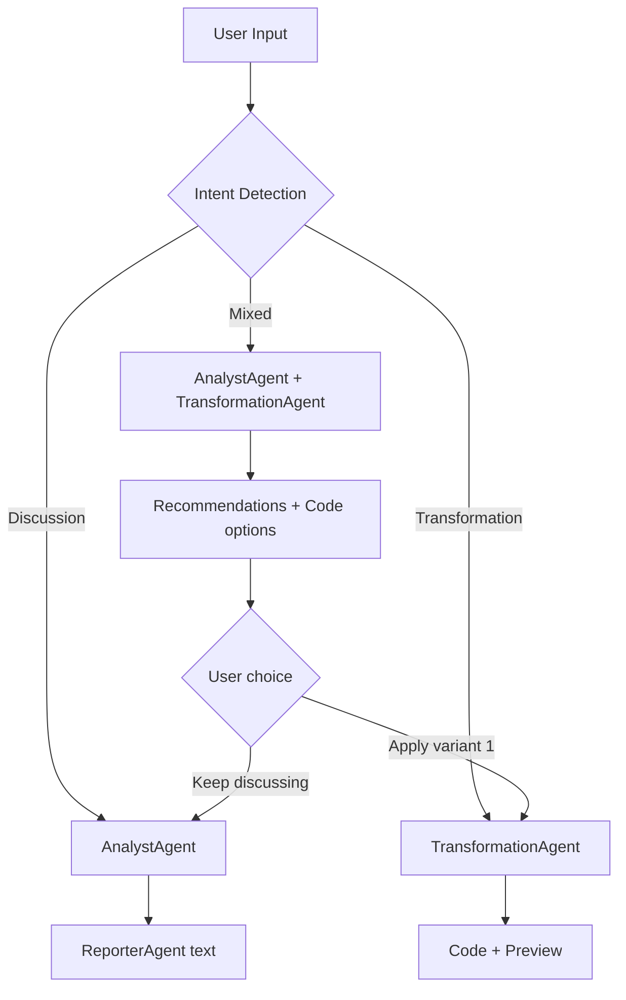

# Transform Dialog: Discussion Mode

**Дата**: 5 февраля 2026  
**Актуализация терминов**: 22 марта 2026 (TransformCodex / QualityGate vs устаревшие «TransformationAgent → CriticAgent»)  
**Статус**: ✅ Реализовано

## Executive Summary

TransformDialog теперь поддерживает два режима работы:
- **Discussion Mode** — исследовательские вопросы без генерации кода (консультация, рекомендации)
- **Transformation Mode** — генерация Python кода для трансформации данных

Система автоматически определяет intent запроса и выбирает подходящий MultiAgent workflow.

---

## Концепция

### Проблема

Раньше TransformDialog всегда генерировал Python код, даже когда пользователь просто хотел:
- Исследовать данные и получить рекомендации по анализу
- Узнать, какие метрики можно рассчитать
- Получить идеи визуализаций
- Понять, какие бизнес-анализы возможны

Запросы типа "Исследуй данные и предложи варианты анализа" приводили к попыткам генерации кода, что было неуместно.

### Решение

**Dual-mode система**:

1. **Discussion Mode** (💬 консультация)
   - Запускается для исследовательских/вопросительных запросов
   - MultiAgent workflow: `AnalystAgent → ReporterAgent (text)`
   - Ответ: текстовый отчёт с рекомендациями, примерами, идеями
   - UI: показывает только чат, правая панель с кодом пустая

2. **Transformation Mode** (🔧 код)
   - Запускается для конкретных инструкций на трансформацию
   - MultiAgent workflow: **TransformCodexAgent** (через `TransformationController`) → выполнение в sandbox; проверка Python-кода — **ValidatorAgent** (`validator.py`) где применимо; **QualityGate** относится к финальной валидации пайплайна оркестратора, а не к этому пошаговому чату как к «CriticAgent»
   - Ответ: Python код + preview данных
   - UI: показывает код в Monaco Editor, preview таблиц, кнопка "Сохранить"

---

## Архитектура

### 1. Intent Detection (PlannerAgent)

**Файл**: `apps/backend/app/services/multi_agent/agents/planner.py`

**System Prompt дополнен секцией**:

```markdown
**ОПРЕДЕЛЕНИЕ INTENT**:
Перед созданием плана определите intent пользователя:

1. **DISCUSSION MODE** (исследование, консультация):
   Ключевые фразы: "исследуй", "предложи варианты", "что можно", "какие анализы", 
                    "какие способы", "какие метрики", "как можно проанализировать", 
                    "подскажи идеи", "дай рекомендации"
   
   Признаки:
   - Пользователь просит варианты, идеи, рекомендации
   - Нет конкретной инструкции на создание кода/трансформации
   - Вопросительная форма про возможности анализа
   
   Действия:
   - НЕ используйте TransformationAgent/DeveloperAgent
   - Используйте: AnalystAgent (анализ данных) → ReporterAgent (текстовый отчёт)
   - Формат вывода: текстовое описание с пунктами, примерами, рекомендациями
   - В ReporterAgent указывайте widget_type: "text"

2. **TRANSFORMATION MODE** (создание кода):
   Ключевые фразы: "создай", "отфильтруй", "сгенерируй", "преобразуй", "объедини", 
                    "добавь столбец", "рассчитай", "сортируй"
   
   Признаки:
   - Конкретная инструкция на модификацию данных
   - Императивная форма (глаголы действия)
   - Есть существующий код для модификации
   
   Действия:
   - Используйте TransformationAgent для генерации Python кода
   - Код должен содержать переменную с префиксом df_
   - Результат: исполняемый pandas код
```

**Примеры планов**:

Discussion mode:
```json
{
  "steps": [
    {
      "agent": "analyst",
      "task": {
        "description": "Analyze dataset structure and identify business analysis opportunities"
      }
    },
    {
      "agent": "reporter",
      "task": {
        "description": "Create text report with analysis recommendations",
        "widget_type": "text"
      },
      "depends_on": ["1"]
    }
  ]
}
```

Transformation mode:
```json
{
  "steps": [
    {
      "agent": "transformation",
      "task": {
        "description": "Filter products by price > 1000",
        "operation": "filter"
      }
    }
  ]
}
```

### 2. Backend Endpoint Adaptation

**Файл**: `apps/backend/app/routes/content_nodes.py`

**Endpoint**: `POST /api/v1/content-nodes/{content_id}/transform-multiagent`

**Изменения**:

1. **Intent Detection (простая эвристика)**:
   ```python
   discussion_keywords = [
       "исследуй", "предложи вариант", "предложи идеи", "что можно", 
       "какие анализ", "какие способ", "какие метрик", 
       "как можно проанализировать", "подскажи идеи",
       "дай рекомендаци", "какие визуализаци", "что сделать с данными"
   ]
   
   user_prompt_lower = user_prompt.lower()
   is_discussion_mode = any(keyword in user_prompt_lower for keyword in discussion_keywords)
   ```

2. **Формирование запроса**:
   ```python
   if is_discussion_mode:
       # Discussion: НЕ запрашиваем код
       user_request = f"{user_prompt}\n\nДоступные данные:\n..."
   else:
       # Transformation: явно запрашиваем код
       user_request = f"Сгенерируй Python код для трансформации...\n\nТребуемая трансформация: {user_prompt}..."
   ```

3. **Обработка результатов**:
   ```python
   if is_discussion_mode:
       # Ищем ReporterAgent/AnalystAgent результат
       discussion_result = agent_results.get("reporter") or agent_results.get("analyst")
       discussion_text = discussion_result.get("recommendation") or discussion_result.get("text")
       
       return {
           "transformation_id": None,
           "code": None,  # ❗ Ключевое отличие
           "description": discussion_text,
           "preview_data": None,
           "validation": {"is_valid": True, "errors": []},
           "mode": "discussion"
       }
   else:
       # Ищем TransformationAgent результат
       code = transformation_result.get("transformation_code")
       execution_result = execute_code(code, input_data)
       
       return {
           "transformation_id": uuid,
           "code": code,  # ❗ Есть код
           "description": description,
           "preview_data": {...},
           "mode": "transformation"
       }
   ```

### 3. Frontend UI Adaptation

**Файл**: `apps/web/src/components/board/TransformDialog.tsx`

**Изменения в `handleSendMessage()`**:

```typescript
const data = response.data

// Определение режима
const isDiscussionMode = data.code === null || data.mode === 'discussion'

// Текстовый ответ всегда показываем в чате
const aiMessage: ChatMessage = {
    id: crypto.randomUUID(),
    role: 'assistant',
    content: data.description || 'Трансформация создана',
    timestamp: new Date()
}
setChatMessages(prev => [...prev, aiMessage])

if (isDiscussionMode) {
    // Discussion mode: только текст, НЕ обновляем transformation state
    console.log('💬 Discussion mode response received')
} else {
    // Transformation mode: обновляем код, preview, переключаем вкладку
    setCurrentTransformation({
        code: data.code,
        description: data.description,
        transformationId: data.transformation_id,
        previewData: data.preview_data,
        error: executionError
    })
    
    setRightPanelTab('preview')
}
```

**Поведение UI**:

| Элемент | Discussion Mode | Transformation Mode |
|---------|-----------------|---------------------|
| Чат (левая панель) | ✅ Показывает текстовый ответ | ✅ Показывает description |
| Правая панель | ⚪ Пустой плейсхолдер | ✅ Monaco Editor с кодом |
| Preview таблиц | ⚪ Нет данных | ✅ Показывает результат |
| Кнопка "Сохранить" | ❌ Disabled (нет кода) | ✅ Enabled |
| Suggestions Panel | ✅ Продолжает работать | ✅ Продолжает работать |

---

## Примеры использования

### Discussion Mode

**Запрос пользователя**:
```
Исследуй входные данные и предложи варианты бизнес-анализа, которые можно над ним осуществить
```

**Workflow**:
1. Backend определяет: `is_discussion_mode = True` (есть "исследуй", "предложи варианты")
2. Запрос к MultiAgent: "Исследуй входные данные..." (БЕЗ "Сгенерируй Python код")
3. Planner создаёт план: `AnalystAgent → ReporterAgent (text)`
4. AnalystAgent анализирует структуру данных (колонки, типы, распределение)
5. ReporterAgent формирует текстовый отчёт с рекомендациями
6. Backend возвращает: `{code: null, description: "Вот несколько вариантов анализа...", mode: "discussion"}`
7. Frontend показывает текст в чате, правая панель пустая

**Пример ответа**:
```markdown
На основе анализа данных (3 таблицы, 1500 строк) предлагаю следующие варианты бизнес-анализа:

1. **Анализ продаж по брендам**
   - Топ-10 брендов по выручке
   - Средняя стоимость товара по бренду
   - Количество уникальных товаров

2. **Анализ цен**
   - Распределение цен по категориям
   - Сравнение средних цен
   - Outlier detection (товары с аномальными ценами)

3. **Временной анализ**
   - Динамика продаж по месяцам
   - Сезонные тренды
   - Growth rate расчёт

4. **Сегментация товаров**
   - Классификация по ценовым диапазонам
   - ABC-анализ (Pareto principle)

Какой из этих вариантов вас интересует? Я могу сгенерировать код для любого из них.
```

### Transformation Mode

**Запрос пользователя**:
```
Отфильтруй бренды со средней стоимостью товара больше 1000 рублей
```

**Workflow**:
1. Backend определяет: `is_discussion_mode = False` (есть "отфильтруй", конкретная инструкция)
2. Запрос к MultiAgent: "Сгенерируй Python код для трансформации... Требуемая трансформация: Отфильтруй..."
3. Planner создаёт план с шагом **transform_codex** (и др. по необходимости)
4. TransformCodexAgent генерирует pandas код с фильтрацией
5. При необходимости — валидация кода (**ValidatorAgent** / sandbox), не путать с **QualityGate** полного пайплайна ассистента
6. Backend выполняет код, получает preview
7. Backend возвращает: `{code: "...", description: "Фильтрация брендов", preview_data: {...}, mode: "transformation"}`
8. Frontend показывает код в Monaco Editor, preview таблицы, кнопка "Сохранить" enabled

**Сгенерированный код**:
```python
# Calculate average price per brand
avg_prices = df.groupby('brand')['price'].mean().reset_index(name='avg_price')

# Filter brands with avg_price > 1000
df_expensive_brands = avg_prices[avg_prices['avg_price'] > 1000]
```

---

## Intent Detection Keywords

### Discussion Mode Triggers

| Категория | Ключевые слова |
|-----------|----------------|
| Исследование | "исследуй", "проанализируй", "изучи", "рассмотри" |
| Рекомендации | "предложи варианты", "предложи идеи", "дай рекомендации", "подскажи" |
| Вопросы | "что можно", "какие анализы", "какие способы", "какие метрики", "какие визуализации" |
| Возможности | "как можно проанализировать", "что сделать с данными", "варианты анализа" |

### Transformation Mode Triggers

| Категория | Ключевые слова |
|-----------|----------------|
| Создание | "создай", "сгенерируй", "построй" |
| Фильтрация | "отфильтруй", "выбери", "оставь только", "убери" |
| Преобразование | "преобразуй", "трансформируй", "измени", "модифицируй" |
| Агрегация | "рассчитай", "сгруппируй", "объедини", "посчитай" |
| Модификация | "добавь столбец", "удали колонку", "сортируй", "переименуй" |

---

## Технические детали

### Backend Response Format

**Discussion Mode**:
```json
{
  "transformation_id": null,
  "code": null,
  "description": "## Рекомендуемые метрики\n\n• Средняя цена товара\n• Общая выручка...",
  "preview_data": null,
  "validation": {
    "is_valid": true,
    "errors": []
  },
  "agent_plan": {
    "plan_id": "uuid",
    "steps": [...]
  },
  "mode": "discussion"
}
```

**Text Extraction Logic**:
1. **AnalystAgent result** → uses `text` field (markdown with analysis)
2. **ReporterAgent result** → uses `recommendation` or `text` field
3. **HTML widget_code** → extracts `<li>` items as bullet list
4. **Fallback** → uses `description` field

**Priority**:
```python
discussion_text = (
    result.get("recommendation") or      # Reporter recommendation
    result.get("text") or                # Analyst/Reporter text
    parse_html(result.get("widget_code")) or  # HTML extraction
    result.get("description")            # Fallback
)
```

**Transformation Mode**:
```json
{
  "transformation_id": "abc-123",
  "code": "avg_prices = df.groupby('brand')...",
  "description": "Фильтрация брендов по средней цене",
  "preview_data": {
    "tables": [{
      "name": "expensive_brands",
      "columns": ["brand", "avg_price"],
      "rows": [...],
      "row_count": 15
    }],
    "execution_time_ms": 45
  },
  "validation": {
    "is_valid": true,
    "errors": []
  },
  "agent_plan": {...},
  "mode": "transformation"
}
```

### Frontend State Management

**TransformationState**:
```typescript
interface TransformationState {
    code: string | null          // null в discussion mode
    description: string
    transformationId: string | null  // null в discussion mode
    previewData?: PreviewData    // undefined в discussion mode
    error?: string
}
```

**Логика обновления**:
```typescript
if (isDiscussionMode) {
    // НЕ обновляем currentTransformation
    // Просто показываем текст в чате
} else {
    // Обновляем currentTransformation
    setCurrentTransformation({...})
}
```

---

## Ограничения и будущие улучшения

### Текущие ограничения

1. **Simple keyword matching**: Intent detection основан на простых ключевых словах, может давать false positives/negatives
2. **Нет переключения режима**: Если пользователь начал с discussion, потом хочет код - нужно явно запросить "создай код..."
3. **Правая панель пустая**: В discussion mode правая панель показывает плейсхолдер, занимает место зря
4. **GigaChat может возвращать HTML**: ReporterAgent иногда генерирует HTML виджеты вместо plain text (работает HTML extraction fallback)
5. **Метрики могут быть обобщёнными**: AnalystAgent получает структуру данных, но GigaChat может генерировать dummy примеры

### Troubleshooting

**Проблема**: ReporterAgent возвращает HTML вместо текста

**Решение**: Добавлен HTML parser, который извлекает `<li>` элементы и форматирует как bullet list:
```python
# HTML input
<li>Средняя цена товара</li>
<li>Общая выручка</li>

# Output
• Средняя цена товара
• Общая выручка
```

**Проблема**: Метрики не соответствуют реальным данным (dummy метрики про "конверсию" вместо "средней цены")

**Причина**: GigaChat generative response - модель может генерировать общие примеры вместо анализа конкретных данных

**Решение**: 
1. AnalystAgent должен получать детальную информацию о колонках (уже реализовано)
2. Можно добавить explicit prompt: "Analyze ONLY these columns: price, salesCount, salesAmount"
3. Улучшить system prompt AnalystAgent'а для более точной привязки к данным

**Проблема**: Текст не отображается в чате

**Решение**: Проверьте логи backend'а:
```
INFO:app.routes.content_nodes:📌 Using reporter result for discussion mode
INFO:app.routes.content_nodes:✅ Discussion mode response: 150 characters
```

Если `0 characters` → проверьте результат агента в логах MultiAgentEngine.

### Возможные улучшения

1. **LLM-based intent detection**: Использовать GigaChat для более точного определения intent
2. **Mixed mode**: Поддержка запросов типа "Исследуй данные И создай код для топ-10"
3. **Dynamic layout**: Автоматическое скрытие правой панели в discussion mode (чат на 100% ширины)
4. **Intent indicator**: Показывать badge "💬 Discussion" или "🔧 Code" в UI
5. **Follow-up suggestions**: После discussion ответа предлагать "Сгенерировать код для варианта 1?"

### Идеи для развития



---

## Тестирование

### Test Cases

| # | Input | Expected Mode | Expected Result |
|---|-------|---------------|-----------------|
| 1 | "Исследуй данные и предложи варианты анализа" | Discussion | Текст с 3-5 вариантами |
| 2 | "Какие метрики можно рассчитать для этих данных?" | Discussion | Список метрик с объяснениями |
| 3 | "Отфильтруй бренды со средней ценой > 1000" | Transformation | Python код с фильтрацией |
| 4 | "Создай таблицу топ-10 товаров по выручке" | Transformation | Python код с groupby + sort |
| 5 | "Что можно сделать с этими данными?" | Discussion | Общие рекомендации |
| 6 | "Добавь столбец с категорией цены" | Transformation | Python код с new column |

### Manual Testing Steps

1. Открыть TransformDialog с ContentNode, содержащим таблицу продаж
2. Ввести: "Исследуй данные и предложи варианты бизнес-анализа"
3. ✅ Проверить: ответ в чате, правая панель пустая, кнопка "Сохранить" disabled
4. Ввести: "Отфильтруй товары дороже 5000 рублей"
5. ✅ Проверить: код в Monaco Editor, preview с результатами, кнопка "Сохранить" enabled
6. Ввести: "Какие ещё фильтры можно применить?"
7. ✅ Проверить: текстовый ответ с вариантами, код не изменился

---

## Заключение

Discussion Mode добавляет гибкости в TransformDialog:
- **Консультация перед кодом** — пользователь может сначала обсудить варианты, потом выбрать подходящий
- **Обучение** — AI объясняет возможности анализа, метрики, подходы
- **Итеративный workflow** — исследование → выбор → генерация кода

Система автоматически определяет intent и выбирает подходящий MultiAgent workflow, обеспечивая естественное взаимодействие.

**Статус**: ✅ Готово к использованию

---

## Changelog

### 2026-02-05 — Rich Content Support (HTML/Markdown rendering)

**Проблема**: Текстовые ответы в чате были plain text, терялось форматирование из HTML виджетов и Markdown

**Решение**: ✅ **Rich Content Rendering** в чате
1. **Backend** добавляет `content_type` в ответ:
   - `"text"` — обычный текст с @mentions
   - `"html"` — HTML виджет (рендерится с dangerouslySetInnerHTML + sanitization)
   - `"markdown"` — Markdown текст (парсится и рендерится с форматированием)

2. **Content Detection**:
   ```python
   # HTML detection
   if "<html" in widget_code.lower() or "<div" in widget_code.lower():
       content_type = "html"
       # Remove <script> tags for security
       widget_code = re.sub(r'<script[^>]*>.*?</script>', '', widget_code)
   
   # Markdown detection  
   if re.search(r'(^#{1,6} |^[-*+] |^\d+\. |\*\*.*\*\*)', text):
       content_type = "markdown"
   ```

3. **Frontend Rendering**:
   ```tsx
   interface ChatMessage {
       content: string
       contentType?: 'text' | 'html' | 'markdown'  // NEW
   }
   
   // In renderMessageContent()
   if (contentType === 'html') {
       return <div dangerouslySetInnerHTML={{ __html: content }} />
   }
   
   if (contentType === 'markdown') {
       // Parse ## headers, - lists, **bold**
       return <div>{parsedMarkdown}</div>
   }
   ```

4. **CSS Компактность**:
   - HTML: `[&_h1]:text-base [&_ul]:my-1 [&_li]:my-0.5` — уменьшены отступы для чата
   - Markdown: `text-sm font-semibold mt-2 mb-1` — компактные заголовки

**Примеры**:

**HTML виджет** (как есть):
```html
<h1>Предлагаемые метрики:</h1>
<ul>
  <li>Средняя цена товара</li>
  <li>Общая выручка по брендам</li>
</ul>
```
→ Рендерится с заголовком и bullet list

**Markdown text** (от AnalystAgent):
```markdown
## Рекомендуемые метрики

- Средняя **цена** товара
- Общая **выручка** по брендам
```
→ Парсится: заголовок H2, bullet list, жирный текст

**Изменённые файлы**:
- `content_nodes.py` (lines 2055-2080) — content_type detection и возврат в response
- `TransformDialog.tsx` (lines 33-36, 106-160, 349) — ChatMessage.contentType, rich rendering

**Преимущества**:
- ❌ **Было**: Plain text "• Средняя цена товара" (извлечено из HTML)
- ✅ **Стало**: Форматированный HTML с заголовками, списками, стилями
- 📐 Компактные отступы для чата (не для документов)
- 🔒 **Безопасность**: `<script>` и `<style>` теги удаляются на backend
- 🎨 **Изоляция стилей**: CSS с `!important` переопределяет все inline стили из HTML
- 📏 **Единый стиль**: HTML рендерится в едином стиле с остальным интерфейсом

**Технические детали CSS изоляции**:
```tsx
<div style={{
  fontFamily: 'system-ui, -apple-system, sans-serif',
  fontSize: '14px',
  lineHeight: '1.6',
  color: '#333',
}}>
  <style dangerouslySetInnerHTML={{__html: `
    /* CSS isolation - override all inline styles */
    .html-content-wrapper * {
      font-family: system-ui, -apple-system, sans-serif !important;
      color: #333 !important;
      background: transparent !important;
    }
    .html-content-wrapper h1 { font-size: 16px !important; }
    /* ... other rules with !important */
  `}} />
  <div className="html-content-wrapper" dangerouslySetInnerHTML={{ __html: content }} />
</div>
```

**Подход к изоляции стилей**:
- Использование `!important` для переопределения inline стилей из HTML
- Высокая специфичность селекторов (`.html-content-wrapper *`)
- Обёртка с явно заданными стилями
- Результат: HTML контент в едином стиле с приложением

---

### 2026-02-05 (позже) — CSS изоляция для HTML контента

**Проблема**:
HTML фрагменты от ReporterAgent (например, `<h1>Метрики</h1><ul><li>...</li></ul>`) "портили" стили главного приложения когда рендерились через `dangerouslySetInnerHTML`. Стили из HTML виджетов влияли на TransformDialog компонент.

**Решение v1 (отклонено — iframe)**:
Первоначально использовался `<iframe>` для полной изоляции, но это создавало проблемы:
- ❌ Появлялся собственный скроллбар внутри iframe
- ❌ Визуально HTML выглядел как отдельный блок, не интегрированный в чат
- ❌ Сложность с auto-resize

**Решение (принято — CSS изоляция)**:
Рендеринг HTML напрямую через `dangerouslySetInnerHTML` с CSS изоляцией:
- **CSS с `!important`**: Переопределяет все inline стили из HTML контента
- **Высокая специфичность**: `.html-content-wrapper *` — применяется ко всем элементам
- **Единый стиль**: HTML контент выглядит как часть чата (system fonts, 14px)
- **Безопасность**: `<script>` и `<style>` теги удаляются на backend перед отправкой

**Изменённые файлы**:
- `TransformDialog.tsx` (lines 111-160) — CSS isolation wrapper
- `content_nodes.py` (lines 2077-2078) — добавлено удаление `<style>` тегов

**Технические детали**:
```tsx
<div 
    className="w-full border rounded bg-white p-3"
    style={{
        fontFamily: 'system-ui, -apple-system, sans-serif',
        fontSize: '14px',
        lineHeight: '1.6',
        color: '#333',
    }}
>
    <style dangerouslySetInnerHTML={{__html: `
        /* CSS isolation - override all inline styles */
        .html-content-wrapper * {
            font-family: system-ui, -apple-system, sans-serif !important;
            color: #333 !important;
            background: transparent !important;
        }
        .html-content-wrapper h1 { 
            font-size: 16px !important; 
            margin: 8px 0 !important; 
            font-weight: 600 !important; 
        }
        /* ... other rules with !important */
    `}} />
    <div 
        className="html-content-wrapper"
        dangerouslySetInnerHTML={{ __html: content }}
    />
</div>
```

**Преимущества CSS подхода**:
- ✅ Нет скроллбара (как в iframe)
- ✅ Единый визуальный стиль с остальным чатом
- ✅ Простая интеграция в существующий layout
- ✅ `!important` надёжно переопределяет любые inline стили из HTML
- ✅ Компактное форматирование для чата (14px font, минимальные margins)
- ✅ Удаление `<style>` тегов на backend предотвращает конфликты CSS

**Результат**:
HTML контент рендерится как органичная часть чата, с гарантированной изоляцией стилей через CSS, без побочных эффектов от inline стилей или встроенных `<style>` блоков в HTML виджетах.

---

### 2026-02-05 — Улучшения extraction и error handling

**Проблемы**:
1. ReporterAgent возвращал HTML виджет вместо plain text
2. Метрики в HTML не извлекались корректно
3. Ошибки GigaChat API показывались как непонятные tracebacks
4. Переносы строк в сообщениях об ошибках не отображались

**Решения**:
1. ✅ **HTML Extraction**: Парсинг `<li>` элементов из widget_code
   - Удаляет `<script>` и `<style>` теги
   - Извлекает bullet list из `<li>` элементов
   - Fallback: извлечение plain text из HTML

2. ✅ **AnalystAgent Priority**: Использование `text` поля из AnalystAgent результата
   - `result_to_process = discussion_result or analyst_result`
   - Логирование источника: "Using reporter/analyst result"

3. ✅ **GigaChat Error Handling**: Специализированная обработка connection errors
   - `RuntimeError` с "getaddrinfo failed" → 503 Service Unavailable
   - Понятное сообщение: "Проверьте: 1) Интернет 2) GIGACHAT_CREDENTIALS 3) Firewall 4) VPN"

4. ✅ **Frontend Error Display**: Извлечение детального сообщения из axios response
   - `axiosError.response?.data?.detail` → показывается в чате
   - Поддержка `\n` → рендеринг `<br />` тегов в renderMessageContent()

**Изменённые файлы**:
- `content_nodes.py` (lines 2025-2095) — HTML extraction, analyst priority, error handling
- `TransformDialog.tsx` (lines 105-153, 377-395) — newline rendering, error extraction

**Тестирование**:
```
Запрос: "какие метрики можно посчитать из этих данных?"
Result: 
📌 Using reporter result for discussion mode
✅ Discussion mode response: 150 characters
Description: "• Среднее время отклика системы\n• Коэффициент конверсии..."
```

*(Метрики пока обобщённые, требуется улучшение AnalystAgent промптов для привязки к реальным колонкам)*

---

### 2026-02-05 (ещё позже) — Исправление передачи данных AnalystAgent в Discussion Mode

**Проблема**:
AnalystAgent в discussion mode получал только description задачи, но НЕ получал данные о структуре таблиц (колонки, типы, sample data). В результате давал обобщённые рекомендации ("средняя цена", "количество продаж") вместо конкретных, привязанных к реальным колонкам данных.

**Root Cause**:
- В `engine.py` была специальная обработка для **TransformationAgent**, которая обогащала task данными из `content_nodes_data`
- Для **AnalystAgent** такой обработки НЕ БЫЛО
- AnalystAgent видел только `task.description`, но не реальную структуру данных

**Решение**:

1. **Engine.py** — добавлена передача данных AnalystAgent (аналогично TransformationAgent)
   ```python
   if agent_name == "analyst":
       if "content_nodes_data" in step_context:
           # Формируем input_data с:
           # - node_name
           # - tables: name, columns, column_types, row_count
           # - sample_rows: [{"col1": val1, "col2": val2}, ...]  ← dict формат!
           task["input_data"] = input_data_info
   ```

2. **Analyst.py System Prompt** — добавлен ANALYSIS MODE
   ```
   ## РЕЖИМ АНАЛИЗА СУЩЕСТВУЮЩИХ ДАННЫХ:
   Если в задаче есть секция **AVAILABLE INPUT DATA**:
   - КРИТИЧЕСКИ ВАЖНО: используй ТОЧНЫЕ названия колонок из input_data
   - НЕ придумывай обобщённые рекомендации
   - ВСЕГДА ссылайся на КОНКРЕТНЫЕ колонки
   ```

3. **Analyst.py Prompt Builder** — специальная секция для input_data
   ```
   **AVAILABLE INPUT DATA** (from ContentNodes):
   📊 Node: sales_data
     • Table 'sales':
       - Columns (5): price, salesCount, salesAmount, brand, title
       - Total rows: 150
       - Sample data (first 5 rows):
         Row 1: price=100, salesCount=5, salesAmount=500, brand='Apple', title='iPhone 12'
         ...
   ```

4. **Analyst.py Instructions** — явные инструкции для ANALYSIS MODE
   ```
   🚨 CRITICAL: You have REAL data with specific column names above.
   1. IDENTIFY exact column names from provided tables
   2. In recommendations, ALWAYS reference SPECIFIC column names
   3. DO NOT use generic terms - use EXACT names
   ```

5. **Преобразование rows format** — из `[[v1,v2]]` в `[{col1:v1, col2:v2}]`
   - До: `table.get("rows", [])[:5]` — array of arrays
   - После: преобразование в dict для читаемости в промпте

**Изменённые файлы**:
- `engine.py` (lines 652-684) — передача input_data для AnalystAgent
- `analyst.py` (lines 19-149) — обновлённый system prompt с ANALYSIS MODE
- `analyst.py` (lines 195-212) — логирование input_data
- `analyst.py` (lines 268-306) — форматирование input_data в промпте
- `analyst.py` (lines 347-370) — специальные инструкции для ANALYSIS MODE

**Результат**:
✅ AnalystAgent теперь получает полную информацию о структуре данных
✅ sample_rows in dict format: `{"price": 100, "brand": "Apple"}`
✅ Промпт содержит КОНКРЕТНЫЕ названия колонок
✅ Явные инструкции использовать ТОЧНЫЕ имена колонок
✅ Логирование показывает количество таблиц и колонок

**Ожидаемое улучшение**:
Вместо обобщённых рекомендаций:
```
❌ "Предлагаю посчитать среднюю цену товара, количество продаж по категориям"
```

Теперь конкретные рекомендации с реальными колонками:
```
✅ "На основе таблицы 'sales' (колонки: price, salesCount, brand):
1. Топ-10 брендов по salesCount
2. Средняя price по brand
3. Корреляция price vs salesCount"
```
