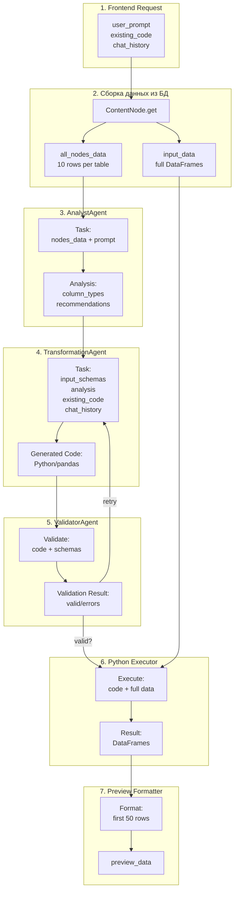

# Transform Multi-Agent: Поток данных для генерации Python кода

**Дата**: 02.2026  
**Цель**: Документировать структуру данных, передаваемых в Multi-Agent систему для генерации трансформаций

---

## 🔄 Полный поток данных

### 1. Frontend → Backend (`/transform/iterative`)

**HTTP Request**:
```typescript
POST /api/v1/content-nodes/{content_id}/transform/iterative
{
  user_prompt: string           // "Отфильтровать amount > 100"
  existing_code?: string        // Python код (для режима улучшения)
  transformation_id?: string    // UUID сессии
  chat_history: Array<{         // История диалога
    role: 'user' | 'assistant'
    content: string
  }>
  selected_node_ids: string[]   // [UUID, UUID, ...] — multi-node
  preview_only: boolean         // true = не создавать ноду
}
```

---

## 2. Backend: Сборка данных из ContentNodes

**Код**: `apps/backend/app/routes/content_nodes.py:400-440`

### Шаг 2.1: Извлечение данных из БД

Для каждого `selected_node_ids`:

```python
node = await ContentNodeService.get_content_node(db, node_id)
```

### Шаг 2.2: Формирование `all_nodes_data`

**Структура для AI-контекста** (ограниченные данные):

```python
node_data = {
    "node_id": str(node.id),                     # UUID ноды
    "node_name": str,                            # "Sales Data" или "Node abc123..."
    "text": str,                                 # Текст из content
    "tables": [
        {
            "name": str,                         # "df", "sales", "users"
            "columns": list[str],                # ["id", "name", "amount", "date"]
            "column_types": dict[str, str],      # {"id": "int64", "amount": "float64"}
            "rows": list[list],                  # Первые 10 строк ТОЛЬКО
            "row_count": int                     # Полное количество строк (1000)
        },
        # ... другие таблицы
    ]
}

all_nodes_data = [node_data, node_data, ...]  # От всех выбранных ContentNodes
```

**❗ Важно**: 
- Для AI промпта передаются **только первые 10 строк** (`rows[:10]`)
- Полный `row_count` сохраняется для контекста
- Это экономит токены и ускоряет генерацию

### Шаг 2.3: Формирование `input_data` для выполнения

**Полные данные для Python executor**:

```python
input_data = {}  # dict[table_name, pd.DataFrame]

for table in node.content["tables"]:
    df = python_executor.table_dict_to_dataframe(table)  # Все строки
    input_data[table["name"]] = df  # {"sales": DataFrame(1000 rows), ...}
```

**❗ Важно**: 
- `input_data` содержит **полные** DataFrame (все строки)
- Используется для реального выполнения кода
- Не передаётся в AI-агентов

---

## 3. Backend: Вызов Multi-Agent системы

**Код**: `apps/backend/app/routes/content_nodes.py:471-477`

```python
result = await multi_agent.generate_transformation_code(
    nodes_data=all_nodes_data,        # Список node_data (10 строк каждая таблица)
    user_prompt=user_prompt,          # "Отфильтровать amount > 100"
    existing_code=existing_code,      # Python код или None
    chat_history=chat_history         # [{role, content}, ...]
)
```

---

## 4. Multi-Agent: Шаг 1 — AnalystAgent

**Код**: `transformation_multi_agent.py:240-257`

### 4.1. Входные данные для AnalystAgent

```python
task = {
    "type": "analyze_datanode_content",
    "nodes_data": all_nodes_data,     # Полная структура (см. раздел 2.2)
    "prompt": user_prompt             # Запрос пользователя
}

analysis = await analyst.process_task(task)
```

### 4.2. Выход AnalystAgent

```python
analysis = {
    "column_types": {                 # Типы данных колонок
        "id": "integer",
        "amount": "numeric",
        "date": "datetime",
        "category": "categorical"
    },
    "suitable_operations": [          # Рекомендованные операции
        "filter",
        "aggregate",
        "group_by"
    ],
    "recommendations": str,           # Текстовые рекомендации от AI
    "data_summary": {                 # Статистика
        "total_rows": 1000,
        "total_columns": 4,
        "numeric_columns": 2
    }
}
```

**Fallback** (если Redis/GigaChat недоступен):
```python
def _simple_data_analysis(nodes_data):
    # Упрощённый анализ без AI
    # Определяет типы по первой строке
    # Возвращает базовые рекомендации
```

---

## 5. Multi-Agent: Шаг 2 — TransformationAgent (Coder)

**Код**: `transformation_multi_agent.py:300-337`

### 5.1. Подготовка `input_schemas`

**Метод**: `_extract_input_schemas_from_nodes()`

```python
input_schemas = [
    {
        "name": "sales",                  # Имя таблицы
        "columns": ["id", "amount", ...], # Все колонки
        "column_types": {                 # Типы данных
            "id": "int64",
            "amount": "float64"
        },
        "sample_data": [                  # Первые 5 строк для dry-run
            [1, 150.5, "2026-01-01"],
            [2, 200.0, "2026-01-02"],
            ...
        ],
        "node_id": "uuid-123",
        "node_name": "Sales Data"
    },
    # ... другие таблицы
]
```

### 5.2. Формирование task для TransformationAgent

```python
task = {
    "type": "generate_transformation",
    "description": user_prompt,           # "Отфильтровать amount > 100"
    "input_schemas": input_schemas,       # См. 5.1
    "analysis": analysis,                 # Результат от AnalystAgent (см. 4.2)
    "previous_errors": [],                # Ошибки валидации (для retry)
    "existing_code": existing_code,       # ✅ Python код (для iterative mode)
    "chat_history": chat_history          # ✅ История диалога (для контекста)
}

result = await coder.process_task(task)
```

**ВАЖНО**: TransformationAgent **ИСПОЛЬЗУЕТ** эти параметры:

- **existing_code** → включается в промпт как "CURRENT CODE" для модификации
- **chat_history** → последние 5 сообщений добавляются как "CONVERSATION HISTORY"
- Если `existing_code` присутствует → режим **ITERATIVE IMPROVEMENT** (модификация кода)
- Если `existing_code` отсутствует → режим **NEW GENERATION** (создание с нуля)

*См. детали в [history/TRANSFORM_ITERATIVE_IMPROVEMENTS_FIX.md](history/TRANSFORM_ITERATIVE_IMPROVEMENTS_FIX.md)*
```

### 5.3. Выход TransformationAgent

```python
result = {
    "transformation_code": str,           # Сгенерированный Python код
    "code": str,                          # Альтернативное поле
    "description": str,                   # "Фильтрация строк по условию amount > 100"
    "method": "gigachat"                  # Метод генерации
}
```

**Пример сгенерированного кода**:
```python
# Фильтрация строк по условию amount > 100
import pandas as pd

# Входные данные
df0 = input_data["sales"]  # 1000 rows

# Фильтрация
df_result = df0[df0["amount"] > 100].copy()

# Результат: 670 rows
```

---

## 6. Multi-Agent: Шаг 3 — ValidatorAgent

**Код**: `transformation_multi_agent.py:145-156`

### 6.1. Входные данные для ValidatorAgent

```python
validation = await validator.validate_code(
    code=result["code"],                  # Python код
    input_schemas=input_schemas,          # См. 5.1
    dry_run=True                          # Sandbox режим
)
```

### 6.2. Выход ValidatorAgent

```python
validation = {
    "valid": True,                        # Код валидный
    "errors": [],                         # Список ошибок (если есть)
    "warnings": [                         # Предупреждения
        {
            "message": "Large dataset may be slow",
            "severity": "low"
        }
    ],
    "suggestions": [                      # Рекомендации по оптимизации
        "Consider using .query() for complex filters"
    ]
}
```

**Если валидация не прошла** (validation.valid = False):
- Multi-Agent перезапускает генерацию (retry)
- Передаёт `previous_errors` в task для TransformationAgent
- Применяет адаптивные стратегии (simplify, basic_mode)

---

## 7. Backend: Выполнение кода для preview

**Код**: `apps/backend/app/routes/content_nodes.py:482-500`

```python
execution_result = await python_executor.execute_transformation(
    code=result["code"],                  # Сгенерированный Python код
    input_data=input_data,                # ПОЛНЫЕ DataFrame (см. 2.3)
    user_id=str(current_user.id),
    auth_token=auth_token                 # Для gb.get_table() helpers
)
```

**Результат выполнения**:
```python
execution_result = {
    "success": True,
    "result_dfs": {                       # Результирующие DataFrames
        "df_result": pd.DataFrame(...)    # 670 rows
    },
    "error": None,
    "execution_time_ms": 234
}
```

---

## 8. Backend: Формирование preview_data

**Код**: `apps/backend/app/routes/content_nodes.py:505-518`

```python
preview_tables = []
for var_name, df in execution_result.result_dfs.items():
    row_count = len(df)                   # Полное количество (670)
    preview_df = df.head(50)              # Первые 50 строк для preview
    
    table_dict = python_executor.dataframe_to_table_dict(
        df=preview_df,
        table_name=var_name
    )
    table_dict["row_count"] = row_count
    table_dict["preview_row_count"] = len(preview_df)
    
    preview_tables.append(table_dict)
```

**Структура `table_dict`**:
```python
{
    "name": "df_result",
    "columns": ["id", "amount", "date"],
    "rows": [                             # Первые 50 строк
        [1, 150.5, "2026-01-01"],
        ...
    ],
    "row_count": 670,                     # Полный размер результата
    "preview_row_count": 50               # Сколько строк в preview
}
```

---

## 9. Backend → Frontend: Response

```typescript
{
  transformation_id: string,              // UUID сессии
  code: string,                           // Python код
  description: string,                    // Описание от AI
  preview_data: {
    tables: [                             // Результаты выполнения
      {
        name: string,
        columns: string[],
        rows: any[][],                    // Первые 50 строк
        row_count: number,                // Полный размер (670)
        preview_row_count: number         // 50
      }
    ],
    execution_time_ms: number             // 234ms
  },
  validation: {
    valid: boolean,
    errors: string[],
    warnings: any[],
    suggestions: string[]
  },
  agent_plan: {
    steps: string[],                      // ["analyze", "generate", "validate"]
    attempts: number,                     // 1
    total_time_ms: number                 // 1500ms
  }
}
```

---

## 📊 Визуализация потока данных



---

## 🔑 Ключевые моменты

### Ограничение данных для AI
- **Для AI промптов**: только первые **10 строк** каждой таблицы
- **Для выполнения**: **все строки** (полные DataFrame)
- **Для preview**: первые **50 строк** результата

### Iterative Mode (улучшение кода)
Если передан `existing_code`:
1. TransformationAgent получает `existing_code` в task
2. GigaChat анализирует существующий код
3. Генерирует **улучшенную версию** (не с нуля)
4. Сохраняет контекст из `chat_history`

### Retry механизм
При ошибках валидации:
1. `previous_errors` передаются в следующую попытку
2. Применяются стратегии: original → simplified → basic
3. Промпт упрощается методом `_simplify_prompt()`

### Multi-node support
- `selected_node_ids` может содержать несколько UUID
- `all_nodes_data` — массив данных от всех нод
- Таблицы автоматически именуются: `df0`, `df1`, `df2`...

---

## 📝 Примеры данных

### Пример 1: Создание новой трансформации

**Frontend Request**:
```json
{
  "user_prompt": "Отфильтровать amount > 100 и сгруппировать по category",
  "existing_code": null,
  "chat_history": [],
  "selected_node_ids": ["uuid-abc123"],
  "preview_only": true
}
```

**nodes_data** (для AI):
```python
[
  {
    "node_id": "uuid-abc123",
    "node_name": "Sales Data",
    "text": "",
    "tables": [
      {
        "name": "sales",
        "columns": ["id", "amount", "category", "date"],
        "column_types": {"id": "int64", "amount": "float64"},
        "rows": [                    # Первые 10 строк
          [1, 150.5, "Electronics", "2026-01-01"],
          [2, 85.0, "Books", "2026-01-02"],
          [3, 220.0, "Electronics", "2026-01-03"],
          ...10 rows total...
        ],
        "row_count": 1000
      }
    ]
  }
]
```

**Task для TransformationAgent**:
```python
{
  "type": "generate_transformation",
  "description": "Отфильтровать amount > 100 и сгруппировать по category",
  "input_schemas": [
    {
      "name": "sales",
      "columns": ["id", "amount", "category", "date"],
      "column_types": {"id": "int64", "amount": "float64"},
      "sample_data": [
        [1, 150.5, "Electronics", "2026-01-01"],
        [2, 85.0, "Books", "2026-01-02"],
        ...5 rows for dry-run...
      ]
    }
  ],
  "analysis": {
    "column_types": {"amount": "numeric", "category": "categorical"},
    "suitable_operations": ["filter", "group_by", "aggregate"]
  },
  "previous_errors": [],
  "existing_code": null,
  "chat_history": []
}
```

**Generated Code**:
```python
# Фильтрация и группировка
import pandas as pd

df0 = input_data["sales"]

# Фильтрация
filtered = df0[df0["amount"] > 100].copy()

# Группировка
df_result = filtered.groupby("category").agg({
    "amount": ["sum", "mean", "count"]
}).reset_index()
```

### Пример 2: Улучшение существующего кода

**Frontend Request**:
```json
{
  "user_prompt": "Добавить сортировку по убыванию суммы",
  "existing_code": "df_result = df0[df0['amount'] > 100].groupby('category')['amount'].sum()",
  "chat_history": [
    {"role": "user", "content": "Отфильтровать и сгруппировать"},
    {"role": "assistant", "content": "Создал фильтрацию и группировку"}
  ],
  "selected_node_ids": ["uuid-abc123"],
  "preview_only": true
}
```

**Task для TransformationAgent**:
```python
{
  "type": "generate_transformation",
  "description": "Добавить сортировку по убыванию суммы",
  "input_schemas": [...],
  "analysis": {...},
  "previous_errors": [],
  "existing_code": "df_result = df0[df0['amount'] > 100].groupby('category')['amount'].sum()",
  "chat_history": [
    {"role": "user", "content": "Отфильтровать и сгруппировать"},
    {"role": "assistant", "content": "Создал фильтрацию и группировку"}
  ]
}
```

**Generated Code** (улучшенная версия):
```python
# Фильтрация, группировка и сортировка
import pandas as pd

df0 = input_data["sales"]

# Фильтрация и группировка
grouped = df0[df0['amount'] > 100].groupby('category')['amount'].sum()

# Сортировка по убыванию
df_result = grouped.sort_values(ascending=False).reset_index()
```

---

## 🎯 Итоги

### Данные, передаваемые в Multi-Agent:

1. **nodes_data** — ограниченные данные (10 строк) для AI промптов
2. **user_prompt** — инструкция пользователя
3. **existing_code** — текущий код (для iterative mode)
4. **chat_history** — контекст диалога
5. **analysis** — результат AnalystAgent
6. **input_schemas** — схемы таблиц для валидации
7. **previous_errors** — ошибки для retry

### Данные, НЕ передаваемые в AI:
- ❌ Полные DataFrame (используются только для выполнения)
- ❌ Строки после 10-й (экономия токенов)
- ❌ Auth tokens (безопасность)

### Оптимизации:
- ⚡ Первые 10 строк для AI → экономия токенов
- ⚡ Первые 50 строк для preview → быстрый рендеринг
- ⚡ Полные данные только при execution → точные результаты
