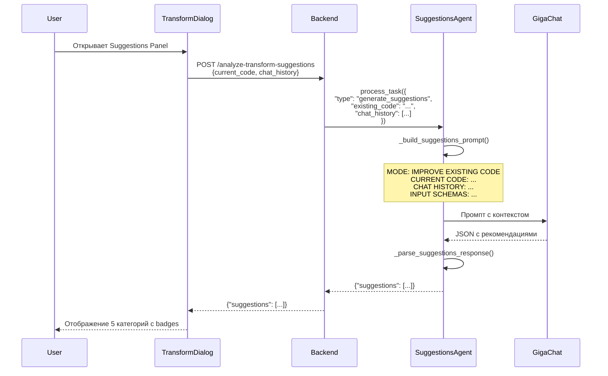

# Transform Suggestions Agent — Контекстные Рекомендации

**Дата**: 2024  
**Статус**: ✅ Implemented

---

## Executive Summary

**TransformSuggestionsAgent** — AI-агент для генерации контекстных рекомендаций по трансформациям данных в TransformDialog. Анализирует:
- **Текущий код** (если есть) — для предложения **улучшений**
- **Историю чата** — для понимания **намерений пользователя**
- **Схему данных** — для **специфичных рекомендаций** (с реальными именами колонок)

### Зачем это нужно?

**Проблема**: Пользователь не знает, что ещё можно сделать с данными после первой трансформации.

**Решение**: AI автоматически предлагает следующие логические шаги на основе контекста:
- "У вас есть фильтр → может, добавить сортировку?"
- "У вас есть числовая колонка amount → может, посчитать процент от общей суммы?"
- "У вас есть категории → может, сгруппировать и посчитать агрегаты?"

---

## Режимы работы

### Режим 1: NEW TRANSFORMATION (без existing_code)

Предлагает **базовые операции** на основе схемы данных.

**Пример запроса**:
```json
{
  "existing_code": null,
  "chat_history": [],
  "input_schemas": [
    {"name": "sales", "columns": ["date", "amount", "category", "customer"]}
  ]
}
```

**Пример ответа**:
```json
{
  "suggestions": [
    {
      "label": "Фильтр по сумме",
      "prompt": "Отфильтровать продажи где amount > 1000",
      "category": "filter",
      "confidence": 0.9
    },
    {
      "label": "Группировка по категориям",
      "prompt": "Сгруппировать по category и посчитать сумму amount",
      "category": "aggregate",
      "confidence": 0.85
    },
    {
      "label": "Сортировка по дате",
      "prompt": "Отсортировать по дате от новых к старым",
      "category": "reshape",
      "confidence": 0.8
    }
  ]
}
```

### Режим 2: ITERATIVE IMPROVEMENT (с existing_code)

Предлагает **улучшения** текущего кода.

**Пример запроса**:
```json
{
  "existing_code": "df_result = df[df['amount'] > 1000]",
  "chat_history": [
    {"role": "user", "content": "Отфильтруй продажи больше 1000"},
    {"role": "assistant", "content": "Код создан и выполнен"}
  ],
  "input_schemas": [
    {"name": "sales", "columns": ["date", "amount", "category", "customer", "region"]}
  ]
}
```

**Пример ответа**:
```json
{
  "suggestions": [
    {
      "label": "Добавить сортировку",
      "prompt": "Отсортировать результаты по amount от большего к меньшему",
      "category": "reshape",
      "confidence": 0.88,
      "description": "Упорядочить данные для лучшего восприятия"
    },
    {
      "label": "Группировка по клиентам",
      "prompt": "Сгруппировать по customer и посчитать количество и сумму продаж",
      "category": "aggregate",
      "confidence": 0.82
    },
    {
      "label": "Фильтр по категории",
      "prompt": "Дополнительно отфильтровать только категорию 'Electronics'",
      "category": "filter",
      "confidence": 0.75
    }
  ]
}
```

**Ключевые отличия**:
- ✅ Учитывает, что `amount > 1000` уже реализовано → **не предлагает** дубликат
- ✅ Предлагает **комплементарные** операции (сортировка, группировка)
- ✅ Использует **реальные имена колонок** из схемы (customer, category)

---

## Архитектура



---

## API Endpoint

### POST `/api/v1/content-nodes/{id}/analyze-transform-suggestions`

**Request**:
```json
{
  "current_code": "df_result = df[df['amount'] > 1000]",  // null для нового
  "chat_history": [
    {"role": "user", "content": "Отфильтруй продажи больше 1000"},
    {"role": "assistant", "content": "Код создан и выполнен"}
  ]
}
```

**Response**:
```json
{
  "suggestions": [
    {
      "id": "sug-1",
      "label": "Добавить сортировку",
      "prompt": "Отсортировать результаты по amount от большего к меньшему",
      "category": "reshape",
      "confidence": 0.88,
      "description": "Упорядочить данные для лучшего восприятия"
    }
  ],
  "fallback": false  // true если использовались hardcoded рекомендации
}
```

### Категории рекомендаций

- **filter** — Фильтрация данных
- **aggregate** — Группировка и агрегация  
- **compute** — Вычисляемые колонки
- **reshape** — Изменение структуры (сортировка, pivot)
- **merge** — Объединение данных

---

## Промпт для GigaChat

### Пример промпта (IMPROVE режим)

```
MODE: IMPROVE EXISTING CODE

CURRENT CODE:
```python
df_result = df[df['amount'] > 1000]
```

CHAT HISTORY (last 3 messages):
USER: Отфильтруй продажи больше 1000
ASSISTANT: Код создан и выполнен успешно

INPUT SCHEMAS:
  sales: ["date", "amount", "category", "customer", "region"]

TASK:
Generate 3-5 specific, actionable transformation suggestions.

REQUIREMENTS:
- Be SPECIFIC (use actual column names from schemas)
- Don't suggest what's already done in existing_code
- Consider the conversation context
- Return ONLY valid JSON (no markdown, no extra text)
```

### Пример промпта (NEW режим)

```
MODE: NEW TRANSFORMATION

INPUT SCHEMAS:
  sales: ["date", "amount", "category", "customer", "region"]

TASK:
Generate 3-5 specific, actionable transformation suggestions.

REQUIREMENTS:
- Be SPECIFIC (use actual column names from schemas)
- Don't suggest what's already done in existing_code
- Consider the conversation context
- Return ONLY valid JSON (no markdown, no extra text)
```

---

## Fallback режим

Если GigaChat недоступен или возвращает ошибку, используется **fallback**:

### Для IMPROVE режима

```json
{
  "suggestions": [
    {"label": "Добавить сортировку", "prompt": "Отсортировать результаты по первой числовой колонке", "category": "reshape", "confidence": 0.6},
    {"label": "Добавить фильтр", "prompt": "Добавить дополнительное условие фильтрации", "category": "filter", "confidence": 0.55}
  ],
  "fallback": true
}
```

### Для NEW режима

```json
{
  "suggestions": [
    {"label": "Фильтрация данных", "prompt": "Отфильтровать строки по условию", "category": "filter", "confidence": 0.7},
    {"label": "Группировка", "prompt": "Сгруппировать данные и посчитать агрегаты", "category": "aggregate", "confidence": 0.65},
    {"label": "Вычисляемая колонка", "prompt": "Добавить новую колонку с вычислением", "category": "compute", "confidence": 0.6}
  ],
  "fallback": true
}
```

---

## Реализация

### Файлы

| Файл                                                                                                 | Описание                                  |
| ---------------------------------------------------------------------------------------------------- | ----------------------------------------- |
| [transform_suggestions.py](../apps/backend/app/services/multi_agent/agents/transform_suggestions.py) | TransformSuggestionsAgent — AI агент      |
| [content_nodes.py#L1455](../apps/backend/app/routes/content_nodes.py#L1455)                          | Endpoint `/analyze-transform-suggestions` |
| [TransformSuggestionsPanel.tsx](../apps/web/src/components/board/TransformSuggestionsPanel.tsx)      | Frontend компонент                        |

### Ключевые методы

#### TransformSuggestionsAgent

```python
async def process_task(task: Dict) -> Dict:
    """Главный метод обработки задачи."""
    return await self._generate_suggestions(task)

async def _generate_suggestions(task: Dict) -> Dict:
    """Генерирует рекомендации через GigaChat."""
    # 1. Извлечь existing_code, chat_history, input_schemas
    # 2. Построить prompt
    # 3. Вызвать GigaChat
    # 4. Распарсить JSON ответ
    # 5. Валидировать структуру
    # 6. Вернуть {"status": "success", "suggestions": [...]}

def _build_suggestions_prompt(...) -> str:
    """Строит prompt с учётом режима (NEW vs IMPROVE)."""
    # MODE: NEW TRANSFORMATION или IMPROVE EXISTING CODE
    # CURRENT CODE (если есть)
    # CHAT HISTORY (последние 3 сообщения)
    # INPUT SCHEMAS (первые 2 таблицы, первые 10 колонок)

def _parse_suggestions_response(response) -> Dict:
    """Парсит JSON ответ от GigaChat."""
    # Убирает markdown ```json
    # Парсит JSON
    # Валидирует структуру
    # Нормализует поля (id, label, prompt, category, confidence)

def _get_fallback_suggestions(task: Dict) -> Dict:
    """Возвращает базовые рекомендации при ошибке."""
    # Проверяет наличие existing_code
    # Возвращает 2-3 hardcoded рекомендации
```

---

## Тестирование

### Автоматический тест

```python
# tests/test_transform_suggestions.py
from app.services.multi_agent.agents.transform_suggestions import TransformSuggestionsAgent
from app.services.gigachat_service import GigaChatService

gigachat = GigaChatService(api_key="test_key")
agent = TransformSuggestionsAgent(gigachat_service=gigachat)

# Тест 1: NEW режим
result = await agent.process_task({
    "type": "generate_suggestions",
    "existing_code": None,
    "chat_history": [],
    "input_schemas": [{"name": "sales", "columns": ["date", "amount", "category"]}]
})

assert result["status"] == "success"
assert len(result["suggestions"]) >= 3

# Тест 2: IMPROVE режим
result = await agent.process_task({
    "type": "generate_suggestions",
    "existing_code": "df_result = df[df['amount'] > 1000]",
    "chat_history": [{"role": "user", "content": "Отфильтруй больше 1000"}],
    "input_schemas": [{"name": "sales", "columns": ["date", "amount", "category"]}]
})

# Проверить, что не предлагает дубликат фильтра
assert not any("amount > 1000" in s["prompt"] for s in result["suggestions"])
```

### Ручной тест в UI

1. Запустить backend: `.\run-backend.ps1`
2. Запустить frontend: `.\run-frontend.ps1`
3. Открыть TransformDialog на SourceNode
4. Панель Suggestions должна **автоматически загрузиться** при открытии
5. Отправить сообщение: *"Отфильтруй строки где amount > 1000"*
6. Дождаться выполнения кода
7. **Проверить**: Suggestions обновились и предлагают улучшения (сортировка, группировка), а не дубликат фильтра

---

## Связь с другими системами

### TransformDialog Chat System

- Suggestions загружаются при открытии диалога
- Обновляются после каждого успешного выполнения кода
- Передаются `currentTransformation.code` и `chatMessages` для контекста

**См. [TRANSFORM_DIALOG_CHAT_SYSTEM.md](TRANSFORM_DIALOG_CHAT_SYSTEM.md)**

### TransformationAgent (Iterative Improvements)

- TransformationAgent использует `existing_code` и `chat_history` для **генерации** кода
- TransformSuggestionsAgent использует те же параметры для **рекомендаций**
- Оба агента учитывают контекст переписки

**См. [history/TRANSFORM_ITERATIVE_IMPROVEMENTS_FIX.md](history/TRANSFORM_ITERATIVE_IMPROVEMENTS_FIX.md)**

### Multi-Agent Data Flow

- Suggestions Agent — **отдельный** от основного multi-agent pipeline
- Вызывается параллельно (не блокирует генерацию кода)
- Использует lightweight промпты (1500 tokens max)

**См. [TRANSFORM_MULTIAGENT_DATA_FLOW.md](TRANSFORM_MULTIAGENT_DATA_FLOW.md)**

---

## Оптимизации

### 1. Ограничение данных

- **Схемы**: первые 2 таблицы (не все)
- **Колонки**: первые 10 колонок на таблицу (не все)
- **Chat history**: последние 3 сообщения (не весь диалог)

### 2. Кэширование (TODO)

```python
# Кэшировать рекомендации для (content_node_id + existing_code_hash)
# TTL: 5 минут
# Инвалидация: при новом коде или изменении данных
```

### 3. Параллельная загрузка

Frontend вызывает `/analyze-transform-suggestions` **одновременно** с первым сообщением, не дожидаясь ответа.

---

## Статус

✅ **Implemented** — полная реализация с AI агентом и fallback режимом

### Выполнено
- ✅ TransformSuggestionsAgent с GigaChat интеграцией
- ✅ Endpoint `/analyze-transform-suggestions`
- ✅ Поддержка NEW и IMPROVE режимов
- ✅ Использование `existing_code` и `chat_history`
- ✅ Fallback режим для стабильности
- ✅ Frontend интеграция (TransformSuggestionsPanel)

### Следующие шаги (опционально)
- 🔲 Кэширование рекомендаций
- 🔲 A/B тестирование разных промптов
- 🔲 Аналитика кликов по рекомендациям (какие наиболее популярны)

---

## Ссылки

- [TRANSFORM_DIALOG_CHAT_SYSTEM.md](TRANSFORM_DIALOG_CHAT_SYSTEM.md) — общая архитектура TransformDialog
- [TRANSFORM_MULTIAGENT_DATA_FLOW.md](TRANSFORM_MULTIAGENT_DATA_FLOW.md) — поток данных через multi-agent
- [history/TRANSFORM_ITERATIVE_IMPROVEMENTS_FIX.md](history/TRANSFORM_ITERATIVE_IMPROVEMENTS_FIX.md) — итеративные улучшения
