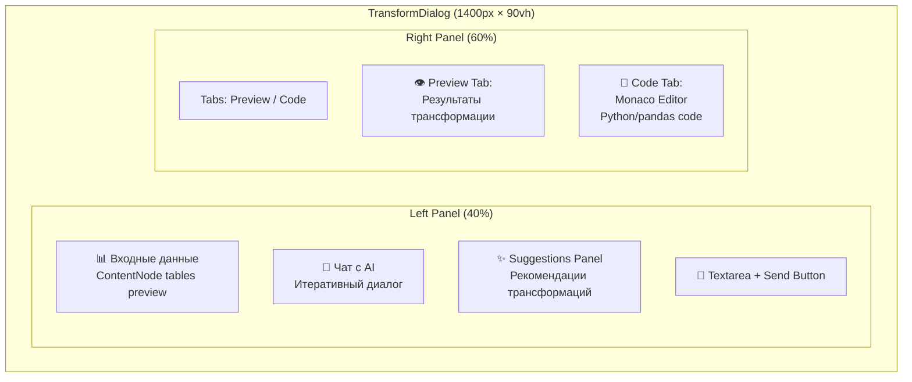
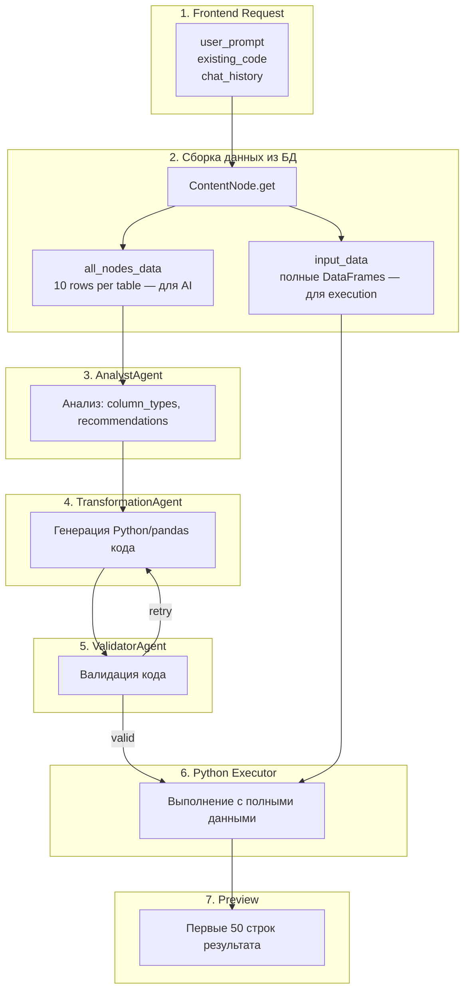

# Система трансформаций данных (Transform System)

## Executive Summary

**Transform System** — интерактивный редактор data transformations с AI-ассистентом, позволяющий итеративно создавать и улучшать pandas/Python код через естественный диалог.

**Ключевые возможности:**
- **Итеративный чат** — пользователь описывает трансформацию, AI генерирует код
- **Dual-panel layout** — 40% чат + 60% preview/code
- **Discussion Mode** — исследовательские вопросы без генерации кода
- **Transformation Mode** — генерация Python/pandas кода
- **AI Suggestions** — контекстные рекомендации трансформаций
- **Live preview** результатов при каждом ответе AI
- **Monaco Editor** для ручного редактирования кода
- **Edit mode** — возобновление существующих трансформаций

---

## Архитектура

### Dual-Panel Layout



### Поток данных



### Ограничение данных

| Этап             | Данные                                                |
| ---------------- | ----------------------------------------------------- |
| AI промпт        | Первые **10 строк** каждой таблицы (экономия токенов) |
| Python execution | **Все строки** (полные DataFrame)                     |
| Preview в UI     | Первые **50 строк** результата                        |

---

## Два режима работы

### Discussion Mode (💬 консультация)

Для исследовательских вопросов без генерации кода.

**Триггеры**: "исследуй", "предложи варианты", "что можно", "какие анализы", "какие метрики"

**Workflow**: AnalystAgent → ReporterAgent (text)

**UI**: Текстовый ответ в чате, правая панель пустая, кнопка "Сохранить" disabled

### Transformation Mode (🔧 код)

Для генерации Python кода трансформации.

**Триггеры**: "создай", "отфильтруй", "сгруппируй", "добавь столбец", "рассчитай"

**Workflow**: AnalystAgent → TransformationAgent → ValidatorAgent → Executor

**UI**: Код в Monaco Editor, preview таблиц, кнопка "Сохранить" enabled

---

## API

### Итеративная трансформация

```
POST /api/v1/content-nodes/{content_id}/transform/iterative
{
  "user_prompt": "Отфильтровать amount > 100",
  "existing_code": null,              // или Python код для улучшения
  "transformation_id": null,          // UUID сессии
  "chat_history": [],                 // история диалога
  "selected_node_ids": ["uuid-123"],  // multi-node support
  "preview_only": true
}

Response:
{
  "transformation_id": "abc-123",
  "code": "df_result = df0[df0['amount'] > 100]",
  "description": "Фильтрация строк по условию amount > 100",
  "preview_data": {
    "tables": [{
      "name": "df_result",
      "columns": ["id", "amount", "date"],
      "rows": [...],               // первые 50 строк
      "row_count": 670,            // полный размер
      "preview_row_count": 50
    }],
    "execution_time_ms": 234
  },
  "mode": "transformation"          // или "discussion"
}
```

### Рекомендации трансформаций

```
POST /api/v1/content-nodes/{content_id}/analyze-transform-suggestions
{
  "current_code": "df_result = df[df['amount'] > 1000]",
  "chat_history": [...]
}

Response:
{
  "suggestions": [
    {
      "id": "sug-1",
      "label": "Добавить сортировку",
      "prompt": "Отсортировать результаты по amount от большего к меньшему",
      "category": "reshape",
      "confidence": 0.88
    }
  ]
}
```

### Категории рекомендаций

- **filter** — Фильтрация данных
- **aggregate** — Группировка и агрегация
- **compute** — Вычисляемые колонки
- **reshape** — Сортировка, pivot, melt
- **merge** — Объединение данных

---

## Frontend

### Компоненты

| Компонент                 | Файл                                             | Назначение                |
| ------------------------- | ------------------------------------------------ | ------------------------- |
| TransformDialog           | `components/board/TransformDialog.tsx`           | Главный dual-panel диалог |
| TransformSuggestionsPanel | `components/board/TransformSuggestionsPanel.tsx` | Панель AI-рекомендаций    |
| TransformCodeEditor       | `components/board/TransformCodeEditor.tsx`       | Monaco Editor обёртка     |

### State Management

```typescript
interface TransformDialogState {
  chatMessages: ChatMessage[]       // crypto.randomUUID() для ID
  inputValue: string
  isGenerating: boolean
  currentTransformation: {
    code: string | null             // null в discussion mode
    description: string
    transformationId: string | null
    previewData?: PreviewData
    error?: string
  } | null
  editedCode: string | null         // ручные изменения
  rightPanelTab: 'preview' | 'code'
}
```

### Rich Content Rendering

Чат поддерживает три типа контента:
- **text** — обычный текст
- **html** — HTML контент (с CSS изоляцией, без `<script>`)
- **markdown** — заголовки, списки, **bold**

---

## TransformSuggestionsAgent

AI-агент для генерации контекстных рекомендаций.

### Два режима

**NEW — без existing_code**: Предлагает базовые операции на основе схемы данных (фильтрация, группировка, сортировка).

**IMPROVE — с existing_code**: Предлагает улучшения текущего кода, не дублируя уже реализованное.

### Оптимизации

- Схемы: первые 2 таблицы, первые 10 колонок
- Chat history: последние 3 сообщения
- Вызывается параллельно с основным pipeline
- Fallback: hardcoded рекомендации при недоступности GigaChat

---

## Примеры использования

### Создание новой трансформации

```
User: "Отфильтровать amount > 100 и сгруппировать по category"
→ AI генерирует pandas код → preview 4 строки (grouped)
User: "Добавь сортировку по убыванию"
→ AI дописывает .sort_values() → preview обновляется
User: [Сохранить] → ContentNode + TRANSFORMATION edge
```

### Discussion → Transformation

```
User: "Исследуй данные и предложи варианты анализа"
→ AI (discussion mode): "Предлагаю 4 варианта: 1) Анализ по брендам..."
User: "Отфильтруй бренды со средней ценой > 1000"
→ AI (transformation mode): генерирует код + preview
```

### Редактирование существующей трансформации

```
User: [Edit на TRANSFORMATION edge]
→ TransformDialog с восстановленной историей чата
User: "Добавь колонку с процентом от общей суммы"
→ AI улучшает существующий код → preview обновляется
```

---

## Retry механизм

При ошибках валидации кода:
1. `previous_errors` передаются в следующую попытку
2. Стратегии: original → simplified → basic
3. Промпт упрощается через `_simplify_prompt()`

---

## См. также

- [API.md](./API.md) — полная API документация
- [MULTI_AGENT.md](./MULTI_AGENT.md) — агенты и контроллеры
- [AI_RESOLVER_SYSTEM.md](./AI_RESOLVER_SYSTEM.md) — `gb.ai_resolve_batch()` в трансформациях
- [DATA_FORMATS.md](./DATA_FORMATS.md) — формат таблиц
