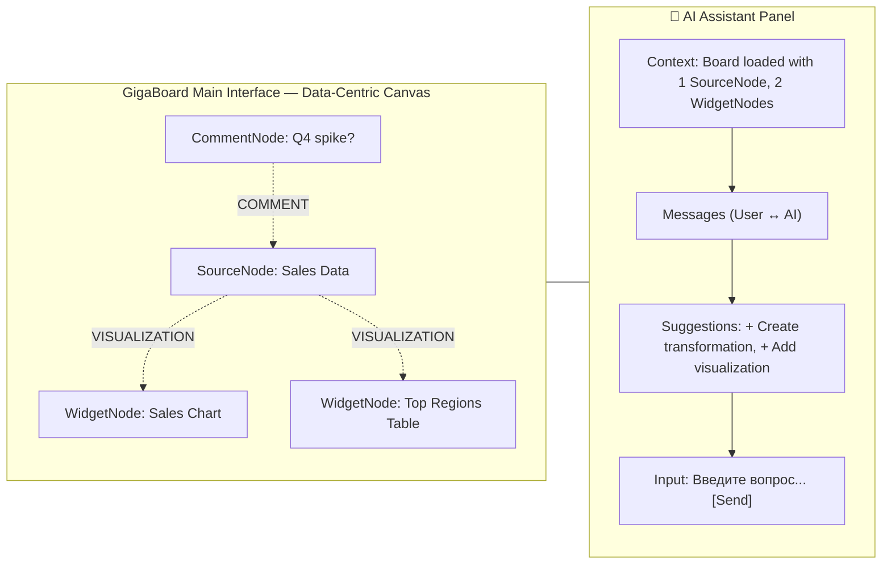
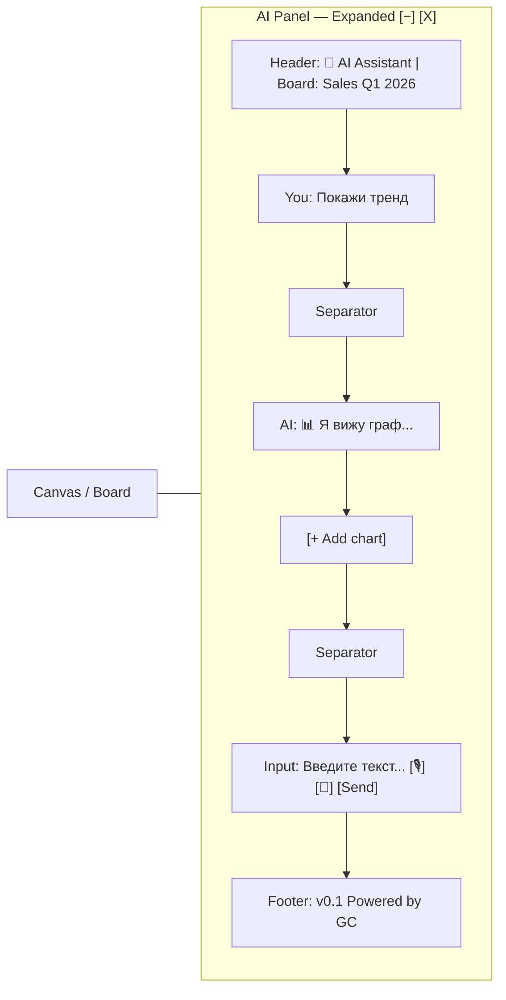
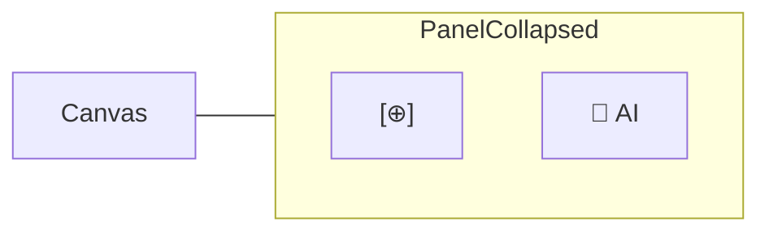
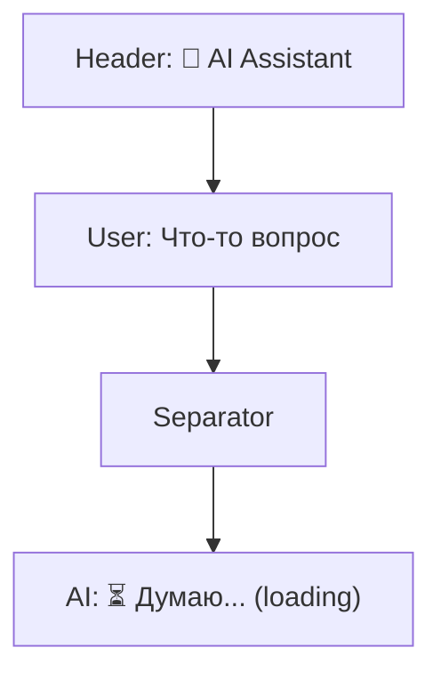
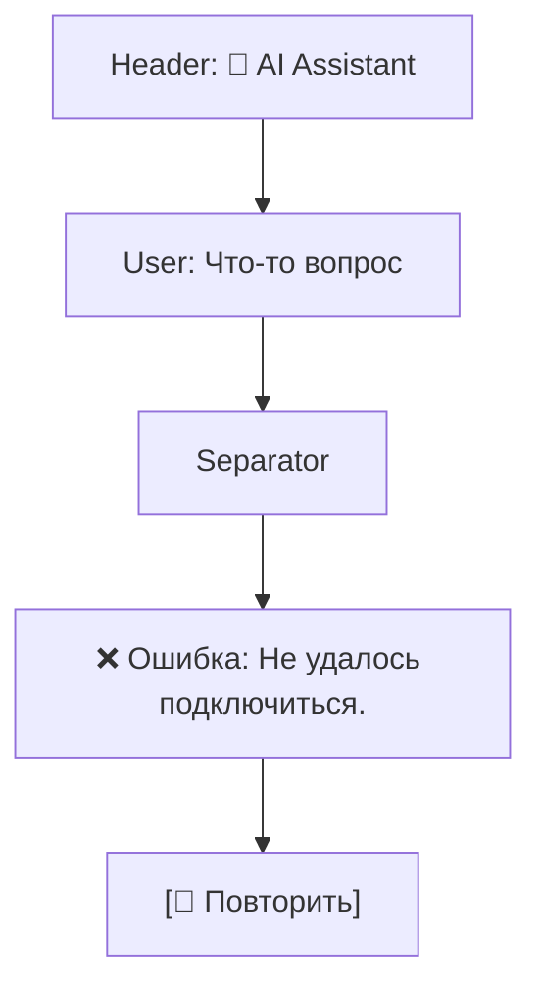
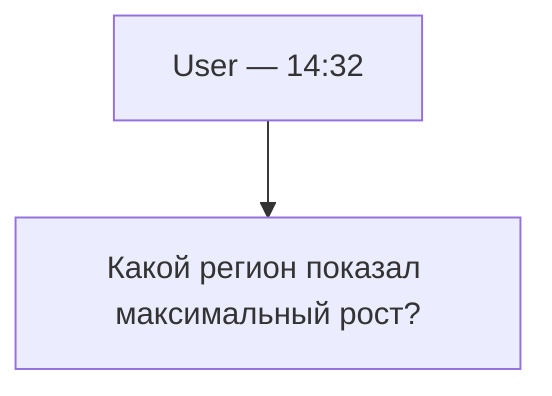
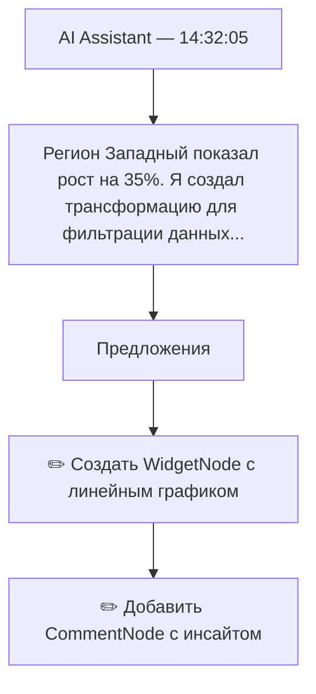
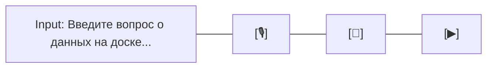

# AI Assistant Panel — UI Design

## Макет интерфейса


---

## Состояния компонента

### 1. Развёрнутая панель (Expanded)


### 2. Свёрнутая панель (Collapsed)



### 3. Загрузка (Loading)


### 4. Ошибка (Error)


---

## Компоненты и взаимодействия

### Message Bubble (User)


### Message Bubble (Assistant with Actions)


### Input Field


- Shift+Enter — отправить
- Ctrl+L — очистить
- Ctrl+. — свернуть панель

---

## Color Scheme (Light Theme)

| Элемент           | Цвет       | RGB / Hex |
| ----------------- | ---------- | --------- |
| Background        | Light gray | #F5F5F5   |
| User message bg   | Blue       | #007AFF   |
| User message text | White      | #FFFFFF   |
| AI message bg     | Light gray | #E8E8E8   |
| AI message text   | Dark gray  | #333333   |
| Action button     | Green      | #34C759   |
| Error             | Red        | #FF3B30   |
| Accent            | Purple     | #9C27B0   |
| Border            | Light gray | #D0D0D0   |

---

## Accessibility Features

1. **ARIA Labels**:
   - `role="dialog"` для панели
   - `aria-label="AI Assistant Panel"`
   - `aria-live="polite"` для новых сообщений
   
2. **Keyboard Navigation**:
   - Tab — переход между элементами
   - Enter в input → отправить
   - Shift+Enter → новая строка
   - Escape → свернуть

3. **Screen Reader**:
   - Каждое сообщение озвучивается с role и timestamp
   - Actions описаны текстом
   - Loading state озвучивается

4. **Contrast**:
   - Все тексты имеют соотношение контраста ≥ 4.5:1

---

## Система тем и стилизации

### Принципы
1. **CSS-переменные**: Все цвета должны определяться через переменные в `index.css`. Прямое использование Hex-кодов (`#ffffff`) или жестких классов Tailwind (`bg-slate-900`) в компонентах **запрещено**.
2. **Поддержка тем**: Каждый компонент должен корректно отображаться в трех режимах: `light`, `dark` и `system`.
3. **Семантические токены**: Используйте семантические имена классов для цветов:
   - `bg-background` / `text-foreground` — основные цвета.
   - `bg-card` — фон карточек и панелей.
   - `bg-primary` — акцентный цвет (синий GigaBoard).
   - `border-border` — цвет границ.
   - `text-muted-foreground` — второстепенный текст.

### Реализация
- Использование `ThemeProvider` для доступа к текущему состоянию темы.
- Применение прозрачности через CSS-переменные (например, `bg-primary/20`).
- Динамическая смена иконок или их прозрачности в зависимости от фона.

---

## Animations

1. **Fade In** — панель появляется (200ms)
2. **Slide In** — новое сообщение (300ms)
3. **Pulse** — loading indicator (1s loop)
4. **Bounce** — кнопка action при hover (100ms)

---

## Responsive Design

| Viewport            | Ширина Panel | Поведение                                      |
| ------------------- | ------------ | ---------------------------------------------- |
| < 768px (Mobile)    | 100% width   | Может быть свернута, full-screen при раскрытии |
| 768-1024px (Tablet) | 350px        | По умолчанию свернута (иконка на краю)         |
| > 1024px (Desktop)  | 380px        | По умолчанию развернута                        |

---

## Interactions Flow

### Typical User Flow

```
1. User opens board
   ↓
2. AI Panel appears in right sidebar (default: collapsed on mobile)
   ↓
3. User hovers over / clicks on AI icon
   ↓
4. Panel expands, focus moves to input field
   ↓
5. User types question
   ↓
6. User presses Enter or clicks Send
   ↓
7. Message appears in bubble (User)
   ↓
8. Loading indicator appears
   ↓
9. AI response appears (after 1-2 sec)
   ↓
10. User clicks on suggested action (optional)
    ↓
11. SourceNode/ContentNode/WidgetNode/CommentNode created on canvas
    ↓ 
12. TRANSFORMATION/VISUALIZATION/COMMENT edges created
    ↓
13. Event broadcast to other users (real-time update)
    ↓
14. Panel shows confirmation "Applied ✓" with node type
```


