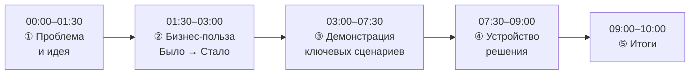
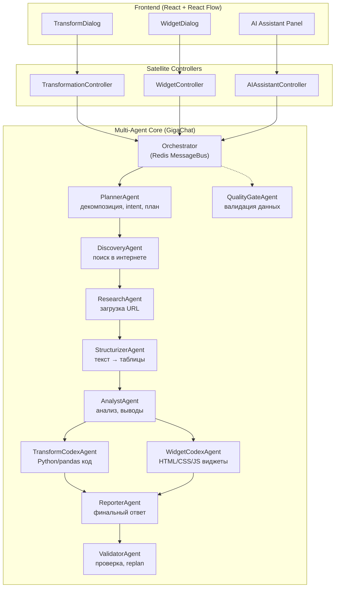

# Сценарий видео-демонстрации GigaBoard

**Формат**: Запись экрана + голосовой комментарий  
**Длительность**: до 10 минут  
**Цель**: Показать ценность решения и его работу  

Регламент записи: см. [demo_scenario.md](../demo_scenario.md) (структура 1–5, ограничения по времени и подаче).  
**Последняя актуализация**: 2026-03-01 (Dashboard System, Cross-Filter, Multi-Agent V2, проектное дерево).

---

## 🎬 Структура ролика



---

## 📹 Детальный поскадровый сценарий

---

### ① ПРОБЛЕМА И ИДЕЯ — 00:00–01:30

**Экран:** Статичный слайд / фон с логотипом GigaBoard. Без записи экрана приложения.

**Голос:**

> *"GigaBoard — это инструмент для быстрого анализа данных с AI-ассистентом на бесконечном рабочем полотне."*

> *"Идея простая: загружаешь данные из любого источника — CSV, Excel, база данных, REST API — и дальше работаешь с ними через чат. Описываешь задачу по-русски, AI генерирует трансформацию и сразу показывает результат. Хочешь график — описываешь, что хочешь увидеть, получаешь интерактивный виджет."*

> *"Всё это — на одном холсте. Источник, обработка, визуализация связаны стрелками: видно откуда пришли данные и как они были преобразованы. Если источник обновился — pipeline пересчитывается автоматически."*

> *"Главное, что даёт GigaBoard — скорость. От файла до графика за несколько минут, без написания кода вручную. Слоган проекта: от вопроса к инсайту одним промптом."*

---

### ② БИЗНЕС-ПОЛЬЗА — 01:30–03:00

**Экран:** Статичный слайд. Без записи экрана приложения.

**Голос:**

> *"Кому и для чего это полезно."*

> *"**Маркетинговый аналитик** регулярно готовит отчёты по продажам: какие бренды растут, какие товары тянут выручку вниз, как меняется средний чек. Он загружает файл один раз, строит pipeline через диалог с AI и получает живые виджеты, которые обновляются при следующей выгрузке автоматически."*

> *"**Product Manager** следит за метриками продукта: конверсия, удержание, выручка по сегментам. Ему важно быстро проверить гипотезу — например, как изменился средний чек после акции. Он открывает доску, пишет вопрос, GigaBoard делает нужную трансформацию и строит сравнение прямо на холсте."*

> *"**Аналитик данных** исследует данные: ищет аномалии, строит когортный анализ, проверяет корреляции. GigaBoard даёт ему холст, где весь процесс исследования — от источника до вывода — остаётся видимым и воспроизводимым."*

> *"Но этим список не ограничивается. Финансовый аналитик строит модели на данных из нескольких источников. Операционный менеджер следит за KPI на одной доске вместо нескольких таблиц. Владелец малого бизнеса самостоятельно анализирует продажи без найма аналитика. Исследователь обрабатывает данные эксперимента. Преподаватель визуализирует статистику для студентов."*

> *"GigaBoard работает везде, где есть данные и вопросы к ним — в ритейле, финансах, логистике, образовании, медицине, исследованиях."*

---

### ③ ДЕМОНСТРАЦИЯ КЛЮЧЕВЫХ СЦЕНАРИЕВ — 03:00–07:30

**Показываем единый сквозной flow без переключений между разными экранами.**

#### Шаг 1. Открытие доски и добавление источника (03:00–03:50)

**Экран:** Логин → пустой холст. Слева — проектное дерево: раздел **«Источники данных»** с витриной (CSV, JSON, Excel, API, БД, AI Research, ручной ввод и др.).

**Действие:** Drag & drop иконки **CSV** из витрины на холст → открывается диалог настройки источника (CSV).

- Загружаем `sales.csv`
- GigaBoard автоматически видит схему: разделитель `;`, кодировка cp1251, 19 041 строка
- Колонки: `id, title, brand, price, salesCount, salesAmount, brandImageUrl, productImageUrl, date, dateStr`
- Preview первых строк — видны товары Ozon с ценами и объёмом продаж
- Кнопка **[Извлечь данные]** (или аналог по текущему UX)

**Результат:** На холсте появляется **SourceNode** — карточка «sales.csv» с резюме: *«19 041 запись, 101 дата, период: сен 2020 — апр 2021, топ-бренды: Dfc, Philips, Bronze Gym»*.

**Голос:**
> *"Открываем доску. Слева — витрина источников в проекте. Перетаскиваем CSV на холст. Это реальная выгрузка с Ozon: почти 19 тысяч записей о продажах товаров за полгода — бренды, цены, количество и суммы продаж. GigaBoard сам определил кодировку и разделитель. Нажимаем «Извлечь» — источник готов."*

---

#### Шаг 2. AI-трансформация данных (03:50–05:10)

**Экран:** ПКМ по SourceNode (или кнопка на карточке) → **«Создать трансформацию»** → открывается **TransformDialog**.

TransformDialog — два столбца: слева чат с AI, справа Preview и вкладка Code (Monaco Editor).

**Вводим в чат:**
> *"Посчитай суммарную выручку и количество продаж по брендам, добавь средний чек и долю каждого бренда в общей выручке, отсортируй по убыванию выручки"*

**Что происходит:**
- AI (GigaChat) отвечает с кратким планом
- На вкладке Preview появляется таблица: `brand, total_revenue, total_sales, avg_price, revenue_share_%`
- Топ строк: Dfc — 28.7M руб (8.3%), Philips — 21.2M руб (6.1%), Bronze Gym — 17.4M руб (5.0%)
- На вкладке Code — сгенерированный pandas-код (не читаем его, просто показываем)

**Нажимаем [Сохранить].** На холсте:
- Появился новый **ContentNode** «Выручка по брендам»
- Анимированная стрелка **TRANSFORMATION** от SourceNode к ContentNode

**Голос:**
> *"Теперь трансформация. Открываем AI-чат, описываем задачу по-русски. GigaChat генерирует pandas-код и сразу показывает результат: рейтинг брендов по выручке с долями. Видно, что Dfc занимает 8% всей выручки — лидер рынка в этой выборке. Код смотреть не нужно — но он есть. Сохраняем, на холсте появился ContentNode."*

---

#### Шаг 3. Генерация визуализации (05:10–06:00)

**Экран:** ПКМ по ContentNode → **«Создать визуализацию»** → WidgetDialog.

**Вводим:**
> *"Горизонтальная столбчатая диаграмма: топ-10 брендов по суммарной выручке, с подписями значений в миллионах рублей"*

**Нажимаем [Сгенерировать].** Spinner 2–3 сек.

**Результат:** На холсте — **WidgetNode** с живым горизонтальным bar chart:
- Бренды по оси Y: Dfc, Philips, Bronze Gym, La Roche-Posay, Hobby World...
- Ось X: выручка в млн руб
- Подписи: «28.7M», «21.2M», «17.4M»...
- Hover-tooltip при наведении показывает точные цифры

**Голос:**
> *"Из ContentNode создаём визуализацию. WidgetCodexAgent генерирует полноценный HTML/JS виджет — не шаблон, а живой интерактивный график с реальными данными. Видно сразу: Dfc почти в полтора раза обгоняет Philips. Весь путь от CSV до графика — меньше трёх минут."*

---

#### Шаг 4. Разнообразие виджетов (06:00–06:30)

**Экран:** Возвращаемся к тому же ContentNode «Выручка по брендам». ПКМ → **«Создать визуализацию»** — снова открывается WidgetDialog.

**Вводим другой запрос:**
> *"Карточки топ-5 товаров: название товара, бренд, цена и количество продаж. Оформить как сетку product cards."*

**Нажимаем [Сгенерировать].** На холсте появляется новый **WidgetNode** рядом с гистограммой — сетка из 5 карточек, каждая с названием товара, брендом, ценой и salesCount.

**Голос:**
> *"WidgetCodexAgent не ограничен одним типом графика. На тех же данных он построил карточки товаров. Захотим — попросим круговую диаграмму долей, тепловую карту, gauge с KPI или сводную таблицу. Каждый ответ — это полноценный HTML/CSS/JS код, который рендерится прямо на холсте."*

---

#### Шаг 5. Cross-Filter: клик по виджету → фильтр по доске (06:00–06:30, опционально)

**Экран:** На доске уже есть виджет «Топ-10 брендов». Сверху или сбоку — **Filter Bar** (полоса с активными фильтрами). Открыта **Filter Panel** (конструктор условий).

**Действие:** Клик по столбцу «Dfc» на bar chart (или по значению в другом виджете) → в Filter Bar появляется чип «brand = Dfc», все виджеты на доске пересчитываются и показывают только данные по выбранному бренду.

**Голос:**
> *"У виджетов включена кросс-фильтрация. Кликаем по бренду на графике — фильтр применяется ко всей доске. Можно накапливать условия через панель фильтров или сохранять наборы как пресеты."*

---

#### Шаг 6. Разнообразие источников данных (06:30–07:00)

**Экран:** Возвращаемся к пустой доске (или второй вкладке). Камера на витрине источников слева.

**Голос:**
> *"CSV — это лишь один из источников. Посмотрим, что ещё умеет GigaBoard."*

**Excel (25 сек).** Drag & drop иконки **Excel** → диалог настройки открывает файл с несколькими листами → выбираем нужные листы → GigaBoard объединяет их в один SourceNode.

**Голос:**
> *"Excel с несколькими листами — выбираем нужные, система сама объединяет данные. Часто именно в таком формате хранятся финансовые отчёты."*

**База данных (25 сек).** Drag & drop иконки **БД** → диалог подключения: host, port, база, логин → вводим SQL-запрос → Preview результатов → **[Извлечь]**. SourceNode на холсте с иконкой 🗄️.

**Голос:**
> *"Подключение к базе данных: указываем параметры, пишем запрос, данные сразу попадают на холст. Дальнейший pipeline — тот же: трансформации, виджеты, автообновление."*

**Краткий обзор остальных (15 сек).** Камера пробегается по витрине: JSON, REST API, ручной ввод, AI Research.

**Голос:**
> *"Также поддерживаются JSON, REST API с авторизацией, ручной ввод таблиц — и AI Research: задаёшь тему, агент сам ищет данные в интернете и структурирует их в SourceNode. Все источники работают одинаково — дальше тот же canvas, те же трансформации."*

---

#### Шаг 7. Дашборд: виджеты с доски → презентационный слой (07:00–07:30, опционально)

**Экран:** В проекте открыт раздел **«Дашборды»**. Создаём новый дашборд или открываем существующий. Слева — библиотека **«Виджеты»** и **«Таблицы»** проекта (артефакты с досок).

**Действие:** Перетаскиваем виджет «Топ-10 брендов» из библиотеки на холст дашборда. Размещаем свободно, меняем размер. Добавляем ещё один виджет или текстовый блок. Сохраняем.

**Голос:**
> *"Виджеты с досок попадают в библиотеку проекта. Из них собираем дашборд — презентационный слой с свободным размещением, как в PowerPoint. На дашборде те же виджеты работают с кросс-фильтрами и обновлёнными данными."*

Плавный zoom-out — видим итоговый pipeline из основного сценария:

```
[SourceNode: sales.csv — 19 041 строка, Ozon]
    ↓ TRANSFORMATION
[ContentNode: Выручка по брендам]
    ↓ VISUALIZATION
[WidgetNode: Топ-10 брендов — bar chart]
    → (библиотека) → [Дашборд: свободное размещение]
```

**Голос:**
> *"Независимо от источника, конечный результат — живой pipeline на холсте и при необходимости — дашборд для презентации."*

---

### ④ УСТРОЙСТВО РЕШЕНИЯ — 07:30–09:00

**Экран:** Статичная схема или слайд. Код не листаем.

**Голос:**

> *"Коротко об архитектуре. Холст — это React с TypeScript, библиотека React Flow даёт бесконечную рабочую поверхность и возможность соединять узлы рёбрами. Изменения в реальном времени синхронизируются между пользователями через Socket.IO — то есть несколько человек могут работать на одной доске одновременно. Редактор кода в диалогах трансформаций — Monaco Editor, тот же движок, что в VS Code."*

> *"Сервер — FastAPI на Python, асинхронный. Данные хранятся в PostgreSQL, метаданные и message bus между агентами — Redis. Для работы с данными используется pandas, для подключения к источникам есть драйверы под PostgreSQL, MySQL, ClickHouse, MongoDB, Excel, PDF и DOCX. Поиск в интернете — через DuckDuckGo. AI — GigaChat."*

> *"AI-слой — мультиагентная система на базе GigaChat. Не один большой промпт, а девять специализированных агентов плюс QualityGate для валидации данных. Каждый агент делает ровно одно дело."*

> *"**PlannerAgent** — получает запрос пользователя, определяет intent и строит план: какие агенты нужны, в каком порядке. **DiscoveryAgent** ищет данные в интернете и публичных датасетах. **ResearchAgent** загружает контент по найденным URL. **StructurizerAgent** извлекает структурированные таблицы из текста и HTML."*

> *"**AnalystAgent** анализирует данные и формирует выводы. **TransformCodexAgent** генерирует Python/pandas код для трансформаций — именно его мы видели в шаге с выручкой по брендам. **WidgetCodexAgent** генерирует HTML/CSS/JS виджеты — гистограммы, карточки товаров, тепловые карты. **ReporterAgent** собирает финальный текстовый ответ. **ValidatorAgent** проверяет результат на соответствие запросу; при расхождении оркестратор перестраивает план. **QualityGateAgent** проверяет данные в pipeline по контексту исполнения."*

> *"Поверх ядра — пять satellite-контроллеров, привязанных к UI: TransformDialog, WidgetDialog, AI Assistant Panel и системы подсказок (TransformSuggestions, WidgetSuggestions). Контроллеры формируют запросы к ядру, исполняют сгенерированный код и валидируют результат в контексте задачи."*

> *"Ключевая концепция — Data-Centric Canvas. На холсте четыре типа узлов. SourceNode — точка входа данных: файл, БД, API или AI Research; хранит и конфиг, и извлечённые данные. ContentNode — результат трансформации: текст плюс таблицы. WidgetNode — HTML/CSS/JS виджет на холсте. CommentNode — аннотация. Узлы соединяются пятью типами рёбер: TRANSFORMATION, VISUALIZATION, COMMENT, REFERENCE, DRILL_DOWN. Обновление SourceNode пересчитывает весь downstream автоматически."*

> *"Поверх canvas — система кросс-фильтрации. Измерения (Dimensions) связывают столбцы таблиц из разных узлов; Filter Bar и Filter Panel задают условия; виджеты могут вызывать toggleFilter по клику — и все виджеты на доске или дашборде получают отфильтрованные данные. Дашборды — отдельный презентационный слой: виджеты и таблицы из библиотеки проекта размещаются свободно на холсте дашборда, с теми же фильтрами и обновлением данных."*



---

### ⑤ ИТОГИ — 09:00–10:00

#### Шаг: Демонстрация статистики проекта (09:00–09:20)

**Экран:** Слайд или экран со сводной статистикой проекта. Крупные цифры, без кода.

| Категория | Показатель | Значение |
|-----------|------------|----------|
| **Документация** | Количество документов | 54 файла |
| | Объём (строки) | ~24 тыс. строк |
| | Объём (размер) | ~1 265 КБ |
| **Код** | Количество файлов | ~290 файлов (backend + frontend) |
| | Объём (строки) | ~66 тыс. строк (Python, TypeScript/TSX) |
| | Объём (размер) | ~3 130 КБ |
| **Трудоёмкость** | Затраты на разработку | **60 чел./ч** |

**Голос:**
> *"Кратко — цифры проекта. Документация: 54 документа — без учёта архива history — около 24 тысяч строк, примерно 1,3 мегабайта: архитектура, спецификации, сценарии. Код: почти 300 файлов, порядка 66 тысяч строк, около 3 мегабайт — бэкенд на Python, фронтенд на TypeScript и React. Трудоёмкость разработки — 60 человеко-часов."*

---

**Экран:** Логотип GigaBoard, спокойный фон. Без кода.

**Голос:**

> *"Расскажу немного о подходе к разработке. Весь проект строился через документацию: сначала описывались концепция, функциональные и нефункциональные требования, архитектура — до тех пор, пока не были покрыты все аспекты. И только после этого начиналось кодирование. Такой подход иногда называют vibe coding через документацию — когда AI-ассистент работает не с отдельными задачами, а с целостной, хорошо описанной системой."*

> *"Разработка — это не прямолинейный путь. За это время концепция дважды радикально пересматривалась, требования постоянно добавлялись и уточнялись. Было реализовано три масштабных рефакторинга — менялась модель данных, переписывалась архитектура агентов, переделывался UI холста. Это нормальная часть работы, когда строишь что-то новое."*

> *"Самым трудоёмким оказался мультиагент — значительная доля усилий. Когда в цепочке девять агентов, найти причину неправильного результата нетривиально: агент может вернуть формально корректный ответ с неверными данными. Трудоёмко было и детектировать некорректные ответы от LLM, чтобы формировать задачу на репланнинг. Пришлось встраивать логирование и прогонять сценарии через Opus для корректировки системных промптов агентов."*

> *"Сейчас реализованы и холст, и режим дашборда. Холст — рабочее пространство: источники, трансформации, виджеты, связи. Виджеты и таблицы попадают в библиотеку проекта; из них собирается дашборд — свободное размещение элементов, как в PowerPoint. Кросс-фильтрация работает и на доске, и на дашборде: клик по виджету применяет фильтр ко всем виджетам."*

> *"Что дальше — два главных дополнения. Первое: AI-ассистент, который строит цепочки и дашборды самостоятельно. Пользователь формулирует задачу — «собери отчёт по продажам по регионам за квартал» или «сделай дашборд по выручке и конверсии» — и система сама подбирает источники, трансформации и виджеты, выкладывает всё на холст или на дашборд. Второе — диалог ЛПР с дашбордом. Руководитель открывает готовый дашборд и задаёт вопросы по данным: «почему в марте провал?», «какой регион растёт быстрее всего?». Технически: агент обращается к узлам доски, считывает данные, выполняет комбинацию кросс-фильтров и получает результат — ответ с конкретными цифрами и выводами. Пользователю не нужно самому исследовать данные, кликая по фильтрам: агент сделает это за него и выдаст готовый ответ. Всё это — в духе слогана GigaBoard: от вопроса к инсайту одним промптом."*

---

## 📋 Чеклист перед записью

### Данные и окружение
- [ ] Файл `sales.csv` — 19 041 строка, разделитель `;`, кодировка cp1251, колонки: `id, title, brand, price, salesCount, salesAmount, brandImageUrl, productImageUrl, date, dateStr`
- [ ] GigaChat API key активен
- [ ] Backend запущен: из `apps/backend` — `uv run python run_dev.py` (порт 8000)
- [ ] Frontend запущен: из `apps/web` — `npm run dev` (порт 5173)
- [ ] PostgreSQL и Redis работают

### Состояние приложения
- [ ] Демо-пользователь создан: `demo@gigaboard.ru`
- [ ] Доска пустая, без артефактов предыдущих сессий (или подготовлена под сценарий)
- [ ] AI Assistant Panel закрыт в начале (если не показываем)
- [ ] При демо Cross-Filter: измерения/маппинги для доски настроены или авто-определение включено
- [ ] При демо дашборда: в проекте есть дашборд и виджеты в библиотеке

### Запись
- [ ] Разрешение 1920×1080, zoom браузера 110%
- [ ] Тёмная тема включена
- [ ] Курсор мыши увеличен, движения плавные
- [ ] Тишина, нет фонового шума
- [ ] Слайд «Статистика проекта» подготовлен: документы (кол-во, строки, КБ), код (файлы, строки, КБ), 60 чел./ч (при необходимости обновить цифры перед записью)
