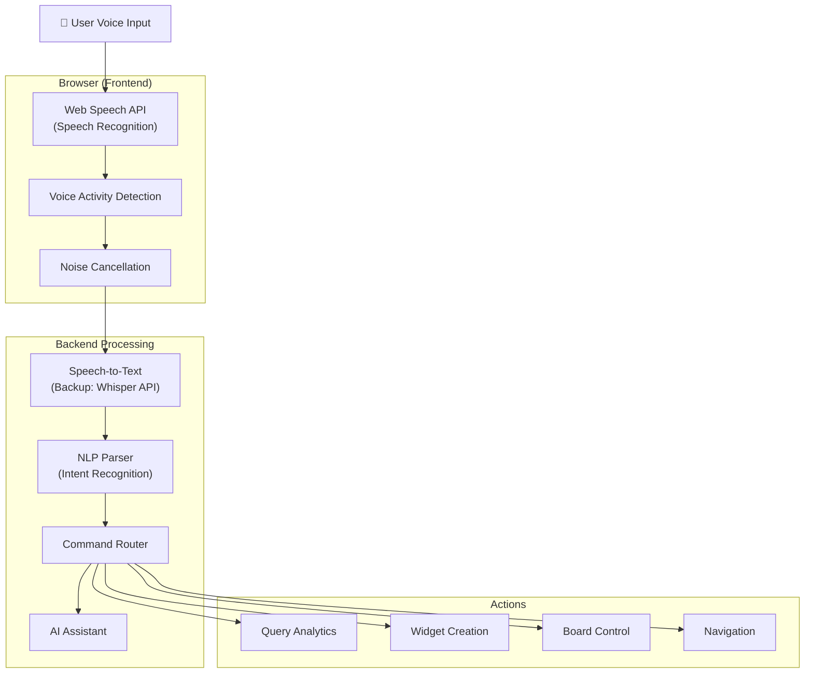

# Voice Input & Natural Language Query System

**Статус**: 🚧 Планируется  
**Приоритет**: Should Have (Phase 3)  
**Дата создания**: 24 января 2026

---

## 📋 Обзор

**Voice Input & Natural Language Query System** — возможность управлять доской и взаимодействовать с AI Assistant через голосовые команды на естественном языке.

### Ключевые возможности
- 🎤 **Voice-to-Text**: Преобразование речи в текст (Web Speech API)
- 🌍 **Multilingual**: Поддержка русского, английского, китайского, испанского
- 🎙️ **Hands-Free Mode**: Режим работы без рук для презентаций
- 🔊 **Text-to-Speech**: AI может отвечать голосом
- 📱 **Mobile Optimized**: Оптимизация для мобильных устройств
- 🎯 **Command Recognition**: Распознавание команд и действий
- 💬 **Conversational**: Естественный диалог с контекстом
- 🔇 **Noise Cancellation**: Подавление фонового шума

---

## 🏗️ Архитектура

### System Components



### Voice Command Types

```typescript
// Command Types

interface VoiceCommand {
  type: 'query' | 'action' | 'navigation' | 'control';
  intent: string;
  entities: Record<string, any>;
  confidence: number;
  language: string;
}

// Query Commands
const queryCommands = [
  "Покажи продажи за последний месяц",
  "Сколько новых пользователей в этом квартале",
  "Какой у нас churn rate",
  "Show me revenue breakdown by region"
];

// Action Commands
const actionCommands = [
  "Создай график продаж",
  "Добавь таблицу с топ продуктами",
  "Удали этот виджет",
  "Create a pie chart for categories"
];

// Navigation Commands
const navigationCommands = [
  "Открой доску Marketing Dashboard",
  "Перейди к следующему виджету",
  "Увеличь этот график",
  "Go to the previous slide"
];

// Control Commands
const controlCommands = [
  "Включи презентационный режим",
  "Экспортируй в PDF",
  "Поделись доской с командой",
  "Enable dark mode"
];
```

---

## 🎤 Voice Recognition Implementation

### 1. Web Speech API Integration

```typescript
// VoiceInput.tsx

import { useEffect, useState, useRef } from 'react';

interface VoiceInputProps {
  onTranscript: (text: string) => void;
  onCommand: (command: VoiceCommand) => void;
  language?: string;
}

export const VoiceInput: React.FC<VoiceInputProps> = ({
  onTranscript,
  onCommand,
  language = 'ru-RU'
}) => {
  const [isListening, setIsListening] = useState(false);
  const [transcript, setTranscript] = useState('');
  const recognitionRef = useRef<SpeechRecognition | null>(null);

  useEffect(() => {
    // Check browser support
    if (!('webkitSpeechRecognition' in window) && !('SpeechRecognition' in window)) {
      console.error('Speech Recognition not supported');
      return;
    }

    // Initialize Speech Recognition
    const SpeechRecognition = window.SpeechRecognition || window.webkitSpeechRecognition;
    const recognition = new SpeechRecognition();

    recognition.continuous = true;
    recognition.interimResults = true;
    recognition.lang = language;

    recognition.onstart = () => {
      setIsListening(true);
    };

    recognition.onresult = (event) => {
      let interimTranscript = '';
      let finalTranscript = '';

      for (let i = event.resultIndex; i < event.results.length; i++) {
        const transcript = event.results[i][0].transcript;
        
        if (event.results[i].isFinal) {
          finalTranscript += transcript + ' ';
        } else {
          interimTranscript += transcript;
        }
      }

      // Update transcript
      const fullTranscript = finalTranscript || interimTranscript;
      setTranscript(fullTranscript);
      onTranscript(fullTranscript);

      // Parse command when final
      if (finalTranscript) {
        parseCommand(finalTranscript).then(command => {
          if (command) {
            onCommand(command);
          }
        });
      }
    };

    recognition.onerror = (event) => {
      console.error('Speech recognition error:', event.error);
      setIsListening(false);
    };

    recognition.onend = () => {
      setIsListening(false);
    };

    recognitionRef.current = recognition;

    return () => {
      if (recognitionRef.current) {
        recognitionRef.current.stop();
      }
    };
  }, [language]);

  const startListening = () => {
    if (recognitionRef.current && !isListening) {
      recognitionRef.current.start();
    }
  };

  const stopListening = () => {
    if (recognitionRef.current && isListening) {
      recognitionRef.current.stop();
    }
  };

  return (
    <div className="voice-input-container">
      <button
        onClick={isListening ? stopListening : startListening}
        className={`p-4 rounded-full transition-all ${
          isListening 
            ? 'bg-red-500 animate-pulse' 
            : 'bg-blue-500 hover:bg-blue-600'
        }`}
      >
        {isListening ? (
          <MicOff className="w-6 h-6 text-white" />
        ) : (
          <Mic className="w-6 h-6 text-white" />
        )}
      </button>

      {/* Visual Feedback */}
      {isListening && (
        <div className="mt-4 p-4 bg-gray-100 dark:bg-gray-800 rounded-lg">
          <div className="flex items-center gap-2 mb-2">
            <div className="w-2 h-2 bg-red-500 rounded-full animate-pulse" />
            <span className="text-sm text-gray-600 dark:text-gray-400">
              Listening...
            </span>
          </div>
          <p className="text-lg">{transcript || 'Говорите...'}</p>
        </div>
      )}

      {/* Waveform Visualization */}
      {isListening && <AudioWaveform />}
    </div>
  );
};
```

### 2. Command Parser

```typescript
// commandParser.ts

interface ParsedCommand {
  type: 'query' | 'action' | 'navigation' | 'control';
  intent: string;
  entities: Record<string, any>;
  confidence: number;
}

export async function parseCommand(text: string): Promise<ParsedCommand | null> {
  // Send to backend for NLP processing
  const response = await fetch('/api/v1/voice/parse-command', {
    method: 'POST',
    headers: { 'Content-Type': 'application/json' },
    body: JSON.stringify({ text })
  });

  const result = await response.json();
  return result.command;
}

// Backend NLP Parser
class VoiceCommandParser:
    """Парсер голосовых команд"""
    
    def __init__(self):
        self.command_patterns = {
            'query': [
                r'покажи (.+)',
                r'сколько (.+)',
                r'какой (.+)',
                r'show me (.+)',
                r'what is (.+)',
                r'how many (.+)'
            ],
            'action': [
                r'создай (.+)',
                r'добавь (.+)',
                r'удали (.+)',
                r'create (.+)',
                r'add (.+)',
                r'delete (.+)',
                r'remove (.+)'
            ],
            'navigation': [
                r'открой (.+)',
                r'перейди к (.+)',
                r'go to (.+)',
                r'open (.+)',
                r'navigate to (.+)'
            ],
            'control': [
                r'включи (.+)',
                r'выключи (.+)',
                r'экспортируй (.+)',
                r'enable (.+)',
                r'disable (.+)',
                r'export (.+)'
            ]
        }
    
    async def parse(self, text: str) -> Optional[ParsedCommand]:
        """Парсинг команды"""
        
        text_lower = text.lower().strip()
        
        # Try pattern matching first
        for cmd_type, patterns in self.command_patterns.items():
            for pattern in patterns:
                match = re.search(pattern, text_lower)
                if match:
                    return await self._create_command(
                        cmd_type=cmd_type,
                        text=text,
                        matched_entity=match.group(1) if match.groups() else None
                    )
        
        # Fallback to AI-powered parsing
        return await self._ai_parse(text)
    
    async def _ai_parse(self, text: str) -> Optional[ParsedCommand]:
        """AI-based parsing using GigaChat"""
        
        prompt = f"""
        Parse this voice command into a structured format:
        Command: "{text}"
        
        Determine:
        1. Type: query, action, navigation, or control
        2. Intent: what the user wants to do
        3. Entities: extract relevant entities (dates, metrics, widget types, etc.)
        4. Confidence: 0-100%
        
        Return JSON format.
        """
        
        response = await gigachat.ask(prompt)
        return json.loads(response)
```

---

## 🎯 Command Execution

### Command Router

```python
class VoiceCommandExecutor:
    """Выполнение голосовых команд"""
    
    async def execute(
        self,
        command: ParsedCommand,
        user_id: UUID,
        board_id: UUID
    ) -> Dict:
        """Выполнение команды"""
        
        if command.type == 'query':
            return await self._execute_query(command, user_id, board_id)
        
        elif command.type == 'action':
            return await self._execute_action(command, user_id, board_id)
        
        elif command.type == 'navigation':
            return await self._execute_navigation(command, user_id)
        
        elif command.type == 'control':
            return await self._execute_control(command, user_id, board_id)
        
        else:
            raise ValueError(f"Unknown command type: {command.type}")
    
    async def _execute_query(self, command: ParsedCommand, user_id: UUID, board_id: UUID):
        """Выполнение аналитического запроса"""
        
        # Send to AI Assistant
        response = await ai_assistant.process_query(
            query=command.intent,
            user_id=user_id,
            board_id=board_id,
            context={'source': 'voice'}
        )
        
        return {
            'status': 'success',
            'type': 'query_result',
            'data': response,
            'speak': True,  # AI should respond with voice
            'speech_text': response['summary']
        }
    
    async def _execute_action(self, command: ParsedCommand, user_id: UUID, board_id: UUID):
        """Выполнение действия"""
        
        # Extract action type
        action = command.entities.get('action')
        target = command.entities.get('target')
        
        if 'создай' in command.intent or 'create' in command.intent:
            # Create widget with AI-generated code
            user_prompt = self._build_user_prompt_from_voice(target, command.entities)
            widget = await self._create_widget(
                board_id=board_id,
                user_prompt=user_prompt,
                config=command.entities
            )
            
            return {
                'status': 'success',
                'type': 'widget_created',
                'widget': widget,
                'speak': True,
                'speech_text': f"Виджет создан: {widget.description}"
            }
        
        elif 'удали' in command.intent or 'delete' in command.intent:
            # Delete widget
            widget_id = await self._find_widget_by_description(target, board_id)
            await delete_widget(widget_id)
            
            return {
                'status': 'success',
                'type': 'widget_deleted',
                'speak': True,
                'speech_text': "Виджет удален"
            }
    
    async def _execute_navigation(self, command: ParsedCommand, user_id: UUID):
        """Навигация"""
        
        target = command.entities.get('target')
        
        # Find board by name
        board = await find_board_by_name(target, user_id)
        
        if board:
            return {
                'status': 'success',
                'type': 'navigation',
                'action': 'open_board',
                'board_id': board.id,
                'speak': True,
                'speech_text': f"Открываю доску {board.name}"
            }
        else:
            return {
                'status': 'error',
                'error': 'Board not found',
                'speak': True,
                'speech_text': f"Доска {target} не найдена"
            }


# API Endpoint

@router.post('/api/v1/voice/execute-command')
async def execute_voice_command(
    command: ParsedCommand,
    board_id: UUID,
    current_user: User = Depends(get_current_user)
):
    executor = VoiceCommandExecutor()
    
    result = await executor.execute(
        command=command,
        user_id=current_user.id,
        board_id=board_id
    )
    
    return result
```

---

## 🔊 Text-to-Speech Response

### Voice Response System

```typescript
// VoiceResponse.tsx

export class VoiceResponseEngine {
  private synth: SpeechSynthesis;
  private voice: SpeechSynthesisVoice | null = null;

  constructor(language: string = 'ru-RU') {
    this.synth = window.speechSynthesis;
    this.loadVoice(language);
  }

  private loadVoice(language: string) {
    const voices = this.synth.getVoices();
    this.voice = voices.find(voice => voice.lang === language) || voices[0];
  }

  speak(text: string, options?: {
    rate?: number;
    pitch?: number;
    volume?: number;
  }) {
    // Cancel any ongoing speech
    this.synth.cancel();

    const utterance = new SpeechSynthesisUtterance(text);
    utterance.voice = this.voice;
    utterance.rate = options?.rate || 1.0;
    utterance.pitch = options?.pitch || 1.0;
    utterance.volume = options?.volume || 1.0;

    utterance.onstart = () => {
      console.log('Speech started');
    };

    utterance.onend = () => {
      console.log('Speech ended');
    };

    utterance.onerror = (event) => {
      console.error('Speech error:', event);
    };

    this.synth.speak(utterance);
  }

  stop() {
    this.synth.cancel();
  }
}

// Usage in AI Assistant

const voiceEngine = new VoiceResponseEngine('ru-RU');

// When AI responds
socket.on('ai_response', (data) => {
  if (data.speak) {
    voiceEngine.speak(data.speech_text);
  }
});
```

---

## 🎙️ Hands-Free Presentation Mode

### Presentation Mode Implementation

```typescript
// PresentationMode.tsx

export const PresentationMode: React.FC<{ boardId: string }> = ({ boardId }) => {
  const [isActive, setIsActive] = useState(false);
  const [currentSlide, setCurrentSlide] = useState(0);
  const { data: widgets } = useQuery(['board-widgets', boardId]);

  useEffect(() => {
    if (!isActive) return;

    // Voice command handler
    const handleCommand = async (command: VoiceCommand) => {
      switch (command.intent) {
        case 'next':
        case 'следующий':
          setCurrentSlide(prev => Math.min(prev + 1, widgets.length - 1));
          break;

        case 'previous':
        case 'предыдущий':
          setCurrentSlide(prev => Math.max(prev - 1, 0));
          break;

        case 'explain':
        case 'объясни':
          const widget = widgets[currentSlide];
          const explanation = await explainWidget(widget.id);
          voiceEngine.speak(explanation);
          break;

        case 'zoom in':
        case 'увеличь':
          zoomIn();
          break;

        case 'zoom out':
        case 'уменьши':
          zoomOut();
          break;

        case 'exit':
        case 'выход':
          setIsActive(false);
          break;
      }
    };

    // Start voice recognition
    startVoiceRecognition(handleCommand);

    return () => {
      stopVoiceRecognition();
    };
  }, [isActive, currentSlide, widgets]);

  return (
    <div className="presentation-mode">
      {!isActive ? (
        <button
          onClick={() => setIsActive(true)}
          className="px-6 py-3 bg-blue-600 text-white rounded-lg"
        >
          Start Presentation Mode 🎤
        </button>
      ) : (
        <div className="fullscreen-presentation">
          {/* Current Widget */}
          <div className="flex items-center justify-center h-screen">
            <WidgetRenderer widget={widgets[currentSlide]} fullscreen />
          </div>

          {/* Controls Overlay */}
          <div className="absolute bottom-8 left-1/2 transform -translate-x-1/2">
            <div className="bg-black/70 text-white px-6 py-3 rounded-lg flex items-center gap-4">
              <span className="text-sm">
                Voice Commands: "Next", "Previous", "Explain", "Exit"
              </span>
              <div className="w-2 h-2 bg-red-500 rounded-full animate-pulse" />
            </div>
          </div>

          {/* Progress Indicator */}
          <div className="absolute top-4 right-4 text-white">
            {currentSlide + 1} / {widgets.length}
          </div>
        </div>
      )}
    </div>
  );
};
```

---

## 🌍 Multi-Language Support

### Language Detection & Switching

```python
class LanguageDetector:
    """Автоматическое определение языка"""
    
    SUPPORTED_LANGUAGES = {
        'ru': 'ru-RU',
        'en': 'en-US',
        'zh': 'zh-CN',
        'es': 'es-ES',
        'fr': 'fr-FR',
        'de': 'de-DE'
    }
    
    async def detect_language(self, text: str) -> str:
        """Определение языка текста"""
        
        # Use langdetect library
        try:
            detected = detect(text)
            return self.SUPPORTED_LANGUAGES.get(detected, 'en-US')
        except:
            return 'en-US'
    
    async def auto_switch_language(self, user_id: UUID, detected_lang: str):
        """Автоматическое переключение языка интерфейса"""
        
        await update_user_preference(
            user_id=user_id,
            preference='voice_language',
            value=detected_lang
        )
```

---

## 🚀 Implementation Roadmap

### Phase 1: Basic Voice Input (2 weeks)
- ✅ Web Speech API integration
- ✅ Basic command recognition
- ✅ Voice-to-text display
- ✅ Simple commands (query, action)

### Phase 2: Advanced Commands (2 weeks)
- ✅ NLP command parser
- ✅ Entity extraction
- ✅ Context-aware commands
- ✅ Multi-step commands

### Phase 3: Voice Output (1 week)
- ✅ Text-to-speech integration
- ✅ AI voice responses
- ✅ Voice feedback

### Phase 4: Presentation Mode (1 week)
- ✅ Hands-free navigation
- ✅ Automatic widget explanation
- ✅ Slide control commands

### Phase 5: Multi-Language (1 week)
- ✅ Language detection
- ✅ Multi-language support
- ✅ Auto-switching

---

## 🎯 Success Metrics

- **Adoption**: 40%+ пользователей пробуют voice input
- **Accuracy**: 90%+ точность распознавания команд
- **Regular Usage**: 20% пользователей используют voice регулярно
- **Presentation Mode**: 60% презентаций используют hands-free mode
- **User Satisfaction**: 4.3+ звезд

---

**Последнее обновление**: 24 января 2026
