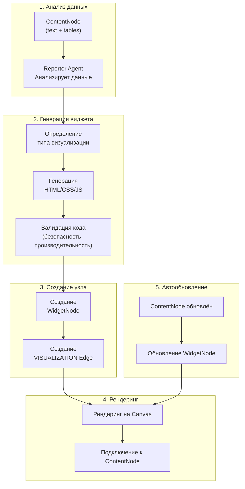

# WidgetNode Generation System: Reporter Agent Creates Visualizations

## Executive Summary

**WidgetNode Generation System** — система автоматической генерации интерактивных визуализаций из данных ContentNode с помощью Reporter Agent.

**Ключевые концепции:**
- **Reporter Agent** генерирует полный HTML/CSS/JS код визуализации (без шаблонов)
- **WidgetNode** создаётся из **ContentNode** через VISUALIZATION edge
- **Автоматическое обновление** при изменении родительского ContentNode
- **AI-генерация кода** — все виджеты создаются с нуля, даже стандартные графики

**Workflow:**
1. Reporter Agent анализирует ContentNode (структура данных, типы столбцов, паттерны)
2. AI генерирует полный HTML/CSS/JS код визуализации по запросу пользователя
3. Код валидируется (безопасность, размер, производительность)
4. Создаётся WidgetNode с VISUALIZATION edge к ContentNode
5. При обновлении ContentNode → автоматический refresh WidgetNode

---

## Обзор

**WidgetNode Generation System** позволяет **Reporter Agent** динамически генерировать **WidgetNodes** из **ContentNodes**. Каждый WidgetNode содержит:
- **HTML/CSS/JS код** для рендеринга визуализации (всегда генерируется с нуля)
- **Описание визуализации** (краткий текст, например "Линейный график продаж за период")
- **VISUALIZATION edge** связывающий его с родительским ContentNode
- **Автообновление** при изменении родительского ContentNode

Это переводит систему от "рекомендаций визуализаций" к "активному построению интерактивных визуализаций данных". Reporter Agent **всегда генерирует полный HTML/CSS/JS код** для любой визуализации — даже для стандартных графиков — обеспечивая максимальную гибкость и кастомизацию.

---

## Архитектура

### Конвейер генерации WidgetNode



---

## Reporter Agent

### Основные обязанности

<details>
<summary>📄 Полная реализация ReporterAgent (развернуть)</summary>

```python
class ReporterAgent:
    """
    AI Agent specialized in creating visual representations of DataNodes
    """
    
    def __init__(self, llm_client, sandbox_executor):
        self.llm = llm_client
        self.executor = sandbox_executor
    
    async def create_visualization(
        self,
        content_node_id: str,
        user_prompt: Optional[str] = None
    ) -> WidgetNode:
        """
        Main entry point: analyze ContentNode and create WidgetNode
        
        Args:
            content_node_id: Source ContentNode to visualize
            user_prompt: Optional user instruction (e.g., "create bar chart")
        
        Returns:
            WidgetNode with generated HTML/CSS/JS code
        """
        
        # 1. Analyze ContentNode
        content_node = await db.content_nodes.find_one({"id": content_node_id})
        analysis = await self.analyze_content_node(content_node)
        
        # 2. Generate HTML/CSS/JS code directly (no widget type selection)
        widget_code = await self.generate_widget_code(
            content_node=content_node,
            analysis=analysis,
            user_prompt=user_prompt
        )
        
        # 3. Validate code
        validation = await self.validate_widget_code(widget_code)
        if not validation['is_valid']:
            raise ValueError(f"Widget validation failed: {validation['errors']}")
        
        # 4. Create WidgetNode
        widget_node = WidgetNode(
            id=uuid.uuid4(),
            board_id=content_node["board_id"],
            description=widget_code['description'],  # Brief description of visualization
            html_code=widget_code['html'],
            css_code=widget_code['css'],
            js_code=widget_code['js'],
            parent_content_node_id=content_node_id,
            position={
                "x": content_node["position"]["x"] + 300,
                "y": content_node["position"]["y"]
            }
        )
        
        await db.widget_nodes.insert_one(widget_node.to_dict())
        
        # 5. Create VISUALIZATION edge
        await create_edge(
            from_node_id=content_node_id,
            to_node_id=widget_node.id,
            edge_type="VISUALIZATION",
            metadata={"description": widget_code['description']}
        )
        
        # 6. Notify board
        await broadcast_to_board(content_node["board_id"], {
            "type": "widget_node_created",
            "widget_node": widget_node.to_dict()
        })
        
        return widget_node
    
    async def analyze_content_node(self, content_node: Dict) -> Dict:
        """
        Analyze ContentNode content to understand structure and suitable visualizations
        
        Returns:
            {
                "content_type": "csv|json|table|text|binary",
                "schema": {"column1": "type", ...},
                "row_count": 1000,
                "column_count": 5,
                "data_types": ["numeric", "categorical", "temporal"],
                "insights": ["Time series detected", "3 categories found"],
                "patterns": ["Sales trending upward", "Seasonal variation in Q4"]
            }
        """
        
        content = content_node["content"]
        content_type = content_node.get("content_type", "transformed")
        
        # Use AI to analyze
        prompt = f"""
        Analyze this data structure and content:
        
        Content Type: {content_type}
        Sample Data:
        {str(content)[:500]}
        
        Return JSON with:
        - schema (columns and their types)
        - row_count, column_count
        - data_types (numeric, categorical, temporal)
        - insights (what patterns do you see?)
        - patterns (trends, anomalies, distributions)
        """
        
        response = await self.llm.generate(prompt)
        return json.loads(response)
    
    async def generate_widget_code(
        self,
        content_node: Dict,
        analysis: Dict,
        user_prompt: Optional[str] = None
    ) -> Dict[str, str]:
        """
        Generate complete HTML/CSS/JS code for visualization using AI
        
        Always generates custom visualization code from scratch,
        even for standard charts like line graphs or bar charts.
        
        Returns:
            {
                "description": "Line chart showing sales over time",
                "html": "...",
                "css": "...",
                "js": "..."
            }
        """
        
        # Prepare data sample
        data_sample = str(content_node["content"])[:1000]  # Limit for prompt
        
        # Determine visualization intent
        visualization_request = user_prompt or "Create appropriate visualization for this data"
        
        prompt = f"""
        Generate complete HTML/CSS/JS code to visualize this data.
        
        User Request: {visualization_request}
        
        Data Analysis:
        {json.dumps(analysis, indent=2)}
        
        Data Sample:
        {data_sample}
        
        Requirements:
        - Generate COMPLETE working HTML/CSS/JS code from scratch
        - Do NOT use predefined widget types or templates
        - Even for simple charts (line, bar, pie), write full custom code
        - Use Chart.js library for charts (loaded globally) OR write canvas/SVG code directly
        - Must be responsive (work on any canvas size)
        - Support dark mode (use CSS variables: --card-bg, --text-primary, etc)
        - Include interactivity (tooltips, hover effects, click handlers)
        - HTML: semantic structure with .widget-container wrapper
        - CSS: scoped to unique class, responsive, dark mode compatible
        - JS: wrapped in IIFE, no global pollution, handle data injection
        
        Return ONLY valid JSON:
        {{
            "description": "Brief description of the visualization (e.g., 'Line chart showing sales trends over time')",
            "html": "...",
            "css": "...",
            "js": "..."
        }}
        """
        
        response = await self.llm.generate(prompt)
        code = json.loads(response)
        
        # Add unique widget ID scoping
        widget_id = str(uuid.uuid4())[:8]
        code['html'] = f'<div class="widget widget-{widget_id}">\n{code["html"]}\n</div>'
        code['css'] = f'.widget-{widget_id} {{\n{code["css"]}\n}}'
        
        return code
    
    async def validate_widget_code(self, widget_code: Dict[str, str]) -> Dict:
        """
        Validate generated code for security and performance
        
        Checks:
        - No eval(), Function(), or dangerous JS
        - No external script loading
        - Size limits (HTML < 100KB, CSS < 50KB, JS < 50KB)
        - Valid HTML/CSS/JS syntax
        """
        
        errors = []
        
        # Security checks
        dangerous_patterns = [
            r'eval\s*\(',
            r'Function\s*\(',
            r'<script\s+src=',
            r'import\s+.*\s+from',
            r'require\s*\(',
            r'innerHTML\s*=.*<script'
        ]
        
        for pattern in dangerous_patterns:
            if re.search(pattern, widget_code['js'], re.IGNORECASE):
                errors.append(f"Dangerous pattern found: {pattern}")
        
        # Size limits
        if len(widget_code['html']) > 100_000:
            errors.append("HTML too large (>100KB)")
        if len(widget_code['css']) > 50_000:
            errors.append("CSS too large (>50KB)")
        if len(widget_code['js']) > 50_000:
            errors.append("JS too large (>50KB)")
        
        return {
            "is_valid": len(errors) == 0,
            "errors": errors
        }
    
    async def refresh_widget_from_content_node(
        self,
        widget_node_id: str
    ):
        """
        Refresh WidgetNode when parent ContentNode changes
        
        Options:
        1. Re-inject data without regenerating code
        2. Regenerate widget code if structure changed
        """
        
        widget_node = await db.widget_nodes.find_one({"id": widget_node_id})
        content_node = await db.content_nodes.find_one({"id": widget_node["parent_content_node_id"]})
        
        # Analyze new data
        new_analysis = await self.analyze_content_node(content_node)
        
        # Check if structure changed
        if self._structure_changed(widget_node["metadata"].get("last_analysis"), new_analysis):
            # Regenerate widget code
            new_code = await self.generate_widget_code(
                content_node=content_node,
                analysis=new_analysis,
                user_prompt=widget_node["metadata"].get("original_prompt")
            )
            
            await db.widget_nodes.update_one(
                {"id": widget_node_id},
                {"$set": {
                    "html_code": new_code['html'],
                    "css_code": new_code['css'],
                    "js_code": new_code['js'],
                    "metadata.last_analysis": new_analysis,
                    "updated_at": datetime.now()
                }}
            )
            
            await broadcast_to_board(widget_node["board_id"], {
                "type": "widget_regenerated",
                "widget_node_id": widget_node_id
            })
        else:
            # Just re-inject data
            await broadcast_to_board(widget_node["board_id"], {
                "type": "widget_data_updated",
                "widget_node_id": widget_node_id,
                "new_data": content_node["content"]
            })
    
    def _structure_changed(self, old_analysis: Dict, new_analysis: Dict) -> bool:
        """Check if data structure significantly changed"""
        if not old_analysis:
            return True
        
        # Check column count
        if old_analysis.get("column_count") != new_analysis.get("column_count"):
            return True
        
        # Check schema
        if old_analysis.get("schema") != new_analysis.get("schema"):
            return True
        
        return False
```

</details>

---

## Примеры визуализаций

> **Примечание**: Все примеры ниже — **AI-генерированный HTML/CSS/JS код**. Reporter Agent генерирует полный кастомный код для каждой визуализации с нуля, даже для стандартных графиков. Предопределённых шаблонов виджетов не существует.

### Пример 1: Отображение метрики

**Данные**: Одно числовое значение с историческим сравнением  
**Запрос пользователя**: "Покажи общую выручку как метрику"

<details>
<summary>📊 AI-генерированный код метрики (развернуть)</summary>

```html
<div class="widget metric-widget">
  <div class="metric-header">
    <h3>Total Revenue</h3>
    <span class="metric-period">Last 30 days</span>
  </div>
  
  <div class="metric-body">
    <div class="metric-value">$1,234,567</div>
    <div class="metric-change trend-up">
      <span class="arrow">↑</span>
      <span class="percent">+12.5%</span>
    </div>
  </div>
  
  <div class="metric-footer">
    Previous: $1,098,234 | Target: $1,500,000
  </div>
</div>

<style>
.metric-widget {
  background: var(--card-bg);
  border: 1px solid var(--border-color);
  border-radius: 12px;
  padding: 24px;
  min-width: 250px;
}

.metric-header {
  display: flex;
  justify-content: space-between;
  align-items: center;
  margin-bottom: 16px;
}

.metric-header h3 {
  margin: 0;
  font-size: 14px;
  font-weight: 600;
  color: var(--text-secondary);
}

.metric-period {
  font-size: 12px;
  color: var(--text-tertiary);
}

.metric-value {
  font-size: 42px;
  font-weight: 700;
  color: var(--text-primary);
  margin-bottom: 8px;
}

.metric-change {
  display: flex;
  align-items: center;
  gap: 4px;
  font-size: 16px;
  font-weight: 600;
}

.trend-up { color: #10b981; }
.trend-down { color: #ef4444; }
.trend-neutral { color: var(--text-secondary); }

.metric-footer {
  margin-top: 16px;
  padding-top: 16px;
  border-top: 1px solid var(--border-color);
  font-size: 12px;
  color: var(--text-tertiary);
}
</style>

<script>
(function() {
  const widget = document.currentScript.parentElement;
  
  // Add hover effect
  widget.addEventListener('mouseenter', () => {
    widget.style.boxShadow = '0 4px 12px rgba(0,0,0,0.15)';
  });
  
  widget.addEventListener('mouseleave', () => {
    widget.style.boxShadow = 'none';
  });
  
  // Drill-down on click
  widget.addEventListener('click', () => {
    window.dispatchEvent(new CustomEvent('widget-drill-down', {
      detail: { widget_id: widget.dataset.widgetId }
    }));
  });
})();
</script>
```

</details>

---

### Пример 2: Столбчатая диаграмма

**Данные**: Данные о продажах по регионам  
**Запрос пользователя**: "Создай столбчатую диаграмму продаж по регионам"

<details>
<summary>📊 AI-генерированный код столбчатой диаграммы (развернуть)</summary>

```html
<div class="widget chart-widget">
  <div class="chart-header">
    <h3>Sales by Region</h3>
    <div class="chart-controls">
      <button class="chart-type-btn" data-type="bar">Bar</button>
      <button class="chart-type-btn active" data-type="line">Line</button>
      <button class="chart-type-btn" data-type="pie">Pie</button>
    </div>
  </div>
  
  <div class="chart-container">
    <canvas id="chart-canvas"></canvas>
  </div>
  
  <div class="chart-legend">
    <div class="legend-item"><span class="dot north"></span> North: $450K</div>
    <div class="legend-item"><span class="dot south"></span> South: $380K</div>
    <div class="legend-item"><span class="dot east"></span> East: $520K</div>
    <div class="legend-item"><span class="dot west"></span> West: $290K</div>
  </div>
</div>

<style>
.chart-widget {
  background: var(--card-bg);
  border: 1px solid var(--border-color);
  border-radius: 12px;
  padding: 24px;
  min-width: 400px;
  min-height: 350px;
}

.chart-header {
  display: flex;
  justify-content: space-between;
  align-items: center;
  margin-bottom: 20px;
}

.chart-controls {
  display: flex;
  gap: 8px;
}

.chart-type-btn {
  padding: 6px 12px;
  border: 1px solid var(--border-color);
  background: transparent;
  border-radius: 6px;
  cursor: pointer;
  font-size: 12px;
}

.chart-type-btn.active {
  background: var(--primary-color);
  color: white;
  border-color: var(--primary-color);
}

.chart-container {
  position: relative;
  height: 250px;
  margin-bottom: 16px;
}

.chart-legend {
  display: flex;
  flex-wrap: wrap;
  gap: 16px;
  padding-top: 16px;
  border-top: 1px solid var(--border-color);
}

.legend-item {
  display: flex;
  align-items: center;
  gap: 8px;
  font-size: 13px;
  color: var(--text-secondary);
}

.dot {
  width: 12px;
  height: 12px;
  border-radius: 50%;
}

.dot.north { background: #3b82f6; }
.dot.south { background: #10b981; }
.dot.east { background: #f59e0b; }
.dot.west { background: #ef4444; }
</style>

<script>
(function() {
  const canvas = document.getElementById('chart-canvas');
  const ctx = canvas.getContext('2d');
  
  // Data from DataNode (injected by backend)
  const chartData = {
    labels: ['North', 'South', 'East', 'West'],
    datasets: [{
      label: 'Sales ($)',
      data: [450000, 380000, 520000, 290000],
      backgroundColor: ['#3b82f6', '#10b981', '#f59e0b', '#ef4444'],
      borderColor: ['#2563eb', '#059669', '#d97706', '#dc2626'],
      borderWidth: 2
    }]
  };
  
  // Initialize Chart.js
  let chart = new Chart(ctx, {
    type: 'bar',
    data: chartData,
    options: {
      responsive: true,
      maintainAspectRatio: false,
      plugins: {
        legend: { display: false },
        tooltip: {
          callbacks: {
            label: (context) => {
              return `$${context.parsed.y.toLocaleString()}`;
            }
          }
        }
      }
    }
  });
  
  // Chart type switcher
  document.querySelectorAll('.chart-type-btn').forEach(btn => {
    btn.addEventListener('click', (e) => {
      document.querySelectorAll('.chart-type-btn').forEach(b => b.classList.remove('active'));
      e.target.classList.add('active');
      
      const newType = e.target.dataset.type;
      chart.destroy();
      chart = new Chart(ctx, {
        type: newType,
        data: chartData,
        options: { ...chart.options }
      });
    });
  });
  
  // Drill-down on bar/segment click
  canvas.addEventListener('click', (e) => {
    const activePoints = chart.getElementsAtEventForMode(e, 'nearest', { intersect: true }, true);
    
    if (activePoints.length > 0) {
      const dataIndex = activePoints[0].index;
      const region = chartData.labels[dataIndex];
      
      window.dispatchEvent(new CustomEvent('widget-drill-down', {
        detail: {
          widget_id: canvas.dataset.widgetId,
          drill_param: { region }
        }
      }));
    }
  });
})();
</script>
```

</details>

---

### Пример 3: Таблица данных

**Данные**: Данные о производительности продуктов  
**Запрос пользователя**: "Покажи это как сортируемую таблицу"

<details>
<summary>📊 AI-генерированный код таблицы (развернуть)</summary>

```html
<div class="widget table-widget">
  <div class="table-header">
    <h3>Top 10 Products</h3>
    <input type="text" class="table-search" placeholder="Search...">
  </div>
  
  <div class="table-container">
    <table>
      <thead>
        <tr>
          <th data-sort="product_name">Product <span class="sort-icon">⇅</span></th>
          <th data-sort="revenue">Revenue <span class="sort-icon">⇅</span></th>
          <th data-sort="units_sold">Units Sold <span class="sort-icon">⇅</span></th>
          <th data-sort="growth">Growth <span class="sort-icon">⇅</span></th>
        </tr>
      </thead>
      <tbody id="table-body">
        <!-- Rows injected by JS -->
      </tbody>
    </table>
  </div>
  
  <div class="table-footer">
    Showing 10 of 150 products
  </div>
</div>

<style>
.table-widget {
  background: var(--card-bg);
  border: 1px solid var(--border-color);
  border-radius: 12px;
  padding: 24px;
  min-width: 600px;
}

.table-header {
  display: flex;
  justify-content: space-between;
  align-items: center;
  margin-bottom: 16px;
}

.table-search {
  padding: 8px 12px;
  border: 1px solid var(--border-color);
  border-radius: 6px;
  background: var(--input-bg);
  color: var(--text-primary);
  width: 200px;
}

.table-container {
  overflow-x: auto;
  max-height: 400px;
  overflow-y: auto;
}

table {
  width: 100%;
  border-collapse: collapse;
}

thead {
  position: sticky;
  top: 0;
  background: var(--card-bg);
  z-index: 1;
}

th {
  text-align: left;
  padding: 12px;
  font-weight: 600;
  font-size: 13px;
  color: var(--text-secondary);
  border-bottom: 2px solid var(--border-color);
  cursor: pointer;
  user-select: none;
}

th:hover {
  background: var(--hover-bg);
}

.sort-icon {
  margin-left: 4px;
  opacity: 0.5;
}

td {
  padding: 12px;
  border-bottom: 1px solid var(--border-color);
  font-size: 14px;
}

tr:hover {
  background: var(--hover-bg);
}

.table-footer {
  margin-top: 16px;
  padding-top: 16px;
  border-top: 1px solid var(--border-color);
  font-size: 12px;
  color: var(--text-tertiary);
  text-align: center;
}
</style>

<script>
(function() {
  // Sample data (injected from DataNode)
  const tableData = [
    { product_name: 'Widget Pro', revenue: 125000, units_sold: 450, growth: 12.5 },
    { product_name: 'Gadget Max', revenue: 98000, units_sold: 320, growth: -3.2 },
    // ... more rows
  ];
  
  let sortColumn = 'revenue';
  let sortDirection = 'desc';
  
  function renderTable(data) {
    const tbody = document.getElementById('table-body');
    tbody.innerHTML = data.map(row => `
      <tr>
        <td>${row.product_name}</td>
        <td>$${row.revenue.toLocaleString()}</td>
        <td>${row.units_sold.toLocaleString()}</td>
        <td style="color: ${row.growth >= 0 ? '#10b981' : '#ef4444'}">
          ${row.growth >= 0 ? '+' : ''}${row.growth}%
        </td>
      </tr>
    `).join('');
  }
  
  // Sorting
  document.querySelectorAll('th[data-sort]').forEach(th => {
    th.addEventListener('click', () => {
      const column = th.dataset.sort;
      
      if (sortColumn === column) {
        sortDirection = sortDirection === 'asc' ? 'desc' : 'asc';
      } else {
        sortColumn = column;
        sortDirection = 'asc';
      }
      
      tableData.sort((a, b) => {
        const aVal = a[column];
        const bVal = b[column];
        
        if (sortDirection === 'asc') {
          return aVal > bVal ? 1 : -1;
        } else {
          return aVal < bVal ? 1 : -1;
        }
      });
      
      renderTable(tableData);
    });
  });
  
  // Search
  document.querySelector('.table-search').addEventListener('input', (e) => {
    const query = e.target.value.toLowerCase();
    const filtered = tableData.filter(row => 
      row.product_name.toLowerCase().includes(query)
    );
    renderTable(filtered);
  });
  
  // Initial render
  renderTable(tableData);
})();
</script>
```

</details>

---

## Интеграция с Frontend

### React-компонент для WidgetNode

<details>
<summary>⚛️ React компонент WidgetNode (развернуть)</summary>

```typescript
// components/WidgetNode.tsx

import React, { useEffect, useRef } from 'react';
import { NodeProps } from 'react-flow-renderer';

interface WidgetNodeData {
  description: string;  // Brief text describing visualization
  html_code: string;
  css_code: string;
  js_code: string;
  parent_content_node_id: string;
}

export const WidgetNodeComponent: React.FC<NodeProps<WidgetNodeData>> = ({ data, id }) => {
  const containerRef = useRef<HTMLDivElement>(null);
  
  useEffect(() => {
    if (!containerRef.current) return;
    
    // Inject HTML
    containerRef.current.innerHTML = data.html_code;
    
    // Inject CSS
    const style = document.createElement('style');
    style.textContent = data.css_code;
    containerRef.current.appendChild(style);
    
    // Inject and execute JS
    const script = document.createElement('script');
    script.textContent = data.js_code;
    containerRef.current.appendChild(script);
    
    // Cleanup
    return () => {
      if (containerRef.current) {
        containerRef.current.innerHTML = '';
      }
    };
  }, [data.html_code, data.css_code, data.js_code]);
  
  return (
    <div className="widget-node-wrapper">
      <div className="widget-header">
        <span className="widget-description" title={data.description}>
          {data.description}
        </span>
        <div className="widget-controls">
          <button onClick={() => refreshWidget(id)} title="Refresh">🔄</button>
          <button onClick={() => exportWidget(id)} title="Export">💾</button>
          <button onClick={() => deleteWidget(id)} title="Delete">🗑️</button>
        </div>
      </div>
      
      <div ref={containerRef} className="widget-content" />
      
      <div className="widget-footer">
        <span className="data-source-link">
          Data: {data.parent_content_node_id}
        </span>
      </div>
    </div>
  );
};
```

</details>

---

## Автообновление при изменении ContentNode

### Propagation Manager

<details>
<summary>🔄 Менеджер автообновления виджетов (развернуть)</summary>

```python
class WidgetRefreshManager:
    """
    Handles automatic WidgetNode refresh when parent DataNode changes
    """
    
    async def on_content_node_updated(self, content_node_id: str):
        """
        Called when ContentNode content changes
        
        Workflow:
        1. Find all WidgetNodes with VISUALIZATION edge to this ContentNode
        2. For each WidgetNode:
           a. Check if regeneration needed (structure change)
           b. Either regenerate or just refresh data
        3. Broadcast updates to frontend
        """
        
        # Find dependent WidgetNodes
        visualization_edges = await db.edges.find({
            "from_node_id": content_node_id,
            "edge_type": "VISUALIZATION"
        }).to_list()
        
        widget_node_ids = [edge["to_node_id"] for edge in visualization_edges]
        
        # Refresh each widget
        reporter_agent = ReporterAgent(llm_client, sandbox_executor)
        
        for widget_node_id in widget_node_ids:
            try:
                await reporter_agent.refresh_widget_from_content_node(widget_node_id)
            except Exception as e:
                logger.error(f"Failed to refresh widget {widget_node_id}: {e}")
```

</details>

---

## Database Schema

### Таблица WidgetNode

<details>
<summary>📄 Полная схема таблицы widget_nodes (развернуть)</summary>

```sql
CREATE TABLE widget_nodes (
    id UUID PRIMARY KEY,
    board_id UUID NOT NULL,
    
    -- Widget details
    description VARCHAR(500) NOT NULL,  -- Brief description of visualization (e.g., "Line chart showing sales over time")
    html_code TEXT NOT NULL,
    css_code TEXT NOT NULL,
    js_code TEXT NOT NULL,
    
    -- Link to parent ContentNode
    parent_content_node_id UUID,
    
    -- Position on canvas
    position JSONB DEFAULT '{"x": 0, "y": 0}',
    size JSONB DEFAULT '{"width": 400, "height": 300}',
    
    -- Metadata
    metadata JSONB DEFAULT '{}',  -- Stores last_analysis, original_prompt, etc.
    
    -- Tracking
    created_by VARCHAR(100),  -- user_id or 'reporter_agent'
    created_at TIMESTAMP DEFAULT NOW(),
    updated_at TIMESTAMP,
    
    -- Constraints
    CONSTRAINT fk_board FOREIGN KEY (board_id) REFERENCES boards(id) ON DELETE CASCADE,
    CONSTRAINT fk_parent_content_node FOREIGN KEY (parent_content_node_id) REFERENCES content_nodes(id) ON DELETE SET NULL
);

-- Indexes
CREATE INDEX idx_widget_nodes_board ON widget_nodes(board_id);
CREATE INDEX idx_widget_nodes_parent ON widget_nodes(parent_content_node_id);
```

</details>

---

## API Endpoints

```
# Create WidgetNode from ContentNode
POST /api/v1/boards/{boardId}/widget-nodes
{
    "parent_content_node_id": "content_node_123",
    "user_prompt": "Create bar chart showing sales by region"  // Required: describes desired visualization
}

Response: 201 Created
{
    "id": "widget_abc",
    "description": "Bar chart showing sales by region",
    "parent_content_node_id": "content_node_123",
    "html_code": "...",
    "css_code": "...",
    "js_code": "...",
    "position": {"x": 500, "y": 200}
}

# Refresh WidgetNode (regenerate from current parent ContentNode)
POST /api/v1/boards/{boardId}/widget-nodes/{widgetId}/refresh

Response: 200 OK
{
    "widget_id": "widget_abc",
    "updated_at": "2026-01-24T11:00:00Z",
    "changes": "Data updated, code regenerated"
}

# Update WidgetNode code (manual edit)
PATCH /api/v1/boards/{boardId}/widget-nodes/{widgetId}
{
    "html_code": "...",
    "css_code": "...",
    "js_code": "..."
}

Response: 200 OK

# Delete WidgetNode
DELETE /api/v1/boards/{boardId}/widget-nodes/{widgetId}

Response: 204 No Content
```

---

## Real-Time события

```typescript
// WidgetNode created
socket.on('widget_node_created', (data) => {
    const { widget_node } = data;
    
    // Add WidgetNode to canvas
    addNodeToCanvas(widget_node);
});

// WidgetNode data updated (parent DataNode changed)
socket.on('widget_data_updated', (data) => {
    const { widget_node_id, new_data } = data;
    
    // Re-inject data into widget's JS context
    const widgetElement = document.querySelector(`[data-widget-id="${widget_node_id}"]`);
    if (widgetElement) {
        widgetElement.dispatchEvent(new CustomEvent('data-update', {
            detail: { data: new_data }
        }));
    }
});

// WidgetNode regenerated (structure changed)
socket.on('widget_regenerated', (data) => {
    const { widget_node_id } = data;
    
    // Reload entire widget with new code
    reloadWidget(widget_node_id);
});
```

---

## Безопасность и производительность

### Валидация кода

<details>
<summary>🔒 Валидатор кода виджетов (развернуть)</summary>

```python
class WidgetCodeValidator:
    """Validate widget code before execution"""
    
    DANGEROUS_PATTERNS = [
        r'eval\s*\(',                    # eval()
        r'Function\s*\(',                # new Function()
        r'<script\s+src=',               # External scripts
        r'import\s+.*\s+from',           # ES6 imports
        r'require\s*\(',                 # CommonJS require
        r'innerHTML\s*=.*<script',       # XSS via innerHTML
        r'document\.write',              # document.write
        r'window\.location',             # Navigation hijacking
        r'XMLHttpRequest',               # Uncontrolled network requests
        r'fetch\s*\(',                   # Fetch without control
    ]
    
    SIZE_LIMITS = {
        'html': 100_000,  # 100 KB
        'css': 50_000,    # 50 KB
        'js': 50_000      # 50 KB
    }
    
    async def validate(self, widget_code: Dict[str, str]) -> Dict:
        errors = []
        
        # Security checks
        for pattern in self.DANGEROUS_PATTERNS:
            if re.search(pattern, widget_code.get('js', ''), re.IGNORECASE):
                errors.append(f"Dangerous pattern: {pattern}")
        
        # Size checks
        for code_type, limit in self.SIZE_LIMITS.items():
            if len(widget_code.get(code_type, '')) > limit:
                errors.append(f"{code_type.upper()} exceeds {limit} bytes")
        
        return {
            'is_valid': len(errors) == 0,
            'errors': errors
        }
```

</details>

---

## Статус

**Статус**: ✅ Готово к реализации  
**Обновлено**: 30 января 2026  
**Заменяет**: WIDGET_RENDERING_SYSTEM.md

**Ключевые изменения**:
- Переименовано в WidgetNode Generation System
- Reporter Agent создаёт WidgetNodes из ContentNodes
- VISUALIZATION edges связывают ContentNode → WidgetNode
- Автообновление при изменении родительского ContentNode
- Все виджеты генерируются как полный кастомный HTML/CSS/JS код (без предопределённых шаблонов)
- Обновлена терминология: DataNode → ContentNode (Source-Content архитектура)

**Следующие шаги**:
1. Реализовать класс ReporterAgent с AI-генерацией кода
2. Создать надёжные промпты для генерации HTML/CSS/JS кода
3. Построить frontend WidgetNodeComponent с code sandboxing
4. Реализовать каскадное автообновление
5. Добавить валидацию виджетов и проверки безопасности генерируемого кода
