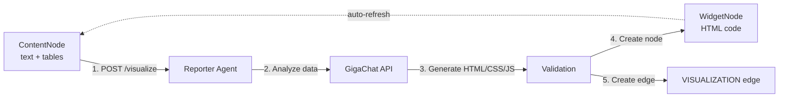

# WidgetNode Generation — Быстрый старт

**Дата создания**: 01.02.2026  
**Статус**: ✅ Реализовано

---

## 🎯 Что это?

**WidgetNode Generation System** — автоматическая генерация интерактивных визуализаций из ContentNode с помощью Reporter Agent.

**Ключевые фичи:**
- 🎨 **AI-генерация HTML/CSS/JS** — полный код визуализации с нуля
- 🔗 **VISUALIZATION edge** — связь ContentNode → WidgetNode
- 🔄 **Автообновление** — виджет обновляется при изменении данных
- 🛡️ **Валидация безопасности** — проверка на опасные паттерны

---

## 🚀 Быстрый старт

### 1. Создайте ContentNode с данными

```bash
POST /api/v1/content-nodes
Content-Type: application/json
Authorization: Bearer <token>

{
  "board_id": "board_123",
  "content": {
    "text": "Sales data for Q4 2025",
    "tables": [
      {
        "id": "sales_table",
        "name": "sales",
        "columns": [
          {"name": "region", "type": "string"},
          {"name": "sales", "type": "number"},
          {"name": "profit", "type": "number"}
        ],
        "rows": [
          {"region": "North", "sales": 450000, "profit": 120000},
          {"region": "South", "sales": 380000, "profit": 95000},
          {"region": "East", "sales": 520000, "profit": 145000},
          {"region": "West", "sales": 410000, "profit": 108000}
        ]
      }
    ]
  },
  "lineage": {
    "operation": "manual",
    "timestamp": "2026-02-01T10:00:00Z"
  },
  "position": {"x": 100, "y": 100}
}
```

**Ответ**:
```json
{
  "id": "content_456",
  "board_id": "board_123",
  "content": {...},
  "created_at": "2026-02-01T10:00:00Z"
}
```

### 2. Создайте визуализацию

```bash
POST /api/v1/content-nodes/content_456/visualize
Content-Type: application/json
Authorization: Bearer <token>

{
  "user_prompt": "create bar chart showing sales and profit by region",
  "widget_name": "Q4 Sales Overview",
  "auto_refresh": true
}
```

**Ответ**:
```json
{
  "widget_node_id": "widget_789",
  "edge_id": "edge_abc",
  "status": "success"
}
```

### 3. Получите WidgetNode

```bash
GET /api/v1/boards/board_123/widget-nodes/widget_789
Authorization: Bearer <token>
```

**Ответ**:
```json
{
  "id": "widget_789",
  "board_id": "board_123",
  "name": "Q4 Sales Overview",
  "description": "Bar chart showing sales and profit by region",
  "html_code": "<!DOCTYPE html>\n<html>...",
  "css_code": null,
  "js_code": null,
  "config": {
    "chart_type": "bar",
    "libraries": ["chart.js"]
  },
  "auto_refresh": true,
  "generated_by": "reporter_agent",
  "generation_prompt": "create bar chart showing sales and profit by region",
  "position": {"x": 450, "y": 100},
  "width": 400,
  "height": 300
}
```

---

## 📚 Примеры визуализаций

### Автоматическая визуализация

Если не указан `user_prompt`, Reporter Agent анализирует данные и создаёт подходящую визуализацию:

```bash
POST /api/v1/content-nodes/{id}/visualize
{}
```

### Линейный график

```bash
{
  "user_prompt": "create line chart showing sales trends over time"
}
```

### Таблица с поиском

```bash
{
  "user_prompt": "create table with search and sorting"
}
```

### KPI карточки

```bash
{
  "user_prompt": "create KPI cards showing total sales, average profit, and top region"
}
```

### Пользовательская визуализация

```bash
{
  "user_prompt": "create heatmap showing sales by region and quarter with color gradient"
}
```

---

## 🏗️ Архитектура



---

## 🔧 Интеграция с Frontend

### React пример

```typescript
import { api } from '@/lib/api';

async function createVisualization(contentNodeId: string) {
  try {
    const response = await api.visualizeContentNode(contentNodeId, {
      user_prompt: 'create bar chart',
      widget_name: 'Sales Chart',
      auto_refresh: true
    });
    
    console.log('Widget created:', response.widget_node_id);
    
    // Добавить WidgetNode на canvas
    addWidgetToCanvas(response.widget_node_id);
    
  } catch (error) {
    console.error('Visualization failed:', error);
  }
}
```

### Рендеринг WidgetNode в iframe

```typescript
function WidgetNodeComponent({ widget }: { widget: WidgetNode }) {
  const iframeRef = useRef<HTMLIFrameElement>(null);
  
  useEffect(() => {
    if (iframeRef.current && widget.html_code) {
      const doc = iframeRef.current.contentDocument;
      doc?.open();
      doc?.write(widget.html_code);
      doc?.close();
      
      // Send data updates via postMessage
      window.addEventListener('message', handleWidgetMessage);
    }
  }, [widget.html_code]);
  
  return (
    <iframe
      ref={iframeRef}
      sandbox="allow-scripts"
      style={{ width: widget.width, height: widget.height }}
    />
  );
}
```

---

## 🛡️ Безопасность

Reporter Agent валидирует сгенерированный код:

- ✅ Только CDN библиотеки (Chart.js@4, D3.js@7, Plotly 2.35, ECharts@5, Three.js 0.160)
- ✅ Паттерн `waitForLibrary()` для асинхронной загрузки CDN
- ✅ Нет `eval()`, `Function()`
- ✅ Нет внешних API calls
- ✅ Нет localStorage/cookies
- ✅ postMessage для передачи данных

---

## 🔍 Отладка

### Логи Reporter Agent

```
INFO:agent.reporter:📊 Creating visualization: create bar chart...
INFO:httpx:HTTP Request: POST https://gigachat.devices.sberbank.ru/api/v1/chat/completions "HTTP/1.1 200 OK"
INFO:agent.reporter:✅ Visualization created successfully (chart)
```

### Ошибки валидации

```json
{
  "widget_node_id": null,
  "edge_id": null,
  "status": "error",
  "error": "Generated HTML failed validation: eval() usage detected"
}
```

---

## 📖 См. также

- [WIDGETNODE_GENERATION_SYSTEM.md](./WIDGETNODE_GENERATION_SYSTEM.md) — Полная спецификация
- [API.md](./API.md) — API документация
- [MULTI_AGENT_SYSTEM.md](./MULTI_AGENT_SYSTEM.md) — Reporter Agent архитектура
