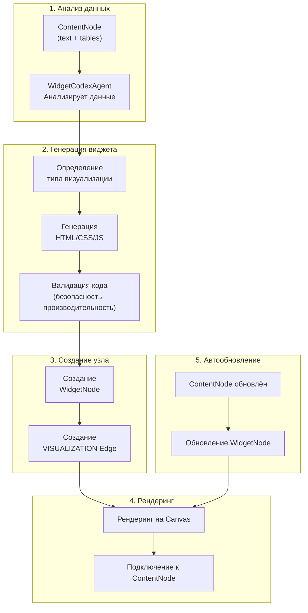
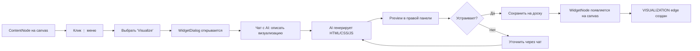

# Система генерации виджетов (WidgetNode Generation)

## Executive Summary

**WidgetNode Generation System** — система автоматической генерации интерактивных визуализаций из данных ContentNode с помощью **WidgetCodexAgent** (и **WidgetController**), LLM через **`LLMRouter`**. **Reporter** формирует итоговый текст пайплайна, но не является основным генератором HTML/CSS/JS виджета.

**Ключевые концепции:**
- **WidgetCodexAgent** генерирует полный HTML/CSS/JS код визуализации (без шаблонов)
- **WidgetNode** создаётся из **ContentNode** через VISUALIZATION edge
- **Итеративная генерация** — чат-интерфейс для уточнения визуализации
- **Автообновление** при изменении родительского ContentNode
- **Безопасный рендеринг** через sandboxed iframe

---

## Архитектура

### Конвейер генерации



### Поддерживаемые типы визуализаций

AI генерирует любые визуализации с нуля:
- 📊 Bar charts (вертикальные/горизонтальные)
- 📈 Line charts (временные ряды)
- 🥧 Pie charts (распределения)
- 📋 Таблицы (с сортировкой, фильтрами, поиском)
- 📇 KPI cards (метрики с трендами)
- 🗺️ Heatmaps, Scatter plots, Gauge charts
- 🎨 Custom HTML визуализации

---

## Пользовательский Workflow

### Создание визуализации



### Интерфейс WidgetDialog (Dual Panel)

**Левая панель (40%)**:
- **📊 Данные источника** — таблицы ContentNode (collapsed preview)
- **💬 Чат с AI** — итеративный диалог для уточнения визуализации
- **Поле ввода** — описание/инструкции для AI

**Правая панель (60%)**:
- **👁️ Preview** — live-рендер виджета в sandboxed iframe
- **📝 Code** — Monaco Editor для редактирования HTML/CSS/JS

**Нижняя панель**:
- Auto-refresh toggle, Refresh interval, Сохранить на доску

### Редактирование существующего виджета

Двойной клик на WidgetNode или пункт меню "Edit" → WidgetDialog с восстановленной историей чата, текущим кодом и настройками auto-refresh.

---

## API

### Создание визуализации (итеративная генерация через чат)

```
POST /api/v1/content-nodes/{id}/visualize
{
  "user_prompt": "Создай bar chart с топ-10 значениями",
  "existing_widget_code": "...",   // для уточнений (опционально)
  "chat_history": [...]            // история диалога (опционально)
}

Response:
{
  "widget_code": "<!DOCTYPE html>...",
  "widget_name": "Sales Chart",
  "description": "Bar chart showing sales by region"
}
```

### Быстрый старт через API

```bash
# 1. Создать визуализацию из ContentNode
POST /api/v1/content-nodes/content_456/visualize
{
  "user_prompt": "create bar chart showing sales and profit by region",
  "widget_name": "Q4 Sales Overview",
  "auto_refresh": true
}

# Ответ:
{
  "widget_node_id": "widget_789",
  "edge_id": "edge_abc",
  "status": "success"
}
```

### Другие операции

```
# Обновить WidgetNode (manual edit)
PATCH /api/v1/boards/{boardId}/widget-nodes/{widgetId}

# Удалить WidgetNode
DELETE /api/v1/boards/{boardId}/widget-nodes/{widgetId}
```

---

## Frontend

### Компоненты

| Компонент       | Файл                                   | Назначение                                        |
| --------------- | -------------------------------------- | ------------------------------------------------- |
| WidgetDialog    | `components/board/WidgetDialog.tsx`    | Главный dual-panel диалог создания/редактирования |
| ContentNodeCard | `components/board/ContentNodeCard.tsx` | Пункт "Visualize" в меню                          |
| WidgetNodeCard  | `components/board/WidgetNodeCard.tsx`  | Sandboxed iframe рендеринг                        |

### State management

```typescript
interface VisualizationState {
  html: string
  css: string
  js: string
  description: string
  widget_code?: string   // Full HTML from GigaChat
  widget_name?: string
}

interface ChatMessage {
  id: string
  role: 'user' | 'assistant'
  content: string
  timestamp: Date
}
```

### API injection в iframe

Виджет получает доступ к данным и фильтрам через injected API (`widgetApiScript.ts`):

```javascript
// === Данные ===
window.CONTENT_NODE_ID        // ID источника данных
window.fetchContentData()
// Возвращает { tables: [...] } — уже с применёнными фильтрами.
// Если filteredNodeData передан (precomputedTables) — отдаёт precomputed без HTTP-запроса.
// Иначе: GET /api/v1/content-nodes/{id}?filters=<encoded>

// === Фильтры — установка ===
window.toggleFilter(columnName, value, contentNodeId?)
// Toggle: добавляет фильтр если нет, удаляет если есть. ОСНОВНОЙ метод.
window.addFilter(columnName, value, contentNodeId?)
window.removeFilter(columnName)

// === Фильтры — состояние ===
window.isFilterActive(columnName, value)  // → boolean, для визуального выделения
window.getActiveFilters()                 // → FilterExpression | null, НЕ фильтровать вручную!

// === Автообновление ===
window.startAutoRefresh(callback, intervalMs)
window.stopAutoRefresh(timerId)

// === Resize ===
window.__widgetResize = () => { /* вызывается при изменении размера */ }
```

**Ключевые правила**:
- `fetchContentData()` всегда возвращает **уже отфильтрованные** данные — фильтровать вручную внутри виджета нельзя
- `isFilterActive()` — только для визуального выделения (подсветка активного элемента)
- `toggleFilter()` отправляет `postMessage` наверх → `filterStore` → `computeFiltered()` → все виджеты обновятся

### React интеграция

```typescript
import { api } from '@/lib/api';

async function createVisualization(contentNodeId: string) {
  const response = await api.visualizeContentNode(contentNodeId, {
    user_prompt: 'create bar chart',
    widget_name: 'Sales Chart',
    auto_refresh: true
  });
  addWidgetToCanvas(response.widget_node_id);
}
```

---

## WidgetCodex Agent (генерация виджетов)

`WidgetCodexAgent` (`apps/backend/app/services/multi_agent/agents/widget_codex.py`) — специализированный агент для генерации виджетов. Заменяет `ReporterAgent` в части widget generation.

### Процесс генерации

1. **Анализ ContentNode** — структура данных, имена столбцов, типы, первые строки
2. **Генерация кода** — полный HTML/CSS/JS (full document) с нуля по запросу пользователя
3. **Автосанаторы** — исправление типичных ошибок LLM перед сохранением:
   - `_strip_markdown_from_code` — удаление `###` артефактов
   - `_fix_echarts_onclick_in_series` — замена `onclick` в series-конфиге
   - `_fix_invalid_formatter` — удаление невалидных `${...}` в ECharts formatter
4. **Создание WidgetNode** — сохранение + VISUALIZATION edge
5. **Обновление** — повторный запрос в `WidgetDialog` обновляет `html_code` существующего WidgetNode

### Обязательные требования к каждому виджету

Каждый виджет должен содержать:
- Определение `dimCol` — имя столбца измерения
- `isFilterActive(dimCol, value)` — для визуального выделения активного значения
- Click-handler через `window.chartInstance.on('click', ...)` (ECharts) или inline-обработчик (таблицы)
- `window.toggleFilter(dimCol, value)` внутри click-handler

### Структура сгенерированного HTML

```html
<!DOCTYPE html>
<html>
<head>
  <meta charset="utf-8">
  <link rel="stylesheet" href="/libs/fonts/inter.css">
  <style>
    /* ── CUSTOM_STYLES_START ── */
    /* ── CUSTOM_STYLES_END ── */
  </style>
</head>
<body>
  <div id="chart">...</div>
  <!-- ── CUSTOM_SCRIPTS_START ── -->
  <script src="/libs/echarts.min.js"></script>
  <!-- ── CUSTOM_SCRIPTS_END ── -->
  <script>
    async function render() {
      const data = await window.fetchContentData()
      /* ... ── RENDER_BODY_START ── ... ── RENDER_BODY_END ── */
    }
    render()
    if (window.startAutoRefresh) window.startAutoRefresh(render)
  </script>
</body>
</html>
```

Маркеры `RENDER_BODY_START` / `RENDER_BODY_END` используются бэкендом для замены только тела рендеринга при итеративных уточнениях.

---

## Безопасность

### Iframe sandbox

- `sandbox="allow-scripts allow-same-origin"`
- Изоляция JavaScript от основного приложения
- Ограничение доступа к родительскому DOM

### Валидация кода (Backend)

| Проверка             | Детали                                                     |
| -------------------- | ---------------------------------------------------------- |
| Запрещённые паттерны | `eval()`, `Function()`, `document.write`, `XMLHttpRequest` |
| Внешние скрипты      | Только CDN: Chart.js@4, D3@7, Plotly 2.35, ECharts@5       |
| Паттерн загрузки     | `waitForLibrary()` для асинхронной загрузки CDN            |
| Размер               | HTML < 100KB, CSS < 50KB, JS < 50KB                        |

### Content Security Policy

```html
<meta http-equiv="Content-Security-Policy" 
      content="default-src 'self'; script-src 'self' 'unsafe-inline' https://cdn.jsdelivr.net https://cdn.plot.ly;">
```

---

## Примеры AI-генерированного кода

> Все примеры ниже — AI-генерированный HTML/CSS/JS. **WidgetCodexAgent** генерирует код с нуля для каждой визуализации.

<details>
<summary>📊 Метрика (KPI Card)</summary>

```html
<div class="widget metric-widget">
  <div class="metric-header">
    <h3>Total Revenue</h3>
    <span class="metric-period">Last 30 days</span>
  </div>
  <div class="metric-body">
    <div class="metric-value">$1,234,567</div>
    <div class="metric-change trend-up">
      <span class="arrow">↑</span>
      <span class="percent">+12.5%</span>
    </div>
  </div>
  <div class="metric-footer">
    Previous: $1,098,234 | Target: $1,500,000
  </div>
</div>
```
</details>

<details>
<summary>📊 Столбчатая диаграмма (Chart.js)</summary>

```javascript
const chart = new Chart(ctx, {
  type: 'bar',
  data: {
    labels: ['North', 'South', 'East', 'West'],
    datasets: [{
      label: 'Sales ($)',
      data: [450000, 380000, 520000, 290000],
      backgroundColor: ['#3b82f6', '#10b981', '#f59e0b', '#ef4444']
    }]
  },
  options: {
    responsive: true,
    maintainAspectRatio: false
  }
});
```
</details>

---

## Производительность

| Этап                        | Время       |
| --------------------------- | ----------- |
| GigaChat API                | ~3-5 секунд |
| Создание WidgetNode         | <100ms      |
| Создание VISUALIZATION edge | <50ms       |
| Smart positioning           | <10ms       |

**Рекомендации:**
- Для больших датасетов (>1000 строк) → AI видит только preview (первые 3 строки)
- Для сложных визуализаций → указывать конкретный тип в чате

---

## См. также

- [ECHARTS_WIDGET_REFERENCE.md](./ECHARTS_WIDGET_REFERENCE.md) — справочник типов графиков ECharts
- [WIDGET_SUGGESTIONS_SYSTEM.md](./WIDGET_SUGGESTIONS_SYSTEM.md) — AI-рекомендации по улучшению виджетов
- [API.md](./API.md) — полная API документация
- [SMART_NODE_PLACEMENT.md](./SMART_NODE_PLACEMENT.md) — алгоритм размещения нод
