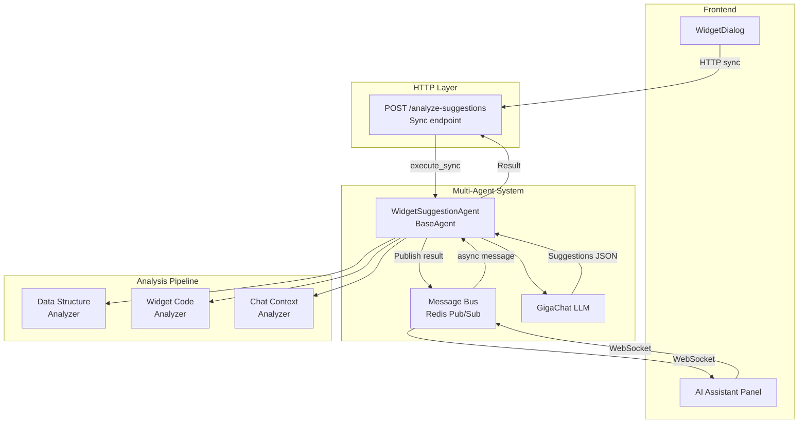
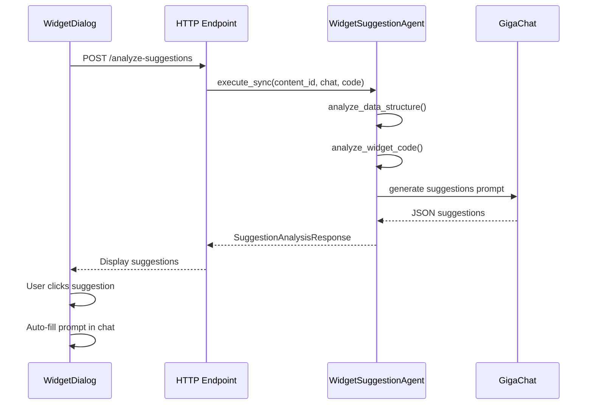

# Widget Suggestions System — AI-Powered Recommendations

**Дата**: 02.2026  
**Статус**: ✅ Полностью реализован (Backend + Frontend)

**Backend:**
- ✅ WidgetSuggestionAgent (BaseAgent с multi-agent support)
- ✅ Pydantic schemas (widget_suggestions.py)
- ✅ HTTP endpoint POST /content-nodes/{id}/analyze-suggestions
- ✅ Multi-Agent Engine регистрация (singleton в main.py)
- ✅ Полная интеграция с Message Bus и GigaChat
- ✅ Улучшенный JSON parsing (markdown extraction)
- ✅ Два режима промптов: новый виджет vs улучшение

**Frontend:**
- ✅ SuggestionsPanel.tsx (компактные теги с тултипами)
- ✅ API integration (api.ts)
- ✅ WidgetDialog.tsx integration (между чатом и полем ввода)
- ✅ Auto-refresh при изменении widget_code
- ✅ Прямая отправка промптов в AI (клик на тег)
- ✅ Global tooltip с createPortal
- ✅ Auto-resize текстового поля ввода

---

## 🎯 Executive Summary

**Widget Suggestions System** — интеллектуальная рекомендательная система в WidgetDialog, которая анализирует:
- 📊 Входные данные (ContentNode: таблицы, текст)
- 💬 Историю диалога с AI
- 📝 Текущий код виджета (если существует)

И генерирует контекстные рекомендации:
- ✨ **Для нового виджета**: Варианты типов визуализаций (Bar Chart, Line Graph, Pie Chart и др.)
- 🔄 **Для существующего виджета**: Улучшения, альтернативы, стилистические правки, инсайты

**Ключевые фичи:**
- Компактный UI с тегами (max-width: 120px) и глобальными тултипами
- Клик на тег → прямая отправка промпта в AI (без заполнения input)
- Обновление рекомендаций только при изменении widget_code (не при каждом сообщении)
- Приоритизация (high/medium/low) с цветовой кодировкой
- Адаптивный промпт: разные стратегии для создания vs улучшения виджета

---

## 📊 Архитектура

### Multi-Agent Integration



### Data Flow



---

## 🔧 Backend Implementation

### 1. WidgetSuggestionAgent (Multi-Agent System)

**Файл**: `apps/backend/app/services/multi_agent/agents/widget_suggestions.py`

**Ключевые особенности:**
- ✅ Наследник `BaseAgent` (интеграция с Multi-Agent System)
- ✅ Dual execution: `execute_sync()` для HTTP, `execute()` для Message Bus (pending db management)
- ✅ Анализ данных: типы колонок, cardinality, numeric/categorical/temporal
- ✅ Анализ кода: детект библиотек (Chart.js, Plotly, D3), интерактивности, типа графика
- ✅ LLM промпт: детальный JSON schema для GigaChat
- ✅ 5 типов рекомендаций: improvement, alternative, insight, library, style

<details>
<summary>📄 Полный код WidgetSuggestionAgent (развернуть)</summary>

```python
class WidgetSuggestionAgent(BaseAgent):
    """
    AI Agent for generating widget improvement suggestions.
    
    Usage:
    - HTTP sync: agent.execute_sync(db, content_id, chat, code)
    - Message Bus: await message_bus.publish("suggestions.analyze", payload) [pending]
    """
    
    def __init__(self, message_bus, gigachat_service):
        super().__init__(
            agent_name="suggestions",
            message_bus=message_bus
        )
        self.gigachat = gigachat_service
        self.logger = logging.getLogger(f"agent.{self.agent_name}")
    
    async def execute_sync(
        self,
        db: AsyncSession,
        content_node_id: str,
        chat_history: List[Dict[str, str]],
        current_widget_code: str | None,
        max_suggestions: int = 5
    ) -> Dict[str, Any]:
        """Synchronous execution for HTTP endpoints."""
        return await self._analyze_and_suggest(
            db=db,
            content_node_id=content_node_id,
            chat_history=chat_history,
            widget_code=current_widget_code,
            max_suggestions=max_suggestions
        )
    
    async def _analyze_and_suggest(self, db, content_node_id, chat_history, widget_code, max_suggestions):
        """Core analysis logic."""
        # 1. Fetch ContentNode
        content_node = await ContentNodeService.get_content_node(db, content_node_id)
        
        # 2. Analyze data structure (columns, types, cardinality)
        data_analysis = self._analyze_data_structure(content_node)
        
        # 3. Analyze widget code (libraries, interactivity)
        code_analysis = self._analyze_widget_code(widget_code) if widget_code else None
        
        # 4. Build LLM prompt with JSON schema
        prompt = self._build_suggestions_prompt(
            data_analysis, code_analysis, chat_history, max_suggestions
        )
        
        # 5. Call GigaChat
        response = await self.gigachat.generate_text(
            prompt=prompt, temperature=0.5, max_tokens=2000
        )
        
        # 6. Parse JSON and return
        suggestions_data = json.loads(response)
        return {
            "suggestions": suggestions_data.get("suggestions", []),
            "analysis_summary": {
                "data_structure": data_analysis,
                "widget_code": code_analysis,
                "chat_context": self._summarize_chat(chat_history)
            }
        }
    
    def _analyze_data_structure(self, content_node):
        """Analyze tables: columns, types, cardinality."""
        tables = content_node.content.get("tables", [])
        return {
            "table_count": len(tables),
            "columns": self._infer_column_types(tables),
            "numeric_columns": [...],
            "categorical_columns": [...],
            "temporal_columns": [...]
        }
    
    def _analyze_widget_code(self, widget_code):
        """Detect libraries, interactivity, chart type."""
        return {
            "library": "Chart.js" | "Plotly" | "D3" | ...,
            "has_interactivity": bool,
            "detected_chart_type": "bar" | "line" | ...
        }
```

</details>
        return await self._analyze_and_suggest(
            content_node_id=content_node_id,
            chat_history=chat_history,
            widget_code=current_widget_code,
            max_suggestions=max_suggestions
        )
    
    async def _analyze_and_suggest(
        self,
        content_node_id: str,
        chat_history: List[Dict[str, str]],
        widget_code: str | None,
        max_suggestions: int
    ) -> Dict[str, Any]:
        """Core analysis logic."""
        
        # 1. Fetch ContentNode
        content_node = await ContentNodeService.get_content_node(self.db, content_node_id)
        if not content_node:
            raise ValueError(f"ContentNode {content_node_id} not found")
        
        # 2. Analyze data structure
        data_analysis = self._analyze_data_structure(content_node)
        
        # 3. Analyze widget code
        code_analysis = None
        if widget_code:
            code_analysis = self._analyze_widget_code(widget_code)
        
        # 4. Build LLM prompt
        prompt = self._build_suggestions_prompt(
            data_analysis=data_analysis,
            code_analysis=code_analysis,
            chat_history=chat_history,
            max_suggestions=max_suggestions
        )
        
        # 5. Call GigaChat
        response = await self.llm.generate_text(
            prompt=prompt,
            temperature=0.5,
            max_tokens=2000
        )
        
        # 6. Parse JSON response
        suggestions_data = json.loads(response)
        
        # 7. Format response
        suggestions = [
            {
                "id": f"sug_{i}",
                "type": s["type"],
                "priority": s["priority"],
                "title": s["title"],
                "description": s["description"],
                "prompt": s["prompt"],
                "reasoning": s.get("reasoning", "")
            }
            for i, s in enumerate(suggestions_data["suggestions"])
        ]
        
        return {
            "suggestions": suggestions,
            "analysis_summary": {
                "data_structure": data_analysis.get("summary", ""),
                "current_visualization": code_analysis.get("summary", "") if code_analysis else "Нет виджета",
                "chat_context": self._summarize_chat(chat_history)
            }
        }
    
    # ... _analyze_data_structure(), _analyze_widget_code(), etc.
    # (Same implementation as in original WidgetSuggestionsService)
```

### 2. Agent Registration

**Файл**: `apps/backend/app/services/multi_agent/engine.py`

```python
from .agents.widget_suggestions import WidgetSuggestionAgent

class MultiAgentEngine:
    def _initialize_agents(self):
        # ... existing agents
        
        # Suggestions (for Widget AI) - ✅ РЕАЛИЗОВАНО
        if "suggestions" in self.enable_agents:
            self.agents["suggestions"] = WidgetSuggestionAgent(
                message_bus=self.message_bus,
                gigachat_service=self.gigachat
            )
```

### 3. HTTP Endpoint (Sync Access)

**`POST /api/v1/content-nodes/{content_id}/analyze-suggestions`**

**Implementation:** Direct sync call to WidgetSuggestionAgent (bypasses Message Bus for speed)

**Request Body:**
```json
{
  "chat_history": [
    {"role": "user", "content": "создай bar chart"},
    {"role": "assistant", "content": "Создан bar chart..."}
  ],
  "current_widget_code": "<!DOCTYPE html>...",
  "max_suggestions": 5
}
```

**Response:**
```json
{
  "suggestions": [
    {
      "id": "sug_1",
      "type": "improvement",
      "priority": "high",
      "title": "Добавить интерактивность",
      "description": "График не имеет hover эффектов. Рекомендуется добавить tooltips для улучшения UX.",
      "prompt": "добавь интерактивные tooltips с деталями при наведении",
      "reasoning": "Анализ кода показал отсутствие обработчиков событий"
    },
    {
      "id": "sug_2",
      "type": "alternative",
      "priority": "medium",
      "title": "Попробовать line chart",
      "description": "Данные имеют временную компоненту (date column). Line chart лучше покажет тренды.",
      "prompt": "преобразуй в line chart для отображения динамики",
      "reasoning": "Обнаружена колонка 'date' с временными метками"
    },
    {
      "id": "sug_3",
      "type": "insight",
      "priority": "medium",
      "title": "Группировка по регионам",
      "description": "Обнаружена колонка 'region' с 5 уникальными значениями. Можно добавить группировку.",
      "prompt": "добавь группировку данных по регионам с цветовой кодировкой",
      "reasoning": "Категориальная переменная 'region' с умеренной кардинальностью"
    },
    {
      "id": "sug_4",
      "type": "library",
      "priority": "low",
      "title": "Использовать ECharts",
      "description": "Для текущего типа графика ECharts предоставляет больше встроенных интерактивных фич.",
      "prompt": "перепиши график используя ECharts вместо Chart.js",
      "reasoning": "Chart.js используется, но ECharts лучше подходит для сложных интерактивных графиков"
    },
    {
      "id": "sug_5",
      "type": "style",
      "priority": "low",
      "title": "Улучшить цветовую схему",
      "description": "Используются дефолтные цвета. Рекомендуется применить профессиональную палитру.",
      "prompt": "примени современную цветовую палитру (например, Tailwind colors)",
      "reasoning": "Обнаружены хардкоженные базовые цвета в CSS"
    }
  ],
  "analysis_summary": {
    "data_structure": "1 таблица, 1000 строк, 5 колонок (2 числовые, 2 категориальные, 1 временная)",
    "current_visualization": "Bar chart (Chart.js), статический, без интерактивности",
    "chat_context": "Пользователь запросил простой график, не указывал требования к интерактивности"
  }
}
```

### 6. Schemas

<details>
<summary>📄 apps/backend/app/schemas/widget_suggestions.py (развернуть)</summary>

```python
from pydantic import BaseModel, Field
from typing import List, Dict, Optional
from enum import Enum


class SuggestionType(str, Enum):
    IMPROVEMENT = "improvement"
    ALTERNATIVE = "alternative"
    INSIGHT = "insight"
    LIBRARY = "library"
    STYLE = "style"


class SuggestionPriority(str, Enum):
    HIGH = "high"
    MEDIUM = "medium"
    LOW = "low"


class Suggestion(BaseModel):
    id: str = Field(..., description="Unique suggestion ID")
    type: SuggestionType = Field(..., description="Type of suggestion")
    priority: SuggestionPriority = Field(..., description="Priority level")
    title: str = Field(..., description="Short title (< 50 chars)")
    description: str = Field(..., description="Detailed description")
    prompt: str = Field(..., description="Ready-to-send user prompt")
    reasoning: str = Field("", description="Why this suggestion is useful")


class SuggestionAnalysisRequest(BaseModel):
    chat_history: List[Dict[str, str]] = Field(default_factory=list, description="Chat history")
    current_widget_code: Optional[str] = Field(None, description="Current widget HTML code")
    max_suggestions: int = Field(5, ge=1, le=10, description="Max number of suggestions")


class SuggestionAnalysisResponse(BaseModel):
    suggestions: List[Suggestion] = Field(..., description="List of suggestions")
    analysis_summary: Dict[str, str] = Field(..., description="Summary of analysis")
```

</details>

### 4. HTTP Route (Sync Execution)

<details>
<summary>📄 apps/backend/app/routes/content_nodes.py (добавить endpoint)</summary>

```python
from app.services.multi_agent.agents.widget_suggestions import WidgetSuggestionAgent
from app.core.llm_client import get_llm_client

@router.post("/{content_id}/analyze-suggestions", response_model=SuggestionAnalysisResponse)
async def analyze_widget_suggestions(
    content_id: str,
    request: SuggestionAnalysisRequest,
    db: AsyncSession = Depends(get_db),
    current_user: User = Depends(get_current_user)
):
    """
    Analyze ContentNode and generate AI-powered suggestions for widget improvements.
    
    Architecture:
    - Uses WidgetSuggestionAgent.execute_sync() for immediate response
    - Bypasses Message Bus (WidgetDialog needs instant suggestions)
    - Agent still benefits from shared LLM client, logging, metrics
    
    Use cases:
    - Initial widget creation (suggest best visualization type)
    - Iterative improvements (suggest enhancements after each AI response)
    - Alternative approaches (suggest other chart types)
    """
    try:
        # Get LLM client and create agent instance
        llm = get_llm_client()
        agent = WidgetSuggestionAgent(llm, db)
        
        # Synchronous execution (no Message Bus)
        result = await agent.execute_sync(
            content_node_id=content_id,
            chat_history=request.chat_history,
            current_widget_code=request.current_widget_code,
            max_suggestions=request.max_suggestions
        )
        
        return SuggestionAnalysisResponse(**result)
    
    except ValueError as e:
        raise HTTPException(status_code=404, detail=str(e))
    except Exception as e:
        logger.error(f"Suggestion analysis failed: {e}", exc_info=True)
        raise HTTPException(status_code=500, detail=f"Analysis failed: {str(e)}")
```

</details>

### 5. Async Execution (AI Assistant Panel)

<details>
<summary>📄 Future: Message Bus integration for AI Assistant</summary>

```python
# AI Assistant backend handler
@socketio.on('assistant:analyze_widget')
async def handle_analyze_widget(data):
    """Async suggestion analysis via Message Bus."""
    
    message = AgentMessage(
        id=str(uuid.uuid4()),
        type=AgentMessageType.TASK,
        sender="ai_assistant",
        receiver="suggestions_agent",
        payload={
            "content_node_id": data["widget_id"],
            "chat_history": [],
            "current_widget_code": data.get("widget_code"),
            "max_suggestions": 5
        }
    )
    
    # Publish to Message Bus
    await message_bus.publish(
        topic="suggestions.analyze",
        message=message
    )
    
    # Result will be sent via WebSocket when agent completes
```

**Benefits:**
- Non-blocking (UI doesn't wait)
- Automatic retry on failure
- Progress tracking via Message Bus metrics
- Can batch analyze multiple widgets

</details>

---

## 🎨 Frontend Implementation

### 1. Suggestions Panel Component

**Файл**: `apps/web/src/components/board/SuggestionsPanel.tsx`

**Финальная реализация:**

```typescript
// Компактный UI с тегами вместо карточек
const SuggestionsPanel = ({ contentNodeId, chatHistory, currentWidgetCode, onSuggestionClick }) => {
    const [suggestions, setSuggestions] = useState([])
    const [hoveredSuggestion, setHoveredSuggestion] = useState(null)
    const [tooltipPosition, setTooltipPosition] = useState({ top: 0, left: 0 })
    
    // Load suggestions only when widget code changes
    useEffect(() => {
        if (currentWidgetCode) {
            loadSuggestions()
        }
    }, [currentWidgetCode])
    
    return (
        <div className="p-2">
            {/* Компактные теги (max-width: 120px) */}
            <div className="flex flex-wrap gap-1.5">
                {suggestions.map(suggestion => (
                    <Badge
                        className="text-[10px] px-2 py-0.5 max-w-[120px] cursor-pointer"
                        onClick={() => onSuggestionClick(suggestion.prompt)}
                        onMouseEnter={(e) => {
                            // Calculate tooltip position
                            const rect = e.currentTarget.getBoundingClientRect()
                            setTooltipPosition({ top: rect.bottom + 8, left: rect.left })
                            setHoveredSuggestion(suggestion.id)
                        }}
                    >
                        <Icon className="w-2.5 h-2.5" />
                        <span className="truncate">{suggestion.title}</span>
                    </Badge>
                ))}
            </div>
            
            {/* Global tooltip via createPortal */}
            {hoveredSuggestion && createPortal(
                <div 
                    className="fixed w-72 bg-white shadow-xl rounded-lg p-3 z-[9999]"
                    style={{ top: `${tooltipPosition.top}px`, left: `${tooltipPosition.left}px` }}
                >
                    {/* Description, reasoning, priority */}
                </div>,
                document.body
            )}
        </div>
    )
}
```

**Ключевые особенности:**
- ✅ Тег размером 10px, max-width 120px (очень компактный)
- ✅ Тултип рендерится в `document.body` через `createPortal` (не обрезается)
- ✅ `z-[9999]` для отображения поверх всех элементов
- ✅ Обновление только при изменении `currentWidgetCode` (не при каждом сообщении)
- ✅ Клик → прямая отправка промпта в AI

### 2. Integration in WidgetDialog

**Файл**: `apps/web/src/components/board/WidgetDialog.tsx`

**Расположение**: Между чатом и полем ввода (оптимально для UX)

```typescript
// Layout structure:
<div className="flex-1 flex flex-col">
    {/* Chat Messages */}
    <div className="flex-1 overflow-y-auto px-3 pb-3 space-y-2">
        {chatMessages.map(msg => ...)}
    </div>
    
    {/* AI Suggestions Panel - НОВОЕ */}
    <div className="border-t overflow-y-auto max-h-[120px]">
        <SuggestionsPanel
            contentNodeId={contentNode.id}
            chatHistory={chatMessages.map(msg => ({ role: msg.role, content: msg.content }))}
            currentWidgetCode={currentVisualization?.widget_code}
            onSuggestionClick={(prompt) => {
                // Прямая отправка промпта в AI
                handleSendMessage(prompt)
            }}
        />
    </div>
    
    {/* Chat Input */}
    <div className="p-2 border-t">
        <Textarea 
            ref={textareaRef}
            value={inputValue}
            onChange={handleInputChange}
            className="min-h-[32px] resize-none text-sm"
            style={{ height: '32px' }}
            rows={1}
        />
    </div>
</div>
```

**Изменения в handleSendMessage:**

```typescript
const handleSendMessage = async (messageText?: string) => {
    const textToSend = messageText || inputValue.trim()
    if (!textToSend || isGenerating) return
    
    // Создание сообщения и отправка в AI
    // ...
}
```

**Auto-resize текстового поля:**

```typescript
const textareaRef = useRef<HTMLTextAreaElement>(null)

const handleInputChange = (e: React.ChangeEvent<HTMLTextAreaElement>) => {
    setInputValue(e.target.value)
    
    // Auto-resize до max 120px
    const textarea = e.target
    textarea.style.height = 'auto'
    textarea.style.height = `${Math.min(textarea.scrollHeight, 120)}px`
}
```

**Ключевые особенности:**
- ✅ Рекомендации видны перед полем ввода (логичнее для UX)
- ✅ `max-h-[120px]` — компактное отображение
- ✅ Клик на тег → `handleSendMessage(prompt)` без заполнения input
- ✅ Textarea auto-resize: min 32px, max 120px
- ✅ `items-end` на flex контейнере — кнопка отправки выравнивается по низу

### 3. API Client Method

<details>
<summary>📄 apps/web/src/services/api.ts (добавить метод)</summary>

```typescript
export const contentNodesAPI = {
    // ... existing methods

    analyzeSuggestions: (contentId: string, data: {
        chat_history: Array<{ role: string; content: string }>
        current_widget_code: string | null
        max_suggestions: number
    }) => apiClient.post(`/content-nodes/${contentId}/analyze-suggestions`, data),
}
```

</details>

---

## 🎯 Use Cases

### 1. Начальная визуализация (нет виджета)

**Входные данные:**
- Таблица с колонками: `date`, `sales`, `region`
- Нет истории чата
- Нет текущего виджета

**Рекомендации:**
1. **Альтернатива (high)**: "Line chart для временных рядов" → `создай line chart динамики продаж по датам`
2. **Инсайт (medium)**: "Группировка по регионам" → `добавь разделение по регионам с разными цветами`
3. **Улучшение (medium)**: "Интерактивность" → `сделай график интерактивным с tooltips и zoom`

### 2. Улучшение существующего виджета

**Входные данные:**
- Текущий виджет: Bar chart (Chart.js), статический
- История: "создай bar chart"
- Данные: те же

**Рекомендации:**
1. **Улучшение (high)**: "Добавить интерактивность" → `добавь hover эффекты и tooltips с деталями`
2. **Стиль (medium)**: "Профессиональная палитра" → `примени Tailwind color palette для современного вида`
3. **Библиотека (low)**: "Использовать ECharts" → `перепиши используя ECharts для лучшей интерактивности`

### 3. Контекст диалога

**История чата:**
- User: "создай pie chart"
- AI: "Создан pie chart"
- User: "сделай его интерактивным"
- AI: "Добавлена интерактивность"

**Рекомендации НЕ будут включать:**
- "Добавить интерактивность" (уже сделано)
- "Pie chart" (уже используется)

**Будут включать:**
- "Добавить легенду с процентами"
- "Анимация при загрузке"

---

## 📊 Приоритизация

**Алгоритм приоритизации:**

```python
def calculate_priority(suggestion_type, data_complexity, user_history):
    # High priority:
    # - Interactivity для статических виджетов
    # - Alternative visualization для временных данных без line chart
    # - Insight для очевидных группировок
    
    # Medium priority:
    # - Style improvements
    # - Library recommendations
    # - Non-obvious insights
    
    # Low priority:
    # - Aesthetic tweaks
    # - Optional enhancements
    pass
```

---

## ✅ Implementation Checklist

### Backend (Multi-Agent)
- [x] `app/services/multi_agent/agents/widget_suggestions.py` — WidgetSuggestionAgent class
- [x] `app/services/multi_agent/engine.py` — Register agent in engine
- [x] `app/main.py` — Singleton MultiAgentEngine с conditional initialization
- [x] `app/schemas/widget_suggestions.py` — Pydantic schemas
- [x] `app/routes/content_nodes.py` — POST /analyze-suggestions endpoint (sync)
- [x] Улучшенный JSON parsing (markdown extraction, fallback regex)
- [x] Два режима промптов: новый виджет (варианты) vs улучшение
- [x] Logging GigaChat response для debugging
- [x] Исправления в ReporterAgent: НЕ выдумывать классы

### Frontend
- [x] `components/board/SuggestionsPanel.tsx` — UI с тегами и тултипами
- [x] `components/board/WidgetDialog.tsx` — интеграция между чатом и input
- [x] `services/api.ts` — API метод analyzeSuggestions
- [x] Global tooltip через createPortal (не обрезается)
- [x] Auto-refresh только при изменении widget_code
- [x] Прямая отправка промптов (клик на тег)
- [x] Auto-resize textarea (min 32px, max 120px)

### Testing & Debugging
- [x] Backend debug скрипт: `apps/backend/check_engine.py`
- [x] Improved error handling (503 для unavailable service)
- [x] Frontend error messages (Redis, GigaChat unavailable detection)
- [ ] Unit tests для WidgetSuggestionAgent (pending)
- [ ] Integration tests для HTTP endpoint (pending)

---

## 🏗️ Multi-Agent Architecture Benefits

### Почему WidgetSuggestionAgent вместо Service?

1. **Архитектурная консистентность**
   - Единообразие с ReporterAgent, AnalystAgent, ResolverAgent
   - Централизованная регистрация в MultiAgentEngine
   - Shared LLM client, logging, metrics

2. **Гибкость вызова**
   ```python
   # Sync (HTTP endpoint — fast response)
   result = await agent.execute_sync(...)
   
   # Async (Message Bus — non-blocking)
   await message_bus.publish("suggestions.analyze", ...)
   ```

3. **Переиспользование**
   - WidgetDialog: HTTP sync call
   - AI Assistant Panel: Message Bus async
   - Batch analysis: Message Bus с параллельной обработкой
   - Future: Template Marketplace, Widget Recommendations

4. **Observability**
   - Metrics через Message Bus (latency, success rate)
   - Централизованное логирование
   - Retry logic and error handling
   - Request tracing

5. **Масштабируемость**
   - Можно вынести агента в отдельный процесс/сервис
   - Load balancing через Message Bus
   - Horizontal scaling

## 🔮 Future Enhancements

1. **Персонализация**: Учитывать предпочтения пользователя (любимые библиотеки, стили)
2. **Feedback loop**: Пользователь может оценить рекомендацию (👍/👎)
3. **A/B testing suggestions**: Генерировать несколько вариантов виджета
4. **Template library**: "Похожие виджеты" на основе аналогичных данных
5. **Batch widget analysis**: Анализировать все виджеты доски за один запрос
6. **Real-time suggestions**: Обновление рекомендаций при изменении данных через WebSocket

---

**Статус**: 📋 Ready for Implementation  
**Приоритет**: Medium (Nice-to-have enhancement)  
**Оценка**: 2-3 дня (Backend 1д, Frontend 1д, Testing 0.5д)
