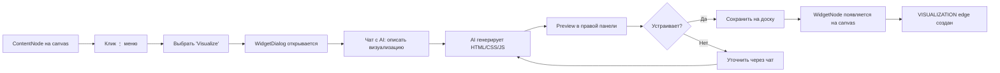

# Widget Visualization - Frontend User Guide

**Дата**: 02.2026  
**Статус**: ✅ Полная реализация (Backend + Frontend + Chat UI)

---

## 🎯 Обзор

Система AI-генерации визуализаций позволяет **итеративно** создавать интерактивные виджеты из ContentNode с помощью GigaChat через **чат-интерфейс**.

## 📋 Workflow для пользователя

### 1. Создание визуализации



### 2. Интерфейс WidgetDialog (Dual Panel)

**Левая панель (40%)**:
- **📊 Данные источника** — таблицы ContentNode (collapsed preview)
- **💬 Чат с AI** — итеративный диалог для уточнения визуализации
- **Поле ввода** — описание/инструкции для AI

**Правая панель (60%)**:
- **👁️ Preview** — live-рендер виджета в sandboxed iframe
- **📝 Code** — Monaco Editor для редактирования HTML/CSS/JS

**Нижняя панель**:
- **Auto-refresh toggle** — включить автообновление при изменении ContentNode
- **Refresh interval** — интервал обновления (5, 10, 30, 60 секунд)
- **Сохранить на доску** — создать/обновить WidgetNode

**Возможности**:
- ✅ Итеративная генерация (уточнения через чат)
- ✅ Live preview изменений
- ✅ Редактирование кода вручную (Monaco Editor)
- ✅ Редактирование существующих виджетов
- ✅ Smart Node Placement (без коллизий)

### 3. Редактирование существующего виджета

Двойной клик на WidgetNode или пункт меню "Edit" открывает WidgetDialog с:
- Восстановленной историей чата
- Текущим HTML кодом
- Настройками auto-refresh

### 4. Рендеринг виджета

**WidgetNodeCard отображает**:
- 🎨 Цветной заголовок (фиолетовый)
- ✨ Индикатор "AI-generated" (если `generated_by` заполнен)
- 📊 Iframe с визуализацией (sandboxed)
- 🔄 Индикатор автообновления (если включен)

**Безопасность**:
- HTML/CSS/JS виджета загружается в sandboxed iframe
- `sandbox="allow-scripts allow-same-origin"`
- Изоляция от основного DOM приложения
- Защита от XSS

### 5. Поддерживаемые типы визуализаций

AI может генерировать:
- 📊 Bar charts (вертикальные/горизонтальные)
- 📈 Line charts (временные ряды)
- 🥧 Pie charts (распределения)
- 📋 Таблицы (с сортировкой, фильтрами, поиском)
- 📇 KPI cards (метрики с трендами)
- 🗺️ Heatmaps
- 🌐 Scatter plots
- 📏 Gauge charts
- 🎨 Custom HTML visualizations

## 🔧 Технические детали

### API запросы

**Итеративная генерация (чат)**:
```typescript
await contentNodesAPI.visualizeIterative(contentNodeId, {
  user_prompt: "Создай bar chart с топ-10 значениями",
  existing_widget_code: currentVisualization?.widget_code,  // для уточнений
  chat_history: chatMessages  // история диалога
})
```

**Ответ**:
```typescript
{
  widget_code: string,    // Полный HTML (<!DOCTYPE html>...)
  widget_name: string,    // Короткое название
  description: string,    // Описание для чата
  html_code?: string,     // Legacy: отдельные части
  css_code?: string,
  js_code?: string
}
```

### State management (WidgetDialog)

```typescript
interface VisualizationState {
  html: string
  css: string
  js: string
  description: string
  widget_code?: string   // Full HTML from GigaChat
  widget_name?: string   // Short name for widget
}

interface ChatMessage {
  id: string
  role: 'user' | 'assistant'
  content: string
  timestamp: Date
}
```

### Компоненты

**1. WidgetDialog.tsx** — главный компонент
- Dual-panel layout (40% / 60%)
- Чат с AI (левая панель)
- Preview + Code tabs (правая панель)
- Monaco Editor для редактирования кода
- Smart positioning при сохранении
- Поддержка create/edit mode

**2. ContentNodeCard.tsx**
- Пункт "Visualize" в меню → открывает WidgetDialog

**3. WidgetNodeCard.tsx**
- Sandboxed iframe рендеринг
- NodeResizer для изменения размера
- Edit mode → открывает WidgetDialog с восстановлением

### API injection в iframe

Виджет получает доступ к данным через injected API:

```javascript
// Доступно внутри виджета:
window.CONTENT_NODE_ID   // ID источника данных
window.fetchContentData()  // Получить данные ContentNode
window.getTable(nameOrIndex)  // Получить таблицу
window.startAutoRefresh(callback, intervalMs)  // Автообновление
window.stopAutoRefresh(intervalId)
```

### UI компоненты (shadcn/ui)

- ✅ Dialog, DialogContent, DialogHeader
- ✅ Button, Input, Textarea
- ✅ Tabs, TabsList, TabsContent, TabsTrigger
- ✅ Switch
- ✅ @monaco-editor/react

## 🎨 Примеры использования

### Итеративная визуализация (рекомендуемый подход)

1. Открыть ContentNode menu → "Visualize"
2. Написать в чат: "Создай bar chart"
3. AI генерирует → preview справа
4. Написать: "Добавь легенду и заголовок"
5. AI обновляет → preview обновляется
6. Нажать "Сохранить на доску"

→ Виджет создан с учётом всех уточнений

### Редактирование кода вручную

1. В WidgetDialog → вкладка "Code"
2. Редактировать HTML/CSS/JS в Monaco Editor
3. Preview обновляется автоматически
4. Нажать "Сохранить на доску"

### Редактирование существующего виджета

1. WidgetNode → меню → "Edit"
2. WidgetDialog открывается с историей чата
3. Написать: "Измени цвета на синие"
4. AI обновляет код
5. Нажать "Сохранить"

## 🔐 Безопасность

**Меры безопасности**:

1. **Iframe sandbox**
   - `sandbox="allow-scripts allow-same-origin"`
   - Изоляция JavaScript от основного приложения
   - Ограничение доступа к родительскому DOM

2. **Backend validation** (уже реализовано)
   - Запрет на внешние скрипты (`<script src="...">`)
   - Только CDN библиотеки (Chart.js@4, D3@7, Plotly 2.35, ECharts@5)
   - Запрет на `eval()`, `Function()`
   - Паттерн `waitForLibrary()` для асинхронной загрузки

3. **Content Security Policy** (в iframe)
   ```html
   <meta http-equiv="Content-Security-Policy" 
         content="default-src 'self'; script-src 'self' 'unsafe-inline' https://cdn.jsdelivr.net https://cdn.plot.ly;">
   ```

## 📊 Метрики производительности

**Время генерации**:
- GigaChat API: ~3-5 секунд (зависит от сложности)
- Создание WidgetNode: <100ms
- Создание VISUALIZATION edge: <50ms
- Smart positioning: <10ms

**Рекомендации**:
- Для больших датасетов (>1000 строк) → AI видит только preview (первые 3 строки)
- Для сложных визуализаций → указывать конкретный тип в чате

## 🐛 Отладка

**Проверка созданного виджета**:

```javascript
// В браузере DevTools
const widget = document.querySelector('iframe[title*="Widget"]')
console.log(widget.contentDocument.body.innerHTML)
```

**Логи в консоли**:
- `🔍 Checking collision with existing nodes` - smart positioning
- `📍 Optimal position calculated` - позиция выбрана
- `✅ Visualization created` - успешное создание
- `❌ Visualization failed` - ошибка генерации

## 📚 Связанная документация

- [WIDGET_GENERATION_QUICKSTART.md](./WIDGET_GENERATION_QUICKSTART.md) - Backend API
- [API.md](./API.md) - POST /content-nodes/{id}/visualize endpoint
- [WIDGETNODE_GENERATION_SYSTEM.md](./WIDGETNODE_GENERATION_SYSTEM.md) - архитектура
- [SMART_NODE_PLACEMENT.md](./SMART_NODE_PLACEMENT.md) - алгоритм размещения
- [CURRENT_FOCUS.md](../.vscode/CURRENT_FOCUS.md) - текущий статус разработки

## ✅ Checklist для тестирования

### Create Mode
- [ ] Открыть ContentNode menu → "Visualize"
- [ ] WidgetDialog открывается с двухпанельным layout
- [ ] Левая панель показывает данные ContentNode
- [ ] Написать в чат: "Создай bar chart с топ-5 значениями"
- [ ] AI отвечает в чате, preview появляется справа
- [ ] Переключиться на вкладку "Code" — виден HTML
- [ ] Включить Auto-refresh, установить интервал
- [ ] Нажать "Сохранить на доску"
- [ ] WidgetNode появляется рядом с ContentNode (без наложения)
- [ ] VISUALIZATION edge создан (фиолетовая линия)

### Edit Mode
- [ ] WidgetNode → меню → "Edit"
- [ ] WidgetDialog открывается с историей чата
- [ ] Текущий код виджета виден в preview
- [ ] Написать уточнение → AI обновляет код
- [ ] Нажать "Сохранить" → виджет обновлён

### Code Editing
- [ ] Вкладка "Code" → Monaco Editor работает
- [ ] Изменить HTML вручную → preview обновляется
- [ ] Сохранить → изменения применены

---

**Статус**: ✅ Все функции реализованы (Chat UI + Iterative Generation)  
**Готовность**: Production-ready
