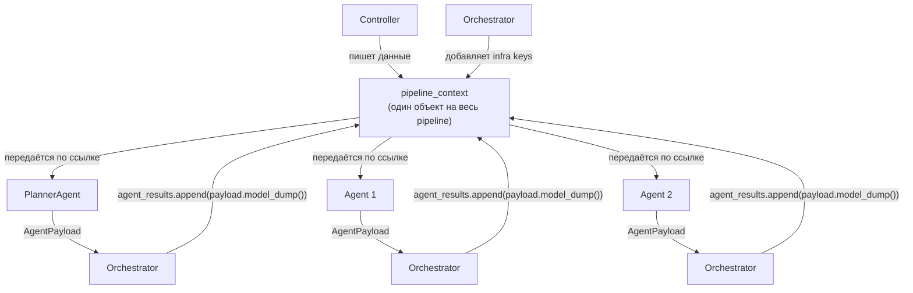
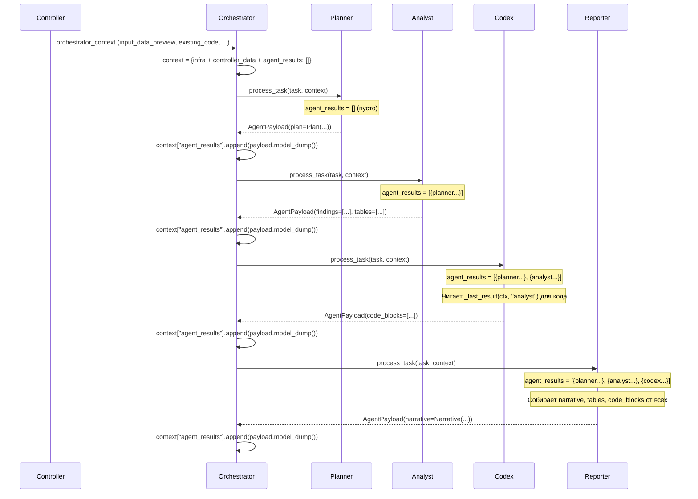
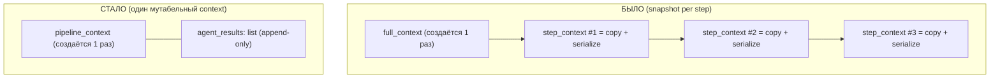
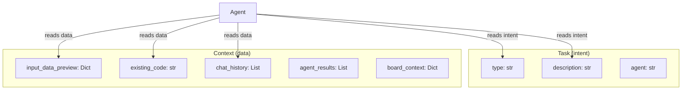
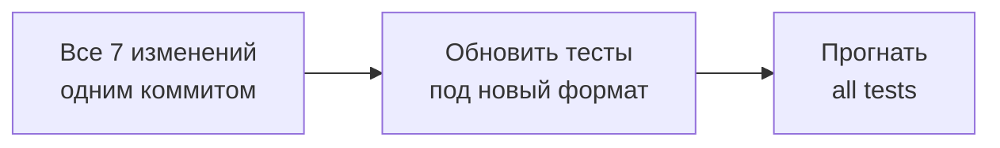

# PipelineContext: Архитектура передачи данных между контроллерами и агентами

> **Executive Summary**: Документ описывает 7 конкретных архитектурных изменений для стандартизации потока данных Controller → Orchestrator → Agent. Каждое изменение документировано с текущим состоянием, проблемой, предлагаемым решением, затрагиваемыми файлами и планом миграции. Цель — единый предсказуемый контракт: контроллеры ПИШУТ в context, агенты ЧИТАЮТ из context, никто не мутирует task.

---

## Принципы

### Текущая модель: snapshot per step (проблема)

Сейчас orchestrator строит **новый dict на каждом шаге**, копируя весь `full_context` и сериализуя все предыдущие результаты:

```python
# orchestrator.py — текущий код (~L352-375)
# На КАЖДОМ шаге:
serialized_previous = {}
seen_payload_ids: set[int] = set()
for k, v in previous_results.items():       # ← сериализация КАЖДЫЙ шаг
    if isinstance(v, AgentPayload):
        payload_id = id(v)
        if payload_id in seen_payload_ids:
            continue
        seen_payload_ids.add(payload_id)
        serialized_previous[k] = v.model_dump()

step_context = {                             # ← КОПИЯ full_context каждый шаг
    **full_context,
    "previous_results": serialized_previous,
    "task_index": step_index,
}
```

Проблемы snapshot-модели:
- **Избыточное копирование** — `{**full_context, ...}` создаёт новый dict каждый шаг
- **Избыточная сериализация** — `model_dump()` всех предыдущих payload'ов на каждом шаге
- **Дедупликация по `id()`** — хрупкий хак из-за дублирования step_id/agent_name
- **`step_context` как понятие не нужен** — каждый агент должен видеть ОДИН и тот же контекст

### Целевая модель: один живой PipelineContext



**Ключевое отличие**: один dict передаётся по ссылке, orchestrator пополняет `agent_results: list` через append, агенты всегда видят актуальное состояние + полную хронологию.

```python
# orchestrator.py — ЦЕЛЕВОЙ КОД:

# Создаётся ОДИН РАЗ перед pipeline
pipeline_context: Dict[str, Any] = {
    "session_id": session_id,
    "board_id": board_id,
    "user_id": user_id,
    "user_request": user_request,
    **(controller_context or {}),   # ← данные от контроллера
    "agent_results": [],            # ← ПОСЛЕДНИЙ ключ, append-only list
}

# PlannerAgent — получает pipeline_context
plan_payload = await self._execute_agent("planner", task={...}, context=pipeline_context)
pipeline_context["agent_results"].append(plan_payload.model_dump())

# Каждый шаг — pipeline_context передаётся как есть
for step in steps:
    agent_name = step["agent"]
    task_data = step.get("task", {})
    
    step_payload = await self._execute_with_retry(
        agent_name, task_data, pipeline_context,  # ← тот же объект
    )
    
    pipeline_context["agent_results"].append(step_payload.model_dump())  # ← append
```

|              | Было (snapshot)                                                | Стало (живой context)                                     |
| ------------ | -------------------------------------------------------------- | --------------------------------------------------------- |
| Объект       | Новый dict на каждый шаг                                       | Один dict на весь pipeline                                |
| Результаты   | `previous_results: Dict[str, Dict]` — сериализуется каждый шаг | `agent_results: List[Dict]` — хронологический append-only |
| Копирование  | `{**full_context, ...}` каждый раз                             | Нет копирования                                           |
| Сериализация | `model_dump()` N×(N-1)/2 раз                                   | `model_dump()` ровно 1 раз на payload (при append)        |
| `task_index` | Зашивался в context                                            | Не нужен в context                                        |
| Реплан       | `results[agent_name]` перезаписывается — история теряется      | Всегда append — вся история сохраняется                   |

### Принципы

1. **Controllers PUT** — контроллер формирует `orchestrator_context` с данными для pipeline
2. **Orchestrator WRAPS** — добавляет infra-ключи и создаёт `agent_results: []`
3. **Orchestrator ACCUMULATES** — после каждого шага делает `agent_results.append(payload.model_dump())`
4. **Agents READ** — агент берёт данные из `context`, не из `task`. Результаты предыдущих агентов — из `context["agent_results"]`
5. **Task = intent only** — `task` содержит только описание задачи из плана Planner'а (`type`, `description`)
6. **Agents don't mutate context** — агент не мутирует ни `task`, ни `context`; он возвращает `AgentPayload`, а orchestrator записывает результат

### Ключевые решения

| Вопрос                     | Решение                               | Обоснование                                                            |
| -------------------------- | ------------------------------------- | ---------------------------------------------------------------------- |
| Тип контейнера             | `Dict[str, Any]`                      | Агенты не знают друг про друга, Pydantic излишен                       |
| Мутабельность              | Один мутабельный объект               | Без копий, without snapshot per step                                   |
| Сигнатура агента           | `process_task(task, context)`         | task = intent, context = данные                                        |
| Формат `agent_results`     | Плоский хронологический список        | Attention-механизм LLM — порядок важен                                 |
| Значения в `agent_results` | Сериализованные dict (`model_dump()`) | Агенты не импортируют AgentPayload                                     |
| Позиция `agent_results`    | В конце context                       | Recency bias в Attention — последние элементы получают больше внимания |

---

## Формат PipelineContext

### Полная схема

```python
context: Dict[str, Any] = {

    # ═══════════════════════════════════════════════════════════════
    # INFRA — Orchestrator добавляет автоматически
    # ═══════════════════════════════════════════════════════════════
    "session_id": "abc123def456",                  # str — UUID hex[:12]
    "board_id": "uuid-string",                     # str — UUID доски
    "user_id": "uuid-string",                      # str — UUID пользователя
    "user_request": "Проанализируй продажи за Q3", # str — исходный запрос

    # ═══════════════════════════════════════════════════════════════
    # ROUTING — Controller ставит, Orchestrator читает для выбора pipeline
    # ═══════════════════════════════════════════════════════════════
    "controller": "transformation",                # str — имя контроллера
    "mode": "transformation",                      # str — режим работы

    # ═══════════════════════════════════════════════════════════════
    # BOARD CONTEXT — Controller ставит (менее важно для Attention)
    # ═══════════════════════════════════════════════════════════════
    "selected_node_ids": ["node_1", "node_2"],     # list[str] — выбранные ноды
    "content_nodes_data": [                        # list[dict] — данные ContentNodes
        {"name": "Sales", "tables": [...], "text": "..."},
    ],
    "board_context": {                             # dict — полное состояние доски
        "board": {"id": "...", "name": "...", "description": "..."},
        "content_nodes": [{"id": "...", "name": "...", "content_summary": "..."}],
        "nodes": {"source_nodes": [...], "widget_nodes": [...]},
        "edges": [{"from": "...", "to": "...", "type": "..."}],
        "stats": {"total_source_nodes": 3, "total_content_nodes": 5},
    },

    # ═══════════════════════════════════════════════════════════════
    # INPUT DATA — Controller ставит
    # ═══════════════════════════════════════════════════════════════
    "input_data_preview": {                        # Dict[table_name → schema + sample]
        "sales_q3": {
            "columns": ["date", "region", "amount"],
            "dtypes": {"date": "datetime64[ns]", "region": "object", "amount": "float64"},
            "row_count": 15420,
            "sample_rows": [
                {"date": "2025-07-01", "region": "Moscow", "amount": 45000.0},
                # ... до 20 строк
            ],
        },
    },

    # ═══════════════════════════════════════════════════════════════
    # CODE CONTEXT — Controller ставит
    # ═══════════════════════════════════════════════════════════════
    "existing_code": "import pandas as pd\n...",   # str | None — код трансформации
    "existing_widget_code": "<div>...</div>",      # str | None — код виджета
    "chat_history": [                              # list[dict] — история чата
        {"role": "user", "content": "Сгруппируй по регионам"},
        {"role": "assistant", "content": "Готово, добавил groupby"},
    ],

    # ═══════════════════════════════════════════════════════════════
    # AGENT RESULTS — Orchestrator пополняет (append-only)
    # ПОСЛЕДНЕЕ ПОЛЕ — для максимального веса в Attention LLM
    # ═══════════════════════════════════════════════════════════════
    "agent_results": [
        # Хронологический порядок выполнения. Каждый элемент = model_dump() от AgentPayload.
        # При реплане один агент может присутствовать несколько раз.
        {"agent": "analyst",  "status": "success", "timestamp": "T1", "narrative": {...}, "findings": [...]},
        {"agent": "codex",    "status": "error",   "timestamp": "T2", "error": "SyntaxError..."},
        {"agent": "analyst",  "status": "success", "timestamp": "T3", "findings": [...]},
        {"agent": "codex",    "status": "success", "timestamp": "T4", "code_blocks": [...]},
        {"agent": "reporter", "status": "success", "timestamp": "T5", "narrative": {...}},
    ],
}
```

---

### Детализация полей

#### INFRA (Orchestrator)

| Поле           | Тип   | Кто ставит   | Описание                                                                           |
| -------------- | ----- | ------------ | ---------------------------------------------------------------------------------- |
| `session_id`   | `str` | Orchestrator | UUID сессии. Генерируется как `f"session_{uuid4().hex[:12]}"` или передаётся извне |
| `board_id`     | `str` | Orchestrator | UUID доски. Приходит из route параметров                                           |
| `user_id`      | `str` | Orchestrator | UUID пользователя. Из `get_current_user`                                           |
| `user_request` | `str` | Orchestrator | Исходный текст запроса пользователя. Не модифицируется                             |

Orchestrator формирует infra-блок так:
```python
context = {
    "session_id": session_id,
    "board_id": board_id,
    "user_id": user_id,
    "user_request": user_request,
    **(controller_context or {}),   # все ключи от контроллера
    "agent_results": [],            # всегда последний, пустой список
}
```

---

#### ROUTING (Controller → Orchestrator)

| Поле         | Тип   | Описание                                                     |
| ------------ | ----- | ------------------------------------------------------------ |
| `controller` | `str` | Имя контроллера. Orchestrator использует для выбора pipeline |
| `mode`       | `str` | Режим работы. Определяет поведение Planner'а                 |

Значения по контроллерам:

| Controller                     | `controller`              | `mode`                                                             |
| ------------------------------ | ------------------------- | ------------------------------------------------------------------ |
| TransformationController       | `"transformation"`        | `"transformation"`                                                 |
| TransformSuggestionsController | `"transform_suggestions"` | `"transform_suggestions_new"` \| `"transform_suggestions_improve"` |
| WidgetController               | `"widget"`                | `"widget"`                                                         |
| WidgetSuggestionsController    | `"widget_suggestions"`    | `"widget_suggestions_new"` \| `"widget_suggestions_improve"`       |
| AIAssistantController          | `"ai_assistant"`          | `"assistant"`                                                      |

---

#### BOARD CONTEXT (Controller)

**`selected_node_ids`** — список UUID выбранных нод.

```python
# Тип: list[str]
# Пример: ["a1b2c3d4-...", "e5f6g7h8-..."]
```

| Кто ставит               | Когда                         |
| ------------------------ | ----------------------------- |
| TransformationController | Всегда (из route параметров)  |
| AIAssistantController    | Если пользователь выбрал ноды |

**`content_nodes_data`** — данные выбранных ContentNodes (таблицы + текст).

```python
# Тип: list[dict]
# Каждый элемент:
{
    "name": "Sales Q3",                     # str — имя ноды
    "tables": [                             # list[dict] — таблицы ContentNode
        {
            "name": "sales",
            "columns": [{"name": "date", "type": "string"}, ...],
            "rows": [{"date": "2025-07-01", ...}, ...],
        },
    ],
    "text": "Quarterly sales report...",    # str — текстовый контент
}
```

| Кто ставит               | Когда                 |
| ------------------------ | --------------------- |
| TransformationController | Pass-through из route |
| AIAssistantController    | Данные выбранных нод  |

**`board_context`** — полное состояние доски (для AI Assistant).

```python
# Тип: dict
# Структура (из AIService.get_board_context()):
{
    "board": {
        "id": "uuid",
        "name": "Аналитика продаж",
        "description": "Дашборд Q3 2025",
    },
    "content_nodes": [                       # list — сводка ContentNodes
        {"id": "uuid", "name": "Sales", "content_summary": "15420 rows, 5 columns"},
    ],
    "nodes": {
        "source_nodes": [{"id": "uuid", "name": "CSV Import", "source_type": "csv"}],
        "widget_nodes": [{"id": "uuid", "name": "Sales Chart", "description": "..."}],
        "comment_nodes": [{"id": "uuid", "content": "..."}],
    },
    "edges": [
        {"from": "node_1", "to": "node_2", "type": "data_flow"},
    ],
    "stats": {
        "total_source_nodes": 3,
        "total_content_nodes": 5,
        "total_widget_nodes": 2,
        "total_comment_nodes": 1,
        "total_edges": 7,
    },
}
```

Ставится **только** AIAssistantController.

---

#### INPUT DATA (Controller)

**`input_data_preview`** — schema + sample данных для промптов агентов.

```python
# Тип: Dict[str, Dict]
# Ключ: имя таблицы (str)
# Значение:
{
    "columns": ["col1", "col2", ...],                    # list[str] — имена колонок
    "dtypes": {"col1": "int64", "col2": "object", ...},  # dict[str, str] — типы (опционально)
    "row_count": 15420,                                   # int — общее количество строк
    "sample_rows": [                                      # list[dict] — до 20 строк
        {"col1": 1, "col2": "abc"},
        {"col1": 2, "col2": "def"},
    ],
}
```

| Кто ставит                     | Источник `dtypes`                           | Кол-во sample_rows |
| ------------------------------ | ------------------------------------------- | ------------------ |
| TransformationController       | Из `DataFrame.dtypes` — всегда присутствует | `head(20)`         |
| TransformSuggestionsController | Из `input_schemas` — может отсутствовать    | До 20              |

> **Нормализация**: TransformSuggestionsController должен добавлять `dtypes` если они доступны в `input_schemas`, для единообразия.

> **`input_data` (полные DataFrame)** — вынесен в отдельный `execution_context` (см. Изменение #6). Не входит в pipeline context, т.к. это мегабайты данных для code execution, а не для LLM.

---

#### CODE CONTEXT (Controller)

**`existing_code`** — текущий Python-код трансформации.

```python
# Тип: str | None
# Пример: "import pandas as pd\n\ndef transform(df_sales):\n    return df_sales.groupby('region').sum()"
```

| Кто ставит                     | Когда                                             |
| ------------------------------ | ------------------------------------------------- |
| TransformationController       | Если есть существующая трансформация (refinement) |
| TransformSuggestionsController | Если виджет уже имеет код (improve mode)          |

**`existing_widget_code`** — текущий HTML/JS-код виджета.

```python
# Тип: str | None
# Пример: "<div id='chart'><script>const data = TABLE_DATA; ...</script></div>"
```

| Кто ставит                  | Когда                                    |
| --------------------------- | ---------------------------------------- |
| WidgetController            | Если виджет уже существует (refinement)  |
| WidgetSuggestionsController | Если виджет уже имеет код (improve mode) |

> **Fix**: WidgetSuggestionsController сейчас ставит `current_widget_code` — нужно переименовать в `existing_widget_code` (Изменение #3).

**`chat_history`** — история чат-диалога для итеративных доработок.

```python
# Тип: list[dict]
# Каждый элемент:
{
    "role": "user" | "assistant",   # str — роль
    "content": "Сгруппируй по...",  # str — текст сообщения
    # Опциональные (из БД):
    "id": "uuid",                   # str — UUID сообщения
    "created_at": "2025-07-01T...", # str — ISO timestamp
}
```

Ставится **всеми 5 контроллерами**. Формат может варьироваться: фронтенд отправляет `{role, content}`, БД возвращает `{id, role, content, created_at}`. Агенты должны использовать только `role` и `content`.

---

#### AGENT RESULTS (Orchestrator, append-only)

**`agent_results`** — хронологический список всех результатов агентов.

```python
# Тип: list[dict]
# Каждый элемент = AgentPayload.model_dump()
# Orchestrator записывает: context["agent_results"].append(payload.model_dump())
```

Каждый элемент содержит стандартные поля `AgentPayload`:

```python
{
    # === ENVELOPE (всегда присутствуют) ===
    "status": "success" | "error" | "partial",  # str — результат
    "agent": "analyst",                          # str — имя агента
    "timestamp": "2025-07-01T12:00:00.000000",  # str — ISO 8601

    # === NARRATIVE (текстовый ответ) ===
    "narrative": {                               # dict | None
        "text": "В данных видны 3 тренда...",
        "format": "markdown",                    # "markdown" | "plain" | "html"
    },

    # === TABLES (структурированные данные) ===
    "tables": [                                  # list[dict]
        {
            "id": "uuid",
            "name": "sales_summary",
            "columns": [{"name": "region", "type": "string"}, ...],
            "rows": [{"region": "Moscow", "amount": 45000}, ...],
            "row_count": 150,
            "column_count": 3,
        },
    ],

    # === CODE (сгенерированный код) ===
    "code_blocks": [                             # list[dict]
        {
            "code": "df.groupby('region').sum()",
            "language": "python",                # "python" | "html" | "sql" | "javascript"
            "purpose": "transformation",         # "transformation" | "widget" | "analysis" | "utility"
            "variable_name": "df_result",
            "syntax_valid": true,
        },
    ],

    # === SOURCES (источники информации) ===
    "sources": [                                 # list[dict]
        {
            "url": "https://...",
            "title": "Article title",
            "content": "Full text...",           # None если не загружен
            "fetched": true,
            "source_type": "web",                # "web" | "news" | "api" | "database" | "file"
        },
    ],

    # === FINDINGS (выводы, рекомендации) ===
    "findings": [                                # list[dict]
        {
            "type": "insight",                   # "insight" | "recommendation" | "data_quality_issue" | ...
            "text": "Рост продаж +23% в Q3",
            "severity": "medium",                # "critical" | "high" | "medium" | "low" | "info"
            "confidence": 0.85,
        },
    ],

    # === VALIDATION (от QualityGateAgent) ===
    "validation": {                              # dict | None
        "valid": true,
        "confidence": 0.9,
        "message": "Код корректен",
        "issues": [],
    },

    # === PLAN (от PlannerAgent) ===
    "plan": {                                    # dict | None
        "plan_id": "uuid",
        "user_request": "...",
        "steps": [
            {"step_id": "1", "agent": "analyst", "task": {...}},
            {"step_id": "2", "agent": "codex", "task": {...}},
        ],
    },

    # === ERROR (при status='error') ===
    "error": "SyntaxError in line 5...",         # str | None
    "suggestions": ["Проверьте имя колонки"],    # list[str]

    # === METADATA (агент-специфичные данные) ===
    "metadata": {},                              # dict
}
```

**Хронология при реплане:**

```python
# Пример: codex упал → replan → analyst + codex повторно
context["agent_results"] = [
    {"agent": "analyst",  "status": "success", "timestamp": "T1", ...},  # run 1
    {"agent": "codex",    "status": "error",   "timestamp": "T2", "error": "NameError: 'df_sales'"},
    # --- Planner видит ошибку codex, перепланирует ---
    {"agent": "analyst",  "status": "success", "timestamp": "T3", ...},  # run 2 (уточнённый анализ)
    {"agent": "codex",    "status": "success", "timestamp": "T4", ...},  # run 2 (исправленный код)
    {"agent": "reporter", "status": "success", "timestamp": "T5", ...},
]
```

**Helpers для агентов** (в `BaseAgent`):

```python
def _last_result(self, context: Dict, agent_name: str) -> Optional[Dict]:
    """Последний результат указанного агента из хронологии."""
    for r in reversed((context or {}).get("agent_results", [])):
        if r.get("agent") == agent_name:
            return r
    return None

def _all_results(self, context: Dict, agent_name: str) -> List[Dict]:
    """Все результаты указанного агента в хронологическом порядке."""
    return [r for r in (context or {}).get("agent_results", []) if r.get("agent") == agent_name]
```

---

### Жизненный цикл context



### Какие контроллеры что ставят (матрица)

```
                        │ Transform │ TransformSugg │ Widget │ WidgetSugg │ AIAssist │
────────────────────────┼───────────┼───────────────┼────────┼────────────┼──────────┤
controller              │     ✅     │      ✅       │   ✅   │     ✅     │    ✅    │
mode                    │     ✅     │      ✅       │   ✅   │     ✅     │    ✅    │
input_data_preview      │     ✅     │      ✅       │        │            │          │
existing_code           │     ✅     │      ✅       │        │            │          │
existing_widget_code    │           │               │   ✅   │     ✅*    │          │
chat_history            │     ✅     │      ✅       │   ✅   │     ✅     │    ✅    │
selected_node_ids       │     ✅     │               │        │            │    ✅    │
content_nodes_data      │     ✅     │               │        │            │    ✅    │
board_context           │           │               │        │            │    ✅    │
```

`*` = после bugfix (Изменение #3)

> **Вынесены из context**: `input_data` (полные DataFrame) → `execution_context`, `auth_token` → удалён (см. Изменение #6)

---

## Изменение 1: `board_data` → удалить, использовать `board_context`

### Текущее состояние

PlannerAgent читает `context.get("board_data")`:

```python
# planner.py ~L899
if context and context.get("board_data"):
    prompt_parts.append("\nBOARD CONTEXT:")
    prompt_parts.append(json.dumps(context["board_data"], indent=2, ensure_ascii=False))
```

Но **ни один контроллер** не устанавливает ключ `board_data`:
- `AIAssistantController` ставит `board_context` (Dict с полным состоянием доски)
- `TransformationController` — не ставит ничего про доску
- `WidgetController` — не ставит ничего про доску

### Проблема

- PlannerAgent **никогда** не получает данные о доске через этот путь
- `board_data` — мёртвый ключ (0 writers, 1 reader)
- AIAssistant pipeline теряет контекст доски на этапе планирования

### Решение

Заменить `board_data` на `board_context` в PlannerAgent:

```python
# planner.py — БЫЛО:
if context and context.get("board_data"):
    prompt_parts.append("\nBOARD CONTEXT:")
    prompt_parts.append(json.dumps(context["board_data"], indent=2, ensure_ascii=False))

# planner.py — СТАЛО:
if context and context.get("board_context"):
    prompt_parts.append("\nBOARD CONTEXT:")
    board_ctx = context["board_context"]
    # Передаём только компактную версию — полный board_context слишком большой
    compact = {
        "nodes_count": len(board_ctx.get("content_nodes", [])),
        "content_nodes": [
            {"id": n.get("id"), "name": n.get("name"), "type": n.get("type")}
            for n in board_ctx.get("content_nodes", [])[:10]
        ],
    }
    prompt_parts.append(json.dumps(compact, indent=2, ensure_ascii=False))
```

### Затрагиваемые файлы

| Файл               | Действие                                                          |
| ------------------ | ----------------------------------------------------------------- |
| `planner.py` ~L899 | Заменить `board_data` → `board_context`, добавить компактификацию |

### Риски и альтернативы

**Альтернатива A (минимальная):** Просто заменить `board_data` → `board_context` без компактификации.
- ✅ Одна строка изменения
- ⚠️ `board_context` может быть очень большим (все ноды, все данные) — раздует промпт Planner'а

**Альтернатива B (с компактификацией, рекомендуется):** Заменить + передавать только сводку (количество нод, имена, типы).
- ✅ Промпт остаётся разумного размера
- ✅ Planner получает достаточно информации для планирования
- ⚠️ Нужно определить формат компактной сводки

**Альтернатива C (унификация):** Все контроллеры, которым нужен контекст доски, ставят `board_context` в единообразном компактном формате.
- ✅ Идеально для будущего
- ⚠️ Требует изменения AIAssistantController (пока единственный writer)

**Рекомендация:** Альтернатива B для немедленного фикса. Альтернатива C — на следующую итерацию если появятся другие потребители.

---

## Изменение 2: Убрать `step_context` → один `pipeline_context` + `agent_results: list`

### Текущее состояние

Orchestrator использует **три** уровня контекста:

```
full_context          — создаётся 1 раз (infra + controller data)
  └─ step_context     — создаётся на КАЖДОМ шаге (full_context + previous_results + task_index)
       └─ передаётся агенту как `context`
```

Каждый шаг:
1. Итерирует `previous_results` → сериализует все `AgentPayload` через `model_dump()`
2. Дедуплицирует по `id()` (из-за step_id алиасов)
3. Создаёт новый dict `{**full_context, "previous_results": serialized, "task_index": i}`

```python
# orchestrator.py ~L352-375 — текущий код
serialized_previous = {}
seen_payload_ids: set[int] = set()
for k, v in previous_results.items():
    if isinstance(v, AgentPayload):
        payload_id = id(v)
        if payload_id in seen_payload_ids:
            continue  # step_id alias → пропускаем дубль
        seen_payload_ids.add(payload_id)
        serialized_previous[k] = v.model_dump()
    elif isinstance(v, dict):
        serialized_previous[k] = v
    else:
        serialized_previous[k] = str(v)

step_context = {
    **full_context,
    "previous_results": serialized_previous,
    "task_index": step_index,
}
```

Результаты хранятся с дублированием:
```python
# orchestrator.py ~L448-451
previous_results[agent_name] = step_payload
previous_results[step_id] = previous_results[agent_name]  # дубль
```

### Проблемы

1. **`step_context` не нужен** — каждый агент должен видеть один и тот же контекст; `step_context` — лишняя абстракция, которая на каждом шаге копирует весь `full_context`
2. **Сериализация N раз** — `model_dump()` всех payload'ов вызывается на каждом шаге, хотя payload'ы не менялись. При 5 шагах это 1+2+3+4+5 = 15 сериализаций вместо 0
3. **Дедупликация по `id()`** — хрупкий хак из-за дублирования step_id/agent_name
4. **step_id нигде не используется** — ни один агент не обращается к previous_results по step_id
5. **`task_index` не используется** — ни один агент не читает `task_index` из context
6. **Dict теряет хронологию** — `previous_results[agent_name]` перезаписывается при реплане, теряя историю

### Решение: Один `pipeline_context` c `agent_results: list`



**Orchestrator — целевой код:**

```python
# orchestrator.py — БЫЛО:
full_context: Dict[str, Any] = {
    "session_id": session_id,
    "board_id": board_id,
    "user_id": user_id,
    "user_request": user_request,
    **(context or {}),
}
previous_results: Dict[str, AgentPayload] = {}
# ... на каждом шаге:
serialized_previous = { ... 15 строк сериализации + дедупликации ... }
step_context = {**full_context, "previous_results": serialized_previous, "task_index": step_index}
# ... после шага:
previous_results[agent_name] = step_payload
previous_results[step_id] = previous_results[agent_name]  # дубль

# orchestrator.py — СТАЛО:
context: Dict[str, Any] = {
    "session_id": session_id,
    "board_id": board_id,
    "user_id": user_id,
    "user_request": user_request,
    **(controller_context or {}),
    "agent_results": [],                   # ← ПОСЛЕДНИЙ ключ, append-only list
}
# ... на каждом шаге (1 строка вместо 15):
step_payload = await self._execute_with_retry(agent_name, task_data, context)
context["agent_results"].append(step_payload.model_dump())  # ← append serialized dict
```

**Что удаляется из orchestrator.py:**
- `previous_results: Dict[str, AgentPayload]` — вся переменная
- 15 строк `serialized_previous` + `seen_payload_ids` + дедупликация по `id()`
- `step_context = {**full_context, ...}` — копирование
- `previous_results[step_id] = ...` — дублирование
- `task_index` в context

**Что появляется:**
- `context["agent_results"].append(payload.model_dump())` — одна строка после каждого шага

### Влияние на агентов: что меняется

| Было                                  | Стало                                            |
| ------------------------------------- | ------------------------------------------------ |
| `context.get("previous_results", {})` | `context.get("agent_results", [])`               |
| `Dict[str, Dict]` — ключ = agent_name | `List[Dict]` — хронологический список            |
| `results["analyst"]` — прямой доступ  | `self._last_result(context, "analyst")` — helper |
| Перезаписывается при реплане          | Append-only: вся история сохраняется             |
| Значения = сериализованные dict       | Значения = сериализованные dict (то же)          |

**Универсальный паттерн чтения:**

```python
# Получить последний результат analyst:
analyst = self._last_result(context, "analyst")
if analyst:
    findings = analyst.get("findings", [])
    tables = analyst.get("tables", [])

# Итерировать все результаты:
for result in (context or {}).get("agent_results", []):
    if result.get("status") == "success":
        narrative = result.get("narrative")
        ...
```

**Helpers в BaseAgent:**

```python
# base_agent.py
def _last_result(self, context: Dict, agent_name: str) -> Optional[Dict]:
    """Последний результат указанного агента из хронологии."""
    for r in reversed((context or {}).get("agent_results", [])):
        if r.get("agent") == agent_name:
            return r
    return None

def _all_results(self, context: Dict, agent_name: str) -> List[Dict]:
    """Все результаты указанного агента в хронологическом порядке."""
    return [r for r in (context or {}).get("agent_results", [])
            if r.get("agent") == agent_name]
```

### Как меняется код каждого агента

**ReporterAgent** (собирает итоговый отчёт):
```python
# БЫЛО:
previous_results = context.get("previous_results", {})
for agent_name, result in previous_results.items():
    if not isinstance(result, dict): continue
    nar = result.get("narrative")

# СТАЛО:
for result in (context or {}).get("agent_results", []):
    nar = result.get("narrative")
    if isinstance(nar, dict) and nar.get("text"):
        narrative_parts.append(f"[{result['agent']}] {nar['text']}")
    for f in result.get("findings", []):
        all_findings.append(f)
```

**TransformCodexAgent / WidgetCodexAgent** (analyst context):
```python
# БЫЛО:
previous_results = context.get("previous_results", {})
analyst_result = previous_results.get("analyst", {})

# СТАЛО:
analyst = self._last_result(context, "analyst")
if analyst:
    findings = analyst.get("findings", [])
```

**ResearchAgent** (unfetched sources):
```python
# БЫЛО:
for agent_name, result in prev.items():
    sources_raw = result.get("sources", [])

# СТАЛО:
for result in (context or {}).get("agent_results", []):
    for source in result.get("sources", []):
        if not source.get("fetched") and source.get("url"):
            unfetched.append(source)
```

### Затрагиваемые файлы

| Файл                        | Действие                                                                                                                                                                                            |
| --------------------------- | --------------------------------------------------------------------------------------------------------------------------------------------------------------------------------------------------- |
| `orchestrator.py` ~L283-375 | Удалить `step_context`, `serialized_previous`, `previous_results`, step_id дубли. Создать один `context` c `agent_results: []`. Accumulate: `context["agent_results"].append(payload.model_dump())` |
| `orchestrator.py` ~L550-580 | Обновить validation_context — использовать тот же `context`                                                                                                                                         |
| `orchestrator.py` ~L830-880 | Обновить `_replan` — передавать тот же `context` (agent_results уже содержит историю ошибок)                                                                                                        |
| `base_agent.py`             | Добавить `_last_result()`, `_all_results()` helpers                                                                                                                                                 |
| `analyst.py`                | `previous_results` → итерация `agent_results` list                                                                                                                                                  |
| `reporter.py`               | `previous_results.items()` → `agent_results` list iteration                                                                                                                                         |
| `structurizer.py`           | `previous_results` → `agent_results` list                                                                                                                                                           |
| `transform_codex.py`        | `previous_results.get("analyst")` → `self._last_result(ctx, "analyst")`                                                                                                                             |
| `widget_codex.py`           | Аналогично transform_codex                                                                                                                                                                          |
| `quality_gate.py`           | `previous_results` → `self._last_result()` для codex                                                                                                                                                |
| `research.py`               | `previous_results.items()` → итерация `agent_results` list                                                                                                                                          |

### Риски

**Минимальные:** формат значений в `agent_results` не меняется — и раньше, и сейчас это сериализованные dict'ы (`model_dump()`). Меняется только контейнер: `Dict[str, Dict]` → `List[Dict]`. Все тесты обновляются одновременно.

---

## Изменение 3: `current_widget_code` → `existing_widget_code`

### Текущее состояние

**WidgetController** ставит `existing_widget_code`:
```python
# widget_controller.py ~L241
if existing_widget_code:
    orch_ctx["existing_widget_code"] = existing_widget_code
```

**WidgetSuggestionsController** ставит `current_widget_code`:
```python
# widget_suggestions_controller.py ~L101
orchestrator_context = {
    ...
    "current_widget_code": current_widget_code,
    ...
}
```

**WidgetCodexAgent** читает `existing_widget_code`:
```python
# widget_codex.py ~L100
existing_widget_code = (context or {}).get("existing_widget_code")
```

### Проблема

- WidgetSuggestionsController ставит `current_widget_code`
- WidgetCodexAgent читает `existing_widget_code`
- **Результат**: при генерации suggestions виджетов, WidgetCodexAgent **не видит** текущий код виджета

Это **реальный баг** — suggestions для улучшения виджета генерируются без знания текущего кода.

### Решение

Унифицировать название на `existing_widget_code` (уже используется WidgetController и WidgetCodexAgent):

```python
# widget_suggestions_controller.py — БЫЛО:
orchestrator_context = {
    ...
    "current_widget_code": current_widget_code,
    ...
}

# widget_suggestions_controller.py — СТАЛО:
orchestrator_context = {
    ...
    "existing_widget_code": current_widget_code,
    ...
}
```

### Затрагиваемые файлы

| Файл                                     | Действие                                                              |
| ---------------------------------------- | --------------------------------------------------------------------- |
| `widget_suggestions_controller.py` ~L101 | `current_widget_code` → `existing_widget_code` в orchestrator_context |

Одна строка. Остальные файлы уже используют `existing_widget_code`.

### Риски

**Минимальные.** Это чистый bugfix — входная переменная `current_widget_code` в контроллере остаётся (это имя параметра от фронтенда), меняется только ключ в context.

---

## Изменение 4: `input_schemas` в task → убрать, агенты читают `input_data_preview` из context

### Текущее состояние

TransformCodexAgent использует двойной fallback:

```python
# transform_codex.py ~L110
input_schemas = task.get("input_schemas", [])

# Fallback: читаем схему из context.input_data_preview
if not input_schemas and context:
    input_preview = context.get("input_data_preview", {})
    if input_preview:
        for table_name, info in input_preview.items():
            input_schemas.append({
                "name": table_name,
                "columns": info.get("columns", []),
                "dtypes": info.get("dtypes", {}),
                "row_count": info.get("row_count", 0),
                "sample_rows": info.get("sample_rows", [])[:10],
            })
```

PlannerAgent генерирует план через LLM. LLM **никогда** не заполняет `input_schemas` в task — это не часть его output schema. Поэтому `task.get("input_schemas")` **всегда** возвращает `[]`, и **всегда** срабатывает fallback.

### Проблема

1. **Мёртвый код**: `task.get("input_schemas")` работает как no-op
2. **Имена**: `input_schemas` (task) vs `input_data_preview` (context) — одни данные, разные имена
3. **Конверсия**: Fallback конвертирует `Dict[name → info]` в `List[Dict]` — лишняя трансформация

### Решение

Убрать чтение `input_schemas` из task. Агент читает `input_data_preview` из context напрямую:

```python
# transform_codex.py — БЫЛО:
input_schemas = task.get("input_schemas", [])
if not input_schemas and context:
    input_preview = context.get("input_data_preview", {})
    if input_preview:
        for table_name, info in input_preview.items():
            input_schemas.append({...})

# transform_codex.py — СТАЛО:
input_preview = (context or {}).get("input_data_preview", {})
input_schemas = [
    {
        "name": table_name,
        "columns": info.get("columns", []),
        "dtypes": info.get("dtypes", {}),
        "row_count": info.get("row_count", 0),
        "sample_rows": info.get("sample_rows", [])[:10],
    }
    for table_name, info in input_preview.items()
]
if input_schemas:
    self.logger.info(f"📊 Codex: loaded {len(input_schemas)} schema(s) from context")
```

### Затрагиваемые файлы

| Файл                                  | Действие                                                                       |
| ------------------------------------- | ------------------------------------------------------------------------------ |
| `transform_codex.py` ~L110-L126       | Убрать task fallback, читать только из context                                 |
| `transform_suggestions_controller.py` | Убрать `input_schemas` из orchestrator_context (уже есть `input_data_preview`) |

### Риски и альтернативы

**Альтернатива A (убрать task.get, оставить конверсию, рекомендуется):**
- ✅ Один источник данных — context
- ✅ Минимальный diff
- ⚠️ Конверсия Dict → List[Dict] всё ещё есть (но это нормально — internal format агента)

**Альтернатива B (нормализовать формат `input_data_preview` до List[Dict]):**
- ✅ Агент читает без конверсии
- ⚠️ Меняет формат context key — нужно обновить все 5+ потребителей
- ⚠️ Dict-формат удобнее для lookup по имени таблицы

**Рекомендация:** Альтернатива A. Dict-формат `input_data_preview` удобен для lookup, а конверсия в список — это internal concern конкретного агента.

---

## Изменение 5: Агент не мутирует `task` — локальная переменная для enriched data

### Текущее состояние

AnalystAgent создаёт shallow copy task при отсутствии `input_data`:

```python
# analyst.py ~L298-321
if "input_data" not in task and context and context.get("input_data_preview"):
    input_data_preview = context["input_data_preview"]
    input_data_from_context = []
    for table_name, info in input_data_preview.items():
        columns_raw = info.get("columns", [])
        columns = []
        for c in columns_raw:
            if isinstance(c, dict):
                columns.append(c)
            else:
                columns.append({"name": str(c), "type": "string"})
        input_data_from_context.append({
            "node_name": table_name,
            "tables": [{
                "name": table_name,
                "columns": columns,
                "row_count": info.get("row_count", 0),
                "sample_rows": info.get("sample_rows", []),
            }],
        })
    if input_data_from_context:
        task = {**task, "input_data": input_data_from_context}
```

### Проблема

1. **Скрытый side-effect**: Хотя `task = {**task, ...}` создаёт новый dict (не in-place мутация), переменная `task` переприсваивается — это запутано при чтении кода
2. **Дублирование**: Конверсия `input_data_preview → input_data` дублирует логику (analyst и codex делают похожее)
3. **Принцип нарушен**: Task должен содержать только intent от Planner, а данные — из context

### Решение

Вместо обогащения task, агент строит `effective_input_data` из context:

```python
# analyst.py — БЫЛО:
if "input_data" not in task and context and context.get("input_data_preview"):
    # ... 20 строк конверсии ...
    task = {**task, "input_data": input_data_from_context}
# ... позже:
input_data = task.get("input_data", [])

# analyst.py — СТАЛО:
input_data = task.get("input_data", [])
if not input_data:
    input_data = self._input_data_from_context(context)
```

Вынести конверсию в отдельный метод (или mixin для переиспользования):

```python
def _input_data_from_context(self, context: Optional[Dict]) -> List[Dict]:
    """Извлекает input_data из context['input_data_preview'].
    
    Формат context['input_data_preview']:
        Dict[table_name → {columns, dtypes, row_count, sample_rows}]
    
    Формат output (input_data для _build_universal_prompt):
        List[{node_name, tables: [{name, columns: [{name, type}], row_count, sample_rows}]}]
    """
    if not context:
        return []
    preview = context.get("input_data_preview", {})
    if not preview:
        return []
    
    result = []
    for table_name, info in preview.items():
        columns = [
            c if isinstance(c, dict) else {"name": str(c), "type": "string"}
            for c in info.get("columns", [])
        ]
        result.append({
            "node_name": table_name,
            "tables": [{
                "name": table_name,
                "columns": columns,
                "row_count": info.get("row_count", 0),
                "sample_rows": info.get("sample_rows", []),
            }],
        })
    if result:
        self.logger.info(f"📊 Loaded {len(result)} table(s) from context preview")
    return result
```

### Затрагиваемые файлы

| Файл                   | Действие                                       |
| ---------------------- | ---------------------------------------------- |
| `analyst.py` ~L288-321 | Вынести конверсию в метод, убрать мутацию task |

### Риски

**Минимальные.** Поведение не меняется — только рефакторинг.

### Будущее: Shared mixin для конверсии

И AnalystAgent, и TransformCodexAgent конвертируют `input_data_preview` → свой внутренний формат. Можно вынести в `BaseAgent` или mixin:

```python
class DataContextMixin:
    """Mixin для агентов, которым нужны данные из context."""
    
    def get_input_schemas_from_context(self, context: Optional[Dict]) -> List[Dict]:
        """input_data_preview → List[{name, columns, dtypes, row_count, sample_rows}]"""
        ...
    
    def get_input_data_from_context(self, context: Optional[Dict]) -> List[Dict]:
        """input_data_preview → List[{node_name, tables: [...]}]"""
        ...
```

Это **не блокер** для текущего изменения — можно сделать в следующей итерации.

---

## Изменение 6: Удалить `auth_token` из контекста + вынести `input_data` в `execution_context`

### Почему

**`auth_token`**: Агенты работают внутри backend-процесса, авторизация внутри мульти-агентного pipeline не нужна. Executor вызывается локально, auth не проверяется.

**`input_data`** (полные pd.DataFrame): Мегабайты данных для code execution не должны находиться в pipeline context, который предназначен для LLM-промптов. Для LLM есть `input_data_preview` (schema + 20 строк).

### Текущее состояние

QualityGateAgent использует оба:

```python
# quality_gate.py ~L638
result = await self.executor.execute_transformation(
    code=code,
    input_data=context.get("input_data"),      # полные DataFrame
    user_id=context.get("user_id"),
    auth_token=context.get("auth_token"),       # всегда None
)
```

### Решение

**`auth_token`** — удалить полностью:
- Убрать из `quality_gate.py` вызов `auth_token=`
- Убрать из `executor.execute_transformation()` параметр `auth_token`
- Убрать из `transformation_controller.py` чтение `auth_token`

**`input_data`** — вынести в отдельный `execution_context`:

```python
# TransformationController — БЫЛО:
orch_ctx["input_data"] = input_data_dict           # Dict[name → DataFrame]

# TransformationController — СТАЛО:
execution_context = {"input_data": input_data_dict}  # отдельно от pipeline context
```

```python
# Orchestrator передаёт execution_context только QualityGateAgent:
async def run_pipeline(self, ..., execution_context: Optional[Dict] = None):
    ...
    if agent_name == "quality_gate" and execution_context:
        step_payload = await agent.process_task(task, {**context, **execution_context})
    else:
        step_payload = await agent.process_task(task, context)
```

### Затрагиваемые файлы

| Файл                           | Действие                                                                    |
| ------------------------------ | --------------------------------------------------------------------------- |
| `transformation_controller.py` | `input_data` → отдельный `execution_context`, убрать `auth_token`           |
| `orchestrator.py`              | Принимать `execution_context`, передавать QualityGate                       |
| `quality_gate.py`              | Убрать `auth_token=`, читать `input_data` из context (приходит через merge) |
| `executor.py`                  | Убрать параметр `auth_token` из `execute_transformation()`                  |

### Риски

**Минимальные.** `auth_token` никогда не работал (всегда None). `input_data` продолжит поступать в QualityGate, но через отдельный канал.

---

## Изменение 7: `task` содержит только intent — данные всегда из context

### Текущее состояние

PlannerAgent формирует план, где каждый step содержит:
```json
{
  "agent": "analyst",
  "description": "Проанализировать данные...",
  "type": "analysis",
  "input_schemas": [...],   // ← LLM не заполняет
  "input_data": [...],      // ← LLM не заполняет
  "existing_code": "..."    // ← LLM не заполняет
}
```

Агенты вынуждены делать fallback:
```python
# transform_codex.py:
input_schemas = task.get("input_schemas", [])
if not input_schemas:
    input_schemas = ... context.get("input_data_preview") ...

# transform_codex.py:
existing_code = task.get("existing_code") or context.get("existing_code")
```

### Проблема

1. LLM (PlannerAgent) генерирует только `agent`, `description`, `type` — **не** data keys
2. Fallback к context **всегда** срабатывает для data keys
3. Двойное чтение (task → context) маскирует архитектурную проблему
4. Неясно, откуда агент должен читать данные — из task или context

### Решение: Формализовать контракт



**Правило**: Task = `{type, description, agent}` + специфичные intent-ключи (e.g. `purpose: "transformation"|"widget"`, `search_type`, `url`). Все **данные** — из context.

**Для TransformCodexAgent:**

```python
# transform_codex.py — БЫЛО:
input_schemas = task.get("input_schemas", [])
if not input_schemas and context:
    ...
existing_code = task.get("existing_code") or context.get("existing_code")

# transform_codex.py — СТАЛО:
input_schemas = self._get_input_schemas(context)  # всегда из context
existing_code = (context or {}).get("existing_code")  # всегда из context
```

**Для AnalystAgent:**

```python
# analyst.py — БЫЛО:
input_data = task.get("input_data", [])
# ... fallback from context ...

# analyst.py — СТАЛО:
input_data = task.get("input_data") or self._input_data_from_context(context)
# task.get("input_data") оставляем для обратной совместимости
# (PlannerAgent теоретически может передать через structured_data от Structurizer)
```

### Затрагиваемые файлы

| Файл                 | Действие                                                                                |
| -------------------- | --------------------------------------------------------------------------------------- |
| `transform_codex.py` | Убрать `task.get("input_schemas")`, `task.get("existing_code")` — читать только context |
| `analyst.py`         | Убрать `task.get("input_data")` fallback — вынести в метод, context-first               |
| `widget_codex.py`    | Проверить — уже читает из context                                                       |
| `reporter.py`        | Проверить — уже читает из context                                                       |

### Исключения

Некоторые task keys **должны** оставаться в task, потому что это intent, а не data:
- `task["description"]` — что делать
- `task["type"]` — тип задачи
- `task["purpose"]` — `"transformation"` | `"widget"`
- `task["url"]` / `task["urls"]` — для DiscoveryAgent/ResearchAgent (это параметры задачи, не данные)
- `task["query"]` — поисковый запрос для Discovery
- `task["raw_content"]` — если Planner явно передаёт контент от другого агента

### Критерий разделения

| В task (intent)                   | В context (data)                       |
| --------------------------------- | -------------------------------------- |
| Что делать (`description`)        | Входные таблицы (`input_data_preview`) |
| Какой тип (`type`, `purpose`)     | Существующий код (`existing_code`)     |
| Параметры поиска (`query`, `url`) | История чата (`chat_history`)          |
| Ограничения (`max_results`)       | Результаты агентов (`agent_results`)   |
|                                   | Контекст доски (`board_context`)       |

---

## Сводная таблица изменений

| #   | Изменение                                                         | Сложность           | Файлы                                                           | Тип                    |
| --- | ----------------------------------------------------------------- | ------------------- | --------------------------------------------------------------- | ---------------------- |
| 1   | `board_data` → `board_context`                                    | Низкая (1 файл)     | planner.py                                                      | Bugfix                 |
| 2   | Убрать `step_context` → один context + `agent_results: list`      | Высокая (10 файлов) | orchestrator + 7 agents + base_agent                            | Architecture           |
| 3   | `current_widget_code` → `existing_widget_code`                    | Низкая (1 файл)     | widget_suggestions_controller.py                                | Bugfix                 |
| 4   | Убрать `input_schemas` из task                                    | Низкая (2 файла)    | transform_codex.py, transform_suggestions_controller.py         | Cleanup                |
| 5   | Агент не мутирует task                                            | Низкая (1 файл)     | analyst.py                                                      | Refactor               |
| 6   | Удалить `auth_token` + вынести `input_data` в `execution_context` | Средняя (4 файла)   | transformation_controller, orchestrator, quality_gate, executor | Cleanup + Architecture |
| 7   | Task = intent, Context = data                                     | Средняя (4 файла)   | transform_codex, analyst, (widget_codex, reporter — проверить)  | Architecture           |

### Порядок реализации: всё за один проход

Все 7 изменений реализуются **одновременно** — нет поэтапной миграции, нет backward compat.



**Порядок файлов** (от фундамента к потребителям):

1. **`base_agent.py`** — добавить `_last_result()`, `_all_results()` helpers
2. **`orchestrator.py`** — один context + `agent_results: []` + append (Изменение #2)
3. **Controllers** — bugfixes #1, #3, #6 + cleanup #4
4. **Agents** — все 7 читают `agent_results` как list + context-first for data (#5, #7)
5. **Tests** — обновить fixtures под `agent_results: list`

---

## Целевая структура `pipeline_context` (после всех изменений)

> **Важно**: Порядок ключей определяется Attention-механизмом LLM:
> менее важные данные (board, auth) — в начале, результаты агентов — в конце.

```python
context: Dict[str, Any] = {
    # === INFRA (Orchestrator) ===
    "session_id": "abc123def456",
    "board_id": "uuid-string",
    "user_id": "uuid-string",
    "user_request": "Проанализируй продажи за Q3",

    # === ROUTING (Controller → Orchestrator) ===
    "controller": "transformation",
    "mode": "transformation",

    # === BOARD CONTEXT (Controller, менее важно для Attention) ===
    "selected_node_ids": ["node_1", "node_2"],
    "content_nodes_data": [{"name": "Sales", "tables": [...], "text": "..."}],
    "board_context": {...},

    # === INPUT DATA (Controller) ===
    "input_data_preview": {
        "sales": {"columns": [...], "dtypes": {...}, "row_count": 1000, "sample_rows": [...]},
    },

    # === CODE CONTEXT (Controller) ===
    "existing_code": "import pandas...",
    "existing_widget_code": "<div>...</div>",
    "chat_history": [{"role": "user", "content": "..."}],

    # === AGENT RESULTS (Orchestrator, append-only, ПОСЛЕДНИЙ КЛЮЧ) ===
    "agent_results": [
        {"agent": "planner",  "status": "success", "timestamp": "T1", "plan": {...}},
        {"agent": "analyst",  "status": "success", "timestamp": "T2", "findings": [...]},
        {"agent": "codex",    "status": "error",   "timestamp": "T3", "error": "..."},
        {"agent": "analyst",  "status": "success", "timestamp": "T4", "findings": [...]},
        {"agent": "codex",    "status": "success", "timestamp": "T5", "code_blocks": [...]},
        {"agent": "reporter", "status": "success", "timestamp": "T6", "narrative": {...}},
    ],
}
```

### Orchestrator → Context (автоматически)

| Context Key     | Тип          | Описание                                                                         |
| --------------- | ------------ | -------------------------------------------------------------------------------- |
| `session_id`    | `str`        | ID сессии                                                                        |
| `board_id`      | `str`        | ID доски                                                                         |
| `user_id`       | `str`        | ID пользователя                                                                  |
| `user_request`  | `str`        | Текст запроса                                                                    |
| `agent_results` | `List[Dict]` | Хронологический append-only список. Каждый элемент = `AgentPayload.model_dump()` |

### Удалённые ключи

| Ключ                        | Причина удаления                                                   |
| --------------------------- | ------------------------------------------------------------------ |
| `board_data`                | Мёртвый → заменён на `board_context` (#1)                          |
| `current_widget_code`       | Дубль → унифицирован в `existing_widget_code` (#3)                 |
| `input_schemas` (в context) | Дубль `input_data_preview` (#4)                                    |
| `previous_results`          | Заменён на `agent_results` — хронологический list вместо Dict (#2) |
| `task_index`                | Не использовался агентами (#2)                                     |
| `step_id` дубли             | Не использовались агентами (#2)                                    |
| `step_context`              | Один мутабельный context вместо snapshot per step (#2)             |
| `auth_token`                | Агенты внутри backend, авторизация не нужна (#6)                   |
| `input_data` (DataFrame)    | Вынесен в `execution_context` — мегабайты данных не для LLM (#6)   |
