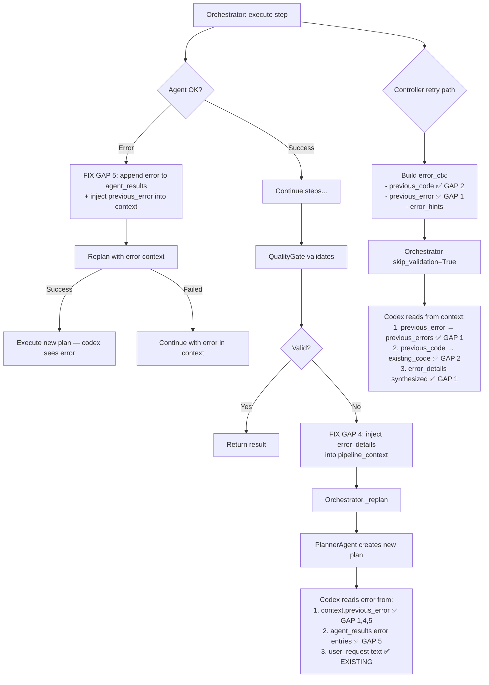

# Анализ качества генерации кода и цепочки обратной связи по ошибкам

**Дата:** 2026-02-18
**Статус:** Завершено — баги исправлены, тесты написаны (6/6 + 19/19 regression)

## Executive Summary

Проведён аудит цепочки `Error → QualityGate → Replan → Codex retry`. Найдено **5 разрывов** в передаче контекста ошибок. Четыре критических исправлены в коде, один архитектурный задокументирован для будущего.

## Найденные проблемы

### GAP 1: Codex не читает `previous_error` из pipeline_context ❌→✅ ИСПРАВЛЕНО

**Проблема:** TransformationController при retry кладёт `previous_error`, `previous_code` в `error_ctx` → `pipeline_context`. Но Codex читает:
- `previous_errors` из **task** (заполняется PlannerAgent) → **всегда пустой список**
- `error_details` из **task** → **всегда null**

Единственный источник ошибки для Codex — `user_request` (текст error_request), но структурированная секция "⚠️ PREVIOUS ERRORS:" в промпте оставалась пуста.

**Исправление** (transform_codex.py):
```python
# FIX GAP 1: fallback — читаем из context
if not previous_errors and context and context.get("previous_error"):
    previous_errors = [context["previous_error"]]

# FIX GAP 1 (part 2): error_details из context
if not error_details and context and context.get("previous_error"):
    error_details = {"error": context["previous_error"], "error_type": "runtime"}
```

### GAP 2: `existing_code` vs `previous_code` при retry ❌→✅ ИСПРАВЛЕНО

**Проблема:** При error retry:
- `existing_code` в context = оригинальный код (до трансформации)
- `previous_code` в context = код последней неудачной попытки
- Codex читал `existing_code` → показывал ОРИГИНАЛЬНЫЙ код в секции "CURRENT CODE", а не последнюю неудачу

На retry #2 это критично: ошибка от попытки #1, но "CURRENT CODE" показывает код до retry.

**Исправление** (transform_codex.py):
```python
# FIX GAP 2: при error retry используем previous_code
if context and context.get("error_retry") and context.get("previous_code"):
    existing_code = context["previous_code"]
```

### GAP 3: `skip_validation=True` при retry ⚠️ ЗАДОКУМЕНТИРОВАНО

**Проблема:** `_handle_execution_error()` вызывает оркестратор с `skip_validation=True`. QualityGate полностью отключён при retry — его `_execute_code_validation()` не запускается, `suggested_replan` не формируется.

**Обоснование текущего решения:** Retry должен быть быстрым (без лишних LLM-вызовов). QualityGate добавляет ~2-5 секунд.

**Рекомендация:** При необходимости добавить опциональный lite-validation (только execution test, без LLM анализа).

### GAP 4: `error_details` из QualityGate теряются при replan ❌→✅ ИСПРАВЛЕНО

**Проблема:** QualityGate создаёт `suggested_replan` → `PlanStep(task={"error_details": {...}})`. Оркестратор передаёт их PlannerAgent, LLM генерирует НОВЫЙ план → `error_details` могут потеряться.

**Исправление** (orchestrator.py): Дублируем `error_details` в `pipeline_context`, откуда Codex теперь их читает (FIX GAP 1 part 2):
```python
# FIX GAP 4: inject error_details into pipeline_context
for step_data in replan_context.get("suggested_steps", []):
    task_data = step_data.get("task", {})
    ed = task_data.get("error_details")
    if ed:
        pipeline_context["previous_error"] = ed.get("error", "")
        pipeline_context["error_retry"] = True
```

### GAP 5: Error result не попадал в `agent_results` при error-based replan ❌→✅ ИСПРАВЛЕНО

**Проблема:** При ошибке шага с последующим replan, `continue` пропускал `pipeline_context["agent_results"].append()`. Ошибочный результат терялся — последующие агенты не видели контекст ошибки. Также `pipeline_context` не получал `previous_error` при error-based реплане.

**Исправление** (orchestrator.py):
```python
# Append error result ПЕРЕД replan
pipeline_context["agent_results"].append(error_result_dict)
pipeline_context["previous_error"] = step_payload.error
pipeline_context["error_retry"] = True
pipeline_context["failed_agent"] = agent_name
```

Дополнительно: при неудачном реплане добавлен `continue` с сохранением в `raw_results`, чтобы избежать двойного append.

## Архитектура цепочки ошибок (после исправлений)



## Тесты

Добавлены 6 E2E тестов в `TestCodeGenerationQuality`:

| Тест                                            | Что проверяет                                                            |
| ----------------------------------------------- | ------------------------------------------------------------------------ |
| `test_simple_transform_produces_valid_code`     | Простая трансформация → валидный Python, исполняется, правильные колонки |
| `test_code_does_not_contain_forbidden_patterns` | Нет eval, exec, open, os.system, subprocess                              |
| `test_error_retry_produces_different_code`      | При error retry код меняется (не повторяется)                            |
| `test_transform_preview_has_correct_structure`  | Preview возвращает план со step для codex                                |
| `test_error_context_reaches_codex`              | Error context доходит до codex (metadata.error_retries)                  |
| `test_iterative_transform_preserves_context`    | existing_code + chat_history передаются при итеративной доработке        |

**Результат:** 6/6 passed; полный regression 19/19 passed (вкл. TestContextArchitecture + TestAdaptiveReplanning)

## Изменённые файлы

1. `apps/backend/app/services/multi_agent/agents/transform_codex.py` — FIX GAP 1, 2
2. `apps/backend/app/services/multi_agent/orchestrator.py` — FIX GAP 4, 5
3. `tests/e2e/test_multi_agent_e2e.py` — 6 новых тестов
