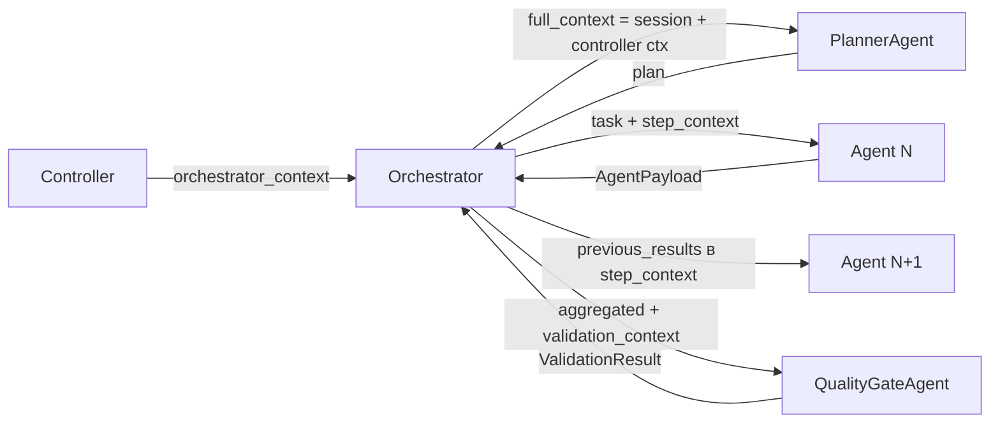
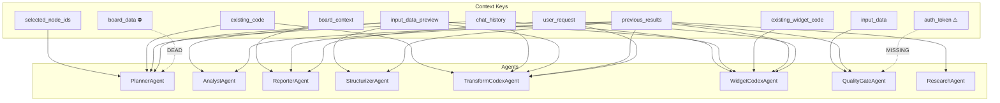

# Аудит использования контекста в Multi-Agent системе

> **Дата**: Июнь 2025  
> **Тип**: READ-ONLY аудит — без изменений кода  
> **Область**: Все контроллеры, оркестратор, все агенты

## Executive Summary

Проведён полный аудит ключей контекста, передаваемых между контроллерами, оркестратором и агентами в GigaBoard Multi-Agent V2.  
Выявлено **8 значимых проблем**: 2 мёртвых ключа, 3 случая несогласованных имён, 2 неявных fallback-паттерна и 1 потенциально отсутствующий ключ.

---

## Поток данных (общая схема)



**full_context** = `{session_id, board_id, user_id, user_request, **orchestrator_context}`  
**step_context** = `{**full_context, previous_results: Dict[str, serialized_payload], task_index: int}`

---

## 1. Per-File Audit

### 1.1 Controllers

#### `transformation_controller.py` (744 строки)

| Действие         | Ключ                 | Значение / формат                                                                      |
| ---------------- | -------------------- | -------------------------------------------------------------------------------------- |
| **PUTS**         | `controller`         | `"transformation"`                                                                     |
| **PUTS**         | `mode`               | `"transformation"`                                                                     |
| **PUTS**         | `selected_node_ids`  | `List[str]`                                                                            |
| **PUTS**         | `content_nodes_data` | `List[Dict]` — данные из БД по selected_node_ids                                       |
| **PUTS**         | `existing_code`      | `str \| None`                                                                          |
| **PUTS**         | `chat_history`       | `List[Dict]`                                                                           |
| **PUTS**         | `transformation_id`  | `str`                                                                                  |
| **PUTS**         | `input_data_preview` | `Dict[table_name → {columns, dtypes, row_count, sample_rows}]` — из реальных DataFrame |
| **PUTS**         | `input_data`         | `Dict[node_id → DataFrame]` — **реальные DataFrame** для ValidatorAgent                |
| **PUTS** (retry) | `error_retry`        | `True`                                                                                 |
| **PUTS** (retry) | `attempt`            | `int`                                                                                  |
| **PUTS** (retry) | `previous_error`     | `str`                                                                                  |
| **PUTS** (retry) | `previous_code`      | `str`                                                                                  |

**⚠️ Не передаёт**: `auth_token` (читает из входного контекста, но не включает в `orchestrator_context`)

---

#### `transform_suggestions_controller.py` (420 строк)

| Действие | Ключ                 | Значение / формат                                                               |
| -------- | -------------------- | ------------------------------------------------------------------------------- |
| **PUTS** | `controller`         | `"transform_suggestions"`                                                       |
| **PUTS** | `mode`               | `"transform_suggestions_new"` или `"transform_suggestions_improve"`             |
| **PUTS** | `input_schemas`      | `List[Dict]` — из входного контекста                                            |
| **PUTS** | `input_data_preview` | `Dict[name → {columns, dtypes, row_count, sample_rows}]` — **из input_schemas** |
| **PUTS** | `existing_code`      | `str \| None` (только в improve-режиме)                                         |
| **PUTS** | `chat_history`       | `List[Dict]`                                                                    |
| **PUTS** | `max_suggestions`    | `int` (default 3)                                                               |

**⚠️ Формат `input_data_preview`** создаётся из `input_schemas` (не из реальных DataFrame), поэтому `sample_rows` берутся из `schema.sample_rows`, а `dtypes` из `schema.dtypes`.

---

#### `widget_controller.py` (260 строк)

| Действие | Ключ                   | Значение / формат                                         |
| -------- | ---------------------- | --------------------------------------------------------- |
| **PUTS** | `controller`           | `"widget"`                                                |
| **PUTS** | `mode`                 | `"widget"`                                                |
| **PUTS** | `is_refinement`        | `bool`                                                    |
| **PUTS** | `content_node_id`      | `str`                                                     |
| **PUTS** | `content_node`         | `{id, tables, text_content, metadata}` — собранный объект |
| **PUTS** | `data`                 | `{tables: List[Dict], text: str}` — из content_data       |
| **PUTS** | `existing_widget_code` | `str \| None`                                             |
| **PUTS** | `chat_history`         | `List[Dict]`                                              |

---

#### `widget_suggestions_controller.py` (280 строк)

| Действие | Ключ                  | Значение / формат                                             |
| -------- | --------------------- | ------------------------------------------------------------- |
| **PUTS** | `controller`          | `"widget_suggestions"`                                        |
| **PUTS** | `mode`                | `"widget_suggestions_new"` или `"widget_suggestions_improve"` |
| **PUTS** | `content_node_id`     | `str`                                                         |
| **PUTS** | `content_data`        | `Dict` — as-is из входного контекста                          |
| **PUTS** | `current_widget_code` | `str \| None`                                                 |
| **PUTS** | `chat_history`        | `List[Dict]`                                                  |
| **PUTS** | `max_suggestions`     | `int` (default 3)                                             |

**⚠️ Naming**: `current_widget_code` (здесь) vs `existing_widget_code` (widget_controller) — разные имена для одной сущности!

---

#### `ai_assistant_controller.py` (419 строк)

| Действие | Ключ                 | Значение / формат                                                        |
| -------- | -------------------- | ------------------------------------------------------------------------ |
| **PUTS** | `controller`         | `"ai_assistant"`                                                         |
| **PUTS** | `mode`               | `"assistant"`                                                            |
| **PUTS** | `board_context`      | `Dict` — полное состояние доски                                          |
| **PUTS** | `selected_node_ids`  | `List[str]`                                                              |
| **PUTS** | `content_nodes_data` | `List[Dict]` — переименовано из `selected_nodes_data` входного аргумента |
| **PUTS** | `chat_history`       | `List[Dict]`                                                             |

---

### 1.2 Orchestrator (`orchestrator.py`, 960 строк)

**Сборка `full_context`** (~строка 289):
```python
full_context = {
    "session_id": session_id,
    "board_id": board_id,
    "user_id": user_id,
    "user_request": user_request,
    **context  # всё из orchestrator_context контроллера
}
```

**Задача для PlannerAgent**:
```python
task = {
    "type": "create_plan",
    "user_request": user_request,
    "board_context": full_context.get("board_context"),
    "selected_node_ids": full_context.get("selected_node_ids"),
}
```

**step_context для каждого шага**:
```python
step_context = {
    **full_context,
    "previous_results": serialized_previous_results,  # Dict[str, Dict]
    "task_index": step_index,
}
```

**Хранение результатов**: `previous_results[agent_name] = payload` и `previous_results[step_id] = previous_results[agent_name]` (дублирование по id).

**validation_context**:
```python
validation_context = {
    **full_context,
    "previous_results": serialized_previous,
    "aggregated": aggregated_payload.model_dump(),
}
```

**Replan (добавляется в full_context)**:
- `validation_failed` = `True`
- `validation_message` = `str`
- `validation_issues` = `List[Dict]`
- `suggested_steps` = `List[Dict]`

---

### 1.3 Agents

#### `PlannerAgent` (`planner.py`, 1168 строк)

| Источник    | Ключ                 | Метод                                                |
| ----------- | -------------------- | ---------------------------------------------------- |
| **task**    | `type`               | `"create_plan"` \| `"replan"` \| `"evaluate_result"` |
| **task**    | `user_request`       | str                                                  |
| **task**    | `original_plan`      | Dict (replan)                                        |
| **task**    | `reason`             | str (replan)                                         |
| **task**    | `failed_step`        | str (replan)                                         |
| **task**    | `suggested_steps`    | List (replan)                                        |
| **task**    | `validation_issues`  | List (replan)                                        |
| **context** | `board_id`           | str                                                  |
| **context** | `selected_node_ids`  | List[str]                                            |
| **context** | `existing_code`      | str                                                  |
| **context** | `chat_history`       | List                                                 |
| **context** | `input_data_preview` | Dict                                                 |
| **context** | `board_data`         | ⛔ **НИКЕМ НЕ УСТАНАВЛИВАЕТСЯ**                       |

**Проблема**: `context.get("board_data")` → всегда `None`. AIAssistantController ставит `board_context`, а не `board_data`.

---

#### `AnalystAgent` (`analyst.py`, 737 строк)

| Источник    | Ключ                 | Метод                              |
| ----------- | -------------------- | ---------------------------------- |
| **task**    | `description`        | str                                |
| **task**    | `input_data`         | List[Dict] с таблицами ContentNode |
| **task**    | `structured_data`    | Dict (от StructurizerAgent)        |
| **context** | `session_id`         | str                                |
| **context** | `previous_results`   | Dict                               |
| **context** | `input_data_preview` | Dict                               |

**Особенность — скрытое обогащение task**: если `"input_data" not in task` и `context.get("input_data_preview")` есть, агент **создаёт** `task["input_data"]` из preview. Это мутация `task`, скрытая побочка.

---

#### `ReporterAgent` (`reporter.py`, 926 строк)

| Источник      | Ключ                                      | Метод                   |
| ------------- | ----------------------------------------- | ----------------------- |
| **context**   | `previous_results`                        | Dict (основной V2 путь) |
| **context**   | `session_id`                              | str                     |
| **context**   | `user_request`                            | str                     |
| **context**   | `board_context` → `.get("content_nodes")` | Dict                    |
| **task** (V1) | `content_node`                            | Dict                    |
| **task** (V1) | `data_preview`                            | str                     |
| **task** (V1) | `data_schema`                             | str                     |
| **task** (V1) | `chart_type`                              | str                     |
| **task** (V1) | `existing_widget_code`                    | str                     |
| **task** (V1) | `chat_history`                            | List                    |

**Поведение**: В V2-пути (`_assemble_report`) подбирает все narrative, findings, tables, code_blocks из `previous_results`. V1-путь (`_create_visualization`) использует Redis `get_agent_result`.

---

#### `StructurizerAgent` (`structurizer.py`, 573 строки)

| Источник    | Ключ                                       | Приоритет              |
| ----------- | ------------------------------------------ | ---------------------- |
| **task**    | `raw_content`                              | 1 (наивысший)          |
| **task**    | `pages`                                    | 2                      |
| **context** | `previous_results` → sources(fetched=True) | 3 (V2 путь)            |
| **context** | `previous_results` → results[].pages       | 3 (V1 путь)            |
| **task**    | `data`                                     | 4                      |
| **context** | `input_data_preview`                       | 5                      |
| **context** | `content_nodes_data`                       | 6 (последний fallback) |

**Особенность**: Цепочка из 6 fallback-источников в `_extract_raw_content()`. `content_nodes_data` — последний fallback, устанавливается TransformationController и AIAssistantController.

---

#### `TransformCodexAgent` (`transform_codex.py`, 769 строк)

| Источник    | Ключ                 | Fallback                                        |
| ----------- | -------------------- | ----------------------------------------------- |
| **task**    | `purpose`            | `"transformation"` \| `"widget"`                |
| **task**    | `description`        | str                                             |
| **task**    | `input_schemas`      | → fallback: `context.get("input_data_preview")` |
| **task**    | `previous_errors`    | List                                            |
| **task**    | `existing_code`      | → fallback: `context.get("existing_code")`      |
| **task**    | `error_details`      | Dict                                            |
| **task**    | `input_data`         | для data summary (fallback: context)            |
| **context** | `input_data_preview` | fallback для input_schemas И data summary       |
| **context** | `existing_code`      | fallback                                        |
| **context** | `user_request`       | str                                             |
| **context** | `previous_results`   | для analyst context                             |
| **context** | `chat_history`       | List                                            |

**Особенность**: `input_schemas` в task vs `input_data_preview` в context — **разные имена для одних данных**, что маскируется двойным fallback-чтением.

---

#### `WidgetCodexAgent` (`widget_codex.py`, 915 строк)

| Источник    | Ключ                   | Комментарий                        |
| ----------- | ---------------------- | ---------------------------------- |
| **task**    | `description`          | str                                |
| **task**    | `input_data`           | для data summary                   |
| **context** | `previous_results`     | для data summary из tables агентов |
| **context** | `user_request`         | str                                |
| **context** | `existing_widget_code` | str                                |
| **context** | `chat_history`         | List                               |
| **context** | `input_data_preview`   | fallback для data summary          |

---

#### `QualityGateAgent` (`quality_gate.py`, 712 строк)

| Источник    | Ключ                                        | Комментарий                               |
| ----------- | ------------------------------------------- | ----------------------------------------- |
| **task**    | `original_request` \| `user_request`        | str (два имени!)                          |
| **task**    | `iteration`                                 | int                                       |
| **task**    | `max_iterations`                            | int                                       |
| **task**    | `aggregated_result` \| `aggregated_payload` | Dict                                      |
| **task**    | `expected_outcome`                          | str                                       |
| **context** | `previous_results`                          | fallback для aggregated                   |
| **context** | `input_data`                                | **реальные DataFrame** для code execution |
| **context** | `user_id`                                   | str                                       |
| **context** | `auth_token`                                | ⚠️ **Не передаётся ни одним контроллером** |

**Проблема `auth_token`**: QualityGateAgent вызывает `self.executor.execute_transformation(auth_token=context.get("auth_token"))`, но ни один контроллер не включает `auth_token` в `orchestrator_context`. Значение всегда `None`.

---

#### `DiscoveryAgent` (`discovery.py`, ~500 строк)

| Источник | Ключ          |
| -------- | ------------- |
| **task** | `description` |
| **task** | `query`       |
| **task** | `search_type` |
| **task** | `max_results` |
| **task** | `region`      |

**Не читает context** — полностью self-contained.

---

#### `ResearchAgent` (`research.py`, ~500 строк)

| Источник    | Ключ               | Комментарий                                          |
| ----------- | ------------------ | ---------------------------------------------------- |
| **task**    | `url`              | str                                                  |
| **task**    | `urls`             | List[str]                                            |
| **task**    | `query`            | str                                                  |
| **task**    | `database`         | str                                                  |
| **task**    | `max_urls`         | int                                                  |
| **context** | `previous_results` | sources с `fetched=False` (V2), results[].pages (V1) |

---

## 2. Сводная таблица: Context Key → Writer → Reader

| Context Key            | Кто пишет (controller / orchestrator)           | Кто читает (agent)                                                                                                     | Формат                                                   |
| ---------------------- | ----------------------------------------------- | ---------------------------------------------------------------------------------------------------------------------- | -------------------------------------------------------- |
| `session_id`           | Orchestrator                                    | AnalystAgent, ReporterAgent                                                                                            | `str`                                                    |
| `board_id`             | Orchestrator                                    | PlannerAgent                                                                                                           | `str`                                                    |
| `user_id`              | Orchestrator                                    | QualityGateAgent                                                                                                       | `str`                                                    |
| `user_request`         | Orchestrator                                    | ReporterAgent, TransformCodexAgent, WidgetCodexAgent                                                                   | `str`                                                    |
| `controller`           | Все контроллеры                                 | Orchestrator (routing)                                                                                                 | `str`                                                    |
| `mode`                 | Все контроллеры                                 | Orchestrator (plan selection)                                                                                          | `str`                                                    |
| `selected_node_ids`    | TransformationCtrl, AIAssistantCtrl             | PlannerAgent                                                                                                           | `List[str]`                                              |
| `content_nodes_data`   | TransformationCtrl, AIAssistantCtrl             | StructurizerAgent                                                                                                      | `List[Dict]`                                             |
| `existing_code`        | TransformationCtrl, TransformSuggestionsCtrl    | PlannerAgent, TransformCodexAgent                                                                                      | `str \| None`                                            |
| `chat_history`         | 5 контроллеров (все)                            | PlannerAgent, TransformCodexAgent, WidgetCodexAgent                                                                    | `List[Dict]`                                             |
| `input_data_preview`   | TransformationCtrl, TransformSuggestionsCtrl    | PlannerAgent, AnalystAgent, StructurizerAgent, TransformCodexAgent, WidgetCodexAgent                                   | `Dict[name → {columns, dtypes, row_count, sample_rows}]` |
| `input_data`           | TransformationCtrl                              | QualityGateAgent                                                                                                       | `Dict[node_id → DataFrame]`                              |
| `existing_widget_code` | WidgetCtrl                                      | WidgetCodexAgent                                                                                                       | `str \| None`                                            |
| `board_context`        | AIAssistantCtrl                                 | ReporterAgent                                                                                                          | `Dict` (полное состояние доски)                          |
| `content_node`         | WidgetCtrl                                      | ReporterAgent (V1 legacy)                                                                                              | `{id, tables, text_content, metadata}`                   |
| `data`                 | WidgetCtrl                                      | StructurizerAgent (via task)                                                                                           | `{tables, text}`                                         |
| `content_node_id`      | WidgetCtrl, WidgetSuggestionsCtrl               | — (не читается агентами напрямую)                                                                                      | `str`                                                    |
| `content_data`         | WidgetSuggestionsCtrl                           | — (не читается агентами напрямую)                                                                                      | `Dict`                                                   |
| `current_widget_code`  | WidgetSuggestionsCtrl                           | — (не читается агентами напрямую)                                                                                      | `str \| None`                                            |
| `is_refinement`        | WidgetCtrl                                      | — (не читается агентами напрямую)                                                                                      | `bool`                                                   |
| `transformation_id`    | TransformationCtrl                              | — (не читается агентами напрямую)                                                                                      | `str`                                                    |
| `input_schemas`        | TransformSuggestionsCtrl                        | — (только из task, не context)                                                                                         | `List[Dict]`                                             |
| `max_suggestions`      | TransformSuggestionsCtrl, WidgetSuggestionsCtrl | — (не читается агентами напрямую)                                                                                      | `int`                                                    |
| `previous_results`     | Orchestrator (per-step)                         | AnalystAgent, ReporterAgent, StructurizerAgent, TransformCodexAgent, WidgetCodexAgent, QualityGateAgent, ResearchAgent | `Dict[agent_name → serialized AgentPayload]`             |
| `task_index`           | Orchestrator                                    | — (не читается агентами напрямую)                                                                                      | `int`                                                    |
| `aggregated`           | Orchestrator (validation)                       | QualityGateAgent (via task)                                                                                            | `Dict` (merged payload)                                  |
| `error_retry`          | TransformationCtrl                              | — (routing в orchestrator?)                                                                                            | `bool`                                                   |
| `previous_error`       | TransformationCtrl                              | — (routing?)                                                                                                           | `str`                                                    |
| `previous_code`        | TransformationCtrl                              | — (routing?)                                                                                                           | `str`                                                    |
| `validation_failed`    | Orchestrator (replan)                           | — (internal)                                                                                                           | `bool`                                                   |
| `validation_message`   | Orchestrator (replan)                           | — (internal)                                                                                                           | `str`                                                    |
| `validation_issues`    | Orchestrator (replan)                           | PlannerAgent (via task)                                                                                                | `List[Dict]`                                             |
| `suggested_steps`      | Orchestrator (replan)                           | PlannerAgent (via task)                                                                                                | `List[Dict]`                                             |
| ⛔ `board_data`         | **НИКЕМ**                                       | PlannerAgent                                                                                                           | **МЁРТВЫЙ КЛЮЧ**                                         |
| ⚠️ `auth_token`         | **НИКЕМ** (в orchestrator_context)              | QualityGateAgent                                                                                                       | **НЕ ПЕРЕДАЁТСЯ**                                        |

---

## 3. Все уникальные context keys (38 шт.)

```
aggregated              controller              mode
auth_token              content_data            previous_code
attempt                 content_node            previous_error
board_context           content_node_id         previous_results
board_data              content_nodes_data      selected_node_ids
board_id                current_widget_code     session_id
chat_history            data                    suggested_steps
error_retry             existing_code           task_index
existing_widget_code    input_data              transformation_id
input_data_preview      input_schemas           user_id
is_refinement           max_suggestions         user_request
validation_failed       validation_issues       validation_message
```

Из них:
- **4** устанавливаются Orchestrator автоматически: `session_id`, `board_id`, `user_id`, `user_request`
- **3** устанавливаются Orchestrator per-step: `previous_results`, `task_index`, `aggregated`
- **4** устанавливаются Orchestrator при replan: `validation_failed`, `validation_message`, `validation_issues`, `suggested_steps`
- **~25** устанавливаются контроллерами
- **2** никем не устанавливаются: `board_data`, `auth_token`

---

## 4. Выявленные проблемы

### 🔴 Критические

#### P1. `board_data` — мёртвый ключ
- **Где**: `planner.py` → `_build_planning_prompt()` → `context.get("board_data")`
- **Проблема**: Ни один контроллер не устанавливает `board_data`. AIAssistantController ставит `board_context`.
- **Следствие**: PlannerAgent никогда не получает данные о доске из этого ключа.
- **Рекомендация**: Заменить `context.get("board_data")` на `context.get("board_context")` в PlannerAgent, или добавить маппинг в orchestrator.

#### P2. `auth_token` не передаётся в контекст
- **Где**: `quality_gate.py` → `_execute_code_validation()` → `context.get("auth_token")`
- **Проблема**: TransformationController читает `auth_token` из входного контекста, но **не включает** его в `orchestrator_context`.
- **Следствие**: `execute_transformation(auth_token=None)` — код выполняется без авторизации. Для текущей архитектуры (локальный executor) может работать, но нарушает контракт.
- **Рекомендация**: Добавить `auth_token` в `orchestrator_context` в TransformationController.

### 🟡 Значимые несогласованности

#### P3. `current_widget_code` vs `existing_widget_code`
- **Где**: WidgetSuggestionsController ставит `current_widget_code`. WidgetController ставит `existing_widget_code`. WidgetCodexAgent читает `existing_widget_code`.
- **Проблема**: Разные имена для одной сущности. WidgetCodexAgent **не увидит** код виджета при вызове из WidgetSuggestionsController.
- **Рекомендация**: Унифицировать на `existing_widget_code`.

#### P4. `input_data_preview` — разный формат из разных контроллеров
- **Источник 1**: TransformationController строит из реальных DataFrame → `{columns, dtypes: {col: dtype_str}, row_count, sample_rows: df.head(5).to_dict("records")}`
- **Источник 2**: TransformSuggestionsController строит из `input_schemas` → `{columns, dtypes: schema.dtypes, row_count, sample_rows: schema.sample_rows}`
- **Проблема**: `dtypes` может быть `Dict[col→str]` (из DataFrame.dtypes) или in different format (from schema). `sample_rows` format тоже may differ.
- **Рекомендация**: Нормализовать формат `input_data_preview` через helper-функцию.

#### P5. AnalystAgent мутирует `task` в runtime
- **Где**: `analyst.py` → `process_task()` — если `"input_data" not in task` и `context.get("input_data_preview")` есть, агент **создаёт** `task["input_data"]` из preview.
- **Проблема**: Скрытая мутация словаря `task`, переданного извне. Может вызвать побочные эффекты если task используется повторно.
- **Рекомендация**: Создавать локальную копию или отдельную переменную.

#### P6. TransformCodexAgent — двойной fallback для `input_schemas` / `existing_code`
- **Где**: `transform_codex.py` → `_generate_transformation()`
  - `input_schemas = task.get("input_schemas") or context.get("input_data_preview")`
  - `existing_code = task.get("existing_code") or context.get("existing_code")`
- **Проблема**: Маскирует несогласованность имён. `input_schemas` (task) и `input_data_preview` (context) — одни данные под разными именами. Неясно, кто должен устанавливать какой ключ.
- **Рекомендация**: Определить единый источник: либо task, либо context.

### 🔵 Информационные

#### P7. Ключи, устанавливаемые но не читаемые агентами
Следующие context-ключи устанавливаются контроллерами, но **ни один агент** не читает их напрямую:
- `content_node_id` (WidgetCtrl, WidgetSuggestionsCtrl)
- `content_data` (WidgetSuggestionsCtrl)
- `current_widget_code` (WidgetSuggestionsCtrl) — кроме naming-проблемы P3
- `is_refinement` (WidgetCtrl)
- `transformation_id` (TransformationCtrl)
- `input_schemas` (TransformSuggestionsCtrl)
- `max_suggestions` (TransformSuggestionsCtrl, WidgetSuggestionsCtrl)
- `error_retry`, `attempt`, `previous_error`, `previous_code` (TransformationCtrl retry)

Эти ключи могут использоваться Orchestrator'ом для routing или передаваться в task PlannerAgent'ом, но **прямого потребителя среди агентов нет**.

#### P8. Дублирование ключей в `previous_results`
- **Где**: `orchestrator.py` — `previous_results[agent_name] = payload` И `previous_results[step_id] = previous_results[agent_name]`
- **Проблема**: Один и тот же payload хранится под двумя ключами (agent_name и step_id). При сериализации orchestrator дедуплицирует по `id()`, но это добавляет сложность.
- **Следствие**: Агенты обращаются к `previous_results` по `agent_name`, step_id-ключи не используются.

---

## 5. Карта зависимостей агентов от context keys



---

## 6. Резюме

| Категория                          | Количество                           |
| ---------------------------------- | ------------------------------------ |
| Уникальных context keys            | 38                                   |
| Контроллеров                       | 5                                    |
| Агентов                            | 9                                    |
| 🔴 Критических проблем              | 2 (P1 `board_data`, P2 `auth_token`) |
| 🟡 Значимых несогласованностей      | 4 (P3–P6)                            |
| 🔵 Информационных замечаний         | 2 (P7–P8)                            |
| Ключей без читателей среди агентов | 8+                                   |
| Агентов без чтения context         | 1 (DiscoveryAgent)                   |
