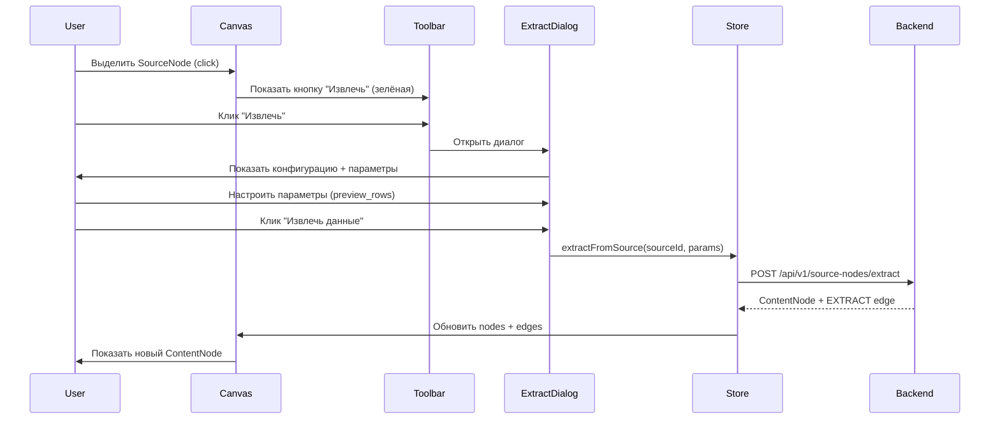

# Extract Dialog System — Унификация UX с Transform

**Дата**: 2026-02-01  
**Статус**: ✅ Завершено  
**Контекст**: Унификация UX для Extract и Transform операций

---

## 🎯 Проблема

**До изменений**:
- **Transform**: кнопка на верхней панели при выделении ContentNode → TransformDialog
- **Extract**: кнопка прямо в SourceNodeCard (неконсистентно!)

**Проблемы**:
- Разный UX для концептуально похожих операций
- Extract визуально менее заметен
- Нет единообразия интерфейса

---

## ✅ Решение

Унифицирован UX паттерн:

### Extract теперь работает как Transform:
1. Пользователь выделяет **ровно 1 SourceNode** на canvas
2. На верхней панели появляется кнопка **"Извлечь"** (зелёная)
3. Клик → открывается **ExtractDialog**
4. Диалог показывает конфигурацию источника + параметры
5. Кнопка "Извлечь данные" → создаётся ContentNode + EXTRACT edge

### Оставлено в меню SourceNodeCard:
- Extract (для quick access)
- Refresh
- Validate Config
- Configure

---

## 🎨 Реализация

### 1. **ExtractDialog Component** (новый)

**Файл**: `apps/web/src/components/board/ExtractDialog.tsx`

**Возможности**:
- 📋 **Tab "Конфигурация"**: информация о SourceNode
  - Название источника
  - Тип (file, database, api, prompt, stream, manual)
  - Конфигурация (summary)
  - Описание
  - Статус валидации
  
- ⚙️ **Tab "Параметры"**: настройки извлечения
  - `preview_rows` для File и Database (ограничение строк)
  - Подсказки для каждого типа источника
  - Специальные алерты для Prompt (AI) и Stream

**Адаптация под типы источников**:
```tsx
// FILE, DATABASE
- Поле "Количество строк для предпросмотра"
- Default: 100 (рекомендуется не более 1000)

// PROMPT
- Alert: "AI-генерация данных через GigaChat"
- Показывает промпт

// STREAM
- Alert: "Функциональность в разработке (Phase 4)"

// MANUAL
- Данные уже введены, используются как есть

// API
- Дополнительные параметры передаются в запрос
```

**Иконки по типам**:
- FILE → FileText (синий)
- DATABASE → Database (фиолетовый)
- API → Globe (зелёный)
- PROMPT → MessageSquare (оранжевый)
- STREAM → Radio (красный)
- MANUAL → Edit3 (серый)

---

### 2. **BoardCanvas Updates**

**Файл**: `apps/web/src/components/board/BoardCanvas.tsx`

**Изменения**:

1. **Импорт ExtractDialog**:
```tsx
import { ExtractDialog } from '@/components/board/ExtractDialog'
import { Download } from 'lucide-react'
```

2. **Состояние**:
```tsx
const [showExtractDialog, setShowExtractDialog] = useState(false)
const [selectedSourceNodeForExtract, setSelectedSourceNodeForExtract] = useState<SourceNode | null>(null)
```

3. **Handler**:
```tsx
const handleExtractSelected = useCallback(() => {
    const selectedNodes = nodes.filter((n) => n.selected && n.type === 'sourceNode')
    if (selectedNodes.length !== 1) {
        notify.error('Выберите ровно один SourceNode для извлечения данных')
        return
    }

    const sourceNode = sourceNodes.find(sn => sn.id === selectedNodes[0].id)
    if (sourceNode) {
        setSelectedSourceNodeForExtract(sourceNode)
        setShowExtractDialog(true)
    }
}, [nodes, sourceNodes])
```

4. **Кнопка на toolbar** (зелёная тема):
```tsx
{hasSelectedSourceNode && (
    <Button
        size="sm"
        variant="outline"
        onClick={handleExtractSelected}
        className="shadow-md bg-green-500/10 border-green-500/30 hover:bg-green-500/20"
    >
        <Download className="mr-2 h-4 w-4" />
        Извлечь
    </Button>
)}
```

5. **Dialog интеграция**:
```tsx
{selectedSourceNodeForExtract && (
    <ExtractDialog
        open={showExtractDialog}
        onOpenChange={setShowExtractDialog}
        sourceNode={selectedSourceNodeForExtract}
        onExtract={async (params) => {
            const extractFromSource = useBoardStore.getState().extractFromSource
            const contentNode = await extractFromSource(selectedSourceNodeForExtract.id, params)
            
            if (contentNode) {
                // Refresh to show new ContentNode and EXTRACT edge
                await fetchContentNodes(boardId)
                await fetchEdges(boardId)
            }
            
            return contentNode
        }}
    />
)}
```

---

### 3. **SourceNodeCard Updates**

**Файл**: `apps/web/src/components/board/SourceNodeCard.tsx`

**Изменения**:
- ❌ **Убрана**: Большая кнопка "Извлечь данные" из CardContent
- ✅ **Оставлена**: Extract в dropdown menu (для quick access)

**До**:
```tsx
<CardContent className="p-3 pt-0">
    {/* Большая кнопка Extract */}
    <Button onClick={handleExtract}>...</Button>
    {/* Status */}
</CardContent>
```

**После**:
```tsx
<CardContent className="p-3 pt-0">
    {/* Config summary */}
    {/* Description */}
    {/* Status только */}
</CardContent>
```

---

## 🔄 User Workflow

### Новый паттерн (единообразный):



---

## 📊 Сравнение (До → После)

| Аспект                  | До                      | После                         |
| ----------------------- | ----------------------- | ----------------------------- |
| **Transform**           | Toolbar button → Dialog | Toolbar button → Dialog       |
| **Extract**             | Card button             | ✅ **Toolbar button → Dialog** |
| **Консистентность**     | ❌ Разный UX             | ✅ Единообразный UX            |
| **Параметры**           | Нет UI                  | ✅ Tabs: Config + Params       |
| **Типы источников**     | Generic                 | ✅ Адаптивные подсказки        |
| **Визуальная иерархия** | Extract менее заметен   | ✅ Выделяется на toolbar       |

---

## 💡 Преимущества

1. **Консистентность UX**: Extract и Transform работают одинаково
2. **Лучшая видимость**: Кнопка на toolbar более заметна
3. **Богаче функциональность**: Tabs + параметры + подсказки
4. **Адаптивность**: Разные UI для разных типов источников
5. **Меньше кликов**: Один клик вместо "открыть card → найти кнопку"

---

## 🎨 Visual Design

### Цветовая схема:
- **Extract button**: Зелёная тема (`bg-green-500/10`)
- **Transform button**: Синяя (default)
- **Visualize button**: Фиолетовая (`bg-purple-500/10`)

### Icons:
- Extract: `Download` (загрузка данных из источника)
- Transform: `Wand2` (магическая трансформация)
- Visualize: `TrendingUp` (визуализация графиков)

---

## 📝 Код Changes Summary

### Новые файлы:
1. `apps/web/src/components/board/ExtractDialog.tsx` — 300+ строк

### Изменённые файлы:
1. `apps/web/src/components/board/BoardCanvas.tsx`:
   - Import ExtractDialog + Download icon
   - State: showExtractDialog, selectedSourceNodeForExtract
   - Handler: handleExtractSelected
   - Toolbar: кнопка "Извлечь" (conditional)
   - Dialog: ExtractDialog integration
   - Helper: hasSelectedSourceNode

2. `apps/web/src/components/board/SourceNodeCard.tsx`:
   - Убрана большая кнопка Extract из CardContent
   - Оставлена Extract только в dropdown menu

---

## ✅ Testing Checklist

- [x] ExtractDialog открывается при клике на кнопку "Извлечь"
- [x] Tabs работают (Конфигурация ↔ Параметры)
- [x] Разные источники показывают разные подсказки
- [x] Preview rows input работает (для File, Database)
- [x] Extract вызывает API и создаёт ContentNode
- [x] EXTRACT edge создаётся автоматически
- [x] Кнопка "Извлечь" показывается только при выделении 1 SourceNode
- [x] Кнопка скрывается при снятии выделения
- [ ] Manual testing: создать SourceNode → выделить → Extract → проверить ContentNode

---

## 🚀 Следующие шаги

**Опциональные улучшения**:
1. **Preview mode** — показывать превью данных перед финальным Extract (как в Transform)
2. **Validation** — автоматическая валидация конфигурации при открытии диалога
3. **History** — сохранение последних использованных параметров
4. **Templates** — сохранённые конфигурации для частых источников

---

## 🎉 Итог

**Extract теперь работает как Transform** — единообразный, интуитивный UX!

**Реализовано**:
- ✅ ExtractDialog с tabs и адаптивным UI
- ✅ Кнопка "Извлечь" на верхней панели (зелёная)
- ✅ Поддержка всех 6 типов источников
- ✅ Параметры извлечения (preview_rows, etc)
- ✅ Консистентный UX с Transform и Visualize

**Пользователи получают**:
- Более понятный интерфейс
- Богаче возможности настройки
- Визуально более заметные действия
- Единый паттерн для всех операций
