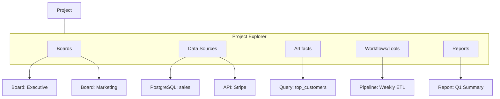

# Структура проекта и навигация

**Последнее обновление**: 2026-01-23  
**Статус**: Draft (для обсуждения и доработки)

---

## Обзор

GigaBoard организуется вокруг сущности «Проект», в котором живут несколько аналитических досок, общие источники данных и артефакты (запросы, датасеты, шаблоны виджетов, инструменты/пайплайны агентов, отчёты). Такой подход облегчает совместную работу, переиспользование и воспроизводимость.

Связанные документы:
- [ARCHITECTURE.md](ARCHITECTURE.md)
- [UI_DESIGN.md](UI_DESIGN.md)
- [DYNAMIC_FORM_GENERATION.md](DYNAMIC_FORM_GENERATION.md)
- [CONNECTION_TYPES.md](CONNECTION_TYPES.md)
- [WIDGET_RENDERING_SYSTEM.md](WIDGET_RENDERING_SYSTEM.md)

---

## Сущности проекта

### Project (Проект)
- Контейнер для досок, источников, артефактов, настроек доступа и истории.
- Метаданные: владельцы, участники, теги, даты, статусы.

### Boards (Доски)
- Несколько досок в одном проекте: каждая — канвас из виджетов и связей.
- Имеют раскладки (flow/grid/hierarchy/freeform), историю изменений, шаблоны.
- Реал‑тайм присутствие и совместное редактирование. См. [ARCHITECTURE.md](ARCHITECTURE.md).

### Data Sources (Источники данных)
- Подключения к БД/API/файлам/облаку, каталоги таблиц/эндпоинтов.
- Кэш превью, схемы, политики обновления. См. [DYNAMIC_FORM_GENERATION.md](DYNAMIC_FORM_GENERATION.md).

### Artifacts (Артефакты)
- Сохраняемые запросы/датасеты, шаблоны виджетов, пайплайны/инструменты агентов, экспорты/отчёты.
- История версий и результаты выполнения workflow.

### Workflows/Tools (Инструменты/пайплайны)
- Шаги агентов, расписания, логи выполнения, результаты. См. [ARCHITECTURE.md](ARCHITECTURE.md).

### Reports/Exports (Отчёты/Экспорты)
- Снапшоты, PDF/CSV, шаринг ссылкой, публикация.

### Users/Roles (Пользователи/роли)
- Права на уровне проекта и досок (просмотр/редактирование/админ).

### Versioning/History (Версионирование/история)
- Срезы проекта, версии досок, диффы, откат по шагам/сессиям.

---

## Почему «несколько досок в одном проекте»

- Разделение по продуктам/командам с общими источниками и артефактами.
- Переиспользование подключений и шаблонов → меньше дублирования.
- Воспроизводимость: workflow и версии живут в проекте; доски — представления.

---

## Панель «Project Explorer» (левая панель дерева)

Предлагается фиксированная левая панель (280–320px) как дерево проекта с быстрыми действиями.

**Функции и UX:**
- Создание/импорт, переименование, дублирование, экспорт, удаление.
- Drag‑and‑drop артефактов на канвас для добавления на текущую доску.
- Поиск/фильтр по узлам; «Недавние»/«Избранные».
- Контекстные меню на узлах; индикаторы статуса (загрузка, ошибки, обновления).

**Доступность (A11y):**
- `role="tree"` / `role="treeitem"`, `aria-expanded`, `aria-selected`.
- Клавиатура: Left/Right/Up/Down/Enter/Space; Home/End; type‑ahead.

**Производительность:**
- Виртуализация списков, lazy‑load веток, дебаунс поиска.

---

## Навигация и маршруты

- `/welcome` — окно приветствия.
- `/project/:projectId` — обзор проекта (слева дерево, справа контент).
- `/project/:projectId/board/:boardId` — основная работа с доской.
- `/integrations` — список подключений/источников.
- `/artifacts/:artifactId` — отдельный артефакт (запрос/датасет/шаблон/отчёт).
- `/settings` — глобальные и проектные настройки.

**Топбар:** переключатель режимов (Build/Analyze/Automate), глобальный поиск, присутствие, настройки. См. [UI_DESIGN.md](UI_DESIGN.md).

**Правые панели:**
- Панель ассистента (диалог, контекст, предложения действий). См. [UI_DESIGN.md](UI_DESIGN.md).
- Инспектор свойств (динамические формы, условная логика). См. [DYNAMIC_FORM_GENERATION.md](DYNAMIC_FORM_GENERATION.md).

---

## Окно приветствия (Welcome)

**Секции (по состоянию реализации):**
- Приветствие и кнопки **«Создать проект»**, **«Импорт проекта»** (открывает диалог выбора `.zip`, см. [`API.md`](../API.md) §3).
- Блок **«Мои проекты»**: сетка карточек с метриками (доски, дашборды, источники и т.д.); у карточки — **«Открыть»**, меню действий: **Изменить** (владелец), **Экспорт** (не viewer), **Поделиться** (владелец/admin), затем разделитель и **Удалить** (владелец).
- При **пустом** списке проектов — те же **«Создать проект»** и **«Импорт проекта»** в карточке-заглушке.

**Импорт проекта из ZIP** — только архив, полученный экспортом на этом сервере (`GET .../export`); создаётся **новый** проект у текущего пользователя.

**Исторически в концепте также:** избранные, шаблоны, импорт из URL/репо, туториал — при появлении в продукте сверять с кодом и обновить этот раздел.

**A11y:**
- `role="list"` для проектов; карточки с фокус‑контуром; доступные ярлыки.

**Перф:**
- Скелетоны загрузки, пагинация, инкрементальная отдача, кэш недавних.

---

## Экран доски (Board View)

- Канвас (React Flow) с виджетами и связями: drag‑drop, snap‑to‑grid, мультивыбор, выравнивания.
- Типизированные связи: Data Flow, Dependency, Causality, Drill‑Down, Reference, Annotation, Custom. См. [CONNECTION_TYPES.md](CONNECTION_TYPES.md).
- Виджеты: метрика/график/таблица/heatmap/gauge/кастомный HTML; агент‑генерация и валидация. См. [WIDGET_RENDERING_SYSTEM.md](WIDGET_RENDERING_SYSTEM.md).

---

## Доступность и производительность (гайдлайны)

- **WCAG AA:** роли, aria‑метки, порядок фокуса, контраст ≥ 4.5:1; «уменьшить анимацию».
- **Панель ассистента:** `aria-live="polite"`, управляемый фокус, шорткаты (Tab/Enter/Shift+Enter/Escape). См. [UI_DESIGN.md](UI_DESIGN.md).
- **Производительность:** виртуализация, дебаунс, скелетоны; P95 real‑time 150–400 мс; аккуратные политики перерендера. См. [ARCHITECTURE.md](ARCHITECTURE.md).

---

## Альтернативы

### Quick Board (упрощённый режим)
- Одноразовая «быстрая доска» без проекта на `/board/quick`.
- Действие «Сохранить как проект» переносит текущую работу в новый проект.

### Упрощённое дерево
- Для малых команд: списки «Boards/Data/Artifacts» без глубокой вложенности.

---

## Следующие шаги

1. Вайрфреймы: `Welcome`, `Project Explorer`, `Board + Assistant + Inspector` в `docs/diagrams`.
2. Мини‑прототип роутинга: Vite + React + React Router + ShadCN, с мок‑данными для проекта/дерева.
3. A11y‑прохождение: проверка ролей/фокуса/контраста, сценарии клавиатуры.
4. Производительность: прототип виртуализации дерева, скелетонов и дебаунса поиска.
